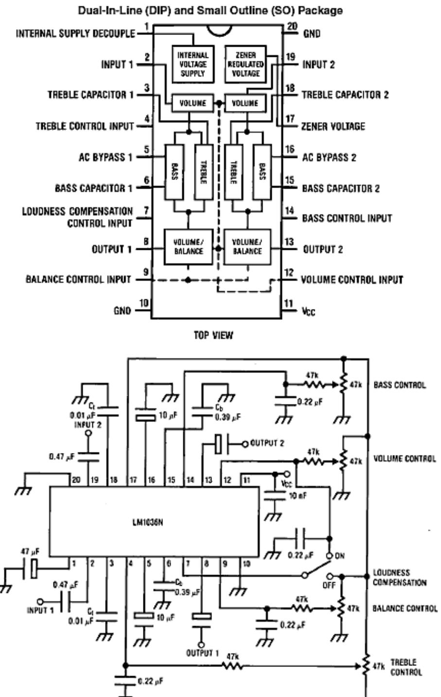

## Amplifiers

# Amplifier Circuits

## Introduction to Impedance and Bandwidth Control.

#### What you'll learn in Module 4.

Section 4.0 Introduction to Impedance and Bandwidth Control.

• Recognise the need for changing the shape of an amplifier's frequency response.

Section 4.1 Input Compensation.

• Describe typical input correction circuits.

Section 4.2 Amplifier Controls.

• Describe typical tone control circuits.

Section 4.3 Amplifiers and Impedance.

• Describe typical circuits for controlling impedance.

Section 4.4 NFB Quiz.

 • Test your knowledge & understanding of impedance and tone control in audio amplifiers.

#### Modified Response Curves

Previous modules have concentrated on producing a flat frequency response over the required audio frequency range. It is sometimes necessary however, to modify the flat response of an audio amplifier by making

particular stages of the amplifier frequency dependent. This can be achieved by modifying either the response of one or more of the amplifier stages, or the response of a negative feedback path.

Fig. 4.0.1 shows (shaded green) stages where such modification will take place, the remaining stages having a flat response curve.

#### Modifying Input and Output Impedance.

The importance of an amplifier's input and output impedance is discussed in AC Theory Module 7, and using NFB to control impedance is described in Amplifiers Module 3.2.

Module 4.3 describes some other amplifier circuits that are commonly used to control the values of input and output impedances in amplifier circuits.

AMPLIFIERS MODULE 04.PDF 1 © E. COATES 2007 -2012

### Module 4.1 Amplifier Input Compensation

#### Input Compensation

Pre amplifiers are designed to increase the signal voltage amplitude of input devices to a level suitable for the input to a power amplifier. Pre-amplifiers often need a number of different inputs, each with a different gain and/or different input impedance. This is to ensure that each device connected to the various inputs provides (after pre-amplification) an output level sufficient to drive the input of a power amplifier and provide full power (when full volume is used) and minimum noise.

#### Line Level

This pre amplifier output is usually called 'Line level' and most amplifiers will have a line in and a line out socket, on PC sound cards these are normally coloured pale green and light blue respectively. The actual line level measured in volts varies between different types of equipment but is around 1Vpp on consumer equipment to 2.5Vpp on professional equipment. With some input devices such as CDs or radio tuners, little or no pre-amplification is needed but devices such as microphones, phono inputs and guitar pickups provide much lower signal levels and need specially adapted inputs to the preamplifier.

**Input Compensation** 

#### Phono Inputs

Inputs for phono cartridges used for playing legacy vinyl discs have an output of only a few millivolts and so need substantial amplification to reach line level. They also need the frequency response to be modified, due to the 'pre-emphasis' applied to these discs during recording.

Fig. 4.1.1 shows a two stage pre-amplifier circuit in which the negative feedback is applied via resistors selected by the input selector switch, allowing different gain levels to be set by choosing one of three resistors (R7, R8 or R9) which will form a potential divider with R3 to set the gain.

R9 (selected in the 'phono' position of SW1) also has capacitors connected in series and in parallel with it to form a frequency selective network. The phono input is designed to accept a low level input from a record pick up.

#### RIAA Pre-emphasis

Vinyl discs recorded to the RIAA (Recording Industry Association of America) standard have the high frequency end of their spectrum excessively amplified during the recording process and the lower frequencies reduced in amplitude. This has two main beneficial effects, firstly amplifying the higher frequencies gives a significant improvement in the signal to noise ratio. Vinyl discs are prone to surface noise in the form of a high frequency hiss; increasing the signal amplitude of the higher frequencies during recording makes the HF signal much louder than the hiss, then reducing the amplitude of the boosted high frequencies (the signal along with the hiss) back to a 'normal' level during playback, restores a level frequency response at the same time as reducing the hiss to a much lower level, greatly reducing the apparent surface noise.

A second advantage of reducing the amplitude of the lower frequencies during the recording of vinyl discs, is that it reduces the amount of side-to-side movement required by the groove-cutting stylus and so makes a narrower groove, this allows more information to be recorded on the same diameter disc.

The result of this pre-emphasis is the standard RIAA curve shown in Fig. 4.1.2. This curve governs the amount of pre-emphasis applied and so requires the amplifier to have a similar but opposite sloping 'de-emphasis' curve to produce a flat response.

**Fig. 4.1.2 RIAA Pre-Emphasis Curve** 

## Module 4.2 Amplifier Controls

What you'll learn in Module 4.2

**After studying this section, you should be able to:** 

Understand typical circuits used for tone control in audio amplifiers.

- Tone Control.
- Passive Bass Treble Control.
- Active Bass Treble Control.
- IC control of common amplifier functions.

#### Tone Control

Tone Control, shown in its most basic form in Fig. 4.2.1 provides a simple means of regulating the amount of higher frequencies present in the output signal fed to the loudspeakers. a simple method of achieving this is to place a variable CR network between the voltage amplifier and the power amplifier stages, The value of C1 is chosen to pass the higher audio frequencies, this has the effect of progressively reducing the higher frequencies as the variable resistor slider is adjusted towards the bottom end of the tone control, The minimum level of attenuation of the higher (treble) frequencies is limited by R1, which prevents C1 being connected directly to ground. As the circuit only reduces the high frequency content of the signal it could be called a simple Treble Cut control. The use of these simple circuits is normally restricted to guitar applications or inexpensive radios.

 In hi-fi amplifiers, tone control refers to the boosting or reduction of particular audio frequencies. This may be done to suit the preferences of the listener, not everyone perceives sound in exactly the same way, for example the frequency response of the human ear changes with age. The room or hall in which the sound is reproduced will also affect the nature of the sound. Many techniques are used to alter the sound, and in particular the frequency response of the amplifiers producing the sound. These range from simple RC filters, through passive and active frequency control networks to complex digital signal processing.

#### The Baxandall Tone Control Circuit

The circuit discussed here is an example of the Baxandall tone control circuit, illustrated in Fig. 4.2.2, which is an analogue circuit providing independent control of bass and treble frequencies; both bass and treble can be boosted or cut and with both controls at their mid positions, provides a relatively flat frequency response, as illustrated by the blue 'Level response' graph line in Fig. 4.2.5. The original design, proposed by P. J. Baxandall in 1952, used a valve (tube) amplifier and feedback as part of the circuit to reduce the

considerable attenuation (about −20dB) introduced by the passive network, and to provide true bass and treble boost. There are still many variants of the circuit in use, both as active circuits (with amplification as originally proposed), and as passive networks without an incorporated amplifier. In passive variants of the Baxandall circuit, extra stages of amplification may be used to make up for the approximately −20bB attenuation caused by the circuit.

Read the original 1952 paper "Negative-Feedback Tone Control" by P. J. Baxandall B.Sc.(Eng.) published in "Wireless World" (Now Electronics World)

#### How the Baxandall Circuit Works.

With bass and treble controls set to maximum boost (both wipers at the top of resistors VR1 and VR2), and the inactive components greyed out, the circuit will look like Fig. 4.2.3. Both bass and treble potentiometers that may have either linear or logarithmic tracks depending on the circuit design, are much higher values than other components in the circuit, and so with the VR1 and VR2 wipers set to maximum resistance both potentiometers can be considered to be open circuit. Nor does C4

**Fig. 4.2.3 Maximum Bass & Treble Boost**

contribute to the operation of the circuit because of the high resistance of VR2, and C1 is effectively shorted out by the wiper of VR1 being at the top end of its resistance track.

The full bandwidth of signal frequencies is applied to the input from an amplifier having low output impedance, and the higher frequency components of the signal are fed directly to the output of the tone control circuit via the 2.2nF capacitor C3, which has a reactance of about 3.6KΩ at 20kHz but over 3.6MΩ at 20Hz, so blocks the lower frequencies.

The full band of frequencies also appear at the junction of R1 and C2, which together form a low pass filter with a corner frequency of around 70 to 75 Hz and so frequencies appreciably higher than this (the mid and high frequencies) are conducted to ground via R2.

Having R2 in series with C2 prevents the attenuation of the mid band frequencies exceeding about - 20dB. The lower frequencies are fed to the output via R3. Because R3 has quite a large value (to effectively isolate the effects of the two variable controls from each other, the input impedance (Zin) of the circuit following the tone control must be very high to avoid excessive signal loss due to the potential divider effect of R3 and the Zin of the following stage.

#### Bass and Treble Cut.

With the bass and treble controls both set to maximum cut (Fig. 4.2.4), the full bandwidth signal passes through R1 but with the slider of VR1 at the bottom end of its resistance track, C1/R2 now form a high pass filter having a corner frequency of around 7 to 7.5kHz so only frequencies appreciably higher than this are allowed to pass un-attenuated. The mid and higher frequencies are therefore fed to R3 and C4, which now form a low pass filter to progressively attenuate frequencies above about 70 Hz, the mid-band frequencies (about 600Hz) are reduced by approximately −20dB, and at 20kHz by as much as −43dB, as can be seen from the response curve in Fig 4.2.5.

Notice that although the circuit provides what is called bass boost and treble boost, with the passive version of the Baxandall circuit (with no amplification), all frequencies are in fact reduced.

The attenuation of the circuit at mid-band is typically around −20dB and with full 'boost' applied at either the low or high end of the bandwidth, attenuation at these frequencies would be around −1 to −3dB.

#### Active Baxandall Circuit

To overcome the substantial losses in the passive version of this circuit, which give a level response (with both controls at mid way setting) but at -20dB below the input voltage, it is common to incorporate an amplifier in the designs. Nowadays an op-amp would be a reasonable choice, with the Baxandall network forming a negative feedback loop to give the required gain figures over the necessary bandwidth. Various designs are possible with different values for resistors R1 to R4 and C1 to C4 in the network, depending to some extent on the output impedance of the previous, and input impedance of the following circuits.

**Fig. 4.2.4 The Circuit with VR1 and VR2 at Minimum**

With active circuits such as that shown in Fig. 4.2.6 the aim is to have the level response at 0dB so there is no gain and no loss due to the tone control circuit. The maximum amount of boost possible should not be sufficient to overload any stage following the tone control if distortion is to be avoided. The design of such control circuits is usually therefore, an integral part of the overall design of an amplifier system.

#### Tone Control ICs

In modern amplifiers the tendency is to use integrated circuit controls that may be operated by either digital or analogue circuitry. A simple solution for bass, treble, balance and volume control in analogue stereo amplifiers is offered by such chips as the LM1036 from Texas Instruments.

The block diagram and an application circuit is shown in Fig. 4.2.7. Each of the four controls is adjusted by applying a variable voltage of between 5.4V (which is supplied by pin 17 of the IC), and 0V. Half the voltage applied to the control pins 4, 9, 12 and 14 gives a level frequency response, central balance between left and right channels, and half volume.

The LM1036 also has provision for a loudness compensation switch. When 'on' this changes the action of the controls to boost the bass and treble frequencies when the volume is at a low setting. The purpose of this is to compensate for the fall off in the function of human hearing at high and low frequencies with quiet sounds.

**Fig. 4.2.7 The LM1036 Audio Control IC** 

## Module 4.3 Amplifiers & Impedance

#### What you'll learn in Module 4.3

#### **After studying this section, you should be able to:**

Understand the advantages of controlling input and output impedance in amplifiers.

Understand typical circuits used to increase amplifier input impedance.

- JFET inputs.
- The Darlington Pair.
- Bootstrapping

Understand typical circuits used to reduce amplifier output impedance.

• Emitter Follower stages

Amplifier Impedance

The input and output impedances of an amplifier are very important parameters that affect the overall gain in multi-stage amplifiers.

AC Theory Module 7.2 describes how correct matching reduces signal loss between the output of one amplifier and the input of the next in multi stage amplifiers. This section looks at practical methods of obtaining suitable input and output impedances where amplifiers interface with typical input and output devices such as microphones and loudspeakers.

Audio input sources, such as microphones; pick-ups, radio tuners etc. can have impedances ranging from a few hundred ohms to several thousand ohms. Where audio amplifier inputs may have to cater for a number of different input sources, switch selectable inputs to compensate for specific input devices, as described in Amplifiers Module 4.1.

The final (output) stage in a multi-stage amplifier has to drive a 'transducer', which will convert the electrical signal energy produced by the amplifier into some other useful form. For example the electrical waves produced by an audio amplifier will be converted into sound (air pressure) waves by a loudspeaker. A radio frequency (RF) amplifier in a transmitter may be used to drive an antenna (aerial), or a DC amplifier may be driving an electric motor or a relay. Any or all of these transducers may have quite low impedances and require considerable amounts of signal current or power, rather than large signal voltages to operate them. Therefore the output stage of an amplifier may need to have a low output impedance, much lower than would be possible using the common emitter voltage amplifiers described in Amplifiers Module 4.1 to 4.3.

This section describes some types of current and voltage amplifier circuits commonly used to modify input and output impedances. Power output stages are described in Amplifiers Module 5.

#### FET Input Stage

Where very high impedance and low noise is required in an amplifier input, it is common to use a field effect transistor (FET) in an amplifier's input stage. Very high input impedance is obtainable with JFETs as its gate is voltage, rather than current operated. Therefore the JFET takes hardly any current from the device connected to the amplifier input. Even higher input impedances are available where MOSFETs with insulated gate construction (IGFETs) are used. Although FETs generally have less voltage gain and less bandwidth than BJT transistors they also create much less internally generated noise, which makes them ideally suited for use in the early stages of an amplifier, where good signal to noise ratio is important.

**Fig. 4.3.2 High Impedance JFET Input Stage** 

#### Operation

Because the input resistance of the JFET is extremely high, the input impedance of the circuit is approximately the value of R1, and as practically no current is flowing into the input, there is no potential across R1, therefore the gate of Tr1 is effectively at zero volts. To operate correctly, the gate of the N channel JFET must be more negative than the source, this is achieved by making the source of Tr1 positive. The signal applied to the gate will then vary the gate voltage and so vary the drain current through the JFET. The biasing of the JFET is set by R2 and R3. As JFET gain is not particularly high, extra gain is provided by the PNP transistor Tr2. The overall gain of the two-stage amplifier is set at approximately 11 by the negative feedback provided by R4 and R5.

#### Decoupling

In Fig 4.3.2, R3 is decoupled by C2 so that the bottom end of R4 is effectively at ground potential as far as AC is concerned, the value of C2 is not particularly large in this circuit, as the larger the value of electrolytic capacitor the more noise it will produce, and the aim of the circuit is to keep internally generated noise to a minimum. C1 and C4 coupling capacitors, (also relatively small values) provide isolation from any DC

**(From Fig 4.3.2)** 

voltages present on any connected circuits. Using a very high value for R1 produces a high input impedance but the higher the value, the more prone the circuit will be to instability and oscillation. To prevent this possibility, effective decoupling from other circuits and the supply is necessary, decoupling here is provided by R6 and C3 as shown in Fig. 4.3.3.

Common emitter amplifiers generally have a medium to high output impedance, the value depending mainly on the value of load resistor in the final stage of amplification. Many typical transducers, such as loudspeakers, relays, motors etc. are inductive devices having a low impedance of only a few ohms.

Connecting such devices to the output of a voltage amplifier with a load resistance of several thousand ohms will result in poor impedance matching with practically the whole of the output being developed across the load resistor instead of across the load. One answer to this problem is to reduce the output impedance by using an emitter follower, which is a single transistor connected in common collector mode.

**or Emitter Follower** 

#### Common Collector Mode

This configuration uses the collector lead as the common connection for input and output. In the circuit (Fig. 4.3.4) the input to the transistor is connected between base and ground, and the output is connected across the load resistor between emitter and ground. Remember that with the collector connected directly to the supply, the collector is at ground potential as far as AC is concerned, because of the presence of large decoupling capacitors connected between supply and ground.

The common collector amplifier is called an emitter follower because the output, taken from the emitter is in phase with and 'follows' the input voltage at the base. In fact the base and emitter voltages are almost identical so the emitter follower has a voltage gain of 1 (in practice, slightly less) because of the 100% negative feedback created by the emitter load resistor not being decoupled, as would be the normal case in a common emitter amplifier. This causes the full amplitude of the output signal to be fed back to the base, giving a closed loop gain β of 1.

The emitter follower is therefore of no use as a voltage amplifier. It does however, have other very useful properties. Its current gain is large, and approximately equals the current gain (hfe) of the transistor. The input impedance of the circuit is high, 100KΩ or more being typical, although this will depend to some extent on the value of the base bias resistor R1 in Fig. 4.3.4, which is in parallel with the input resistance of the transistor, but this shunting effect can be reduced by 'Bootstrapping'. The output impedance of the circuit is very low, typically in the region of 50Ω. Because of its use in matching relatively high output impedance voltage amplifiers to low impedance loads, the emitter follower may also be called a 'Buffer Amplifier'.

#### The Emitter Follower as a Voltage Regulator

Another use for the emitter follower is as a voltage regulator, and is useful in power supplies where a small voltage can be used to regulate a large current., as shown in Fig. 4.3.5. This circuit ensures that the regulated 5 volt supply remains at the correct voltage even if the 12 volt supply changes. An accurate five volts is also maintained for a range of currents drawn by the circuit being supplied. Regulation can be achieved just using a resistor and Zener diode combination but much higher currents can be handled when an emitter follower is used.

Notice in Fig.4.3.5 that the Zener diode has a voltage rating of 5V6 (meaning 5.6volts), this will maintain the base of the transistor at that voltage, and the emitter of the transistor at 0.6V below the base voltage, will be maintained at 5 volts. A small current maintaining the base voltage at 5.6V is therefore able to accurately control a much larger current flowing through the collector and emitter.

The emitter follower circuit is also the basis of many push-pull class B and class AB power output amplifier stages described in Amplifiers Module 5

#### The Darlington Pair

The effect of a high input impedance is to reduce the input current to the amplifier. If the input current for a given input voltage is reduced by whatever method, the effect is to increase the input impedance. The emitter follower has a high input impedance, but this may be reduced to an unacceptable level by the presence of the base bias resistor.

However another circuit, the compound or Darlington pair shown in Fig. 4.3.6 can greatly increase input impedance. By using one emitter follower (Tr1) to drive another (Tr2) the overall current gain becomes the product of the individual gains, hfe1 x hfe2 and can be typically 1000 or more. This greatly reduces the signal current required by the base of Tr1 and thereby dramatically increases the input impedance.

**Fig. 4.3.6 The Emitter Follower Converted to a Darlington Pair**

**Fig. 4.3.7 The Darlington Pair with Common Emitter Output**

Darlington amplifiers are also available in integrated circuit form, such as the ULN2803, which contains eight high current, Darlington amplifiers with open collector outputs, for interfacing between TTL (5V) logic circuits and high current/high voltage (up to 500mA and 50V) devices. When pin 10 is connected to +V each output is diode protected for driving inductive loads against back e.m.f.

#### Bootstrapping

Bootstrapping (Using positive feedback to feed part of the output back to the input, but without causing oscillation) is a method of apparently increasing the value of a fixed resistor as it appears to A.C. signals, and thereby increasing input impedance. A basic bootstrap amplifier is shown in Fig. 4.3.8 where capacitor CB is the 'Bootstrap Capacitor', which provides A.C. feedback to a resistor in series with the base. The value of CB will be large, about 10 x the lowest frequency handled x the value of the series resistor (10ƒminR3).

**to an Emitter Follower** 

Although positive feedback is being used, which would normally cause an amplifier to oscillate, the voltage gain of the emitter follower is less than 1, which prevents oscillation.

In Fig. 4.3.8 the base of the emitter follower is biased from a potential divider via R3. By feeding the output waveform back to the left hand side of R3 the voltage at this end of R3 is made to rise and fall in phase with the input signal at the base end of R3.

Because the output waveform of the emitter follower is a slightly less amplitude than the base waveform (due to the less than 1 gain of the transistor) there will be a very small signal current waveform across R3. Such a small current waveform suggests a very small current is flowing; therefore the resistance of R3 must be very high, much higher than in fact it is. The input impedance of the amplifier has therefore been increased.

The effective A.C. value of R3 is increased by R3 ÷ (1 −Ao) where Ao is the open loop gain of the amplifier.

For example a 47KΩ resistor with bootstrapping would appear to be:

$$\text{The \text{\textbullet}\text{\textbullet}\text{\textbullet}\text{\textbullet}\text{\textbullet}\text{\textbullet}\text{\textbullet}\text{\textbullet}\text{\textbullet} = \text{R3}^\circ, = \frac{\text{R3}}{(1 - \text{R3}^\circ)}$$

So if AO = 0.98 the apparent value of R3 would be 47 x 103 ÷ (1- 0.98) = 2,35MΩ

The main drawback of this method of increasing input impedance compared with other methods is that the use of positive feedback is likely to increase noise and distortion.

## Amplifier Circuits Module 4.4 Amplifier Circuits Quiz 4

Try our quiz, based on the information you can find in Amplifier Circuits Module 4. You can check your answers at:

http://www.learnabout-electronics.org/Amplifiers/amplifiers44.php

#### 1.

What would be the function of the control circuit shown in Fig. 4.4.1 in an audio amplifier?

- a) Volume.
- b) Balance.
- c) Treble boost.
- d) Tone.

#### 2.

What is the purpose of RIAA de-emphasis in an audio pre-amplifier?

- a) To provide correct impedance matching on a MIC input.
- b) To provide D to A conversion on a CD input.
- c) To provide frequency correction on a PHONO input.
- d) To provide level correction on a line level output.

#### 3.

When the bass and treble controls in a Baxandall passive tone control circuit are set at their mid point, what will be the approximate voltage gain of the tone control circuit?

a) -3dB b) -6dB c) -20dB d) -40dB

#### 4.

Complete the following sentence: Compared with a bipolar transistor, using a JFET transistor in the input stage of an audio amplifier instead of a bipolar transistor provides...

- a) ...higher input impedance and reduced signal to noise ratio.
- b) ...higher input impedance and increased signal to noise ratio.
- c) ...higher gain and increased signal to noise ratio.
- d) ...higher gain and reduced signal to noise ratio.

#### 5.

Bootstrapping in an amplifier circuit refers to which of the following techniques?

- a) Using positive feedback to increase the apparent input impedance of the amplifier.
- b) Using negative feedback to increase the apparent input impedance of the amplifier.
- c) Using negative feedback to reduce the apparent output impedance of the amplifier.
- d) Using positive feedback to increase the stability of the amplifier.

#### 6.

Which of the following features does the circuit illustrated in Fig. 4.4.2 possess?

- a) High voltage gain and very high input impedance.
- b) Low voltage gain and very high output impedance.
- c) High current gain and very high input impedance.
- d) Low current gain and very high output impedance.

#### 7.

Refer to Fig 4.4.3. If the real value of R3 is 33KΩ and the open loop gain of the emitter follower amplifier (AO) is 0.98, what will be the apparent value R3B of R3 due to the bootstrapping

- a) 1.65MΩ
- b) b) 2.35MΩ
- c) c) 3.27MΩ
- d) d) 230.5KΩ

Now check your answers at:

http://www.learnabout-electronics.org/Amplifiers/amplifiers44.php