# **Bandgap Reference Verification**

**Rapid Adoption Kit (RAK)**

Product Version: IC6.1.8 ISR21, Spectre20.1 ISR10 December 2021

#### Copyright Statement

© 2021 Cadence Design Systems, Inc. All rights reserved worldwide. Cadence and the Cadence logo are registered trademarks of Cadence Design Systems, Inc. All others are the property of their respective holders.

# **Contents**

| Purpose4                     |
|------------------------------|
| Audience4                    |
| Tool Versions4               |
| Overview4                    |
| Setting Up the RAK Database5 |
| 6                            |
| 30                           |
| 41                           |
| Measurement of Bandgap51     |
| 59                           |
| Supports59                   |
| 59                           |
|                              |

### <span id="page-3-0"></span>**Purpose**

This RAK introduces Bandgap Reference Voltage supply variation across PVT corners, PSRR, Stability, and Transient Noise setup examples. The document helps understand the usage of dc/dc with temperature sweep, ac, stb, and transient noise analysis to measure the various Bandgap design specifications based on different testbench setups.

### <span id="page-3-1"></span>**Audience**

This RAK is intended for ADE Explorer and Spectre users who want to measure Bandgap variations, Stability, PSRR, and Transient Noise of a Bandgap.

## <span id="page-3-2"></span>**Tool Versions**

This RAK has been verified using IC 6.1.8 ISR21 and Spectre20.1 ISR10 with Spectre/SpectreX Mode.

### <span id="page-3-3"></span>**Overview**

### **1.1 Design Example**

Bandgap references (BGR) are fundamental circuits, which are used to provide reference supply that has little dependence on temperature (temperature independent).

You can generate a temperature-independent quantity (Voltage and Current) by summation of Negative-temperature coefficient quantity and Positive-temperature coefficient quantity.

It has been implemented using the Cadence generic PDK 45nm CMOS process.

The key analog components of the BGR are the Positive-temperature coefficient and Negative-temperature coefficient generation with BJT used as diode, OpAmp, and startup circuit.

### **1.2 Lab Overview**

BGRs are fundamental circuits that are used to provide reference supply (temperature independent) in integrated circuits.

The Bandgap circuit used in this RAK is based on the voltage summing topology.

• Temperature sweep analysis determines temperature variations on the output reference supply.

Learn more at Cadence Learning and Support Portal - https://support.cadence.com © 2021 Cadence Design Systems, Inc. All rights reserved worldwide. Page 4

- Loop gain and phase determine whether a negative-feedback loop of a BGR is stable.
- PSRR is a measure of the influence of power supply ripple on the BGR output voltage.
- Generally, several devices contribute towards the noise in a BGR circuit. Transient noise calculates the effects of large signals on virtually any system. It also determines the impact of noise in the time domain.

This RAK consists of examples on the following topics:

- Measurement of temperature variation using dc sweep analysis
- PSRR of a BGR using ac analysis
- Loop gain and phase margin of a BGR using stability analysis
- Large signal noise of a BGR using transient noise analysis

### <span id="page-4-0"></span>**Setting Up the RAK Database**

Action 1: Unzip and untar the TB\_BGR.tar.gz database.

Unix> tar -zxvf TB\_BGR.tar.gz

Action 2: Navigate to the TB\_BGR directory.

Unix> cd TB\_BGR

### <span id="page-5-0"></span>**Lab 1: Output Variation Measurements Using DC Analysis**

- DC analysis (temperature sweep) is used to measure the BGR output variation and accuracy (V/°C).
- DC analysis finds the DC operating-point or DC transfer curves of the circuit. To generate transfer curves, specify a parameter and a sweep range.
- Circuit temperature is used as a swept parameter.

Action 1: Invoke **Virtuoso**.

Unix> virtuoso &

- Action 2: Open the Library Manager from the CIW window by navigating to **Tools > Library Manager**.
- Action 3: From the Library Manager, open the **TB\_BGR > tb\_bgr > schematic** view.

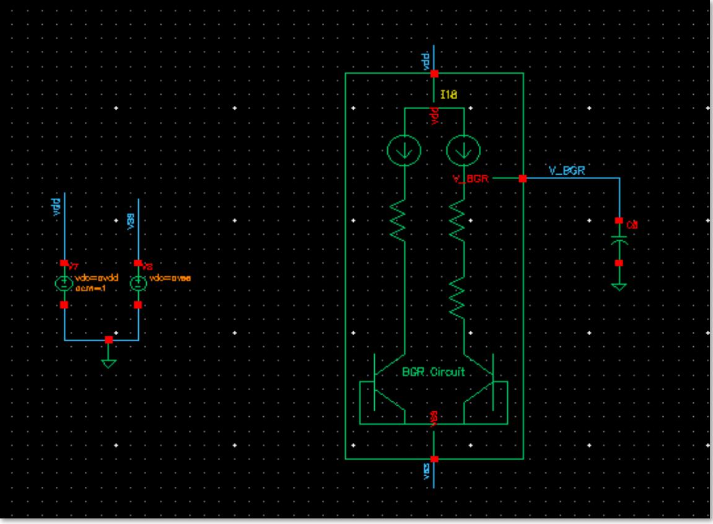


- Action 4: From the schematic, select **Launch > ADE Explorer**.
- Action 5: In the **Launch ADE Explorer** window, select **Create New View** and click **OK**.

| Launch ADE Explorer                   | 1 |
|---------------------------------------|---|
| ADE Explorer                          |   |
| Create New View! O Open Existing View |   |
| Help<br>OK<br>Cancel                  |   |

**Figure 2: Launching ADE Explorer from schematic window**

Action 6: In the **Create new ADE Explorer view** window, select **Library > TB\_BGR**, **Cell > tb\_bgr**. Type the view as maestro\_Dc and click **OK**.

| Library           | TB BGR                                              |
|-------------------|-----------------------------------------------------|
| Cell              | tb_bgr                                              |
| View              | maestro_Dc                                          |
| lype              | maestro                                             |
| Application       |                                                     |
| Open with         | ADE Explorer                                        |
|                   | _ Always use this application for this type of file |
| Library path file |                                                     |
|                   | I/BGR_Verification_Workshop/cds . lib               |
|                   | Open in new tab current tab O new window            |

**Figure 3: Opening maestro\_Dc view of tb\_bgr cell** 

The **ADE Explorer** window opens as shown in Figure 4.

| Ci                                                                                                                                                                                                                                                                                                       | Virtuoso® ADE Explorer Editing: TB_BGR tb_bgr maestro_Dc                                                          | ×■×                                      |
|----------------------------------------------------------------------------------------------------------------------------------------------------------------------------------------------------------------------------------------------------------------------------------------------------------|-------------------------------------------------------------------------------------------------------------------|------------------------------------------|
|                                                                                                                                                                                                                                                                                                          | cadence<br>Launch Session Setup Analyses Variables Outputs Simulation Results Tools EAD Parastics/LDE Window Help |                                          |
| 奥德 德 27 %                                                                                                                                                                                                                                                                                                | Co Replace (None) (None) 7                                                                                        |                                          |
| 3 円×<br>Setup                                                                                                                                                                                                                                                                                            | # tb_bgr x   = maestro_Dc X                                                                                       |                                          |
| Name<br>Value<br>▶<br>▼ Filter<br>Filter<br>TB_BGR_tb_bgr_1<br>Simulator spectre<br>Analyses<br>Click to add analysis<br>Design Variables<br>Click to add variable<br>Parameters<br>ਦਿ<br>><br>Corners<br>><br>F<br>Reliability Analyses<br>+<br>Monte Carlo Sampling<br>ಿ<br>Checks/Asserts<br>4<br>120 | Name<br>Details<br>Type<br>пиц.                                                                                   | ရှိ AC  ဝိပ်လ   ဝိပ်လ<br>न<br>▼ × な<br>* |
| limouse L:<br>1(3)                                                                                                                                                                                                                                                                                       | M:                                                                                                                | R:                                       |
|                                                                                                                                                                                                                                                                                                          | TB_BGR tb_bgr schematic   Simulator: spectre aps                                                                  |                                          |

**Figure 4: ADE Explorer window showing maestro\_Dc view of tb\_bgr cell** 

Action 7: In the **ADE Explorer** window**,** select **Setup > Model Libraries** as shown in Figure 5.


 **Figure 5: Opening Model Library Setup form from ADE Explorer window**

The **Model Library Setup** form opens as shown in Figure 6.

Action 8: Browse the **gpdk045.scs** model file in the **Model File** section.

Action 9: Set the **Section** to **tt** in the **Model Library Setup** form. Then, click **OK**.

| spectre0: Model Library Setup             |                           |  |
|-------------------------------------------|---------------------------|--|
| Model File                                | Section                   |  |
| E-Global Model Files                      |                           |  |
| /gpdk045_v_3_5/models/spectre/gpdk045.scs | itt                       |  |
| { < Click here to add model file>         |                           |  |
|                                           |                           |  |
|                                           |                           |  |
|                                           |                           |  |
|                                           |                           |  |
|                                           | Cancel Apply   Help<br>OK |  |

**Figure 6: Set model file in Model Library Setup form**

Action 10: In the ADE Explorer **Setup** assistant, select **Click to add analysis** in the **Analyses** section of the **Setup** assistant.

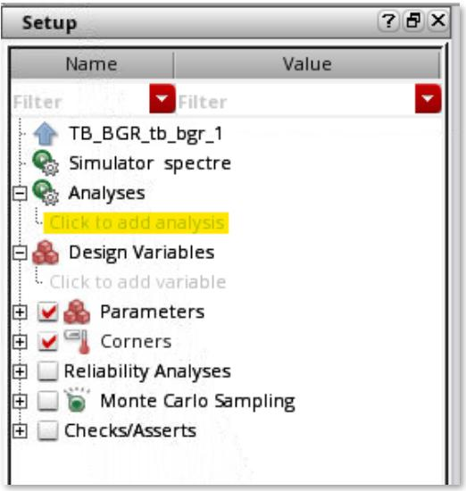

**Figure 7: Opening 'Analyses' form from 'Click to add analysis'**

Action 11: In the **Choosing Analyses** form, select the **dc** analysis with the following setup. Then, click **OK**:

- Enable **Save DC Operating Point**.
- Select **Sweep Variable** as **Temperature**.
- For **Sweep Range**, set **Start** to **-40** and **Stop** to **120**.
- Choose **Linear** for **Sweep Type** with step size of **10**.

|                     |                         |             | Choosing Analyses -- ADE Explorer | ×          |
|---------------------|-------------------------|-------------|-----------------------------------|------------|
| Analysis            | C tran                  | O dc        | ac                                | noise<br>D |
|                     | xf                      | sens        | dcmatch O                         | acmatch    |
|                     | stb                     | pz          | If                                | Sp         |
|                     | envip                   | bss         | pac                               | pstb       |
|                     | pnoise                  | D<br>pxf    | psp                               | dbss       |
|                     | qpac                    | qpnoise     | qpxf<br>D                         | dbsp       |
|                     | hb                      | hbac        | hbstb                             | hbnoise    |
|                     | hbsp                    | hbxf        |                                   |            |
|                     |                         | DC Analysis |                                   |            |
|                     | Save DC Operating Point | >           |                                   |            |
| Hysteresis Sweep    |                         |             |                                   |            |
|                     |                         |             |                                   |            |
| Sweep Variable      |                         |             |                                   |            |
|                     | Temperature             |             |                                   |            |
|                     | Design Variable         |             |                                   |            |
|                     | Component Parameter     |             |                                   |            |
|                     |                         |             |                                   |            |
|                     | Model Parameter         |             |                                   |            |
|                     |                         |             |                                   |            |
| Sweep Range         |                         |             |                                   |            |
| Start-Stop          |                         |             |                                   |            |
| Center-Span         |                         | Start -40   | Stop                              | 120        |
|                     |                         |             |                                   |            |
| Sweep Type          |                         |             |                                   | 10         |
|                     |                         | Step Size   |                                   |            |
| Linear              |                         |             | Number of Steps                   |            |
| Add Specific Points |                         |             |                                   |            |
| Add Points By File  |                         |             |                                   |            |
| Enabled<br>>        |                         |             |                                   | Options    |

 **Figure 8: Setup of DC-Sweep Analysis**

Action 12: In the **ADE Explorer** window, select **Outputs > Save All** as shown in Figure 9.

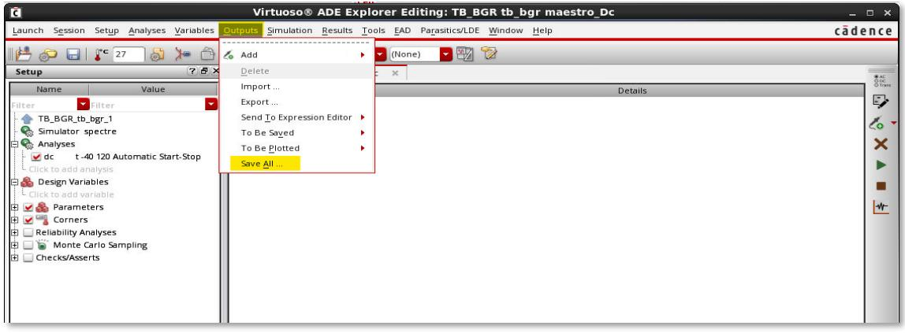


Action 13: Enable **all** for **Select device currents**. For **Select signals to output**, **allpub** will be enabled by default. Then, click **OK**.

|                                   | Save Options<br>X                           |                                                  |  |  |  |  |
|-----------------------------------|---------------------------------------------|--------------------------------------------------|--|--|--|--|
| Basic                             | Save By Subckt                              |                                                  |  |  |  |  |
|                                   | Save Options                                |                                                  |  |  |  |  |
|                                   | Select signals to output (save)             | _ none _ selected _ Ivipub         allpub  _ all |  |  |  |  |
|                                   | Select power signals to output (pwr)        | _ none _ total _ devices _ subckts _ all         |  |  |  |  |
|                                   | Set level of subcircuit to output (nestlyl) |                                                  |  |  |  |  |
| Select device currents (currents) |                                             | _ selected _ nonlinear y all   _ none            |  |  |  |  |
|                                   | Select AC terminal currents (useprobes)     | _ yes _ no                                       |  |  |  |  |
|                                   | Subcircuit Probe Level (subcktprobelvl)     |                                                  |  |  |  |  |
|                                   | Select AHDL variables (saveahdlvars)        | selected all                                     |  |  |  |  |
|                                   | Transient Time Window Options               |                                                  |  |  |  |  |
|                                   | Transient time window save options          | Time Setup                                       |  |  |  |  |
|                                   |                                             |                                                  |  |  |  |  |

#### **Figure 10: Setting save options**

Action 14: In the **ADE Explorer** window, click on **Variables** and select **Copy From Cellview** as shown in Figure 11.

Action 15: Set **avdd** to **2**.

Action 16: Set **avss** to **0**.

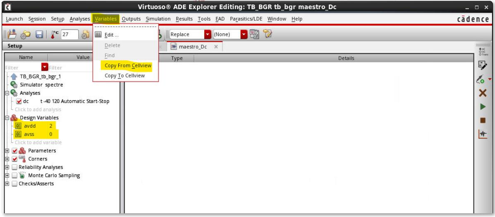

#### **Figure 11: Copying variables from cell view**

- Action 17: In the **ADE Explorer** window, click on the green arrow button to **netlist and run** the simulation.
- Action 18: In the **ADE Explorer** window, choose **Results > Direct Plot > Main Form** to open the **Direct Plot** form as shown in Figure 12.

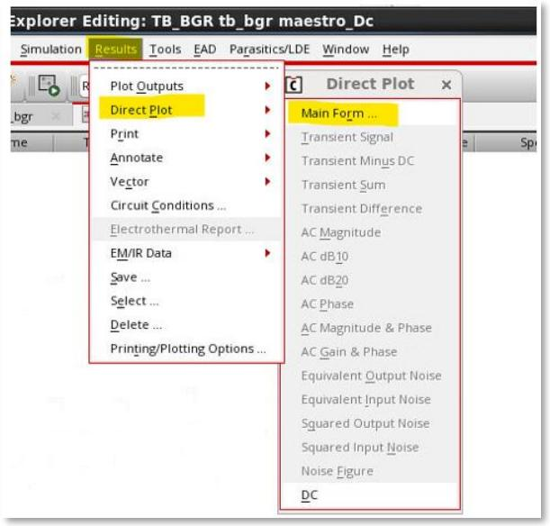

**Figure 12: Opening Direct Plot Form from ADE Explorer**

- Action 19: To plot BGR\_output, select **Voltage** as **Function**, **Net** as **Select** from the drop-down list.
- Action 20: Enable the **Add To Outputs** checkbox. Select the **V\_BGR** net from the schematic window.

|                                   | Direct Plot Form                 | 2 |
|-----------------------------------|----------------------------------|---|
| Plotting Mode<br>Analysis<br>O dc | Append                           |   |
| Function                          |                                  |   |
| 0<br>Voltage                      | Voltage Ratio                    |   |
| Current                           | Current Ratio                    |   |
| Power                             | Power Ratio                      |   |
|                                   | Transresistance Transconductance |   |
| Net<br>Select                     |                                  |   |
| ટી<br>Add To Outputs              |                                  |   |
| > Select Net on schematic         |                                  |   |
|                                   | Help<br>Close                    |   |

 **Figure 13: Direct Plot Form** 

The plot appears as shown in Figure 14. If the waveform is plotted in the docked VIVA

assistant within Explorer/Assembler, you can undock it by clicking on .

Action 21: Add a delta marker by hovering over the peak of the plot and pressing the **A** bindkey.

Action 22: Hover over the lowest part of the curve and press the **B** bindkey.

A delta marker will be added like the one shown below.

The v("/V\_BGR" ?result "dc") expression is also added to the **Outputs Setup** table in the **maestro\_Dc** view.

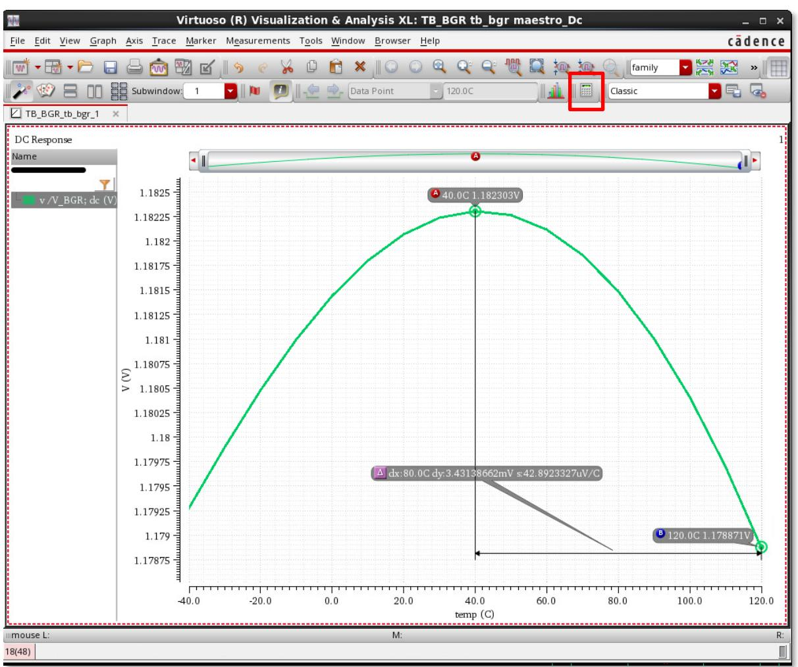

**Figure 14: BGR output plot with temperature sweep DC analysis**

Action 23: Select the **/V\_BGR** plot on ViVA and click the calculator icon as shown in Figure 14.

The **ViVA calculator** window will open with the v("/V\_BGR" ?result "dc") expression as shown in Figure 15.

| Virtuoso (R) Visualization & Analysis XL calculator                                                                                                                                                      |  |  |  |  |  |  |  |  |  |
|----------------------------------------------------------------------------------------------------------------------------------------------------------------------------------------------------------|--|--|--|--|--|--|--|--|--|
| File Tools View Options Constants Help                                                                                                                                                                   |  |  |  |  |  |  |  |  |  |
| In Context Results DB:<br>/TB_BGR/tb_bgr/maestro_Dc/results/maestro/ExplorerRun.0/1/TB_BGR_tb_bgr_1/psf                                                                                                  |  |  |  |  |  |  |  |  |  |
| app plot erplot   average cross dB20 sqrt ymax                                                                                                                                                           |  |  |  |  |  |  |  |  |  |
| Ovs O os O op O ot O mp<br>0<br>vf<br>Ovdc<br>Ovn<br>D<br>U zm<br>D<br>vt<br>sp<br>O vswr U hp<br>TB_BGR_tb_bgr_1<br>O it<br>O if   O idc<br>O var<br>0 vn2<br>O is<br>O opt<br>Uzp Uyp<br>Ogd<br>O data |  |  |  |  |  |  |  |  |  |
| ● Off ○ Family ○ Wave   Clip   - Append<br>7 366 日<br>▼ Rectangular                                                                                                                                      |  |  |  |  |  |  |  |  |  |
| ದಿಸ<br>Key P<br>v "/V_BGR" ?result "dc")<br>7<br>8<br>9                                                                                                                                                  |  |  |  |  |  |  |  |  |  |

**Figure 15: ViVA-XL calculator window**

Action 24: Select the **ymax** function from the **Functional Panel** window.

| Function Panel                                                                                         |                                                                              |                                                                                                                |                                                                                                    |                                                                                                 |                                                                       |                                                                                                                        |                                                     |  |
|--------------------------------------------------------------------------------------------------------|------------------------------------------------------------------------------|----------------------------------------------------------------------------------------------------------------|----------------------------------------------------------------------------------------------------|-------------------------------------------------------------------------------------------------|-----------------------------------------------------------------------|------------------------------------------------------------------------------------------------------------------------|-----------------------------------------------------|--|
| Special Functions<br>T fx                                                                              |                                                                              |                                                                                                                |                                                                                                    |                                                                                                 |                                                                       |                                                                                                                        |                                                     |  |
| PN<br>aaSP<br>abs_jitter<br>analog2Digital<br>average<br>bandwidth<br>busTransition<br>calcVal<br>clip | cross<br>d2a<br>dBm<br>delay<br>delayMeasure<br>deriv<br>dff<br>dftbb<br>dnl | eyeDiagram<br>eyeHeightAtXY<br>eyeWidthAtXY<br>fallTime<br>firstVal<br>flip<br>fourEval<br>freq<br>freq_jitter | getData<br>groupDelay<br>harmonic<br>harmonicFreq normalQQ<br>histogram2D<br>iinteg<br>in<br>integ | astval<br>loadpull<br>lshift<br>normalQQPValue pstddev<br>num Conv<br>overshoot<br>pavg<br>peak | pow<br>prms<br>psd<br>psdbb<br>pzbode<br>pzfilter<br>rise lime<br>rms | sample<br>settlingTime<br>skewness<br>slewRate<br>spectralPower<br>spectrumMeas ymax<br>stodev<br>swapSweep<br>tangent | value<br>waveVsWave<br>xmax<br>xmin<br>xval<br>ymin |  |
| compare<br>compression<br>compressionVRI<br>convolve                                                   | dutyCycle<br>evmQAM<br>evmQpsk<br>eyeAperture                                | frequency<br>gainBwProd<br>gainMargin<br>getAsciiWave                                                          | intersect<br>ipn<br>ipnVRI<br>kurtosis                                                             | peakToPeak<br>period_jitter<br>phaseMargin<br>phaseNoise                                        | rmsNoise<br>root<br>rshift                                            | thd<br>rms_jitter triggeredDelay<br>unityGainFreq<br>V                                                                 |                                                     |  |

#### **Figure 16: Functional Panel of ViVA-XL calculator**

The expression will become ymax(v("/V\_BGR" ?result "dc")) as shown in Figure 17.

Action 25: In the **ViVA calculator** window, click on the **Send buffer expression to ADE output** icon .

The expression is added to the **ADE Output Setup** table.

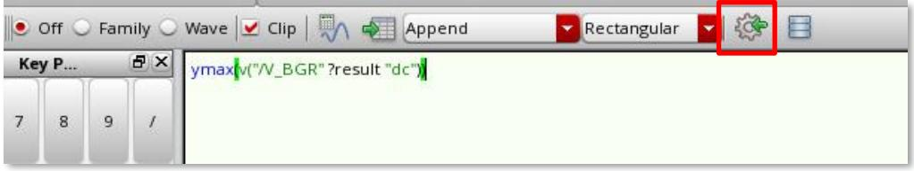

**Figure 17: ViVA-XL calculator buffer**

Action 26: Repeat this to add the following expression to the **ADE Output Setup** table:

ymin(v("/V\_BGR" ?result "dc"))

|                | · Off O Family O Wave   Clip   Append | Rectangular<br>> | 费目 |
|----------------|---------------------------------------|------------------|----|
| Key P          | BX   ymin v("/V_BGR" ?result "dc")    |                  |    |
| 79<br>8<br>9 / |                                       |                  |    |

**Figure 18: ViVA-XL calculator buffer**

Action 27: In the **ViVA calculator** window, write the following expression:

```
ymax(v("/V_BGR" ?result "dc")) - ymin(v("/V_BGR" ?result 
"dc"))
```
Action 28: Add this expression in the **ADE maestro** view using the **Send buffer expression to ADE output** icon.

Action 29: Evaluate the expression value using the **Evaluate the buffer** icon.

|   |               |   | · Off O Family C Wave & Clip   Append |                                                                     | ▼ Rectangular | 1 |
|---|---------------|---|---------------------------------------|---------------------------------------------------------------------|---------------|---|
| 7 | Key P  .<br>8 | 9 |                                       | (0)X] ymax(v("/V_BGR" ?result "dc"))-ymin(v("/V_BGR" ?result "dc")) |               |   |

#### **Figure 19: ViVA-XL calculator buffer**

Action 30: In the **ADE Explorer** window, double-click on the **Name** column for the v("/V\_BGR" ?result "dc") expression and type in the name BGR\_output as shown in Figure 20.

Action 31: Similarly, add the name BGR\_variation for the last expression.

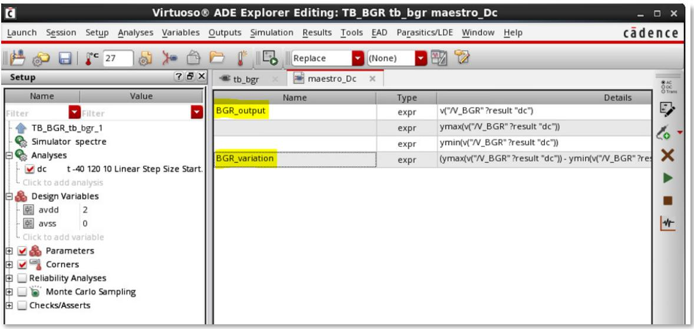

**Figure 20: ADE maestro\_Dc view**

Action 32: Close the **ViVA** window.

Action 33: In the **ADE Explorer** window, click on the **Add outputs** icon and select **OP Parameters**.

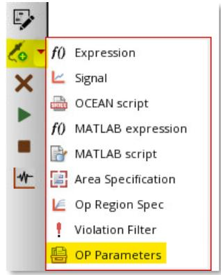

#### **Figure 21: Adding operating point parameters in output**

This adds an operating parameter expression row.

- Action 34: Click on the **select operating point instances icon** to open the schematic.
- Action 35: Descend into the BGR\_circuit schematic and select the **M12** pmos instance.

| 25, 815, 815, 35, 815, 8 |  |
|--------------------------|--|

This adds the **/I18/M12** instance.

Action 36: Now, click on the **Select operating point parameters** icon to open the **Select OP Parameters** form.

| oppoint //118/M12 |  |                                   |
|-------------------|--|-----------------------------------|
|                   |  | Select operating point parameters |

**Figure 22: Operating point in output**

| Select OP Parameters -- A x |
|-----------------------------|
| Operating Point Parameters  |
|                             |
|                             |
|                             |
|                             |
|                             |
|                             |
|                             |
| Get from Simulation         |
| OK Cancel   Help            |
|                             |

**Figure 23: Select operating point parameter for /I18/M12 instance**

Action 37: Click on **Get from Simulation**.

All operating points associated with the **/I18/M12** instance will appear in the **Select OP Parameter** form.

Action 38: Select **region** and click **OK**.

| Select OP Parameters -- A x |      |
|-----------------------------|------|
| Operating Point Parameters  |      |
| vth drive<br>vdss           |      |
| vsat_marg                   |      |
| vdsat marg                  |      |
| self_gain<br>rout           |      |
| beff                        |      |
| fug                         |      |
| ft<br>rgate                 |      |
| vearly                      |      |
| region                      |      |
| reversed                    |      |
|                             |      |
| Get from Simulation         |      |
| OK   Cancel                 | Help |

#### **Figure 24: Selecting region operating point for /I18/M12 instance**

The **oppoint** parameters expression should appear as shown in the following table.

| /118/M12 oppoint |  |  | ਤੇ ਕਿ |  |
|------------------|--|--|-------|--|
|------------------|--|--|-------|--|

#### **Figure 25: Final oppoint region expression for /I18/M12 instance**

- Action 39: Repeat this and add another operating point region expression for the **/I18/M5** instance.
- Action 40: In the **ADE Explorer** window, choose **Results > Direct Plot > Main Form** to open **Direct Plot Form** as shown in Figure 26.

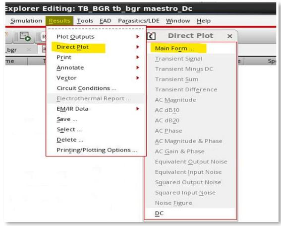

#### **Figure 26: Opening Direct Plot Main Form from the ADE Explorer**

Action 41: In the **Direct Plot Form** window, select **Current** as **Function** and enable the **Add To Outputs** checkbox.

|                           | Direct Plot Form<br>20                                |
|---------------------------|-------------------------------------------------------|
| Plotting Mode<br>Analysis | Append                                                |
| O dc<br>Function          |                                                       |
| D<br>Voltage              | Voltage Ratio<br>D                                    |
| Current                   | Current Ratio                                         |
| Power                     | Power Ratio                                           |
|                           | Transresistance J Transconductance                    |
| Terminal<br>Select        |                                                       |
| Add To Outputs Y          | > Select Instance Terminal on schematic<br>Close Help |

 **Figure 27: Direct Plot Form**

Action 42: Go to the schematic tab and return to the level above by clicking the up arrow on the schematic Go toolbar.

|                          |         | Virtuoso® ADE Explorer Editing: BGR Circ                                     |
|--------------------------|---------|------------------------------------------------------------------------------|
|                          |         | Launch File Edit View Create Check Options Window Parasitics/LDE ADE Explore |
|                          |         | ロ × の 17 9<br>@ 12                                                           |
|                          | Basic   |                                                                              |
|                          |         | Replace                                                                      |
| Navigator                | ? ~ x   | 118 (BGR_circuit)<br>×<br>maestro Dc                                         |
| Schematic<br>BGR_circuit |         |                                                                              |
| - OBJECTS                |         |                                                                              |
| All                      |         |                                                                              |
| Instances                | 15      | proga2v<br>2 pm092v                                                          |
| Nets                     | 11<br>> | ARTANT PATI<br>w=20                                                          |
| Pins                     | 3<br>D  |                                                                              |
| Nets and Pins            |         | 1.20737   . 3.9811m<br>11 -1                                                 |

#### **Figure 28: Clicking the up arrow on the schematic**

Action 43: Select the **PLUS** node of the **V7** supply voltage source as shown in Figure 29.

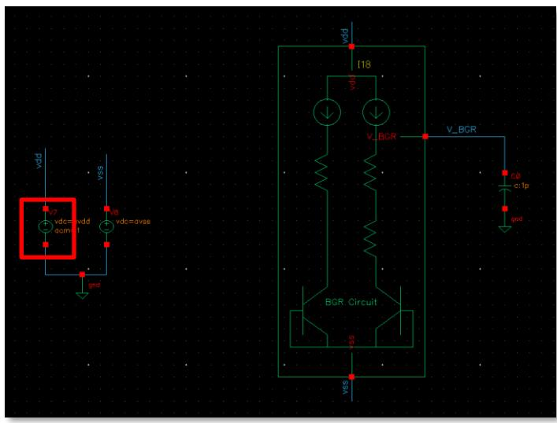

**Figure 29: Plotting supply current**

The waveform is plotted as shown in Figure 30. The "i("/V7/PLUS" ?result "dc")" supply current expression is added to the **Outputs Setup** table in ADE Explorer.

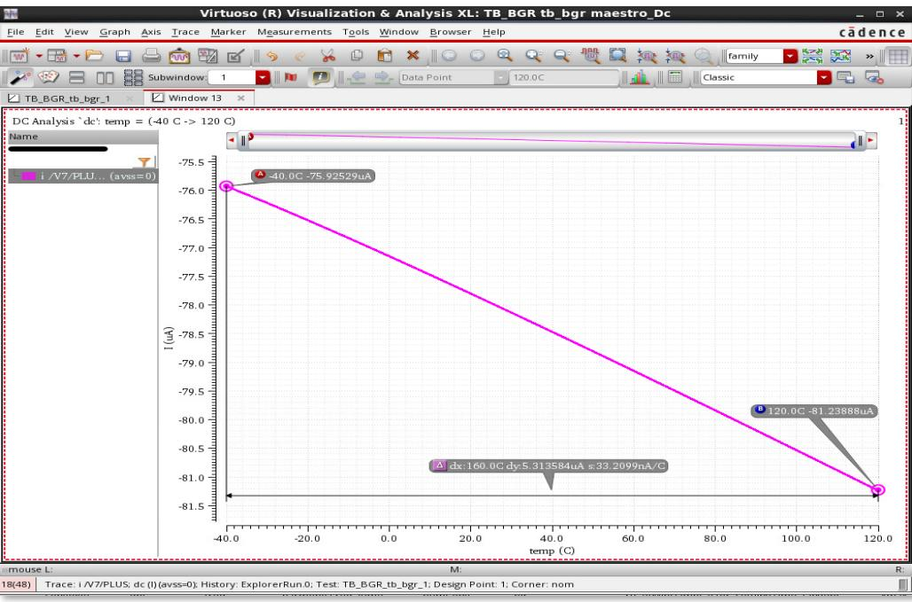

#### **Figure 30: BGR supply current plot with temperature sweep DC analysis**

Action 44: Name this expression as Supply\_Current in the ADE **Outputs Setup** table.

|                     |     |                |                   | Virtuoso® ADE Explorer Editing: TB_BGR tb_bgr maestro_Dc                                               |        |     |           | - DX    |
|---------------------|-----|----------------|-------------------|--------------------------------------------------------------------------------------------------------|--------|-----|-----------|---------|
|                     |     |                |                   | Launch Session Setup Analyses Variables Outputs Simulation Results Tools EAD Parasitics DE Window Help |        |     |           | cadence |
|                     |     |                |                   | 日日日本日本の『アッセスタート-テ-ミ-19日の数字11日本<br>12                                                                   |        |     |           |         |
| 0 - 0 - 0 - 0 Basic |     |                | - East<br>1 43    | The Us to In Q. Search                                                                                 |        |     |           |         |
| 를<br>能              | 2   | 12<br>Lo       | (None)<br>Replace | 2 2 2 0<br>Lo = = = de<br>- Sim Time 0                                                                 |        |     |           |         |
| Navigator           | 36× | Name           | Type              | Details                                                                                                | Value  |     | Plot Save |         |
| Schematic           |     | BGR_output     | expr              | v("/V_BGR" ?result "dc")                                                                               | 2      | >   |           | ుండి    |
| to ber              |     | /118/M12       | oppoint           | /118/M12 region                                                                                        | মি     | 1   | <         | P       |
| - OBJECTS           |     | /118/M5        | oppoint           | /118/M5 region                                                                                         | 1      |     | >         |         |
| All<br>Instances    | 6 > | Supply_Current | expr              | i("/V7/PLUS" ?result "dc")                                                                             | R      | <   |           | 10      |
| Nets                | 4   | BGR variation  | expr              | (ymax(v("/V_BGR" ?result "dc")) - ymin(v("/V_BGR" ?result "dc")))                                      | 3.431m | A   |           | ×       |
| Pins                |     |                | expr              | ymin(v("/V_BGR" ?result "dc"))                                                                         | 1.179  | ત્વ |           | 0       |
| Nets and Pins       |     |                | expr              | ymax(v("/V_BGR" ?result "dc"))                                                                         | 1.182  | >   |           |         |
| - GROUPS            |     |                |                   |                                                                                                        |        |     |           |         |
| Cells               |     |                |                   |                                                                                                        |        |     |           |         |
| Types               |     |                |                   |                                                                                                        |        |     |           |         |
|                     |     |                |                   |                                                                                                        |        |     |           |         |
|                     |     |                |                   |                                                                                                        |        |     |           |         |

**Figure 31: ADE maestro\_Dc view**

Action 45: In the **ADE Explorer** window, click on the **Plot Outputs** icon to see all plots together as shown in Figure 32.

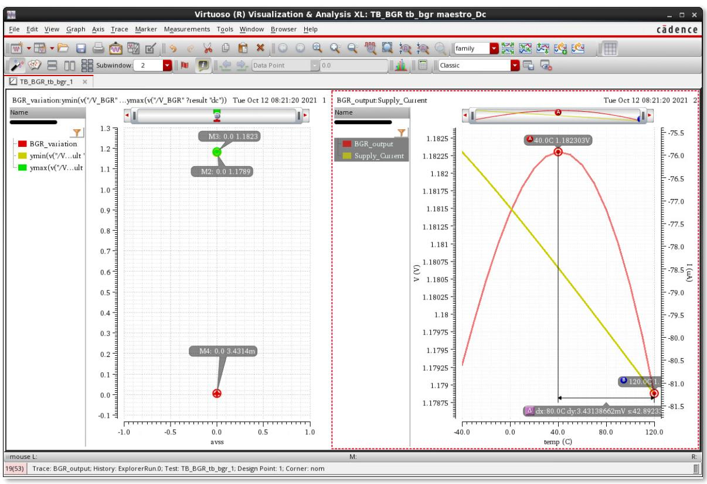

#### **Figure 32: Plots in ViVA**

Action 46: In the **ADE Explorer** window, click on the up arrow to open the **ADE Assembler** window as shown in Figure 33.

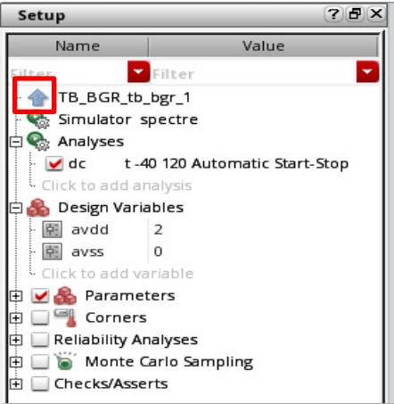

#### **Figure 33: Up Arrow to open ADE Assembler**


#### **Figure 34: Assembler view of maestro\_Dc**

Action 47: In the ADE Assembler **Data View** window, expand **Corners** using the **+** sign and then, **Click to add corners** as shown in Figure 35.

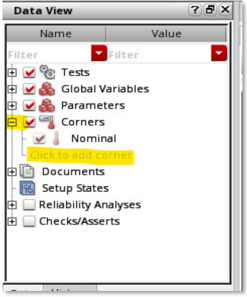

 **Figure 35: Opening Corner Setup**

The **Corners Setup** window will open.

|                                                       |   |         |  | Corners Setup |  |  |                            |  | × |
|-------------------------------------------------------|---|---------|--|---------------|--|--|----------------------------|--|---|
| - 四十分 日 日 日   8   0   8   0   7   Fiter name   7   18 |   |         |  |               |  |  |                            |  |   |
| Resource Corner Nominal                               |   |         |  |               |  |  |                            |  |   |
|                                                       |   |         |  |               |  |  |                            |  |   |
|                                                       |   |         |  |               |  |  |                            |  |   |
| Corners                                               | > | Nominal |  |               |  |  |                            |  |   |
|                                                       |   |         |  |               |  |  |                            |  |   |
| Temperature                                           |   |         |  |               |  |  |                            |  |   |
| Design Variables                                      |   |         |  |               |  |  |                            |  |   |
| Click to add                                          |   |         |  |               |  |  |                            |  |   |
| Parameters                                            |   |         |  |               |  |  |                            |  |   |
| Click to add                                          |   |         |  |               |  |  |                            |  |   |
| Model Files                                           |   |         |  |               |  |  |                            |  |   |
| Click to add                                          |   |         |  |               |  |  |                            |  |   |
| Model Group(s)                                        |   |         |  |               |  |  |                            |  |   |
| Click to add                                          |   |         |  |               |  |  |                            |  |   |
| Tests                                                 |   |         |  |               |  |  |                            |  |   |
| V  BGR_tb_bgr_1                                       | > |         |  |               |  |  |                            |  |   |
| mber of Corners                                       | 1 |         |  |               |  |  |                            |  |   |
|                                                       |   |         |  | 1000          |  |  |                            |  |   |
|                                                       |   |         |  |               |  |  |                            |  |   |
|                                                       |   |         |  |               |  |  | OK   Cancel   Apply   Help |  |   |

#### **Figure 36: Initial Corner Setup**

Action 48: Click on the **add new corner** icon . This will add a corner, **C0**.

Action 49: Click on **Click to add** under **Design Variables** as shown in Figure 37. Select **avdd** and then enter the values 1.8 2.2.

| Corners           | > | Nominal | CO<br>S                   |
|-------------------|---|---------|---------------------------|
| Temperature       |   |         |                           |
| Design Variables  |   |         |                           |
| Click to add      |   |         |                           |
| Parameters        |   |         |                           |
| Click to add      |   |         |                           |
| Model Files       |   |         |                           |
| Click to add      |   |         |                           |
| Model Group(s)    |   |         | <modelgroup></modelgroup> |
| Click to add      |   |         |                           |
| Tests             |   |         |                           |
| J  BGR_tb_bgr_1 V |   |         | >                         |
| Tags              |   |         |                           |

**Figure 37: Adding new corner, design variables, and model files in corner setup**

Action 50: Click on **Click to add** under **Model Files** as shown in Figure 38.

| Add/Edit Model Files<br>X                |
|------------------------------------------|
| Model Files -                            |
| Model<br>Click to add                    |
| Up<br>Down<br>Edit<br>Delete             |
| Import from Tests   OK   Cancel     Help |

#### **Figure 38: Add/Edit Model Files form**

Action 51: Click on **Import from Tests** and then, click **OK**.

Action 52: Select the **tt**, **ss**, **sf**, **fs**, **ff** sections and ensure the box is checked. Then, click **OK**.

The **Corners Setup** form will look like Figure 39.

|                            |                |         |                                                                                                       |                 |  | Corners Setup |  |  |  |  |                   | × |
|----------------------------|----------------|---------|-------------------------------------------------------------------------------------------------------|-----------------|--|---------------|--|--|--|--|-------------------|---|
| · 曰 + 8 日 日   "            |                |         |                                                                                                       |                 |  |               |  |  |  |  |                   |   |
| Resource Corner Nominal    |                |         |                                                                                                       |                 |  |               |  |  |  |  |                   |   |
| C0/gpdk045.scs             | tt ss sf fs ff |         |                                                                                                       |                 |  |               |  |  |  |  |                   |   |
| Corners                    | >              | Nominal | >                                                                                                     | CO              |  |               |  |  |  |  |                   |   |
| Temperature                |                |         |                                                                                                       |                 |  |               |  |  |  |  |                   |   |
| Design Variables           |                |         |                                                                                                       |                 |  |               |  |  |  |  |                   |   |
| avdd                       |                |         |                                                                                                       | 1.8 2.2         |  |               |  |  |  |  |                   |   |
| Click to add               |                |         |                                                                                                       |                 |  |               |  |  |  |  |                   |   |
| Parameters<br>Click to add |                |         |                                                                                                       |                 |  |               |  |  |  |  |                   |   |
| Model Files                |                |         |                                                                                                       |                 |  |               |  |  |  |  |                   |   |
| gpdk045.scs                |                |         |                                                                                                       | Ttt ss sf fs ff |  |               |  |  |  |  |                   |   |
| Click to add               |                |         | ff                                                                                                    |                 |  |               |  |  |  |  |                   |   |
| Model Group(s)             |                |         | <m fs<="" td=""><td></td><td></td><td></td><td></td><td></td><td></td><td></td><td></td><td></td></m> |                 |  |               |  |  |  |  |                   |   |
| Click to add               |                |         | mc                                                                                                    |                 |  |               |  |  |  |  |                   |   |
| Tests                      |                |         | ਕੇ                                                                                                    |                 |  |               |  |  |  |  |                   |   |
| J  BGR_tb_bgr_1            | >              |         | ટટ<br>C<br>tt                                                                                         |                 |  |               |  |  |  |  |                   |   |
| mber of Corners            |                | 1       |                                                                                                       |                 |  |               |  |  |  |  |                   |   |
|                            |                |         |                                                                                                       |                 |  |               |  |  |  |  |                   |   |
|                            |                |         |                                                                                                       |                 |  |               |  |  |  |  |                   |   |
|                            |                |         |                                                                                                       |                 |  | 111111        |  |  |  |  |                   |   |
|                            |                |         |                                                                                                       |                 |  |               |  |  |  |  | Cancel Apply Help |   |
|                            |                |         |                                                                                                       |                 |  |               |  |  |  |  |                   |   |

**Figure 39: Final Corner Setup**

Action 53: To add specifications to the **Outputs Setup** of the **ADE Assembler** view, double-click on the **Spec** field on the row for the **ymax** expression.

Select **<** from the drop-down menu. Add the 1.195 value as shown in Figure 40.

| Test            | Name           | Type     | Details                                      | Eval Type | Plot | Save | Spec                              | Weight   |
|-----------------|----------------|----------|----------------------------------------------|-----------|------|------|-----------------------------------|----------|
| Filter          | ▼ Filter       | ▼ Filter | ><br>Filter                                  | ▼ Filter  | ♪    |      | Filter                            | ▼ Filter |
| TB_BGR_tb_bgr_1 | BGR output     | expr     | v("/V_BGR" ?result "dc")                     | point     | >    | 1    |                                   |          |
| TB_BGR_tb_bgr_1 | BGR_variation  | expr     | (ymax(v("/V_BGR" ?result "dc")) - ymin(v("/V | point     | <    | 11   |                                   |          |
| TB_BGR_tb_bgr_1 |                | expr     | ymin(v("/V_BGR" ?result "dc"))               | point     | 4    | 1    |                                   |          |
| TB_BGR_tb_bgr_1 |                | expr     | ymax(v("/V_BGR" ?result "dc"))               | point     | >    |      |                                   |          |
| TB_BGR_tb_bgr_1 | /118/M12       | oppoint  | /118/M12  region                             | point     | 187  | V    | none                              |          |
| TB_BGR_tb_bgr_1 | /118/M5        | oppoint  | /118/M5 region                               | point     | 15   | >    | minimize                          |          |
| TB_BGR_tb_bgr_1 | Supply_Current | expr     | i("/\7/PLUS" ?result "dc")                   | point     | 4    |      | maximize<br>V                     |          |
|                 |                |          |                                              |           |      |      | A<br>range<br>tol<br>info<br>wave |          |

#### **Figure 40: Adding specs in Outputs Setup of ADE Assembler**

Action 54: Repeat this using the following table to add specifications to the other expressions.

| 0                                                                   |                         |                                  |                                       | Virtuoso® ADE Assembler Editing: TB_BGR tb_bgr maestro_Dc |                           |   |             |           | X = = x |
|---------------------------------------------------------------------|-------------------------|----------------------------------|---------------------------------------|-----------------------------------------------------------|---------------------------|---|-------------|-----------|---------|
| Launch File Create Tools Options Run EAD Parasitics/LDE Window Help |                         |                                  |                                       |                                                           |                           |   |             |           | cadence |
| । ਨਾ                                                                | 网                       | 图 合图<br>a                        |                                       | 기록<br>Basic                                               |                           |   |             |           |         |
| 0<br>No Parasitics/LDE                                              | E3<br>No Sweeps         | > Single Run, Sweeps and Corners |                                       | ್ರಿ<br>><br>Reference:                                    |                           |   |             | ర్లో<br>g |         |
| ? 日 X<br>Data View                                                  | tb_bgr X                | maestro_Dc<br>×                  |                                       |                                                           |                           |   |             |           |         |
| Name<br>Value                                                       | Outputs Setup           | Results                          |                                       |                                                           |                           |   |             |           |         |
| ▼ Filter<br>Filter<br>0 7 8 8 Tests                                 | 1 Pay<br>x<br>2017<br>C | Filter  ▼                        | 2 0 日 日 0 0 0 0 0 0 0 0 0 0 0 0 0 0 0 | (ex) - 0 - 0 0 0 0 0                                      |                           |   |             |           |         |
| 田 Global Variables                                                  | / rows<br>Test          | Name                             |                                       | Details                                                   |                           |   | Plot   Save | Spec      |         |
| 中文 Parameters<br>Corners                                            | ilter                   | ▼ Filter                         | Type<br>▼ Filter                      | Filter                                                    | EvalType<br>▼ Filter<br>マ |   |             | Filter    |         |
| 国国 Documents                                                        | TB_BGR_tb_bgr_1         | BGR_output                       | expr                                  | v("/V_BGR" ?result "dc")                                  | point                     | < |             |           |         |
| মি<br>Setup States                                                  | TB_BGR_tb_bgr_1         |                                  | expr                                  | ymax(v("/V_BGR" ?result "dc"))                            | point                     | < |             | < 1.195   |         |
| [ Reliability Analyses                                              | TB_BGR_tb_bgr_1         |                                  | expr                                  | ymin(v("/V_BGR" ?result "dc"))                            | point                     | V |             | > 1.165   |         |
| Data   History                                                      | TB_BGR_tb_bgr_1         | BGR_variation                    | expr                                  | (ymax(v("/V_BGR" ?result "dc")) - ymin(v("/V              | point                     | < |             | < 8m      |         |
| ? 日 ×<br>Run Summary                                                | TB_BGR_tb_bgr_1         | /118/M12                         | oppoint                               | /118/M12 region                                           | point                     |   | <           |           |         |
| 1 Test<br>Nominal Corner                                            | TB_BGR_tb_bgr_1         | /118/M5                          | oppoint                               | /118/M5 region                                            | point                     |   | V           |           |         |
| 1 Point Sweep<br>> 10 Corners                                       | TB_BGR_tb_bgr_1         | Supply_Current                   | expr                                  | i("/\7/PLUS" ?result "dc")                                | point                     | < |             |           |         |
| History Item<br>Status                                              |                         |                                  |                                       |                                                           |                           |   |             |           |         |
|                                                                     |                         |                                  |                                       | 1100                                                      |                           |   |             |           |         |
| mouse L:                                                            |                         |                                  |                                       | M:                                                        |                           |   |             |           | R:      |
| 32(80)                                                              |                         |                                  |                                       |                                                           |                           |   |             |           |         |

**Figure 41: ADE Assembler setup of maestro\_Dc**

Action 55: Run the simulation by clicking on the green run icon to **netlist and run simulation** across corners.

All output design parameters, BGR\_variation, supply current, ymax, and ymin of BGR\_output are passing the specifications.

|                                                                     |                                 |                                                   |         |         | Virtuoso® ADE Assembler Editing: TB_BGR tb_bgr maestro_Dc |                                                                                                                                                                                             |                                                                                                                                                                                |        |        | = ロ×    |
|---------------------------------------------------------------------|---------------------------------|---------------------------------------------------|---------|---------|-----------------------------------------------------------|---------------------------------------------------------------------------------------------------------------------------------------------------------------------------------------------|--------------------------------------------------------------------------------------------------------------------------------------------------------------------------------|--------|--------|---------|
| Launch File Create Tools Options Run EAD Parasitics/LDE Window Help |                                 |                                                   |         |         |                                                           |                                                                                                                                                                                             |                                                                                                                                                                                |        |        | cadence |
| 4 0<br>7 1                                                          | 0%                              |                                                   | -Q B    |         |                                                           | · 電電                                                                                                                                                                                        |                                                                                                                                                                                |        |        |         |
| 6<br>No Parasitics/LDE                                              | No Sweeps                       | Single Run, Sweeps and Corners                    |         |         | 17 8                                                      | Reference                                                                                                                                                                                   |                                                                                                                                                                                | ਜ਼ੀ    | శ్రీని |         |
| ? 日 ×<br>Data View                                                  | tb_bgr X                        | maestro_Dc X                                      |         |         |                                                           |                                                                                                                                                                                             |                                                                                                                                                                                |        |        |         |
| Name<br>Value                                                       | Outputs Setup                   | Results                                           |         |         |                                                           |                                                                                                                                                                                             |                                                                                                                                                                                |        |        |         |
| ▼ Filter<br>Filter<br>E L & Tests                                   | Detail                          | ్రెస్                                             |         |         |                                                           |                                                                                                                                                                                             | ============================================================================================================================================================================== |        |        |         |
| Global Variables<br>E                                               |                                 | Parameter                                         | Nominal |         |                                                           |                                                                                                                                                                                             |                                                                                                                                                                                |        | CO O   |         |
| Parameters                                                          |                                 | avdd                                              | 2       |         |                                                           |                                                                                                                                                                                             |                                                                                                                                                                                |        | 1.8    |         |
| Corners                                                             |                                 | gpdk045.scs                                       | tt      |         |                                                           |                                                                                                                                                                                             |                                                                                                                                                                                |        | tt     |         |
| Documents<br>Setup States                                           | Trows                           |                                                   |         |         |                                                           |                                                                                                                                                                                             |                                                                                                                                                                                |        |        |         |
| _ Reliability Analyses<br>मि                                        | Test                            | Output                                            | Nominal | Spec    | Weight                                                    | Pass/Fail<br>------------------------------------------------------------------------------------------------------------------------------------------------------------------------------ | Min                                                                                                                                                                            | Max    | CO O   |         |
| Data   History                                                      | Ilter                           | ><br>Filter                                       | ilter   | Filter  | ▼ Filter                                                  | ▼ Filter                                                                                                                                                                                    | * Filter                                                                                                                                                                       | Filter | Filter |         |
| ?日X                                                                 |                                 |                                                   |         |         |                                                           |                                                                                                                                                                                             |                                                                                                                                                                                |        |        |         |
| Run Summary                                                         | TB_BGR_tb_bgr    BGR_output     |                                                   | 2       |         |                                                           |                                                                                                                                                                                             |                                                                                                                                                                                |        | 2      | E       |
| 1 Test<br>V Nominal Corner                                          | TB_BGR_tb_bgr  ymax(v("/V_BG    |                                                   | 1.182   | < 1.195 |                                                           | pass                                                                                                                                                                                        | 1.176                                                                                                                                                                          | 1.192  | 1.18   |         |
| 1 Point Sweep<br>V 10 Corners                                       | TB_BGR_tb_bgr    ymin(v("/V_BGR |                                                   | 1979    | > 1.165 |                                                           | pass                                                                                                                                                                                        | 1.172                                                                                                                                                                          | 1.188  | 1.176  |         |
|                                                                     | TB_BGR_tb_bgr    BGR_variation  |                                                   | 3.431m  | < 8m    |                                                           | pass                                                                                                                                                                                        | 3.165m                                                                                                                                                                         | 4.638m | 3.859m |         |
|                                                                     | TB_BGR_tb_bgr  /118/M12         |                                                   | J       |         |                                                           |                                                                                                                                                                                             |                                                                                                                                                                                |        | R      |         |
|                                                                     | TB_BGR_tb_bgr  /118/M5          |                                                   | ನ       |         |                                                           |                                                                                                                                                                                             |                                                                                                                                                                                |        | િ      | TRI     |
| History Item<br>Status                                              | TB_BGR_tb_bgr    Supply_Current |                                                   | న       |         |                                                           |                                                                                                                                                                                             |                                                                                                                                                                                |        | 2      |         |
|                                                                     |                                 |                                                   | THE     |         |                                                           |                                                                                                                                                                                             |                                                                                                                                                                                |        |        |         |
|                                                                     |                                 | ExplorerRun.0 () ExplorerRORun.0.RO Interactive.0 |         |         |                                                           |                                                                                                                                                                                             |                                                                                                                                                                                |        |        | ×       |
| mouse L:                                                            |                                 |                                                   |         | M:      |                                                           |                                                                                                                                                                                             |                                                                                                                                                                                |        |        | R       |
| 32(80)                                                              |                                 |                                                   |         |         |                                                           |                                                                                                                                                                                             |                                                                                                                                                                                |        |        |         |

**Figure 42: Results tab view of Assembler maestro\_Dc**

Action 56: Right-click on the **Nominal** column for BGR\_output and select **Plot Across Corners** as shown in Figure 43.

|                                                                                                                     | Parameter                                                                                               |                     | Nominal                                                                                                    |                                                                                                                                                                                                                                                               |  |       |  |  |
|---------------------------------------------------------------------------------------------------------------------|---------------------------------------------------------------------------------------------------------|---------------------|------------------------------------------------------------------------------------------------------------|---------------------------------------------------------------------------------------------------------------------------------------------------------------------------------------------------------------------------------------------------------------|--|-------|--|--|
|                                                                                                                     | avdd<br>gpdk045.scs                                                                                     |                     | View Log Messages<br>View Netlist<br>View Netlisted Checks/Asserts<br>View Dynamic/Static Violation Report |                                                                                                                                                                                                                                                               |  |       |  |  |
| rows                                                                                                                |                                                                                                         |                     |                                                                                                            | Open Terminal                                                                                                                                                                                                                                                 |  |       |  |  |
| Test                                                                                                                | Output                                                                                                  | No                  | Job Log                                                                                                    |                                                                                                                                                                                                                                                               |  |       |  |  |
| Filter                                                                                                              | ▼ Filter                                                                                                | ▼ Filter            |                                                                                                            | Cancel Selected Simulation(s)                                                                                                                                                                                                                                 |  | Firer |  |  |
| TB_BGR_tb_bgr<br>TB_BGR_tb_bgr<br>TB_BGR_tb_bgr<br>TB_BGR_tb_bgr<br>TB_BGR_tb_bgr<br>TB_BGR_tb_bgr<br>TB_BGR_tb_bgr | BGR output<br>BGR variation<br>ymin(v("/V_BGR<br>ymax(v("/V_BG<br>/118/M12<br>/118/M5<br>Supply_Current | 3<br>W<br>ﺍﺳ<br>ﺍﻟﻤ | Plot All<br>Plot                                                                                           | Plot Associated Signals<br>Quick Plot All<br>Plot Across Corners<br>Plot Across Design Points<br>Create Copy Of Selected Corner<br>Troubleshoot Point<br>Open Debug Environment<br>Spectre Interactive Environment<br>Open Results Browser<br>Open Calculator |  |       |  |  |

**Figure 43: Plotting across corners** 

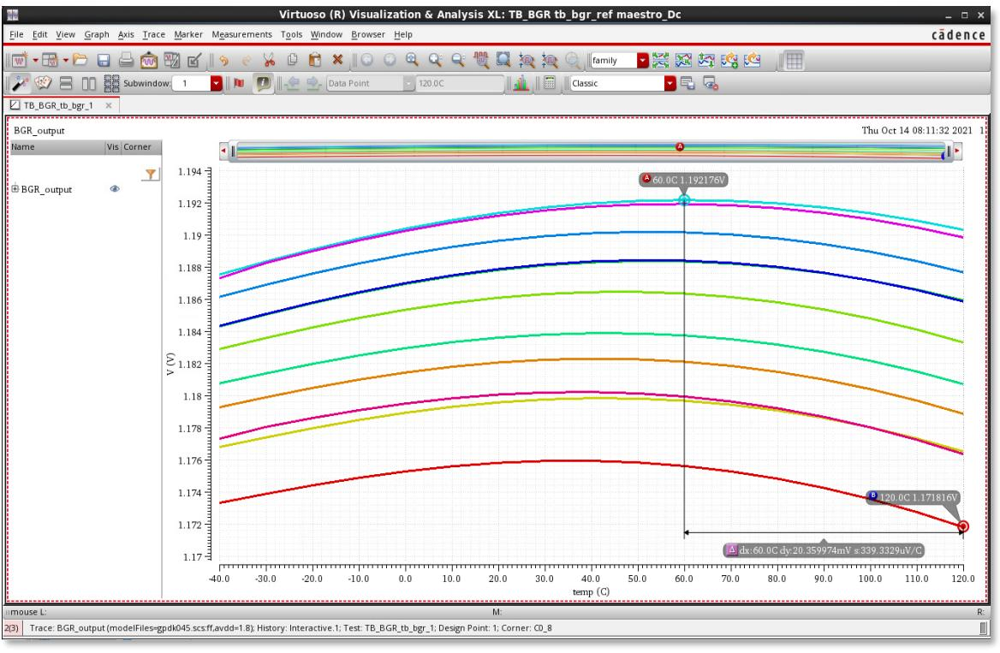

**Figure 44: BGR\_output plots Across PVT Corners**

Action 57: Close all windows but leave the **Virtuoso** session open for the next lab.

### <span id="page-29-0"></span>**Lab 2: Power Supply Rejection Ratio of Bandgap Using Ac Analysis**

This lab is set up to determine PSRR of the Bandgap circuit. PSRR is a measure of the influence of the power supply ripple on the Bandgap output voltage.

PSRR analysis is used to measure the effect of supply ripples on the output reference supply.

Action 58: From the Library Manager, open **TB\_BGR > tb\_bgr > schematic**. The schematic window opens as shown in Figure 45.

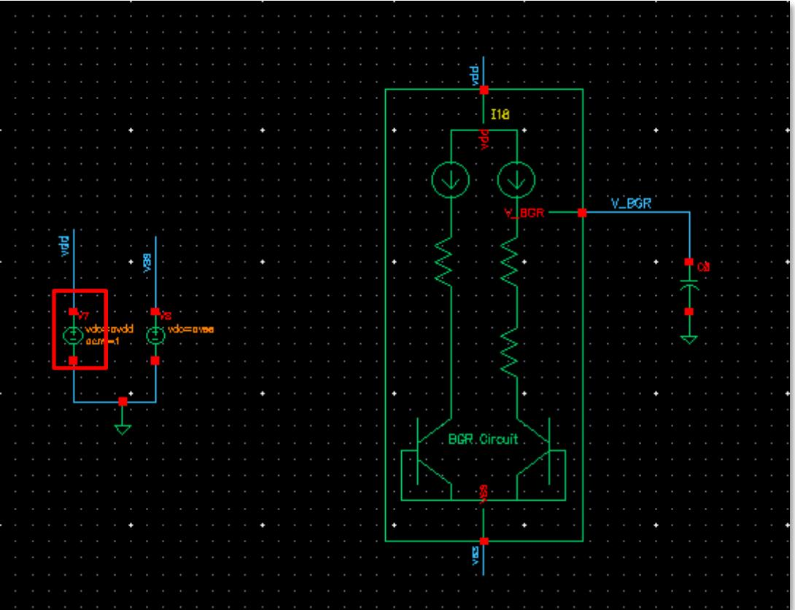

**Figure 45: Schematic of tb\_bgr cell testbench**

Action 59: In the **schematic** view, select the **V7** dc supply voltage source and press the **Q** bindkey key to open the **Edit Object Properties** form. Confirm that **AC magnitude** is defined as **1V**.

| Apply To                   | only current instance >>      |                        |
|----------------------------|-------------------------------|------------------------|
| Show                       | _ system & user & CDF         |                        |
| Browse                     | Reset Instance Labels Display |                        |
| Property                   | Value                         | Display                |
| Library Name               | analogLib                     | off                    |
| Cell Name                  | vdc                           | off                    |
| View Name                  | symbol                        | off                    |
| Instance Name              | V7                            | off                    |
|                            | Add<br>Delete                 | Modify                 |
| User Property              | Master Value                  | Local Value<br>Display |
| Ivsignore                  | TRUE                          | off                    |
| CDF Parameter              | Value                         | Display                |
| Noise file name            |                               | off                    |
| Number of noise/freq pairs | 0                             | off                    |
| DC voltage                 | avdd V                        | off                    |
| AC magnitude               | 1 V                           | off                    |
| AC phase                   |                               | off                    |
| XF magnitude               |                               | off                    |
| PAC magnitude              |                               | off                    |
| PAC phase                  |                               | off                    |
| Temperature coefficient 1  |                               | off                    |
| Temperature coefficient 2  |                               | off                    |
| Nominal temperature        |                               | off                    |

**Figure 46: Object property of supply voltage source**

- Action 60: Cancel the form.
- Action 61: From the schematic, select **Launch > ADE Explorer**.
- Action 62: In the **Launch ADE Explorer** window that opens, select **Create New View** and click **OK**.

| Launch ADE Explorer                                |  |
|----------------------------------------------------|--|
| ADE Explorer<br>Create New View Open Existing View |  |
| Cancel<br>Help<br>OK                               |  |

**Figure 47: Launching ADE Explorer from the schematic window**

Action 63: In the **Create new ADE Explorer view** window, change the view name to maestro\_Ac.

| Library           | TB BGR                                            |  |  |
|-------------------|---------------------------------------------------|--|--|
| Cell              | tb bgr                                            |  |  |
| View              | maestro Ac                                        |  |  |
| lype              | maestro                                           |  |  |
| Application       |                                                   |  |  |
| Open with         | ADE Explorer                                      |  |  |
|                   | Always use this application for this type of file |  |  |
| Library path file |                                                   |  |  |
|                   | /BGR_Verification_Workshop/cds lib                |  |  |
|                   | Open in @ new tab O current tab O new window      |  |  |

#### **Figure 48: Opening maestro\_Ac view of tb\_bgr cell**

The **ADE Explorer** window opens as shown in Figure 49.

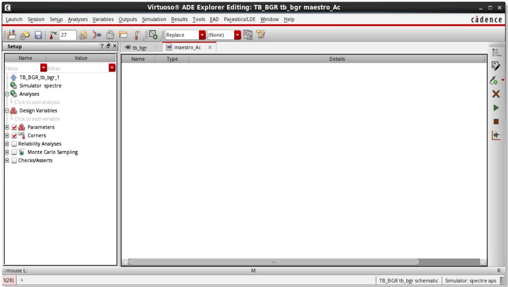

#### **Figure 49: ADE Explorer window showing maestro\_Ac view**

Action 64: In the **ADE Explorer** window, select **Click to add analysis** in the **Analyses** section of the **Setup** assistant.

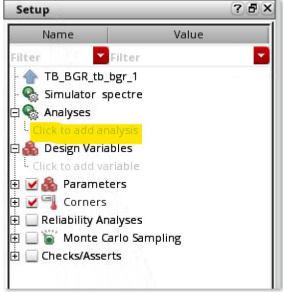

**Figure 50: Opening 'Analyses' form from 'Click to add analysis'**

Action 65: In the **Choosing Analyses** form, select the **ac** analysis and set the following options. Then, click **OK**:

- Select **Frequency** as **Sweep Variable**.
- Set the **Start** frequency to **1**Hz and **Stop** frequency for **1G**Hz.
- Choose **Automatic** for **Sweep Type**.

|                                                                                                                       |                     |             | Choosing Analyses -- ADE Explorer | ×               |
|-----------------------------------------------------------------------------------------------------------------------|---------------------|-------------|-----------------------------------|-----------------|
| Analysis                                                                                                              | 0<br>tran           | D<br>dc     | C ac                              | D<br>noise      |
|                                                                                                                       | xf                  | sens        | dcmatch                           | acmatch         |
|                                                                                                                       | stb                 | pz          | 11                                | sp              |
|                                                                                                                       | envlp               | bss         | pac                               | pstb            |
|                                                                                                                       | pnoise              | pxf         | psp                               | dbss            |
|                                                                                                                       | qpac                | qpnoise     | qpxf                              | dbsp            |
|                                                                                                                       | hb                  | hbac        | hbstb                             | hbnoise         |
|                                                                                                                       | hbsp                | hbxf        |                                   |                 |
|                                                                                                                       |                     | AC Analysis |                                   |                 |
| Sweep Variable                                                                                                        |                     |             |                                   |                 |
| Frequency<br>0                                                                                                        |                     |             |                                   |                 |
| Design Variable                                                                                                       |                     |             |                                   |                 |
| Temperature                                                                                                           |                     |             |                                   |                 |
|                                                                                                                       | Component Parameter |             |                                   |                 |
|                                                                                                                       | Model Parameter     |             |                                   |                 |
| None                                                                                                                  |                     |             |                                   |                 |
| Sweep Range<br>Start-Stop<br>O<br>Center-Span<br>Sweep Type<br>Automatic<br>Add Specific Points<br>Add Points By File |                     | Start       | Stop                              | 1 G             |
|                                                                                                                       |                     |             |                                   |                 |
| Specialized Analyses                                                                                                  |                     |             |                                   |                 |
| None                                                                                                                  |                     |             |                                   |                 |
| Enabled<br>V                                                                                                          |                     |             | OK Cancel   Defaults   Apply      | Options<br>Help |

#### **Figure 51: Setup of DC-Sweep Analysis**

- Action 66: In the **ADE Explorer** window, click on **Variables** and select **Copy From Cellview** as shown in Figure 52.
- Action 67: In the **Setup** assistant, set the **Design Variables** values for **avdd=2** and **avss=0**.

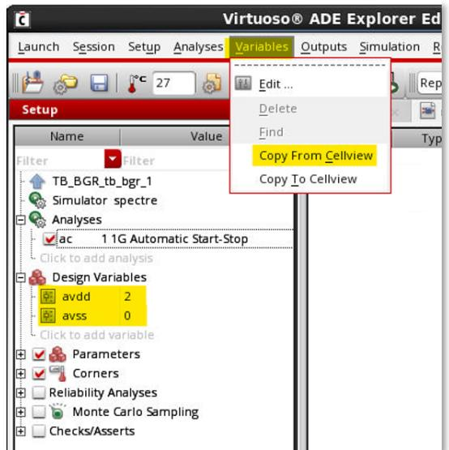

 **Figure 52: Copying variables from cell view**

- Action 68: In the **ADE Explorer** window, click on the green arrow button to **netlist and run** the simulation.
- Action 69: When the simulation is complete, click on **Simulation > Output Log** in the **ADE Explorer** window as shown in Figure 53.
- Action 70: Verify that simulation has completed with 0 errors.

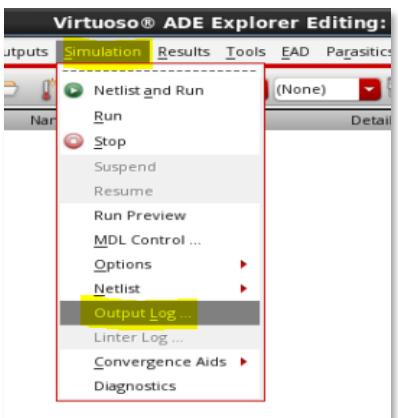

**Figure 53: Opening simulation log file from ADE Explorer window**

Action 71: In the **ADE Explorer** window, choose **Results > Direct Plot > Main Form** to open **Direct Plot Form** as shown in Figure 54.

Learn more at Cadence Learning and Support Portal - https://support.cadence.com © 2021 Cadence Design Systems, Inc. All rights reserved worldwide. Page 35

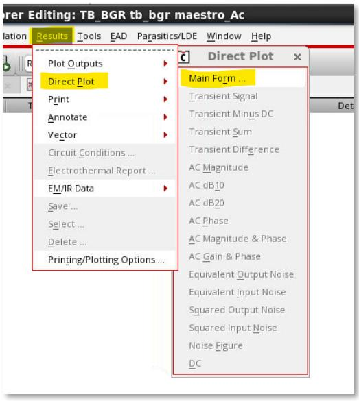

**Figure 54: Opening Direct Plot Form from ADE Explorer window**

- Action 72: To plot the gain, select **Voltage** as the **Function**, **Net** from the drop-down menu, and **dB20** as **Modifier**.
- Action 73: Enable the **Add To Outputs** checkbox and select the **V\_BGR** net from the schematic.

|                                | Direct Plot Form         | 20         |
|--------------------------------|--------------------------|------------|
| Plotting Mode<br>Analysis      | Append                   |            |
| ac<br>0                        |                          |            |
| Function                       |                          |            |
| · Voltage C Current<br>GD<br>3 |                          |            |
| Select Net                     |                          |            |
| Modifier                       |                          |            |
| dB20                           | Magnitude O Phase O dB10 |            |
| Add To Outputs                 | 》                        |            |
| > Select Net on schematic      |                          |            |
|                                |                          | Close Help |

**Figure 55: Direct Plot Form** 

Learn more at Cadence Learning and Support Portal - https://support.cadence.com © 2021 Cadence Design Systems, Inc. All rights reserved worldwide. Page 36

The PSRR waveform is plotted as shown in Figure 56. The db(vfreq('ac "/V\_BGR")) expression is added to the maestro view.

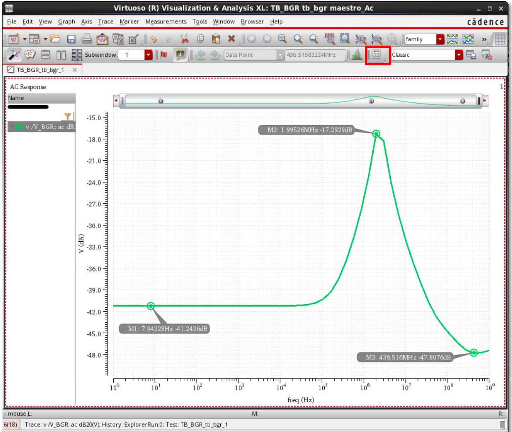

Action 74: Add single-point markers using the **M** bindkey on the plot.

**Figure 56: Plot of PSRR in ViVA-XL waveform window**

Action 75: Select the PSRR plot and click the **calculator** icon as shown in Figure 56.

The expression for the PSRR plot is added to the calculator as shown in Figure 57.

|                                        |                                          |                               |                    | Virtuoso (R) Visualization & Analysis XL calculator                           |               |                            |            |               |
|----------------------------------------|------------------------------------------|-------------------------------|--------------------|-------------------------------------------------------------------------------|---------------|----------------------------|------------|---------------|
| File Tools View Options Constants Help |                                          |                               |                    |                                                                               |               |                            |            |               |
| In Context Results DB:                 |                                          |                               |                    | /TB_BGR/tb_bgr/maestro_Ac/results/maestro/ExplorerRun.0/1/TB_BGR_tb_bgr_1/psf |               |                            |            |               |
| app plot erplot                        | average cross dB20 sqrt ymax             |                               |                    |                                                                               |               |                            |            |               |
| TB_BGR_tb_bgr_1                        | D<br>vf<br>D<br>vt<br>0<br>it<br>D<br>if | U vdc<br>U VS<br>Uidc<br>U is | 0 05<br>Oop<br>opt | O ot<br>Ump<br>V var                                                          | U vn<br>0 vn2 | D<br>sp<br>VSWL<br>Uzp Uyp | hp<br>O gd | ZIm<br>J data |
|                                        | · Off · Family O Wave · Clip   Append    |                               | Rectangular        | 17 3 8 日                                                                      |               |                            |            |               |
| (B)<br>Key P<br>X                      | db vfreq('ac "/V_BGR"))                  |                               |                    |                                                                               |               |                            |            |               |
| 7<br>8<br>9                            |                                          |                               |                    |                                                                               |               |                            |            |               |
| 4<br>5<br>6<br>*                       |                                          |                               |                    |                                                                               |               |                            |            |               |


Action 76: In the calculator, select the **value** function from the **Functional Panel** window.

| Function Panel                    |              |                |                       |                |           |                           |            |
|-----------------------------------|--------------|----------------|-----------------------|----------------|-----------|---------------------------|------------|
| Special Functions<br>ರ<br>fx<br>r |              |                |                       |                |           |                           |            |
| PN                                | cross        | eyeDiagram     | getData               | lastVal        | pow       | sample                    | value      |
| aasp                              | d2a          | eyeHeightAtXY  | groupDelay            | loadpull       | pris      | settling lime             | waveVsWave |
| abs_jitter                        | dBm          | eye Width AtXY | harmonic              | Ishift         | psd       | skewness                  | xmax       |
| analog2Digital                    | delay        | fallTime       | harmonicFreq normalQQ |                | psdbb     | slewRate                  | xmin       |
| average                           | delayMeasure | firstVal       | histogram2D           | normalQQPValue | pstddev   | spectralPower             | xval       |
| bandwidth                         | deriv        | flip           |                       | num Conv       | pzbode    | spectrumMeas ymax         |            |
| bus Transition                    | dff          | fourEval       | iinteg                | overshoot      | pzfilter  | stodev                    | ymın       |
| calcVal                           | dftbb        | freq           | וחו                   | pavg           | rise Time | swapSweep                 |            |
| clip                              | dnl          | freq_jitter    | integ                 | peak           | rms       | tangent                   |            |
| compare                           | dutyCycle    | frequency      | intersect             | peakToPeak     | rmsNoise  | thd                       |            |
| compression                       | evmQAM       | gainBwProd     | ipn                   | period_jitter  |           | rms_jitter triggeredDelay |            |
| compressionVRI                    | evmQpsk      | gainMargin     | IpnVRI                | phaseMargin    | root      | unityGainFreq             |            |
| convolve                          | eyeAperture  | getAsciiWave   | kurtosis              | phaseNoise     | rshift    | V                         |            |

**Figure 58: Functional Panel of ViVA-XL calculator**

Action 77: The **Functional Panel** window will contain the signal name as shown in Figure 59. Set the value of **Interpolate at** as **1**. Click **OK**.

| value                          |                                 |                           |
|--------------------------------|---------------------------------|---------------------------|
|                                | Signal  db(vfreq('ac "/V_BGR")) |                           |
| Interpolate at                 | 11                              |                           |
| Interpolation method linear    |                                 |                           |
| Number of occurrences single   |                                 |                           |
| Period (required for multiple) |                                 |                           |
| Plot/print vs.                 | time                            |                           |
| Extrapolate                    | on                              |                           |
|                                |                                 | Apply Defaults Help Close |

**Figure 59: Using value calculator function of ViVA-XL calculator**

The expression will become value(db(vfreq('ac "/V\_BGR")) 1 ) as shown in Figure 60.

Action 78: Click the **Send buffer expression to ADE output** icon to add the expression to the maestro view.

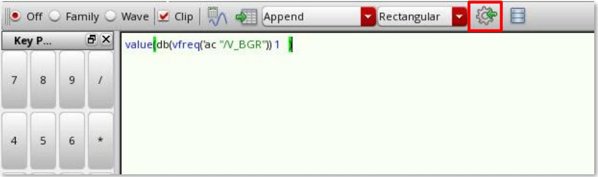


Action 79: In the **ADE Explorer** window, select the **Name** field and add the expression name BGR\_output as shown in Figure 61.

Action 80: Name the first expression as PSRR\_plot.

The maestro view should now look like this:

| C                                          |          |           |         | Virtuoso® ADE Explorer Editing: TB_BGR tb_bgr maestro_Ac                                              |       |      |      |      | - OX      |
|--------------------------------------------|----------|-----------|---------|-------------------------------------------------------------------------------------------------------|-------|------|------|------|-----------|
|                                            |          |           |         | Launch Session Setup Analyses Variables Outputs Simulation Results Tools EAD Parastics/DE Window Help |       |      |      |      | cadence   |
| ో వి<br>日 :"<br>27                         | してい<br>0 | 0         | Replace | - 17 2<br>(None)                                                                                      |       |      |      |      |           |
| Setup                                      | ? BX     | tb_bgr X  |         | maestro_Ac X                                                                                          |       |      |      |      | 84        |
| Name<br>Value                              |          | Name      | Type    | Details                                                                                               | Value | Plot | Save | Spec | ్రైల్ రెం |
| Filter<br>Filter                           | >        | PSRR_plot | expr    | db(vfreq(ac "/V_BGR"))                                                                                |       | 4    |      |      |           |
| 11<br>TB_BGR_tb_bgr_1                      |          | DC PSRR   | expr    | value(db(vfreq('ac "/V_BGR")) 1)                                                                      |       | <    | 1    |      |           |
| ! Q<br>Simulator spectre                   |          |           |         |                                                                                                       |       |      |      |      | 0         |
| Analyses                                   |          |           |         |                                                                                                       |       |      |      |      | X         |
| 1 1G Automatic Start-Stop<br>vac           |          |           |         |                                                                                                       |       |      |      |      |           |
| Click to add analysis<br>Design Variables  |          |           |         |                                                                                                       |       |      |      |      |           |
| ్రాంగ్ర<br>avdd                            |          |           |         |                                                                                                       |       |      |      |      |           |
| ្រ<br>avss<br>0                            |          |           |         |                                                                                                       |       |      |      |      |           |
| - Click to add variable<br>Parameters<br>ு |          |           |         |                                                                                                       |       |      |      |      |           |


Action 81: Click **Plot Outputs** . The expressions are plotted as shown in Figure 62.

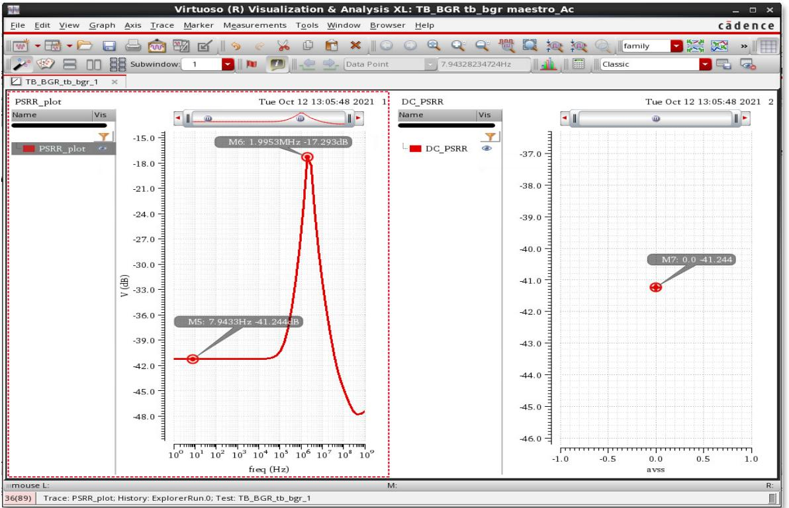

#### **Figure 62: Output plots**

Action 82: Close all windows but leave the **Virtuoso** session open for the next lab.

### <span id="page-40-0"></span>**Lab 3: Loop Gain and Phase Measurement of Bandgap Using Stability Analysis**

- Stability analysis is a linear small-signal variant of AC analysis.
- Spectre stability analysis performs a Middlebrook stability analysis.
	- o In this method, if you connect an ideal **0V** voltage source in series with the feedback path and drive it with a **1V** signal at all frequencies, the loop gain transfer function appears across the voltage source terminals.
- Stability analysis measures the open loop gain and phase in the circuit with the loop closed.
	- o The loading in the feedback path is maintained.
	- o A single-ended **iprobe** can be instantiated in the schematic to act as the signal source for the stability analysis.

Action 83: From the Library Manager, open the **TB\_BGR > tb\_bgr > schematic** view.

Action 84: Descend into BGR\_circuit.

BGR\_circuit contains an iprobe, IPRB0, as shown in Figure 63.

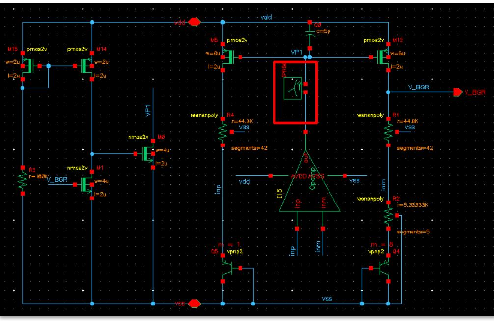

**Figure 63: Bandgap circuit Schematic for stability analysis (stb)**

Learn more at Cadence Learning and Support Portal - https://support.cadence.com © 2021 Cadence Design Systems, Inc. All rights reserved worldwide. Page 41

Action 85: From the schematic, select **Launch > ADE Explorer**.

Action 86: In the **Launch ADE Explorer** window that opens, select **Create New View** and click **OK**.

| Launch ADE Explorer |                    |  |
|---------------------|--------------------|--|
| ADE Explorer        |                    |  |
| Create New View     | Open Existing View |  |
| OK                  | Cancel<br>Help     |  |

 **Figure 64: Launching ADE Explorer from schematic window**

Action 87: In the **Create new ADE Explorer view** window, change the view name to maestro\_Stb.

| Library           | TB BGR                                            |
|-------------------|---------------------------------------------------|
| Cell              | tb_bgr                                            |
| View              | maestro Stb                                       |
| lype              | maestro                                           |
| Application       |                                                   |
| Open with         | ADE Explorer                                      |
|                   | Always use this application for this type of file |
| Library path file |                                                   |
|                   | /BGR_Verification_Workshop/cds . lib              |
|                   | Open in new tab current tab _ new window          |

**Figure 65: Opening maestro\_Stb view of tb\_bgr cell** 

The **ADE Explorer** window appears as shown in Figure 66.

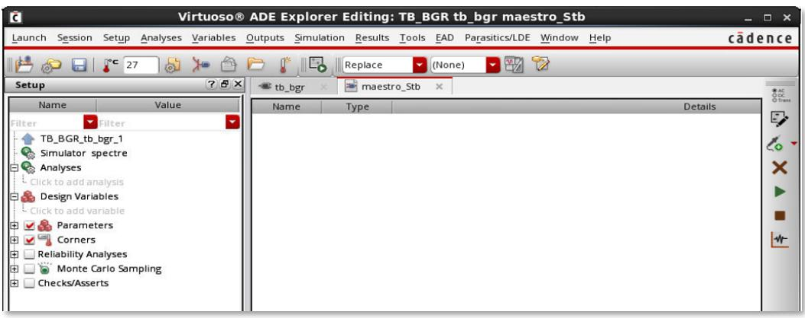

**Figure 66: ADE Explorer window showing maestro\_Stb view** 

Action 88: In **ADE Explorer**, select **Click to add analysis** in the **Analyses** section of the **Setup** assistant.

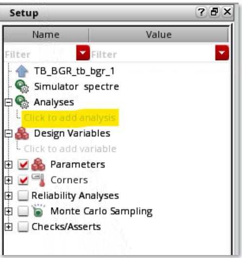

**Figure 67: Opening 'Analyses' form from 'Click to add analysis'**

Action 89: In the **Choosing Analyses** form, select the **stb** analysis and set up the options as follows:

- Set **Sweep Variable** as **Frequency**.
- Select the **Start** frequency **1**Hz and **Stop** frequency for **1G**Hz.
- Choose **Automatic** for **Sweep Type**.
- For **Probe instance/Terminal**, click on **Select** and descend into **schematic** and select **/I18/IPRB0**.
- For selecting **Local Ground Name**, click on **Select** for the **/vss** net.

Action 90: Click **OK**.

| dc<br>ac<br>noise<br>C tran<br>D<br>D<br>Analysis<br>xf<br>sens<br>dcmatch<br>acmatch<br>0<br>stb<br>If<br>pz<br>sp<br>envlp<br>pstb<br>bss<br>pac<br>pnoise<br>pxf<br>dbss<br>psp<br>qpnoise<br>qpac<br>qpxf<br>dbsp<br>hb<br>hbac<br>hbstb<br>hbnoise<br>hbxf<br>hbsp<br>Stability Analysis<br>Sweep Variable<br>Frequency<br>Design Variable<br>Temperature<br>Component Parameter<br>Model Parameter<br>None<br>Sweep Range<br>Start-Stop<br>Stop<br>Start<br>-<br>1 G<br>Center-Span<br>Sweep Type<br>Automatic<br>Add Specific Points<br>Add Points By File<br>Probe Instance/Terminal<br>/I18/IPRB0<br>Select<br>Local Ground Name<br>/vss<br>Select<br>Options<br>Enabled<br>> |  | Choosing Analyses -- ADE Explorer | × |
|----------------------------------------------------------------------------------------------------------------------------------------------------------------------------------------------------------------------------------------------------------------------------------------------------------------------------------------------------------------------------------------------------------------------------------------------------------------------------------------------------------------------------------------------------------------------------------------------------------------------------------------------------------------------------------------|--|-----------------------------------|---|
|                                                                                                                                                                                                                                                                                                                                                                                                                                                                                                                                                                                                                                                                                        |  |                                   |   |
|                                                                                                                                                                                                                                                                                                                                                                                                                                                                                                                                                                                                                                                                                        |  |                                   |   |
|                                                                                                                                                                                                                                                                                                                                                                                                                                                                                                                                                                                                                                                                                        |  |                                   |   |
|                                                                                                                                                                                                                                                                                                                                                                                                                                                                                                                                                                                                                                                                                        |  |                                   |   |
|                                                                                                                                                                                                                                                                                                                                                                                                                                                                                                                                                                                                                                                                                        |  |                                   |   |
|                                                                                                                                                                                                                                                                                                                                                                                                                                                                                                                                                                                                                                                                                        |  |                                   |   |
|                                                                                                                                                                                                                                                                                                                                                                                                                                                                                                                                                                                                                                                                                        |  |                                   |   |
|                                                                                                                                                                                                                                                                                                                                                                                                                                                                                                                                                                                                                                                                                        |  |                                   |   |
|                                                                                                                                                                                                                                                                                                                                                                                                                                                                                                                                                                                                                                                                                        |  |                                   |   |
|                                                                                                                                                                                                                                                                                                                                                                                                                                                                                                                                                                                                                                                                                        |  |                                   |   |
|                                                                                                                                                                                                                                                                                                                                                                                                                                                                                                                                                                                                                                                                                        |  |                                   |   |
|                                                                                                                                                                                                                                                                                                                                                                                                                                                                                                                                                                                                                                                                                        |  |                                   |   |
|                                                                                                                                                                                                                                                                                                                                                                                                                                                                                                                                                                                                                                                                                        |  |                                   |   |
|                                                                                                                                                                                                                                                                                                                                                                                                                                                                                                                                                                                                                                                                                        |  |                                   |   |
|                                                                                                                                                                                                                                                                                                                                                                                                                                                                                                                                                                                                                                                                                        |  |                                   |   |
|                                                                                                                                                                                                                                                                                                                                                                                                                                                                                                                                                                                                                                                                                        |  |                                   |   |
|                                                                                                                                                                                                                                                                                                                                                                                                                                                                                                                                                                                                                                                                                        |  |                                   |   |
|                                                                                                                                                                                                                                                                                                                                                                                                                                                                                                                                                                                                                                                                                        |  |                                   |   |
|                                                                                                                                                                                                                                                                                                                                                                                                                                                                                                                                                                                                                                                                                        |  |                                   |   |
| OK Cancel   Defaults<br>Apply   Help                                                                                                                                                                                                                                                                                                                                                                                                                                                                                                                                                                                                                                                   |  |                                   |   |

#### **Figure 68: Setup of DC-Sweep Analysis**

Action 91: In the **ADE Explorer** window, click on **Variables** and select **Copy From Cellview** as shown in Figure 69.

Action 92: In the **Setup** view assistant, set the **Design Variables** values for **avdd=2** and **avss=0**.

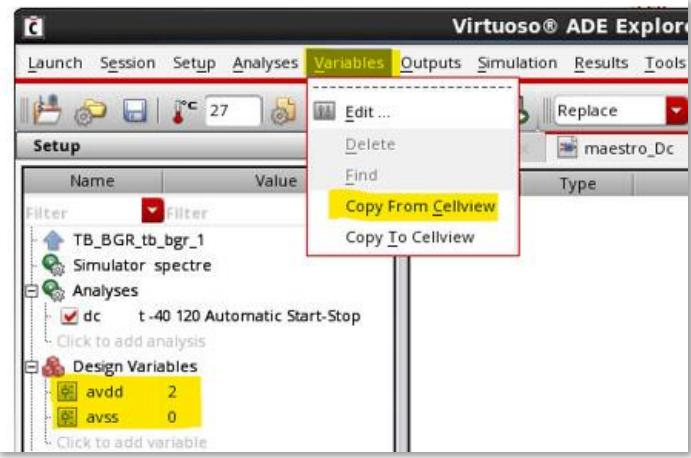

**Figure 69: Copying variables from cell view**

- Action 93: In the **ADE Explorer** window, click on the green button to **netlist and run** the simulation.
- Action 94: Select **Results > Direct Plot > Main Form** in the **ADE Explorer** window as shown in Figure 70 to open **Direct Plot Form**.

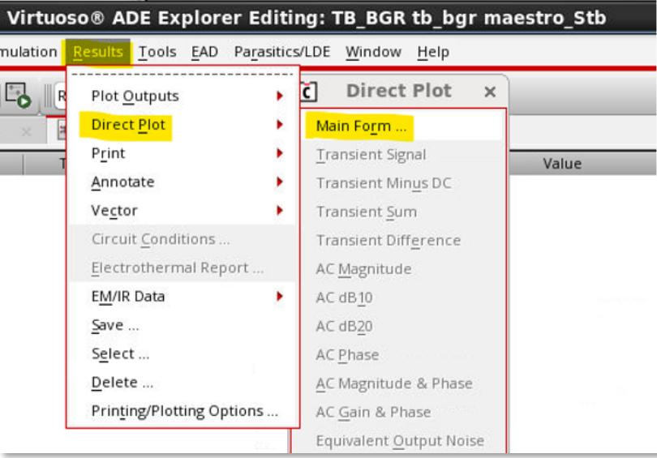

**Figure 70: Opening Direct Plot Form from ADE Explorer**

- Action 95: In the **Direct Plot Form** window, select the following to generate the Bode Plot:
	- **Loop Gain** from **Function**
	- **Magnitude and Phase** as **Modifier**
	- **dB20** as **Magnitude Modifier**
	- Enable **Add To Outputs**.
	- Click on the **Plot** button.

| Plotting Mode<br>Analysis | Append                                  |
|---------------------------|-----------------------------------------|
| C stb                     |                                         |
|                           |                                         |
| Function                  |                                         |
| S                         | Loop Gain Stability Summary             |
|                           | Phase Margin J Gain Margin              |
|                           | J PM Frequency GM Frequency             |
| Modifier                  |                                         |
|                           | Magnitude J Phase @ Magnitude and Phase |
| Magnitude Modifier        |                                         |
| None J dB10 @ dB20        |                                         |
| Add To Outputs            | Plot                                    |

### **Figure 71: Plotting loop gain from Direct Plot Form**

The loop gain waveforms will be plotted as shown in Figure 72.

Action 96: In the **ViVA** window, click **Split Current Strip** to separate the plots.

Action 97: Add single-point markers using the **M** bindkey on the plot.

Action 98: Place a vertical marker using the **V** bindkey on the plot.

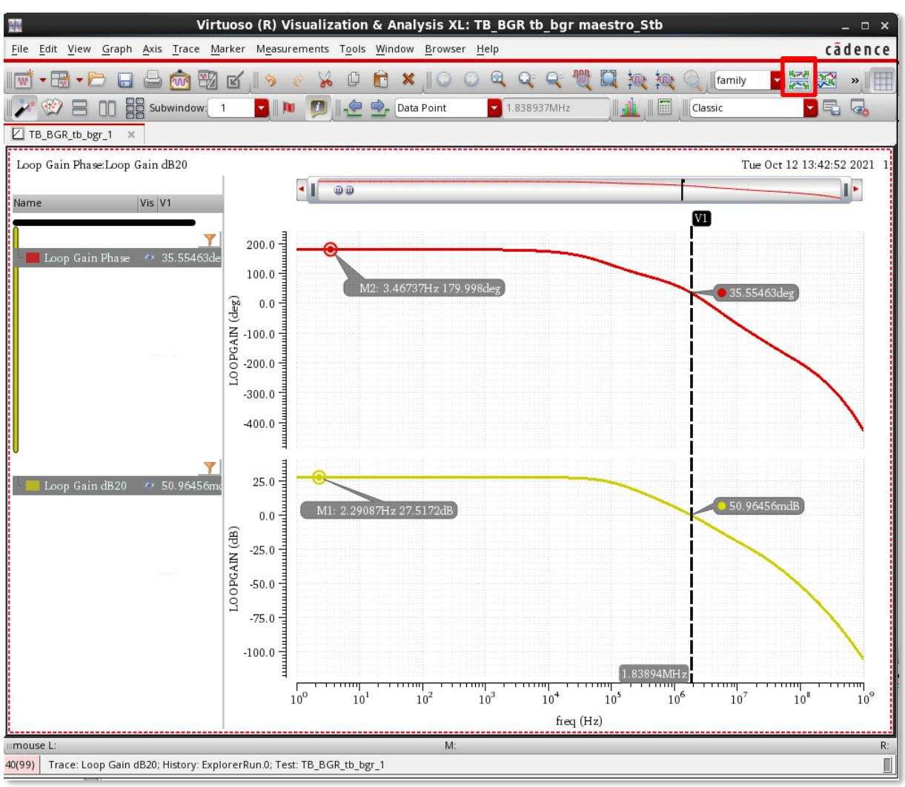

**Figure 72: Loop gain and phase plots in ViVA XL window**

- Action 99: In the **Direct Plot Form** window, select **Phase Margin** as **Function** to show the phase margin value in degrees as shown in Figure 73.
- Action 100: Click on **Add To Outputs** to add the phase margin expression to the maestro view.

|                           | Direct Plot Form              |
|---------------------------|-------------------------------|
| Plotting Mode<br>Analysis | Append                        |
| O stb                     |                               |
| Function                  |                               |
| Loop Gain                 | Stability Summary             |
|                           | Phase Margin   Gain Margin    |
|                           | J PM Frequency J GM Frequency |
|                           | Phase Margin = 35.5313 (Deg)  |
| Add To Outputs            |                               |
|                           | ose Help                      |

**Figure 73: Displayed phase margin in Direct Plot Form**

- Action 101: In the **Direct Plot Form** window, select **Gain Margin** as **Function** to show the gain margin value in **dB** as shown in Figure 74.
- Action 102: Click on **Add To Outputs** to add the gain margin expression to the maestro view.

| Direct Plot Form                                 |                 |
|--------------------------------------------------|-----------------|
| Append<br>Plotting Mode<br>Analysis              |                 |
| O stb                                            |                 |
| Function                                         |                 |
| Loop Gain<br>Stability Summary                   |                 |
| 0<br>Phase Margin J Gain Margin                  |                 |
| PM Frequency GM Frequency                        |                 |
| Gain Margin = 6.87348 (dB)<br>Add To Outputs   Y | Close<br>( Help |

**Figure 74: Displayed gain margin in Direct Plot Form**

Action 103: In the **Direct Plot Form** window, select **Stability Summary** to show both gain and phase margin values along with frequencies as shown in Figure 75.

|                                    | Direct Plot Form<br>X                                                                                   |
|------------------------------------|---------------------------------------------------------------------------------------------------------|
| Plotting Mode<br>Analysis<br>O stb | Append                                                                                                  |
| Function                           |                                                                                                         |
| Loop Gain                          | Stability Summary                                                                                       |
|                                    | Phase Margin J Gain Margin                                                                              |
|                                    | PM Frequency O GM Frequency                                                                             |
|                                    | Phase Margin = 35.5313 (Deg) @ freq = 1.8278M (Hz)<br>Gain Margin = 6.87348 (dB) @ freq = 3.37497M (Hz) |
|                                    |                                                                                                         |
|                                    |                                                                                                         |
|                                    | Close (<br>Help                                                                                         |

**Figure 75: Displayed stability summary in Direct Plot Form**

**Note:** In the **Direct Plot Form** window, you can select **PM Frequency** to get just the phase-margin frequency and select **GM Frequency** to get the gain-margin frequency.

Action 104: The **ADE maestro** view will appear as shown in Figure 76.

|                                                                                                        |                         | Virtuoso® ADE Explorer Editing: TB_BGR tb_bgr_ref maestro_Stb |       |                                                                                                                                                                               |         |
|--------------------------------------------------------------------------------------------------------|-------------------------|---------------------------------------------------------------|-------|-------------------------------------------------------------------------------------------------------------------------------------------------------------------------------|---------|
| Launch Session Setup Analyses Variables Outputs Simulation Results Tools EAD Parasitics DE Window Help |                         |                                                               |       |                                                                                                                                                                               | cadence |
| 二四是<br>12 27 27 27                                                                                     | Replace                 | · EX - 2<br>▼ (None)                                          |       |                                                                                                                                                                               |         |
| ? BX<br>Setup                                                                                          | Name<br>Type            | Details                                                       | Value | Plot   Save                                                                                                                                                                   | Spec    |
| Name<br>Value                                                                                          | Loop Gain Phase<br>expr | phaseDegUnwrapped(getData("loopGain" ?result "stb"))          | 1 2   | <                                                                                                                                                                             | ੀਕ      |
| * Filter<br>Filter                                                                                     | 1111 oon Gain dB20      | db(maσ(σetData("loonGain" ?result "sto")))                    |       | ಡಿ                                                                                                                                                                            | 1       |
| 1<br>TB_BGR_tb_bgr_1                                                                                   | Phase Margin<br>expr    | getData("phaseMargin" ?result "stb_margin")                   | 35.53 | 4<br>I                                                                                                                                                                        | 20      |
| 6<br>Simulator spectre                                                                                 | Gain Margin<br>expr     | getData("gainMargin" ?result "stb_margin")                    | 6.873 | ﺍﻟﻤﺮﺍﺟﻊ   ﺍﻟﻤﺴﺎﺣﺔ ﺍﻟﻤﺘﺤﺪﺓ ﺍﻟﻤﺘﺤﺪﺓ ﺍﻟﻤﺘﺤﺪﺓ ﺍﻟﻤﺘﺤﺪﺓ ﺍﻟﻤﺘﺤﺪﺓ ﺍﻟﻤﺘﺤﺪﺓ ﺍﻟﻤﺘﺤﺪﺓ ﺍﻟﻤﺘﺤﺪﺓ ﺍﻟﻤﺘﺤﺪﺓ ﺍﻟﻤﺘﺤﺪﺓ ﺍﻟﻤﺘﺤﺪﺓ ﺍﻟﻤﺘﺤﺪﺓ ﺍﻟﻤﺘﺤﺪﺓ ﺍﻟﻤﺘﺤﺪﺓ ﺍﻟﻤﺘﺤﺪﺓ ﺍﻟﻤﺘﺤﺪﺓ ﺍﻟﻤﺘﺤﺪﺓ ﺍﻟﻤﺘﺤﺪﺓ ﺍﻟﻤﺘﺤﺪﺓ ﺍﻟﻤ |         |
| 白 & Analyses                                                                                           |                         |                                                               |       |                                                                                                                                                                               | ×       |
| v stb<br>1 1G //1 8/IPRB0 Automatic Star                                                               |                         |                                                               |       |                                                                                                                                                                               |         |
| 4 Click to add analysis                                                                                |                         |                                                               |       |                                                                                                                                                                               |         |
| ට විසි Design Variables                                                                                |                         |                                                               |       |                                                                                                                                                                               |         |
| രി<br>avdd                                                                                             |                         |                                                               |       |                                                                                                                                                                               |         |
| 网<br>0<br>વ્યવસ્ત                                                                                      |                         |                                                               |       |                                                                                                                                                                               |         |
| Click to add variable                                                                                  |                         |                                                               |       |                                                                                                                                                                               |         |
| 国网 Parameters                                                                                          |                         |                                                               |       |                                                                                                                                                                               |         |


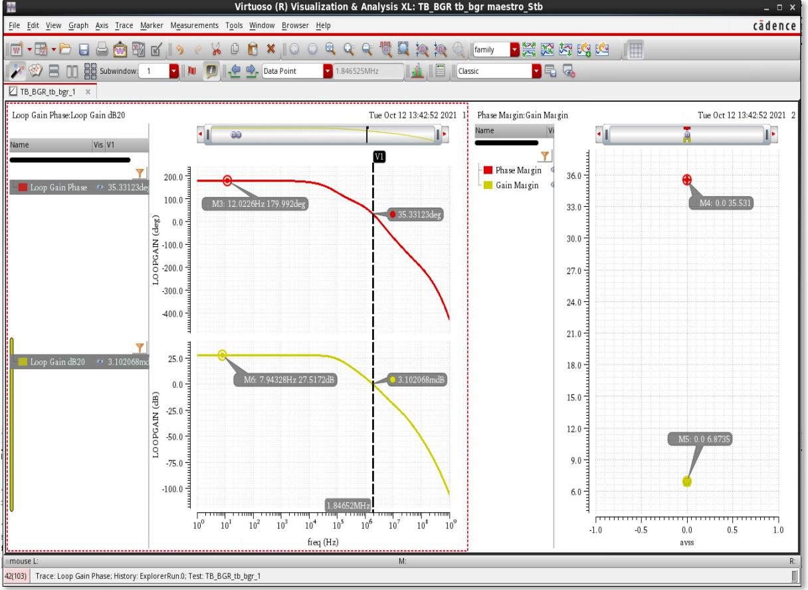

### **Figure 77: Output plots**

Action 106: Close all windows but leave the **Virtuoso** session open for the next lab.

### <span id="page-50-0"></span>**Lab 4: Transient Noise Measurement of Bandgap**

- Transient noise calculates the effects of large-signal noise on virtually any system. It determines the impact of noise in the time domain. This is an extension to the current **transient analysis** in **Spectre**.
- This section provides an overview of the transient noise analysis setup form in **ADE**. Later, it provides an overview of **Direct Plot Form** (for plotting transient noise results after the transient simulation).

Action 107: From the **Library Manager**, open the **TB\_BGR > tb\_bgr > schematic**  view. The schematic window opens as shown in Figure 78.

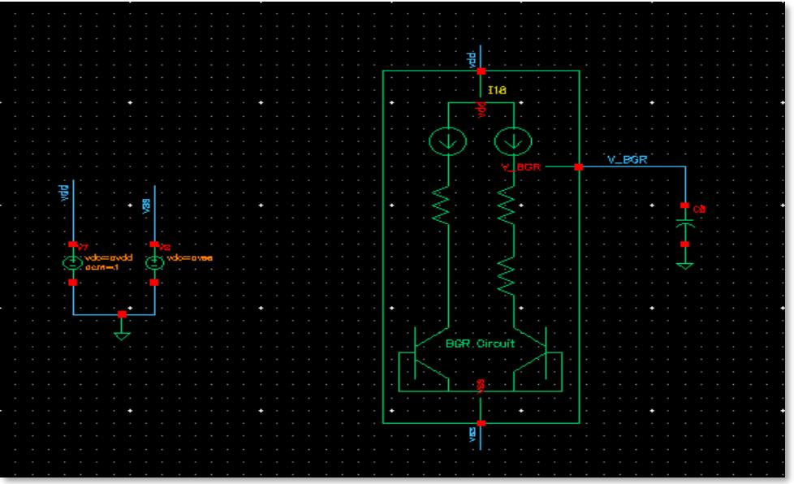

**Figure 78: Schematic of tb\_bgr cell testbench**

Action 108: From the schematic, select **Launch > ADE Explorer**.

Action 109: In the **Launch ADE Explorer** window, select **Create New View** and click **OK**.

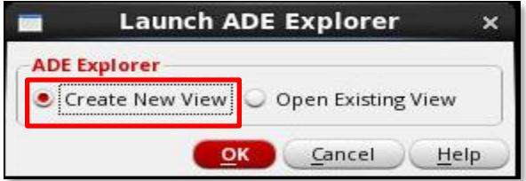

**Figure 79: Launching ADE Explorer from the schematic window**

Action 110: In the **Create new ADE Explorer view** window, change the view name to maestro\_Tran\_Noise and click **OK**.

|                          | Create new ADE Explorer view<br>X                   |
|--------------------------|-----------------------------------------------------|
| File                     |                                                     |
| Library                  | TB BGR                                              |
| Cell                     | tb_bgr                                              |
| View                     | maestro_Tran_Noise                                  |
| Type                     | maestro                                             |
| Application<br>Open with | ADE Explorer                                        |
|                          | _ Always use this application for this type of file |
| Library path file        |                                                     |
|                          | /BGR_Verification_Workshop/cds.lib                  |
|                          | Open in ● new tab ○ current tab ○ new window        |
|                          | Cancel<br>Help                                      |

**Figure 80: Opening maestro\_Tran\_Noise view of the tb\_bgr cell** 

The **ADE Explorer** window opens as shown in Figure 81.

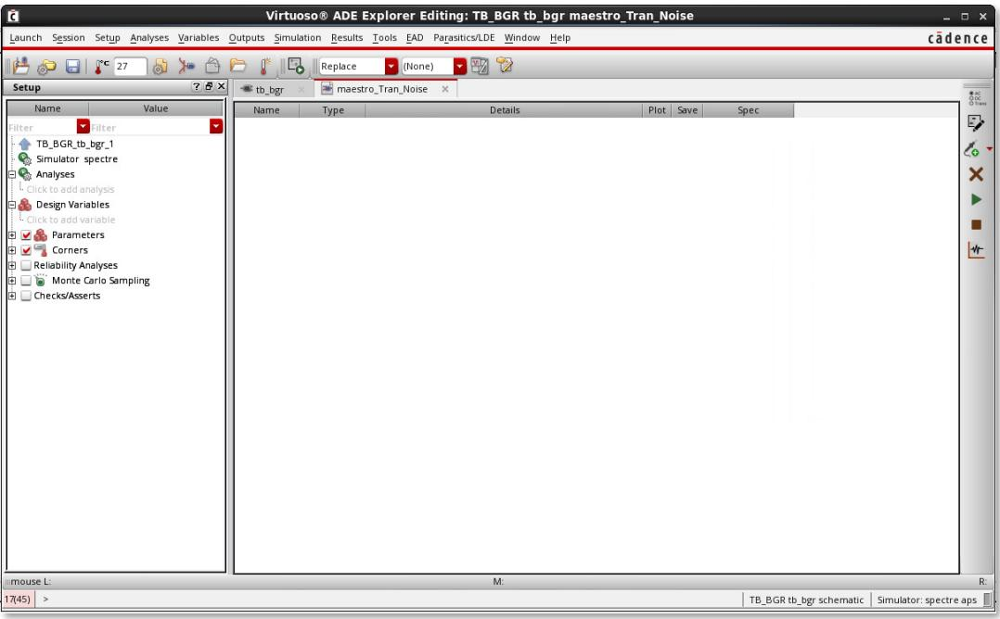

#### **Figure 81: ADE Explorer window showing maestro\_Tran\_Noise view**

In **ADE Explorer**, select **Click to add analysis** in the **Analyses** section of the **Setup** assistant as shown in Figure 82.

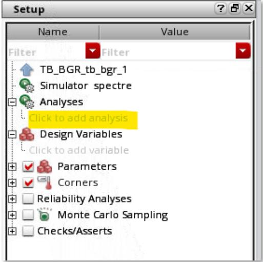

#### **Figure 82: Opening 'Analyses' form from 'Click to add analysis'**

Action 111: In the **Choosing Analyses** form, select the **tran** analysis in **Choosing Analyses** form & set the following options as below:

- Enable the **Transient Noise** checkbox.
- Set **Noise Fmax** to **163.84M**.
- Enable the **Fourier Analysis Settings** checkbox.
- Set **Circuit Fundamental Frequency** to **10K**, **PSD Max Frequency** to **100M**, and **PSD Min Frequency** to **10K**.
- Click **OK**.

For more information about setting up transient noise, refer to the article, [Setting up](https://support.cadence.com/apex/ArticleAttachmentPortal?id=a1Od0000002JfiMEAS&pageName=ArticleContent)  [transient noise on a bandgap circuit,](https://support.cadence.com/apex/ArticleAttachmentPortal?id=a1Od0000002JfiMEAS&pageName=ArticleContent) to get an understanding of parameters values related to transient noise analyses, that is, Noise Fmax, PSD Max Frequency, and so on.

| Analysis           | ● tran                              | O dc                 | ac                                                            |    | noise   |
|--------------------|-------------------------------------|----------------------|---------------------------------------------------------------|----|---------|
|                    | xf                                  | sens                 | dcmatch                                                       |    | acmatch |
|                    | stb                                 | pz                   | If                                                            | sp |         |
|                    | envip                               | 555                  | pac                                                           |    | pstb    |
|                    | pnoise                              | pxf                  | psp                                                           |    | dbss    |
|                    | qpac                                | qpnoise O            | qpxf                                                          |    | dbsp    |
|                    | hb                                  | ) hbac               | Chbstb                                                        |    | hbnoise |
|                    | hbsp                                | / hbxf               |                                                               |    |         |
|                    |                                     | Transient Analysis   |                                                               |    |         |
| Stop Time          | 1.8m                                |                      |                                                               |    |         |
|                    |                                     |                      |                                                               |    |         |
|                    | Accuracy Defaults (errpreset)       |                      |                                                               |    |         |
|                    | _ conservative _ moderate _ liberal |                      |                                                               |    |         |
|                    |                                     |                      |                                                               |    |         |
| Transient Noise    |                                     |                      |                                                               |    |         |
| Noise Fmax         | 163.84M                             |                      | Tran noise Options                                            |    |         |
|                    | Fourier Analysis Settings           |                      |                                                               |    |         |
|                    |                                     |                      |                                                               |    |         |
|                    | Circuit Fundamental Frequency       |                      | 10K                                                           |    |         |
| _ PSD Start Time   |                                     |                      | 100u                                                          |    |         |
|                    |                                     | Sampling Settings    |                                                               |    |         |
| PSD Max Frequency  |                                     |                      | 100M                                                          |    |         |
|                    |                                     |                      |                                                               |    |         |
|                    | PSD Min Frequency                   |                      | 10K                                                           |    |         |
|                    |                                     |                      | Tran Stop Time will be calculated automatically when enabled. |    |         |
|                    |                                     |                      |                                                               |    |         |
| Strobe             |                                     |                      |                                                               |    |         |
|                    |                                     |                      |                                                               |    |         |
|                    |                                     | PSD Period Averaging |                                                               |    |         |
|                    | Number of PSD Windows               |                      | 16                                                            |    |         |
|                    |                                     | PSD Summary          |                                                               |    |         |
| PSD Start Time     |                                     | 100u                 | PSD Stop Time                                                 |    | 1.7m    |
|                    |                                     |                      |                                                               |    |         |
| PSD Min Freq       |                                     | 10K                  | PSD Max Freq                                                  |    | 100M    |
|                    | Number of Samples                   | 320000               | Window Size                                                   |    | 20000   |
|                    |                                     |                      |                                                               |    |         |
| _ Multiple Runs    |                                     |                      |                                                               |    |         |
|                    | Number of Runs                      | 100                  |                                                               |    |         |
| Noise Contribution |                                     | _ on _ off           |                                                               |    |         |

**Figure 83: Setup of transient noise analysis**

Action 112: In the **ADE Explorer** window, click on **Variables** and select **Copy From Cellview** as shown in Figure 84.

In the **Setup** view assistant, set the **Design Variables** values for **avdd=2** and **avss=0**.

**Figure 84: Copying variables from cell view**

- Action 113: In the **ADE Explorer** window, click on the green button to **netlist and run** the simulation.
- Action 114: Once the simulation finishes, click on **Simulation > Output Log** in the **ADE Explorer** window as shown in Figure 85. Verify that simulation has completed with 0 errors.

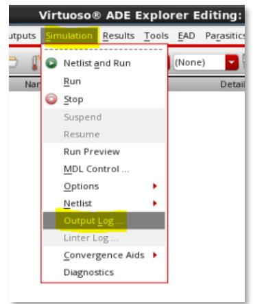

**Figure 85: Opening simulation log file from ADE Explorer window**

Action 115: Click **Results > Direct Plot > Main Form** in the **ADE Explorer** window as shown in Figure 86 to open the **Direct Plot** form.

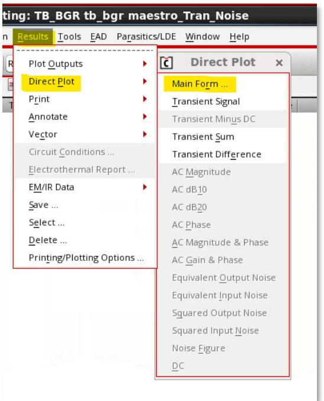

**Figure 86: Opening Direct Plot Form from ADE Explorer window**

Action 116: In the **Direct Plot Form** window, select **Transient Noise** as **Function**.

Action 117: Select **Net** from the drop-down.

**Direct Plot Form** will look as shown in Figure 87 with the default PSD settings. Do not change these settings.

Action 118: Click on **Add To Outputs** to add the transient noise expression to the maestro view.

| Direct Plot Form<br>×     |                    |  |
|---------------------------|--------------------|--|
| Plotting Mode<br>Analysis | Append             |  |
| tran<br>O                 |                    |  |
| Function                  |                    |  |
| Voltage                   | Current            |  |
| Power                     | Noise Measurement  |  |
| O Transient Noise         |                    |  |
| · PSD C PN                |                    |  |
| Net<br>Select             |                    |  |
| PSD Default Settings      |                    |  |
| Fundamental Freq          | 10K                |  |
| Bin Number                | 16                 |  |
| Sample per Period         | 20K                |  |
| Detailed Settings         |                    |  |
| From                      | 100u               |  |
| To                        | 1 . 7 m            |  |
| Number of Samples         | 320000             |  |
| Window Type               | Rectangular        |  |
| Smoothing Factor          | 1                  |  |
| Window Size               | 20000              |  |
| Detrending Mode           | None               |  |
| Coherent Gain             | (none)             |  |
| Coherent Gain Factor 0    |                    |  |
| Add To Outputs &          | Default<br>(Replot |  |
| > Select Net on schematic |                    |  |
|                           | Close<br>Help      |  |

#### **Figure 87: Plotting output noise from Direct Plot Form**

Action 119: Select the **/V\_BGR** net from the **schematic** window.

Action 120: The Output Noise plot (in dB) will appear as shown in Figure 88.

Action 121: Place single-point markers on the plot using the **M** bindkey.

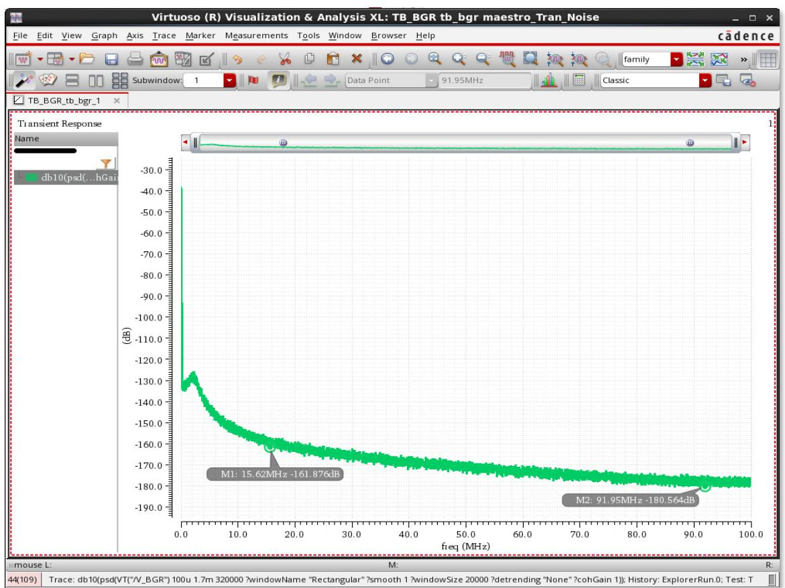

**Figure 88: Output transient noise plot in ViVA XL**

Action 122: Rename this expression in the maestro view to Tran\_Noise\_Plot as shown in Figure 89.

| Virtuoso® ADE Explorer Editing: TB_BGR tb_bgr_ref maestro_Tran_Noise                                                                                                                                                                 |                                                                                                                                        |                               |  |
|--------------------------------------------------------------------------------------------------------------------------------------------------------------------------------------------------------------------------------------|----------------------------------------------------------------------------------------------------------------------------------------|-------------------------------|--|
| Launch Session Setyp Analyses Variables Qutputs Simulation Results Tools EAD Parastics/LDE Window Help                                                                                                                               |                                                                                                                                        | cadence                       |  |
| 1/2 2 日 - 8 27 2 2 2 2 2 2 2 1 - 8 P P 1 - 8 P Replace<br>(None) (None) (2                                                                                                                                                           |                                                                                                                                        |                               |  |
| x BX<br>Setup<br>Name<br>Type<br>Tran_Noise_Plot<br>expr<br>Name<br>Value<br>><br>ilter<br>i ter<br>↑ TB BGR tb bgr_1<br>Simulator spectre<br>白 Analyses<br>tran<br>0 1.8m<br>L Click to add analysis<br>白晶 Design Variables<br>avdd | Value<br>Details<br>Plot   Save<br> db10(psd(VT("/V_BGR")0.0001 0.0017 320000 ?windowName "Rectangular" ?smooth 1 ?windowSiz<br>y<br>1 | Spec<br>2 Days<br>C<br>G<br>× |  |

#### **Figure 89: ADE maestro\_Tran\_Noise view**

Action 123: In the **ADE Explorer** window, click **Plot Outputs** .

Action 124: **Close** all windows and the **Virtuoso** session.

This concludes the RAK.

Learn more at Cadence Learning and Support Portal - https://support.cadence.com © 2021 Cadence Design Systems, Inc. All rights reserved worldwide. Page 58

### <span id="page-58-0"></span>**References**

- 1. [Spectre Classic Simulator, Spectre Accelerated Parallel Simulator \(APS\), and](https://support.cadence.com/apex/techpubDocViewerPage?xmlName=spectreuser.xml&title=Spectre%20Classic%20Simulator,%20Spectre%20APS,%20Spectre%20X,%20and%20Spectre%20XPS%20User%20Guide%20--%20The%20Spectre%20X%20Circuit%20Simulator%20-%20Migrating%20from%20Spectre%20APS&hash=pgfId-1087925&c_version=20.1&path=spectreuser/spectreuser20.1/spectrex.html#pgfId-1087925)  [Spectre Extensive Partitioning Simulator \(XPS\) User Guide](https://support.cadence.com/apex/techpubDocViewerPage?xmlName=spectreuser.xml&title=Spectre%20Classic%20Simulator,%20Spectre%20APS,%20Spectre%20X,%20and%20Spectre%20XPS%20User%20Guide%20--%20The%20Spectre%20X%20Circuit%20Simulator%20-%20Migrating%20from%20Spectre%20APS&hash=pgfId-1087925&c_version=20.1&path=spectreuser/spectreuser20.1/spectrex.html#pgfId-1087925)
- 2. [Virtuoso ADE Explorer User Guide](https://support.cadence.com/apex/techpubDocViewerPage?xmlName=explorer.xml&title=Virtuoso%20ADE%20Explorer%20User%20Guide%20--%20Setting%20Up%20Explorer%20Environment%20-%20Setting%20Up%20Explorer%20Environment&hash=pgfId-1041651&c_version=ICADVM20.1&path=Explorer/ExplorerICADVM20.1/chap2.html#pgfId-1041651)
- 3. [Virtuoso Visualization and Analysis XL User Guide](https://support.cadence.com/apex/techpubDocViewerPage?xmlName=vivaxlug.xml&title=Virtuoso%20Visualization%20and%20Analysis%20XL%20User%20Guide%20--%20Calculator%20Functions%20-%20Calculator%20Functions&hash=pgfId-1234892&c_version=IC6.1.8&path=vivaxlug/vivaxlugIC6.1.8/appD.html#pgfId-1234892)
- 4. [Setting up transient noise on a bandgap circuit](https://support.cadence.com/apex/ArticleAttachmentPortal?id=a1Od0000002JfiMEAS&pageName=ArticleContent)

### <span id="page-58-1"></span>**Supports**

Cadence Learning and Support Portal provides access to support resources, including an extensive knowledge base, access to software updates for Cadence products, and the ability to interact with Cadence Customer Support. Visit [https://support.cadence.com](https://support.cadence.com/).

### <span id="page-58-2"></span>**Feedback**

Email comments, questions, and suggestions to [content\\_feedback@cadence.com.](mailto:content_feedback@cadence.com)