# CHAPTER

Razavi-3930640 book December 17, 201517:21 509

# *Bandgap References*

Analog circuits incorporate voltage and current references extensively. Such references are dc quantities that exhibit little dependence on supply and process parameters and a *well-defined* dependence on the temperature. For example, the bias current of a differential pair must be generated according to a reference, for it affects the voltage gain and noise of the circuit. We have also seen the need for precise voltages to define common-mode levels in op amps. Moreover, in systems such as A/D and D/A converters, a reference is required to define the input or output full-scale range.

In this chapter, we deal with the design of reference generators in CMOS technology, focusing on well-established "bandgap" techniques. First, we study supply-independent biasing and the problem of start-up. Next, we describe temperature-independent references and examine issues such as the effect of offset voltages. Finally, we present constant-*Gm* biasing and study an example of state-of-the-art bandgap references.

## **12.1 General Considerations**

As mentioned above, the objective of reference generation is to establish a dc voltage or current that is independent of the supply and process and has a well-defined behavior with temperature. In most applications, the required temperature dependence assumes one of three forms: (1) proportional to absolute temperature (PTAT); (2) constant-*Gm* behavior, i.e., such that the transconductance of certain transistors remains constant; (3) temperature independent. We can therefore divide the task into two design problems: supply-independent biasing and definition of the temperature variation.

In addition to supply, process, and temperature variability, several other parameters of reference generators may be critical as well. These include output impedance, output noise, and power dissipation. We return to these issues later in this chapter.

# **12.2 Supply-Independent Biasing**

Our use of bias currents and current mirrors in previous chapters has implicitly assumed that a "golden" reference current is available. As shown in Fig. 12.1(a), if *IREF* does not vary with *VDD*, and channellength modulation of *M*2 and *M*3 is neglected, then *ID*2 and *ID*3 remain independent of the supply voltage. The question then is—How do we generate *IREF*?

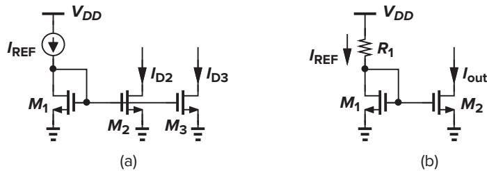

**Figure 12.1** Current mirror biasing using (a) an ideal current source and (b) a resistor.

As an approximation of a current source, we tie a resistor from *VDD* to the gate of *M*1 [Fig. 12.1(b)]. However, the output current of this circuit is quite sensitive to *VDD*:

$$
\Delta I\_{\rm out} = \frac{\Delta V\_{DD}}{R\_1 + 1/\text{g}\_{m1}} \cdot \frac{(W/L)\_2}{(W/L)\_1} \tag{12.1}
$$

In order to arrive at a less sensitive solution, we postulate that the circuit must bias *itself*, i.e., *IREF* must be somehow derived from *Iout* . The idea is that if *Iout* is to be ultimately independent of *VDD*, then *IREF* can be a replica of *Iout* . Figure 12.2 illustrates an implementation where *M*3 and *M*4 copy *Iout* , thereby defining *IREF* . In essence, *IREF* is "bootstrapped" to *Iout* . With the sizes chosen here, we have *Iout* = *K IREF* if channel-length modulation is neglected. Note that, since each diode-connected device feeds from a current source, *Iout* and *IREF* are relatively independent of *VDD*.

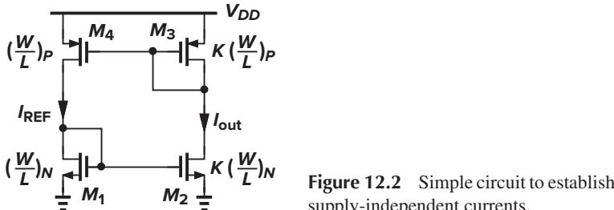

supply-independent currents.

Since *Iout* and *IREF* in Fig. 12.2 display little dependence on *VDD*, their magnitude is set by other parameters. How do we calculate these currents? Interestingly, if *M*1–*M*4 operate in saturation and λ ≈ 0, then the circuit is governed by only one equation, *Iout* = *K IREF* , and hence can support *any* current level! For example, if we initially force *IREF* to be 10 *µ*A, the resulting *Iout* of *K* × 10 *µ*A "circulates" around the loop, sustaining these current levels in the left and right branches indefinitely.

To uniquely define the currents, we add another constraint to the circuit, e.g., as shown in Fig. 12.3(a). Here, resistor *RS* decreases the current of *M*2 while the PMOS devices require that *Iout* = *IREF* because they have identical dimensions and thresholds. We can write *VG S*1 = *VG S*2 + *ID*2*RS*, or

$$\sqrt{\frac{2I\_{\text{out}}}{\mu\_{n}\text{C}\_{ox}(W/L)\_{N}}} + V\_{TH1} = \sqrt{\frac{2I\_{\text{out}}}{\mu\_{n}\text{C}\_{ox}K(W/L)\_{N}}} + V\_{TH2} + I\_{\text{out}}R\_{S} \tag{12.2}$$

Neglecting body effect, we have

$$\sqrt{\frac{2I\_{\text{out}}}{\mu\_n C\_{ox}(W/L)\_N}} \left(1 - \frac{1}{\sqrt{K}}\right) = I\_{\text{out}} R\_S \tag{12.3}$$

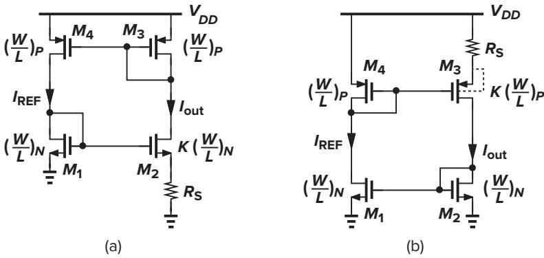

**Figure 12.3** (a) Addition of *RS* to define the currents; (b) alternative implementation eliminating body effect.

and hence

$$I\_{\rm out} = \frac{2}{\mu\_n C\_{\rm ox} (W/L)\_N} \cdot \frac{1}{R\_S^2} \left(1 - \frac{1}{\sqrt{K}}\right)^2 \tag{12.4}$$

As expected, the current is independent of the supply voltage (but still a function of process and temperature).

The assumption *VT H*1 = *VT H*2 introduces some error in the foregoing calculations because the sources of *M*1 and *M*2 are at different voltages. Shown in Fig. 12.3(b) is to place the resistor in the source of *M*3 while eliminating body effect by tying the source and bulk of each PMOS transistor. Another solution is described in Problem 12.1.

The circuits of Figs. 12.3(a) and (b) exhibit little supply dependence if channel-length modulation is negligible. For this reason, relatively long channels are used for all of the transistors in the circuit. This also helps reduce their flicker noise.

#### ▲**Example 12.1**

Assuming λ =% 0 in Fig. 12.3(a), estimate the change in *Iout* for a small change !*VDD* in the supply voltage.

## **Solution**

Simplifying the circuit as depicted in Fig. 12.4, where *R*1 = *rO*1&*(*1*/gm*1*)* and *R*3 = *rO*3&*(*1*/gm*3*)*, we calculate the "gain" from *VDD* to *Iout* . The small-signal gate-source voltage of *M*4 equals −*Iout R*3, and the current through *rO*4 is *(VDD* − *VX )/rO*4. Thus,

$$\frac{V\_{DD} - V\_X}{r\_{O4}} + I\_{out}R\_3g\_{m4} = \frac{V\_X}{R\_1} \tag{12.5}$$

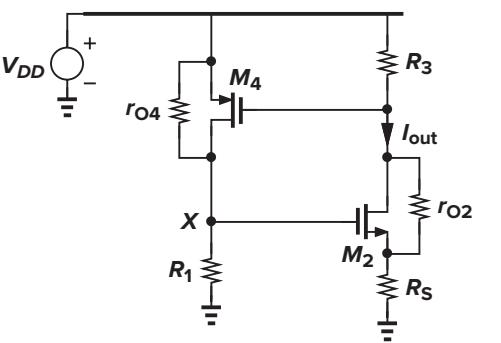

▲

If we denote the equivalent transconductance of *M*2 and *RS* by *Gm*2 = *Iout /VX* , then

$$\frac{I\_{out}}{V\_{DD}} = \frac{1}{r\_{O4}} \left[ \frac{1}{G\_{m2}(r\_{O4} \| R\_1)} - g\_{m4} R\_3 \right]^{-1} \tag{12.6}$$

Note from Chapter 3 that

Razavi-3930640 book December 17, 201517:21 512

$$G\_{m2} = \frac{g\_{m2}r\_{O2}}{R\_S + r\_{O2} + (g\_{m2} + g\_{mb2})R\_Sr\_{O2}}\tag{12.7}$$

Interestingly, the sensitivity vanishes if *rO*4 = ∞.

In some applications, the sensitivity given by (12.6) is prohibitively large. Also, owing to various capacitive paths, the supply sensitivity of the circuit rises at high frequencies. For these reasons, the supply voltage of the core is often derived from a locally-generated, less sensitive voltage. We return to this point in Sec. 12.8.

An important issue in supply-independent biasing is the existence of "degenerate" bias points. In the circuit of Fig. 12.3(a), for example, if all of the transistors carry zero current when the supply is turned on, they may remain off indefinitely because the loop can support a zero current in both branches. This condition is not predicted by (12.4) because in manipulating (12.3), we divided both sides by √*Iout* , tacitly assuming that *Iout* =% 0. In other words, the circuit can settle in one of *two* different operating conditions.

Called the "start-up" problem, the above issue is resolved by adding a mechanism that drives the circuit out of the degenerate bias point when the supply is turned on. Shown in Fig. 12.5(a) is a simple example, where the diode-connected device *M*5 provides a current path from *VDD* through *M*3 and *M*1 to ground upon start-up. Thus, *M*3 and *M*1, and hence *M*2 and *M*4, cannot remain off. Of course, this technique is practical only if *VT H*1 + *VT H*5 + |*VT H*3| *< VDD* and *VG S*1 + *VT H*5 + |*VG S*3| *> VDD*, the latter to ensure that *M*5 remains off after start-up. Another start-up circuit is analyzed in Problem 12.2.

The problem of start-up generally requires careful analysis and simulation. The supply voltage must be ramped from zero in a dc sweep simulation (such that parasitic capacitances do not cause false start-up) as well as in a transient simulation and the behavior of the circuit examined for each supply voltage. Figure 12.5(b) depicts an example of the observed behavior in the presence of the start-up circuit. In complex implementations, more than one degenerate point may exist.

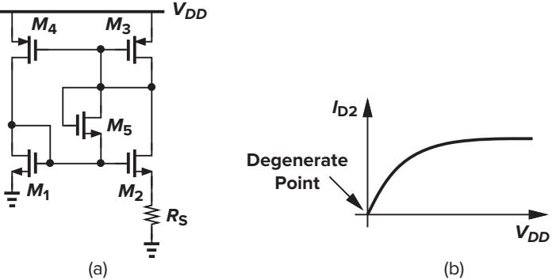

**Figure 12.5** (a) Addition of start-up device to the circuit of Fig. 12.3(a), and (b) illustration of degenerate point.

# **12.3 Temperature-Independent References**

Reference voltages or currents that exhibit little dependence on temperature prove essential in many analog circuits. It is interesting to note that, since most process parameters vary with temperature, if a reference is temperature-independent, then it is usually process-independent as well.

How do we generate a quantity that remains constant with temperature? We postulate that if two quantities having opposite temperature coefficients (TCs) are added with proper weighting, the result displays a zero TC. For example, for two voltages *V*1 and *V*2 that vary in opposite directions with temperature, we choose α1 and α2 such that α1∂*V*1*/*∂*T* + α2∂*V*2*/*∂*T* = 0, obtaining a reference voltage, *VREF* = α1*V*1 + α2*V*2, with zero TC.

We must now identify two voltages that have positive and negative TCs. Among various device parameters in semiconductor technologies, the characteristics of bipolar transistors have proven the most reproducible and well-defined quantities that can provide positive and negative TCs. Even though many parameters of MOS devices have been considered for the task of reference generation [1, 2], bipolar operation still forms the core of such circuits.

## **12.3.1 Negative-TC Voltage**

The base-emitter voltage of bipolar transistors or, more generally, the forward voltage of a *pn*-junction diode exhibits a negative TC. We first obtain the expression for the TC in terms of readily-available quantities.

For a bipolar device, we can write *IC* = *IS* exp*(VB E /VT )*, where *VT* = *kT/q*. The saturation current *IS* is proportional to *µkTn*2 *i* , where *µ* denotes the mobility of minority carriers and *ni* is the intrinsic carrier concentration of silicon. The temperature dependence of these quantities is represented as *µ* ∝ *µ*0*T m*, where *m* ≈ −3*/*2, and *n*2 *i* ∝ *T* 3 exp[−*Eg/(kT )*], where *Eg* ≈ 1*.*12 eV is the bandgap energy of silicon. Thus,

$$I\_S = bT^{4+m} \exp\frac{-E\_g}{kT} \tag{12.8}$$

where *b* is a proportionality factor. Writing *VB E* = *VT* ln*(IC/IS)*, we can now compute the TC of the base-emitter voltage. In taking the derivative of *VB E* with respect to *T* , we must know the behavior of *IC* as a function of the temperature. To simplify the analysis, we assume for now that *IC* is held *constant*. Thus,

$$\frac{\partial V\_{BE}}{\partial T} = \frac{\partial V\_T}{\partial T} \ln \frac{I\_C}{I\_S} - \frac{V\_T}{I\_S} \frac{\partial I\_S}{\partial T} \tag{12.9}$$

From (12.8), we have

$$\frac{\partial I\_S}{\partial T} = b(4+m)T^{3+m} \exp\frac{-E\_\text{g}}{kT} + bT^{4+m} \left(\exp\frac{-E\_\text{g}}{kT}\right) \left(\frac{E\_\text{g}}{kT^2}\right) \tag{12.10}$$

Therefore,

$$\frac{V\_T}{I\_S} \frac{\partial I\_S}{\partial T} = (4+m)\frac{V\_T}{T} + \frac{E\_g}{kT^2} V\_T \tag{12.11}$$

With the aid of (12.9) and (12.11), we can write

$$\frac{\partial V\_{BE}}{\partial T} = \frac{V\_T}{T} \ln \frac{I\_C}{I\_S} - (4+m)\frac{V\_T}{T} - \frac{E\_g}{kT^2} V\_T \tag{12.12}$$

$$t = \frac{V\_{BE} - (4+m)V\_T - E\_g/q}{T} \tag{12.13}$$

Equation (12.13) gives the temperature coefficient of the base-emitter voltage at a given temperature *T* , revealing dependence on the magnitude of *VB E* itself. With *VB E* ≈ 750 mV and *T* = 300 K, we have ∂*VB E /*∂*T* ≈ −1*.*5 mV/K.

In old bipolar technologies, where *IC/IS* was relatively small (because the transistors were large), *VB E* ≈ 700 mV and ∂*VB E /*∂*T* ≈ −1*.*9 mV/K at room temperature. Modern bipolar transistors typically operate at much higher current densities, exhibiting *VB E* ≈ 800 mV and hence ∂*VB E /*∂*T* ≈ −1*.*5 mV/K at *T* = 300 K.

From (12.13), we note that the temperature coefficient of *VB E* itself depends on the temperature, creating error in constant reference generation if the positive-TC quantity exhibits a *constant* temperature coefficient.

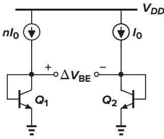

**Figure 12.6** Generation of PTAT voltage.

## **12.3.2 Positive-TC Voltage**

It was recognized in 1964 [3] that if two bipolar transistors operate at unequal current densities,1 then the *difference* between their base-emitter voltages is directly proportional to the absolute temperature. For example, as shown in Fig. 12.6, if two identical transistors (*IS*1 = *IS*2) are biased at collector currents of *n I*0 and *I*0 and their base currents are negligible, then

$$
\Delta V\_{BE} = V\_{BE1} - V\_{BE2} \tag{12.14}
$$

$$I = V\_T \ln \frac{nI\_0}{I\_{S1}} - V\_T \ln \frac{I\_0}{I\_{S2}} \tag{12.15}$$

$$l = V\_T \ln n \tag{12.16}$$

Thus, the *VB E* difference exhibits a positive temperature coefficient:

$$\frac{\partial \Delta V\_{BE}}{\partial T} = \frac{k}{q} \ln n \tag{12.17}$$

▲

Interestingly, this TC is independent of the temperature or behavior of the collector currents.2

#### ▲**Example 12.2**

How must *n* be chosen to yield a TC of +1*.*5 mV/K so as to cancel the TC of the base-emitter voltage at *T* = 300 K?

#### **Solution**

We choose *n* so that *(k/q)*ln *n* = 1*.*5 mV/K. Since *k/q* = *VT /T* = 0*.*087 mV/K, we have ln *n* ≈ 17*.*2 and hence *n* = 2*.*95 × 107!! We must therefore modify the circuit to avoid such a large disparity between the two currents.

1Current density is defined as the ratio of the collector current, *IC* , and the saturation current, *IS* .

2Nonidealities in the characteristics of bipolar transistors introduce a small temperature dependence in this TC.

#### ▲**Example 12.3**

Razavi-3930640 book December 17, 201517:21 515

Calculate !*VB E* in the circuit of Fig. 12.7, where *Q*2 is formed as the parallel combination of *m* units, each identical to *Q*1.

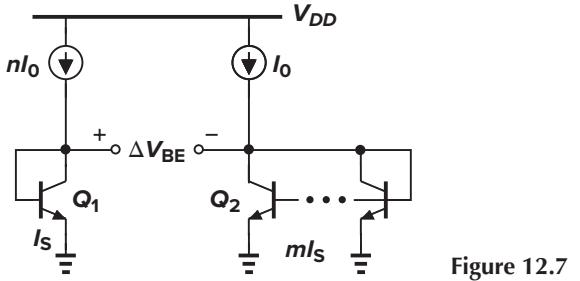

#### **Solution**

Neglecting base currents, we can write

$$
\Delta V\_{BE} = V\_T \ln \frac{nI\_0}{I\_S} - V\_T \ln \frac{I\_0}{mI\_S} \tag{12.18}
$$

$$
\lambda = Vr \ln(nm) \tag{12.19}
$$

The temperature coefficient is therefore equal to *(k/q)*ln*(nm)*. In this circuit, the two transistors' current densities differ by a factor of *nm*.

## **12.3.3 Bandgap Reference**

With the negative- and positive-TC voltages obtained above, we can now develop a reference that has a nominally zero temperature coefficient. We write *VREF* = α1*VB E* + α2*(VT* ln *n)*, where *VT* ln *n* is the difference between the base-emitter voltages of the two bipolar transistors operating at different current densities. How do we choose α1 and α2? Since at room temperature, ∂*VB E /*∂*T* ≈ −1*.*5 mV/K whereas ∂*VT /*∂*T* ≈ +0*.*087 mV/K, we may set α1 = 1 and choose α2 ln *n* such that*(*α2 ln *n)(*0*.*087 mV*/*K*)* = 1*.*5 mV/K. That is, α2 ln *n* ≈ 17*.*2, indicating that for zero TC

$$V\_{REF} \approx V\_{BE} + 17.2V\_T \tag{12.20}$$

$$
\approx 1.25\,\text{V} \tag{12.21}
$$

Let us now devise a circuit that adds *VB E* to 17*.*2*VT* . First, consider the circuit shown in Fig. 12.8, where the base currents are assumed to be negligible, transistor *Q*2 consists of *n* unit transistors in parallel, and *Q*1 is a unit transistor. Suppose we somehow force *VO*1 and *VO*2 to be equal. Then, *VB E*1 = *R I* + *VB E*2 and *R I* = *VB E*1 − *VB E*2 = *VT* ln *n*. Thus, *VO*2 = *VB E*2 + *VT* ln *n*, suggesting that *VO*2 can serve as a temperature-independent reference if ln *n* ≈ 17*.*2 (while *VO*1 and *VO*2 remain equal).

The circuit of Fig. 12.8 requires three modifications to become practical. First, a mechanism must be added to guarantee that *VO*1 = *VO*2. Second, since ln *n* = 17*.*2 translates to a prohibitively large *n*, the term *R I* = *VT* ln *n* must be scaled up by a reasonable factor. Third, *VO*2, which is somehow forced to be equal to *VO*1, *cannot* become temperature-independent because *VO*2 ≈ *VB E*1 ≈ 800 mV whereas, for temperature independence, we must have *VO*2 = *VB E*2 + 17*.*2*VT* ≈ 1*.*25 V. Shown in Fig. 12.9 is an implementation accomplishing all tasks [4]. Here, amplifier *A*1 senses *VX* and *VY* , driving the top terminals of *R*1 and *R*2 (*R*1 = *R*2) such that *X* and *Y* settle to approximately equal voltages. The

▲

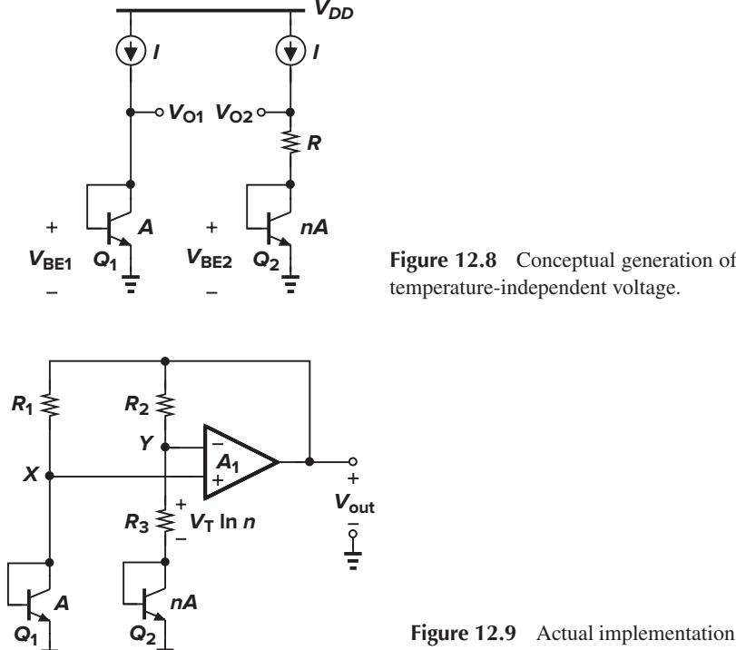

temperature-independent voltage.

**Figure 12.9** Actual implementation of the concept shown in Fig. 12.8.

reference voltage is obtained at the output of the amplifier (rather than at node *Y* ). Following the analysis of Fig. 12.8, we have *VB E*1 − *VB E*2 = *VT* ln *n*, arriving at a current equal to *VT* ln *n/R*3 through the right branch and hence an output voltage of

$$V\_{out} = V\_{BE2} + \frac{V\_T \ln n}{R\_3} (R\_3 + R\_2) \tag{12.22}$$

$$=V\_{BE2} + (V\_T \ln n) \left(1 + \frac{R\_2}{R\_3}\right) \tag{12.23}$$

For a zero TC, we must have *(*1 + *R*2*/R*3*)*ln *n* ≈ 17*.*2. For example, we may choose *n* = 31 and *R*2*/R*3 = 4. Note that these results do not depend on the TC of the resistors.

It is interesting to understand how the third issue mentioned above is resolved in the topology of Fig. 12.9: we do not attempt to make *VY* (≈ *VB E*1) temperature-independent; rather, we amplify the PTAT voltage drop across *R*3 by a factor of 1 + *R*2*/R*3 and then add the result to *VB E*2.

#### ▲**Example 12.4**

**Q1**

In Fig. 12.9, *R*1 and *R*2 are equal and sustain equal voltages, each carrying a current of *(VT* ln *n)/R*3. We therefore have

$$V\_{out} = V\_{BE1} + (V\_T \ln n) \frac{R\_1}{R\_3} \tag{12.24}$$

But the second term is *not* equal to 17*.*2*VT* if we have already chosen *(VT* ln *n)(*1 + *R*2*/R*3*)* = 17*.*2*VT* . Explain this discrepancy.

#### **Solution**

Razavi-3930640 book December 17, 201517:21 517

The first terms in (12.23) and (12.24) are different. We substitute *VB E*1 = *VB E*2 + *VT* ln *n* in Eq. (12.13):

$$\frac{\partial V\_{BE1}}{\partial T} = \frac{V\_{BE2} + V\_T \ln n - (4 + m)V\_T - E\_g/q}{T} \tag{12.25}$$

$$\dot{\delta} = \frac{\partial V\_{BE2}}{\partial T} + \frac{k}{q} \ln n \tag{12.26}$$

Thus,

$$\frac{\partial V\_{out}}{\partial T} = \frac{\partial V\_{BE1}}{\partial T} + \left(\frac{k}{q} \ln n\right) \frac{R\_1}{R\_3} \tag{12.27}$$

$$=\frac{\partial V\_{BE2}}{\partial T} + \left(\frac{k}{q}\ln n\right)\left(1 + \frac{R\_1}{R\_3}\right) \tag{12.28}$$

which is consistent with (12.23).

The circuit of Fig. 12.9 entails a number of design issues. We consider each one below.

**Collector Current Variation** The circuit of Fig. 12.9 violates one of our earlier assumptions: the collector currents of *Q*1 and *Q*2, given by *(VT* ln *n)/R*3, are proportional to *T* , whereas ∂*VB E /*∂*T* ≈ −1*.*5 mV/K was derived for a *constant* current. What happens to the temperature coefficient of *VB E* if the collector currents are PTAT? As a first-order iterative solution, let us assume that *IC*1 = *IC*2 ≈ *(VT* ln *n)/R*3. Returning to Eq. (12.9) and including ∂ *IC/*∂*T* , we have

$$\frac{\partial V\_{BE}}{\partial T} = \frac{\partial V\_T}{\partial T} \ln \frac{I\_C}{I\_S} + V\_T \left( \frac{1}{I\_C} \frac{\partial I\_C}{\partial T} - \frac{1}{I\_S} \frac{\partial I\_S}{\partial T} \right) \tag{12.29}$$

Since ∂ *IC/*∂*T* ≈ *(VT* ln *n)/(R*3*T )* = *IC/T* , we can write

$$\frac{\partial V\_{BE}}{\partial T} = \frac{\partial V\_T}{\partial T} \ln \frac{I\_C}{I\_S} + \frac{V\_T}{T} - \frac{V\_T}{I\_S} \frac{\partial I\_S}{\partial T} \tag{12.30}$$

Equation (12.13) is therefore modified as

$$\frac{\partial V\_{BE}}{\partial T} = \frac{V\_{BE} - (3+m)V\_T - E\_g/q}{T} \tag{12.31}$$

indicating that the TC is slightly less negative than −1*.*5 mV/K. In practice, accurate simulations are necessary to predict the temperature coefficient.

**Compatibility with CMOS Technology** Our derivation of a temperature-independent voltage relies on the exponential characteristics of bipolar devices for both negative- and positive-TC quantities. We must therefore seek structures in a standard CMOS technology that exhibit such characteristics.

In *n*-well processes, a *pnp* transistor can be formed as depicted in Fig. 12.10. A *p*+ region (the same as the S/D region of PFETs) inside an *n*-well serves as the emitter and the *n*-well itself as the base. The *p*-type substrate acts as the collector and it is inevitably connected to the most negative supply (usually ground). The circuit of Fig. 12.9 can therefore be redrawn as shown in Fig. 12.11.

▲

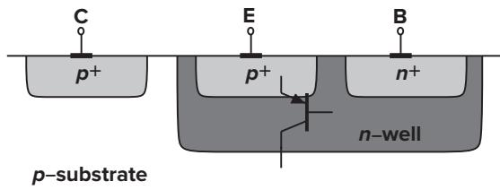

**Figure 12.10** Realization of a *pnp* bipolar transistor in CMOS technology.

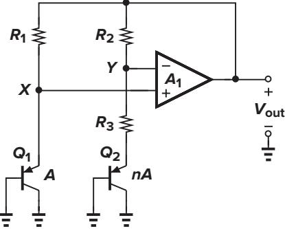

**Figure 12.11** Circuit of Fig. 12.9 implemented with *pnp* transistors.

**Op Amp Offset and Output Impedance** As explained in Chapter 14, owing to asymmetries, op amps suffer from input "offsets," i.e., the output voltage of the op amp is not zero if the input is set to zero. The input offset voltage of the op amp in Fig. 12.9 introduces error in the output voltage. Included in Fig. 12.12, the effect is quantified as *VB E*1 − *VO S* ≈ *VB E*2 + *R*3 *IC*2 (if *A*1 is large) and *Vout* = *VB E*2 +*(R*3 + *R*2*)IC*2. Thus,

$$V\_{out} = V\_{BE2} + (R\_3 + R\_2)\frac{V\_{BE1} - V\_{BE2} - V\_{OS}}{R\_3} \tag{12.32}$$

$$\dot{\lambda} = V\_{BE2} + \left(1 + \frac{R\_2}{R\_3}\right) (V\_T \ln n - V\_{OS}) \tag{12.33}$$

where we have assumed that *IC*2 ≈ *IC*1 despite the offset voltage. The key point here is that *VO S* is amplified by 1+ *R*2*/R*3, introducing error in *Vout* . More important, as explained in Chapter 14, *VO S* itself varies with temperature, raising the temperature coefficient of the output voltage.

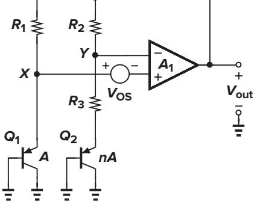

**Figure 12.12** Effect of op amp offset on the reference voltage.

#### ▲**Example 12.5**

Razavi-3930640 book December 17, 201517:21 519

Assuming an ideal op amp, determine the small-signal gain from *VO S* to *Vout* in Fig. 12.12.

### **Solution**

In the absence of the op amp offset, the two diode-connected bipolar transistors carry equal bias currents, exhibiting a transconductance of *gm*. Replacing *Q*1 and *Q*2 with a small-signal resistance equal to 1*/gm* and noting that *VX* − *VO S* ≈ *VY* , we write the following small-signal equation:

$$\frac{1/\text{g}\_m}{1/\text{g}\_m + R\_1}V\_{out} - V\_{OS} = \frac{1/\text{g}\_m + R\_3}{1/\text{g}\_m + R\_3 + R\_2}V\_{out} \tag{12.34}$$

Since *R*1 = *R*2,

$$\frac{V\_{out}}{V\_{OS}} = -\left[1 + \frac{1}{g\_m R\_2} + \frac{\left(1/g\_m + R\_2\right)^2}{R\_2 R\_3}\right] \tag{12.35}$$

If *gm R*2 ) 1, then *Vout /VO S* ≈ −*(*1+*R*2*/R*3*)*, agreeing with the results obtained previously. (After all, if 1*/gm* ≈ 0, *VO S* simply sees a noninverting amplifier with a gain of 1 + *R*2*/R*3.)

Why does (12.35) not completely agree with the −*VO S(*1 + *R*2*/R*3*)* component in (12.33)? Recall that (12.33) was derived with the assumption that *IC*1 ≈ *IC*2 despite the offset voltage. Since *VX* − *VO S* = *VY* , we have *IC*1*R*1 − *VO S* = *IC*2*R*2, and hence *IC*1 = *IC*2 + *VO S/R*2. Let us return to (12.32) and write

$$V\_{BE1} - V\_{BE2} - V\_{OS} = V\_T \ln \frac{I\_{C1}}{I\_{S1}} - V\_T \ln \frac{I\_{C2}}{I\_{S2}} - V\_{OS} \tag{12.36}$$

$$=V\_T \ln n - V\_T \ln \frac{I\_{C1}}{I\_{C2}} - V\_{OS} \tag{12.37}$$

$$=Vr\ln n - Vr\ln\left(1 + \frac{V\_{OS}}{R\_2I\_{C2}}\right) - Vos \tag{12.38}$$

$$\approx V\_T \ln n - V\_T \frac{V\_{OS}}{R\_2 I\_{C2}} - V\_{OS} \tag{12.39}$$

$$\approx V\_T \ln n - \left( 1 + \frac{1}{g\_m R\_2} \right) V\_{OS} \tag{12.40}$$

The output offset contribution therefore amounts to −[1 + 1*/(gm R*2*)*]*(*1 + *R*2*/R*3*)VO S*, which is approximately the same as (12.35). ▲

Several methods are employed to lower the effect of *VO S*. First, the op amp incorporates large devices in a carefully chosen topology so as to minimize the offset (Chapter 19). Second, as illustrated in Fig. 12.7, the collector currents of *Q*1 and *Q*2 can be ratioed by a factor of *m* such that !*VB E* = *VT* ln*(mn)*. Third, each branch may use two *pn* junctions in series to double !*VB E* . Figure 12.13 depicts a realization using the last two techniques. Here, *R*1 and *R*2 are ratioed by a factor of *m*, producing *I*1 ≈ *m I*2. Neglecting base currents and assuming that *A*1 is large, we can now write *VB E*1+*VB E*2−*VO S* = *VB E*3+*VB E*4+ *R*3 *I*2 and *Vout* = *VB E*3 + *VB E*4 + *(R*3 + *R*2*)I*2. It follows that

$$V\_{out} = V\_{BE3} + V\_{BE4} + (R\_3 + R\_2)\frac{2V\_T\ln(mn) - V\_{OS}}{R\_3} \tag{12.41}$$

$$\dot{\lambda} = 2V\_{BE} + \left(1 + \frac{R\_2}{R\_3}\right) \left[2V\_T \ln(mn) - V\_{OS}\right] \tag{12.42}$$

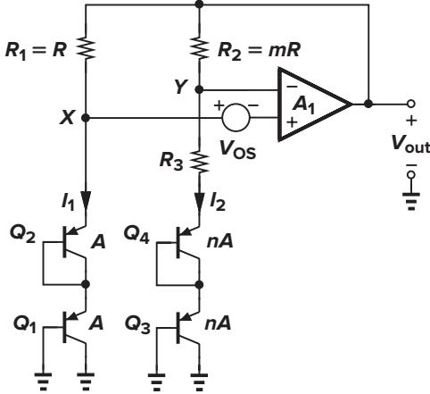

**Figure 12.13** Reduction of the effect of op amp offset.

Thus, the effect of the offset voltage is reduced by increasing the first term in the square brackets. The issue, however, is that *Vout* ≈ 2 × 1*.*25 V = 2*.*5 V, a value difficult to generate by the op amp at low supply voltages.

In the circuits studied above, the op amp drives two resistive branches and must therefore provide a low output impedance. Fortunately, it is possible to avoid this issue by a simple modification described below.

The implementation of Fig. 12.13 is not feasible in a standard CMOS technology because the collectors of *Q*2 and *Q*4 are not grounded. In order to utilize the bipolar structure shown in Fig. 12.10, we modify the series combination of the diodes as illustrated in Fig. 12.14(a), converting one of the diodes to an emitter follower. However, we must ensure that the bias currents of both transistors have the same behavior with temperature. Thus, we bias each transistor by a PMOS current source rather than a resistor [Fig. 12.14(b)]. The overall circuit then assumes the topology shown in Fig. 12.15, where the op amp adjusts the gate voltage of the PMOS devices so as to equalize *VX* and *VY* . Interestingly, in this circuit, the op amp experiences no resistive loading, but the mismatch and channel-length modulation of the PMOS devices introduce error at the output (Problem 12.3).

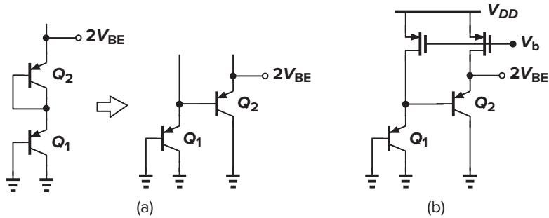

**Figure 12.14** (a) Conversion of series diodes to a topology with grounded collectors; (b) circuit of part (a) biased by PMOS current sources.

An important concern in the circuit of Fig. 12.15 is the relatively low current gain of the "native" *pnp* transistors. Since the base currents of *Q*2 and *Q*4 generate an error in the emitter currents of *Q*1 and *Q*3, a means of base current cancellation may be necessary (Problem 12.5).

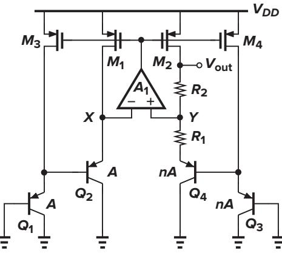

**nA Figure 12.15** Reference generator incorporating two series base-emitter voltages.

**Feedback Polarity** In the circuit of Fig. 12.9, the feedback signal produced by the op amp returns to both of its inputs. The negative-feedback factor is given by

$$\beta\_N = \frac{1/g\_{m2} + R\_3}{1/g\_{m2} + R\_3 + R\_2} \tag{12.43}$$

and the positive-feedback factor by

$$\beta\_P = \frac{1/g\_{m1}}{1/g\_{m1} + R\_1} \tag{12.44}$$

To ensure an overall negative feedback, β*P* must be less than β*N* , preferably by roughly a factor of two so that the circuit's transient response remains well behaved with large capacitive loads.

**Bandgap Reference** The voltage generated according to (12.20) is called a "bandgap reference." To understand the origin of this terminology, let us write the output voltage as

$$V\_{REF} = V\_{BE} + V\_T \ln n\tag{12.45}$$

and hence:

$$\frac{\partial V\_{REF}}{\partial T} = \frac{\partial V\_{BE}}{\partial T} + \frac{V\_T}{T} \ln n \tag{12.46}$$

Setting this to zero and substituting for ∂*VB E /*∂*T* from (12.13), we have

$$\frac{V\_{BE} - (4+m)V\_T - E\_g/q}{T} = -\frac{V\_T}{T} \ln n \tag{12.47}$$

If *VT* ln *n* is found from this equation and inserted in (12.45), we obtain

$$V\_{REF} = \frac{E\_{\rm g}}{q} + (4+m)V\_T \tag{12.48}$$

Thus, the reference voltage exhibiting a nominally-zero TC is given by a few *fundamental* numbers: the bandgap voltage of silicon, *Eg/q*, the temperature exponent of mobility, *m*, and the thermal voltage, *VT* . The term "bandgap" is used here because as *T* →0, *VREF* → *Eg/q*.

▲

#### ▲**Example 12.6**

Razavi-3930640 book December 17, 201517:21 522

Prove directly that, as *T* → 0, *VB E* → *Eg/q*, and hence *VREF* = *VB E* + *VT* ln *n* → *Eg/q*.

## **Solution**

From Eq. (12.8), we have

$$V\_{BE} = V\_T \ln{\frac{I\_C}{I\_S}}\tag{12.49}$$

$$=Vr\left[\ln Ic - \ln b - (4+m)\ln T + \frac{E\_g}{kT}\right] \tag{12.50}$$

Thus, *VB E* → *Eg/q* if *T* → 0 and *IC* is constant.

**Supply Dependence and Start-Up** In the circuit of Fig. 12.9, the output voltage is relatively independent of the supply voltage so long as the open-loop gain of the op amp is sufficiently high. The circuit may require a start-up mechanism because if *VX* and *VY* are equal to zero, the input differential pair of the op amp may turn off. Start-up techniques similar to those of Fig. 12.5 can be added to ensure that the op amp turns on when the supply is applied.

The supply rejection of the circuit typically degrades at high frequencies owing to the op amp's rejection properties, often mandating "supply regulation." An example is described in Sec. 12.8.

**Curvature Correction** If plotted as a function of temperature, bandgap voltages exhibit a finite "curvature," i.e., their TC is typically zero at one temperature and positive or negative at other temperatures (Fig. 12.16). The curvature arises from temperature variation of base-emitter voltages, collector currents, and offset voltages.

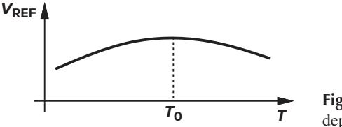

**Figure 12.16** Curvature in temperature dependence of a bandgap voltage.

Many curvature correction techniques have been devised to suppress the variation of *VREF* [5, 6] in bipolar bandgap circuits, but they are seldom used in CMOS counterparts. This is because, due to large offsets and process variations, samples of a bandgap reference display substantially different zero-TC temperatures (Fig. 12.17), making it difficult to correct the curvature reliably.

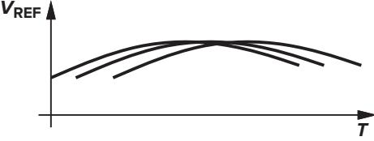

**Figure 12.17** Variation of the zero-TC temperature for different samples.

# **12.4 PTAT Current Generation**

In the analysis of bandgap circuits, we noted that the bias currents of the bipolar transistors are in fact proportional to absolute temperature. Useful in many applications, PTAT currents can be generated by a topology such as that shown in Fig. 12.18. Alternatively, we can combine the supply-independent biasing scheme of Fig. 12.2 with a bipolar core, arriving at Fig. 12.19.3 Assuming for simplicity that *M*1-*M*2 and *M*3-*M*4 are identical pairs, we note that for *ID*1 = *ID*2, the circuit must ensure that *VX* = *VY* . Thus, *ID*1 = *ID*2 = *(VT* ln *n)/R*1, yielding the same behavior for *ID*5. In practice, due to mismatches between the transistors and, more important, the temperature coefficient of *R*1, the variation of *ID*5 deviates from the ideal equation. For low-voltage operation, the topology of Fig. 12.18 is preferred.

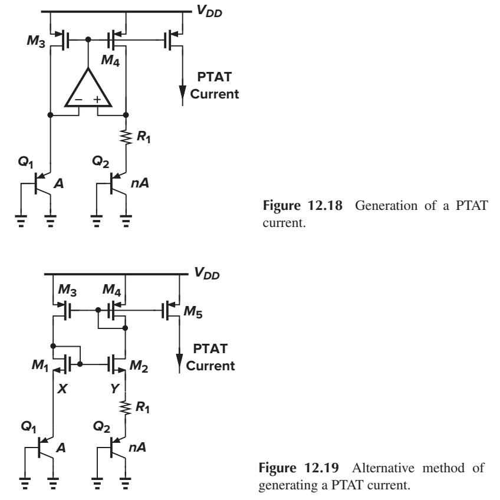

The circuit of Fig. 12.18 can be readily modified to provide a bandgap reference voltage as well. Illustrated in Fig. 12.20, the idea is to add a PTAT voltage *ID*5*R*2 to a base-emitter voltage. The output therefore equals

$$|V\_{REF} = |V\_{BE3}| + \frac{R\_2}{R\_1} V\_T \ln n\tag{12.51}$$

3The two circuits in Figs. 12.18 and 12.19 exhibit different supply rejections. With a carefully-designed op amp, the former achieves a higher rejection.

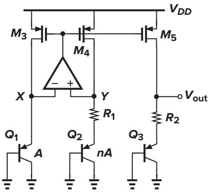

**Figure 12.20** Generation of a temperature-independent voltage.

where all of the PMOS transistors are assumed identical. Note that the value of *VB E*3 and hence the size of *Q*3 are somewhat arbitrary so long as the sum of the two terms in (12.51) gives a zero TC. In reality, mismatches of the PMOS devices introduce error in *Vout* .

# **12.5 Constant-***Gm* **Biasing**

The transconductance of MOSFETs plays a critical role in analog circuits, determining such performance parameters as noise, small-signal gain, and speed. For this reason, it is often desirable to bias the transistors such that their transconductance does not depend on the temperature, process, or supply voltage.

A simple circuit used to define the transconductance is the supply-independent bias topology of Fig. 12.3. Recall that the bias current is given by

$$I\_{\rm out} = \frac{2}{\mu\_n C\_{ox} (W/L)\_N} \frac{1}{R\_S^2} \left(1 - \frac{1}{\sqrt{K}}\right)^2 \tag{12.52}$$

Thus, the transconductance of *M*1 equals

$$\mathbf{g}\_{m1} = \sqrt{2\mu\_n \mathbf{C}\_{ox} \left(\frac{W}{L}\right)\_N I\_{D1}}\tag{12.53}$$

$$\eta = \frac{2}{R\_S} \left( 1 - \frac{1}{\sqrt{K}} \right) \tag{12.54}$$

a value independent of the supply voltage and MOS device parameters.

In reality, the value of *RS* in (12.54) does vary with temperature and process. If the temperature coefficient of the resistor is known, bandgap and PTAT reference generation techniques can be utilized to cancel the temperature dependence. *Process* variations, however, limit the accuracy with which *gm*1 is defined.

In systems where a precise clock frequency is available, the resistor *RS* in Fig. 12.3 can be replaced by a switched-capacitor equivalent (Chapter 13) to achieve a somewhat higher accuracy. Depicted in Fig. 12.21, the idea is to establish an average resistance equal to *(CS fC K )*−1 between the source of *M*2 and ground, where *fC K* denotes the clock frequency. Capacitor *CB* is added to shunt the high-frequency components resulting from switching to ground. Since the absolute value of capacitors is typically more tightly controlled and since the TC of capacitors is much smaller than that of resistors, this technique provides a higher reproducibility in the bias current and transconductance.

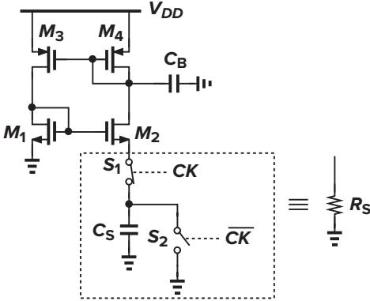

**Figure 12.21** Constant-*Gm* biasing by means of a switched-capacitor "resistor."

The switched-capacitor approach of Fig. 12.21 can be applied to other circuits as well. For example, as shown in Fig. 12.22, a voltage-to-current converter with a relatively high accuracy can be constructed.

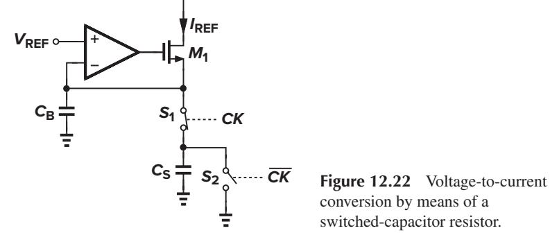

Even though reference generators are low-frequency circuits, they may affect the speed of the circuits that they feed. Furthermore, various building blocks may experience "crosstalk" through reference lines. These difficulties arise because of the finite output impedance of reference voltage generators, especially if they incorporate op amps. As an example, let us consider the configuration shown in Fig. 12.23, assuming that the voltage at node *N* is heavily disturbed by the circuit fed by *M*5. For fast changes in *VN* , the op amp cannot maintain *VP* constant, and the bias currents of *M*5 and *M*6 experience large transient changes. Also, the duration of the transient at node *P* may be quite long if the op amp suffers from a slow response. For this reason, many applications may require a high-speed op amp in the reference generator.

In systems where the power consumed by the reference circuit must be small, the use of a high-speed op amp may not be feasible. Alternatively, the critical node, e.g., node *P* in Fig. 12.23, can be bypassed to ground by means of a large capacitor (*CB*) so as to suppress the effect of external disturbances. This approach involves two issues. First, the stability of the op amp must not degrade with the addition of the capacitor, requiring the op amp to be of a one-stage nature (Chapter 10). Second, since *CB* generally slows down the transient response of the op amp, its value must be much greater than the capacitance that couples the disturbance to node *P*. As illustrated in Fig. 12.24, if *CB* is not sufficiently large, then *VP*

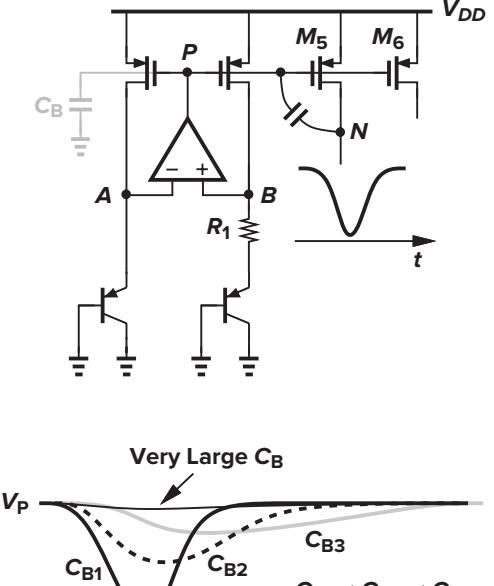

**Figure 12.23** Effect of circuit transients on reference voltages and currents.

**Figure 12.24** Effect of increasing bypass capacitor on the response of a reference generator.

experiences a change and takes a long time to return to its original value, possibly degrading the settling speed of the circuits biased by the reference generator. In other words, depending on the environment, it may be preferable to leave node *P* agile so that it can quickly recover from transients. In general, as depicted in Fig. 12.25, the response of the circuit must be analyzed by applying a disturbance at the output and observing the settling behavior.

**CB1 < CB2 < CB3**

**t**

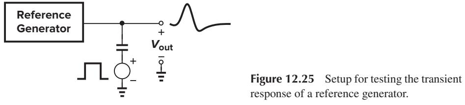

#### ▲**Example 12.7**

Determine the small-signal output impedance of the bandgap reference shown in Fig. 12.23 and examine its behavior with frequency.

## **Solution**

Figure 12.26 depicts the equivalent circuit, modeling the open-loop op amp by a one-pole transfer function *A(s)* = *A*0*/(*1 + *s/*ω0*)* and an output resistance *Rout* and each bipolar transistor by a resistance 1*/gmN* . If *M*1 and *M*2 are identical, each having a transconductance of *gm P* , then their drain currents are equal to *gm P VX* , producing a differential voltage at the input of the op amp equal to

$$V\_{AB} = -g\_{mP} V\_X \frac{1}{g\_{mN}} + g\_{mP} V\_X \left(\frac{1}{g\_{mN}} + R\_1\right) \tag{12.55}$$

$$=\,\_{m}\mathbf{g}\_{m}\,V\_{X}\,\mathbf{R}\_{1}\tag{12.56}$$

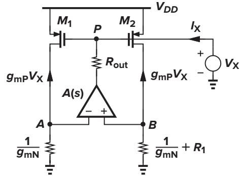

**Figure 12.26** Circuit for calculation of the output impedance of a reference generator.

The current flowing through *Rout* is therefore given by

$$I\_X = \frac{V\_X + g\_{mP} V\_X R\_1 A(s)}{R\_{out}} \tag{12.57}$$

yielding

$$\frac{V\_X}{I\_X} = \frac{R\_{out}}{1 + g\_{mP}R\_1A(s)}\tag{12.58}$$

$$=\frac{R\_{out}}{1+g\_{mP}R\_1\frac{A\_0}{1+s/\alpha\_0}}\tag{12.59}$$

$$\eta = \frac{R\_{out}}{1 + \, \_{g\,m\,P}R\_1A\_0} \frac{1 + \frac{s}{\alpha\_0}}{1 + \frac{s}{(1 + \, g\_{mP}R\_1A\_0)\alpha\_0}} \tag{12.60}$$

Thus, the output impedance exhibits a zero at ω0 and a pole at *(*1 + *gm P R*1 *A*0*)*ω0, with the magnitude behavior plotted in Fig. 12.27. Note that |*Zout*| is small for ω *<* ω0, but it rises to a high value as the frequency approaches the pole. In fact, setting ω = *(*1 + *gm P R*1 *A*0*)*ω0 and assuming *gm P R*1 *A*0 ) 1, we have

$$|Z\_{out}| = \frac{R\_{out}}{1 + g\_m \rho\_1 R\_1 A\_0} \left| \frac{1 + j\left(1 + g\_m \rho\_1 R\_1 A\_0\right)}{1 + j} \right| \tag{12.61}$$

$$= \frac{R\_{out}}{\sqrt{2}}\tag{12.62}$$

which is only 30% lower than the open-loop value.

▲

The output noise of reference generators may affect the performance of low-noise circuits considerably. Figure 12.28 illustrates an example: the load current source of a common-source stage is driven by a bandgap circuit with a current multiplication factor of *N*. Thus, the noise current of *M*1 (or *M*2) is amplified by the same factor as it appears in *M*3. Note that *M*1–*M*3 carry noise due to the op amp *A*1 as well.

**Figure 12.28** Effect of bandgap circuit noise on a CS stage.

As another example, if a high-precision A/D converter employs a bandgap voltage as the reference with which the analog input signal is compared (Fig. 12.29), then the noise in the reference is directly added to the input.

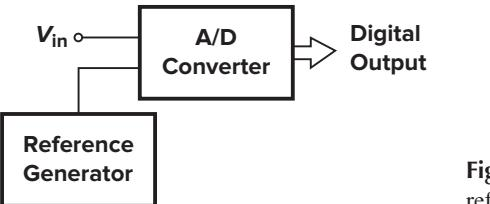

**Figure 12.29** A/D converter using a reference generator.

As a simple example, let us calculate the output noise voltage of the circuit shown in Fig. 12.30, taking into account only the input-referred noise voltage of the op amp, *Vn,op*. Since the small-signal drain currents of *M*1 and *M*2 are equal to *Vn,out/(R*1 + *g*−1 *mN )*, we have *VP* = −*g*−1 *m P Vn,out/(R*1 + *g*−1 *mN )*, obtaining the differential voltage at the input of the op amp as −*g*−1 *m P A*−1 0 *Vn,out/(R*1 + *g*−1 *mN )*. Beginning

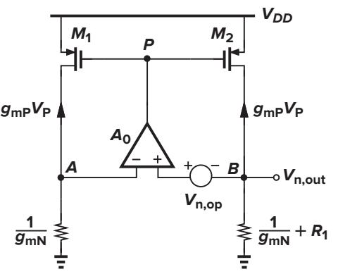

**Figure 12.30** Circuit for calculation of noise in a reference generator.

## Sec. 12.7 Low-Voltage Bandgap References **529**

from node *A*, we can then write

Razavi-3930640 book December 17, 201517:21 529

$$\frac{V\_{n,out}}{R\_1 + g\_{mN}^{-1}} \cdot \frac{1}{g\_{mN}} - \frac{V\_{n,out}}{g\_{mP}A\_0 \left(R\_1 + g\_{mN}^{-1}\right)} = V\_{n,op} + V\_{n,out} \tag{12.63}$$

and hence

$$V\_{n,out} \left[ \frac{1}{R\_1 + g\_{mN}^{-1}} \left( \frac{1}{g\_{mN}} - \frac{1}{g\_{mP} A\_0} \right) - 1 \right] = V\_{n,op} \tag{12.64}$$

Since typically *gm P A*0 ) *gmN* ) *R*−1 1 ,

$$|V\_{n,out}| \approx V\_{n,op} \tag{12.65}$$

suggesting that the noise of the op amp directly appears at the output. Note that even the addition of a large capacitor from the output to ground may not suppress low-frequency 1*/f* noise components, a serious difficulty in low-noise applications. The noise contributed by other devices in the circuit is studied in Problem 12.6.

## **12.7 Low-Voltage Bandgap References**

The bandgap voltage expressed by Eq. (12.20) is around 1.25 V, eluding implementation with today's low supplies. The fundamental limitation is that we must add about 17*.*2*VT* to one *VB E* so as to achieve a net zero temperature coefficient.

Is it possible to add two *currents* with positive and negative TCs and then convert the result to an arbitrary voltage that has a zero TC (Fig. 12.31)? Recall from Fig. 12.18 that we can readily generate a PTAT current given by *VT* ln *n/R*. We also envision another current of the form *VB E /R* serving as that with a negative TC, but how can we generate such a current with minimal complexity?

Let us return to the circuit of Fig. 12.18, assume that *M*3 and *M*4 are identical, and note that |*ID*4| = *VT* ln *n/R*1 is a PTAT current. We place a resistor in parallel with *Q*2 as shown in Fig. 12.32(a). We recognize that *R*1 now carries an additional current equal to |*VB E*2|*/R*2, i.e., a current with a negative TC. Unfortunately, however, the PTAT behavior is now disturbed because *IC*1 =% *IC*2. Fortunately, a simple modification resolves this issue: as shown in Fig. 12.32(b), we tie *R*2 from *Y* to ground and place another resistor in parallel with *Q*1. Proposed by Banba et al. [8], this topology lends itself to low-voltage implementation, requiring a minimum *VDD* of *VB E*1 + |*VDS*3|.

To analyze the circuit, we observe that *VX* ≈ *VY* ≈ |*VB E*1| and *ID*3 = *ID*4. Thus,

$$I\_{C1} + \frac{|V\_{BE1}|}{R\_3} = I\_{C2} + \frac{|V\_{BE1}|}{R\_2} \tag{12.66}$$

**Figure 12.32** (a) Attempt to make drain current of *M*4 temperature-independent, (b) circuit modification resulting in a zero-TC current, and (c) generation of arbitrarily small voltage with zero TC.

which yields *IC*1 = *IC*2 if *R*2 = *R*3. We still have |*VB E*1|=|*VB E*2| + *IC*2*R*1 and hence *IC*2 = *VT* ln *n/R*1. This current and the current flowing through *R*2, |*VB E*1|*/R*2, constitute |*ID*4|:

$$|I\_{D4}| = \frac{V\_T \ln n}{R\_1} + \frac{|V\_{BE1}|}{R\_2} \tag{12.67}$$

$$\eta = \frac{1}{R\_2} \left( |V\_{BE1}| + \frac{R\_2}{R\_1} V\_T \ln n \right) \tag{12.68}$$

Selecting *(R*2*/R*1*)VT* ln *n* approximately equal to 17*.*2*VT* renders a zero TC for *ID*4. This current is then copied and passed through a resistor to generate a zero-TC voltage [Fig. 12.32(c)] [8]:

$$V\_{BG} = \frac{R\_4}{R\_2} \left( |V\_{BE1}| + \frac{R\_2}{R\_1} V\_T \ln n \right) \tag{12.69}$$

(if *M*5 is identical to *M*4). We choose *(R*2*/R*1*)*ln *n* ≈ 17*.*2, observing that *VBG* has a zero TC and its value can be lower than the conventional limit of 1.25 V.

#### ▲**Example 12.8**

If the op amp in Fig. 12.32(c) has an input-referred offset voltage, *VO S*, determine *VBG*.

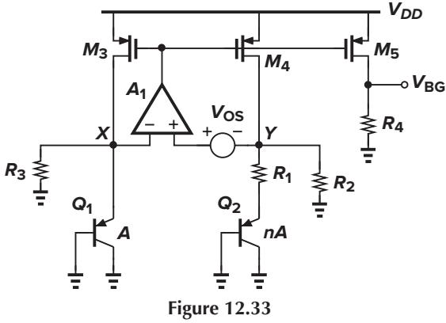

#### **Solution**

As shown in Fig. 12.33, we now have *VX* ≈ *VY* + *VO S* ≈ |*VB E*1| and

$$I\_{C1} + \frac{|V\_{BE1}|}{R\_3} = I\_{C2} + \frac{|V\_{BE1}| - V\_{OS}}{R\_2} \tag{12.70}$$

which implies that *IC*1 = *IC*2 − *VO S/R*2 if *R*2 = *R*3. Since |*VB E*1|=|*VB E*2| + *R*1 *IC*2 + *VO S*, we have *IC*2 = *(VT* ln *n* − *VO S)/R*1. This current and the current flowing through *R*2, *(*|*VB E*1| − *VO S)/R*2, add up to |*ID*4|:

$$|I\_{D4}| = \frac{V\_T \ln n - V\_{OS}}{R\_1} + \frac{|V\_{BE1}| - V\_{OS}}{R\_2} \tag{12.71}$$

It follows that

$$V\_{BG} = \frac{R\_4}{R\_2} \left( |V\_{BE1}| + \frac{R\_2}{R\_1} V\_T \ln n \right) - \frac{R\_4}{R\_1 || R\_2} V\_{OS} \tag{12.72}$$

revealing that the op amp offset is amplified by a factor of *R*4*/(R*1||*R*2*)*. Alternatively, we can write

$$V\_{BG} = \frac{R\_4}{R\_2} \left[ |V\_{BE1}| + \frac{R\_2}{R\_1} V\_T \ln n - \left( 1 + \frac{R\_2}{R\_1} \right) V\_{OS} \right] \tag{12.73}$$

concluding that the effect of *VO S* can be minimized only by maximizing *n*.

It is instructive to estimate the lowest supply voltage with which the circuit of Fig. 12.32(c) can operate properly. With large bipolar transistors and a small bias current, e.g., 10 *µ*A, the base-emitter voltage can be as low as 0.7 V. Similarly, wide PMOS devices allow a |*VDS*| of about 50 mV. The circuit can thus operate with a minimum *VDD* of around 0.75 V. In this case, *R*4 tends to be a large resistor, e.g., 50 k', producing significant noise and requiring a bypass capacitor at the output. Also, if the PMOS drain currents are copied to generate a larger current, say, 0.5 mA, then their noise is amplified by the same factor. This noise contains thermal and flicker components due to the PMOS devices and the noise of the op amp. In Problem 12.24, we analyze the noise behavior of this circuit, but from Example 12.8, we observe that the op amp input noise is amplified by a factor of *R*4*/(R*1||*R*2*)*.

The op amp in Fig. 12.32(c) can be realized as a five-transistor OTA. Depicted in Fig. 12.34(a) is an example. The OTA design proceeds according to the following guidelines. (1) Large transistor dimensions are chosen so as to minimize their flicker noise and offset. (2) The gate-source voltage of *Ma* and *Mb*

▲

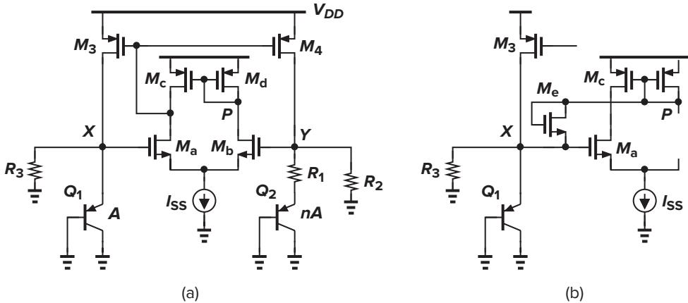

**Figure 12.34** (a) Implementation of low-voltage BG circuit using a five-transistor OTA, and (b) addition of start-up device.

plus the headroom required by *ISS* must not exceed |*VB E*1|. (3) The transistors are chosen long enough to yield a reasonable loop gain, e.g., 5 to 10.

The foregoing topology must incorporate a start-up mechanism. Otherwise, the circuit begins with *VX* = *VY* = 0, *Ma* and *Mb* remain off, and so do *M*3 and *M*4. Since, with *VDD <* 1 V, the voltage difference between node *P* and node *X* is initially positive but finally negative (why?), we can tie a diode-connected NMOS transistor between these two nodes to ensure start-up [Fig. 12.34(b)]. Alternatively, the NMOS device can be connected between *X* and *VDD*.

Another low-voltage bandgap circuit can be derived from the topology of Fig. 12.20 by simply tying a resistor from the output node to ground [9]. Shown in Fig. 12.35, the circuit now allows some of *ID*5 to flow through *R*3:

$$|I\_{D5}| = \frac{V\_{out}}{R\_3} + \frac{V\_{out} - |V\_{BE3}|}{R\_2} \tag{12.74}$$

If the PMOS devices are identical, |*ID*5| = *VT* ln *n/R*1, yielding

$$V\_{out} = \frac{R\_3}{R\_2 + R\_3} \left( |V\_{BE3}| + \frac{R\_2}{R\_1} V\_T \ln n \right) \tag{12.75}$$

The standard bandgap voltage is thus scaled down by a factor of *R*3*/(R*2 + *R*3*)*. The reader is encouraged to compute the effect of the op amp offset at the output and compare the result with (12.72).

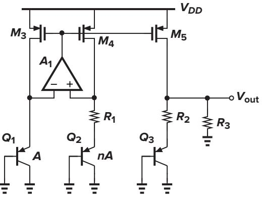

**Figure 12.35** Alternative low-voltage BG circuit.

It is possible to add other bias branches to the foregoing circuits so as to provide curvature correction, but such schemes typically rely on trimming because the various mismatches within the circuit tend to shift the zero-TC temperature randomly. Other low-voltage bandgaps are described in [10].

## **12.8 Case Study**

In this section, we study a bandgap reference circuit designed for high-precision analog systems [7]. The reference generator incorporates the topology of Fig. 12.19, but with two series base-emitter voltages in each branch so as to reduce the effect of MOSFET mismatches. A simplified version of the core is depicted in Fig. 12.36, where the PMOS current mirror arrangement ensures equal collector currents for *Q*1–*Q*4. While requiring a high supply voltage, this design exemplifies issues that prove important in practice.

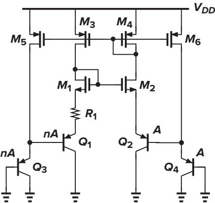

**Figure 12.36** Simplified core of the bandgap circuit reported in [7].

Channel-length modulation of the MOS devices in Fig. 12.36 still results in significant supply dependence. To resolve this issue, each branch can employ both NMOS and PMOS cascode topologies. Figure 12.37(a) shows an example in which the low-voltage cascode current mirror described in Chapter 5

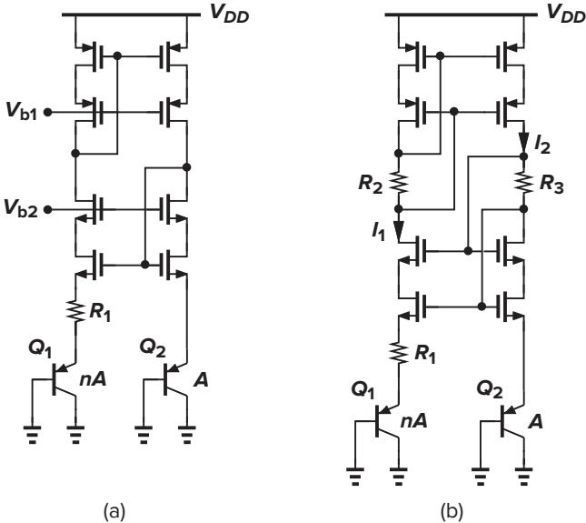

**Figure 12.37** (a) Addition of cascode devices to improve supply rejection; (b) use of self-biased cascode to eliminate *Vb*1 and *Vb*2.

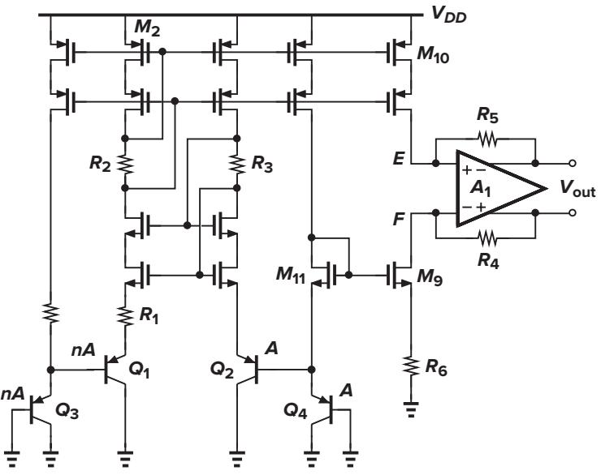

**Figure 12.38** Generation of a floating reference voltage.

is utilized. To obviate the need for *Vb*1 and *Vb*2, this design actually introduces a "self-biased" cascode, shown in Fig. 12.37(b), where *R*2 and *R*3 sustain proper voltages to allow all MOSFETs to remain in saturation. This cascode topology is analyzed in Problem 12.7.

The bandgap circuit reported in [7] is designed to generate a *floating* reference. This is accomplished by the modification shown in Fig. 12.38, where the drain currents of *M*9 and *M*10 flow through *R*4 and *R*5, respectively. Note that *M*11 sets the gate voltage of *M*9 at *VB E*4 + *VG S*11, establishing a voltage equal to *VB E*4 across *R*6 if *M*9 and *M*11 are identical. Thus, *ID*9 = *VB E*4*/R*6, yielding *VR*4 = *VB E*4*(R*4*/R*6*)*. Also, if *M*10 is identical to *M*2, then |*ID*10| = 2*(VT* ln *n)/R*1, and hence *VR*5 = 2*(VT* ln *n)(R*5*/R*1*)*. Since the op amp ensures that *VE* ≈ *VF* , we have

$$V\_{out} = \frac{R\_4}{R\_6} V\_{BE4} + 2\frac{R\_5}{R\_1} V\_T \ln n \tag{12.76}$$

Proper choice of the resistor ratios and *n* therefore provides a zero temperature coefficient.

In order to further enhance the supply rejection, this design regulates the supply voltage of the core and the op amp. Illustrated in Fig. 12.39, the idea is to generate a local supply, *VDDL* , that is defined by a reference *VR*1 and the ratio of *Rr*1 and *Rr*2 and hence remains relatively independent of the global supply voltage. But how is *VR*1 itself generated? To minimize the dependence of *VR*1 upon the supply,

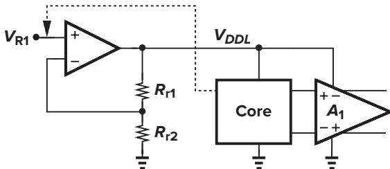

**Figure 12.39** Regulation of the supply voltage of the core and op amp to improve supply rejection.

this voltage is established *inside* the core, as depicted in Fig. 12.40. In fact, *RM* is chosen such that *VR*1 is a bandgap reference.

Figure 12.41 shows the overall implementation, omitting a few details for simplicity. A start-up circuit is also used. Operating from a 5-V supply, the reference generator produces a 2.00-V output while consuming 2.2 mW. The supply rejection is 94 dB at low frequencies, dropping to 58 dB at 100 kHz [7].

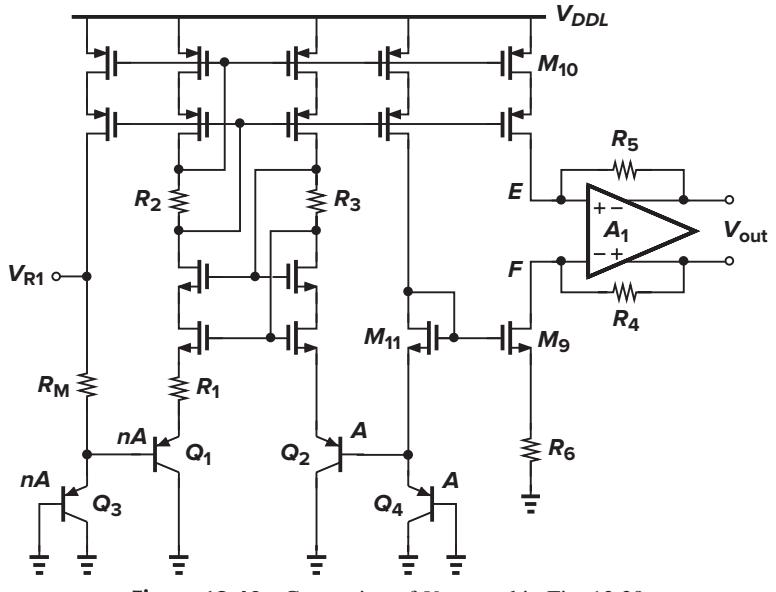

**Figure 12.40** Generation of *VR*1, used in Fig. 12.39.

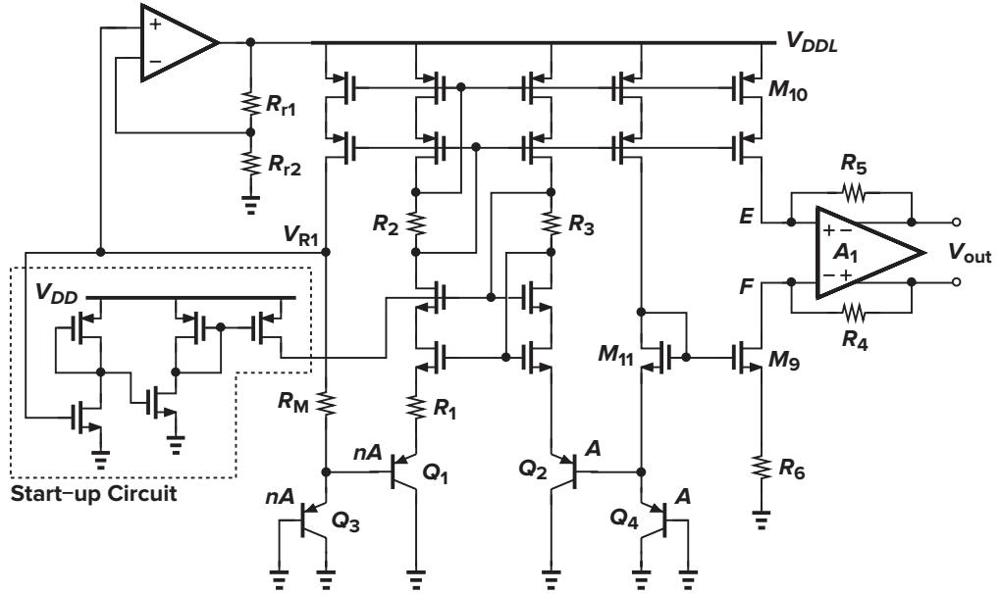

**Figure 12.41** Overall circuit of the bandgap generator reported in [7].

# **References**

Razavi-3930640 book December 17, 201517:21 536

- [1] R. A. Blauschild et al., "A New NMOS Temperature-Stable Voltage Reference," *IEEE J. of Solid-State Circuits,* vol. 13, pp. 767–774, December 1978.
- [2] Y. P. Tsividis and R. W. Ulmer, "A CMOS Voltage Reference," *IEEE J. of Solid-State Circuits*, vol. 13, pp. 774– 778, December 1978.
- [3] D. Hilbiber, "A New Semiconductor Voltage Standard," *ISSCC Dig. of Tech. Papers*, pp. 32–33, February 1964.
- [4] K. E. Kujik, "A Precision Reference Voltage Source," *IEEE J. of Solid-State Circuits*, vol. 8, pp. 222–226, June 1973.
- [5] G. C. M. Meijer, P. C. Schmall, and K. van Zalinge, "A New Curvature-Corrected Bandgap Reference," *IEEE J. of Solid-State Circuits*, vol. 17, pp. 1139–1143, December 1982.
- [6] M. Gunawan et al., "A Curvature-Corrected Low-Voltage Bandgap Reference," *IEEE J. of Solid-State Circuits*, vol. 28, pp. 667–670, June 1993.
- [7] T. Brooks and A. L. Westwisk, "A Low-Power Differential CMOS Bandgap Reference," *ISSCC Dig. of Tech. Papers,* pp. 248–249, February 1994.
- [8] H. Banba et al., "A CMOS Bandgap Reference Circuit with Sub-1-V Operation," *IEEE J. of Solid-State Circuits*, vol. 34, pp. 670–674, May 1999.
- [9] H. Neuteboom et al., "A DSP-Based Hearing Instrument IC," *IEEE J. of Solid-State Circuits*, vol. 32, pp. 1790– 1806, November 1997.
- [10] C. J. B. Fayomi et al., "Sub-1-V CMOS Bandgap Reference Design Techniques: A Survey," *Analog Integrated Circuits and Signal Processing*, vol. 62, pp. 141–157, February 2010.
- [11] B. Gilbert, "Monolithic Voltage and Current References: Themes and Variations," pp. 269–352 in *Analog Circuit Design*, J. H. Huijsing, R. J. van de Plassche, and W. M. C. Sansen, eds. (Boston: Kluwer Academic Publishers, 1996).

# **Problems**

Unless otherwise stated, in the following problems, use the device data shown in Table 2.1 and assume that *VDD* = 3 V where necessary.

**12.1.** Derive an expression for *Iout* in Fig. 12.42.

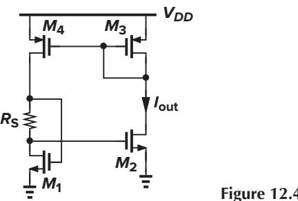

- **Figure 12.42**
- **12.2.** Explain how the start-up circuit shown in Fig. 12.43 operates. Derive a relationship that guarantees that *VX < VT H* after the circuit turns on.
- **12.3.** Consider the circuit of Fig. 12.15.
	- **(a)** If *M*1 and *M*2 suffer from channel-length modulation, what is the error in the output voltage?
	- **(b)** Repeat part (a) for *M*3 and *M*4.
	- **(c)** If *M*1 and *M*2 have a threshold mismatch of !*V*, i.e., *VT H*1 = *VT H* and *VT H*2 = *VT H* + !*V*, what is the error in the output voltage?
	- **(d)** Repeat part (c) for *M*3 and *M*4.