# ECE 255, Current Sources, Mirrors etc

28 November 2017

In this lecture, we will follow Section 8.2 of Sedra and Smith. It will be on IC biasing, current sources, current mirrors, and current-steering circuits. In this method, a reference current is generated by a circuit, and then replicated at other circuits by current mirror or current steering.

### 1 The Basic MOSFET Current Source

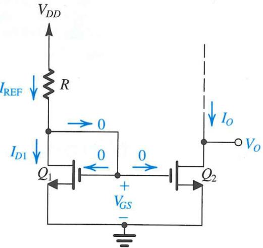

Figure 1: A MOSFET circuit rigged up as a current mirror used as a current source. Here, VO is chosen to ensure both transistors are in saturation (Courtesy of Sedra and Smith).

A MOSFET is always operating in the saturation regime when the drain is shorted to its gate, as shown in Figure 1. In this case, VDS = VGS > VGS −Vt =

Printed on November 28, 2017 at 18 : 02: W.C. Chew and Z.H. Chen.

VOV implying saturation always. Then the drain current is given by

$$I\_{D1} = \frac{1}{2} k\_n' \left(\frac{W}{L}\right)\_1 (V\_{GS} - V\_{tn})^2 \tag{1.1}$$

ignoring the Early effect. The drain current is supplied by VDD through R as shown in Figure 1. The gate currents are zero, and hence,

$$I\_{D1} = I\_{\rm REF} = \frac{V\_{DD} - V\_{GS}}{R} \tag{1.2}$$

This is also a reference current, and hence named as IREF. Varying R changes this reference current.

Now if Q2 is also made to operate in saturation by the appropriate choice of VO, then the current is

$$I\_O = I\_{D2} = \frac{1}{2} k\_n' \left(\frac{W}{L}\right)\_2 (V\_{GS} - V\_{tn})^2 \tag{1.3}$$

Hence, assuming that the transistors have the same threshold voltage Vtn, one gets

$$\frac{I\_O}{I\_{\rm REF}} = \frac{(W/L)\_2}{(W/L)\_1} \tag{1.4}$$

Thus by controlling the geometry of the two MOSFETs, one can control the ratio of the two drain currents.

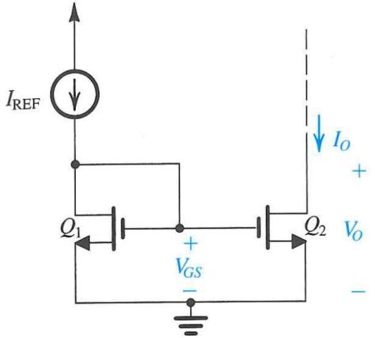

Figure 2: A MOSFET circuit rigged up as a current mirror. Even when the transistors are not matched, such a circuit is called a current mirror (Courtesy of Sedra and Smith).

When IO = IREF, the second MOSFET mirrors the current of the first MOSFET. Even when the two drain currents are not equal, such designs are known as current mirrors. Figure 2 shows a simplified picture of the current mirror. The ratio dictated by (1.4) is also called the current transfer ratio.

### 1.1 Effect of VO on IO

The previous analysis assumes that when the MOS transistors are matched and are in the saturation mode, they have equal drain currents ID when their gate voltages VGS are the same. The reason being that the formula for the drain current in the saturation mode is

$$I\_D = \frac{1}{2} k\_n' \left(\frac{W}{L}\right) (V\_{GS} - V\_{tn})^2 \tag{1.5}$$

which depends only on VGS. But the above formula ignores Early effect that can cause the dependence of the drain current ID on VDS. This is shown in Figure 3.

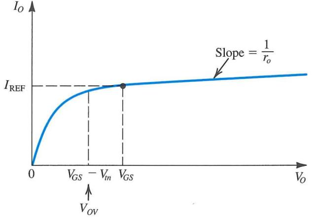

Figure 3: Output characteristics of a current source or a current mirror when the transistors are matched. Here, VO = VDS is the drain-source voltage (Courtesy of Sedra and Smith).

Notice that here in Figure 3, VO = VDS. In order for Q2 to be saturated, it is needed that

$$V\_O \ge V\_{OV} = V\_{GS} - V\_{tn} \tag{1.6}$$

Ideally, IO does not increase with increasing VO but with the Early effect, IO increases slightly with VO as shown in Figure 3. This Early effect can be represented by the formula

$$I\_O = \frac{(W/L)\_2}{(W/L)\_1} I\_{\rm REF} \left( 1 + \frac{V\_O - V\_{GS}}{V\_{A2}} \right) \tag{1.7}$$

The above implies that IO matches IREF perfectly at VO = VGS if the two transistors are matched. The slope of the curve is such that

$$\frac{\Delta V\_O}{\Delta I\_O} = \frac{V\_{A2}}{I\_{\text{REF}}} \approx \frac{V\_{A2}}{I\_O} \tag{1.8}$$

assuming that (W/L)2 (W/L)1 ≈ 1.

## 2 MOS Current-Steering Circuits

The current mirror can be used to implement current-steering circuit as shown in Figure 4. In this circuit, ignoring Early effect, it is clear that

$$I\_2 = I\_{\rm REF} \frac{(W/L)\_2}{(W/L)\_1}, \qquad I\_3 = I\_{\rm REF} \frac{(W/L)\_3}{(W/L)\_1} \tag{2.1}$$

Furthermore, in Figure 4, for the two transistors Q2 and Q3 to be in saturation,

$$V\_{D2}, V\_{D3} \ge -V\_{SS} + V\_{GS1} - V\_{tn}, \text{ or } V\_{D2}, V\_{D3} \ge -V\_{SS} + V\_{OV1} \tag{2.2}$$

Notice that VD + VSS = VDS. The above just implies that that VDS of each transistor is larger than its overdrive voltage VOV to be in the saturation regime.

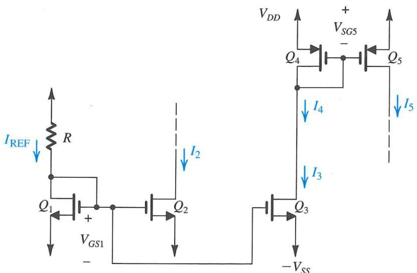

Figure 4: A current-steering circuit using MOSFET (Courtesy of Sedra and Smith).

Some details of the current-steering circuit in Figure 4 are shown in Figure 5. Figure 5(a) shows the use of the current source to bias a common-drain amplifier (source follower), while Figure 5(b) shows its use to bias a commonsource amplifier.

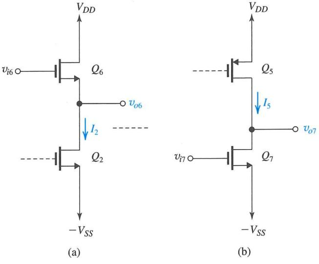

Figure 5: Applications of current-steering circuits. In (a), Q2 is acting as a sink, while in (b), Q5 is acting as a source (Courtesy of Sedra and Smith).

Figure 6 shows the biasing requirements of the steering circuit when it is operating as a current source in (a) and as a current sink in (b).

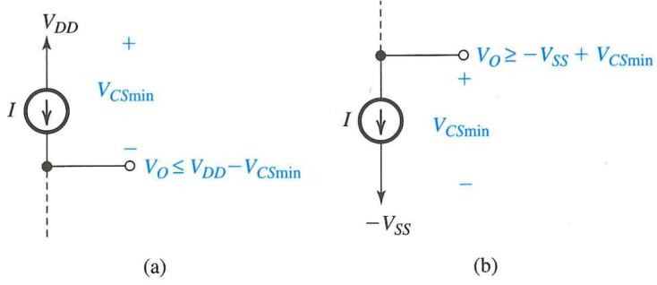

Figure 6: (a) A current source where the dotted line represents the outside world, and the circuit is pushing current into the outside world. (b) A current sink where the dotted line represent the outside, and circuit is drawing current from outside (Courtesy of Sedra and Smith).

#### 2.1 BJT Circuits

The BJT mirror has two important differences from that of the MOSFET. One is that the base currents of the transistors are not zero, and second, that even when the two transistors have the same VBE, the collector current would be different because the area of the emitter-base junction may be different. Hence, approximating the base current to be zero, or that β is very large,1

$$\frac{I\_O}{I\_{\rm REF}} = \frac{I\_{S2}}{I\_{S1}} = \frac{\text{Area of EBJ of } Q\_2}{\text{Area of EBJ of } Q\_1} \tag{2.3}$$

where ISi is the saturation current or the scale current of the i-th transistor.

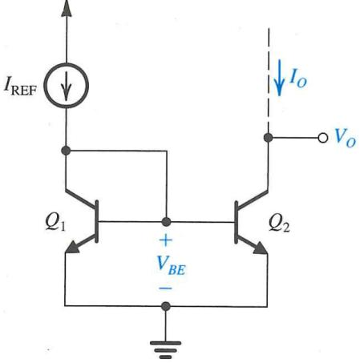

Figure 7: A basic BJT current mirror circuit (Courtesy of Sedra and Smith).

To see the effect of finite β on the current mirror, we can assume that the two BJT's are matched. Referring to Figure 8, one can see that

$$I\_{\rm REF} = I\_C + 2I\_C/\beta = I\_C \left(1 + \frac{2}{\beta}\right) \tag{2.4}$$

For a pair of matched transisfor, IO = IC , and the current transfer ratio becomes

$$\frac{I\_O}{I\_{\rm REF}} = \frac{I\_C}{I\_{\rm REF}} = \frac{1}{1 + \frac{2}{\beta}}\tag{2.5}$$

For imperfectly matched transistors such that IS2 = mIS1, one can show that

$$\frac{I\_O}{I\_{\rm REF}} = \frac{m}{1 + \frac{m+1}{\beta}}\tag{2.6}$$

1Recall that the collector current IC = IS exp(VBE/VT ).

Even if the finite β effect is not there, the Early effect will result in different IC 's for the two transistors unless VO = VBE. In order to account for this, one can write

$$I\_O = I\_{\rm REF} \frac{m}{1 + \frac{m+1}{\beta}} \left( 1 + \frac{V\_O - V\_{BE}}{V\_{A2}} \right) \tag{2.7}$$

In the above, VA2 is derived from the definition of the Early effect such that

$$r\_{o2} = V\_{A2}/I\_O \tag{2.8}$$

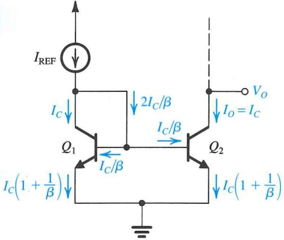

Figure 8: Finite β effect on the current mirror. Because β is not infinite, IREF is not equal to IO (Courtesy of Sedra and Smith).

#### 2.2 A Simple Current Source

A simple BJT current source can be implemented as shown in Figure 9. Assume a matched transistor case, then

$$I\_O = \frac{I\_{\rm REF}}{1 + 2/\beta} \left( 1 + \frac{V\_O - V\_{BE}}{V\_A} \right) \tag{2.9}$$

The output resistance of this approximate current source is ∆VO/∆IO, which is

$$R\_o \approx V\_A / I\_{\rm REF} \approx V\_A / I\_O \tag{2.10}$$

This could be a large value, making this a good approximation of a current source.

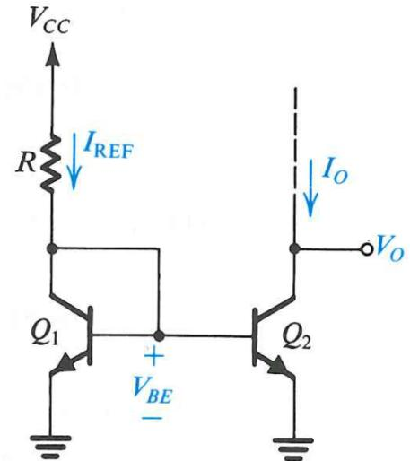

Figure 9: A simple BJT current mirror used as a current source (Courtesy of Sedra and Smith).

#### 2.3 Current Steering

Figure 10 shows the use of the current mirrors to generate current sources and sinks of different amplitudes.

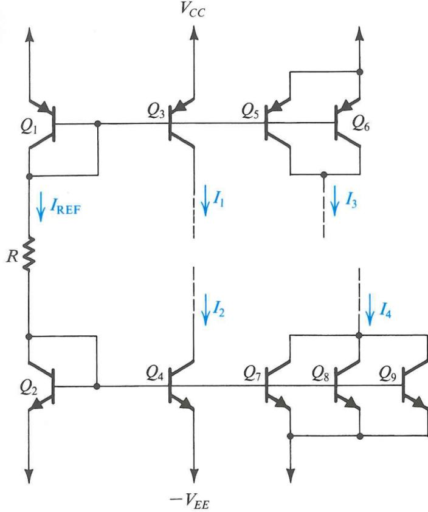

Figure 10: Ways to generate constant current sources and sinks of various magnitude by current steering (Courtesy of Sedra and Smith).

#### 2.4 Base-Current Compensation

Figure 11 shows a circuit where the base current can be further reduced so that IREF is as close to IC as possible. Assume a matched transistor case, then

$$\frac{I\_O}{I\_{\rm REF}} = \frac{1}{1 + 2/(\beta(\beta + 1))} \approx 1/(1 + 2/\beta^2) \tag{2.11}$$

Therefore, the currents, IO and IREF, are greatly equalized in this design.

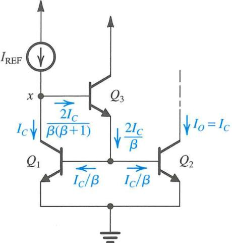

Figure 11: A current mirror with base-current compensation. By adding an extra transistor, the base current can be made very small if β is large (Courtesy of Sedra and Smith).

### 3 Small-Signal Operation of Current Mirrors

Using the hybrid-π model, the current mirror in Figure 12(a) can be replaced by that of Figure 12(b). Note that for transistor Q1, the gate is connected to the drain in this small-signal model. But since the current source behaves exactly like a resistor of 1/gm1, the final small-signal model can be replaced by Figure 12(c).

First, one assumes that ro1 1/gm1, then ii = vgsgm1. Assuming that the the small-signal for Q2 output is short-circuited or that Q2 is biased by a DC voltage source, then, io = gm2vgs. Then the short-circuit current gain is

$$A\_{is} = \frac{i\_o}{i\_i} \approx g\_{m2}/g\_{m1} \tag{3.1}$$

Here,

$$g\_{m1,2} = \mu\_n C\_{ox} (W/L)\_{1,2} V\_{OV,1,2} \tag{3.2}$$

Since VOV = VGS −Vt, assuming that the two transistors have the same threshold voltage Vt, then the two overdrive voltages are the same. Using (3.2) in (3.1), the short-circuit current gain is

$$A\_{is} = \frac{(W/L)\_2}{(W/L)\_1} \tag{3.3}$$

Therefore, one can have current amplification by changing the geometries of the two transistor. Moreover, this current amplification is the same as that for the DC current transfer ratio case as shown in (1.4) which is for large signals. Therefore, with clever engineering, the strong linearity of this current amplifier can be achieved all the way from small signals to large DC signals.

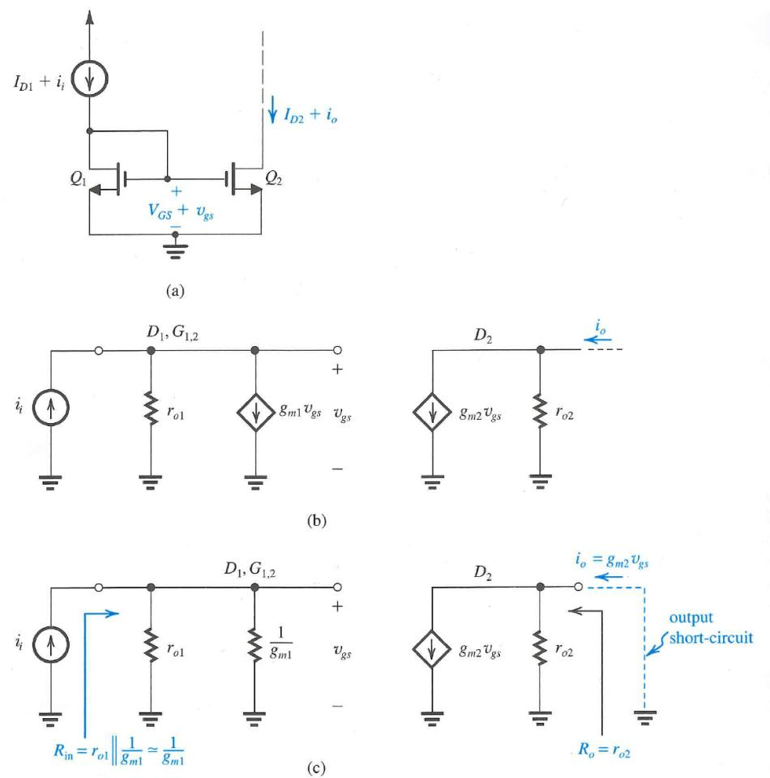

Figure 12: Small-signal model for the MOS current mirror as an amplifier (Courtesy of Sedra and Smith).