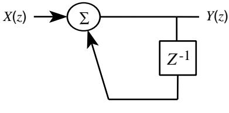
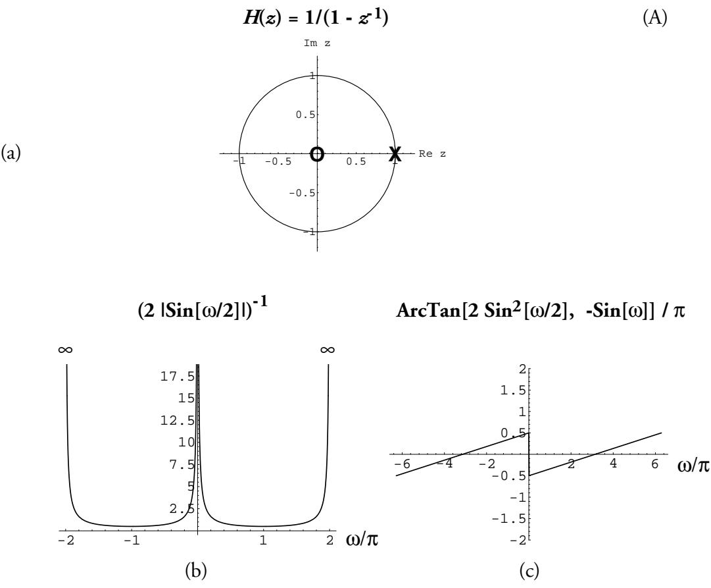
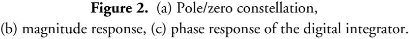
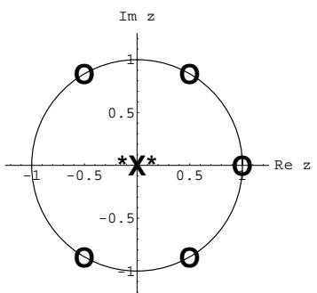
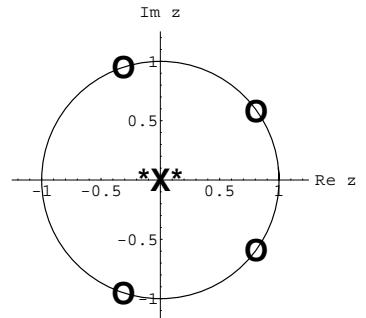
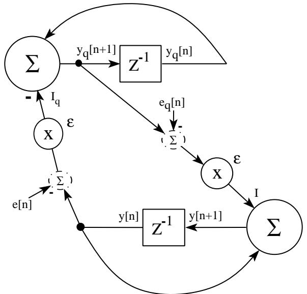
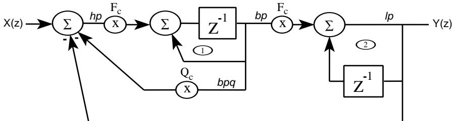

**-Jon Dattorro Summer '97**

# **The Digital Integrator**

**Figure 1.**

# **Introduction**

There is not much in standard DSP texts about the marginally stable causal circuit shown in Figure1. What *is* in the literature sometimes discourages its use. But the digital integrator is a highly useful and viable circuit because of its simplicity. To employ it successfully requires some care, and an understanding of poles right on the unit circle.

(a)

# **1 Theoretical**

To motivate the study of this simple circuit, let's start with a question about what happens when we input the unbounded energy signal *x*[*n*]=cos(π*n*) *u*[*n*] into the digital integrator shown in Figure1. Another way to write this input is *x*[*n*]={1,–1,1,–1,1,–1,…} which we recognize as the highest-frequency (*z*=–1) sinusoidal signal that can be input to the circuit. The output is given by Equ.(B) from which we see that *y*[*n*]={1,0,1,0,1,0,…}.

$$\text{y}[n] = \sum\_{k=0}^{n} \text{x}[k] \tag{B}$$

Yet if we evaluate *H*(*z*) from Equ.(A), we find that the frequency response for this input sinusoid is simply *H*(-1)=1/2 . So we might expect that the output *y*[*n*] would instead equal {1/2,–1/2,1/2,–1/2,1/2,–1/2,…}. Though each oscillates at the same frequency, why the disagreement in their mean?

The anomaly is resolved when we realize that the transient response of this circuit never decays because the pole of *H*(*z*) is right on the unit circle. Hence, to find the output we must consider what is called the *zero state response* (ZSR) instead of the *forced response* to a sinusoid. The **forced response** is the response to a sinusoid of infinite extent in positive and negative time. For stable circuits that means that any transient response died out long ago. The magnitude and phase response is the forced response, and is what is shown in Figure2; what is determined by evaluating *H*(*z*) for some *z*o on the unit circle. The **zero state response** is simply given in the transform domain by

$$Y(z) = X(z) \ H(z) \qquad \text{or} \qquad \qquad Y(e^{j0}) = X(e^{j0}) \ H(e^{j0}) \tag{C}$$

Because it is the ZSR which always governs the complete response of any linear circuit, we must preferentially evaluate it **(**instead of *H*(*z*) alone**)** when considering circuits such as this

having poles anywhere on the unit circle. One way to work with the ZSR is by sorting out the contribution of the forcing input, from the transient response of the circuit itself. That way we may continue to work with the familiar paradigm of the forced response. The **transient response** is that part of the complete response which is produced by the system itself; i.e., energy at the frequency **(**and radius**)** of the system poles which is elicited by the input signal.1

Fortunately, this sorting of the forced and transient responses is a simple task when the input signal has an exponential form;2 i.e., when the input signal has a *z* transform that looks like *X*(*z*)=*z*/(*z*–*zo* ). For a signal of this simple form and an equally simple filter *H*(*z*)=*z*/(*z*–*zp* )

$$\begin{array}{cccc} Y(\mathbf{z}) & = & X(\mathbf{z}) \ H(\mathbf{z}\_{\vartheta}) & + & X(\mathbf{z}\_{\mathcal{P}}) \ H(\mathbf{z}) & & & ; z\_{\vartheta} \neq z\_{\mathcal{P}} \\\\ & = & \text{forced response} & + & \text{transient response} & & & (\mathbf{D}) \\\\ & = & X(\mathbf{z}) \ H(\mathbf{z}) & & & & \end{array}$$

When *zo* falls on the unit circle, this *X*(*z*) corresponds to a discrete complex sinusoid that begins at absolute time 0; i.e., *x*[*n*]=*e j*ω*o n u*[*n*] for *zo* =*e j*ω*o* , ω*o* = 2πƒ*o T*. For stable filters, we are accustomed to the transient response decaying to zero over time, hence we are usually just concerned with the forced response; not so for this filter. The ZSR in the time domain is

$$\begin{array}{rcl} \, [\, \jmath[n] = (e^{j\pi n} \, \ulcorner n[n]) \, 1/2 & + & 1/2 \, \ulcorner \iota[n] & \vert \, \ulcorner & \urcorner \end{array} ; \begin{array}{rcl} \, \ulcorner n[n] & = \, \ulcorner \iota[n] \, \end{array}$$

where *H*(*zo* ) = *H*(-1) = 1/2 and *X*(*zp* ) = *X*(1) = 1/2.

1 We are considering only the ZSR, hence we ignore the transient response that would be produced by nonzero initial states; i.e. the zero input response (ZIR).

2 Laplace has proven that a very large class of signals may be described as sums of exponentials; the Laplace transform. This class is larger than and includes the Fourier class.

## **Linear**

Because only a system which is initially at rest can be a linear system, the ZSR gives the complete output. Because the system is linear, we can say that an imaginary input is responsible for the imaginary output of our system, and vice versa for the real part. Hence to answer the question as originally posed for *x*[*n*]=cos(π*n*) *u*[*n*]=Re{*e j*ω*o n u*[*n*]}, we take the real part of the previously calculated output

$$\begin{array}{rcl} \mathcal{J}[n] = \left(\cos(\pi n) \ u[n]\right) \begin{array}{rcl} 1/2 & + & 1/2 \ u[n] \end{array}$$

## **Blowing Up**

To *blow up* in this context means an unbounded output amplitude given a bounded input amplitude.

A related observation arises from viewing only the magnitude response in Figure2(b) which displays a pole right on the unit circle. It appears that an input signal having any nonzero bounded *energy* at the frequency of the marginal system pole will emerge having *unbounded output energy*; that means, an output signal of bounded amplitude but infinite in duration. Only an input signal itself having unbounded energy at the same frequency as the marginal system pole will produce an unbounded output amplitude; i.e., the output will blow up.3

3 Note that this principle does not apply to poles which are inside the unit circle; i.e., systems of that more typical kind **(**stable, causal**)** always produce bounded output energy for bounded input energy (BIBO). [O&S,ch.2.4] [Tuttle,ch.2.14]

Let's see if we can support these assertions with our simple system and exponential input. Specifically, let's input an exponential signal whose frequency is very close to but not equal to the pole frequency; let *zo* = *zp* + *j*ε. Then

$$Y(\mathbf{z}) \ = \ X(\mathbf{z}) \ H(z\_p + j\mathbf{\hat{c}}) \qquad \quad + \qquad X(z\_p) \ H(z) \ = $$

$$Y(z) = \frac{z}{z - (z\_p + \varepsilon)} \left(\frac{z\_p + \varepsilon}{\varepsilon}\right) - \frac{z\_p}{\varepsilon} \frac{z}{z - z\_p} \tag{E}$$

We see from Equ.(E) that neither the forced response nor the transient response are necessarily growing in amplitude without bound; albeit, they are individually large.4 Because the system pole *zp* is on the unit circle, the output *y*[*n*] has unbounded energy due to the transient response. As ε approaches zero, **(**as the input frequency and pole frequency become the same**)** the output will grow in amplitude without bound.

$$\begin{aligned} \lim\_{\varepsilon \to 0} Y(z) &= \frac{z}{z - z\_p} + \frac{z \ z\_p}{\left(z - z\_p\right)^2} \\\\ \lim\_{\varepsilon \to 0} y[n] &= \left(1 + n\right) z\_p^n u[n] \end{aligned} \tag{F}$$

Equ.(F) corresponds to a ramp() when |*zp* |=1 .

In summary, when the magnitude response of a system goes to infinity, indicating a pole on the unit circle, the system can easily produce output signals having bounded amplitude but unbounded energy. Only when the system is continually excited at the precise frequency of that pole can the system produce an output of unbounded amplitude.

4 Another typical characteristic of the transient response, in general, is that its sign is such that it acts to diminish the forced response. Therefore the complete response is not as large as might be predicted from the forced response alone. That information is not readily ascertained from viewing the frequency response **(**the forced response in the frequency domain**)**.

## **Not Blowing Up**

The converse of this principle is that any input signal of bounded energy but having zero energy **(**a zero**)** at the frequency of the marginal system pole, will emerge having *bounded output energy* and bounded amplitude. Consider a bounded energy signal input *x*[*n*]={1,–1,1,–1,1,–1} to our digital integrator, whose pole/zero constellation is shown in FigureA.

**FigureA.** Pole/zero constellation of input.

Notice the zero at dc. The assertion is that this input signal will not produce an unbounded energy signal when put through the integrator system shown in Figure2. From Equ.(B) we easily see that the output terminates at a value of 0. In other words, an input signal having a zero which cancels a system pole on the unit circle, will cancel the transient response due to that pole.

To belabor this point, consider the input *x*[*n*]={1,–1,1,–1,1} having the constellation shown in FigureB.

**FigureB.** Pole/zero constellation of input.

From Equ.(B) it is readily ascertained that the output of the digital integrator terminates with the value 1; consequently, unbounded output energy.

So we may conclude:

**Rule 1)** Stable Systems: If system pole is *not* on the unit circle, then an input signal of bounded energy having any energy at a frequency equal to the pole frequency will emerge having bounded output energy.

**Rule 2)** Marginally Stable Systems: If system pole is right on the unit circle, then an input signal of bounded energy having energy at a frequency equal to the marginal pole frequency will emerge as a transient response of unbounded output energy. If an input signal has bounded energy but has a zero at the marginal pole frequency, then the output signal will have bounded energy. If the input signal has unbounded energy but *not* at the marginal pole frequency, then the output signal will have unbounded energy at the frequencies of the input and the system pole. If the input signal has unbounded energy at the marginal pole frequency, then the output signal will have unbounded amplitude.

## **Partial Fraction Expansion**

These two rules are partially verified in the equation below which indicates the forced/transient response decomposition of the output signal. Assuming all *zi* and *zp* are distinct, and the input signal is of infinite duration,

$$\begin{aligned} X(z) &\equiv \sum\_{i} X\_{i}(z) &; & X\_{i}(z) &= \frac{k}{1 - z\_{i}\varepsilon^{-1}}, \quad k\_{i} \in \mathbf{C} \\\\ H(z) &\equiv k \prod\_{p} \frac{1 - z\_{p}\varepsilon^{-1}}{1 - z\_{p}\varepsilon^{-1}} &; & k \in \mathbf{R} \end{aligned}$$

$$\begin{aligned} \chi(T(z) = X(z)H(z) &= \sum\_{i} X\_{i}(z)H(z) + \sum\_{p} X(z\_{p})H(z) \big(1 - z\_{p}\varepsilon^{-1}\big)|\_{z = \varphi} \frac{1}{\left(1 - z\_{p}\varepsilon^{-1}\right)} \end{aligned}$$

In another filter form,

( ) ( ) ( ) ? ( ) ( ) ( ) ? *Y*(*z*) *X*(*z*) *H*(*z*) *X* (*z*) *H*(*z* ) *X*(*z* ) *H* (*z*) *k z z k H z H z H z k z z k X z X z X z* = = + ∈ − ≡ = ∈ − ≡ = − − *p p p i i i p p p p p p i i i i i i* , 1 ; , 1 ; 1 1 C C

For completeness, we digress for a finite-duration input signal *x* [ ] [ ] [ ] *n k z* (*u n u n N* ) *i n i* = *i* − − ,

$$\begin{aligned} X(z) &= \sum\_{i} X\_{i}(z) & ; \; X\_{i}(z) &= \frac{k\_{i}}{1 - z\_{i}} \left( 1 - z\_{i}^{\mathrm{N}} z^{-\mathrm{N}} \right), & k\_{i} &\in \mathbf{C} \\\\ X(z) &= \sum\_{i} X\_{vi}(z) \left( 1 - z\_{i}^{\mathrm{N}} z^{-\mathrm{N}} \right) & ; \; X\_{vi}(z) &\stackrel{\mathrm{\underline{k}}}{=} \frac{k\_{i}}{1 - z\_{i}} \underline{z}^{-1} \\\\ H(z) &= \sum\_{p} H\_{p}(z) & ; \; H\_{p}(z) &= \frac{k\_{p}}{1 - z\_{p}} \underline{z}^{-1} \end{aligned}$$

$$\begin{aligned} Y(z) &= X(z) \, H(z) = \sum\_{i} \Big( X\_{vi}(z) \, H(z\_{i}) + \sum\_{p} X\_{vi}(z\_{p}) \, H\_{p}(z) \Big) \Big( 1 - z\_{i}^{\mathrm{N}} z^{-\mathrm{N}} \Big) \end{aligned}$$

All these equations are algebraic in derivation, hence evaluation of a function *X* or *H* outside its region of convergence is permitted. The values outside are from the *analytic continuation* of the respective function. [Churchill]

## **1.1 Finite** *n*

$$H(z) = \sum\_{k=0}^{n} z^{-k} = \frac{1 - z^{-(n+1)}}{1 - z^{-1}} \quad ; \ 0 < |z| < \infty \tag{1}$$

Equation (1) gives the closed form for the sum of a finite-length geometric series. The series represents the *z* transform of the impulse response of the discrete-time integrator. It is important to note at the outset that equation (1) is an identity and not the result of some limiting condition. That equation is often found written instead with the caveat *z*≠1 for finite *n* . We can show that caveat to be an incorrect interpretation by invoking l'Hopital's rule which states that

$$\lim\_{z \to 1} \left[ \frac{1 - z^{-(n+1)}}{1 - z^{-1}} \right] = \lim\_{z \to 1} \left[ \frac{\frac{d}{dz} \left( 1 - z^{-(n+1)} \right)}{\frac{d}{dz} \left( 1 - z^{-1} \right)} \right] = \lim\_{z \to 1} \{ \left( n+1 \right) z^{-n} \} = n+1 \tag{2}$$

Hence the ROC for the finite-length causal discrete integration spans the entire *z* plane with the exception of *z*=0**(***n*>0**)**. 5

5 A simpler explanation of the anomaly above would consider the erroneous statement f(x)=x4/x; x≠0. Since when z=1, the numerator of Equ.(1) can be factored into a form having a term equivalent to the denominator, then the same argument as for f(x) can be made.

## **1.2 Infinite** *n*

As *n* → ∞ in equation (1) it is natural to ask what that limit is. We consider four cases:

Case 1**)** |*z*| > 1,*n* → ∞:

From equation (1) we see that the summation *H*(*z*) is absolutely convergent.

Case 2**)** |*z*| < 1,*n* → ∞:

From (1), *H*(*z*) is divergent.

Case 3**)** *z* = 1,*n* → ∞:

$$\lim\_{n \to \infty} [H(z)|\_{z=1}] = \infty \tag{3}$$

Because of the limit in (2), *H*(*z*) diverges.

Case 4**)** |*z*| = 1,*z* ≠1, *n* → ∞:

This is the most interesting case. Strictly speaking, the summation *H*(*z*) does not diverge on the unit circle except at the point *z*=1. It is erroneous to say that it diverges on the unit circle, which is often said because it is neither true that *H*(*z*) converges on the unit circle. What the summation *H*(*z*) does on the unit circle is to vacillate with ever increasing *n* . Consider the summation (1) upon the unit circle (but not at *z*=1) as a function of *n* ; viz.,

$$H(z)|\_{|z|=1} = H(e^{j\alpha}) = \frac{1 - e^{-j\alpha(n+1)}}{1 - e^{-j\alpha}}\tag{4}$$

The numerator of (4) has limited magnitudefor all non-negative *n* while the denominator magnitude spans the range (0,2]. Since the denominator is constrained never to be zero for this case, then the summation Equ.(4) *H*(*e j*ω) must always be finite **(**albeit, quite large for large *n* and some ω**)**. Consider the behavior of the summation, for example, at the normalized radian frequency ω=π . Depending upon whether *n* is even or odd, the summation Equ.(4) can only assume the value 1 or 0. Next consider the frequency ω=π/2 where the summation (4) can only assume the values **{**1,1–*j*,–*j*,0**}**; i.e., *H*(*e j*ω) is not convergent in those two instances, but neither does it diverge. That quality makes the discrete-time integrator usable **(**and useful**)** for very practical purposes.

We can ascribe a unique value to *H*(*e j*ω) Equ.(4) at each ω by introducing a convergence factor and then performing a limiting operation for *n* → ∞. But that is just the idea behind the Laplace transform. Indeed, the *z* transform Equ.(1) is simply the discrete-time Laplace transform. The convergence factor is already contained within the complex variable *z* because *z* ≡ *e sT* where the Laplace variable *s* equals σ+*j*Ω. For the discrete-time integrator on the unit circle, we shall assign the values of Equ.(1) to Equ.(4) when |*z*|=1+ . The limit of |*z*| that we take is to 1 plus an infinitesimal positive quantity; we denote that as 1+.

We say then,

$$H(z)|\_{|z|=1} = H(e^{j\alpha}) \equiv \frac{1}{1 - e^{-j\alpha}} \quad ; \text{ o } \neq 0, \ n \to \infty \tag{5}$$

for all practical purposes. Equ.(5) can still reach infinity if ω were allowed to be 0 (case 3). **(**We note the similarity of Equ.(5) to the corresponding Fourier transform.6**)** So, to use the discrete-time integrator in a practical circuit, we must take certain precautions **(**discussed shortly**)**.

In summary, the ROC for the infinite-length causal discrete-time integrator *H*(*z*) has lost the interior of the unit disk in the *z* plane. The ROC is now 1<|*z*|<∞, but *H*(*z*) does not diverge on the unit circle except at *z*=1. All these cases are distilled in Equ.(6) for infinite*n*.

$$H(z) = \sum\_{k=0}^{\infty} z^{-k} \equiv \frac{1}{1 - z^{-1}} \quad ; \; |z| > 1, \; |z| = 1, \; z \neq 1 \tag{6}$$

6 The Fourier transform of the discrete-time integrator is [O&S,ch.2.7] 1/(1 – *e* –*j*ω) + π ∑*k* δ(ω + 2π*k*)

Everyone seems to agree that Equ.(4) and Equ.(5) would blow up at dc as *n* → ∞.

# **2 Practical**

The discrete-time integrator becomes the *digital integrator* when finite word-length effects are considered. One way to incorporate the digital integrator into a practical circuit is when one of the following two conditions are met:

1**)** the digital integrator must have a zero of transmission across it at dc, or

2**)** all transfer functions from all sources terminating at the input to the integrator must have a zero of transmission at dc.

When one of these conditions is met, then the high gains near dc are equalized, either by the transfer function across the embedded integrator or the transfer function leading up to it. This equalization is equivalent to pole/zero cancellation. We show two examples of this type of thing now:

## **Example 1**

**Figure3.** Second Modified Coupled Form Sinusoidal Oscillator showing noise sources.

In Figure3 we show the Gordon/Smith oscillator. [EffectDesign,Part3,Sec.7] Both integrators in this design have a zero of transmission across it at dc; that is, *Y*[*z*]/*I*[*z*] and *Y q* [*z*]/*I q* [*z*] both have a term 1–*z* –1 in the numerator. The signals *e*[*n*] and *eq* [*n*] represent preaccumulation truncation noise sources. Whether or not these sources appear pre- or post-accumulation, the result is the same; they are each subject to a zero of transmission at dc while passing through the first-encountered integrator. The circuit in Figure3 has no other inputs as it is the zero input response (ZIR) that we desire from an oscillator.

## **Example 2**

**Figure4.** Chamberlin Filter Topology.

In Figure4 we show the all pole filter discussed in [EffectDesign,PartI]. Integrator1 has a zero of transmission across it at dc as in the previous example, but integrator 2 does not. It can be shown that when both integrators retain double precision in their feedback loops, then integrator 2 has no signal arriving at its input having dc content.

# **References**

[M&C] Clare D. McGillem, George R. Cooper, *Continuous & Discrete Signal* & *System Analysis,* third edition, 1991, Saunders College Publishing, Holt, Rinehart and Winston, Inc., Orlando, FL 32887 USA

[O&S] Alan V. Oppenheim, Ronald W. Schafer, *Discrete-Time Signal Processing*, 1989, Prentice-Hall, Inc., Englewood Cliffs, NJ 07632 USA, Internet: http://www.prenhall.com/

[EffectDesign,Part3] Jon Dattorro, **'**Effect Design, Part 3: Oscillators: Sinusoidal and Pseudonoise**'**, Journal of the Audio Engineering Society, vol.50, no.3, March 2002.

[EffectDesign,Part1] Jon Dattorro, **'**Effect Design, Part 1: Reverberator and Other Filters**'**, Journal of the Audio Engineering Society, vol.45, no.9, pp.660-684, 1997 September.

[Tuttle] David F. Tuttle, Jr., *Circuits*, 1977, McGraw-Hill Book Company

[First] James H. McClellan, Ronald W. Schafer, Mark A. Yoder, *DSP First, a Multimedia Approach*, 1998, Prentice-Hall, Inc., Englewood Cliffs, NJ 07632 USA, Internet: http://www.prenhall.com/

[Churchill] Ruel V. Churchill, James Ward Brown, *Complex Variables and Applications*, fifth edition, 1990, McGraw-Hill, Inc.

# **Notes for possible revisions:**

- 1**)** Do IFT of frequency domain expression for integrator impulse response (in the footnotes above).
- 2**) (**Example of sinusoid input near DC; sin, exp. Huge? yes.**)** ZSR, Josh at CCRMA.
- 3**)** what is meant by "energy at a frequency"?
- 4**)** Reference, DSP FIRST, McClellan, pg.259