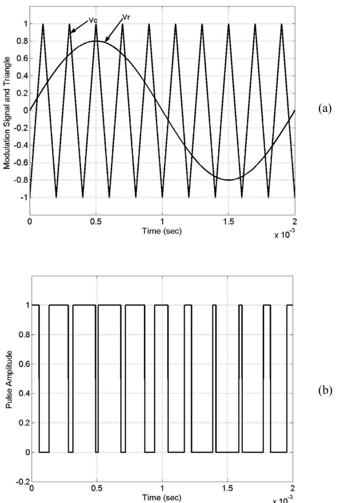
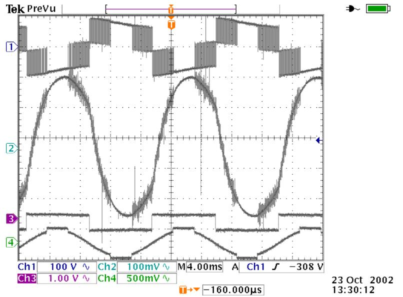

# **CHAPTER 2**

# **SINGLE PHASE PULSE WIDTH MODULATED INVERTERS**

# **2.1 Introduction**

The dc-ac converter, also known as the inverter, converts dc power to ac power at desired output voltage and frequency. The dc power input to the inverter is obtained from an existing power supply network or from a rotating alternator through a rectifier or a battery, fuel cell, photovoltaic array or magneto hydrodynamic generator. The filter capacitor across the input terminals of the inverter provides a constant dc link voltage. The inverter therefore is an adjustable-frequency voltage source. The configuration of ac to dc converter and dc to ac inverter is called a dclink converter.

 Inverters can be broadly classified into two types, voltage source and current source inverters. A voltage–fed inverter (VFI) or more generally a voltage–source inverter (VSI) is one in which the dc source has small or negligible impedance. The voltage at the input terminals is constant. A current–source inverter (CSI) is fed with adjustable current from the dc source of high impedance that is from a constant dc source.

 A voltage source inverter employing thyristors as switches, some type of forced commutation is required, while the VSIs made up of using GTOs, power transistors, power MOSFETs or IGBTs, self commutation with base or gate drive signals for their controlled turn-on and turn-off.

 A standard single-phase voltage or current source inverter can be in the halfbridge or full-bridge configuration. The single-phase units can be joined to have three-phase or multiphase topologies. Some industrial applications of inverters are for adjustable-speed ac drives, induction heating, standby aircraft power supplies, UPS (uninterruptible power supplies) for computers, HVDC transmission lines, etc.

 In this chapter single-phase inverters and their operating principles are analyzed in detail. The concept of Pulse Width Modulation (PWM) for inverters is described with analyses extended to different kinds of PWM strategies. Finally the simulation results for a single-phase inverter using the PWM strategies described are presented.

## **2.2 Voltage Control in Single - Phase Inverters**

 The schematic of inverter system is as shown in Figure 2.1, in which the battery or rectifier provides the dc supply to the inverter. The inverter is used to control the fundamental voltage magnitude and the frequency of the ac output voltage. AC loads may require constant or adjustable voltage at their input terminals, when such loads are fed by inverters, it is essential that the output voltage of the inverters is so controlled as to fulfill the requirement of the loads. For example if the inverter supplies power to a magnetic circuit, such as a induction motor, the voltage to frequency ratio at the inverter output terminals must be kept constant. This avoids saturation in the magnetic circuit of the device fed by the inverter.

Figure 2.1: Schematic for Inverter System

The various methods for the control of output voltage of inverters can be classified as:

- (a) External control of ac output voltage
- (b) External control of dc input voltage
	- (c ) Internal control of the inverter.

The first two methods require the use of peripheral components whereas the third method requires no external components. Mostly the internal control of the inverters is dealt, and so the third method of control is discussed in great detail in the following section.

# **2.2.1 Pulse Width Modulation Control**

The fundamental magnitude of the output voltage from an inverter can be controlled to be constant by exercising control within the inverter itself that is no external control circuitry is required. The most efficient method of doing this is by Pulse Width Modulation (PWM) control used within the inverter. In this scheme the inverter is fed by a fixed input voltage and a controlled ac voltage is obtained by

adjusting the on and the off periods of the inverter components. The advantages of the PWM control scheme are [10]:

- a) The output voltage control can be obtained without addition of any external components.
- b) PWM minimizes the lower order harmonics, while the higher order harmonics can be eliminated using a filter.

The disadvantage possessed by this scheme is that the switching devices used in the inverter are expensive as they must possess low turn on and turn off times, nevertheless PWM operated are very popular in all industrial equipments. PWM techniques are characterized by constant amplitude pulses with different duty cycles for each period. The width of these pulses are modulated to obtain inverter output voltage control and to reduce its harmonic content. There are different PWM techniques which essentially differ in the harmonic content of their respective output voltages, thus the choice of a particular PWM technique depends on the permissible harmonic content in the inverter output voltage.

# 2.2.2 **Sinusoidal-Pulse Width Modulation (SPWM)**

 The sinusoidal PWM (SPWM) method also known as the triangulation, sub harmonic, or suboscillation method, is very popular in industrial applications and is extensively reviewed in the literature [1-2]. The SPWM is explained with reference to Figure 2.2, which is the half-bridge circuit topology for a single-phase inverter.

Figure 2.2: Schematic diagram for Half-Bridge PWM inverter.

 For realizing SPWM, a high-frequency triangular carrier wave is compared with a sinusoidal reference of the desired frequency. The intersection of and waves determines the switching instants and commutation of the modulated pulse. The PWM scheme is illustrated in Figure 2.3 a, in which *v* is the peak value of triangular carrier wave and *v* that of the reference, or modulating signal. The figure shows the triangle and modulation signal with some arbitrary frequency and magnitude. In the inverter of Figure 2.2 the switches and are controlled based on the comparison of control signal and the triangular wave which are mixed in a comparator. When sinusoidal wave has magnitude higher than the triangular wave the comparator output is high, otherwise it is low. *c v r v c v r v c* 12 *r* 11 *S S*

$$\mathbf{v}\_r \ge \mathbf{v}\_c \qquad \text{S}\_{11} \text{ is on } , \quad \mathbf{V}\_{out} = \frac{\mathbf{V}\_d}{\mathbf{2}} \tag{2.1}$$

and

$$\nu\_r \le \nu\_c \qquad S\_{12} \text{ is on } , \quad V\_{out} = -\frac{V\_d}{2} \tag{2.2}$$

Figure 2.3: SPWM illustration (a) Sine-Triangle Comparison (b) Switching Pulses after comparison.

 The comparator output is processesed in a trigger pulse generator in such a manner that the output voltage wave of the inverter has a pulse width in agreement with the comparator output pulse width. The magnitude ratio of *c r v v* is called the modulation index ( ) and it controls the harmonic content of the output voltage waveform. The magnitude of fundamental component of output voltage is proportional to . The amplitude of the triangular wave is generally kept constant. The frequency–modulation ratio is defined as *mi mi c v mf*

$$m\_f = \frac{f\_t}{f\_m} \tag{2.3}$$

To satisfy the Kirchoff's Voltage law (KVL) constraint, the switches on the same leg are not turned on at the same time, which gives the condition

$$\mathbf{S}\_{11} + \mathbf{S}\_{12} = 1 \tag{2.4}$$

for each leg of the inverter. This enables the output voltage to fluctuate between 2 *Vd* and 2 *Vd* − as shown in Figure 2.4 for a dc voltage of 200 V.

Figure 2.4: Output voltage of the Half-Bridge inverter.

#### **2.3 Single-Phase Inverters**

 A single-phase inverter in the full bridge topology is as shown in Figure 2.5, which consists of four switching devices, two of them on each leg. The fullbridge inverter can produce an output power twice that of the half-bridge inverter with the same input voltage. Three different PWM switching schemes are discussed in this section, which improve the characteristics of the inverter. The objective is to add a zero sequence voltage to the modulation signals in such a way to ensure the clamping of the devices to either the positive or negative dc rail; in the process of which the voltage gain is improved, leading to an increased load fundamental voltage, reduction in total current distortion and increased load power factor. In Figure 2.5, the top devices are assigned to be S11 and S21 while the bottom devices as S12 and S22, the voltage equations for this converter are as given in the following equations.

Figure 2.5: Schematic of a Single Phase Full-Bridge Inverter.

$$\frac{V\_d}{2}(S\_{11} - S\_{12}) = V\_{an} + V\_{no} = V\_{ao} \tag{2.5}$$

$$\frac{V\_d}{2}(S\_{21} - S\_{22}) = V\_{bn} + V\_{no} = V\_{bo} \tag{2.6}$$

$$V\_{ab} = V\_{an} - V\_{bn} \tag{2.7}$$

 The voltages and *V* are the output voltages from phases A and B to an arbitrary point n, *V* is the neutral voltage between point n and the mid-point of the DC source. The switching function of the devices can be approximated by the Fourier series to be equal to *Van bn no* (1+ *M* ) 2 1 where M is the modulation signal which when compared with the triangular waveform yields the switching pulses [19]. Thus from Equations 2.4, 2.5, and 2.6, the expressions for the modulation signals are obtained as

$$M\_{11} = \frac{\Im(V\_{\text{an}} + V\_{\text{no}})}{V\_d} \tag{2.8}$$

$$M\_{21} = \frac{\mathbf{2}(V\_{hn} + V\_{no})}{V\_d}.\tag{2.9}$$

Equations 2.8 and 2.9 give the general expression for the modulation signals for single-phase dc-ac converters. The various types of modulation schemes presented in the literature can be obtained from these equations using appropriate definition for , *V* and *V* . Making use of this concept different modulation schemes have been proposed some of which are explained in detail in the following sections. *Van bn no*

#### **2.3.1 SPWM With Bipolar Switching**

 In this scheme the diagonally opposite transistors S11, S22 and S21 and S12 are turned on or turned off at the same time. The output of leg A is equal and opposite to the output of leg B. The output voltage is determined by comparing the control signal, and the triangular signal, *V* as shown in Figure 2.6(a) to get the switching pulses for the devices , and the switching pattern is as follows. *Vr c*

$$V\_r > V\_c \quad , \quad \text{S}\_{11} \text{ is on } \implies V\_{ao} = \frac{Vd}{2} \text{ and } \text{S}\_{22} \text{ is on } \implies V\_{bo} = -\frac{Vd}{2}; \tag{2.10}$$

$$V\_r \le V\_c \quad , \quad \text{S}\_{12} \text{ is on } \implies V\_{ao} = -\frac{Vd}{2} \text{ and } \text{S}\_{21} \text{ is on } \implies V\_{ho} = \frac{Vd}{2}; \tag{2.11}$$

hence

$$V\_{bo}(t) = -V\_{ao}(t) \tag{2.12}$$

Figure 2.6:Bipolar PWM (a) Sine-triangle comparison (b) Switching pulses for S11/S22 (c) Switching pulses for S12/S21

Figure 2.7: Bipolar PWM scheme (a) Modulation signal for leg 'a' (b) output line-line voltage (c) load current

The line-to-line voltage is given as in Equation 2.13.

$$V\_{ab}(t) = V\_{ao}(t) - V\_{bo}(t) = \mathcal{2}V\_{ao}(t) \tag{2.13}$$

The peak of the fundamental-frequency component in the output voltage is given as

$$V\_{ab} = m\_i V\_d \tag{2.14}$$

and

[10]

$$V\_d < V\_{ab} < \frac{4}{\pi} V\_d \qquad \qquad (m\_i \ge 1.0). \tag{2.15}$$

Since the voltage switches between two levels −*Vd* and *V* , the scheme is called the Bipolar PWM. The relationship between fundamental input and output voltage in the overmodulating region is given as [10]. *d*

$$V\_o = MV\_d \tag{2.16}$$

where

$$M = \frac{2m\_i}{\pi} (\sin^{-1}\alpha + \alpha\sqrt{1-\alpha^2}) \qquad \qquad , m\_i > 1$$

*mi* α=1/ .

For a full-bridge inverter with bipolar PWM scheme the output voltage is between

2 *Vd* − and 2 *Vd* . Figure 2.7 shows the modulation signal, output voltage, and the load current for bipolar modulation scheme on a single-phase inverter with an RL load of 10 Ω and 0.125H.

For the bipolar PWM switching scheme there is only one modulation signal and the switches are turned 'on' or turned 'off' according to the pattern given in Equations 2.10 and 2.11. The input dc voltage was 200 V and the modulation index (mi) was taken to be 0.8. The switching frequency for the carrier, which is the triangle, is 10 kHz.

#### **2.3.2 SPWM With Unipolar Switching**

In this scheme, the devices in one leg are turned on or off based on the comparison of the modulation signal *V* with a high frequency triangular wave. The devices in the other leg are turned on or off by the comparison of the modulation signal with the same high frequency triangular wave. Figure 2.8 and 2.9 show the unipolar scheme for a single –phase full bridge inverter, with the modulation signals for both legs and the associated comparison to yield switching pulses for both the legs. *r* −*Vr*

 In Figure 2.8 the simulation results show the sine triangle comparison, the switching pulses for S11 and S21 are shown. The switching for the other two devices is obtained as S12 = 1 – S11 and S22 = 1- S21. Figure 2.9 shows the phase voltages , lineto-line voltages obtained from a unipolar PWM scheme , also shown is the load current. The simulation was carried out for an RL load of R = 10Ω and L = 0.125H. The dc voltage is 200 V and the switching frequency is 10kHz. The modulation signal has a magnitude of 0.8, i.e mi = 0.8.

Figure 2.8: Unipolar PWM voltage switching scheme (a) Sine triangle comparison (b) switching pulses for S11 (c) switching pulses for S21.

Figure 2.9: Unipolar PWM voltage switching scheme (a) phase voltage 'a' (b) phase voltage 'b' (c) line to line voltage Vab (d) load current

 The logic behind the switching of the devices in the leg connected to 'a' is given as

$$\begin{array}{rcl} V\_r > V\_c & : S\_{\text{ll}} \text{ is on and } V\_{\text{an}} = \frac{V\_d}{2} \end{array} \tag{2.17}$$

$$V\_r \le V\_c \quad \text{: } S\_{11} \text{ is on and } V\_{av} = -\frac{V\_d}{2} \tag{2.18}$$

and that in the leg connected to 'b' is given as

$$-V\_r \ge V\_c \quad \text{: } S\_{11} \text{ is on and } V\_{hn} = \frac{V\_d}{2} \tag{2.19}$$

$$-V\_r \le V\_c \; : \; S\_{11} \; \text{is} \; \text{on} \; \text{and} \; \; V\_{ln} = -\frac{V\_d}{2} \tag{2.20}$$

 Table 2.1 shows the switching state of the unipolar PWM and the corresponding voltage levels. It can be observed from the table that when the two top or the two bottom devices are turned on the output voltage is zero.

 In Unipolar switching scheme the output voltage level changes between either 0 to -*V* or from 0 to +*V* . This scheme 'effectively' has the effect of doubling the switching frequency as far as the output harmonics are concerned, compared to the bipolar- switching scheme. The voltage waveforms *V* and are 180o out of phase from each other as seen in Figure 2.10. The output voltage *V* is as shown in Figure 2.11 along with the load current. *d d an Vbn ab*

 Since the harmonic components at the switching frequency in and have the same frequency, this results in the cancellation of the harmonic component at the switching frequency in the output voltage. *Van Vbn*

| 11 S | 12 S | 21 S | 22 S | VAn | VBn | Vo =VAn −VBn |
|------|------|------|------|-----|-----|--------------------|
|      |      |      |      |     |     |                    |
| ON   | -    | -    | ON   | Vd  | 0   | Vd                 |
|      |      |      |      |     |     |                    |
| -    | ON   | ON   | -    | 0   | Vd  | -Vd                |
|      |      |      |      |     |     |                    |
| ON   | -    | ON   | -    | Vd  | Vd  | 0                  |
|      |      |      |      |     |     |                    |
| -    | ON   | -    | ON   | 0   | 0   | 0                  |
|      |      |      |      |     |     |                    |

Table 2.1. Switching state of the unipolar PWM and the corresponding voltage levels.

The fundamental component of the output voltage is given as

$$V\_o = m\_i V\_d \tag{2.21}$$

$$V\_d < V\_o < \frac{4}{\pi} V\_d \qquad \qquad (m\_i > 1.0). \tag{2.22}$$

#### **2.3.3 SPWM With Modified Bipolar Switching Scheme (MBPWM)[14]**

In the inverter employing the bipolar switching scheme, switches are operated in such a way that during the positive half of the modulation signal one of the top devices in one of the switching leg is kept on and the two other switching devices in the other leg are PWM operated, and during the negative half of the modulation signal one of the bottom switching device is kept on continuously while the other two switching devices in the other leg are PWM operated. The output voltage is determined by comparing the control signal and the triangular wave. Vr The switching pattern along with the sine-triangle comparison is as shown in Figure 2.10. The switching pattern for positive values of modulating signal *V* is as given *m*

 *V* > *V* , is on (2.23) *r c* 21 *S* and *V* <*V* , is on . *r c* 22 *S* (a) (b) (c)

Figure 2.10: Modified bipolar PWM (a) Sine-triangle comparison (b), (c), (d), and (e) switching pulses for devices S11, S12, S21 and S22.

Figure 2.11: Modified bipolar PWM scheme (a) line-to-line voltage (b) load current The switching pattern for negative values of the modulating signal *V* is given as *m*

*V* < *V* , is on (2.24) *r c* 21 *S*

and *V* > *V* , is on . *r c* 22 *S*

 The output voltage is given as *V* (*t*) *V* (*t*) *V* (*t*) *o* = *An* − *Bn* , as shown in Figure 2.11. The load current is also shown in the same plot. The RL load has an R = 10 Ω and L = 0.125H. The modulation signal for the sine-triangle comparison is 0.8. The switching pattern for the Modified Bipolar Switching Scheme is as given in Table 2.2.

| 11 S | 12 S | 21 S | 22 S | VAn | VBn | =VAn −VBn Vo |  |  |
|------|------|------|------|-----|-----|--------------------|--|--|
| ON   | -    | -    | ON   | Vd  | 0   | Vd                 |  |  |
| -    | ON   | ON   | -    | 0   | Vd  | -Vd                |  |  |
| ON   | -    | ON   | -    | Vd  | Vd  | 0                  |  |  |
| -    | ON   | -    | ON   | 0   | 0   | 0                  |  |  |

Table 2.2. Switching state of the modified bipolar PWM and the corresponding voltage.

From Table 2.2 it can be observed that when the two top or the two bottom devices are turned on the output voltage is zero.

 In the modified bipolar switching scheme the output voltage level changes between either 0 to -*V* or from 0 to +*V* . Since the sign of the modulation signal decides the switching pattern the analysis of this switching scheme is complex. The relationship between input and output voltage is given as [14], *d d*

$$V\_o = mV\_d$$

$$\text{(2.2S)}$$

where ) 4 0.5( π *m* = *mi* + ( *mi* <1.0 ) . (2.26)

Thus from the above equation it can be observed that the fundamental component of the voltage as obtained from the MBPWM is the maximum when compared to the other switching schemes even in the linear modulation region; that is when the modulation index is less than unity.

#### **2.3.4 Generalized Carrier-based PWM**

In the inverter shown in Figure 2.5, the output voltage and the input current are given as

$$0.05V\_d \left(S\_{11} - S\_{12}\right) = V\_{ao} = V\_{an} + V\_{no} \tag{2.27}$$

$$0.0 \, S V\_d (S\_{21} - S\_{22}) = V\_{ho} = V\_{ho} + V\_{no} \tag{2.28}$$

$$I\_d = I\_a \left( S\_{11} - S\_{21} \right) \tag{2.29}$$

$$V\_{ab} = V\_{an} - V\_{bn} \,. \tag{2.30}$$

The voltages *V* and *V* are the output voltages from phases 'a' and 'b' to a arbitrary point while *V* is the neutral voltage between the point 'n' and the mid-point of the DC source. The generalized carrier-based PWM scheme is obtained by defining the quantity using the concept of q-d Space Vector representation. A special q-d reference frame transformation to transform the two phase voltages to orthogonal q-d voltage components is defined as *an no bn Vno*

$$V\_q = 0.5(V\_{an} + V\_{bn})\tag{2.31}$$

$$V\_d = 0.5(V\_{an} - V\_{bn})\tag{2.32}$$

where and are the q-axis and the d-axis voltages in an orthogonal coordinate system. The q-d voltages for each of the possible switching instant are shown in Table 2.3. *Vq Vd*

| 11 S | 21 S | Vao            | Vbo            | Vq                    | Vd             |
|------|------|----------------|----------------|-----------------------|----------------|
| -    | -    | − 0. 5Vd | − 0. 5Vd | − 0 5Vd −Vno | 0              |
| -    | ON   | − 0. 5Vd | 0 5Vd       | −Vno                  | − 0. 5Vd |
| ON   | -    | 0 5Vd       | − 0. 5Vd | −Vno                  | 0 5Vd       |
| ON   | ON   | 0 5Vd       | 0 5Vd       | 0. 5Vd −Vno     | 0              |

Table 2.3. Switching state of the generalized carrier based PWM scheme.

 Figure 2.12 also shows the space vector representation of the output phase voltages. To synthesize a given reference output voltage *V* or equivalently *V* , the four vectors shown in the figure are averaged over one switching period for the inverter *ab* \* *qd*

$$\left(V\_{qd}\right)^{\*} = \mathbf{t}\_a V\_{qda} + \mathbf{t}\_b V\_{qdb} + \mathbf{t}\_c V\_{qdc} + \mathbf{t}\_d V\_{qdd} \tag{2.33}$$

where are the normalized times for which the averaging vector spent in each of the four quadrants. The normalized times should satisfy the condition that . The normalized times *t* can be expressed as some equivalent time t *a b c d t* ,*t* ,*t* ,*t ta* + *tb* +*tc* + *td* =1 *c d* , *t* o such that

$$t\_c + t\_d = t\_o \tag{2.34}$$

or equivalently *t* can be written as *t c d* ,*t c o* =γ*t* which implies *td o* =(1− γ )*t* , γ ∈[0 1] so Equation 2.33 can be written as

$$\left(V\_{qd}\right)^{\*} = \mathbf{t}\_a V\_{qda} + \mathbf{t}\_b V\_{qdb} + \mathbf{\mathcal{H}}\_o V\_{qdc} + (1 - \mathbf{\mathcal{y}}) \mathbf{t}\_o V\_{qdd} \tag{2.35}$$

Figure 2.12: Space vector representation of the voltages in a single-phase inverter.

 The time is the actual time which the vector spends in the null state that is when either both the top or both the bottom devices are off or on at the same time. This time is split in to two time periods such that *ot ta* +*tb* +*to* =1; let *t* then *a b x* +*t* = *t a x t* = ξ *t* and so *b x t* = (1−ξ )*t* , where ξ∈[0,1]and γ ∈[0,1]. The quantities *t* re the normalized times (with respect to the switching period of the converter). Solving Equation 2.33 we can get the expression for the zero sequence voltage *V* in terms of other known quantities as *a b o t* ,*t no* , a

$$W\_{no} = 0.5V\_d(2\gamma - 1) - \frac{-V\_q \stackrel{\*}{V}\_d(2\tilde{\xi} - 1)}{V\_d(2\tilde{\xi} - 1) - 2V\_d} \tag{2.34}$$

Equations 2.8, 2.9, along with 2.34 constitute the generalized discontinuous PWM scheme for the single-phase inverter. An infinite number of possibilities for the discontinuous PWM exist depending on the choice of ξ and γ.

#### **2.4 Bipolar and Modified Bipolar PWM Schemes with Zero Sequence Voltage**

In the PWM modulation scheme with bipolar voltage switching, the diagonally opposite switching devices are switched as switch pairs resulting in an output voltage switching between -*V* and . The zero sequence voltage expression for the bipolar schemes is given as, *d Vd* =0.5 (2γ −1) *Vno Vd* as the q-axis voltage is zero (refer Equations 2.31 and 2.32). If γ is so chosen so as to locate the zero sequence voltage to be centered about the peak of the modulation signal, we can achieve higher fundamental component of the load voltage and less switching because the effect of the zero sequence is to increase the modulation signal to more than unity. In which case the comparison of the triangle and the modulation signal would yield continuous 'on' or 'off' of the switching device for a long period of time as when compared to the regular sine triangle comparison.

# **2.5 Implementation of the Bipolar and the Modified bipolar PWM Schemes for an RL load**

The single-phase inverter in the full-bridge topology has been simulated in Matlab/Simulink for a RL load with R = 10Ω and L = 0.05 H. The modulation signals (for a modulation index of 0.8) for the switching devices have been obtained from the TMSLF2407, Texas Instruments DSP. Figure 2.13 shows the simulation result of bipolar PWM with the zero-sequence voltage while without the zero sequence was already shown in Figures 2.8 and 2.9. The simulation results for the modified bipolar PWM scheme with the zero-sequence voltage are as shown in Figures 2.14. In the

simulation the dc voltage was assumed to be 200 V and the modulation index to be 0.8.

Figure 2.13: Bipolar PWM scheme (a) modulation signal (b) &(c) switching pulses S11/S22 and S21/S12 respectively.

Figure 2.14: Modified bipolar PWM scheme (a) modulation signal (b), (c), (d) & (e) switching pulses S11, S12, S21 and S22 (f) line-to-line voltage (g) load current.

# **2.6 Experimental Results**

The experimental results for the above schemes tested in simulation are presented in Figures 2.15, 2.16, 2.17, and 2.18 for both bipolar and the modified bipolar PWM strategy with and without the zero-sequence voltage. The RL –load has an R = 10Ω and L = 0.05H. Table 2.4 shows the comparison between the four modulation schemes.

Table2.4: Comparative experimental results for the various modulation schemes

| Modulation Scheme        | VRMS  | IRMS   | Vf    | If    | VTHD  | ITHD   | IPEAK | PF    |
|--------------------------|-------|--------|-------|-------|-------|--------|-------|-------|
|                          |       |        |       |       |       |        |       |       |
| Bipolar                  | 49.6  | 1.6965 | 48    | 1.694 | 25    | 1.87   | 2.479 | 0.407 |
|                          |       |        |       |       |       |        |       |       |
| Bipolar with Vno         | 56.34 | 1.948  | 55    | 1.949 | 21.8  | 1.25   | 2.769 | 0.407 |
|                          |       |        |       |       |       |        |       |       |
| ModifiedBipolar          | 62.5  | 2.158  | 59.97 | 2.148 | 30.79 | 10.507 | 3.228 | 0.397 |
|                          |       |        |       |       |       |        |       |       |
| ModifiedBipolar with Vno | 65.59 | 2.284  | 63.39 | 2.281 | 26.51 | 8.763  | 3.395 | 0.402 |

Figure 2.15: Bipolar switching scheme, starting from top (1) the load voltage (2) the load current (3) modulation signal with mi = 0.8.

 Figure 2.16: Bipolar switching scheme with zero sequence voltage, (1) load voltage (2) the load current (3) modulation signal.

 Figure 2.17: Modified bipolar switching scheme,(1) load voltage (2) load current (3) modulation signal for one leg (4) modulation signal for the other leg with mi= 0.8

 Figure 2.18: Modified bipolar switching scheme with zero sequence voltage (1) load voltage (2) load current (3) modulation signal for one leg (4) modulation signal for the other leg with mi = 0.8 and zero sequence added.

 Thus the discontinuous PWM modulation for the same reference output voltage gives higher rms voltages and currents, improved power factor, better voltage, and current total harmonic distortion factor, that is a low value for current and voltage THD.

 It would appear that the modified bipolar discontinuous PWM scheme is the best modulation method with the highest output voltage among all while the bipolar discontinuous PWM scheme gives the best performance in terms of current purity. It is concluded that the discontinuous PWM modulation methodology results in improved output voltage magnitude and high waveform fidelity in some cases while in others the current purity is enhanced when compared to the classical modulation schemes.

 One important realization by using the modulation schemes with the zerosequence voltages added is that the switching losses are reduced. The switching devices are PWM operated in which at every switching period instant the devices are turned 'on'or 'off'. The advantage of using PWM method for operating the switching devices is to reduce the output harmonics, but the cost to buy this advantage is paid off for the switching losses, but with the zero-sequence added the switching per device is reduced and hence the switching losses are reduced.