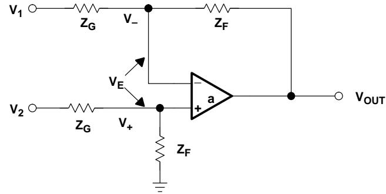
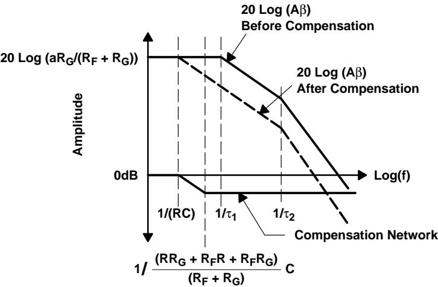
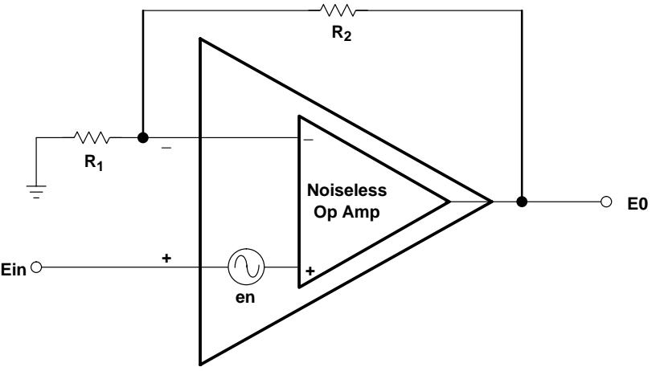
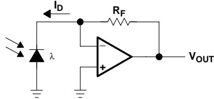
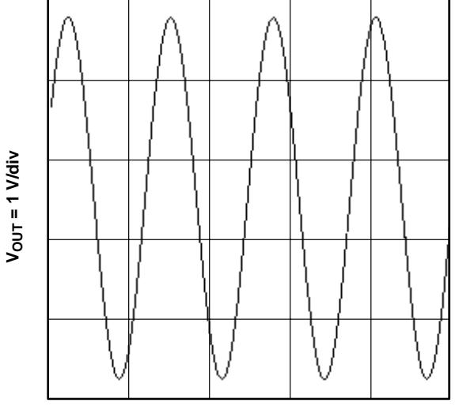
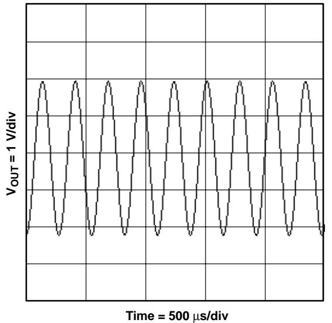
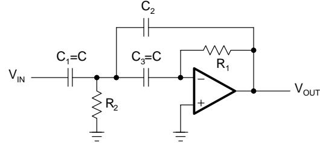
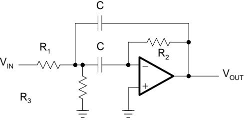
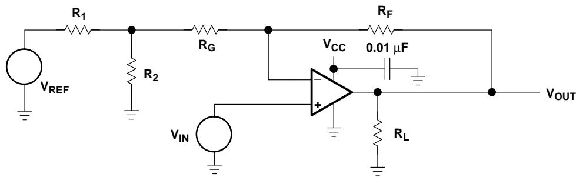
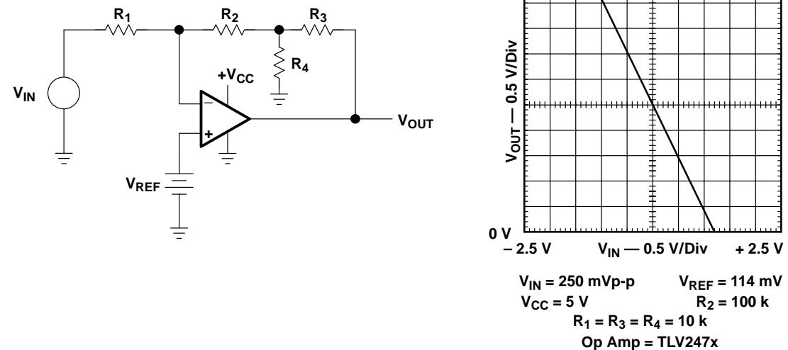

#### - -

 

**August 2002 Advanced Analog Products**

**SLOD006B**

#### **IMPORTANT NOTICE**

Texas Instruments Incorporated and its subsidiaries (TI) reserve the right to make corrections, modifications, enhancements, improvements, and other changes to its products and services at any time and to discontinue any product or service without notice. Customers should obtain the latest relevant information before placing orders and should verify that such information is current and complete. All products are sold subject to TI's terms and conditions of sale supplied at the time of order acknowledgment.

TI warrants performance of its hardware products to the specifications applicable at the time of sale in accordance with TI's standard warranty. Testing and other quality control techniques are used to the extent TI deems necessary to support this warranty. Except where mandated by government requirements, testing of all parameters of each product is not necessarily performed.

TI assumes no liability for applications assistance or customer product design. Customers are responsible for their products and applications using TI components. To minimize the risks associated with customer products and applications, customers should provide adequate design and operating safeguards.

TI does not warrant or represent that any license, either express or implied, is granted under any TI patent right, copyright, mask work right, or other TI intellectual property right relating to any combination, machine, or process in which TI products or services are used. Information published by TI regarding third party products or services does not constitute a license from TI to use such products or services or a warranty or endorsement thereof. Use of such information may require a license from a third party under the patents or other intellectual property of that third party, or a license from TI under the patents or other intellectual property of TI.

Reproduction of information in TI data books or data sheets is permissible only if reproduction is without alteration and is accompanied by all associated warranties, conditions, limitations, and notices. Reproduction of this information with alteration is an unfair and deceptive business practice. TI is not responsible or liable for such altered documentation.

Resale of TI products or services with statements different from or beyond the parameters stated by TI for that product or service voids all express and any implied warranties for the associated TI product or service and is an unfair and deceptive business practice. TI is not responsible or liable for any such statements.

Mailing Address:

Texas Instruments Post Office Box 655303 Dallas, Texas 75265

Copyright 2002, Texas Instruments Incorporated

# **Forward**

Everyone interested in analog electronics should find some value in this book, and an effort has been made to make the material understandable to the relative novice while not too boring for the practicing engineer. Special effort has been taken to ensure that each chapter can stand alone for the reader with the proper background. Of course, this causes redundancy that some people might find boring, but it's worth the price to enable the satisfaction of a diversified audience.

Start at Chapter 1 if you are a novice, and read through until completion of Chapter 9. After Chapter 9 is completed, the reader can jump to any chapter and be confident that they are prepared for the material. More experienced people such as electronic technicians, digital engineers, and non-electronic engineers can start at Chapter 3 and read through Chapter 9. Senior electronic technicians, electronic engineers, and fledgling analog engineers can start anywhere they feel comfortable and read through Chapter 9. Experienced analog engineers should jump to the subject that interests them. Analog gurus should send their additions, corrections, and complaints to me, and if they see something that looks familiar, they should feel complimented that others appreciate their contributions.

Chapter 1 is a history and story chapter. It is not required reading for anyone, but it defines the op amp's place in the world of analog electronics. Chapter 2 reviews some basic physics and develops the fundamental circuit equations that are used throughout the book. Similar equations have been developed in other books, but the presentation here emphasizes material required for speedy op amp design. The ideal op amp equations are developed in Chapter 3, and this chapter enables the reader to rapidly compute op amp transfer equations including ac response. The emphasis on single power supply systems forces the designer to bias circuits when the inputs are referenced to ground, and Chapter 4 gives a detailed procedure that quickly yields a working solution every time.

Op amps can't exist without feedback, and feedback has inherent stability problems, so feedback and stability are covered in Chapter 5. Chapters 6 and 7 develop the voltage feedback op amp equations, and they teach the concept of relative stability and compensation of potentially unstable op amps. Chapter 8 develops the current feedback op amp equations and discusses current feedback stability. Chapter 9 compares current feedback and voltage feedback op amps. The meat of this book is Chapters 12, 13, and 14 where the reader is shown how design the converter to transducer/actuator interface with the aid of op amps.

The remaining chapters give support material for Chapters 12, 13, and 14. Chapter 18 was a late addition. Portable applications are expanding rapidly and they emphasize the need for low-voltage/low-power design techniques. Chapter 18 defines some parameters in a new way so they lend themselves to low voltage design, and it takes the reader through several low voltage designs.

Thanks to editor James Karki for his contribution. We never gave him enough time to do detailed editing, so if you find errors or typos, direct them to my attention. Thanks to Ted Thomas, a marketing manager with courage enough to support a book, and big thanks for Alun Roberts who paid for this effort. Thomas Kugelstadt, applications manager, thanks for your support and help.

Also many thanks to the contributing authors, James Karki, Richard Palmer, Thomas Kugelstadt, Perry Miller, Bruce Carter, and Richard Cesari who gave generously of their time.

Regards,

Ron Mancini Chief Editor

# **Contents**

Contents

| 1 |                                                    | The Op Amp's Place In The World .                  | 1-1  |  |  |  |
|---|----------------------------------------------------|-------------------------------------------------------|------|--|--|--|
| 2 | Review of Circuit Theory .                      |                                                       |      |  |  |  |
|   | 2.1                                                | Introduction .                                     | 2-1  |  |  |  |
|   | 2.2                                                | Laws of Physics .                                  | 2-1  |  |  |  |
|   | 2.3                                                | Voltage Divider Rule .                             | 2-3  |  |  |  |
|   | 2.4                                                | Current Divider Rule .                             | 2-4  |  |  |  |
|   | 2.5                                                | Thevenin's Theorem .                               | 2-5  |  |  |  |
|   | 2.6                                                | Superposition .                                    | 2-8  |  |  |  |
|   | 2.7                                                | Calculation of a Saturated Transistor Circuit .    | 2-9  |  |  |  |
|   | 2.8                                                | Transistor Amplifier .                             | 2-10 |  |  |  |
| 3 |                                                    | Development of the Ideal Op Amp Equations . 3-1 |      |  |  |  |
|   | 3.1                                                | Ideal Op Amp Assumptions .                         | 3-1  |  |  |  |
|   | 3.2                                                | The Noninverting Op Amp .                          | 3-3  |  |  |  |
|   | 3.3                                                | The Inverting Op Amp .                             | 3-4  |  |  |  |
|   | 3.4                                                | The Adder . 3-5                                    |      |  |  |  |
|   | 3.5                                                | The Differential Amplifier .                       | 3-6  |  |  |  |
|   | 3.6                                                | Complex Feedback Networks .                        | 3-7  |  |  |  |
|   | 3.7                                                | Video Amplifiers .                                 | 3-9  |  |  |  |
|   | 3.8                                                | Capacitors . 3-9                                   |      |  |  |  |
|   | 3.9                                                | Summary . 3-11                                     |      |  |  |  |
| 4 | Single Supply Op Amp Design Techniques . 4-1 |                                                       |      |  |  |  |
|   | 4.1                                                | Single Supply versus Dual Supply .                 | 4-1  |  |  |  |
|   | 4.2                                                | Circuit Analysis .                                 | 4-3  |  |  |  |
|   | 4.3                                                | Simultaneous Equations .                           | 4-8  |  |  |  |
|   |                                                    | 4.3.1 Case 1: VOUT = +mVIN+b .                  | 4-9  |  |  |  |
|   |                                                    | 4.3.2 Case 2: VOUT = +mVIN – b .                | 4-13 |  |  |  |
|   |                                                    | 4.3.3 Case 3: VOUT = –mVIN + b .                | 4-16 |  |  |  |
|   |                                                    | 4.3.4 Case 4: VOUT = –mVIN – b .                | 4-19 |  |  |  |
|   | 4.4                                                | Summary . 4-22                                     |      |  |  |  |
| 5 |                                                    | Feedback and Stability Theory .                    | 5-1  |  |  |  |
|   | 5.1                                                | Why Study Feedback Theory? .                       | 5-1  |  |  |  |
|   | 5.2                                                | Block Diagram Math and Manipulations .             | 5-1  |  |  |  |
|   | 5.3                                                | Feedback Equation and Stability .                  | 5-6  |  |  |  |

#### Contents

|   | 5.4                                                  | Bode Analysis of Feedback Circuits .                          | 5-7  |  |
|---|------------------------------------------------------|------------------------------------------------------------------|------|--|
|   | 5.5                                                  | Loop Gain Plots are the Key to Understanding Stability .      | 5-12 |  |
|   | 5.6                                                  | The Second Order Equation and Ringing/Overshoot Predictions . | 5-15 |  |
|   | 5.7                                                  | References . 5-16                                             |      |  |
| 6 |                                                      | Development of the Non Ideal Op Amp Equations .               | 6-1  |  |
|   | 6.1                                                  | Introduction .                                                | 6-1  |  |
|   | 6.2                                                  | Review of the Canonical Equations .                           | 6-2  |  |
|   | 6.3                                                  | Noninverting Op Amps .                                        | 6-5  |  |
|   | 6.4                                                  | Inverting Op Amps .                                           | 6-6  |  |
|   | 6.5                                                  | Differential Op Amps .                                        | 6-8  |  |
| 7 |                                                      | Voltage-Feedback Op Amp Compensation .                        | 7-1  |  |
|   | 7.1                                                  | Introduction .                                                | 7-1  |  |
|   | 7.2                                                  | Internal Compensation .                                       | 7-2  |  |
|   | 7.3                                                  | External Compensation, Stability, and Performance .           | 7-8  |  |
|   | 7.4                                                  | Dominant-Pole Compensation .                                  | 7-9  |  |
|   | 7.5                                                  | Gain Compensation .                                           | 7-12 |  |
|   | 7.6                                                  | Lead Compensation .                                           | 7-13 |  |
|   | 7.7                                                  | Compensated Attenuator Applied to Op Amp .                    | 7-16 |  |
|   | 7.8                                                  | Lead-Lag Compensation .                                       | 7-18 |  |
|   | 7.9                                                  | Comparison of Compensation Schemes .                          | 7-20 |  |
|   | 7.10                                                 | Conclusions . 7-21                                            |      |  |
| 8 | Current-Feedback Op Amp Analysis .                |                                                                  |      |  |
|   | 8.1                                                  | Introduction .                                                | 8-1  |  |
|   | 8.2                                                  | CFA Model . 8-1                                               |      |  |
|   | 8.3                                                  | Development of the Stability Equation .                       | 8-2  |  |
|   | 8.4                                                  | The Noninverting CFA .                                        | 8-3  |  |
|   | 8.5                                                  | The Inverting CFA .                                           | 8-5  |  |
|   | 8.6                                                  | Stability Analysis .                                          | 8-7  |  |
|   | 8.7                                                  | Selection of the Feedback Resistor .                          | 8-9  |  |
|   | 8.8                                                  | Stability and Input Capacitance .                             | 8-11 |  |
|   | 8.9                                                  | Stability and Feedback Capacitance .                          | 8-12 |  |
|   | 8.10                                                 | Compensation of CF and CG .                                   | 8-13 |  |
|   | 8.11                                                 | Summary . 8-14                                                |      |  |
| 9 | Voltage- and Current-Feedback Op Amp Comparison . |                                                                  |      |  |
|   | 9.1                                                  | Introduction .                                                | 9-1  |  |
|   | 9.2                                                  | Precision . 9-2                                               |      |  |
|   | 9.3                                                  | Bandwidth . 9-3                                               |      |  |
|   | 9.4                                                  | Stability . 9-6                                               |      |  |
|   | 9.5                                                  | Impedance .                                                   | 9-7  |  |
|   | 9.6                                                  | Equation Comparison .                                         | 9-8  |  |

iv

| 10 | Op Amp Noise Theory and Applications . 10-1 |                                                                |       |
|----|---------------------------------------------------|----------------------------------------------------------------|-------|
|    | 10.1                                              | Introduction . 10-1                                         |       |
|    | 10.2                                              | Characterization .                                          | 10-1  |
|    |                                                   | 10.2.1 rms versus P-P Noise .                            | 10-1  |
|    |                                                   | 10.2.2 Noise Floor .                                     | 10-3  |
|    |                                                   | 10.2.3 Signal-to-Noise Ratio .                           | 10-3  |
|    |                                                   | 10.2.4 Multiple Noise Sources .                          | 10-3  |
|    |                                                   | 10.2.5 Noise Units .                                     | 10-4  |
|    | 10.3                                              | Types of Noise .                                            | 10-4  |
|    |                                                   | 10.3.1 Shot Noise .                                      | 10-5  |
|    |                                                   | 10.3.2 Thermal Noise .                                   | 10-7  |
|    |                                                   | 10.3.3 Flicker Noise .                                   | 10-8  |
|    |                                                   | 10.3.4 Burst Noise .                                     | 10-9  |
|    |                                                   | 10.3.5 Avalanche Noise .                                 | 10-9  |
|    | 10.4                                              | Noise Colors .                                              | 10-10 |
|    |                                                   | 10.4.1 White Noise .                                     | 10-11 |
|    |                                                   | 10.4.2 Pink Noise .                                      | 10-11 |
|    |                                                   | 10.4.3 Red/Brown Noise .                                 | 10-12 |
|    | 10.5                                              | Op Amp Noise .                                              | 10-12 |
|    |                                                   | 10.5.1 The Noise Corner Frequency and Total Noise .      | 10-12 |
|    |                                                   | 10.5.2 The Corner Frequency .                            | 10-13 |
|    |                                                   | 10.5.3 Op Amp Circuit Noise Model .                      | 10-14 |
|    |                                                   | 10.5.4 Inverting Op Amp Circuit Noise .                  | 10-16 |
|    |                                                   | 10.5.5 Noninverting Op Amp Circuit Noise .               | 10-17 |
|    |                                                   | 10.5.6 Differential Op Amp Circuit Noise .               | 10-18 |
|    |                                                   | 10.5.7 Summary .                                         | 10-18 |
|    | 10.6                                              | Putting It All Together .                                   | 10-19 |
|    | 10.7                                              | References .                                                | 10-23 |
| 11 |                                                   | Understanding Op Amp Parameters .                           | 11-1  |
|    | 11.1                                              | Introduction . 11-1                                         |       |
|    | 11.2                                              | Operational Amplifier Parameter Glossary .                  | 11-2  |
|    | 11.3                                              | Additional Parameter Information .                          | 11-8  |
|    |                                                   | 11.3.1 Input Offset Voltage .                            | 11-8  |
|    |                                                   | 11.3.2 Input Current .                                   | 11-10 |
|    |                                                   | 11.3.3 Input Common Mode Voltage Range .                 | 11-11 |
|    |                                                   | 11.3.4 Differential Input Voltage Range .                | 11-11 |
|    |                                                   | 11.3.5 Maximum Output Voltage Swing .                    | 11-12 |
|    |                                                   | 11.3.6 Large Signal Differential Voltage Amplification . | 11-13 |
|    |                                                   | 11.3.7 Input Parasitic Elements .                        | 11-13 |
|    |                                                   | 11.3.8 Output Impedance .                                | 11-14 |
|    |                                                   | 11.3.9 Common-Mode Rejection Ratio .                     | 11-15 |
|    |                                                   | 11.3.10 Supply Voltage Rejection Ratio .                    | 11-15 |
|    |                                                   | 11.3.11 Supply Current .                                    | 11-16 |

Contents v

|    |            | 11.3.12 Slew Rate at Unity Gain .                                 | 11-16 |
|----|------------|----------------------------------------------------------------------|-------|
|    |            | 11.3.13 Equivalent Input Noise .                                  | 11-17 |
|    |            | 11.3.14 Total Harmonic Distortion Plus Noise .                    | 11-18 |
|    |            | 11.3.15 Unity Gain Bandwidth and Phase Margin .                   | 11-19 |
|    |            | 11.3.16 Settling Time .                                           | 11-22 |
| 12 |            | Instrumentation: Sensors to A/D Converters .                      | 12-1  |
|    | 12.1       | Introduction . 12-1                                               |       |
|    | 12.2       | Transducer Types .                                                | 12-6  |
|    | 12.3       | Design Procedure .                                                | 12-11 |
|    | 12.4       | Review of the System Specifications .                             | 12-12 |
|    | 12.5       | Reference Voltage Characterization .                              | 12-12 |
|    | 12.6       | Transducer Characterization .                                     | 12-13 |
|    | 12.7       | ADC Characterization .                                            | 12-15 |
|    | 12.8       | Op Amp Selection .                                                | 12-15 |
|    | 12.9       | Amplifier Circuit Design .                                        | 12-16 |
|    | 12.10 Test | . 12-23                                                              |       |
|    |            | 12.11 Summary .                                                   | 12-23 |
|    |            | 12.12 References .                                                | 12-23 |
|    |            |                                                                      |       |
| 13 |            | Wireless Communication: Signal Conditioning for IF Sampling .     | 13-1  |
|    | 13.1       | Introduction . 13-1                                               |       |
|    | 13.2       | Wireless Systems .                                                | 13-1  |
|    | 13.3       | Selection of ADCs/DACs .                                          | 13-6  |
|    | 13.4       | Factors Influencing the Choice of Op Amps .                       | 13-10 |
|    | 13.5       | Anti-Aliasing Filters .                                           | 13-11 |
|    | 13.6       | Communication D/A Converter Reconstruction Filter .               | 13-13 |
|    | 13.7       | External Vref Circuits for ADCs/DACs .                            | 13-15 |
|    | 13.8       | High-Speed Analog Input Drive Circuits .                          | 13-18 |
|    | 13.9       | References .                                                      | 13-22 |
| 14 |            | Interfacing D/A Converters to Loads .                             | 14-1  |
|    | 14.1       | Introduction . 14-1                                               |       |
|    | 14.2       | Load Characteristics .                                            | 14-1  |
|    |            | 14.2.1 DC Loads .                                              | 14-1  |
|    |            | 14.2.2 AC Loads .                                              | 14-2  |
|    | 14.3       | Understanding the D/A Converter and its Specifications .          | 14-2  |
|    |            | 14.3.1 Types of D/A Converters — Understanding the Tradeoffs . | 14-2  |
|    |            | 14.3.2 The Resistor Ladder D/A Converter .                     | 14-2  |
|    |            | 14.3.3 The Weighted Resistor D/A Converter .                   | 14-3  |
|    |            | 14.3.4 The R/2R D/A Converter .                                | 14-4  |
|    |            | 14.3.5 The Sigma Delta D/A Converter .                         | 14-5  |
|    | 14.4       | D/A Converter Error Budget .                                      | 14-6  |
|    |            | 14.4.1 Accuracy versus Resolution .                            | 14-7  |
|    |            | 14.4.2 DC Application Error Budget .                           | 14-7  |
|    |            |                                                                      |       |

|    |      | 14.4.3                              | AC Application Error Budget .                            | 14-8  |
|----|------|-------------------------------------|-------------------------------------------------------------|-------|
|    |      | 14.4.4                              | . 14-10                                                  |       |
|    | 14.5 | D/A Converter Errors and Parameters | . 14-10                                                  |       |
|    |      | 14.5.1                              | DC Errors and Parameters .                               | 14-10 |
|    |      | 14.5.2                              | AC Application Errors and Parameters .                   | 14-14 |
|    | 14.6 |                                     | Compensating For DAC Capacitance .                       | 14-18 |
|    | 14.7 |                                     | Increasing Op Amp Buffer Amplifier Current and Voltage . | 14-19 |
|    |      | 14.7.1                              | Current Boosters .                                       | 14-20 |
|    |      | 14.7.2                              | Voltage Boosters .                                       | 14-20 |
|    |      | 14.7.3                              | Power Boosters .                                         | 14-22 |
|    |      | 14.7.4                              | Single-Supply Operation and DC Offsets .                 | 14-22 |
| 15 |      |                                     | Sine Wave Oscillators .                                  | 15-1  |
|    | 15.1 |                                     | What is a Sine Wave Oscillator? .                        | 15-1  |
|    | 15.2 |                                     | Requirements for Oscillation .                           | 15-1  |
|    | 15.3 |                                     | Phase Shift in the Oscillator .                          | 15-3  |
|    | 15.4 |                                     | Gain in the Oscillator .                                 | 15-4  |
|    | 15.5 |                                     | Active Element (Op Amp) Impact on the Oscillator .       | 15-5  |
|    | 15.6 |                                     | Analysis of the Oscillator Operation (Circuit) .         | 15-7  |
|    | 15.7 |                                     | Sine Wave Oscillator Circuits .                          | 15-9  |
|    |      | 15.7.1                              | Wien Bridge Oscillator .                                 | 15-9  |
|    |      | 15.7.2                              | Phase Shift Oscillator, Single Amplifier .               | 15-14 |
|    |      | 15.7.3                              | Phase Shift Oscillator, Buffered .                       | 15-15 |
|    |      | 15.7.4                              | Bubba Oscillator .                                       | 15-17 |
|    |      | 15.7.5                              | Quadrature Oscillator .                                  | 15-18 |
|    |      | 15.7.6                              | Conclusion .                                             | 15-20 |
|    | 15.8 | References                          | .                                                           | 15-21 |
|    |      |                                     |                                                             |       |
| 16 |      |                                     | Active Filter Design Techniques .                        | 16-1  |
|    | 16.1 | Introduction                        | . 16-1                                                      |       |
|    | 16.2 |                                     | Fundamentals of Low-Pass Filters .                       | 16-2  |
|    |      | 16.2.1                              | Butterworth Low-Pass FIlters .                           | 16-6  |
|    |      | 16.2.2                              | Tschebyscheff Low-Pass Filters .                         | 16-7  |
|    |      | 16.2.3                              | Bessel Low-Pass Filters .                                | 16-7  |
|    |      | 16.2.4                              | Quality Factor Q .                                       | 16-9  |
|    |      | 16.2.5                              | Summary .                                                | 16-10 |
|    | 16.3 |                                     | Low-Pass Filter Design .                                 | 16-11 |
|    |      | 16.3.1                              | First-Order Low-Pass Filter .                            | 16-12 |
|    |      | 16.3.2                              | Second-Order Low-Pass Filter .                           | 16-14 |
|    |      | 16.3.3                              | Higher-Order Low-Pass Filters .                          | 16-19 |
|    | 16.4 |                                     | High-Pass Filter Design .                                | 16-21 |
|    |      | 16.4.1                              | First-Order High-Pass Filter .                           | 16-23 |
|    |      | 16.4.2                              | Second-Order High-Pass Filter .                          | 16-24 |
|    |      | 16.4.3                              | Higher-Order High-Pass Filter .                          | 16-26 |

Contents vii

#### Contents

|    | 16.5 |                     | Band-Pass Filter Design .                                  | 16-27        |
|----|------|---------------------|---------------------------------------------------------------|--------------|
|    |      | 16.5.1              | Second-Order Band-Pass Filter .                            | 16-29        |
|    |      | 16.5.2              | Fourth-Order Band-Pass Filter (Staggered Tuning) .         | 16-32        |
|    | 16.6 |                     | Band-Rejection Filter Design .                             | 16-36        |
|    |      | 16.6.1              | Active Twin-T Filter .                                     | 16-37        |
|    |      | 16.6.2              | Active Wien-Robinson Filter .                              | 16-39        |
|    | 16.7 |                     | All-Pass Filter Design .                                   | 16-41        |
|    |      | 16.7.1              | First-Order All-Pass Filter .                              | 16-44        |
|    |      | 16.7.2              | Second-Order All-Pass Filter .                             | 16-44        |
|    |      | 16.7.3              | Higher-Order All-Pass Filter .                             | 16-45        |
|    | 16.8 |                     | Practical Design Hints .                                   | 16-47        |
|    |      | 16.8.1              | Filter Circuit Biasing .                                   | 16-47        |
|    |      | 16.8.2              | Capacitor Selection .                                      | 16-50        |
|    |      | 16.8.3              | Component Values .                                         | 16-52        |
|    |      | 16.8.4              | Op Amp Selection .                                         | 16-53        |
|    | 16.9 |                     | Filter Coefficient Tables .                                | 16-55        |
|    |      | 16.10 References    | .                                                             | 16-63        |
|    |      |                     |                                                               |              |
| 17 |      |                     | Circuit Board Layout Techniques .                          | 17-1         |
|    | 17.1 |                     | General Considerations .                                   | 17-1         |
|    |      | 17.1.1              | The PCB is a Component of the Op Amp Design .              | 17-1         |
|    |      | 17.1.2              | Prototype, Prototype, PROTOTYPE! .                         | 17-1         |
|    |      | 17.1.3              | Noise Sources .                                            | 17-2         |
|    | 17.2 |                     | PCB Mechanical Construction .                              | 17-3         |
|    |      | 17.2.1              | Materials — Choosing the Right One for the Application .   | 17-3         |
|    |      | 17.2.2              | How Many Layers are Best? .                                | 17-4         |
|    | 17.3 | 17.2.3 Grounding | Board Stack-Up — The Order of Layers . .                | 17-6 17-7 |
|    |      | 17.3.1              | The Most Important Rule: Keep Grounds Separate .           | 17-7         |
|    |      | 17.3.2              | Other Ground Rules .                                       | 17-7         |
|    |      | 17.3.3              | A Good Example .                                           | 17-9         |
|    |      | 17.3.4              | A Notable Exception .                                      | 17-10        |
|    | 17.4 |                     | The Frequency Characteristics of Passive Components .      | 17-11        |
|    |      | 17.4.1              | Resistors .                                                | 17-11        |
|    |      | 17.4.2              | Capacitors .                                               | 17-12        |
|    |      | 17.4.3              | Inductors .                                                | 17-13        |
|    |      | 17.4.4              | Unexpected PCB Passive Components .                        | 17-14        |
|    | 17.5 | Decoupling          | .                                                             | 17-20        |
|    |      | 17.5.1              | Digital Circuitry — A Major Problem for Analog Circuitry . | 17-20        |
|    |      | 17.5.2              | Choosing the Right Capacitor .                             | 17-21        |
|    |      | 17.5.3              | Decoupling at the IC Level .                               | 17-22        |
|    |      | 17.5.4              | Decoupling at the Board Level .                            | 17-23        |
|    | 17.6 |                     | Input and Output Isolation .                               | 17-23        |
|    |      |                     |                                                               |              |
|    | 17.7 | Packages            | .                                                             | 17-24        |

|    |      | 17.7.1           | Through-Hole Considerations .                                                 | 17-26        |
|----|------|------------------|----------------------------------------------------------------------------------|--------------|
|    |      | 17.7.2           | Surface Mount .                                                               | 17-27        |
|    |      | 17.7.3           | Unused Sections .                                                             | 17-27        |
|    | 17.8 | Summary          | .                                                                                | 17-28        |
|    |      | 17.8.1           | General .                                                                     | 17-28        |
|    |      | 17.8.2           | Board Structure .                                                             | 17-28        |
|    |      | 17.8.3           | Components .                                                                  | 17-28        |
|    |      | 17.8.4           | Routing .                                                                     | 17-29        |
|    |      | 17.8.5           | Bypass .                                                                      | 17-29        |
|    | 17.9 | References       | .                                                                                | 17-29        |
| 18 |      |                  | Designing Low-Voltage Op Amp Circuits .                                       | 18-1         |
|    | 18.1 | Introduction     | . 18-1                                                                           |              |
|    | 18.2 |                  | Dynamic Range .                                                               | 18-3         |
|    | 18.3 |                  | Signal-to-Noise Ratio .                                                       | 18-5         |
|    | 18.4 |                  | Input Common-Mode Range .                                                     | 18-6         |
|    | 18.5 |                  | Output Voltage Swing .                                                        | 18-11        |
|    | 18.6 |                  | Shutdown and Low Current Drain .                                              | 18-12        |
|    | 18.7 |                  | Single-Supply Circuit Design .                                                | 18-13        |
|    | 18.8 |                  | Transducer to ADC Analog Interface .                                          | 18-13        |
|    | 18.9 |                  | DAC to Actuator Analog Interface .                                            | 18-16        |
|    |      |                  | 18.10 Comparison of Op Amps .                                                 | 18-20        |
|    |      | 18.11 Summary    | .                                                                                | 18-22        |
|    |      |                  |                                                                                  |              |
| A  |      |                  | Single-Supply Circuit Collection .                                            | A-1          |
|    | A.1  | Introduction     | .                                                                                | A-1          |
|    | A.2  |                  | Boundary Conditions .                                                         | A-4          |
|    | A.3  | Amplifiers       | . A-5                                                                            |              |
|    |      | A.3.1            | Inverting Op Amp with Noninverting Positive Reference .                       | A-5          |
|    |      | A.3.2            | Inverting Op Amp with Inverting Negative Reference .                          | A-6          |
|    |      | A.3.3            | Inverting Op Amp with Noninverting Negative Reference .                       | A-7          |
|    |      | A.3.4            | Inverting Op Amp with Inverting Positive Reference .                          | A-8          |
|    |      | A.3.5            | Noninverting Op Amp with Inverting Positive Reference .                       | A-9          |
|    |      | A.3.6            | Noninverting Op Amp with Noninverting Negative Reference                         | . A-10    |
|    |      | A.3.7            | Noninverting Op Amp with Inverting Negative Reference .                       | A-11         |
|    |      | A.3.8            | Noninverting Op Amp with Noninverting Positive Reference .                    | A-12         |
|    |      | A.3.9            | Differential Amplifier .                                                      | A-13         |
|    |      | A.3.10           | Differential Amplifier With Bias Correction .                                 | A-14         |
|    |      | A.3.11           | High Input Impedance Differential Amplifier .                                 | A-15         |
|    |      | A.3.12           | High Common-Mode Range Differential Amplifier .                               | A-16         |
|    |      | A.3.13           | High-Precision Differential Amplifier .                                       | A-17         |
|    |      | A.3.14           | Simplified High-Precision Differential Amplifier .                            | A-18         |
|    |      | A.3.15 A.3.16 | Variable Gain Differential Amplifier . T Network in the Feedback Loop . | A-19 A-20 |

Contents ix

#### Contents

|   |     | A.3.17      | Buffer . A-21                                               |
|---|-----|-------------|-------------------------------------------------------------------|
|   |     | A.3.18      | Inverting AC Amplifier . A-22                               |
|   |     | A.3.19      | Noninverting AC Amplifier . A-23                            |
|   | A.4 |             | Computing Circuits . A-24                                   |
|   |     | A.4.1       | Inverting Summer . A-24                                     |
|   |     | A.4.2       | Noninverting Summer . A-25                                  |
|   |     | A.4.3       | Noninverting Summer with Buffers . A-26                     |
|   |     | A.4.4       | Inverting Integrator . A-27                                 |
|   |     | A.4.5       | Inverting Integrator with Input Current Compensation . A-28 |
|   |     | A.4.6       | Inverting Integrator with Drift Compensation . A-29         |
|   |     | A.4.7       | Inverting Integrator with Mechanical Reset . A-30           |
|   |     | A.4.8       | Inverting Integrator with Electronic Reset . A-31           |
|   |     | A.4.9       | Inverting Integrator with Resistive Reset . A-32            |
|   |     | A.4.10      | Noninverting Integrator with Inverting Buffer . A-33        |
|   |     | A.4.11      | Noninverting Integrator Approximation . A-34                |
|   |     | A.4.12      | Inverting Differentiator . A-35                             |
|   |     | A.4.13      | Inverting Differentiator with Noise Filter . A-36           |
|   | A.5 | Oscillators | . A-37                                                         |
|   |     | A.5.1       | Basic Wien Bridge Oscillator . A-37                         |
|   |     | A.5.2       | Wien Bridge Oscillator with Nonlinear Feedback . A-38       |
|   |     | A.5.3       | Wien Bridge Oscillator with AGC . A-39                      |
|   |     | A.5.4       | Quadrature Oscillator . A-40                                |
|   |     | A.5.5       | Classical Phase Shift Oscillator . A-41                     |
|   |     | A.5.6       | Buffered Phase Shift Oscillator . A-42                      |
|   |     | A.5.7       | Bubba Oscillator . A-43                                     |
|   |     | A.5.8       | Triangle Oscillator . A-44                                  |
| B |     |             | Single-Supply Op Amp Selection Guide . B-1                  |

x

Figures

| 2–1  | Ohm's Law Applied to the Total Circuit . 2-2                   |
|------|----------------------------------------------------------------------|
| 2–2  | Ohm's Law Applied to a Component . 2-2                         |
| 2–3  | Kirchoff's Voltage Law . 2-2                                   |
| 2–4  | Kirchoff's Current Law . 2-3                                   |
| 2–5  | Voltage Divider Rule . 2-3                                     |
| 2–6  | Current Divider Rule . 2-4                                     |
| 2–7  | Original Circuit . 2-5                                         |
| 2–8  | Thevenin's Equivalent Circuit for Figure 2–7 . 2-5             |
| 2–9  | Example of Thevenin's Equivalent Circuit . 2-6                 |
| 2–10 | Analysis Done the Hard Way . 2-7                               |
| 2–11 | Superposition Example . 2-8                                    |
| 2–12 | When V1 is Grounded . 2-8                                      |
| 2–13 | When V2 is Grounded . 2-8                                      |
| 2–14 | Saturated Transistor Circuit . 2-9                             |
| 2–15 | Transistor Amplifier . 2-10                                    |
| 2–16 | Thevenin Equivalent of the Base Circuit . 2-11                 |
| 3–1  | The Ideal Op Amp . 3-2                                         |
| 3–2  | The Noninverting Op Amp . 3-3                                  |
| 3–3  | The Inverting Op Amp . 3-4                                     |
| 3–4  | The Adder Circuit . 3-5                                        |
| 3–5  | The Differential Amplifier . 3-6                               |
| 3–6  | Differential Amplifier With Common-Mode Input Signal . 3-7     |
| 3–7  | T Network in Feedback Loop . 3-7                               |
| 3–8  | Thevenin's Theorem Applied to T Network . 3-8                  |
| 3–9  | Video Amplifier . 3-9                                             |
| 3–10 | Low-Pass Filter . 3-10                                         |
| 3–11 | High-Pass Filter . 3-10                                        |
| 4–1  | Split-Supply Op Amp Circuit . 4-1                              |
| 4–2  | Split-Supply Op Amp Circuit With Reference Voltage Input . 4-2 |
| 4–3  | Split-Supply Op Amp Circuit With Common-Mode Voltage . 4-2     |
| 4–4  | Single-Supply Op Amp Circuit . 4-3                             |
| 4–5  | Inverting Op Amp . 4-4                                         |
| 4–6  | Inverting Op Amp With VCC Bias . 4-5                           |
| 4–7  | Transfer Curve for Inverting Op Amp With VCC Bias . 4-5        |
| 4–8  | Noninverting Op Amp . 4-7                                      |

Contents xi

| 4–9 4–10 | Transfer Curve for Noninverting Op Amp . Schematic for Case1: VOUT = +mVIN + b . | 4-7 4-9 |
|-------------|-------------------------------------------------------------------------------------------|------------|
| 4–11        | Case 1 Example Circuit .                                                               | 4-12       |
|             |                                                                                           |            |
| 4–12        | Case 1 Example Circuit Measured Transfer Curve .                                       | 4-12       |
| 4–13        | Schematic for Case 2: VOUT = +mVIN – b .                                               | 4-13       |
| 4–14        | Case 2 Example Circuit .                                                               | 4-15       |
| 4–15        | Case 2 Example Circuit Measured Transfer Curve .                                       | 4-15       |
| 4–16        | Schematic for Case 3: VOUT = –mVIN + b .                                               | 4-16       |
| 4–17        | Case 3 Example Circuit .                                                               | 4-17       |
| 4–18        | Case 3 Example Circuit Measured Transfer Curve .                                       | 4-18       |
| 4–19        | Schematic for Case 4: VOUT = –mVIN – b .                                               | 4-19       |
| 4–20        | Case 4 Example Circuit .                                                               | 4-20       |
| 4–21        | Case 4 Example Circuit Measured Transfer Curve .                                       | 4-21       |
| 5–1         | Definition of Blocks .                                                                 | 5-2        |
| 5–2         | Summary Points .                                                                       | 5-3        |
| 5–3         | Definition of Control System Terms .                                                   | 5-3        |
| 5–4         | Definition of an Electronic Feedback Circuit .                                         | 5-3        |
| 5–5         | Multiloop Feedback System .                                                            | 5-4        |
| 5–6         | Block Diagram Transforms .                                                             | 5-5        |
| 5–7         | Comparison of Control and Electronic Canonical Feedback Systems .                      | 5-6        |
| 5–8         | Low-Pass Filter . 5-8                                                                  |            |
| 5–9         | Bode Plot of Low-Pass Filter Transfer Function .                                       | 5-9        |
| 5–10        | Band Reject Filter .                                                                   | 5-9        |
| 5–11        | Individual Pole Zero Plot of Band Reject Filter .                                      | 5-10       |
|             |                                                                                           |            |
| 5–12        | Combined Pole Zero Plot of Band Reject Filter .                                        | 5-10       |
| 5–13        | When No Pole Exists in Equation (5–12) .                                               | 5-11       |
| 5–14        | When Equation 5–12 has a Single Pole .                                                 | 5-11       |
| 5–15        | Magnitude and Phase Plot of Equation 5–14 .                                            | 5-13       |
| 5–16        | Magnitude and Phase Plot of the Loop Gain Increased to (K+C) .                         | 5-14       |
| 5–17        | Magnitude and Phase Plot of the Loop Gain With Pole Spacing Reduced .                  | 5-14       |
| 5–18        | Phase Margin and Overshoot vs Damping Ratio .                                          | 5-16       |
| 6–1         | Feedback System Block Diagram .                                                        | 6-2        |
| 6–2         | Feedback Loop Broken to Calculate Loop Gain .                                          | 6-4        |
| 6–3         | Noninverting Op Amp .                                                                  | 6-5        |
| 6–4         | Open Loop Noninverting Op Amp .                                                        | 6-6        |
| 6–5         | Inverting Op Amp .                                                                     | 6-6        |
| 6–6         | Inverting Op Amp: Feedback Loop Broken for Loop Gain Calculation .                     | 6-7        |
| 6–7         | Differential Amplifier Circuit .                                                       | 6-8        |
| 7–1         | Miller Effect Compensation .                                                           | 7-2        |
| 7–2         | TL03X Frequency and Time Response Plots .                                              | 7-3        |
| 7–3         | Phase Margin and Percent Overshoot Versus Damping Ratio .                              | 7-4        |
| 7–4         | TL07X Frequency and Time Response Plots .                                              | 7-5        |
|             |                                                                                           |            |

| 7–5   | TL08X Frequency and Time Response Plots .                               | 7-6      |
|-------|----------------------------------------------------------------------------|----------|
| 7–6   | TLV277X Frequency Response Plots .                                      | 7-7      |
| 7–7   | TLV227X Time Response Plots .                                           | 7-7      |
| 7–8   | Capacitively-Loaded Op Amp .                                            | 7-9      |
| 7–9   | Capacitively-Loaded Op Amp With Loop Broken for Loop Gain (Aβ) Calculation | . 7-9 |
| 7–10  | Possible Bode Plot of the Op Amp Described in Equation 7–7 .            | 7-11     |
| 7–11  | Dominant-Pole Compensation Plot .                                       | 7-11     |
| 7–12  | Gain Compensation .                                                     | 7-12     |
| 7–13  | Lead-Compensation Circuit .                                             | 7-13     |
| 7–14  | Lead-Compensation Bode Plot .                                           | 7-14     |
| 7–15  | Inverting Op Amp With Lead Compensation .                               | 7-15     |
| 7–16  | Noninverting Op Amp With Lead Compensation .                            | 7-16     |
| 7–17  | Op Amp With Stray Capacitance on the Inverting Input .                  | 7-16     |
| 7–18  | Compensated Attenuator Circuit .                                        | 7-17     |
| 7–19  | Compensated Attenuator Bode Plot .                                      | 7-18     |
| 7–20  | Lead-Lag Compensated Op Amp .                                           | 7-19     |
| 7–21  | Bode Plot of Lead-Lag Compensated Op Amp .                              | 7-19     |
| 7–22  | Closed-Loop Plot of Lead-Lag Compensated Op Amp .                       | 7-20     |
| 8–1   | Current-Feedback Amplifier Model .                                      | 8-2      |
| 8–2   | Stability Analysis Circuit .                                            | 8-2      |
| 8–3   | Stability Analysis Circuit .                                            | 8-3      |
| 8–4   | Noninverting CFA .                                                      | 8-4      |
| 8–5   | Inverting CFA . 8-5                                                     |          |
| 8–6   | Bode Plot of Stability Equation .                                       | 8-7      |
| 8–7   | Plot of CFA RF, G, and BW .                                             | 8-10     |
| 8–8   | Effects of Stray Capacitance on CFAs .                                  | 8-12     |
| 8–9   | Bode Plot with CF .                                                     | 8-13     |
| 9–1   | Long-Tailed Pair . 9-2                                                  |          |
| 9–2   | Ideal CFA . 9-3                                                         |          |
| 9–3   | VFA Gain versus Frequency .                                             | 9-4      |
| 9–4   | CFA Gain vs Frequency .                                                 | 9-5      |
|       |                                                                            |          |
| 10–1  | Gaussian Distribution of Noise Energy .                                 | 10-2     |
| 10–2  | Shot Noise Generation .                                                 | 10-5     |
| 10–3  | Thermal Noise . 10-7                                                    |          |
| 10–4  | Avalanche Noise .                                                       | 10-10    |
| 10–5  | Noise Colors . 10-11                                                    |          |
| 10–6  | TLV2772 Op Amp Noise Characteristics .                                  | 10-13    |
| 10–7  | Op Amp Circuit Noise Model .                                            | 10-15    |
| 10–8  | Equivalent Op Amp Circuit Noise Model .                                 | 10-15    |
| 10–9  | Inverting Op Amp Circuit Noise Model .                                  | 10-16    |
| 10–10 | Inverting Equivalent Op Amp Circuit Noise Model .                       | 10-16    |
| 10–11 | Noninverting Equivalent Op Amp Circuit Noise Model .                    | 10-17    |

Contents xiii

| 10–12 10–13 10–14 10–15 10–16                                                                         | Differential Equivalent Op Amp Circuit Noise Model . Split Supply Op Amp Circuit . TLC2201 Op Amp Noise Performance . TLC2201 Op Amp Circuit . Improved TLC2201 Op Amp Circuit .                                                                                                                                                                                                                                                                                                                                                                                                   | 10-18 10-19 10-20 10-21 10-23                                                               |
|-------------------------------------------------------------------------------------------------------------------|---------------------------------------------------------------------------------------------------------------------------------------------------------------------------------------------------------------------------------------------------------------------------------------------------------------------------------------------------------------------------------------------------------------------------------------------------------------------------------------------------------------------------------------------------------------------------------------------------------------|---------------------------------------------------------------------------------------------------------|
| 11–1 11–2 11–3 11–4 11–5 11–6 11–7 11–8 11–9 11–10                                     | Test Circuits for Input Offset Voltage . Offset Voltage Adjust . Test Circuit – IIB . VOM± . 11-12 Input Parasitic Elements . Effect of Output Impedance . Figure 6. Slew Rate . Figure 7. Simplified Op Amp Schematic . Typical Op amp Input Noise Spectrum . Output Spectrum with THD + N = 1% .                                                                                                                                                                                                                                                   | 11-9 11-9 11-10 11-13 11-14 11-16 11-17 11-18 11-19                             |
| 11–11 11–12                                                                                                    | Voltage Amplification and Phase Shift vs. Frequency . Settling Time . 11-22                                                                                                                                                                                                                                                                                                                                                                                                                                                                                                                          | 11-21                                                                                                   |
| 12–1 12–2 12–3 12–4 12–5 12–6 12–7 12–8 12–9 12–10 12–11 12–12 12–13 12–14 | Block Diagram of a Transducer Measurement System . Significant Bits versus Binary Bits . Example of Spans That Require Correction . Voltage Divider Circuit for a Resistive Transducer . Current Source Excitation for a Resistive Transducer . Precision Current Source . Wheatstone Bridge Circuit . Photodiode Amplifier . Phototransistor Amplifier . Photovoltaic Cell Amplifier . Active Full-Wave Rectifier and Filter . Reference and Transducer Bias Circuit . AIA Circuit . 12-17 Final Analog Interface Circuit . | 12-1 12-2 12-4 12-6 12-7 12-7 12-8 12-8 12-9 12-9 12-10 12-13 12-21 |
| 13–1 13–2 13–3 13–4 13–5 13–6 13–7 13–8                                                      | A Typical GSM Cellular Base Station Receiver Block Diagram . An Implementation of a Software-Configurable Dual-IF Receiver . Basic W-CDMA Cellular Base Station Transmitter Block . Communication DAC with Interpolation and Reconstruction Filters . QPSK Power Spectral Density Without Raised Cosine Filter — W-CDMA . Reconstruction Filter Characteristics . A Single-Pole Reconstruction Filter . Voltage Reference Filter Circuit .                                                                                                                       | 13-2 13-4 13-5 13-5 13-14 13-14 13-15 13-16                                        |
| 13–9 13–10 13–11                                                                                            | Voltage Follower Frequency Response Plot . External Voltage Reference Circuit for ADC/DAC. . Single-Ended to Differential Output Drive Circuit .                                                                                                                                                                                                                                                                                                                                                                                                                                               | 13-17 13-17 13-18                                                                                 |

| 13–12 | Differential Amplifier Closed-Loop Response .                            | 13-19 |
|-------|-----------------------------------------------------------------------------|-------|
| 13–13 | ADC Single-Ended Input Drive Circuit .                                   | 13-20 |
| 13–14 | Gain vs Frequency Plot for THS3201 .                                     | 13-21 |
| 13–15 | Phase vs Frequency for THS3201 .                                         | 13-21 |
|       |                                                                             |       |
| 14–1  | Resistor Ladder D/A Converter .                                          | 14-2  |
| 14–2  | Binary Weighted D/A Converter .                                          | 14-3  |
| 14–3  | R/2R Resistor Array .                                                    | 14-4  |
| 14–4  | R/2R D/A Converter .                                                     | 14-5  |
| 14–5  | Sigma Delta D/A Converter .                                              | 14-6  |
| 14–6  | Total Harmonic Distortion .                                              | 14-9  |
| 14–7  | D/A Offset Error .                                                       | 14-11 |
| 14–8  | D/A Gain Error .                                                         | 14-12 |
| 14–9  | Differential Nonlinearity Error .                                        | 14-13 |
| 14–10 | Integral Nonlinearity Error .                                            | 14-13 |
| 14–11 | Spurious Free Dynamic Range .                                            | 14-15 |
| 14–12 | Intermodulation Distortion .                                             | 14-16 |
| 14–13 | D/A Settling Time .                                                      | 14-17 |
| 14–14 | D/A Deglitch Circuit .                                                   | 14-17 |
| 14–15 | Compensating for CMOS DAC Output Capacitance .                           | 14-18 |
| 14–16 | D/A Output Current Booster .                                             | 14-20 |
| 14–17 | Incorrect Method of Increasing Voltage Swing of D/A Converters .         | 14-21 |
| 14–18 | Correct Method of Increasing Voltage Range .                             | 14-22 |
| 14–19 | Single-Supply DAC Operation .                                            | 14-23 |
|       |                                                                             |       |
| 15–1  | Canonical Form of a Feedback System with Positive or Negative Feedback . | 15-2  |
| 15–2  | Phase Plot of RC Sections .                                              | 15-3  |
| 15–3  | Op Amp Frequency Response .                                              | 15-6  |
| 15–4  | Op Amp Bandwidth and Oscillator Output .                                 | 15-7  |
| 15–5  | Block Diagram of an Oscillator with Positive Feedback .                  | 15-8  |
| 15–6  | Amplifier with Positive and Negative Feedback .                          | 15-8  |
| 15–7  | Wien Bridge Circuit Schematic .                                          | 15-9  |
| 15–8  | Final Wien Bridge Oscillator Circuit .                                   | 15-11 |
| 15–9  | Wien Bridge Output Waveforms .                                           | 15-11 |
| 15–10 | Wien Bridge Oscillator with Nonlinear Feedback .                         | 15-12 |
| 15–11 | Output of the Circuit in Figure 15–10 .                                  | 15-12 |
| 15–12 | Wien Bridge Oscillator with AGC .                                        | 15-13 |
| 15–13 | Output of the Circuit in Figure 15–12 .                                  | 15-14 |
| 15–14 | Phase Shift Oscillator (Single Op Amp) .                                 | 15-14 |
| 15–15 | Output of the Circuit in Figure 15–14 .                                  | 15-15 |
| 15–16 | Phase Shift Oscillator, Buffered .                                       | 15-16 |
| 15–17 | Output of the Circuit Figure 15–16 .                                     | 15-16 |
| 15–18 | Bubba Oscillator .                                                       | 15-17 |
| 15–19 | Output of the Circuit in Figure 15–18. .                                 | 15-18 |

Contents xv

| 15–20 15–21 | Quadrature Oscillator . Output of the Circuit in Figure 15–20 .            | 15-19 15-20 |
|----------------|-------------------------------------------------------------------------------------|----------------|
| 16–1           | Second-Order Passive Low-Pass and Second-Order Active Low-Pass .                 | 16-1           |
| 16–2           | First-Order Passive RC Low-Pass .                                                | 16-2           |
| 16–3           | Fourth-Order Passive RC Low-Pass with Decoupling Amplifiers .                    | 16-3           |
| 16–4           | Frequency and Phase Responses of a Fourth-Order Passive RC Low-Pass Filter .     | 16-4           |
| 16–5           | Amplitude Responses of Butterworth Low-Pass Filters .                            | 16-6           |
| 16–6           | Gain Responses of Tschebyscheff Low-Pass Filters .                               | 16-7           |
| 16–7           | Comparison of Phase Responses of Fourth-Order Low-Pass Filters .                 | 16-8           |
| 16–8           | Comparison of Normalized Group Delay (Tgr) of Fourth-Order Low-Pass Filters .    | 16-8           |
| 16–9           | Comparison of Gain Responses of Fourth-Order Low-Pass Filters .                  | 16-9           |
| 16–10          | Graphical Presentation of Quality Factor Q on a Tenth-Order                         |                |
|                | Tschebyscheff Low-Pass Filter with 3-dB Passband Ripple .                        | 16-10          |
| 16–11          | Cascading Filter Stages for Higher-Order Filters .                               | 16-12          |
| 16–12          | First-Order Noninverting Low-Pass Filter .                                       | 16-12          |
| 16–13          | First-Order Inverting Low-Pass Filter .                                          | 16-13          |
| 16–14          | First-Order Noninverting Low-Pass Filter with Unity Gain .                       | 16-14          |
| 16–15          | General Sallen-Key Low-Pass Filter .                                             | 16-15          |
| 16–16          | Unity-Gain Sallen-Key Low-Pass Filter .                                          | 16-15          |
| 16–17          | Second-Order Unity-Gain Tschebyscheff Low-Pass with 3-dB Ripple .                | 16-16          |
| 16–18          | Adjustable Second-Order Low-Pass Filter .                                        | 16-17          |
| 16–19          | Second-Order MFB Low-Pass Filter .                                               | 16-18          |
| 16–20          | First-Order Unity-Gain Low-Pass .                                                | 16-19          |
| 16–21          | Second-Order Unity-Gain Sallen-Key Low-Pass Filter .                             | 16-20          |
| 16–22          | Fifth-Order Unity-Gain Butterworth Low-Pass Filter .                             | 16-21          |
| 16–23          | Low-Pass to High-Pass Transition Through Components Exchange .                   | 16-21          |
| 16–24          | Developing The Gain Response of a High-Pass Filter .                             | 16-22          |
| 16–25          | First-Order Noninverting High-Pass Filter .                                      | 16-23          |
| 16–26          | First-Order Inverting High-Pass Filter .                                         | 16-23          |
| 16–27          | General Sallen-Key High-Pass Filter .                                            | 16-24          |
| 16–28          | Unity-Gain Sallen-Key High-Pass Filter .                                         | 16-24          |
| 16–29          | Second-Order MFB High-Pass Filter .                                              | 16-25          |
| 16–30          | Third-Order Unity-Gain Bessel High-Pass .                                        | 16-27          |
| 16–31          | Low-Pass to Band-Pass Transition .                                               | 16-28          |
| 16–32          | Gain Response of a Second-Order Band-Pass Filter .                               | 16-29          |
| 16–33          | Sallen-Key Band-Pass .                                                           | 16-30          |
| 16–34          | MFB Band-Pass .                                                                  | 16-31          |
| 16–35          | Gain Responses of a Fourth-Order Butterworth Band-Pass and its Partial Filters . | 16-36          |
| 16–36          | Low-Pass to Band-Rejection Transition .                                          | 16-37          |
| 16–37          | Passive Twin-T Filter .                                                          | 16-37          |
| 16–38          | Active Twin-T Filter .                                                           | 16-38          |
| 16–39          | Passive Wien-Robinson Bridge .                                                   | 16-39          |
| 16–40          | Active Wien-Robinson Filter .                                                    | 16-39          |

| 16–41 | Comparison of Q Between Passive and Active Band-Rejection Filters .                                | 16-41 |
|-------|-------------------------------------------------------------------------------------------------------|-------|
| 16–42 | Frequency Response of the Group Delay for the First 10 Filter Orders .                             | 16-43 |
| 16–43 | First-Order All-Pass .                                                                             | 16-44 |
| 16–44 | Second-Order All-Pass Filter .                                                                     | 16-44 |
| 16–45 | Seventh-Order All-Pass Filter .                                                                    | 16-46 |
| 16–46 | Dual-Supply Filter Circuit .                                                                       | 16-47 |
| 16–47 | Single-Supply Filter Circuit .                                                                     | 16-47 |
| 16–48 | Biasing a Sallen-Key Low-Pass .                                                                    | 16-48 |
| 16–49 | Biasing a Second-Order MFB Low-Pass Filter .                                                       | 16-49 |
| 16–50 | Biasing a Sallen-Key and an MFB High-Pass Filter .                                                 | 16-50 |
| 16–51 | Differences in Q and fC in the Partial Filters of an Eighth-Order Butterworth Low-Pass Filter . | 16-51 |
| 16–52 | Modification of the Intended Butterworth Response to aTschebyscheff-Type                              |       |
|       | Characteristic .                                                                                   | 16-51 |
| 16–53 | Open-Loop Gain (AOL) and Filter Response (A) .                                                     | 16-53 |
| 17–1  | Op Amp Terminal Model .                                                                            | 17-5  |
| 17–2  | Digital and Analog Plane Placement .                                                               | 17-8  |
| 17–3  | Separate Grounds .                                                                                 | 17-8  |
| 17–4  | Broadcasting From PCB Traces .                                                                     | 17-9  |
| 17–5  | A Careful Board Layout .                                                                           | 17-10 |
| 17–6  | Resistor High-Frequency Performance .                                                              | 17-11 |
| 17–7  | Capacitor High-Frequency Performance .                                                             | 17-12 |
| 17–8  | Inductor High-Frequency Performance .                                                              | 17-13 |
| 17–9  | Loop and Slot Antenna Board Trace Layouts .                                                        | 17-15 |
| 17–10 | PCB Trace Corners .                                                                                | 17-16 |
| 17–11 | PCB Trace-to-Plane Capacitance Formula .                                                           | 17-17 |
| 17–12 | Effect of 1-pF Capacitance on Op Amp Inverting Input .                                             | 17-18 |
| 17–13 | Coupling Between Parallel Signal Traces .                                                          | 17-19 |
| 17–14 | Via Inductance Measurements .                                                                      | 17-19 |
| 17–15 | Logic Gate Output Structure .                                                                      | 17-21 |
| 17–16 | Capacitor Self Resonance .                                                                         | 17-22 |
| 17–17 | Common Op Amp Pinouts .                                                                            | 17-24 |
| 17–18 | Trace Length for an Inverting Op Amp Stage .                                                       | 17-25 |
| 17–19 | Mirror-Image Layout for Quad Op Amp Package .                                                      | 17-25 |
| 17–20 | Quad Op Amp Package Layout with Half-Supply Generator .                                            | 17-26 |
| 17–21 | Proper Termination of Unused Op Amp Sections .                                                     | 17-28 |
| 18–1  | Op Amp Error Sources .                                                                             | 18-4  |
| 18–2  | Noninverting Op Amp .                                                                              | 18-7  |
| 18–3  | Input Circuit of a NonRRI Op Amp .                                                                 | 18-8  |
| 18–4  | Input Circuit of an RRI Op Amp .                                                                   | 18-8  |
| 18–5  | Input Bias Current Changes with Input Common-Mode Voltage .                                        | 18-9  |
| 18–6  | Input Offset Voltage Changes with Input Common-Mode Voltage .                                      | 18-10 |

Contents xvii

| 18–7  | RRO Output Stage .                                            | 18-11 |
|-------|------------------------------------------------------------------|-------|
| 18–8  | Data Acquisition System .                                     | 18-14 |
| 18–9  | Schematic for the Transducer to ADC Interface Circuit .       | 18-15 |
| 18–10 | Final Schematic for the Transducer to ADC Interface Circuit . | 18-16 |
| 18–11 | Digital Control System .                                      | 18-16 |
| 18–12 | DAC Current Source to Actuator Interface Circuit .            | 18-17 |
| 18–13 | DAC Current Sink to Actuator Interface Circuit .              | 18-19 |
| A–1   | Split-Supply Op Amp Circuit .                                 | A-1   |
| A–2   | Split-Supply Op Amp Circuit With Reference Voltage Input .    | A-2   |
| A–3   | Split-Supply Op Amp Circuit With Common-Mode Voltage .        | A-3   |
| A–4   | Single-Supply Op Amp Circuit .                                | A-3   |
| A–5   | Inverting Op Amp with Noninverting Positive Reference .       | A-5   |
| A–6   | Inverting Op Amp with Inverting Negative Reference .          | A-6   |
| A–7   | Inverting Op Amp with Noninverting Negative Reference .       | A-7   |
| A–8   | Inverting Op Amp with Inverting Positive Reference .          | A-8   |
| A–9   | Noninverting Op Amp with Inverting Positive Reference .       | A-9   |
| A–10  | Noninverting Op Amp with Noninverting Negative Reference .    | A-10  |
| A–11  | Noninverting Op Amp with Inverting Positive Reference .       | A-11  |
| A–12  | Noninverting Op Amp with Noninverting Positive Reference .    | A-12  |
| A–13  | Differential Amplifier .                                      | A-13  |
| A–14  | Differential Amplifier with Bias Correction .                 | A-14  |
| A–15  | High Input Impedance Differential Amplifier .                 | A-15  |
| A–16  | High Common-Mode Range Differential Amplifier .               | A-16  |
| A–17  | High-Precision Differential Amplifier .                       | A-17  |
| A–18  | Simplified High-Precision Differential Amplifier .            | A-18  |
| A–19  | Variable Gain Differential Amplifier .                        | A-19  |
| A–20  | T Network in the Feedback Loop .                              | A-20  |
| A–21  | Buffer . A-21                                                 |       |
| A–22  | Inverting AC Amplifier .                                      | A-22  |
| A–23  | Noninverting AC Amplifier .                                   | A-23  |
| A–24  | Inverting Summer .                                            | A-24  |
| A–25  | Noninverting Summer .                                         | A-25  |
| A–26  | Noninverting Summer with Buffers .                            | A-26  |
| A–27  | Inverting Integrator .                                        | A-27  |
| A–28  | Inverting Integrator with Input Current Compensation .        | A-28  |
| A–29  | Inverting Integrator with Drift Compensation .                | A-29  |
| A–30  | Inverting Integrator with Mechanical Reset .                  | A-30  |
| A–31  | Inverting Integrator with Electronic Reset .                  | A-31  |
| A–32  | Inverting Integrator with Resistive Reset .                   | A-32  |
| A–33  | Noninverting Integrator with Inverting Buffer .               | A-33  |
| A–34  | Noninverting Integrator Approximation .                       | A-34  |
| A–35  | Inverting Differentiator .                                    | A-35  |
| A–36  | Inverting Differentiator with Noise Filter .                  | A-36  |

| Figures |  |
|---------|--|
|---------|--|

| A–37 | Basic Wien Bridge Oscillator .                   | A-37 |
|------|-----------------------------------------------------|------|
| A–38 | Wien Bridge Oscillator with Nonlinear Feedback . | A-38 |
| A–39 | Wien Bridge Oscillator with AGC .                | A-39 |
| A–40 | Quadrature Oscillator .                          | A-40 |
| A–41 | Classical Phase Shift Oscillator .               | A-41 |
| A–42 | Buffered Phase Shift Oscillator .                | A-42 |
| A–43 | Bubba Oscillator .                               | A-43 |
| A–44 | Triangle Oscillator .                            | A-44 |
|      |                                                     |      |

# **Tables**

Tables

| 3–1                                                                           | Basic Ideal Op Amp Assumptions . 3-2                                                                                                                                                                                                                                                                                                                                                                                                                                                                                                                                                                       |
|-------------------------------------------------------------------------------|------------------------------------------------------------------------------------------------------------------------------------------------------------------------------------------------------------------------------------------------------------------------------------------------------------------------------------------------------------------------------------------------------------------------------------------------------------------------------------------------------------------------------------------------------------------------------------------------------------------|
| 8–1                                                                           | Data Set for Curves in Figure 8–7 . 8-11                                                                                                                                                                                                                                                                                                                                                                                                                                                                                                                                                                   |
| 9–1                                                                           | Tabulation of Pertinent VFA and CFA Equations . 9-9                                                                                                                                                                                                                                                                                                                                                                                                                                                                                                                                                        |
| 10–1                                                                          | Noise Colors . 10-10                                                                                                                                                                                                                                                                                                                                                                                                                                                                                                                                                                                          |
| 11–1 11–2                                                                  | Op Amp Parameter GLossary . 11-2 Cross-Reference of Op Amp Parameters . 11-6                                                                                                                                                                                                                                                                                                                                                                                                                                                                                                                      |
| 12–1 12–2 12–3 12–4 12–5                                          | Transducer Output Voltage . 12-14 ADC Input Voltage . 12-15 Op Amp Selection . 12-16 AIA Input and Output Voltages . 12-16 Offset and Gain Error Budget . 12-19                                                                                                                                                                                                                                                                                                                                                                                                        |
| 13–1 13–2                                                                  | GSM Receiver Block System Budget . 13-3 High-Speed Op Amp Requirements . 13-11                                                                                                                                                                                                                                                                                                                                                                                                                                                                                                                    |
| 14–1 14–2                                                                  | DC Step Size for D/A converters . 14-7 Converter Bits, THD, and Dynamic Range . 14-10                                                                                                                                                                                                                                                                                                                                                                                                                                                                                                             |
| 16–1 16–2 16–3 16–4 16–5 16–6 16–7 16–8 16–9 16–10 | Second-Order FIlter Coefficients . 16-17 Values of α For Different Filter Types and Different Qs . 16-33 Single-Supply Op Amp Selection Guide (TA = 25°C, VCC = 5 V) . 16-54 Bessel Coefficients . 16-56 Butterworth Coefficients . 16-57 Tschebyscheff Coefficients for 0.5-dB Passband Ripple . 16-58 Tschebyscheff Coefficients for 1-dB Passband Ripple . 16-59 Tschebyscheff Coefficients for 2-dB Passband Ripple . 16-60 Tschebyscheff Coefficients for 3-dB Passband Ripple . 16-61 All-Pass Coefficients . 16-62 |
| 17–1 17–2                                                                  | PCB Materials . 17-3 Recommended Maximum Frequencies for Capacitors . 17-21                                                                                                                                                                                                                                                                                                                                                                                                                                                                                                                          |
| 18–1 18–2                                                                  | Comparison of Op Amp Error Terms . 18-5 Op Amp Parameters . 18-21                                                                                                                                                                                                                                                                                                                                                                                                                                                                                                                                 |
| A–1                                                                           | Ideal Op Amp Assumptions . A-4                                                                                                                                                                                                                                                                                                                                                                                                                                                                                                                                                                             |

# **Examples**

Examples

| 16–1 | First-Order Unity-Gain Low-Pass Filter .                | 16-14 |
|------|------------------------------------------------------------|-------|
| 16–2 | Second-Order Unity-Gain Tschebyscheff Low-Pass Filter . | 16-16 |
| 16–3 | Fifth-Order Filter .                                    | 16-19 |
| 16–4 | Third-Order High-Pass Filter with fC = 1 kHz .          | 16-26 |
| 16–5 | Second-Order MFB Band-Pass Filter with fm = 1 kHz .     | 16-32 |
| 16–6 | Fourth-Order Butterworth Band-Pass Filter .             | 16-34 |
| 16–7 | 2-ms Delay All-Pass Filter .                            | 16-45 |

# **Chapter 1**

# **The Op Amp's Place In The World**

#### Ron Mancini

In 1934 Harry Black[1] commuted from his home in New York City to work at Bell Labs in New Jersey by way of a railroad/ferry. The ferry ride relaxed Harry enabling him to do some conceptual thinking. Harry had a tough problem to solve; when phone lines were extended long distances, they needed amplifiers, and undependable amplifiers limited phone service. First, initial tolerances on the gain were poor, but that problem was quickly solved with an adjustment. Second, even when an amplifier was adjusted correctly at the factory, the gain drifted so much during field operation that the volume was too low or the incoming speech was distorted.

Many attempts had been made to make a stable amplifier, but temperature changes and power supply voltage extremes experienced on phone lines caused uncontrollable gain drift. Passive components had much better drift characteristics than active components had, thus if an amplifier's gain could be made dependent on passive components, the problem would be solved. During one of his ferry trips, Harry's fertile brain conceived a novel solution for the amplifier problem, and he documented the solution while riding on the ferry.

The solution was to first build an amplifier that had more gain than the application required. Then some of the amplifier output signal was fed back to the input in a manner that makes the circuit gain (circuit is the amplifier and feedback components) dependent on the feedback circuit rather than the amplifier gain. Now the circuit gain is dependent on the passive feedback components rather than the active amplifier. This is called negative feedback, and it is the underlying operating principle for all modern day op amps. Harry had documented the first intentional feedback circuit during a ferry ride. I am sure unintentional feedback circuits had been built prior to that time, but the designers ignored the effect!

I can hear the squeals of anguish coming from the managers and amplifier designers. I imagine that they said something like this, "it is hard enough to achieve 30-kHz gain– bandwidth (GBW), and now this fool wants me to design an amplifier with 3-MHz GBW. But, he is still going to get a circuit gain GBW of 30 kHz". Well, time has proven Harry right, but there is a minor problem that Harry didn't discuss in detail, and that is the oscillation problem. It seems that circuits designed with large open loop gains sometimes oscillate when the loop is closed. A lot of people investigated the instability effect, and it was pretty well understood in the 1940s, but solving stability problems involved long, tedious, and intricate calculations. Years passed without anybody making the problem solution simpler or more understandable.

In 1945 H. W. Bode presented a system for analyzing the stability of feedback systems by using graphical methods. Until this time, feedback analysis was done by multiplication and division, so calculation of transfer functions was a time consuming and laborious task. Remember, engineers did not have calculators or computers until the '70s. Bode presented a log technique that transformed the intensely mathematical process of calculating a feedback system's stability into graphical analysis that was simple and perceptive. Feedback system design was still complicated, but it no longer was an art dominated by a few electrical engineers kept in a small dark room. Any electrical engineer could use Bode's methods to find the stability of a feedback circuit, so the application of feedback to machines began to grow. There really wasn't much call for electronic feedback design until computers and transducers become of age.

The first real-time computer was the analog computer! This computer used preprogrammed equations and input data to calculate control actions. The programming was hard wired with a series of circuits that performed math operations on the data, and the hard wiring limitation eventually caused the declining popularity of the analog computer. The heart of the analog computer was a device called an operational amplifier because it could be configured to perform many mathematical operations such as multiplication, addition, subtraction, division, integration, and differentiation on the input signals. The name was shortened to the familiar op amp, as we have come to know and love them. The op amp used an amplifier with a large open loop gain, and when the loop was closed, the amplifier performed the mathematical operations dictated by the external passive components. This amplifier was very large because it was built with vacuum tubes and it required a high-voltage power supply, but it was the heart of the analog computer, thus its large size and huge power requirements were accepted as the price of doing business. Many early op amps were designed for analog computers, and it was soon found out that op amps had other uses and were very handy to have around the physics lab.

At this time general-purpose analog computers were found in universities and large company laboratories because they were critical to the research work done there. There was a parallel requirement for transducer signal conditioning in lab experiments, and op amps found their way into signal conditioning applications. As the signal conditioning applications expanded, the demand for op amps grew beyond the analog computer requirements, and even when the analog computers lost favor to digital computers, the op amp survived because of its importance in universal analog applications. Eventually digital computers replaced the analog computers (a sad day for real-time measurements), but the demand for op amps increased as measurement applications increased.

The first signal conditioning op amps were constructed with vacuum tubes prior to the introduction of transistors, so they were large and bulky. During the '50s, miniature vacuum tubes that worked from lower voltage power supplies enabled the manufacture of op amps that shrunk to the size of a brick used in house construction, so the op amp modules were nicknamed bricks. Vacuum tube size and component size decreased until an op amp was shrunk to the size of a single octal vacuum tube. Transistors were commercially developed in the '60s, and they further reduced op amp size to several cubic inches, but the nickname brick still held on. Now the nickname brick is attached to any electronic module that uses potting compound or non-integrated circuit (IC) packaging methods. Most of these early op amps were made for specific applications, so they were not necessarily general purpose. The early op amps served a specific purpose, but each manufacturer had different specifications and packages; hence, there was little second sourcing among the early op amps.

ICs were developed during the late 1950s and early 1960s, but it wasn't till the middle 1960s that Fairchild released the µA709. This was the first commercially successful IC op amp, and Robert J. Widler designed it. The µA709 had its share of problems, but any competent analog engineer could use it, and it served in many different analog applications. The major drawback of the µA709 was stability; it required external compensation and a competent analog engineer to apply it. Also, the µA709 was quite sensitive because it had a habit of self destructing under any adverse condition. The self-destruction habit was so prevalent that one major military equipment manufacturer published a paper titled something like, The 12 Pearl Harbor Conditions of the µA709. The µA741 followed the µA709, and it is an internally compensated op amp that does not require external compensation if operated under data sheet conditions. Also, it is much more forgiving than the µA709. There has been a never-ending series of new op amps released each year since then, and their performance and reliability has improved to the point where present day op amps can be used for analog applications by anybody.

The IC op amp is here to stay; the latest generation op amps cover the frequency spectrum from 5-kHz GBW to beyond 1-GHz GBW. The supply voltage ranges from guaranteed operation at 0.9 V to absolute maximum voltage ratings of 1000 V. The input current and input offset voltage has fallen so low that customers have problems verifying the specifications during incoming inspection. The op amp has truly become the universal analog IC because it performs all analog tasks. It can function as a line driver, comparator (one bit A/D), amplifier, level shifter, oscillator, filter, signal conditioner, actuator driver, current source, voltage source, and many other applications. The designer's problem is how to rapidly select the correct circuit/op amp combination and then, how to calculate the passive component values that yield the desired transfer function in the circuit.

This book deals with op amp circuits — not with the innards of op amps. It treats the calculations from the circuit level, and it doesn't get bogged down in a myriad of detailed calculations. Rather, the reader can start at the level appropriate for them, and quickly move on to the advanced topics. If you are looking for material about the innards of op amps you are looking in the wrong place. The op amp is treated as a completed component in this book.

The op amp will continue to be a vital component of analog design because it is such a fundamental component. Each generation of electronics equipment integrates more functions on silicon and takes more of the analog circuitry inside the IC. Don't fear, as digital applications increase, analog applications also increase because the predominant supply of data and interface applications are in the real world, and the real world is an analog world. Thus, each new generation of electronics equipment creates requirements for new analog circuits; hence, new generations of op amps are required to fulfill these requirements. Analog design, and op amp design, is a fundamental skill that will be required far into the future.

# **References**

1 Black, H. S., Stabilized Feedback Amplifiers, BSTJ, Vol. 13, January 1934

# **Chapter 2**

# **Review of Circuit Theory**

#### Ron Mancini

# **2.1 Introduction**

Although this book minimizes math, some algebra is germane to the understanding of analog electronics. Math and physics are presented here in the manner in which they are used later, so no practice exercises are given. For example, after the voltage divider rule is explained, it is used several times in the development of other concepts, and this usage constitutes practice.

Circuits are a mix of passive and active components. The components are arranged in a manner that enables them to perform some desired function. The resulting arrangement of components is called a circuit or sometimes a circuit configuration. The art portion of analog design is developing the circuit configuration. There are many published circuit configurations for almost any circuit task, thus all circuit designers need not be artists.

When the design has progressed to the point that a circuit exists, equations must be written to predict and analyze circuit performance. Textbooks are filled with rigorous methods for equation writing, and this review of circuit theory does not supplant those textbooks. But, a few equations are used so often that they should be memorized, and these equations are considered here.

There are almost as many ways to analyze a circuit as there are electronic engineers, and if the equations are written correctly, all methods yield the same answer. There are some simple ways to analyze the circuit without completing unnecessary calculations, and these methods are illustrated here.

# **2.2 Laws of Physics**

Ohm's law is stated as V=IR, and it is fundamental to all electronics. Ohm's law can be applied to a single component, to any group of components, or to a complete circuit. When the current flowing through any portion of a circuit is known, the voltage dropped across that portion of the circuit is obtained by multiplying the current times the resistance (Equation 2–1).

$$\mathsf{V} = \mathsf{I}\mathsf{R} \tag{2-\mathsf{I}}$$

In Figure 2–1, Ohm's law is applied to the total circuit. The current, (I) flows through the total resistance (R), and the voltage (V) is dropped across R.

### Figure 2–1. Ohm's Law Applied to the Total Circuit

In Figure 2–2, Ohm's law is applied to a single component. The current (IR) flows through the resistor (R) and the voltage (VR) is dropped across R. Notice, the same formula is used to calculate the voltage drop across R even though it is only a part of the circuit.

#### Figure 2–2. Ohm's Law Applied to a Component

Kirchoff's voltage law states that the sum of the voltage drops in a series circuit equals the sum of the voltage sources. Otherwise, the source (or sources) voltage must be dropped across the passive components. When taking sums keep in mind that the sum is an algebraic quantity. Kirchoff's voltage law is illustrated in Figure 2–3 and Equations 2–2 and 2–3.

$$
\sum \mathbb{V}\_{\mathsf{SOU} \mathsf{RCE} \mathsf{S}} = \sum \mathbb{V}\_{\mathsf{DROPS}} \tag{2-2}
$$

$$\mathbb{V} = \mathbb{V}\_{\mathbb{R}1} + \mathbb{V}\_{\mathbb{R}2} \tag{2-3}$$

Kirchoff's current law states: the sum of the currents entering a junction equals the sum of the currents leaving a junction. It makes no difference if a current flows from a current

source, through a component, or through a wire, because all currents are treated identically. Kirchoff's current law is illustrated in Figure 2–4 and Equations 2–4 and 2–5.

$$
\sum \mathbf{l\_{i\bullet}} = \sum \mathbf{l\_{o\bullet \bullet \bullet}} \tag{2-4}
$$

$$\mathbb{I}\_{\mathsf{I}} + \mathbb{I}\_{\mathsf{I}} = \mathbb{I}\_{\mathsf{3}} + \mathbb{I}\_{\mathsf{4}} \tag{2-5}$$

# **2.3 Voltage Divider Rule**

When the output of a circuit is not loaded, the voltage divider rule can be used to calculate the circuit's output voltage. Assume that the same current flows through all circuit elements (Figure 2–5). Equation 2–6 is written using Ohm's law as V = I (R1 + R2). Equation 2–7 is written as Ohm's law across the output resistor.

Figure 2–5. Voltage Divider Rule

$$\mathbf{M} = \frac{\mathbf{V}}{\mathbf{R}\_1 + \mathbf{R}\_2} \tag{2-6}$$

$$\mathsf{V}\_{\mathsf{OUT}} = \mathsf{I}\mathsf{R}\_2 \tag{2-7}$$

Substituting Equation 2–6 into Equation 2–7, and using algebraic manipulation yields Equation 2–8.

$$\mathbb{V}\_{\text{OUT}} = \mathbb{V} \frac{\mathbf{R\_2}}{\mathbf{R\_1} + \mathbf{R\_2}} \tag{2-8}$$

A simple way to remember the voltage divider rule is that the output resistor is divided by the total circuit resistance. This fraction is multiplied by the input voltage to obtain the out-

Review of Circuit Theory 2-3

put voltage. Remember that the voltage divider rule always assumes that the output resistor is not loaded; the equation is not valid when the output resistor is loaded by a parallel component. Fortunately, most circuits following a voltage divider are input circuits, and input circuits are usually high resistance circuits. When a fixed load is in parallel with the output resistor, the equivalent parallel value comprised of the output resistor and loading resistor can be used in the voltage divider calculations with no error. Many people ignore the load resistor if it is ten times greater than the output resistor value, but this calculation can lead to a 10% error.

# **2.4 Current Divider Rule**

When the output of a circuit is not loaded, the current divider rule can be used to calculate the current flow in the output branch circuit (R2). The currents I1 and I2 in Figure 2–6 are assumed to be flowing in the branch circuits. Equation 2–9 is written with the aid of Kirchoff's current law. The circuit voltage is written in Equation 2–10 with the aid of Ohm's law. Combining Equations 2–9 and 2–10 yields Equation 2–11.

Figure 2–6. Current Divider Rule

$$\mathbb{I} = \mathbb{I}\_{\uparrow} + \mathbb{I}\_{2} \tag{2-9}$$

$$\mathsf{V} = \mathsf{l}\_{\mathsf{T}} \mathsf{R}\_{\mathsf{T}} = \mathsf{l}\_{2} \mathsf{R}\_{2} \tag{2-\mathsf{T}0}$$

$$|\mathbf{l}| = \mathbb{I}\_1 + \mathbb{I}\_2 = \mathbb{I}\_2 \frac{\mathbf{R}\_2}{\mathbf{R}\_1} + \mathbb{I}\_2 = \mathbb{I}\_2 \left(\frac{\mathbf{R}\_1 + \mathbf{R}\_2}{\mathbf{R}\_1}\right) \tag{2-11}$$

Rearranging the terms in Equation 2–11 yields Equation 2–12.

$$\|\mathbf{I}\_2 = \mathbb{I}\left(\frac{\mathbf{R}\_1}{\mathbf{R}\_1 + \mathbf{R}\_2}\right) \tag{2-\text{\textquotedblleft}l} \tag{2-\text{\textquotedblleft}l} \tag{2-\text{\textquotedblleft}l} \tag{2-\text{\textquotedblleft}l} \right)$$

The total circuit current divides into two parts, and the resistance (R1) divided by the total resistance determines how much current flows through R2. An easy method of remembering the current divider rule is to remember the voltage divider rule. Then modify the voltage divider rule such that the opposite resistor is divided by the total resistance, and the fraction is multiplied by the input current to get the branch current.

# **2.5 Thevenin's Theorem**

There are times when it is advantageous to isolate a part of the circuit to simplify the analysis of the isolated part of the circuit. Rather than write loop or node equations for the complete circuit, and solving them simultaneously, Thevenin's theorem enables us to isolate the part of the circuit we are interested in. We then replace the remaining circuit with a simple series equivalent circuit, thus Thevenin's theorem simplifies the analysis.

There are two theorems that do similar functions. The Thevenin theorem just described is the first, and the second is called Norton's theorem. Thevenin's theorem is used when the input source is a voltage source, and Norton's theorem is used when the input source is a current source. Norton's theorem is rarely used, so its explanation is left for the reader to dig out of a textbook if it is ever required.

The rules for Thevenin's theorem start with the component or part of the circuit being replaced. Referring to Figure 2–7, look back into the terminals (left from C and R3 toward point XX in the figure) of the circuit being replaced. Calculate the no load voltage (VTH) as seen from these terminals (use the voltage divider rule).

Look into the terminals of the circuit being replaced, short independent voltage sources, and calculate the impedance between these terminals. The final step is to substitute the Thevenin equivalent circuit for the part you wanted to replace as shown in Figure 2–8.

Figure 2–8. Thevenin's Equivalent Circuit for Figure 2–7

The Thevenin equivalent circuit is a simple series circuit, thus further calculations are simplified. The simplification of circuit calculations is often sufficient reason to use Thevenin's theorem because it eliminates the need for solving several simultaneous equations. The detailed information about what happens in the circuit that was replaced is not available when using Thevenin's theorem, but that is no consequence because you had no interest in it.

As an example of Thevenin's theorem, let's calculate the output voltage (VOUT) shown in Figure 2–9A. The first step is to stand on the terminals X–Y with your back to the output circuit, and calculate the open circuit voltage seen (VTH). This is a perfect opportunity to use the voltage divider rule to obtain Equation 2–13.

# Figure 2–9. Example of Thevenin's Equivalent Circuit

$$\mathbb{V}\_{\mathsf{T}\mathsf{H}} = \mathbb{V}\frac{\mathsf{R}\_2}{\mathsf{R}\_1 + \mathsf{R}\_2} \tag{2-\mathsf{13}}$$

Still standing on the terminals X-Y, step two is to calculate the impedance seen looking into these terminals (short the voltage sources). The Thevenin impedance is the parallel impedance of R1 and R2 as calculated in Equation 2–14. Now get off the terminals X-Y before you damage them with your big feet. Step three replaces the circuit to the left of X-Y with the Thevenin equivalent circuit VTH and RTH.

$$\mathbf{R}\_{\mathsf{T}\mathsf{H}} = \frac{\mathbf{R}\_{\mathsf{1}}\mathbf{R}\_{2}}{\mathbf{R}\_{1} + \mathbf{R}\_{2}} = \mathbf{R}\_{\mathsf{1}} \parallel \mathbf{R}\_{2} \tag{2-14}$$

#### **Note:**

Two parallel vertical bars ( || ) are used to indicate parallel components as shown in Equation 2–14.

The final step is to calculate the output voltage. Notice the voltage divider rule is used again. Equation 2–15 describes the output voltage, and it comes out naturally in the form of a series of voltage dividers, which makes sense. That's another advantage of the voltage divider rule; the answers normally come out in a recognizable form rather than a jumble of coefficients and parameters.

$$\mathbb{V}\_{\text{OUT}} = \mathbb{V}\_{\text{TH}} \frac{\mathsf{R}\_4}{\mathsf{R}\_{\text{TH}} + \mathsf{R}\_3 + \mathsf{R}\_4} = \mathbb{V} \left( \frac{\mathsf{R}\_2}{\mathsf{R}\_1 + \mathsf{R}\_2} \right) \frac{\mathsf{R}\_4}{\mathsf{R}\_1 \mathsf{R}\_2} + \mathsf{R}\_3 + \mathsf{R}\_4 \tag{2-15}$$

The circuit analysis is done the hard way in Figure 2–10, so you can see the advantage of using Thevenin's Theorem. Two loop currents, I1 and I2, are assigned to the circuit. Then the loop Equations 2–16 and 2–17 are written.

Figure 2–10. Analysis Done the Hard Way

$$\mathsf{V} = \mathsf{I}\_{\mathsf{f}}(\mathsf{R}\_{1} + \mathsf{R}\_{2}) - \mathsf{I}\_{2}\mathsf{R}\_{2} \tag{2-\mathsf{M}}$$

$$\mathbb{I}\_2(\mathsf{R}\_2 + \mathsf{R}\_3 + \mathsf{R}\_4) = \mathbb{I}\_1\mathsf{R}\_2\tag{2-17}$$

Equation 2–17 is rewritten as Equation 2–18 and substituted into Equation 2–16 to obtain Equation 2–19.

$$\mathbb{I}\_{1} = \mathbb{I}\_{2} \xrightarrow{\mathbf{R}\_{2} + \mathbf{R}\_{3} + \mathbf{R}\_{4}} \tag{2-18}$$

$$\mathbb{V} = \mathbb{I}\_2 \left( \frac{\mathsf{R}\_2 + \mathsf{R}\_3 + \mathsf{R}\_4}{\mathsf{R}\_2} \right) (\mathsf{R}\_1 + \mathsf{R}\_2) - \mathsf{I}\_2 \mathsf{R}\_2 \tag{2-19}$$

The terms are rearranged in Equation 2–20. Ohm's law is used to write Equation 2–21, and the final substitutions are made in Equation 2–22.

$$\mathbf{I}\_{2} = \frac{\mathbf{V}}{\frac{\mathbf{R}\_{2} + \mathbf{R}\_{3} + \mathbf{R}\_{4}}{\mathbf{R}\_{2}}(\mathbf{R}\_{1} + \mathbf{R}\_{2}) - \mathbf{R}\_{2}}\tag{2-20}$$

$$\mathsf{V}\_{\mathsf{OUT}} = \mathsf{I}\_{2}\mathsf{R}\_{4} \tag{2-2\uparrow}$$

$$\mathbb{V}\_{\text{OUT}} = \mathbb{V} \frac{\mathsf{R}\_4}{\left(\mathsf{R}\_2 + \mathsf{R}\_3 + \mathsf{R}\_4\right) \left(\mathsf{R}\_1 + \mathsf{R}\_2\right)} - \mathsf{R}\_2$$

This is a lot of extra work for no gain. Also, the answer is not in a usable form because the voltage dividers are not recognizable, thus more algebra is required to get the answer into usable form.

Review of Circuit Theory 2-7

# **2.6 Superposition**

Superposition is a theorem that can be applied to any linear circuit. Essentially, when there are independent sources, the voltages and currents resulting from each source can be calculated separately, and the results are added algebraically. This simplifies the calculations because it eliminates the need to write a series of loop or node equations. An example is shown in Figure 2–11.

Figure 2–11.Superposition Example

When V1 is grounded, V2 forms a voltage divider with R3 and the parallel combination of R2 and R1. The output voltage for this circuit (VOUT2) is calculated with the aid of the voltage divider equation (2–23). The circuit is shown in Figure 2–12. The voltage divider rule yields the answer quickly.

$$\mathbb{V}\_{\text{OUT2}} = \mathbb{V}\_2 \frac{\mathbf{R}\_1 \parallel \mathbf{R}\_2}{\mathbf{R}\_3 + \mathbf{R}\_1 \parallel \mathbf{R}\_2} \tag{2-23}$$

Likewise, when V2 is grounded (Figure 2–13), V1 forms a voltage divider with R1 and the parallel combination of R3 and R2, and the voltage divider theorem is applied again to calculate VOUT (Equation 2–24).

Figure 2–13. When V2 is Grounded

2-8

$$\mathbb{V}\_{\text{OUT1}} = \mathbb{V}\_1 \frac{\mathbf{R}\_2 \parallel \mathbf{R}\_3}{\mathbf{R}\_1 + \mathbf{R}\_2 \parallel \mathbf{R}\_3} \tag{2-24}$$

After the calculations for each source are made the components are added to obtain the final solution (Equation 2–25).

$$\mathbb{V}\_{\text{OUT}} = \mathbb{V}\_1 \frac{\mathbf{R}\_2 \parallel \mathbf{R}\_3}{\mathbf{R}\_1 + \mathbf{R}\_2 \parallel \mathbf{R}\_3} + \mathbb{V}\_2 \frac{\mathbf{R}\_1 \parallel \mathbf{R}\_2}{\mathbf{R}\_3 + \mathbf{R}\_1 \parallel \mathbf{R}\_2} \tag{2-25}$$

The reader should analyze this circuit with loop or node equations to gain an appreciation for superposition. Again, the superposition results come out as a simple arrangement that is easy to understand. One looks at the final equation and it is obvious that if the sources are equal and opposite polarity, and when R1 = R3, then the output voltage is zero. Conclusions such as this are hard to make after the results of a loop or node analysis unless considerable effort is made to manipulate the final equation into symmetrical form.

# **2.7 Calculation of a Saturated Transistor Circuit**

The circuit specifications are: when VIN = 12 V, VOUT <0.4 V at ISINK<10 mA, and VIN <0.05 V, VOUT >10 V at IOUT = 1 mA. The circuit diagram is shown in Figure 2–14.

#### Figure 2–14. Saturated Transistor Circuit

The collector resistor must be sized (Equation 2–26) when the transistor is off, because it has to be small enough to allow the output current to flow through it without dropping more than two volts to meet the specification for a 10-V output.

$$\mathsf{R}\_{\mathsf{C}} \leq \frac{\mathsf{V}\_{+\mathsf{t}\mathsf{L}} - \mathsf{V}\_{\mathsf{OUT}}}{\mathsf{I}\_{\mathsf{OUT}}} = \frac{\mathsf{I}\mathsf{2} - \mathsf{I}\mathsf{0}}{\mathsf{I}} = \mathsf{2} \,\mathsf{k} \tag{2-26}$$

When the transistor is off, 1 mA can be drawn out of the collector resistor without pulling the collector or output voltage to less than ten volts (Equation 2–27). When the transistor is on, the base resistor must be sized (Equation 2–28) to enable the input signal to drive enough base current into the transistor to saturate it. The transistor beta is 50.

$$\mathbb{I}\_{\mathsf{C}} = \left\lVert \mathsf{I}\_{\mathsf{B}} = \frac{\mathsf{V}\_{+\mathsf{t}\mathsf{1}2} - \mathsf{V}\_{\mathsf{C}\mathsf{E}}}{\mathsf{R}\_{\mathsf{C}}} + \mathsf{I}\_{\mathsf{L}} \approx \frac{\mathsf{V}\_{+\mathsf{t}\mathsf{1}2}}{\mathsf{R}\_{\mathsf{C}}} + \mathsf{I}\_{\mathsf{L}} \tag{2-27}$$

$$\mathcal{R}\_{\mathsf{B}} \le \frac{\mathsf{V}\_{\mathsf{IN}} - \mathsf{V}\_{\mathsf{BE}}}{\mathsf{I}\_{\mathsf{B}}} \tag{2-28}$$

Substituting Equation 2–27 into Equation 2–28 yields Equation 2–29.

$$\mathcal{R}\_{\mathsf{B}} \le \frac{(\mathsf{V}\_{\mathsf{IN}} - \mathsf{V}\_{\mathsf{BE}})\mathsf{\beta}}{\mathsf{I}\_{\mathsf{C}}} = \frac{(\mathsf{V}\mathsf{2} - \mathsf{0.6})\mathsf{5}\mathsf{0}\ \mathsf{V}}{\left[\frac{\mathsf{I}\mathsf{2}}{\mathsf{Z}} + \mathsf{(\mathsf{I}\mathsf{0})}\right]\mathsf{mA}} = \mathsf{35.6\ \mathsf{k}}\tag{2-29}$$

When the transistor goes on it sinks the load current, and it still goes into saturation. These calculations neglect some minor details, but they are in the 98% accuracy range.

# **2.8 Transistor Amplifier**

The amplifier is an analog circuit (Figure 2–15), and the calculations, plus the points that must be considered during the design, are more complicated than for a saturated circuit. This extra complication leads people to say that analog design is harder than digital design (the saturated transistor is digital i.e.; on or off). Analog design is harder than digital design because the designer must account for all states in analog, whereas in digital only two states must be accounted for. The specifications for the amplifier are an ac voltage gain of four and a peak-to-peak signal swing of 4 volts.

Figure 2–15. Transistor Amplifier

IC is selected as 10 mA because the transistor has a current gain (β) of 100 at that point. The collector voltage is arbitrarily set at 8 V; when the collector voltage swings positive 2 V (from 8 V to 10 V) there is still enough voltage dropped across RC to keep the transistor on. Set the collector-emitter voltage at 4 V; when the collector voltage swings negative 2 V (from 8 V to 6 V) the transistor still has 2 V across it, so it stays linear. This sets the emitter voltage (VE) at 4 V.

$$\mathcal{R}\_{\mathbb{C}} \le \frac{\mathbb{V}\_{+12} - \mathbb{V}\_{\mathbb{C}}}{\mathbb{I}\_{\mathbb{C}}} = \frac{\mathbb{1}\mathbb{2}\mathbb{V} - \mathbb{8}\mathbb{V}}{\mathbb{1}\mathbb{0}\,\mathrm{mA}} = \,\_{10}\mathbf{400}\,\Omega\tag{2-30}$$

$$\mathbf{R\_{E}} = \mathbf{R\_{E1}} + \mathbf{R\_{E2}} = \frac{\mathsf{V\_{E}}}{\mathsf{l\_{E}}} = \frac{\mathsf{V\_{E}}}{\mathsf{l\_{B}} + \mathsf{l\_{C}}} \cong \frac{\mathsf{V\_{E}}}{\mathsf{l\_{C}}} = \frac{\mathsf{4 \mathsf{y}}}{\mathsf{10 \mathsf{ mA}}} = \,\,\mathsf{400 } \,\mathsf{Q} \tag{2-34}$$

Use Thevenin's equivalent circuit to calculate R1 and R2 as shown in Figure 2–16.

Figure 2–16. Thevenin Equivalent of the Base Circuit

$$\mathbf{I\_B = \frac{|\mathbf{C}|}{\mathbf{C}} = \frac{\mathbf{M} \cdot \mathbf{m} \mathbf{A}}{\mathbf{100}}} = \mathbf{0.1 \text{ mA}}\tag{2-32}$$

$$\mathcal{N}\_{\mathsf{T}\mathsf{H}} = \frac{\mathsf{12R}\_2}{\mathsf{R}\_1 + \mathsf{R}\_2} \tag{2-33}$$

R (2–34) TH R1R2 R1 R2

We want the base voltage to be 4.6 V because the emitter voltage is then 4 V. Assume a voltage drop of 0.4 V across RTH, so Equation 2–35 can be written. The drop across RTH may not be exactly 0.4 V because of beta variations, but a few hundred mV does not matter is this design. Now, calculate the ratio of R1 and R2 using the voltage divider rule (the load current has been accounted for).

R (2–35) TH 0.4 0.1 k 4 k

$$\mathsf{V}\_{\mathsf{T}\mathsf{H}} = \mathsf{I}\_{\mathsf{B}} \mathsf{R}\_{\mathsf{T}\mathsf{h}} + \mathsf{V}\_{\mathsf{B}} = \mathsf{0}.\mathsf{4} + \mathsf{4}.\mathsf{6} = \mathsf{5} = \mathsf{12} \frac{\mathsf{R}\_2}{\mathsf{R}\_1 + \mathsf{R}\_2} \tag{2-36}$$

$$\mathcal{R}\_2 = \frac{7}{5}\,\text{\,\,R}\_1\tag{2-37}$$

R1 is almost equal to R2, thus selecting R1 as twice the Thevenin resistance yields approximately 4 K as shown in Equation 2–35. Hence, R1 = 11.2 k and R2 = 8 k. The ac gain is

Review of Circuit Theory 2-11

approximately RC/RE1 because CE shorts out RE2 at high frequencies, so we can write Equation 2–38.

$$\mathcal{R}\_{\text{ET}} = \frac{\mathcal{R}\_{\text{C}}}{\mathbf{G}} = \frac{400}{4} = \text{ 100 } \Omega \tag{2-38}$$

$$
\mathsf{R}\_{\mathsf{E2}} = \mathsf{R}\_{\mathsf{E}} - \mathsf{R}\_{\mathsf{E1}} = \mathsf{400} - \mathsf{400} = \mathsf{300} \,\Omega \tag{2-39}
$$

The capacitor selection depends on the frequency response required for the amplifier, but 10 µF for CIN and 1000 µF for CE suffice for a starting point.

# **Chapter 3**

# **Development of the Ideal Op Amp Equations**

Ron Mancini

# **3.1 Ideal Op Amp Assumptions**

The name Ideal Op Amp is applied to this and similar analysis because the salient parameters of the op amp are assumed to be perfect. There is no such thing as an ideal op amp, but present day op amps come so close to ideal that Ideal Op Amp analysis approaches actual analysis. Op amps depart from the ideal in two ways. First, dc parameters such as input offset voltage are large enough to cause departure from the ideal. The ideal assumes that input offset voltage is zero. Second, ac parameters such as gain are a function of frequency, so they go from large values at dc to small values at high frequencies.

This assumption simplifies the analysis, thus it clears the path for insight. It is so much easier to see the forest when the brush and huge trees are cleared away. Although the ideal op amp analysis makes use of perfect parameters, the analysis is often valid because some op amps approach perfection. In addition, when working at low frequencies, several kHz, the ideal op amp analysis produces accurate answers. Voltage feedback op amps are covered in this chapter, and current feedback op amps are covered in Chapter 8.

Several assumptions have to be made before the ideal op amp analysis can proceed. First, assume that the current flow into the input leads of the op amp is zero. This assumption is almost true in FET op amps where input currents can be less than a pA, but this is not always true in bipolar high-speed op amps where tens of µA input currents are found.

Second, the op amp gain is assumed to be infinite, hence it drives the output voltage to any value to satisfy the input conditions. This assumes that the op amp output voltage can achieve any value. In reality, saturation occurs when the output voltage comes close to a power supply rail, but reality does not negate the assumption, it only bounds it.

Also, implicit in the infinite gain assumption is the need for zero input signal. The gain drives the output voltage until the voltage between the input leads (the error voltage) is zero. This leads to the third assumption that the voltage between the input leads is zero. The implication of zero voltage between the input leads means that if one input is tied to a hard voltage source such as ground, then the other input is at the same potential. The current flow into the input leads is zero, so the input impedance of the op amp is infinite.

Fourth, the output impedance of the ideal op amp is zero. The ideal op amp can drive any load without an output impedance dropping voltage across it. The output impedance of most op amps is a fraction of an ohm for low current flows, so this assumption is valid in most cases. Fifth, the frequency response of the ideal op amp is flat; this means that the gain does not vary as frequency increases. By constraining the use of the op amp to the low frequencies, we make the frequency response assumption true.

Table 3–1 lists the basic ideal op amp assumptions and FIgure 3–1shows the ideal op amp.

Table 3–1. Basic Ideal Op Amp Assumptions

| PARAMETER NAME       | PARAMETERS SYMBOL | VALUE |
|----------------------|-------------------|-------|
| Input current        | IIN               | 0     |
| Input offset voltage | VOS               | 0     |
| Input impedance      | ZIN               | ∞     |
| Output impedance     | ZOUT              | 0     |
| Gain                 | a                 | ∞     |

Figure 3–1. The Ideal Op Amp

# **3.2 The Noninverting Op Amp**

The noninverting op amp has the input signal connected to its noninverting input (Figure 3–2), thus its input source sees an infinite impedance. There is no input offset voltage because VOS = VE = 0, hence the negative input must be at the same voltage as the positive input. The op amp output drives current into RF until the negative input is at the voltage, VIN. This action causes VIN to appear across RG.

The voltage divider rule is used to calculate VIN; VOUT is the input to the voltage divider, and VIN is the output of the voltage divider. Since no current can flow into either op amp lead, use of the voltage divider rule is allowed. Equation 3–1 is written with the aid of the voltage divider rule, and algebraic manipulation yields Equation 3–2 in the form of a gain parameter.

$$\mathsf{V}\_{\mathsf{IN}} = \mathsf{V}\_{\mathsf{OUT}} \frac{\mathsf{R}\_{\mathsf{G}}}{\mathsf{R}\_{\mathsf{G}} + \mathsf{R}\_{\mathsf{F}}} \tag{3-1}$$

$$\frac{\mathcal{N}\_{\text{OUT}}}{\mathcal{N}\_{\text{IN}}} = \frac{\mathcal{R}\_{\text{G}} + \mathcal{R}\_{\text{F}}}{\mathcal{R}\_{\text{G}}} = \mathcal{I} + \frac{\mathcal{R}\_{\text{F}}}{\mathcal{R}\_{\text{G}}} \tag{3-2}$$

When RG becomes very large with respect to RF, (RF/RG)⇒0 and Equation 3–2 reduces to Equation 3–3.

$$\mathsf{V}\_{\mathsf{OMT}} = \mathsf{I} \tag{3-3}$$

Under these conditions VOUT = 1 and the circuit becomes a unity gain buffer. RG is usually deleted to achieve the same results, and when RG is deleted, RF can also be deleted (RF must be shorted when it is deleted). When RF and RG are deleted, the op amp output is connected to its inverting input with a wire. Some op amps are self-destructive when RF is left out of the circuit, so RF is used in many buffer designs. When RF is included in a buffer circuit, its function is to protect the inverting input from an over voltage to limit the current through the input ESD (electro-static discharge) structure (typically < 1 mA), and it can have almost any value (20 k is often used). RF can never be left out of the circuit in a current feedback amplifier design because RF determines stability in current feedback amplifiers.

Notice that the gain is only a function of the feedback and gain resistors; therefore the feedback has accomplished its function of making the gain independent of the op amp parameters. The gain is adjusted by varying the ratio of the resistors. The actual resistor values are determined by the impedance levels that the designer wants to establish. If RF = 10 k and RG = 10 k the gain is two as shown in Equation 2, and if RF = 100 k and RG = 100 k the gain is still two. The impedance levels of 10 k or 100 k determine the current drain, the effect of stray capacitance, and a few other points. The impedance level does not set the gain; the ratio of RF/RG does.

# **3.3 The Inverting Op Amp**

The noninverting input of the inverting op amp circuit is grounded. One assumption made is that the input error voltage is zero, so the feedback keeps inverting the input of the op amp at a virtual ground (not actual ground but acting like ground). The current flow in the input leads is assumed to be zero, hence the current flowing through RG equals the current flowing through RF. Using Kirchoff's law, we write Equation 3–4; and the minus sign is inserted because this is the inverting input. Algebraic manipulation gives Equation 3–5.

Figure 3–3. The Inverting Op Amp

$$\mathfrak{l}\_{\mathfrak{l}} = \frac{\mathsf{V}\_{\mathsf{IN}}}{\mathsf{R}\_{\mathsf{G}}} = \ -\mathfrak{l}\_{\mathfrak{2}} = -\frac{\mathsf{V}\_{\mathsf{OUT}}}{\mathsf{R}\_{\mathsf{F}}} \tag{3-4}$$

$$\frac{\mathcal{N}\_{\text{OUT}}}{\mathcal{N}\_{\text{IN}}} = -\frac{\mathcal{R}\_{\text{F}}}{\mathcal{R}\_{\text{G}}} \tag{3-5}$$

Notice that the gain is only a function of the feedback and gain resistors, so the feedback has accomplished its function of making the gain independent of the op amp parameters. The actual resistor values are determined by the impedance levels that the designer wants to establish. If RF = 10 k and RG = 10 k the gain is minus one as shown in Equation 3–5, and if RF = 100 k and RG = 100 k the gain is still minus one. The impedance levels of 10 k or 100 k determine the current drain, the effect of stray capacitance, and a few other points. The impedance level does not set the gain; the ratio of RF/RG does.

One final note; the output signal is the input signal amplified and inverted. The circuit input impedance is set by RG because the inverting input is held at a virtual ground.

# **3.4 The Adder**

An adder circuit can be made by connecting more inputs to the inverting op amp (Figure 3–4). The opposite end of the resistor connected to the inverting input is held at virtual ground by the feedback; therefore, adding new inputs does not affect the response of the existing inputs.

Figure 3–4. The Adder Circuit

Superposition is used to calculate the output voltages resulting from each input, and the output voltages are added algebraically to obtain the total output voltage. Equation 3–6 is the output equation when V1 and V2 are grounded. Equations 3–7 and 3–8 are the other superposition equations, and the final result is given in Equation 3–9.

$$
\mathbb{V}\_{\text{OUTN}} = -\frac{\mathsf{R}\_{\text{F}}}{\mathsf{R}\_{\text{N}}} \mathsf{V}\_{\text{N}} \tag{3-6}
$$

$$
\mathbb{V}\_{\mathbf{OUT}} = -\frac{\mathsf{R}\_{\mathsf{F}}}{\mathsf{R}\_{\mathsf{1}}} \mathsf{V}\_{\mathsf{1}} \tag{3-7}
$$

$$\mathbb{V}\_{\text{OUT2}} = -\frac{\mathsf{R}\_{\text{F}}}{\mathsf{R}\_{2}} \mathsf{V}\_{2} \tag{3-8}$$

$$\mathbf{V}\_{\text{OUT}} = -\left(\frac{\mathbf{R}\_{\text{F}}}{\mathbf{R}\_{1}}\mathbf{V}\_{1} + \frac{\mathbf{R}\_{\text{F}}}{\mathbf{R}\_{2}}\mathbf{V}\_{2} + \frac{\mathbf{R}\_{\text{F}}}{\mathbf{R}\_{\text{N}}}\mathbf{V}\_{\text{N}}\right) \tag{3-9}$$

Development of the Ideal Op Amp Equations 3-5

# **3.5 The Differential Amplifier**

The differential amplifier circuit amplifies the difference between signals applied to the inputs (Figure 3–5). Superposition is used to calculate the output voltage resulting from each input voltage, and then the two output voltages are added to arrive at the final output voltage.

### Figure 3–5. The Differential Amplifier

The op amp input voltage resulting from the input source, V1, is calculated in Equations 3–10 and 3–11. The voltage divider rule is used to calculate the voltage, V+, and the noninverting gain equation (Equation 3–2) is used to calculate the noninverting output voltage, VOUT1.

$$\mathbb{V}\_{+} = \mathbb{V}\_{1} \frac{\mathbf{R}\_{2}}{\mathbf{R}\_{1} + \mathbf{R}\_{2}} \tag{3-10}$$

$$\mathbb{V}\_{\mathsf{OUT}} = \mathbb{V}\_{+}(\mathsf{G}\_{+}) = \mathbb{V}\_{1} \frac{\mathsf{R}\_{2}}{\mathsf{R}\_{1} + \mathsf{R}\_{2}} \left(\frac{\mathsf{R}\_{3} + \mathsf{R}\_{4}}{\mathsf{R}\_{3}}\right) \tag{3-17}$$

The inverting gain equation (Equation 3–5) is used to calculate the stage gain for VOUT2 in Equation 3–12. These inverting and noninverting gains are added in Equation 3–13.

$$\mathbb{V}\_{\text{OUT2}} = \mathbb{V}\_2 \left( -\frac{\mathbf{R}\_4}{\mathbf{R}\_3} \right) \tag{3-12}$$

$$\mathbb{V}\_{\text{OUT}} = \mathbb{V}\_1 \frac{\mathsf{R}\_2}{\mathsf{R}\_1 + \mathsf{R}\_2} \left( \frac{\mathsf{R}\_3 + \mathsf{R}\_4}{\mathsf{R}\_3} \right) - \mathbb{V}\_2 \frac{\mathsf{R}\_4}{\mathsf{R}\_3} \tag{3-13}$$

When R2 = R4 and R1 = R3, Equation 3–13 reduces to Equation 3–14.

$$\mathbf{V\_{OUT}} = (\mathbf{V\_1} - \mathbf{V\_2}) \frac{\mathbf{R\_4}}{\mathbf{R\_3}} \tag{3-14}$$

It is now obvious that the differential signal, (V1–V2), is multiplied by the stage gain, so the name differential amplifier suits the circuit. Because it only amplifies the differential portion of the input signal, it rejects the common-mode portion of the input signal. A common-mode signal is illustrated in Figure 3–6. Because the differential amplifier strips off or rejects the common-mode signal, this circuit configuration is often employed to strip dc or injected common-mode noise off a signal.

Figure 3–6. Differential Amplifier With Common-Mode Input Signal

The disadvantage of this circuit is that the two input impedances cannot be matched when it functions as a differential amplifier, thus there are two and three op amp versions of this circuit specially designed for high performance applications requiring matched input impedances.

# **3.6 Complex Feedback Networks**

When complex networks are put into the feedback loop, the circuits get harder to analyze because the simple gain equations cannot be used. The usual technique is to write and solve node or loop equations. There is only one input voltage, so superposition is not of any use, but Thevenin's theorem can be used as is shown in the example problem given below.

Sometimes it is desirable to have a low resistance path to ground in the feedback loop. Standard inverting op amps can not do this when the driving circuit sets the input resistor value, and the gain specification sets the feedback resistor value. Inserting a T network in the feedback loop (FIgure 3–7) yields a degree of freedom that enables both specifications to be met with a low dc resistance path in the feedback loop.

Figure 3–7. T Network in Feedback Loop

Break the circuit at point X–Y, stand on the terminals looking into R4, and calculate the Thevenin equivalent voltage as shown in Equation 3–15. The Thevenin equivalent impedance is calculated in Equation 3–16.

$$\mathsf{V}\_{\mathsf{T}\mathsf{H}} = \mathsf{V}\_{\mathsf{OUT}} \frac{\mathsf{R}\_{4}}{\mathsf{R}\_{3} + \mathsf{R}\_{4}} \tag{3-15}$$

$$\mathsf{R}\_{\mathsf{T}\mathsf{H}} = \mathsf{R}\_{3} \parallel \mathsf{R}\_{4} \tag{3-16}$$

Replace the output circuit with the Thevenin equivalent circuit as shown in Figure 5–8, and calculate the gain with the aid of the inverting gain equation as shown in Equation 3–17.

#### Figure 3–8. Thevenin's Theorem Applied to T Network

Substituting the Thevenin equivalents into Equation 3–17 yields Equation 3–18.

$$-\frac{\mathsf{V\_{TH}}}{\mathsf{V\_{IN}}} = \frac{\mathsf{R\_2} + \mathsf{R\_{TH}}}{\mathsf{R\_1}}\tag{3-17}$$

$$-\frac{\mathsf{V}\_{\mathsf{OUT}}}{\mathsf{V}\_{\mathsf{IN}}} = \frac{\mathsf{R}\_2 + \mathsf{R}\_{\mathsf{TH}}}{\mathsf{R}\_1} \left(\frac{\mathsf{R}\_3 + \mathsf{R}\_4}{\mathsf{R}\_4}\right) = \frac{\mathsf{R}\_2 + (\mathsf{R}\_3 \parallel \mathsf{R}\_4)}{\mathsf{R}\_1} \left(\frac{\mathsf{R}\_3 + \mathsf{R}\_4}{\mathsf{R}\_4}\right) \tag{3-18}$$

Algebraic manipulation yields Equation 3–19.

$$1 - \frac{\mathsf{V}\_{\mathsf{OUT}}}{\mathsf{V}\_{\mathsf{IN}}} = \frac{\mathsf{R}\_2 + \mathsf{R}\_3 + \frac{\mathsf{R}\_2 \mathsf{R}\_3}{\mathsf{R}\_4}}{\mathsf{R}\_1} \tag{3-19}$$

Specifications for the circuit you are required to build are an inverting amplifier with an input resistance of 10 k (RG = 10 k), a gain of 100, and a feedback resistance of 20 K or less. The inverting op amp circuit can not meet these specifications because RF must equal 1000 k. Inserting a T network with R2 = R4 = 10 k and R3 = 485 k approximately meets the specifications.

# **3.7 Video Amplifiers**

Video signals contain high frequencies, and they use coaxial cable to transmit and receive signals. The cable connecting these circuits has a characteristic impedance of 75 Ω. To prevent reflections, which cause distortion and ghosting, the input and output circuit impedances must match the 75 Ω cable.

Matching the input impedance is simple for a noninverting amplifier because its input impedance is very high; just make RIN = 75 Ω. RF and RG can be selected as high values, in the hundreds of Ohms range, so that they have minimal affect on the impedance of the input or output circuit. A matching resistor, RM, is placed in series with the op amp output to raise its output impedance to 75 Ω; a terminating resistor, RT, is placed at the input of the next stage to match the cable (Figure 3–9).

Figure 3–9. Video Amplifier

The matching and terminating resistors are equal in value, and they form a voltage divider of 1/2 because RT is not loaded. Very often RF is selected equal to RG so that the op amp gain equals two. Then the system gain, which is the op amp gain multiplied by the divider gain, is equal to one (2 × 1/2 = 1).

# **3.8 Capacitors**

Capacitors are a key component in a circuit designer's tool kit, thus a short discussion on evaluating their affect on circuit performance is in order. Capacitors have an impedance of XC = 1/2πfC. Note that when the frequency is zero the capacitive impedance (also known as reactance) is infinite, and that when the frequency is infinite the capacitive impedance is zero. These end-points are derived from the final value theorem, and they are used to get a rough idea of the effect of a capacitor. When a capacitor is used with a resistor, they form what is called a break-point. Without going into complicated math, just accept that the break frequency occurs at f = 1/(2π RC) and the gain is –3 dB at the break frequency.

The low pass filter circuit shown in Figure 3–10 has a capacitor in parallel with the feedback resistor. The gain for the low pass filter is given in Equation 3–20.

Figure 3–10. Low-Pass Filter

$$\frac{\mathbf{V\_{OUT}}}{\mathbf{V\_{IN}}} = -\frac{\mathbf{X\_{C}} \parallel \mathbf{R\_{F}}}{\mathbf{R\_{G}}} \tag{3-20}$$

At very low frequencies XC ⇒ ∞, so RF dominates the parallel combination in Equation 20, and the capacitor has no effect. The gain at low frequencies is –RF/RG. At very high frequencies XC ⇒ 0, so the feedback resistor is shorted out, thus reducing the circuit gain to zero. At the frequency where XC = RF the gain is reduced by √2 because complex impedances in parallel equal half the vector sum of both impedances.

Connecting the capacitor in parallel with RG where it has the opposite effect makes a high pass filter (Figure 3–11). Equation 3–21 gives the equation for the high pass filter.

#### Figure 3–11.High-Pass Filter

$$\frac{\mathsf{V\_{OUT}}}{\mathsf{V\_{IN}}} = \mathsf{1} + \frac{\mathsf{R\_F}}{\mathsf{X\_C} \parallel \mathsf{R\_G}} \tag{3-21}$$

At very low frequencies XC ⇒ ∞, so RG dominates the parallel combination in Equation 3–21, and the capacitor has no effect. The gain at low frequencies is 1+RF/RG. At very high frequencies XC ⇒ 0, so the gain setting resistor is shorted out thus increasing the circuit gain to maximum.

This simple technique is used to predict the form of a circuit transfer function rapidly. Better analysis techniques are presented in later chapters for those applications requiring more precision.

# **3.9 Summary**

When the proper assumptions are made, the analysis of op amp circuits is straightforward. These assumptions, which include zero input current, zero input offset voltage, and infinite gain, are realistic assumptions because the new op amps make them true in most applications.

When the signal is comprised of low frequencies, the gain assumption is valid because op amps have very high gain at low frequencies. When CMOS op amps are used, the input current is in the femto amp range; close enough to zero for most applications. Laser trimmed input circuits reduce the input offset voltage to a few micro volts; close enough to zero for most applications. The ideal op amp is becoming real; especially for undemanding applications.

# **Chapter 4**

# **Single-Supply Op Amp Design Techniques**

Ron Mancini

# **4.1 Single Supply versus Dual Supply**

The previous chapter assumed that all op amps were powered from dual or split supplies, and this is not the case in today's world of portable, battery-powered equipment. When op amps are powered from dual supplies (see Figure 4–1), the supplies are normally equal in magnitude, opposing in polarity, and the center tap of the supplies is connected to ground. Any input sources connected to ground are automatically referenced to the center of the supply voltage, so the output voltage is automatically referenced to ground.

#### Figure 4–1. Split-Supply Op Amp Circuit

Single-supply systems do not have the convenient ground reference that dual-supply systems have, thus biasing must be employed to ensure that the output voltage swings between the correct voltages. Input sources connected to ground are actually connected to a supply rail in single-supply systems. This is analogous to connecting a dual-supply input to the minus power rail. This requirement for biasing the op amp inputs to achieve the desired output voltage swing complicates single-supply designs.

When the signal source is not referenced to ground (see Figure 4–2), the voltage difference between ground and the reference voltage is amplified along with the signal. Unless the reference voltage was inserted as a bias voltage, and such is not the case when the input signal is connected to ground, the reference voltage must be stripped from the signal so that the op amp can provide maximum dynamic range.

Figure 4–2. Split-Supply Op Amp Circuit With Reference Voltage Input

An input bias voltage is used to eliminate the reference voltage when it must not appear in the output voltage (see Figure 4–3). The voltage, VREF, is in both input circuits, hence it is named a common-mode voltage. Voltage feedback op amps reject common-mode voltages because their input circuit is constructed with a differential amplifier (chosen because it has natural common-mode voltage rejection capabilities).

Figure 4–3. Split-Supply Op Amp Circuit With Common-Mode Voltage

When signal sources are referenced to ground, single-supply op amp circuits exhibit a large input common-mode voltage. Figure 4–4 shows a single-supply op amp circuit that has its input voltage referenced to ground. The input voltage is not referenced to the midpoint of the supplies like it would be in a split-supply application, rather it is referenced to the lower power supply rail. This circuit does not operate when the input voltage is positive because the output voltage would have to go to a negative voltage, hard to do with a positive supply. It operates marginally with small negative input voltages because most op amps do not function well when the inputs are connected to the supply rails.

Figure 4–4. Single-Supply Op Amp Circuit

The constant requirement to account for inputs connected to ground or different reference voltages makes it difficult to design single-supply op amp circuits. Unless otherwise specified, all op amp circuits discussed in this chapter are single-supply circuits. The singlesupply may be wired with the negative or positive lead connected to ground, but as long as the supply polarity is correct, the wiring does not affect circuit operation.

Use of a single-supply limits the polarity of the output voltage. When the supply voltage VCC = 10 V, the output voltage is limited to the range 0 ≤ Vout ≤ 10. This limitation precludes negative output voltages when the circuit has a positive supply voltage, but it does not preclude negative input voltages when the circuit has a positive supply voltage. As long as the voltage on the op amp input leads does not become negative, the circuit can handle negative input voltages.

Beware of working with negative (positive) input voltages when the op amp is powered from a positive (negative) supply because op amp inputs are highly susceptible to reverse voltage breakdown. Also, insure that all possible start-up conditions do not reverse bias the op amp inputs when the input and supply voltage are opposite polarity.

# **4.2 Circuit Analysis**

The complexities of single-supply op amp design are illustrated with the following example. Notice that the biasing requirement complicates the analysis by presenting several conditions that are not realizable. It is best to wade through this material to gain an understanding of the problem, especially since a cookbook solution is given later in this chapter. The previous chapter assumed that the op amps were ideal, and this chapter starts to deal with op amp deficiencies. The input and output voltage swing of many op amps are limited as shown in Figure 4–7, but if one designs with the selected rail-to-rail op amps, the input/ output swing problems are minimized. The inverting circuit shown in Figure 4–5 is analyzed first.

### Figure 4–5. Inverting Op Amp

Equation 4–1 is written with the aid of superposition, and simplified algebraically, to acquire Equation 4–2.

$$\mathbb{V}\_{\text{OUT}} = \mathbb{V}\_{\text{REF}} \left( \frac{\mathsf{R}\_{\text{F}}}{\mathsf{R}\_{\text{G}} + \mathsf{R}\_{\text{F}}} \right) \left( \frac{\mathsf{R}\_{\text{F}} + \mathsf{R}\_{\text{G}}}{\mathsf{R}\_{\text{G}}} \right) - \mathbb{V}\_{\text{IN}} \frac{\mathsf{R}\_{\text{F}}}{\mathsf{R}\_{\text{G}}} \tag{4-1}$$

$$
\mathbb{V}\_{\mathsf{OUT}} = (\mathbb{V}\_{\mathsf{REF}} - \mathbb{V}\_{\mathsf{IN}}) \frac{\mathsf{R}\_{\mathsf{F}}}{\mathsf{R}\_{\mathsf{G}}} \tag{4-2}
$$

As long as the load resistor, RL, is a large value, it does not enter into the circuit calculations, but it can introduce some second order effects such as limiting the output voltage swings. Equation 4–3 is obtained by setting VREF equal to VIN, and there is no output voltage from the circuit regardless of the input voltage. The author unintentionally designed a few of these circuits before he created an orderly method of op amp circuit design. Actually, a real circuit has a small output voltage equal to the lower transistor saturation voltage, which is about 150 mV for a TLC07X.

$$
\boldsymbol{\nabla}\_{\mathbf{OUT}} = (\boldsymbol{\nabla}\_{\mathbf{REF}} - \boldsymbol{\nabla}\_{\mathbb{IN}}) \frac{\mathbf{R}\_{\mathbb{F}}}{\mathbf{R}\_{\mathbb{G}}} = (\boldsymbol{\nabla}\_{\mathbb{IN}} - \boldsymbol{\nabla}\_{\mathbb{IN}}) \frac{\mathbf{R}\_{\mathbb{F}}}{\mathbf{R}\_{\mathbb{G}}} = \mathbf{0} \tag{4-3}
$$

When VREF = 0, VOUT = -VIN(RF/RG), there are two possible solutions to Equation 4–2. First, when VIN is any positive voltage, VOUT should be negative voltage. The circuit can not achieve a negative voltage with a positive supply, so the output saturates at the lower power supply rail. Second, when VIN is any negative voltage, the output spans the normal range according to Equation 4–5.

$$\mathbb{V}\_{\mathsf{IN}} \ge \mathbf{0}, \qquad \mathbb{V}\_{\mathsf{OUT}} = \mathbf{0} \tag{4-4}$$

$$\mathsf{V}\_{\mathsf{IN}} \leq \mathsf{0}, \qquad \mathsf{V}\_{\mathsf{OUT}} = |\mathsf{V}\_{\mathsf{IN}}| \, \frac{\mathsf{R}\_{\mathsf{F}}}{\mathsf{R}\_{\mathsf{G}}} \tag{4-5}$$

When VREF equals the supply voltage, VCC, we obtain Equation 4–6. In Equation 4–6, when VIN is negative, VOUT should exceed VCC; that is impossible, so the output saturates. When VIN is positive, the circuit acts as an inverting amplifier.

$$\mathbf{V\_{OUT}} = (\mathbf{V\_{CC}} - \mathbf{V\_{IN}}) \frac{\mathbf{R\_{F}}}{\mathbf{R\_{G}}} \tag{4-6}$$

The transfer curve for the circuit shown in Figure 4–6 (VCC = 5 V, RG = RF = 100 kΩ, RL = 10 kΩ) is shown in Figure 4–7.

Figure 4–6. Inverting Op Amp With VCC Bias

Figure 4–7. Transfer Curve for Inverting Op Amp With VCC Bias

Four op amps were tested in the circuit configuration shown in Figure 4–6. Three of the old generation op amps, LM358, TL07X, and TLC272 had output voltage spans of 2.3 V to 3.75 V. This performance does not justify the ideal op amp assumption that was made in the previous chapter unless the output voltage swing is severely limited. Limited output or input voltage swing is one of the worst deficiencies a single-supply op amp can have because the limited voltage swing limits the circuit's dynamic range. Also, limited voltage swing frequently results in distortion of large signals. The fourth op amp tested was the newer TLV247X, which was designed for rail-to-rail operation in single-supply circuits. The TLV247X plotted a perfect curve (results limited by the instrumentation), and it amazed the author with a textbook performance that justifies the use of ideal assumptions. Some of the older op amps must limit their transfer equation as shown in Equation 4–7.

$$\mathsf{V}\_{\mathsf{OUT}} = (\mathsf{V}\_{\mathsf{CC}} - \mathsf{V}\_{\mathsf{IN}}) \frac{\mathsf{R}\_{\mathsf{F}}}{\mathsf{R}\_{\mathsf{G}}} \quad \text{for} \quad \mathsf{V}\_{\mathsf{O}\mathsf{H}} \ge \mathsf{V}\_{\mathsf{OUT}} \ge \mathsf{V}\_{\mathsf{O}\mathsf{L}} \tag{4-7}$$

The noninverting op amp circuit is shown in Figure 4–8. Equation 4–8 is written with the aid of superposition, and simplified algebraically, to acquire Equation 4–9.

$$\mathbb{V}\_{\mathsf{OUT}} = \mathbb{V}\_{\mathsf{IN}} \left( \frac{\mathsf{R}\_{\mathsf{F}}}{\mathsf{R}\_{\mathsf{G}} + \mathsf{R}\_{\mathsf{F}}} \right) \left( \frac{\mathsf{R}\_{\mathsf{F}} + \mathsf{R}\_{\mathsf{G}}}{\mathsf{R}\_{\mathsf{G}}} \right) - \mathsf{V}\_{\mathsf{R}\mathsf{EF}} \, \frac{\mathsf{R}\_{\mathsf{F}}}{\mathsf{R}\_{\mathsf{G}}} \tag{4-8}$$

$$
\mathbb{V}\_{\mathsf{OUT}} = \left(\mathbb{V}\_{\mathsf{IN}} - \mathbb{V}\_{\mathsf{REF}}\right) \frac{\mathsf{R}\_{\mathsf{F}}}{\mathsf{R}\_{\mathsf{G}}} \tag{4-9}
$$

When VREF = 0, VOUT VIN RF RG , there are two possible circuit solutions. First, when VIN is a negative voltage, VOUT must be a negative voltage. The circuit can not achieve a negative output voltage with a positive supply, so the output saturates at the lower power supply rail. Second, when VIN is a positive voltage, the output spans the normal range as shown by Equation 4–11.

$$\mathbb{V}\_{\mathsf{IN}} \le \mathsf{0}, \qquad \mathbb{V}\_{\mathsf{OUT}} = \mathsf{0} \tag{4-70}$$

$$\mathsf{V}\_{\mathsf{IN}} \geq \mathsf{0}, \qquad \mathsf{V}\_{\mathsf{OUT}} = \mathsf{V}\_{\mathsf{IN}} \tag{4-\mathsf{M}}$$

The noninverting op amp circuit is shown in Figure 4–8 with VCC = 5 V, RG = RF = 100 kΩ, and RL = 10 kΩ. The transfer curve for this circuit is shown in Figure 4–9; a TLV247X serves as the op amp.

Figure 4–8. Noninverting Op Amp

Figure 4–9. Transfer Curve for Noninverting Op Amp

There are many possible variations of inverting and noninverting circuits. At this point many designers analyze these variations hoping to stumble upon the one that solves the circuit problem. Rather than analyze each circuit, it is better to learn how to employ simultaneous equations to render specified data into equation form. When the form of the desired equation is known, a circuit that fits the equation is chosen to solve the problem. The resulting equation must be a straight line, thus there are only four possible solutions.

# **4.3 Simultaneous Equations**

Taking an orderly path to developing a circuit that works the first time starts here; follow these steps until the equation of the op amp is determined. Use the specifications given for the circuit coupled with simultaneous equations to determine what form the op amp equation must have. Go to the section that illustrates that equation form (called a case), solve the equation to determine the resistor values, and you have a working solution.

A linear op amp transfer function is limited to the equation of a straight line (Equation 4–12).

$$
\mathbf{y} = \pm \text{ иx} \pm \text{ b} \tag{4-12}
$$

The equation of a straight line has four possible solutions depending upon the sign of m, the slope, and b, the intercept; thus simultaneous equations yield solutions in four forms. Four circuits must be developed; one for each form of the equation of a straight line. The four equations, cases, or forms of a straight line are given in Equations 4–13 through 4–16, where electronic terminology has been substituted for math terminology.

$$\mathsf{V}\_{\mathsf{OUT}} = \mathsf{ + } \mathsf{mV}\_{\mathsf{N}} + \mathsf{b} \tag{4-13}$$

$$\mathsf{V}\_{\mathsf{OUT}} = \mathsf{\mathsf{I}} + \mathsf{mV}\_{\mathsf{IN}} - \mathsf{b} \tag{4-14}$$

$$\mathsf{V}\_{\mathsf{OUT}} = -\mathsf{mV}\_{\mathsf{IN}} + \mathsf{b} \tag{4-15}$$

$$\mathsf{V}\_{\mathsf{OUT}} = -\mathsf{mV}\_{\mathsf{IN}} - \mathsf{b} \tag{4-16}$$

Given a set of two data points for VOUT and VIN, simultaneous equations are solved to determine m and b for the equation that satisfies the given data. The sign of m and b determines the type of circuit required to implement the solution. The given data is derived from the specifications; i. e., a sensor output signal ranging from 0.1 V to 0.2 V must be interfaced into an analog-to-digital converter that has an input voltage range of 1 V to 4 V. These data points (VOUT = 1 V @ VIN = 0.1 V, VOUT = 4 V @ VIN = 0.2 V) are inserted into Equation 4–13, as shown in Equations 4–17 and 4–18, to obtain m and b for the specifications.

$$\mathsf{T} = \mathsf{m}(\mathsf{O}.\mathsf{t}) + \mathsf{b} \tag{4-17}$$

$$\mathbf{4} = \mathfrak{m}\langle \mathbf{0}.\mathbf{2}\rangle + \mathfrak{b} \tag{4-48}$$

Multiply Equation 4–17 by 2 and subtract it from Equation 4–18.

$$\mathbf{2} = \mathfrak{m}\langle \mathbf{0}, \mathbf{2} \rangle + \mathbf{2}\mathfrak{b} \tag{4-\mathfrak{l}\mathfrak{g}}$$

$$\mathbf{b} = -\mathbf{2} \tag{4-20}$$

After algebraic manipulation of Equation 4–17, substitute Equation 4–20 into Equation 4–17 to obtain Equation 4–21.

$$\mathbf{m} = \frac{\mathbf{2} + \mathbf{1}}{\mathbf{0} \mathbf{1}} = \mathbf{30} \tag{4-21}$$

Now m and b are substituted back into Equation 4–13 yielding Equation 4–22.

$$\mathsf{V}\_{\mathsf{OUT}} = \mathsf{30V}\_{\mathsf{N}} - \mathsf{2} \tag{4-22}$$

Notice, although Equation 4–13 was the starting point, the form of Equation 4–22 is identical to the format of Equation 4–14. The specifications or given data determine the sign of m and b, and starting with Equation 4–13, the final equation form is discovered after m and b are calculated. The next step required to complete the problem solution is to develop a circuit that has an m = 30 and b = –2. Circuits were developed for Equations 4–13 through 4–16, and they are given under the headings Case 1 through Case 4 respectively. There are different circuits that will yield the same equations, but these circuits were selected because they do not require negative references.

# **4.3.1 Case 1: VOUT = +mVIN+b**

The circuit configuration that yields a solution for Case 1 is shown in Figure 4–10. The figure includes two 0.01-µF capacitors. These capacitors are called decoupling capacitors, and they are included to reduce noise and provide increased noise immunity. Sometimes two 0.01-µF capacitors serve this purpose, sometimes more extensive filtering is needed, and sometimes one capacitor serves this purpose. Special attention must be paid to the regulation and noise content of VCC when VCC is used as a reference because some portion of the noise content of VCC will be multiplied by the circuit gain.

Figure 4–10. Schematic for Case1: VOUT = +mVIN + b

The circuit equation is written using the voltage divider rule and superposition.

Single-Supply Op Amp Design Techniques 4-9

$$\mathbb{V}\_{\rm OUT} = \mathbb{V}\_{\rm IN} \left( \frac{\mathsf{R}\_2}{\mathsf{R}\_1 + \mathsf{R}\_2} \right) \left( \frac{\mathsf{R}\_{\mathsf{F}} + \mathsf{R}\_{\mathsf{G}}}{\mathsf{R}\_{\mathsf{G}}} \right) + \mathbb{V}\_{\rm REF} \left( \frac{\mathsf{R}\_1}{\mathsf{R}\_1 + \mathsf{R}\_2} \right) \left( \frac{\mathsf{R}\_{\mathsf{F}} + \mathsf{R}\_{\mathsf{G}}}{\mathsf{R}\_{\mathsf{G}}} \right) \tag{4-23}$$

The equation of a straight line (case 1) is repeated in Equation 4–24 below so comparisons can be made between it and Equation 4–23.

$$\mathsf{V}\_{\mathsf{OUT}} = \mathsf{mV}\_{\mathsf{IN}} + \mathsf{b} \tag{4-24}$$

Equating coefficients yields Equations 4–25 and 4–26.

$$\mathbf{m} = \left(\frac{\mathbf{R\_2}}{\mathbf{R\_1} + \mathbf{R\_2}}\right) \left(\frac{\mathbf{R\_F} + \mathbf{R\_G}}{\mathbf{R\_G}}\right) \tag{4-25}$$

$$\mathbf{b} = \mathbb{V}\_{\mathsf{REF}} \left( \frac{\mathsf{R}\_1}{\mathsf{R}\_1 + \mathsf{R}\_2} \right) \left( \frac{\mathsf{R}\_{\mathsf{F}} + \mathsf{R}\_{\mathsf{G}}}{\mathsf{R}\_{\mathsf{G}}} \right) \tag{4-26}$$

Example; the circuit specifications are VOUT = 1 V at VIN = 0.01 V, VOUT = 4.5 V at VIN = 1 V, RL = 10 k, five percent resistor tolerances, and VCC = 5 V. No reference voltage is available, thus VCC is used for the reference input, and VREF = 5 V. A reference voltage source is left out of the design as a space and cost savings measure, and it sacrifices noise performance, accuracy, and stability performance. Cost is an important specification, but the VCC supply must be specified well enough to do the job. Each step in the subsequent design procedure is included in this analysis to ease learning and increase boredom. Many steps are skipped when subsequent cases are analyzed.

The data is substituted into simultaneous equations.

$$\mathbf{M} = \mathbf{m}(\mathbf{0.04}) + \mathbf{b} \tag{4-27}$$

$$\mathbf{4.5} = \mathbf{m(4.0)} + \mathbf{b} \tag{4-28}$$

Equation 4–27 is multiplied by 100 (Equation 4–29) and Equation 4–28 is subtracted from Equation 4–29 to obtain Equation 4–30.

$$\mathbf{\dot{}}\mathbf{\bullet}\mathbf{0} = \mathbf{m}(\mathbf{\bullet}, \mathbf{0}) + \mathbf{\dot{}}\mathbf{\bullet}\mathbf{0}\mathbf{b} \tag{4-29}$$

$$\mathbf{b} = \frac{\mathbf{95.5}}{\mathbf{99}} = \mathbf{0.9646} \tag{4-30}$$

The slope of the transfer function, m, is obtained by substituting b into Equation 4–27.

$$\mathbf{m} = \frac{\mathbf{1} \mathbf{-b}}{\mathbf{0}.04} = \frac{\mathbf{1} \mathbf{-0}.9646}{\mathbf{0}.04} = \mathbf{3}.535\tag{4-34}$$

Now that b and m are calculated, the resistor values can be calculated. Equations 4–25 and 4–26 are solved for the quantity (RF + RG)/RG, and then they are set equal in Equation 4–32 thus yielding Equation 4–33.

$$\frac{\mathbf{R\_{F}} + \mathbf{R\_{G}}}{\mathbf{R\_{G}}} = \mathbf{m} \left( \frac{\mathbf{R\_{1}} + \mathbf{R\_{2}}}{\mathbf{R\_{2}}} \right) = \frac{\mathbf{b}}{\mathbf{V\_{CC}}} \left( \frac{\mathbf{R\_{1}} + \mathbf{R\_{2}}}{\mathbf{R\_{1}}} \right) \tag{4-32}$$

$$\mathbf{R}\_2 = \frac{\mathbf{3.535}}{\mathbf{0.9646}} \mathbf{R}\_1 = \mathbf{18.316R}\_1 \tag{4-33}$$

Five percent tolerance resistors are specified for this design, so we choose R1 = 10 kΩ, and that sets the value of R2 = 183.16 kΩ. The closest 5% resistor value to 183.16 kΩ is 180 kΩ; therefore, select R1 = 10 kΩ and R2 = 180 kΩ. Being forced to yield to reality by choosing standard resistor values means that there is an error in the circuit transfer function because m and b are not exactly the same as calculated. The real world constantly forces compromises into circuit design, but the good circuit designer accepts the challenge and throws money or brains at the challenge. Resistor values closer to the calculated values could be selected by using 1% or 0.5% resistors, but that selection increases cost and violates the design specification. The cost increase is hard to justify except in precision circuits. Using ten-cent resistors with a ten-cent op amp usually is false economy.

The left half of Equation 4–32 is used to calculate RF and RG.

$$\frac{\mathbf{R\_{F}} + \mathbf{R\_{G}}}{\mathbf{R\_{G}}} = \mathbf{m} \left( \frac{\mathbf{R\_{1}} + \mathbf{R\_{2}}}{\mathbf{R\_{2}}} \right) = 3.535 \left( \frac{180 + 10}{180} \right) = 3.73 \tag{4-34}$$

$$\mathsf{R}\_{\mathsf{F}} = \mathsf{2.73R}\_{\mathsf{G}} \tag{4-35}$$

The resulting circuit equation is given below.

$$\mathsf{V}\_{\mathsf{OUT}} = \mathsf{3.5V}\_{\mathsf{IN}} + \mathsf{0.97} \tag{4-36}$$

The gain setting resistor, RG, is selected as 10 kΩ, and 27 kΩ, the closest 5% standard value is selected for the feedback resistor, RF. Again, there is a slight error involved with standard resistor values. This circuit must have an output voltage swing from 1 V to 4.5 V. The older op amps can not be used in this circuit because they lack dynamic range, so the TLV247X family of op amps is selected. The data shown in Figure 4–7 confirms the op amp selection because there is little error. The circuit with the selected component values is shown in Figure 4–11. The circuit was built with the specified components, and the transfer curve is shown in Figure 4–12.

Single-Supply Op Amp Design Techniques 4-11

Figure 4–11.Case 1 Example Circuit

Figure 4–12. Case 1 Example Circuit Measured Transfer Curve

The transfer curve shown is a straight line, and that means that the circuit is linear. The VOUT intercept is about 0.98 V rather than 1 V as specified, and this is excellent performance considering that the components were selected randomly from bins of resistors. Different sets of components would have slightly different slopes because of the resistor tolerances. The TLV247X has input bias currents and input offset voltages, but the effect of these errors is hard to measure on the scale of the output voltage. The output voltage measured 4.53 V when the input voltage was 1 V. Considering the low and high input voltage errors, it is safe to conclude that the resistor tolerances have skewed the gain slightly, but this is still excellent performance for 5% components. Often lab data similar to that shown here is more accurate than the 5% resistor tolerance, but do not fall into the trap of expecting this performance, because you will be disappointed if you do.

The resistors were selected in the k-Ω range arbitrarily. The gain and offset specifications determine the resistor ratios, but supply current, frequency response, and op amp drive capability determine their absolute values. The resistor value selection in this design is high because modern op amps do not have input current offset problems, and they yield reasonable frequency response. If higher frequency response is demanded, the resistor values must decrease, and resistor value decreases reduce input current errors, while supply current increases. When the resistor values get low enough, it becomes hard for another circuit, or possibly the op amp, to drive the resistors.

# **4.3.2 Case 2: VOUT = +mVIN – b**

The circuit shown in Figure 4–13 yields a solution for Case 2. The circuit equation is obtained by taking the Thevenin equivalent circuit looking into the junction of R1 and R2. After the R1, R2 circuit is replaced with the Thevenin equivalent circuit, the gain is calculated with the ideal gain equation (Equation 4–37).

Figure 4–13. Schematic for Case 2: VOUT = +mVIN – b

$$\mathbb{V}\_{\rm OUT} = \mathbb{V}\_{\rm IN} \left( \frac{\mathsf{R}\_{\rm F} + \mathsf{R}\_{\rm G} + \mathsf{R}\_{\rm 1} \parallel \mathsf{R}\_{\rm 2}}{\mathsf{R}\_{\rm G} + \mathsf{R}\_{\rm 1} \parallel \mathsf{R}\_{\rm 2}} \right) - \mathbb{V}\_{\rm REF} \left( \frac{\mathsf{R}\_{\rm 2}}{\mathsf{R}\_{\rm 1} + \mathsf{R}\_{\rm 2}} \right) \left( \frac{\mathsf{R}\_{\rm F}}{\mathsf{R}\_{\rm G} + \mathsf{R}\_{\rm 1} \parallel \mathsf{R}\_{\rm 2}} \right) \tag{4-37}$$

Comparing terms in Equations 4–37 and 4–14 enables the extraction of m and b.

$$\mathfrak{m} = \frac{\mathsf{R}\_{\mathsf{F}} + \mathsf{R}\_{\mathsf{G}} + \mathsf{R}\_{\mathsf{I}} \parallel \mathsf{R}\_{\mathsf{2}}}{\mathsf{R}\_{\mathsf{G}} + \mathsf{R}\_{\mathsf{I}} \parallel \mathsf{R}\_{\mathsf{2}}} \tag{4-38}$$

$$\left|\mathbf{b}\right| = \mathbb{V}\_{\mathsf{REF}} \left( \frac{\mathsf{R}\_2}{\mathsf{R}\_1 + \mathsf{R}\_2} \right) \left( \frac{\mathsf{R}\_F}{\mathsf{R}\_G + \mathsf{R}\_1 \parallel \mathsf{R}\_2} \right) \tag{4-39}$$

The specifications for an example design are: VOUT = 1.5 V @ VIN = 0.2 V, VOUT = 4.5 V @ VIN = 0.5 V, VREF = VCC = 5 V, RL = 10 kΩ, and 5% resistor tolerances. The simultaneous equations, (Equations 4–40 and 4–41), are written below.

$$\mathbf{M} \mathbf{.} \mathbf{5} = \mathbf{0}.2\mathbf{m} + \mathbf{b} \tag{4-40}$$

$$\mathbf{4.5} = \mathbf{0.5m} + \mathbf{b} \tag{4-4\uparrow}$$

From these equations we find that b = -0.5 and m = 10. Making the assumption that R1||R2<<RG simplifies the calculations of the resistor values.

$$\mathbf{m} = \mathbf{10} = \frac{\mathbf{R\_{\tilde{F}}} + \mathbf{R\_{G}}}{\mathbf{R\_{G}}} \tag{4-42}$$

$$
\mathfrak{R}\_{\mathbb{F}} = \mathfrak{GR}\_{\mathbb{G}} \tag{4-43}
$$

Let RG = 20 kΩ, and then RF = 180 kΩ.

$$\mathbf{b} = \mathbb{V}\_{\text{CC}} \begin{pmatrix} \mathbf{R}\_{\text{F}} \\ \mathbf{R}\_{\text{G}} \end{pmatrix} \begin{pmatrix} \mathbf{R}\_{2} \\ \mathbf{R}\_{1} + \mathbf{R}\_{2} \end{pmatrix} = \mathbf{5} \begin{pmatrix} \mathbf{180} \\ \mathbf{20} \end{pmatrix} \begin{pmatrix} \mathbf{R}\_{2} \\ \mathbf{R}\_{1} + \mathbf{R}\_{2} \end{pmatrix} \tag{4-44}$$

$$\mathbf{R}\_1 = \frac{\mathbf{1} \mathbf{-0.01111}}{\mathbf{0.011111}} \mathbf{R}\_2 = \mathbf{89R}\_2 \tag{4-45}$$

Select R2 = 0.82 kΩ and R1 equals 72.98 kΩ. Since 72.98 kΩ is not a standard 5% resistor value, R1 is selected as 75 kΩ. The difference between the selected and calculated value of R1 has about a 3% effect on b, and this error shows up in the transfer function as an intercept rather than a slope error. The parallel resistance of R1 and R2 is approximately 0.82 kΩ and this is much less than RG, which is 20 kΩ, thus the earlier assumption that RG >> R1||R2 is justified. R2 could have been selected as a smaller value, but the smaller values yielded poor standard 5% values for R1. The final circuit is shown in Figure 4–14 and the measured transfer curve for this circuit is shown in Figure 4–15.

Figure 4–14. Case 2 Example Circuit

Figure 4–15. Case 2 Example Circuit Measured Transfer Curve

The TLV247X was used to build the test circuit because of its wide dynamic range. The transfer curve plots very close to the theoretical curve; the direct result of using a high performance op amp.

# **4.3.3 Case 3: VOUT = –mVIN + b**

The circuit shown in Figure 4–16 yields the transfer function desired for Case 3.

Figure 4–16. Schematic for Case 3: VOUT = –mVIN + b

The circuit equation is obtained with superposition.

$$\mathbb{V}\_{\rm OUT} = -\mathbb{V}\_{\rm IN} \left( \frac{\mathsf{R}\_{\rm F}}{\mathsf{R}\_{\rm G}} \right) + \mathbb{V}\_{\rm REF} \left( \frac{\mathsf{R}\_{\uparrow}}{\mathsf{R}\_{\uparrow} + \mathsf{R}\_{2}} \right) \left( \frac{\mathsf{R}\_{\rm F} + \mathsf{R}\_{\rm G}}{\mathsf{R}\_{\rm G}} \right) \tag{4-46}$$

Comparing terms between Equations 4–45 and 4–15 enables the extraction of m and b.

$$|\mathfrak{M}| = \frac{\mathsf{R}\_{\mathsf{F}}}{\mathsf{R}\_{\mathsf{G}}} \tag{4-47}$$

$$\mathbf{b} = \mathbb{V}\_{\mathsf{REF}} \left( \frac{\mathsf{R}\_{\mathsf{I}}}{\mathsf{R}\_{\mathsf{I}} + \mathsf{R}\_{\mathsf{I}}} \right) \left( \frac{\mathsf{R}\_{\mathsf{F}} + \mathsf{R}\_{\mathsf{G}}}{\mathsf{R}\_{\mathsf{G}}} \right) \tag{4-48}$$

The design specifications for an example circuit are: VOUT = 1 V @ VIN = -0.1 V, VOUT = 6 V @ VIN = -1 V, VREF = VCC = 10 V, RL = 100 Ω, and 5% resistor tolerances. The supply voltage available for this circuit is 10 V, and this exceeds the maximum allowable supply voltage for the TLV247X. Also, this circuit must drive a back-terminated cable that looks like two 50-Ω resistors connected in series, thus the op amp must be able to drive 6/100 = 60 mA. The stringent op amp selection criteria limits the choice to relatively new op amps if ideal op amp equations are going to be used. The TLC07X has excellent singlesupply input performance coupled with high output current drive capability, so it is selected for this circuit. The simultaneous equations (Equations 4–49 and 4–50), are written below.

$$\mathbf{M} = \langle \mathbf{-0.1} \rangle \mathbf{m} + \mathbf{b} \tag{4-49}$$

$$\mathbf{g} = (-4)\mathbf{m} + \mathbf{p} \tag{4-50}$$

From these equations we find that b = 0.444 and m = –5.6.

$$|\mathfrak{M}| = \mathfrak{E}.\mathfrak{56} = \frac{\mathfrak{R}\_{\mathsf{F}}}{\mathfrak{R}\_{\mathsf{G}}} \tag{4-57}$$

$$
\mathsf{R}\_{\mathsf{F}} = \mathsf{5.56}\mathsf{R}\_{\mathsf{G}}\tag{4-52}
$$

Let RG = 10 kΩ, and then RF = 56.6 kΩ, which is not a standard 5% value, hence RF is selected as 56 kΩ.

$$\mathbf{p} = \mathsf{V}\_{\text{CC}} \left( \frac{\mathsf{R}\_{\text{F}} + \mathsf{R}\_{\text{G}}}{\mathsf{R}\_{\text{G}}} \right) \left( \frac{\mathsf{R}\_{\text{1}}}{\mathsf{R}\_{\text{1}} + \mathsf{R}\_{\text{2}}} \right) = \mathsf{V} \mathbf{0} \left( \frac{\mathsf{56} + \mathsf{10}}{\mathsf{10}} \right) \left( \frac{\mathsf{R}\_{\text{1}}}{\mathsf{R}\_{\text{1}} + \mathsf{R}\_{\text{2}}} \right) \quad \text{(4-53)}$$

$$
\mathbf{R}\_2 = \frac{\mathbf{66} \mathbf{-} \mathbf{0}.44444}{\mathbf{0}.4444} \mathbf{R}\_1 = \mathbf{147}.\mathbf{64} \mathbf{R}\_1 \tag{4-54}
$$

The final equation for the example is given below

$$\mathsf{V}\_{\mathsf{OUT}} = -\mathsf{5.56}\mathsf{V}\_{\mathsf{IN}} + \mathsf{0.444} \tag{4-55}$$

Select R1 = 2 kΩ and R2 = 295.28 kΩ. Since 295.28 kΩ is not a standard 5% resistor value, R1 is selected as 300 kΩ. The difference between the selected and calculated value of R1 has a nearly insignificant effect on b. The final circuit is shown in Figure 4–17, and the measured transfer curve for this circuit is shown in Figure 4–18.

Figure 4–17. Case 3 Example Circuit

Figure 4–18. Case 3 Example Circuit Measured Transfer Curve

As long as the circuit works normally, there are no problems handling the negative voltage input to the circuit, because the inverting lead of the TLC07X is at a positive voltage. The positive op amp input lead is at a voltage of approximately 65 mV, and normal op amp operation keeps the inverting op amp input lead at the same voltage because of the assumption that the error voltage is zero. When VCC is powered down while there is a negative voltage on the input circuit, most of the negative voltage appears on the inverting op amp input lead.

The most prudent solution is to connect the diode, D1, with its cathode on the inverting op amp input lead and its anode at ground. If a negative voltage gets on the inverting op amp input lead, it is clamped to ground by the diode. Select the diode type as germanium or Schottky so the voltage drop across the diode is about 200 mV; this small voltage does not harm most op amp inputs. As a further precaution, RG can be split into two resistors with the diode inserted at the junction of the two resistors. This places a current limiting resistor between the diode and the inverting op amp input lead.

# **4.3.4 Case 4: VOUT = –mVIN – b**

The circuit shown in Figure 4–19 yields a solution for Case 4. The circuit equation is obtained by using superposition to calculate the response to each input. The individual responses to VIN and VREF are added to obtain Equation 4–56.

Figure 4–19. Schematic for Case 4: VOUT = –mVIN – b

$$
\mathbb{V}\_{\mathsf{OUT}} = -\mathsf{V}\_{\mathsf{IN}} \frac{\mathsf{R}\_{\mathsf{F}}}{\mathsf{R}\_{\mathsf{G1}}} - \mathsf{V}\_{\mathsf{R}\mathsf{EF}} \frac{\mathsf{R}\_{\mathsf{F}}}{\mathsf{R}\_{\mathsf{G2}}} \tag{4-56}
$$

Comparing terms in Equations 4–56 and 4–16 enables the extraction of m and b.

$$|\mathfrak{M}| = \frac{\mathsf{R}\_{\mathsf{F}}}{\mathsf{R}\_{\mathsf{G}\mathsf{L}}} \tag{4-57}$$

$$|\mathbf{b}| = \mathsf{V}\_{\mathsf{REF}} \frac{\mathsf{R}\_{\mathsf{F}}}{\mathsf{R}\_{\mathsf{G}2}} \tag{4-58}$$

The design specifications for an example circuit are: VOUT = 1 V @ VIN = –0.1 V, VOUT = 5 V @ VIN =– 0.3 V, VREF = VCC = 5 V, RL = 10 kΩ, and 5% resistor tolerances. The simultaneous Equations 4–59 and 4–60, are written below.

$$\mathbf{M} = (-0.1)\mathbf{m} + \mathbf{b} \tag{4-59}$$

$$\mathbf{5} = \langle \text{-0.3} \rangle \mathbf{m} + \mathbf{b} \tag{4-60}$$

From these equations we find that b = –1 and m = –20. Setting the magnitude of m equal to Equation 4–57 yields Equation 4–61.

$$|\mathfrak{m}| = \mathfrak{20} = \frac{\mathsf{R\_F}}{\mathsf{R\_{G1}}} \tag{4-61}$$

$$\mathsf{R}\_{\mathsf{F}} = \mathsf{20R}\_{\mathsf{G}\mathsf{T}} \tag{4-62}$$

Let RG1 = 1 kΩ, and then RF = 20 kΩ.

Single-Supply Op Amp Design Techniques 4-19

$$|\mathbf{b}| = \mathsf{V}\_{\mathsf{CC}} \left( \frac{\mathsf{R}\_{\mathsf{F}}}{\mathsf{R}\_{\mathsf{G}\mathsf{T}}} \right) = \mathsf{S} \left( \frac{\mathsf{R}\_{\mathsf{F}}}{\mathsf{R}\_{\mathsf{G}\mathsf{2}}} \right) = \mathsf{T} \tag{4-63}$$

$$\mathcal{R}\_{\mathbb{G}2} = \frac{\mathcal{R}\_{\mathbb{F}}}{\mathbb{O}.2} = \frac{\mathbb{20}}{\mathbb{O}.2} = \text{ 100 k}\Omega \tag{4-64}$$

The final equation for this example is given in Equation 4–63.

$$\mathsf{V}\_{\mathsf{OUT}} = -\mathsf{20V}\_{\mathsf{IN}} - \mathsf{1} \tag{4-65}$$

The final circuit is shown in Figure 4–20 and the measured transfer curve for this circuit is shown in Figure 4–21.

Figure 4–20. Case 4 Example Circuit

Figure 4–21. Case 4 Example Circuit Measured Transfer Curve

The TLV247X was used to build the test circuit because of its wide dynamic range. The transfer curve plots very close to the theoretical curve, and this results from using a high performance op amp.

As long as the circuit works normally there are no problems handling the negative voltage input to the circuit because the inverting lead of the TLV247X is at a positive voltage. The positive op amp input lead is grounded, and normal op amp operation keeps the inverting op amp input lead at ground because of the assumption that the error voltage is zero. When VCC is powered down while there is a negative voltage on the inverting op amp input lead.

The most prudent solution is to connect the diode, D1, with its cathode on the inverting op amp input lead and its anode at ground. If a negative voltage gets on the inverting op amp input lead it is clamped to ground by the diode. Select the diode type as germanium or Schottky so the voltage drop across the diode is about 200 mV; this small voltage does not harm most op amp inputs. RG2 is split into two resistors (RG2A = RG2B = 51 kΩ) with a capacitor inserted at the junction of the two resistors. This places a power supply filter in series with VCC.

# **4.4 Summary**

Single-supply op amp design is more complicated than split-supply op amp design, but with a logical design approach excellent results are achieved. Single-supply design used to be considered technically limiting because older op amps had limited capability. The new op amps, such as the TLC247X, TLC07X, and TLC08X have excellent single-supply parameters; thus when used in the correct applications these op amps yield rail-to-rail performance equal to their split-supply counterparts.

Single-supply op amp design usually involves some form of biasing, and this requires more thought, so single-supply op amp design needs discipline and a procedure. The recommended design procedure for single-supply op amp design is:

- Substitute the specification data into simultaneous equations to obtain m and b (the slope and intercept of a straight line).
- Let m and b determine the form of the circuit.
- Choose the circuit configuration that fits the form.
- Using the circuit equations for the circuit configuration selected, calculate the resistor values.
- Build the circuit, take data, and verify performance.
- Test the circuit for nonstandard operating conditions (circuit power off while interface power is on, over/under range inputs, etc.).
- Add protection components as required.
- Retest.

When this procedure is followed, good results follow. As single-supply circuit designers expand their horizon, new challenges require new solutions. Remember, the only equation a linear op amp can produce is the equation of a straight line. That equation only has four forms. The new challenges may consist of multiple inputs, common-mode voltage rejection, or something different, but this method can be expanded to meet these challenges.

**Chapter 5**

# **Feedback and Stability Theory**

Ron Mancini

# **5.1 Why Study Feedback Theory?**

The gain of all op amps decreases as frequency increases, and the decreasing gain results in decreasing accuracy as the ideal op amp assumption (a ⇒ ∝) breaks down. In most real op amps the open loop gain starts to decrease before 10 Hz, so an understanding of feedback is required to predict the closed loop performance of the op amp. The real world application of op amps is feedback controlled, and depends on op amp open loop gain at a given frequency. A designer must know theory to be able to predict the circuit response regardless of frequency or open loop gain.

Analysis tools have something in common with medicine because they both can be distasteful but necessary. Medicine often tastes bad or has undesirable side effects, and analysis tools involve lots of hard learning work before they can be applied to yield results. Medicine assists the body in fighting an illness; analysis tools assist the brain in learning/ designing feedback circuits.

The analysis tools given here are a synopsis of salient points; thus they are detailed enough to get you where you are going without any extras. The references, along with thousands of their counterparts, must be consulted when making an in-depth study of the field. Aspirin, home remedies, and good health practice handle the majority of health problems, and these analysis tools solve the majority of circuit problems.

Ideal op amp circuits can be designed without knowledge of feedback analysis tools, but these circuits are limited to low frequencies. Also, an understanding of feedback analysis tools is required to understand AC effects like ringing and oscillations.

# **5.2 Block Diagram Math and Manipulations**

Electronic systems and circuits are often represented by block diagrams, and block diagrams have a unique algebra and set of transformations[1]. Block diagrams are used because they are a shorthand pictorial representation of the cause-and-effect relationship between the input and output in a real system. They are a convenient method for characterizing the functional relationships between components. It is not necessary to understand the functional details of a block to manipulate a block diagram.

The input impedance of each block is assumed to be infinite to preclude loading. Also, the output impedance of each block is assumed to be zero to enable high fan-out. The systems designer sets the actual impedance levels, but the fan-out assumption is valid because the block designers adhere to the system designer's specifications. All blocks multiply the input times the block quantity (see Figure 5–1) unless otherwise specified within the block. The quantity within the block can be a constant as shown in Figure 5–1(c), or it can be a complex math function involving Laplace transforms. The blocks can perform time-based operations such as differentiation and integration.

Figure 5–1. Definition of Blocks

Adding and subtracting are done in special blocks called summing points. Figure 5–2 gives several examples of summing points. Summing points can have unlimited inputs, can add or subtract, and can have mixed signs yielding addition and subtraction within a single summing point. Figure 5–3 defines the terms in a typical control system, and Figure 5–4 defines the terms in a typical electronic feedback system. Multiloop feedback systems (Figure 5–5) are intimidating, but they can be reduced to a single loop feedback system, as shown in the figure, by writing equations and solving for VOUT/VIN. An easier method for reducing multiloop feedback systems to single loop feedback systems is to follow the rules and use the transforms given in Figure 5–6.

Figure 5–2. Summary Points

Figure 5–3. Definition of Control System Terms

Figure 5–4. Definition of an Electronic Feedback Circuit

Figure 5–5. Multiloop Feedback System

Block diagram reduction rules:

- Combine cascade blocks.
- Combine parallel blocks.
- Eliminate interior feedback loops.
- Shift summing points to the left.
- Shift takeoff points to the right.
- Repeat until canonical form is obtained.

Figure 5–6 gives the block diagram transforms. The idea is to reduce the diagram to its canonical form because the canonical feedback loop is the simplest form of a feedback loop, and its analysis is well documented. All feedback systems can be reduced to the canonical form, so all feedback systems can be analyzed with the same math. A canonical loop exists for each input to a feedback system; although the stability dynamics are independent of the input, the output results are input dependent. The response of each input of a multiple input feedback system can be analyzed separately and added through superposition.

Figure 5–6. Block Diagram Transforms

# **5.3 Feedback Equation and Stability**

Figure 5–7 shows the canonical form of a feedback loop with control system and electronic system terms. The terms make no difference except that they have meaning to the system engineers, but the math does have meaning, and it is identical for both types of terms. The electronic terms and negative feedback sign are used in this analysis, because subsequent chapters deal with electronic applications. The output equation is written in Equation 5–1.

Figure 5–7. Comparison of Control and Electronic Canonical Feedback Systems

$$\mathsf{V}\_{\mathsf{O}\upharpoonright} = \mathsf{E}\mathsf{A} \tag{5-4}$$

The error equation is written in Equation 5–2.

$$\mathsf{E} = \mathsf{V}\_{\mathsf{IN}} - \mathsf{\beta}\mathsf{V}\_{\mathsf{OUL}} \tag{5-2}$$

Combining Equations 5–1 and 5–2 yields Equation 5–3.

$$\frac{\mathsf{V\_{\mathsf{OUT}}}}{\mathsf{A}} = \mathsf{V\_{\mathsf{IN}}} - \beta \mathsf{V\_{\mathsf{OUT}}} \tag{5-3}$$

Collecting terms yields Equation 5–4.

$$
\mathsf{V}\_{\mathsf{OUT}} \left( \frac{\mathsf{I}}{\mathsf{A}} + \mathsf{8} \right) = \mathsf{V}\_{\mathsf{IN}} \tag{5-4}
$$

Rearranging terms yields the classic form of the feedback Equation 5–5.

$$\frac{\mathsf{A}\_{\mathsf{OUT}}}{\mathsf{A}\_{\mathsf{IN}}} = \frac{\mathsf{A}}{\mathsf{1} + \mathsf{A}\mathsf{A}}\tag{5-5}$$

When the quantity Aβ in Equation 5–5 becomes very large with respect to one, the one can be neglected, and Equation 5–5 reduces to Equation 5–6, which is the ideal feedback equation. Under the conditions that Aβ >>1, the system gain is determined by the feedback factor β. Stable passive circuit components are used to implement the feedback factor, thus in the ideal situation, the closed loop gain is predictable and stable because β is predictable and stable.

$$\frac{\mathbf{V\_{OUT}}}{\mathbf{V\_{IN}}} = \frac{1}{\beta} \tag{5-6}$$

The quantity Aβ is so important that it has been given a special name: loop gain. In Figure 5–7, when the voltage inputs are grounded (current inputs are opened) and the loop is broken, the calculated gain is the loop gain, Aβ. Now, keep in mind that we are using complex numbers, which have magnitude and direction. When the loop gain approaches minus one, or to express it mathematically 1∠–180°, Equation 5–5 approaches 1/0 ⇒ ∝. The circuit output heads for infinity as fast as it can using the equation of a straight line. If the output were not energy limited, the circuit would explode the world, but happily, it is energy limited, so somewhere it comes up against the limit.

Active devices in electronic circuits exhibit nonlinear phenomena when their output approaches a power supply rail, and the nonlinearity reduces the gain to the point where the loop gain no longer equals 1∠–180°. Now the circuit can do two things: first it can become stable at the power supply limit, or second, it can reverse direction (because stored charge keeps the output voltage changing) and head for the negative power supply rail.

The first state where the circuit becomes stable at a power supply limit is named lockup; the circuit will remain in the locked up state until power is removed and reapplied. The second state where the circuit bounces between power supply limits is named oscillatory. Remember, the loop gain, Aβ, is the sole factor determining stability of the circuit or system. Inputs are grounded or disconnected, so they have no bearing on stability.

Equations 5–1 and 5–2 are combined and rearranged to yield Equation 5–7, which is the system or circuit error equation.

$$\Xi = \begin{array}{c} \mathsf{V}\_{\mathsf{IN}} \\ \mathsf{I} + \mathsf{A}\mathfrak{E} \end{array} \tag{5-7}$$

First, notice that the error is proportional to the input signal. This is the expected result because a bigger input signal results in a bigger output signal, and bigger output signals require more drive voltage. As the loop gain increases, the error decreases, thus large loop gains are attractive for minimizing errors.

# **5.4 Bode Analysis of Feedback Circuits**

H. W. Bode developed a quick, accurate, and easy method of analyzing feedback amplifiers, and he published a book about his techniques in 1945.[2] Operational amplifiers had not been developed when Bode published his book, but they fall under the general classification of feedback amplifiers, so they are easily analyzed with Bode techniques. The mathematical manipulations required to analyze a feedback circuit are complicated because they involve multiplication and division. Bode developed the Bode plot, which simplifies the analysis through the use of graphical techniques.

The Bode equations are log equations that take the form 20LOG(F(t)) = 20LOG(|F(t)|) + phase angle. Terms that are normally multiplied and divided can now be added and subtracted because they are log equations. The addition and subtraction is done graphically, thus easing the calculations and giving the designer a pictorial representation of circuit performance. Equation 5–8 is written for the low pass filter shown in Figure 5–8.

Figure 5–8. Low-Pass Filter

$$\begin{aligned} \frac{\mathbf{V\_{OUT}}}{\mathbf{V\_{IN}}} &= \frac{\frac{\mathbf{\mathcal{I}}}{\mathbf{C} \cdot \mathbf{s}}}{\mathbf{R} + \frac{\mathbf{\mathcal{I}}}{\mathbf{C} \cdot \mathbf{s}}} = \frac{\mathbf{\mathcal{I}}}{\mathbf{\mathcal{I}} + \mathbf{R} \mathbf{C} \mathbf{s}} = \frac{\mathbf{\mathcal{I}}}{\mathbf{\mathcal{I}} + \mathbf{\tau} \mathbf{s}} \\ \text{Where:} \quad \mathbf{s} = \mathbf{j} \boldsymbol{\alpha}, \ \mathbf{j} &= \sqrt{(-\mathbf{\mathcal{I}})}, \text{ and } \mathbf{R} \mathbf{C} = \boldsymbol{\tau} \end{aligned} \tag{5-8}$$

The magnitude of this transfer function is |VOUTVIN| 1 12 () 2 . This magnitude, |VOUT/VIN| ≅ 1 when ω = 0.1/τ, it equals 0.707 when ω = 1/τ, and it is approximately = 0.1 when ω = 10/τ. These points are plotted in Figure 5–9 using straight line approximations. The negative slope is –20 dB/decade or –6 dB/octave. The magnitude curve is plotted as a horizontal line until it intersects the breakpoint where ω = 1/τ. The negative slope begins at the breakpoint because the magnitude starts decreasing at that point. The gain is equal to 1 or 0 dB at very low frequencies, equal to 0.707 or –3 dB at the break frequency, and it keeps falling with a –20 dB/decade slope for higher frequencies.

The phase shift for the low pass filter or any other transfer function is calculated with the aid of Equation 5–9.

$$\boldsymbol{\phi} = \begin{array}{c} \texttt{tangent}^{-1} \left( \frac{\texttt{Recall}}{\texttt{lmaginary}} \right) = \; - \; \texttt{tangent}^{-1} \left( \frac{\texttt{off}}{\texttt{l}} \right) \end{array} \tag{5-9}$$

The phase shift is much harder to approximate because the tangent function is nonlinear. Normally the phase information is only required around the 0 dB intercept point for an active circuit, so the calculations are minimized. The phase is shown in Figure 5–9, and it is approximated by remembering that the tangent of 90° is 1, the tangent of 60° is √3 , and the tangent of 30° is √3/3.

Figure 5–9. Bode Plot of Low-Pass Filter Transfer Function

A breakpoint occurring in the denominator is called a pole, and it slopes down. Conversely, a breakpoint occurring in the numerator is called a zero, and it slopes up. When the transfer function has multiple poles and zeros, each pole or zero is plotted independently, and the individual poles/zeros are added graphically. If multiple poles, zeros, or a pole/ zero combination have the same breakpoint, they are plotted on top of each other. Multiple poles or zeros cause the slope to change by multiples of 20 dB/decade.

An example of a transfer function with multiple poles and zeros is a band reject filter (see Figure 5–10). The transfer function of the band reject filter is given in Equation 5–10.

$$\mathbf{G} = \frac{\sqrt{\mathbf{U} \mathbf{1}}}{\sqrt{\mathbf{U} \mathbf{N}}} = \frac{(\mathbf{1} + \mathbf{r}\mathbf{s})(\mathbf{1} + \mathbf{r}\mathbf{s})}{2\left(\mathbf{1} + \frac{\mathbf{r}\mathbf{s}}{\mathbf{0} \mathbf{A} \mathbf{4}}\right)\left(\mathbf{1} + \frac{\mathbf{r}\mathbf{s}}{\mathbf{4} \mathbf{56}}\right)}\tag{5-10}$$

The pole zero plot for each individual pole and zero is shown in Figure 5–11, and the combined pole zero plot is shown in Figure 5–12.

Feedback and Stability Theory 5-9

Figure 5–11.Individual Pole Zero Plot of Band Reject Filter

Figure 5–12. Combined Pole Zero Plot of Band Reject Filter

The individual pole zero plots show the dc gain of 1/2 plotting as a straight line from the –6 dB intercept. The two zeros occur at the same break frequency, thus they add to a 40-dB/decade slope. The two poles are plotted at their breakpoints of ω = 0.44/τ and ω = 4.56/τ. The combined amplitude plot intercepts the amplitude axis at –6 dB because of the dc gain, and then breaks down at the first pole. When the amplitude function gets to the double zero, the first zero cancels out the first pole, and the second zero breaks up. The upward slope continues until the second pole cancels out the second zero, and the amplitude is flat from that point out in frequency.

When the separation between all the poles and zeros is great, a decade or more in frequency, it is easy to draw the Bode plot. As the poles and zeros get closer together, the plot gets harder to make. The phase is especially hard to plot because of the tangent function, but picking a few salient points and sketching them in first gets a pretty good approximation.[3] The Bode plot enables the designer to get a good idea of pole zero placement, and it is valuable for fast evaluation of possible compensation techniques. When the situation gets critical, accurate calculations must be made and plotted to get an accurate result. Consider Equation 5–11.

$$\frac{\mathsf{V}\_{\mathsf{OUT}}}{\mathsf{V}\_{\mathsf{IN}}} = \frac{\mathsf{A}}{\mathsf{I} + \mathsf{A}\mathsf{A}}\tag{5-\mathsf{T}\mathsf{I}}$$

Taking the log of Equation 5–11 yields Equation 5–12.

$$20\mathsf{Log}\left(\frac{\mathsf{V}\_{\mathsf{OUT}}}{\mathsf{V}\_{\mathsf{IN}}}\right) = 20\mathsf{Log}(\mathsf{A}) - 20\mathsf{Log}(\mathsf{1} + \mathsf{A}\beta) \tag{5-12}$$

If A and β do not contain any poles or zeros there will be no break points. Then the Bode plot of Equation 5–12 looks like that shown in Figure 5–13, and because there are no poles to contribute negative phase shift, the circuit cannot oscillate.

Figure 5–13. When No Pole Exists in Equation (5–12)

All real amplifiers have many poles, but they are normally internally compensated so that they appear to have a single pole. Such an amplifier would have an equation similar to that given in Equation 5–13.

$$\mathbf{A} = \frac{\mathbf{a}}{\mathbf{1} + \mathbf{j}\frac{00}{00}}\tag{5-13}$$

The plot for the single pole amplifier is shown in Figure 5–14.

Figure 5–14. When Equation 5–12 has a Single Pole

Feedback and Stability Theory 5-11

The amplifier gain, A, intercepts the amplitude axis at 20Log(A), and it breaks down at a slope of –20 dB/decade at ω = ωa. The negative slope continues for all frequencies greater than the breakpoint, ω = ωa. The closed loop circuit gain intercepts the amplitude axis at 20Log(VOUT/VIN), and because β does not have any poles or zeros, it is constant until its projection intersects the amplifier gain at point X. After intersection with the amplifier gain curve, the closed loop gain follows the amplifier gain because the amplifier is the controlling factor.

Actually, the closed loop gain starts to roll off earlier, and it is down 3 dB at point X. At point X the difference between the closed loop gain and the amplifier gain is –3 dB, thus according to Equation 5–12 the term –20Log(1+Aβ) = –3 dB. The magnitude of 3 dB is √2 , hence

1 (A) 2 2 , and elimination of the radicals shows that Aβ = 1. There is a method [4] of relating phase shift and stability to the slope of the closed loop gain curves, but only the Bode method is covered here. An excellent discussion of poles, zeros, and their interaction is given by M. E Van Valkenberg,[5] and he also includes some excellent prose to liven the discussion.

# **5.5 Loop Gain Plots are the Key to Understanding Stability**

Stability is determined by the loop gain, and when Aβ = –1 = |1| ∠–180° instability or oscillation occurs. If the magnitude of the gain exceeds one, it is usually reduced to one by circuit nonlinearities, so oscillation generally results for situations where the gain magnitude exceeds one.

Consider oscillator design, which depends on nonlinearities to decrease the gain magnitude; if the engineer designed for a gain magnitude of one at nominal circuit conditions, the gain magnitude would fall below one under worst case circuit conditions causing oscillation to cease. Thus, the prudent engineer designs for a gain magnitude of one under worst case conditions knowing that the gain magnitude is much more than one under optimistic conditions. The prudent engineer depends on circuit nonlinearities to reduce the gain magnitude to the appropriate value, but this same engineer pays a price of poorer distortion performance. Sometimes a design compromise is reached by putting a nonlinear component, such as a lamp, in the feedback loop to control the gain without introducing distortion.

Some high gain control systems always have a gain magnitude greater than one, but they avoid oscillation by manipulating the phase shift. The amplifier designer who pushes the amplifier for superior frequency performance has to be careful not to let the loop gain phase shift accumulate to 180°. Problems with overshoot and ringing pop up before the loop gain reaches 180° phase shift, thus the amplifier designer must keep a close eye on loop dynamics. Ringing and overshoot are handled in the next section, so preventing oscillation is emphasized in this section. Equation 5–14 has the form of many loop gain transfer functions or circuits, so it is analyzed in detail.

Figure 5–15. Magnitude and Phase Plot of Equation 5–14

The quantity, K, is the dc gain, and it plots as a straight line with an intercept of 20Log(K). The Bode plot of Equation 5–14 is shown in Figure 5–15. The two break points, ω = ω1 = 1/τ1 and ω = ω2 = 1/τ2, are plotted in the Bode plot. Each breakpoint adds –20 dB/decade slope to the plot, and 45° phase shift accumulates at each breakpoint. This transfer function is referred to as a two slope because of the two breakpoints. The slope of the curve when it crosses the 0 dB intercept indicates phase shift and the ability to oscillate. Notice that a one slope can only accumulate 90° phase shift, so when a transfer function passes through 0 dB with a one slope, it cannot oscillate. Furthermore, a two-slope system can accumulate 180° phase shift, therefore a transfer function with a two or greater slope is capable of oscillation.

A one slope crossing the 0 dB intercept is stable, whereas a two or greater slope crossing the 0 dB intercept may be stable or unstable depending upon the accumulated phase shift. Figure 5–15 defines two stability terms; the phase margin, φM, and the gain margin, GM. Of these two terms the phase margin is much more important because phase shift is critical for stability. Phase margin is a measure of the difference in the actual phase shift and the theoretical 180° required for oscillation, and the phase margin measurement or calculation is made at the 0 dB crossover point. The gain margin is measured or calculated at the 180° phase crossover point. Phase margin is expressed mathematically in Equation 5–15.

$$
\boldsymbol{\phi}\_{\mathbf{M}} = \mathsf{T}\mathsf{80} - \mathsf{tangent}^{-\mathsf{T}}(\mathsf{A}\boldsymbol{\beta})\tag{5-15}
$$

Feedback and Stability Theory 5-13

The phase margin in Figure 5–15 is very small, 20°, so it is hard to measure or predict from the Bode plot. A designer probably doesn't want a 20° phase margin because the system overshoots and rings badly, but this case points out the need to calculate small phase margins carefully. The circuit is stable, and it does not oscillate because the phase margin is positive. Also, the circuit with the smallest phase margin has the highest frequency response and bandwidth.

Figure 5–16. Magnitude and Phase Plot of the Loop Gain Increased to (K+C)

Increasing the loop gain to (K+C) as shown in Figure 5–16 shifts the magnitude plot up. If the pole locations are kept constant, the phase margin reduces to zero as shown, and the circuit will oscillate. The circuit is not good for much in this condition because production tolerances and worst case conditions ensure that the circuit will oscillate when you want it to amplify, and vice versa.

Figure 5–17. Magnitude and Phase Plot of the Loop Gain With Pole Spacing Reduced

The circuit poles are spaced closer in Figure 5–17, and this results in a faster accumulation of phase shift. The phase margin is zero because the loop gain phase shift reaches 180° before the magnitude passes through 0 dB. This circuit oscillates, but it is not a very stable oscillator because the transition to 180° phase shift is very slow. Stable oscillators have a very sharp transition through 180°.

When the closed loop gain is increased the feedback factor, β, is decreased because VOUT/VIN = 1/β for the ideal case. This in turn decreases the loop gain, Aβ, thus the stability increases. In other words, increasing the closed loop gain makes the circuit more stable. Stability is not important except to oscillator designers because overshoot and ringing become intolerable to linear amplifiers long before oscillation occurs. The overshoot and ringing situation is investigated next.

# **5.6 The Second Order Equation and Ringing/Overshoot Predictions**

The second order equation is a common approximation used for feedback system analysis because it describes a two-pole circuit, which is the most common approximation used. All real circuits are more complex than two poles, but except for a small fraction, they can be represented by a two-pole equivalent. The second order equation is extensively described in electronic and control literature [ 6] .

$$\left(\mathsf{T} + \mathsf{A}\mathsf{B}\right) = \mathsf{T} + \frac{\mathsf{K}}{\left(\mathsf{T} + \mathsf{r}\_1\mathsf{S}\right)\left(\mathsf{T} + \mathsf{r}\_2\mathsf{S}\right)}\tag{5-16}$$

After algebraic manipulation Equation 5–16 is presented in the form of Equation 5–17.

$$\mathbf{s}^2 + \mathbf{S}\frac{\mathbf{r}\_1 + \mathbf{r}\_2}{\mathbf{r}\_1\,\mathbf{r}\_2} + \frac{\mathbf{r}\_1 + \mathbf{K}}{\mathbf{r}\_1\,\mathbf{r}\_2} = \mathbf{0} \tag{5-17}$$

Equation 5–17 is compared to the second order control Equation 5–18, and the damping ratio, ζ, and natural frequency, wN are obtained through like term comparisons.

$$\mathbf{s}^2 + 2\xi\boldsymbol{\alpha}\_{\mathsf{N}}\mathbf{s} + \boldsymbol{\alpha}\_{\mathsf{N}}^2 \tag{5-18}$$

Comparing these equations yields formulas for the phase margin and per cent overshoot as a function of damping ratio.

$$\alpha\_{\mathsf{N}} = \sqrt{\frac{\mathsf{T} + \mathsf{K}}{\mathsf{T}\_{\mathsf{1}}\mathsf{T}\_{\mathsf{2}}}} \tag{5-19}$$

$$\hat{\xi} = \frac{\mathsf{r}\_{1} + \mathsf{r}\_{2}}{2\mathsf{u}\_{N}\mathsf{r}\_{1}\mathsf{r}\_{2}}\tag{5-20}$$

When the two poles are well separated, Equation 5–21 is valid.

Feedback and Stability Theory 5-15

$$
\boldsymbol{\phi\_M} = \mathbf{tangent}^{-\uparrow}(\mathbf{2\bar{\xi}}) \tag{5-21}
$$

The salient equations are plotted in Figure 5–18, which enables a designer to determine the phase margin and overshoot when the gain and pole locations are known.

Figure 5–18. Phase Margin and Overshoot vs Damping Ratio

Enter Figure 5–18 at the calculated damping ratio, say 0.4, and read the overshoot at 25% and the phase margin at 42°. If a designer had a circuit specification of 5% maximum overshoot, then the damping ratio must be 0.78 with a phase margin of 62°.

# **5.7 References**

- 1. DiStefano, Stubberud, and Williams, Theory and Problems of Feedback and Control Systems, Schaum's Outline Series, Mc Graw Hill Book Company, 1967
- 2. Bode, H. W., Network Analysis And Feedback Amplifier Design, D. Van Nostrand, Inc., 1945
- 3. Frederickson, Thomas, Intuitive Operational Amplifiers, McGraw Hill Book Company, 1988
- 4. Bower, J. L. and Schultheis, P. M., Introduction To The Design Of Servomechanisms, Wiley, 1961
- 5. Van Valkenberg, M. E., Network Analysis, Prentice-Hall, 1964
- 6. Del Toro, V., and Parker, S., Principles of Control Systems Engineering, McGraw–Hill, 1960.

# **Chapter 6**

# **Development of the Non Ideal Op Amp Equations**

Ron Mancini

# **6.1 Introduction**

There are two types of error sources in op amps, and they fall under the general classification of dc and ac errors. Examples of dc errors are input offset voltage and input bias current. The dc errors stay constant over the usable op amp frequency range; therefore, the input bias current is 10 pA at 1 kHz and it is 10 pA at 10 kHz. Because of their constant and controlled behavior, dc errors are not considered until later chapters.

AC errors are flighty, so we address them here by developing a set of nonideal equations that account for ac errors. The ac errors may show up under dc conditions, but they get worse as the operating frequency increases. A good example of an ac error is common– mode rejection ration (CMRR). Most op amps have a guaranteed CMRR specification, but this specification is only valid at dc or very low frequencies. Further inspection of the data sheet reveals that CMRR decreases as operating frequency increases. Several other specifications that fall into the category of ac specifications are output impedance, power-supply rejection-ratio, peak-to-peak output voltage, differential gain, differential phase, and phase margin.

Differential gain is the most important ac specification because the other ac specifications are derived from the differential gain. Until now, differential gain has been called op amp gain or op amp open loop gain, and we shall continue with that terminology. Let the data sheet call it differential gain.

As shown in prior chapters, when frequency increases, the op amp gain decreases and errors increase. This chapter develops the equations that illustrate the effects of the gain changes. We start with a review of the basic canonical feedback system stability because the op amp equations are developed using the same techniques.

Amplifiers are built with active components such as transistors. Pertinent transistor parameters like transistor gain are subject to drift and initial inaccuracies from many sources, so amplifiers being built from these components are subject to drift and inaccuracies. The drift and inaccuracy is minimized or eliminated by using negative feedback. The op amp circuit configuration employs feedback to make the transfer equation of the circuit independent of the amplifier parameters (well almost), and while doing this, the circuit transfer function is made dependent on external passive components. The external passive components can be purchased to meet almost any drift or accuracy specification; only the cost and size of the passive components limit their use.

Once feedback is applied to the op amp it is possible for the op amp circuit to become unstable. Certain amplifiers belong to a family called internally compensated op amps; they contain internal capacitors that are sometimes advertised as precluding instabilities. Although internally compensated op amps should not oscillate when operated under specified conditions, many have relative stability problems that manifest themselves as poor phase response, ringing, and overshoot. The only absolutely stable internally compensated op amp is the one lying on the workbench without power applied! All other internally compensated op amps oscillate under some external circuit conditions.

Noninternally compensated or externally compensated op amps are unstable without the addition of external stabilizing components. This situation is a disadvantage in many cases because they require additional components, but the lack of internal compensation enables the top-drawer circuit designer to squeeze the last drop of performance from the op amp. You have two options: op amps internally compensated by the IC manufacturer, or op amps externally compensated by you. Compensation, except that done by the op amp manufacturer, must be done external to the IC. Surprisingly enough, internally compensated op amps require external compensation for demanding applications.

Compensation is achieved by adding external components that modify the circuit transfer function so that it becomes unconditionally stable. There are several different methods of compensating an op amp, and as you might suspect, there are pros and cons associated with each method of compensation. After the op amp circuit is compensated, it must be analyzed to determine the effects of compensation. The modifications that compensation have on the closed loop transfer function often determine which compensation scheme is most profitably employed.

# **6.2 Review of the Canonical Equations**

A block diagram for a generalized feedback system is repeated in Figure 6–1. This simple block diagram is sufficient to determine the stability of any system.

Figure 6–1. Feedback System Block Diagram

The output and error equation development is repeated below.

$$\mathsf{V}\_{\mathsf{OUT}} = \mathsf{E}\mathsf{A} \tag{6-4}$$

$$\mathsf{E} = \mathsf{V}\_{\mathsf{IN}} - \beta \mathsf{V}\_{\mathsf{OUT}} \tag{6-2}$$

Combining Equations 6–1 and 6–2 yields Equation 6–3:

$$\frac{\mathsf{V\_{\mathsf{OUT}}}}{\mathsf{A}} = \mathsf{V\_{\mathsf{IN}}} - \beta \mathsf{V\_{\mathsf{OUT}}} \tag{6-3}$$

Collecting terms yields Equation 6–4:

$$\mathsf{V}\_{\mathsf{OUL}}\left(\frac{\mathsf{T}}{\mathsf{A}} + \mathsf{\beta}\right) = \mathsf{V}\_{\mathsf{IN}}\tag{6-4}$$

Rearranging terms yields the classic form of the feedback equation.

$$\frac{\mathsf{V}\_{\mathsf{OUT}}}{\mathsf{V}\_{\mathsf{IN}}} = \frac{\mathsf{A}}{\mathsf{I} + \mathsf{A}\mathsf{\beta}}\tag{6-5}$$

Notice that Equation 6–5 reduces to Equation 6–6 when the quantity Aβ in Equation 6–5 becomes very large with respect to one. Equation 6–6 is called the ideal feedback equation because it depends on the assumption that Aβ >> 1, and it finds extensive use when amplifiers are assumed to have ideal qualities. Under the conditions that Aβ >>1, the system gain is determined by the feedback factor β. Stable passive circuit components are used to implement the feedback factor, thus the ideal closed loop gain is predictable and stable because β is predictable and stable.

$$\frac{\mathsf{V}\_{\mathsf{OUT}}}{\mathsf{V}\_{\mathsf{IN}}} = \frac{1}{\mathsf{\mathcal{B}}} \tag{6-6}$$

The quantity Aβ is so important that it has been given a special name, loop gain. Consider Figure 6–2; when the voltage inputs are grounded (current inputs are opened) and the loop is broken, the calculated gain is the loop gain, Aβ. Now, keep in mind that this is a mathematics of complex numbers, which have magnitude and direction. When the loop gain approaches minus one, or to express it mathematically 1 ∠ –180°, Equation 6–5 approaches infinity because 1/0 ⇒ ∞. The circuit output heads for infinity as fast as it can

**A** β Σ **+ – AVTEST VTEST VRETURN VTEST VRETURN = A**β

using the equation of a straight line. If the output were not energy limited the circuit would explode the world, but it is energy limited by the power supplies so the world stays intact.

Active devices in electronic circuits exhibit nonlinear behavior when their output approaches a power supply rail, and the nonlinearity reduces the amplifier gain until the loop gain no longer equals 1∠ –180°. Now the circuit can do two things: first, it could become stable at the power supply limit, or second, it can reverse direction (because stored charge keeps the output voltage changing) and head for the negative power supply rail.

The first state where the circuit becomes stable at a power supply limit is named lockup; the circuit will remain in the locked up state until power is removed. The second state where the circuit bounces between power supply limits is named oscillatory. Remember, the loop gain, Aβ, is the sole factor that determines stability for a circuit or system. Inputs are grounded or disconnected when the loop gain is calculated, so they have no effect on stability. The loop gain criteria is analyzed in depth later.

Equations 6–1 and 6–2 are combined and rearranged to yield Equation 6–7, which gives an indication of system or circuit error.

$$\mathsf{E} = \frac{\mathsf{V}\_{\mathsf{IN}}}{\mathsf{1} + \mathsf{A}\mathsf{\beta}} \tag{6-7}$$

First, notice that the error is proportional to the input signal. This is the expected result because a bigger input signal results in a bigger output signal, and bigger output signals require more drive voltage. Second, the loop gain is inversely proportional to the error. As the loop gain increases the error decreases, thus large loop gains are attractive for minimizing errors. Large loop gains also decrease stability, thus there is always a tradeoff between error and stability.

# **6.3 Noninverting Op Amps**

A noninverting op amp is shown in Figure 6–3. The dummy variable, VB, is inserted to make the calculations easier and a is the op amp gain.

Figure 6–3. Noninverting Op Amp

Equation 6–8 is the amplifier transfer equation.

$$\mathsf{V}\_{\mathsf{OUT}} = \mathsf{a} \left( \mathsf{V}\_{\mathsf{IN}} - \mathsf{V}\_{\mathsf{B}} \right) \tag{6-8}$$

The output equation is developed with the aid of the voltage divider rule. Using the voltage divider rule assumes that the op amp impedance is low.

$$\mathsf{V}\_{\mathsf{B}} = \frac{\mathsf{V}\_{\mathsf{OUT}} \mathsf{Z}\_{\mathsf{G}}}{\mathsf{Z}\_{\mathsf{F}} + \mathsf{Z}\_{\mathsf{G}}} \text{ for } \mathsf{l}\_{\mathsf{B}} = \mathsf{0} \tag{6-9}$$

Combining Equations 6–8 and 6–9 yields Equation 6–10.

$$\mathsf{V}\_{\mathsf{OUT}} = \mathsf{a}\mathsf{V}\_{\mathsf{IN}} - \frac{\mathsf{a}\mathsf{Z}\_{\mathsf{G}}\mathsf{V}\_{\mathsf{OUT}}}{\mathsf{Z}\_{\mathsf{G}} + \mathsf{Z}\_{\mathsf{F}}} \tag{6-10}$$

Rearranging terms in Equation 6–10 yields Equation 6–11, which describes the transfer function of the circuit.

$$\frac{\mathsf{V}\_{\mathsf{OUT}}}{\mathsf{V}\_{\mathsf{IN}}} = \frac{\mathsf{a}}{\mathsf{1} + \frac{\mathsf{a}\mathsf{Z}\_{\mathsf{G}}}{\mathsf{Z}\_{\mathsf{G}} + \mathsf{Z}\_{\mathsf{F}}}} \tag{6-11}$$

Equation 6–5 is repeated as Equation 6–12 to make a term by term comparison of the equations easy.

$$\frac{\mathsf{V}\_{\mathsf{OUT}}}{\mathsf{V}\_{\mathsf{IN}}} = \frac{\mathsf{A}}{\mathsf{I} + \mathsf{A}\mathsf{B}}\tag{6-12}$$

By virtue of the comparison we get Equation 6–13, which is the loop-gain equation for the noninverting op amp. The loop-gain equation determines the stability of the circuit. The

Development of the Non Ideal Op Amp Equations 6-5

comparison also shows that the open loop gain, A, is equal to the op amp open loop gain, a, for the noninverting circuit.

$$\mathsf{A}\emptyset = \frac{\mathsf{a}\mathsf{Z}\_{\mathsf{G}}}{\mathsf{Z}\_{\mathsf{G}} + \mathsf{Z}\_{\mathsf{F}}} \tag{\mathsf{6-13}}$$

Equation 6–13 is also derived with the aid of Figure 6–4, which shows the open loop noninverting op amp.

### Figure 6–4. Open Loop Noninverting Op Amp

The test voltage, VTEST, is multiplied by the op amp open loop gain to obtain the op amp output voltage, aVTEST. The voltage divider rule is used to calculate Equation 6–15, which is identical to Equation 6–14 after some algebraic manipulation.

$$\mathbf{V}\_{\mathsf{RETURN}} = \frac{\mathbf{a} \mathbf{V}\_{\mathsf{TEST}} \mathbf{Z}\_{\mathsf{G}}}{\mathbf{Z}\_{\mathsf{F}} + \mathbf{Z}\_{\mathsf{G}}} \tag{6-14}$$

$$\frac{\mathsf{V}\_{\mathsf{RETURN}}}{\mathsf{V}\_{\mathsf{TESTI}}} = \mathsf{A}\mathfrak{F} = \frac{\mathsf{a}\mathsf{Z}\_{\mathsf{G}}}{\mathsf{Z}\_{\mathsf{F}} + \mathsf{Z}\_{\mathsf{G}}} \tag{6-\mathsf{15}}$$

# **6.4 Inverting Op Amps**

The inverting op amp circuit is shown in Figure 6–5. The dummy variable (VA) is inserted to make the calculations easier, and a is the op amp open loop gain.

Figure 6–5. Inverting Op Amp

6-6

The transfer equation is given in Equation 6–16:

$$\mathsf{V}\_{\mathsf{OUT}} = -\mathsf{aV}\_{\mathsf{A}}\tag{6-\mathsf{M}}$$

The node voltage (Equation 6–17) is obtained with the aid of superposition and the voltage divider rule. Equation 6–18 is obtained by combining Equations 6–16 and 6–17.

$$\mathbb{V}\_{\mathsf{A}} = \frac{\mathbb{V}\_{\mathsf{IN}} \mathbb{Z}\_{\mathsf{F}}}{\mathbb{Z}\_{\mathsf{G}} + \mathbb{Z}\_{\mathsf{F}}} + \frac{\mathbb{V}\_{\mathsf{O}\mathsf{OUT}} \mathbb{Z}\_{\mathsf{G}}}{\mathbb{Z}\_{\mathsf{G}} + \mathbb{Z}\_{\mathsf{F}}} \text{ for } \mathsf{I}\_{\mathsf{B}} = \mathsf{0} \tag{6-17}$$

$$\frac{\mathsf{V}\_{\mathsf{OUT}}}{\mathsf{V}\_{\mathsf{IN}}} = \frac{\frac{-\mathsf{a}\mathsf{Z}\_{\mathsf{F}}}{\mathsf{Z}\_{\mathsf{G}} + \mathsf{Z}\_{\mathsf{F}}}}{1 + \frac{\mathsf{a}\mathsf{Z}\_{\mathsf{G}}}{\mathsf{Z}\_{\mathsf{G}} + \mathsf{Z}\_{\mathsf{F}}}}\tag{6-18}$$

Equation 6–16 is the transfer function of the inverting op amp. By virtue of the comparison between Equations 6–18 and 6–14, we get Equation 6–15 again, which is also the loop gain equation for the inverting op amp circuit. The comparison also shows that the open loop gain (A) is different from the op amp open loop gain (a) for the noninverting circuit.

The inverting op amp with the feedback loop broken is shown in Figure 6–6, and this circuit is used to calculate the loop-gain given in Equation 6–19.

Figure 6–6. Inverting Op Amp: Feedback Loop Broken for Loop Gain Calculation

$$\frac{\mathsf{V}\_{\mathsf{RETURN}}}{\mathsf{V}\_{\mathsf{TESST}}} = \frac{\mathsf{a}\mathsf{Z}\_{\mathsf{G}}}{\mathsf{Z}\_{\mathsf{G}} + \mathsf{Z}\_{\mathsf{F}}} = \mathsf{A}\mathsf{B} \tag{6-19}$$

Several things must be mentioned at this point in the analysis. First, the transfer functions for the noninverting and inverting Equations, 6–13 and 6–18, are different. For a common set of ZG and ZF values, the magnitude and polarity of the gains are different. Second, the loop gain of both circuits, as given by Equations 6–15 and 6–19, is identical. Thus, the stability performance of both circuits is identical although their transfer equations are different. This makes the important point that stability is not dependent on the circuit inputs. Third, the A gain block shown in Figure 6–1 is different for each op amp circuit. By comparison of Equations 6–5, 6–11, and 6–18 we see that ANON–INV = a and AINV = aZF ÷ (ZG + ZF).

# **6.5 Differential Op Amps**

The differential amplifier circuit is shown in Figure 6–7. The dummy variable, VE, is inserted to make the calculations easier, and a is the open loop gain.

#### Figure 6–7. Differential Amplifier Circuit

Equation 6–20 is the circuit transfer equation.

$$\mathsf{V}\_{\mathsf{OUT}} = \mathsf{a}\,\mathsf{V}\_{\mathsf{E}} = \mathsf{V}\_{+} - \mathsf{V}\_{-} \tag{6-20}$$

The positive input voltage, V+, is written in Equation 6–21 with the aid of superposition and the voltage divider rule.

$$\mathbb{V}\_{+} = \mathbb{V}\_{2} \frac{\mathbb{Z}\_{\mathsf{F}}}{\mathbb{Z}\_{\mathsf{F}} + \mathbb{Z}\_{\mathsf{G}}} \tag{6-21}$$

The negative input voltage, V–, is written in Equation 6–22 with the aid of superposition and the voltage divider rule.

$$\mathbb{V}\_{-}=\mathbb{V}\_{\mathsf{I}}\ \frac{\mathsf{Z}\_{\mathsf{F}}}{\mathsf{Z}\_{\mathsf{F}}+\mathsf{Z}\_{\mathsf{G}}}-\ \mathbb{V}\_{\mathsf{OUT}}\ \frac{\mathsf{Z}\_{\mathsf{G}}}{\mathsf{Z}\_{\mathsf{F}}+\mathsf{Z}\_{\mathsf{G}}}\tag{6-22}$$

Combining Equations 6–20, 6–21, and 6–22 yields Equation 6–23.

$$\mathbb{V}\_{\text{OUT}} = \mathbf{a} \left[ \frac{\mathbb{V}\_2 \mathbb{Z}\_{\text{F}}}{\mathbb{Z}\_{\text{F}} + \mathbb{Z}\_{\text{G}}} - \frac{\mathbb{V}\_1 \mathbb{Z}\_{\text{F}}}{\mathbb{Z}\_{\text{F}} + \mathbb{Z}\_{\text{G}}} - \frac{\mathbb{V}\_{\text{OUT}} \mathbb{Z}\_{\text{G}}}{\mathbb{Z}\_{\text{F}} + \mathbb{Z}\_{\text{G}}} \right] \tag{6-23}$$

After algebraic manipulation, Equation 6–23 reduces to Equation 6–24.

$$\frac{\mathbb{V}\_{\text{OUT}}}{\mathbb{V}\_{\text{2}} - \mathbb{V}\_{\text{1}}} = \frac{\frac{\text{aZ}\_{\text{F}}}{\mathbb{Z}\_{\text{F}} + \mathbb{Z}\_{\text{G}}}}{\mathbb{1} + \frac{\text{aZ}\_{\text{G}}}{\mathbb{Z}\_{\text{F}} + \mathbb{Z}\_{\text{G}}}} \tag{6-24}$$

The comparison method reveals that the loop gain as shown in Equation 6–25 is identical to that shown in Equations 6–13 and 6–19.

$$\mathsf{A}\clubsuit = \frac{\mathsf{a}\mathsf{Z}\_{\mathsf{G}}}{\mathsf{Z}\_{\mathsf{G}} + \mathsf{Z}\_{\mathsf{F}}} \tag{\mathsf{6-25}}$$

Again, the loop gain, which determines stability, is only a function of the closed loop, and independent of the inputs.

# **Chapter 7**

# **Voltage-Feedback Op Amp Compensation**

#### Ron Mancini

# **7.1 Introduction**

Voltage-feedback amplifiers (VFA) have been with us for about 60 years, and they have been problems for circuit designers since the first day. You see, the feedback that makes them versatile and accurate also has a tendency to make them unstable. The operational amplifier (op amp) circuit configuration uses a high-gain amplifier whose parameters are determined by external feedback components. The amplifier gain is so high that without these external feedback components, the slightest input signal would saturate the amplifier output. The op amp is in common usage, so this configuration is examined in detail, but the results are applicable to many other voltage-feedback circuits. Current-feedback amplifiers (CFA) are similar to VFAs, but the differences are important enough to warrant CFAs being handled separately.

Stability as used in electronic circuit terminology is often defined as achieving a nonoscillatory state. This is a poor, inaccurate definition of the word. Stability is a relative term, and this situation makes people uneasy because relative judgments are exhaustive. It is easy to draw the line between a circuit that oscillates and one that does not oscillate, so we can understand why some people believe that oscillation is a natural boundary between stability and instability.

Feedback circuits exhibit poor phase response, overshoot, and ringing long before oscillation occurs, and these effects are considered undesirable by circuit designers. This chapter is not concerned with oscillators; thus, relative stability is defined in terms of performance. By definition, when designers decide what tradeoffs are acceptable, they determine what the relative stability of the circuit is. A relative stability measurement is the damping ratio (ζ) and the damping ratio is discussed in detail in Reference 1. The damping ratio is related to phase margin, hence phase margin is another measure of relative stability. The most stable circuits have the longest response times, lowest bandwidth, highest accuracy, and least overshoot. The least stable circuits have the fastest response times, highest bandwidth, lowest accuracy, and some overshoot.

Op Amps left in their native state oscillate without some form of compensation. The first IC op amps were very hard to stabilize, but there were a lot of good analog designers around in the '60s, so we used them. Internally compensated op amps were introduced in the late '60s in an attempt to make op amps easy for everyone to use. Unfortunately, internally compensated op amps sacrifice a lot of bandwidth and still oscillate under some conditions, so an understanding of compensation is required to apply op amps.

Internal compensation provides a worst-case trade-off between stability and performance. Uncompensated op amps require more attention, but they can do more work. Both are covered here.

Compensation is a process of applying a judicious patch in the form of an RC network to make up for a less than perfect op amp or circuit. There are many different problems that can introduce instability, thus there are many different compensation schemes.

# **7.2 Internal Compensation**

Op amps are internally compensated to save external components and to enable their use by less knowledgeable people. It takes some measure of analog knowledge to compensate an analog circuit. Internally compensated op amps normally are stable when they are used in accordance with the applications instructions. Internally compensated op amps are not unconditionally stable. They are multiple pole systems, but they are internally compensated such that they appear as a single pole system over much of the frequency range. Internal compensation severely decreases the possible closed-loop bandwidth of the op amp.

Internal compensation is accomplished in several ways, but the most common method is to connect a capacitor across the collector-base junction of a voltage gain transistor (see Figure 7–1). The Miller effect multiplies the capacitor value by an amount approximately equal to the stage gain, thus the Miller effect uses small value capacitors for compensation.

Figure 7–1. Miller Effect Compensation

Figure 7–2 shows the gain/phase diagram for an older op amp (TL03X). When the gain crosses the 0-dB axis (gain equal to one) the phase shift is approximately 108°, thus the op amp must be modeled as a second-order system because the phase shift is more than 90°.

Figure 7–2. TL03X Frequency and Time Response Plots

This yields a phase margin of φ = 180° – 108° = 72°, thus the circuit should be very stable. Referring to Figure 7–3, the damping ratio is one and the expected overshoot is zero. Figure 7–2 shows approximately 10% overshoot, which is unexpected, but inspecting Figure 7–2 further reveals that the loading capacitance for the two plots is different. The pulse response is loaded with 100 pF rather than 25 pF shown for the gain/phase plot, and this extra loading capacitance accounts for the loss of phase margin.

Figure 7–3. Phase Margin and Percent Overshoot Versus Damping Ratio

Why does the loading capacitance make the op amp unstable? Look closely at the gain/ phase response between 1 MHz and 9 MHz, and observe that the gain curve changes slope drastically while the rate of phase change approaches 120°/decade. The radical gain/phase slope change proves that several poles are located in this area. The loading capacitance works with the op amp output impedance to form another pole, and the new pole reacts with the internal op amp poles. As the loading capacitor value is increased, its pole migrates down in frequency, causing more phase shift at the 0-dB crossover frequency. The proof of this is given in the TL03X data sheet where plots of ringing and oscillation versus loading capacitance are shown.

Figure 7–4 shows similar plots for the TL07X, which is the newer family of op amps. Notice that the phase shift is approximately 100 when the gain crosses the 0-dB axis. This yields a phase margin of 80-, which is close to unconditionally stable. The slope of the phase curve changes to 180-/decade about one decade from the 0-dB crossover point. The radical slope change causes suspicion about the 90° phase margin, furthermore the gain curve must be changing radically when the phase is changing radically. The gain/phase plot may not be totally false, but it sure is overly optimistic.

Figure 7–4. TL07X Frequency and Time Response Plots

The TL07X pulse response plot shows approximately 20% overshoot. There is no loading capacitance indicated on the plot to account for a seemingly unconditionally stable op amp exhibiting this large an overshoot. Something is wrong here: the analysis is wrong, the plots are wrong, or the parameters are wrong. Figure 7–5 shows the plots for the TL08X family of op amps, which are sisters to the TL07X family. The gain/phase curve and pulse response is virtually identical, but the pulse response lists a 100 pF loading capacitor. This little exercise illustrates three valuable points: first, if the data seems wrong it probably is wrong, second, even the factory people make mistakes, and third, the loading capacitor makes op amps ring, overshoot, or oscillate.

Figure 7–5. TL08X Frequency and Time Response Plots

The frequency and time-response plots for the TLV277X family of op amps is shown in Figures 7–6 and 7–7. First, notice that the information is more sophisticated because the phase response is given in degrees of phase margin; second, both gain/phase plots are done with substantial loading capacitors (600 pF), so they have some practical value; and third, the phase margin is a function of power supply voltage.

Figure 7–6. TLV277X Frequency Response Plots

Figure 7–7. TLV227X Time Response Plots

Voltage-Feedback Op Amp Compensation 7-7

At VCC = 5 V, the phase margin at the 0-dB crossover point is 60°, while it is 30° at VCC = 2.7 V. This translates into an expected overshoot of 18% at VCC = 5 V, and 28% at VCC = 2.7 V. Unfortunately the time response plots are done with 100-pF loading capacitance, hence we can not check our figures very well. The VCC = 2.7 V overshoot is approximately 2%, and it is almost impossible to figure out what the overshoot would have been with a 600 pF loading capacitor. The small-signal pulse response is done with mV-signals, and that is a more realistic measurement than using the full signal swing.

Internally compensated op amps are very desirable because they are easy to use, and they do not require external compensation components. Their drawback is that the bandwidth is limited by the internal compensation scheme. The op amp open-loop gain eventually (when it shows up in the loop gain) determines the error in an op amp circuit. In a noninverting buffer configuration, the TL277X is limited to 1% error at 50 kHz (VCC = 2.7 V) because the op amp gain is 40 dB at that point. Circuit designers can play tricks such as bypassing the op amp with a capacitor to emphasize the high-frequency gain, but the error is still 1%. Keep Equation 7–1 in mind because it defines the error. If the TLV277X were not internally compensated, it could be externally compensated for a lower error at 50 kHz because the gain would be much higher.

$$\Xi = \frac{\mathsf{V}\_{\mathsf{IN}}}{\mathsf{1} + \mathsf{A}\mathsf{\beta}} \tag{7-\mathsf{I}}$$

# **7.3 External Compensation, Stability, and Performance**

Nobody compensates an op amp just because it is there; they have a reason to compensate the op amp, and that reason is usually stability. They want the op amp to perform a function in a circuit where it is potentially unstable. Internally and noninternally compensated op amps are compensated externally because certain circuit configurations do cause oscillations. Several potentially unstable circuit configurations are analyzed in this section, and the reader can extend the external compensation techniques as required.

Other reasons for externally compensating op amps are noise reduction, flat amplitude response, and obtaining the highest bandwidth possible from an op amp. An op amp generates noise, and noise is generated by the system. The noise contains many frequency components, and when a high-pass filter is incorporated in the signal path, it reduces high frequency noise. Compensation can be employed to roll off the op amp's high frequency, closed-loop response, thus causing the op amp to act as a noise filter. Internally compensated op amps are modeled with a second order equation, and this means that the output voltage can overshoot in response to a step input. When this overshoot (or peaking) is undesirable, external compensation can increase the phase margin to 90° where there is no peaking. An uncompensated op amp has the highest bandwidth possible. External compensation is required to stabilize uncompensated op amps, but the compensation can be tailored to the specific circuit, thus yielding the highest possible bandwidth consistent with the pulse response requirements.

# **7.4 Dominant-Pole Compensation**

We saw that capacitive loading caused potential instabilities, thus an op amp loaded with an output capacitor is a circuit configuration that must be analyzed. This circuit is called dominant pole compensation because if the pole formed by the op amp output impedance and the loading capacitor is located close to the zero frequency axis, it becomes dominant. The op amp circuit is shown in Figure 7–8, and the open loop circuit used to calculate the loop gain (Aβ) is shown in Figure 7–9.

Figure 7–8. Capacitively-Loaded Op Amp

# Figure 7–9. Capacitively-Loaded Op Amp With Loop Broken for Loop Gain (Aβ) Calculation

The analysis starts by looking into the capacitor and taking the Thevenin equivalent circuit.

$$\mathsf{V}\_{\mathsf{T}\mathsf{H}} = \frac{\Delta \mathsf{V} \mathsf{a}}{\mathsf{Z}\_{\mathsf{O}} \mathsf{C}\_{\mathsf{L}} \mathsf{s} + \mathsf{T}} \tag{7-2}$$

$$\mathbf{Z\_{TH}} = \frac{\mathbf{Z\_{O}}}{\mathbf{Z\_{O}}\mathbf{C\_{L}}\mathbf{s} + \mathbf{1}} \tag{7-3}$$

Then the output equation is written.

Voltage-Feedback Op Amp Compensation 7-9

$$\mathbf{V}\_{\text{BETURN}} = \frac{\mathbf{V}\_{\text{TH}} \mathbf{Z}\_{\text{G}}}{\mathbf{Z}\_{\text{G}} + \mathbf{Z}\_{\text{F}} + \mathbf{Z}\_{\text{TH}}} = \frac{\Delta \text{Va}}{\mathbf{Z}\_{\text{O}} \mathbf{C}\_{\text{L}} \mathbf{s} + \boldsymbol{\tau}} \left\{ \frac{\mathbf{Z}\_{\text{G}}}{\mathbf{Z}\_{\text{F}} + \mathbf{Z}\_{\text{G}} + \frac{\mathbf{Z}\_{\text{O}}}{\mathbf{Z}\_{\text{O}} \mathbf{C}\_{\text{L}} \mathbf{s} + \boldsymbol{\tau}}} \right\} \quad (7-4)$$

Rearranging terms yields Equation 7–5.

$$\frac{\mathsf{V}\_{\mathsf{RETURN}}}{\mathsf{V}\_{\mathsf{TESST}}} = \mathsf{A}\mathfrak{\beta} = \frac{\frac{\mathsf{a}\mathsf{Z}\_{\mathsf{G}}}{\mathsf{Z}\_{\mathsf{F}} + \mathsf{Z}\_{\mathsf{G}} + \mathsf{Z}\_{\mathsf{O}}}}{\frac{(\mathsf{Z}\_{\mathsf{F}} + \mathsf{Z}\_{\mathsf{G}})\mathsf{Z}\_{\mathsf{O}}\mathsf{C}\_{\mathsf{L}}\mathsf{s}}{\mathsf{Z}\_{\mathsf{F}} + \mathsf{Z}\_{\mathsf{G}} + \mathsf{Z}\_{\mathsf{O}}}} + \mathfrak{1} \tag{7-5}$$

When the assumption is made that (ZF + ZG) >> ZO, Equation 7–5 reduces to Equation 7–6.

$$\mathsf{A}\clubsuit = \frac{\mathsf{a}\mathsf{Z}\_{\mathsf{G}}}{\mathsf{Z}\_{\mathsf{F}} + \mathsf{Z}\_{\mathsf{G}}} \left(\frac{1}{\mathsf{Z}\_{\mathsf{O}}\mathsf{C}\_{\mathsf{L}}\mathsf{s} + \mathsf{I}}\right) \tag{7-6}$$

Equation 7–7 models the op amp as a second-order system. Hence, substituting the second-order model for a in Equation 7–6 yields Equation 7–8, which is the stability equation for the dominant-pole compensation circuit.

$$\mathbf{a} = \frac{\mathbf{K}}{(\mathbf{s} + \mathbf{r}\_1)(\mathbf{s} + \mathbf{r}\_2)} \tag{7-7}$$

$$\mathbf{A}\boldsymbol{\mathfrak{A}} = \frac{\mathbf{K}}{(\mathbf{s} + \mathbf{r}\_1)(\mathbf{s} + \mathbf{r}\_2)} \frac{\mathbf{Z}\_{\mathbf{G}}}{\mathbf{Z}\_{\mathbf{F}} + \mathbf{Z}\_{\mathbf{G}}} \frac{\mathbf{1}}{\mathbf{Z}\_{\mathbf{O}}\mathbf{C}\_{\mathbf{L}}\mathbf{s} + \mathbf{1}} \tag{7-8}$$

Several conclusions can be drawn from Equation 7–8 depending on the location of the poles. If the Bode plot of Equation 7–7, the op amp transfer function, looks like that shown in Figure 7–10, it only has 25° phase margin, and there is approximately 48% overshoot. When the pole introduced by ZO and CL moves towards the zero frequency axis it comes close to the τ2 pole, and it adds phase shift to the system. Increased phase shift increases peaking and decreases stability. In the real world, many loads, especially cables, are capacitive, and an op amp like the one pictured in Figure 7–10 would ring while driving a capacitive load. The load capacitance causes peaking and instability in internally compensated op amps when the op amps do not have enough phase margin to allow for the phase shift introduced by the load.

Figure 7–10. Possible Bode Plot of the Op Amp Described in Equation 7–7

Prior to compensation, the Bode plot of an uncompensated op amp looks like that shown in Figure 7–11. Notice that the break points are located close together thus accumulating about 180° of phase shift before the 0 dB crossover point; the op amp is not usable and probably unstable. Dominant pole compensation is often used to stabilize these op amps. If a dominant pole, in this case ωD, is properly placed it rolls off the gain so that τ1 introduces 45 phase at the 0-dB crossover point. After the dominant pole is introduced the op amp is stable with 45° phase margin, but the op amp gain is drastically reduced for frequencies higher than ωD. This procedure works well for internally compensated op amps, but is seldom used for externally compensated op amps because inexpensive discrete capacitors are readily available.

Figure 7–11.Dominant-Pole Compensation Plot

Assuming that ZO << ZF, the closed-loop transfer function is easy to calculate because CL is enclosed in the feedback loop. The ideal closed-loop transfer equation is the same as Equation 6–11 for the noninverting op amp, and is repeated below as Equation 7–9.

$$\frac{\mathcal{N}\_{\mathsf{OUT}}}{\mathcal{N}\_{\mathsf{IN}}} = \frac{\mathsf{a}}{\mathsf{1} + \frac{\mathsf{a}\mathsf{Z}\_{\mathsf{G}}}{\mathsf{Z}\_{\mathsf{G}} + \mathsf{Z}\_{\mathsf{F}}}} \tag{7-9}$$

When a ⇒ ∞ Equation 7–9 reduces to Equation 7–10.

$$\frac{\mathbf{V\_{OUT}}}{\mathbf{V\_{IN}}} = \frac{\mathbf{Z\_{F}} + \mathbf{Z\_{G}}}{\mathbf{Z\_{G}}} \tag{7-10}$$

As long as the op amp has enough compliance and current to drive the capacitive load, and ZO is small, the circuit functions as though the capacitor was not there. When the capacitor becomes large enough, its pole interacts with the op amp pole causing instability. When the capacitor is huge, it completely kills the op amp's bandwidth, thus lowering the noise while retaining a large low-frequency gain.

# **7.5 Gain Compensation**

When the closed-loop gain of an op amp circuit is related to the loop gain, as it is in voltagefeedback op amps, the closed-loop gain can be used to stabilize the circuit. This type of compensation can not be used in current-feedback op amps because the mathematical relationship between the loop gain and ideal closed-loop gain does not exist. The loop gain equation is repeated as Equation 7–11. Notice that the closed-loop gain parameters ZG and ZF are contained in Equation 7–11, hence the stability can be controlled by manipulating the closed-loop gain parameters.

$$\mathsf{A}\emptyset = \frac{\mathsf{a}\mathsf{Z}\_{\mathsf{G}}}{\mathsf{Z}\_{\mathsf{G}} + \mathsf{Z}\_{\mathsf{F}}} \tag{7-\mathsf{M}}$$

The original loop gain curve for a closed-loop gain of one is shown in Figure 7–12, and it is or comes very close to being unstable. If the closed-loop noninverting gain is changed to 9, then K changes from K/2 to K/10. The loop gain intercept on the Bode plot (Figure 7–12) moves down 14 dB, and the circuit is stabilized.

Gain compensation works for inverting or noninverting op amp circuits because the loop gain equation contains the closed-loop gain parameters in both cases. When the closedloop gain is increased, the accuracy and the bandwidth decrease. As long as the application can stand the higher gain, gain compensation is the best type of compensation to use. Uncompensated versions of normally internally compensated op amps are offered for sale as stable op amps with minimum gain restrictions. As long as gain in the circuit you design exceeds the gain specified on the data sheet, this is economical and a safe mode of operation.

# **7.6 Lead Compensation**

Sometimes lead compensation is forced on the circuit designer because of the parasitic capacitance associated with packaging and wiring op amps. Figure 7–13 shows the circuit for lead compensation; notice the capacitor in parallel with RF. That capacitor is often made by parasitic wiring and the ground plane, and high frequency circuit designers go to great lengths to minimize or eliminate it. What is good in one sense is bad in another, because adding the parallel capacitor is a good way to stabilize the op amp and reduce noise. Let us analyze the stability first, and then we will analyze the closed-loop performance.

Figure 7–13. Lead-Compensation Circuit

The loop equation for the lead-compensation circuit is given by Equation 7–12.

$$\mathsf{A}\emptyset = \left(\frac{\mathsf{R}\_{\mathsf{G}}}{\mathsf{R}\_{\mathsf{G}} + \mathsf{R}\_{\mathsf{F}}}\right) \left(\frac{\mathsf{R}\_{\mathsf{F}}\mathsf{C}\mathsf{s} + \mathsf{1}}{\mathsf{R}\_{\mathsf{G}} \parallel \mathsf{R}\_{\mathsf{F}}\mathsf{C}\mathsf{s} + \mathsf{1}}\right) \left[\frac{\mathsf{K}}{(\mathsf{s} + \mathsf{r}\_{1})(\mathsf{s} + \mathsf{r}\_{2})}\right] \qquad \text{(7-12)}$$

The compensation capacitor introduces a pole and zero into the loop equation. The zero always occurs before the pole because RF >RF||RG. When the zero is properly placed it cancels out the τ2 pole along with its associated phase shift. The original transfer function is shown in Figure 7–14 drawn in solid lines. When the RFC zero is placed at ω = 1/τ2, it cancels out the τ2 pole causing the bode plot to continue on a slope of –20 dB/decade. When the frequency gets to ω = 1/(RF||RG)C, this pole changes the slope to –40 dB/decade. Properly placed, the capacitor aids stability, but what does it do to the closed-loop transfer function? The equation for the inverting op amp closed-loop gain is repeated below.

Figure 7–14. Lead-Compensation Bode Plot

When a approaches infinity, Equation 7–13 reduces to Equation 7–14.

$$\frac{\mathbf{V\_{OUT}}}{\mathbf{V\_{IN}}} = -\frac{\mathbf{Z\_{F}}}{\mathbf{Z\_{IN}}}\tag{7-14}$$

Substituting RF||C for ZF and RG for ZG in Equation 7–14 yields Equation 7–15, which is the ideal closed-loop gain equation for the lead compensation circuit.

$$\frac{\mathbf{V\_{OUT}}}{\mathbf{V\_{IN}}} = -\frac{\mathbf{R\_{F}}}{\mathbf{R\_{G}}} \left( \frac{1}{\mathbf{R\_{F}Cs + 1}} \right) \tag{7-15}$$

The forward gain for the inverting amplifier is given by Equation 7–16. Compare Equation 7–13 with Equation 6–5 to determine A.

$$\mathbf{A} = \frac{\mathbf{a}\mathbf{Z}\_{\mathsf{F}}}{\mathbf{Z}\_{\mathsf{G}} + \mathbf{A}\_{\mathsf{F}}} = \left(\frac{\mathbf{a}\mathbf{R}\_{\mathsf{F}}}{\mathbf{R}\_{\mathsf{G}} + \mathbf{R}\_{\mathsf{F}}}\right) \left(\frac{\mathfrak{l}}{\mathbf{R}\_{\mathsf{F}} \parallel \mathbf{R}\_{\mathsf{G}} \mathbf{C} \mathbf{s} + \mathfrak{l}}\right) \tag{7-16}$$

The op amp gain (a), the forward gain (A), and the ideal closed-loop gain are plotted in Figure 7–15. The op amp gain is plotted for reference only. The forward gain for the inverting op amp is not the op amp gain. Notice that the forward gain is reduced by the factor RF/(RG +RF), and it contains a high frequency pole. The ideal closed-loop gain follows the ideal curve until the 1/RFC breakpoint (same location as 1/τ2 breakpoint), and then it slopes down at –20 dB/decade. Lead compensation sacrifices the bandwidth between the 1/RFC breakpoint and the forward gain curve. The location of the 1/RFC pole determines the bandwidth sacrifice, and it can be much greater than shown here. The pole caused by RF, RG, and C does not appear until the op amp's gain has crossed the 0-dB axis, thus it does not affect the ideal closed-loop transfer function.

Figure 7–15. Inverting Op Amp With Lead Compensation

The forward gain for the noninverting op amp is a; compare Equation 6–11 to Equation 6–5. The ideal closed-loop gain is given by Equation 7–17.

$$\frac{\mathbf{V\_{OUT}}}{\mathbf{V\_{IN}}} = \frac{\mathbf{Z\_{F}} + \mathbf{Z\_{G}}}{\mathbf{Z\_{G}}} = \left(\frac{\mathbf{R\_{F}} + \mathbf{R\_{G}}}{\mathbf{R\_{G}}}\right) \left(\frac{\mathbf{R\_{F}} \parallel \mathbf{R\_{G}} \mathbf{Cs} + \mathbf{1}}{\mathbf{R\_{F}} \mathbf{Cs} + \mathbf{1}}\right) \tag{7-17}$$

The plot of the noninverting op amp with lead compensation is shown in Figure 7–16. There is only one plot for both the op amp gain (a) and the forward gain (A), because they are identical in the noninverting circuit configuration. The ideal starts out as a flat line, but it slopes down because its closed-loop gain contains a pole and a zero. The pole always occurs closer to the low frequency axis because RF > RF||RG. The zero flattens the ideal closed-loop gain curve, but it never does any good because it cannot fall on the pole. The pole causes a loss in the closed-loop bandwidth by the amount separating the closed-loop and forward gain curves.

Voltage-Feedback Op Amp Compensation 7-15

Figure 7–16. Noninverting Op Amp With Lead Compensation

Although the forward gain is different in the inverting and noninverting circuits, the closedloop transfer functions take very similar shapes. This becomes truer as the closed-loop gain increases because the noninverting forward gain approaches the op amp gain. This relationship cannot be relied on in every situation, and each circuit must be checked to determine the closed-loop effects of the compensation scheme.

# **7.7 Compensated Attenuator Applied to Op Amp**

Stray capacitance on op amp inputs is a problem that circuit designers are always trying to get away from because it decreases stability and causes peaking. The circuit shown in Figure 7–17 has some stray capacitance (CG,) connected from the inverting input to ground. Equation 7–18 is the loop gain equation for the circuit with input capacitance.

Figure 7–17. Op Amp With Stray Capacitance on the Inverting Input

$$\mathbf{A}\boldsymbol{\mathfrak{A}} = \left(\frac{\mathbf{R}\_{\mathbf{G}}}{\mathbf{R}\_{\mathbf{G}} + \mathbf{R}\_{\mathbf{F}}}\right) \left(\frac{\mathbf{r}}{\mathbf{R}\_{\mathbf{G}} \parallel \mathbf{R}\_{\mathbf{F}} \mathbf{C} \mathbf{s} + \boldsymbol{\tau}}\right) \left[\frac{\mathbf{k}}{(\mathbf{r}\_1 \mathbf{s} + \boldsymbol{\tau})(\mathbf{r}\_2 \mathbf{s} + \boldsymbol{\tau})}\right] \text{ (7-18)}$$

Op amps having high input and feedback resistors are subject to instability caused by stray capacitance on the inverting input. Referring to Equation 7–18, when the 1/(RF||RGCG) pole moves close to τ2 the stage is set for instability. Reasonable component values for a CMOS op amp are RF = 1 MΩ, RG = 1 MΩ, and CG = 10 pF. The resulting pole occurs at 318 kHz, and this frequency is lower than the breakpoint of τ2 for many op amps. There is 90 of phase shift resulting from τ1, the 1/(RF||RGC) pole adds 45° phase shift at 318 kHz, and τ2 starts to add another 45° phase shift at about 600 kHz. This circuit is unstable because of the stray input capacitance. The circuit is compensated by adding a feedback capacitor as shown in Figure 7–18.

Figure 7–18. Compensated Attenuator Circuit

The loop gain with CF added is given by Equation 7–19.

$$\mathsf{Av} = \left[ \frac{\frac{\mathsf{R}\_{\mathsf{G}}}{\mathsf{R}\_{\mathsf{G}}\mathsf{C}\_{\mathsf{G}}\mathsf{s}+\mathsf{I}} + \frac{\mathsf{R}\_{\mathsf{F}}}{\mathsf{R}\_{\mathsf{F}}\mathsf{C}\_{\mathsf{F}}\mathsf{s}+\mathsf{I}}} \right] \left[ \frac{\frac{\mathsf{R}\_{\mathsf{G}}}{\mathsf{R}\_{\mathsf{G}}\mathsf{C}\_{\mathsf{G}}\mathsf{s}+\mathsf{I}}}{\mathsf{R}\_{\mathsf{G}}\mathsf{C}\_{\mathsf{G}}\mathsf{s}+\mathsf{I}}} \right] \left( \frac{\mathsf{R}\_{\mathsf{G}}}{\mathsf{R}\_{\mathsf{G}}\mathsf{s}+\mathsf{I}} \right) \qquad (7-19)$$

If RGCG = RFCF Equation 7–19 reduces to Equation 7–20.

$$\mathbf{A}\boldsymbol{\mathfrak{A}} = \left(\frac{\mathbf{R}\_{\mathbf{G}}}{\mathbf{R}\_{\mathbf{G}} + \mathbf{R}\_{\mathbf{F}}}\right) \left[\frac{\mathbf{K}}{(\mathbf{r}\_1 \mathbf{s} + \mathbf{t})(\mathbf{r}\_2 \mathbf{s} + \mathbf{t})}\right] \tag{7-20}$$

The compensated attenuator Bode plot is shown in Figure 7–19. Adding the correct 1/RFCF breakpoint cancels out the 1/RGCG breakpoint; the loop gain is independent of the capacitors. Now is the time to take advantage of the stray capacitance. CF can be formed by running a wide copper strip from the output of the op amp over the ground plane under RF; do not connect the other end of this copper strip. The circuit is tuned by removing some copper (a razor works well) until all peaking is eliminated. Then measure the copper, and have an identical trace put on the printed-circuit board.

Voltage-Feedback Op Amp Compensation 7-17

Figure 7–19. Compensated Attenuator Bode Plot

The inverting and noninverting closed-loop gain equations are a function of frequency. Equation 7–21 is the closed-loop gain equation for the inverting op amp. When RFCF = RGCG, Equation 7–21 reduces to Equation 7–22, which is independent of the breakpoint. This also happens to the noninverting op amp circuit. This is one of the few occasions when the compensation does not affect the closed-loop gain frequency response.

$$\frac{\frac{\mathsf{R\_{F}}}{\mathsf{V\_{OUT}}}}{\frac{\mathsf{V\_{IN}}}{\mathsf{R\_{F}\mathsf{C\_{F}}}+\mathsf{I}}} = -\frac{\frac{\mathsf{R\_{F}}}{\mathsf{R\_{F}\mathsf{C\_{F}}}+\mathsf{I}}}{\frac{\mathsf{R\_{G}}{\mathsf{R\_{G}}}}{\mathsf{R\_{G}}+\mathsf{I}}}\tag{7-21}$$

$$\text{When } \mathsf{R\_F}\mathsf{C\_F} = \mathsf{R\_G}\mathsf{C\_G} \qquad \frac{\mathsf{V\_{OUT}}}{\mathsf{V\_{IN}}} = -\begin{pmatrix} \mathsf{R\_F} \\ \overline{\mathsf{R\_G}} \end{pmatrix} \tag{7-22}$$

# **7.8 Lead-Lag Compensation**

Lead-lag compensation stabilizes the circuit without sacrificing the closed-loop gain performance. It is often used with uncompensated op amps. This type of compensation provides excellent high-frequency performance. The circuit schematic is shown in Figure 7–20, and the loop gain is given by Equation 7–23.

Figure 7–20. Lead-Lag Compensated Op Amp

$$\mathbf{A}\otimes = \frac{\mathbf{K}}{(\mathbf{r}\_1\mathbf{s}+\mathbf{1})(\mathbf{r}\_2\mathbf{s}+\mathbf{1})} \frac{\mathbf{R}\_{\mathbf{G}}}{\mathbf{R}\_{\mathbf{G}}+\mathbf{R}\_{\mathbf{F}}} \frac{\mathbf{R}\mathbf{C}\mathbf{s}+\mathbf{1}}{(\mathbf{R}\mathbf{R}\_{\mathbf{G}}+\mathbf{R}\mathbf{R}\_{\mathbf{F}}+\mathbf{R}\_{\mathbf{G}}\mathbf{R}\_{\mathbf{F}})} \mathbf{C}\mathbf{s}+\mathbf{1}$$

Referring to Figure 7–21, a pole is introduced at ω = 1/RC, and this pole reduces the gain 3 dB at the breakpoint. When the zero occurs prior to the first op amp pole it cancels out the phase shift caused by the ω = 1/RC pole. The phase shift is completely canceled before the second op amp pole occurs, and the circuit reacts as if the pole was never introduced. Nevertheless, Aβ is reduced by 3 dB or more, so the loop gain crosses the 0-dB axis at a lower frequency. The beauty of lead lag compensation is that the closedloop ideal gain is not affected as is shown below. The Thevenin equivalent of the input circuit is calculated in Equation 7–24, the circuit gain in terms of Thevenin equivalents is calculated in Equation 7–25, and the ideal closed-loop gain is calculated in Equation 7–26.

Figure 7–21. Bode Plot of Lead-Lag Compensated Op Amp

Voltage-Feedback Op Amp Compensation 7-19

$$\mathbb{V}\_{\mathsf{T}\mathsf{H}} = \mathbb{V}\_{\mathsf{IN}} \frac{\mathsf{R} + \frac{\mathsf{T}}{\mathsf{Cs}}}{\mathsf{R} + \mathsf{R}\_{\mathsf{G}} + \frac{\mathsf{T}}{\mathsf{Cs}}} \qquad\qquad\qquad\qquad\qquad\qquad\mathbb{R}\_{\mathsf{T}\mathsf{H}} = \frac{\mathsf{R}\_{\mathsf{G}} \left(\mathsf{R} + \frac{\mathsf{T}}{\mathsf{Cs}}\right)}{\mathsf{R} + \mathsf{R}\_{\mathsf{G}} + \frac{\mathsf{T}}{\mathsf{Cs}}}\tag{7-24}$$

$$
\lambda\_{\text{OUT}} = -\lambda\_{\text{TH}} \frac{\mathsf{R}\_{\text{F}}}{\mathsf{R}\_{\text{TH}}} \tag{7-25}
$$

$$\frac{\mathbf{V}\_{\text{OUT}}}{\mathbf{V}\_{\text{IN}}} = \frac{\mathbf{R} + \frac{\mathbf{I}}{\mathbf{C}\mathbf{s}}}{\mathbf{R} + \mathbf{R}\_{\text{G}} + \frac{\mathbf{I}}{\mathbf{C}\mathbf{s}}} \frac{\mathbf{R}\_{\text{F}}}{\mathbf{R}\_{\text{G}} (\mathbf{R} + \frac{\mathbf{I}}{\mathbf{C}\mathbf{s}})} = \frac{\mathbf{R}\_{\text{F}}}{\mathbf{R}\_{\text{G}}} \tag{7-26}$$

Equation 7–26 is intuitively obvious because the RC network is placed across a virtual ground. As long as the loop gain, Aβ, is large, the feedback will null out the closed-loop effect of RC, and the circuit will function as if it were not there. The closed-loop log plot of the lead-lag-compensated op amp is given in Figure 7–22. Notice that the pole and zero resulting from the compensation occur and are gone before the first amplifier poles come on the scene. This prevents interaction, but it is not required for stability.

Figure 7–22. Closed-Loop Plot of Lead-Lag Compensated Op Amp

# **7.9 Comparison of Compensation Schemes**

Internally compensated op amps can, and often do, oscillate under some circuit conditions. Internally compensated op amps need an external pole to get the oscillation or ringing started, and circuit stray capacitances often supply the phase shift required for instability. Loads, such as cables, often cause internally compensated op amps to ring severely.

Dominant pole compensation is often used in IC design because it is easy to implement. It rolls off the closed-loop gain early; thus, it is seldom used as an external form of compensation unless filtering is required. Load capacitance, depending on its pole location, usually causes the op amp to ring. Large load capacitance can stabilize the op amp because it acts as dominant pole compensation.

The simplest form of compensation is gain compensation. High closed-loop gains are reflected in lower loop gains, and in turn, lower loop gains increase stability. If an op amp circuit can be stabilized by increasing the closed-loop gain, do it.

Stray capacitance across the feedback resistor tends to stabilize the op amp because it is a form of lead compensation. This compensation scheme is useful for limiting the circuit bandwidth, but it decreases the closed-loop gain.

Stray capacitance on the inverting input works with the parallel combination of the feedback and gain setting resistors to form a pole in the Bode plot, and this pole decreases the circuit's stability. This effect is normally observed in high-impedance circuits built with CMOS op amps. Adding a feedback capacitor forms a compensated attenuator scheme that cancels out the input pole. The cancellation occurs when the input and feedback RC time constants are equal. Under the conditions of equal time constants, the op amp functions as though the stray input capacitance was not there. An excellent method of implementing a compensated attenuator is to build a stray feedback capacitor using the ground plane and a trace off the output node.

Lead-lag compensation stabilizes the op amp, and it yields the best closed-loop frequency performance. Contrary to some published opinions, no compensation scheme will increase the bandwidth beyond that of the op amp. Lead-lag compensation just gives the best bandwidth for the compensation.

# **7.10 Conclusions**

The stability criteria often is not oscillation, rather it is circuit performance as exhibited by peaking and ringing.

The circuit bandwidth can often be increased by connecting an external capacitor in parallel with the op amp. Some op amps have hooks that enable a parallel capacitor to be connected in parallel with a portion of the input stages. This increases bandwidth because it shunts high frequencies past the low bandwidth gm stages, but this method of compensation depends on the op amp type and manufacturer.

The compensation techniques given here are adequate for the majority of applications. When the new and challenging application presents itself, use the procedure outlined here to invent your own compensation technique.

# **Chapter 8**

# **Current-Feedback Op Amp Analysis**

#### Ron Mancini

# **8.1 Introduction**

Current-feedback amplifiers (CFA) do not have the traditional differential amplifier input structure, thus they sacrifice the parameter matching inherent to that structure. The CFA circuit configuration prevents them from obtaining the precision of voltage-feedback amplifiers (VFA), but the circuit configuration that sacrifices precision results in increased bandwidth and slew rate. The higher bandwidth is relatively independent of closed-loop gain, so the constant gain-bandwidth restriction applied to VFAs is removed for CFAs. The slew rate of CFAs is much improved from their counterpart VFAs because their structure enables the output stage to supply slewing current until the output reaches its final value. In general, VFAs are used for precision and general purpose applications, while CFAs are restricted to high frequency applications above 100 MHz.

Although CFAs do not have the precision of their VFA counterparts, they are precise enough to be dc-coupled in video applications where dynamic range requirements are not severe. CFAs, unlike previous generation high-frequency amplifiers, have eliminated the ac coupling requirement; they are usually dc-coupled while they operate in the GHz range. CFAs have much faster slew rates than VFAs, so they have faster rise/fall times and less intermodulation distortion.

# **8.2 CFA Model**

The CFA model is shown in Figure 8–1. The noninverting input of a CFA connects to the input of the input buffer, so it has very high impedance similar to that of a bipolar transistor noninverting VFA input. The inverting input connects to the input buffer's output, so the inverting input impedance is equivalent to a buffer's output impedance, which is very low. ZB models the input buffer's output impedance, and it is usually less than 50 Ω. The input buffer gain, GB, is as close to one as IC design methods can achieve, and it is small enough to neglect in the calculations.

Development of the Stability Equation

# Figure 8–1. Current-Feedback Amplifier Model

The output buffer provides low output impedance for the amplifier. Again, the output buffer gain, GOUT, is very close to one, so it is neglected in the analysis. The output impedance of the output buffer is ignored during the calculations. This parameter may influence the circuit performance when driving very low impedance or capacitive loads, but this is usually not the case. The input buffer's output impedance can't be ignored because affects stability at high frequencies.

The current-controlled current source, Z, is a transimpedance. The transimpedance in a CFA serves the same function as gain in a VFA; it is the parameter that makes the performance of the op amp dependent only on the passive parameter values. Usually the transimpedance is very high, in the MΩ range, so the CFA gains accuracy by closing a feedback loop in the same manner that the VFA does.

# **8.3 Development of the Stability Equation**

The stability equation is developed with the aid of Figure 8–2. Remember, stability is independent of the input, and stability depends solely on the loop gain, Aβ. Breaking the loop at point X, inserting a test signal, VTI, and calculating the return signal VTO develops the stability equation.

Figure 8–2. Stability Analysis Circuit

The circuit used for stability calculations is shown in Figure 8–3 where the model of Figure 8–1 is substituted for the CFA symbol. The input and output buffer gain, and output buffer output impedance have been deleted from the circuit to simplify calculations. This approximation is valid for almost all applications.

Figure 8–3. Stability Analysis Circuit

The transfer equation is given in Equation 8–1, and the Kirchoff"s law is used to write Equations 8–2 and 8–3.

$$\mathsf{V}\_{\mathsf{T}\mathsf{O}} = \mathsf{I}\_{\mathsf{T}} \mathsf{Z} \tag{8-4}$$

$$\mathbb{V}\_{\mathsf{T}\parallel} = \mathbb{I}\_2(\mathbb{Z}\_{\mathsf{F}} + \mathbb{Z}\_{\mathsf{G}} \parallel \mathbb{Z}\_{\mathsf{B}}) \tag{8-2}$$

$$\mathbb{I}\_2(\mathbb{Z}\_\mathbb{G} \parallel \mathbb{Z}\_\mathbb{B}) = \mathbb{I}\_\uparrow \mathbb{Z}\_\mathbb{B} \tag{8-3}$$

Equations 8–2 and 8–3 are combined to yield Equation 8–4.

$$\mathbb{V}\_{\rm Tl} = \mathbb{I}\_{\rm l} (\mathbb{Z}\_{\rm F} + \mathbb{Z}\_{\rm G} \parallel \mathbb{Z}\_{\rm B}) \left( \mathbb{1} + \frac{\mathbb{Z}\_{\rm B}}{\mathbb{Z}\_{\rm G}} \right) = \mathbb{I}\_{\rm l} \mathbb{Z}\_{\rm F} \left( \mathbb{1} + \frac{\mathbb{Z}\_{\rm B}}{\mathbb{Z}\_{\rm F} \parallel \mathbb{Z}\_{\rm G}} \right) \tag{8-4}$$

Dividing Equation 8–1 by Equation 8–4 yields Equation 8–5, and this is the open loop transfer equation. This equation is commonly known as the loop gain.

$$\mathsf{A}\emptyset = \frac{\mathsf{V}\_{\mathsf{T}\mathsf{O}}}{\mathsf{V}\_{\mathsf{T}}} = \frac{\mathsf{Z}}{\left(\mathsf{Z}\_{\mathsf{F}}\left(\mathsf{1} + \frac{\mathsf{Z}\_{\mathsf{B}}}{\mathsf{Z}\_{\mathsf{F}}\|\mathsf{Z}\_{\mathsf{G}}}\right)\right)}\tag{8-5}$$

# **8.4 The Noninverting CFA**

The closed-loop gain equation for the noninverting CFA is developed with the aid of Figure 8–4, where external gain setting resistors have been added to the circuit. The buffers are shown in Figure 8–4, but because their gains equal one and they are included within the feedback loop, the buffer gain does not enter into the calculations.

Current-Feedback Op Amp Analysis 8-3

Figure 8–4. Noninverting CFA

Equation 8–6 is the transfer equation, Equation 8–7 is the current equation at the inverting node, and Equation 8–8 is the input loop equation. These equations are combined to yield the closed-loop gain equation, Equation 8–9.

$$\mathsf{V}\_{\mathsf{OMT}} = \mathsf{l}\mathsf{Z} \tag{8-6}$$

$$\mathbf{M} = \begin{pmatrix} \mathbf{V\_A} \\ \frac{\mathbf{Z\_G}}{\mathbf{Z\_G}} \end{pmatrix} \begin{pmatrix} \mathbf{V\_{OUT}} - \mathbf{V\_A} \\ \frac{\mathbf{Z\_F}}{\mathbf{Z\_F}} \end{pmatrix} \tag{8-7}$$

$$\mathsf{V}\_{\mathsf{A}} = \mathsf{V}\_{\mathsf{IN}} \mathsf{I} \mathsf{Z}\_{\mathsf{B}} \tag{8-8}$$

$$\frac{\mathbb{Z}\left(\mathbb{1} + \frac{\mathbb{Z}\_{\mathbb{F}}}{\mathbb{Z}\_{\mathbb{G}}}\right)}{\mathbb{V}\_{\text{UN}}} = \frac{\mathbb{Z}\left(\mathbb{1} + \frac{\mathbb{Z}\_{\mathbb{B}}}{\mathbb{Z}\_{\mathbb{F}} \| \mathbb{Z}\_{\mathbb{G}}}\right)}{\mathbb{1} + \frac{\mathbb{Z}}{\mathbb{Z}\_{\mathbb{F}}\left(\mathbb{1} + \frac{\mathbb{Z}\_{\mathbb{B}}}{\mathbb{Z}\_{\mathbb{F}} \| \mathbb{Z}\_{\mathbb{G}}}\right)}}\tag{8-9}$$

When the input buffer output impedance, ZB, approaches zero, Equation 8–9 reduces to Equation 8–10.

$$\frac{\mathbf{V\_{OUT}}}{\mathbf{V\_{IN}}} = \frac{\frac{\mathbf{Z}\left(\mathbf{1} + \frac{\mathbf{Z\_{F}}}{\mathbf{Z\_{G}}}\right)}{\mathbf{Z\_{F}}}}{\mathbf{1} + \frac{\mathbf{Z}}{\mathbf{Z\_{F}}}} = \frac{\mathbf{1} + \frac{\mathbf{Z\_{F}}}{\mathbf{Z\_{G}}}}{\mathbf{1} + \frac{\mathbf{Z\_{F}}}{\mathbf{Z}}}\tag{8-10}$$

When the transimpedance, Z, is very high, the term ZF/Z in Equation 8–10 approaches zero, and Equation 8–10 reduces to Equation 8–11; the ideal closed-loop gain equation for the CFA. The ideal closed-loop gain equations for the CFA and VFA are identical, and the degree to which they depart from ideal is dependent on the validity of the assumptions. The VFA has one assumption that the direct gain is very high, while the CFA has two assumptions, that the transimpedance is very high and that the input buffer output impedance is very low. As would be expected, two assumptions are much harder to meet than one, thus the CFA departs from the ideal more than the VFA does.

$$\frac{\mathsf{V\_{OUT}}}{\mathsf{V\_{IN}}} = \mathsf{1} + \frac{\mathsf{Z\_{E}}}{\mathsf{Z\_{G}}} \tag{8-\mathsf{11}}$$

# **8.5 The Inverting CFA**

The inverting CFA configuration is seldom used because the inverting input impedance is very low (ZB||ZF +ZG). When ZG is made dominant by selecting it as a high resistance value it overrides the effect of ZB. ZF must also be selected as a high value to achieve at least unity gain, and high values for ZF result in poor bandwidth performance, as we will see in the next section. If ZG is selected as a low value the frequency sensitive ZB causes the gain to increase as frequency increases. These limitations restrict inverting applications of the inverting CFA.

Figure 8–5. Inverting CFA

The current equation for the input node is written as Equation 8–12. Equation 8–13 defines the dummy variable, VA, and Equation 8–14 is the transfer equation for the CFA. These equations are combined and simplified leading to Equation 8–15, which is the closed-loop gain equation for the inverting CFA.

$$\mathbf{M} + \frac{\mathsf{V}\_{\mathsf{IN}} - \mathsf{V}\_{\mathsf{A}}}{\mathsf{Z}\_{\mathsf{G}}} = \frac{\mathsf{V}\_{\mathsf{A}} - \mathsf{V}\_{\mathsf{OUT}}}{\mathsf{Z}\_{\mathsf{F}}} \tag{8-12}$$

$$
\Delta \mathbb{Z}\_{\mathbb{B}} = -\mathbb{V}\_{\mathbb{A}} \tag{8-13}
$$

$$
\Delta = \mathsf{V}\_{\mathsf{OUT}} \tag{8-14}
$$

$$\frac{\mathsf{V}\_{\mathsf{OUT}}}{\mathsf{V}\_{\mathsf{IN}}} = -\frac{\mathsf{Z}\_{\mathsf{c}} \left(\mathsf{1} + \frac{\mathsf{Z}\_{\mathsf{B}}}{\mathsf{Z}\_{\mathsf{F}} \| \mathsf{Z}\_{\mathsf{G}}}\right)}{\mathsf{1} + \frac{\mathsf{Z}}{\mathsf{Z}\_{\mathsf{F}} \left(\mathsf{1} + \frac{\mathsf{Z}\_{\mathsf{B}}}{\mathsf{Z}\_{\mathsf{F}} \| \mathsf{Z}\_{\mathsf{G}}}\right)}}\tag{8-15}$$

When ZB approaches zero, Equation 8–15 reduces to Equation 8–16.

$$\frac{\mathbf{V\_{OUT}}}{\mathbf{V\_{IN}}} = -\frac{\frac{\mathbf{\mathcal{I}}}{\mathbf{Z\_{G}}}}{\frac{\mathbf{\mathcal{I}}}{\mathbf{Z}} + \frac{\mathbf{\mathcal{I}}}{\mathbf{Z\_{F}}}} \tag{8-16}$$

When Z is very large, Equation 8–16 becomes Equation 8–17, which is the ideal closedloop gain equation for the inverting CFA.

$$\frac{\mathbf{V\_{OUT}}}{\mathbf{V\_{IN}}} = -\frac{\mathbf{Z\_{F}}}{\mathbf{Z\_{G}}} \tag{8-17}$$

The ideal closed-loop gain equation for the inverting VFA and CFA op amps are identical. Both configurations have lower input impedance than the noninverting configuration has, but the VFA has one assumption while the CFA has two assumptions. Again, as was the case with the noninverting counterparts, the CFA is less ideal than the VFA because of the two assumptions. The zero ZB assumption always breaks down in bipolar junction transistors as is shown later. The CFA is almost never used in the differential amplifier configuration because of the CFA's gross input impedance mismatch.

# **8.6 Stability Analysis**

The stability equation is repeated as Equation 8–18.

$$\mathsf{Av} = \frac{\mathsf{V}\_{\mathsf{T}\mathsf{O}}}{\mathsf{V}\_{\mathsf{T}\mathsf{I}}} = \frac{\mathsf{Z}}{\left(\mathsf{Z}\_{\mathsf{F}} \left(\mathsf{I} + \frac{\mathsf{Z}\_{\mathsf{B}}}{\mathsf{Z}\_{\mathsf{F}} \| \mathsf{Z}\_{\mathsf{G}}}\right)\right)}\tag{8-18}$$

Comparing Equations 8–9 and 8–15 to Equation 8–18 reveals that the inverting and noninverting CFA op amps have identical stability equations. This is the expected result because stability of any feedback circuit is a function of the loop gain, and the input signals have no affect on stability. The two op amp parameters affecting stability are the transimpedance, Z, and the input buffer's output impedance, ZB. The external components affecting stability are ZG and ZF. The designer controls the external impedance, although stray capacitance that is a part of the external impedance sometimes seems to be uncontrollable. Stray capacitance is the primary cause of ringing and overshoot in CFAs. Z and ZB are CFA op amp parameters that can't be controlled by the circuit designer, so he has to live with them.

Prior to determining stability with a Bode plot, we take the log of Equation 8–18, and plot the logs (Equations 8–19 and 8–20) in Figure 8–6.

$$20\text{ LOG}\left|\text{A\#}\right| = 20\text{ LOG}\left|\text{Z}\right| - 20\text{ LOG}\left|\text{Z}\_{\text{F}}\left(\mathbb{1} + \frac{\mathbb{Z}\_{\text{B}}}{\mathbb{Z}\_{\text{F}}\left\|\text{Z}\_{\text{B}}\right\|}\right)\right| \quad \text{(8-19)}$$

$$\boldsymbol{\phi} = \mathsf{TANGEST}^{-1} \left( \mathsf{A} \boldsymbol{\upbeta} \right) \tag{\mathsf{6-20}}$$

This enables the designer to add and subtract components of the stability equation graphically.

Figure 8–6. Bode Plot of Stability Equation

Current-Feedback Op Amp Analysis 8-7

The plot in Figure 8–6 assumes typical values for the parameters:

$$\mathbf{Z} = \frac{\mathbf{1}\mathbf{M}\mathbf{\Omega}}{(\mathbf{1} + \mathbf{r}\_1\mathbf{S})(\mathbf{1} + \mathbf{r}\_2\mathbf{S})} \tag{\text{\textquotedbl{}b\textquotedbl{}}} \tag{\text{\textquotedbl{}b\textquotedbl{}}}$$

$$
\mathsf{Z}\_{\mathsf{B}} = 70 \mathsf{Q} \tag{\text{\textquotedbl{}}}
$$

$$
\mathbb{Z}\_{\mathbb{G}} = \mathbb{Z}\_{\mathbb{F}} = \mathbb{M}\mathbb{Q} \tag{6-23}
$$

The transimpedance has two poles and the plot shows that the op amp will be unstable without the addition of external components because 20 LOG|Z| crosses the 0-dB axis after the phase shift is 180°. ZF, ZB, and ZG reduce the loop gain 61.1 dB, so the circuit is stable because it has 60°-phase margin. ZF is the component that stabilizes the circuit. The parallel combination of ZF and ZG contribute little to the phase margin because ZB is very small, so ZB and ZG have little effect on stability.

The manufacturer determines the optimum value of RF during the characterization of the IC. Referring to Figure 8–6, it is seen that when RF exceeds the optimum value recommended by the IC manufacturer, stability increases. The increased stability has a price called decreased bandwidth. Conversely, when RF is less than the optimum value recommended by the IC manufacturer, stability decreases, and the circuit response to step inputs is overshoot or possibly ringing. Sometimes the overshoot associated with less than optimum RF is tolerated because the bandwidth increases as RF decreases. The peaked response associated with less than optimum values of RF can be used to compensate for cable droop caused by cable capacitance.

When ZB = 0 Ω and ZF = RF the loop gain equation is; Aβ = Z/RF. Under these conditions Z and RF determine stability, and a value of RF can always be found to stabilize the circuit. The transimpedance and feedback resistor have a major impact on stability, and the input buffer's output impedance has a minor effect on stability. Since ZB increases with an increase in frequency, it tends to increase stability at higher frequencies. Equation 8–18 is rewritten as Equation 8–24, but it has been manipulated so that the ideal closed-loop gain is readily apparent.

$$\mathsf{A}\emptyset = \frac{\mathsf{Z}}{\mathsf{Z}\_{\mathsf{F}} + \mathsf{Z}\_{\mathsf{B}} \left(\mathsf{1} + \frac{\mathsf{R}\_{\mathsf{F}}}{\mathsf{R}\_{\mathsf{G}}}\right)}\tag{\mathsf{8-24}}$$

The closed-loop ideal gain equation (inverting and noninverting) shows up in the denominator of Equation 8–24, so the closed-loop gain influences the stability of the op amp. When ZB approaches zero, the closed-loop gain term also approaches zero, and the op amp becomes independent of the ideal closed-loop gain. Under these conditions RF determines stability, and the bandwidth is independent of the closed-loop gain. Many people claim that the CFA bandwidth is independent of the gain, and that claim's validity is dependent on the ratios ZB/ZF being very low.

ZB is important enough to warrant further investigation, so the equation for ZB is given below.

$$\mathbf{Z\_{B}} \equiv \mathfrak{h}\_{\mathrm{lb}} + \frac{\mathsf{R\_{B}}}{\mathfrak{\beta\_{0}} + \mathsf{I}} \left[ \frac{\mathfrak{I} + \frac{\mathsf{S}\beta\_{0}}{\mathfrak{O}\_{\mathsf{T}}}}{\mathfrak{I} + \frac{\mathsf{S}\beta\_{0}}{(\mathfrak{P}\_{0} + \mathsf{I})\mathsf{o}\_{\mathsf{T}}}} \right] \tag{8-25}$$

At low frequencies hib = 50 Ω and RB/(β0+1) = 25 Ω, so ZB = 75 Ω. ZB varies in accordance with Equation 8–25 at high frequencies. Also, the transistor parameters in Equation 8–25 vary with transistor type; they are different for NPN and PNP transistors. Because ZB is dependent on the output transistors being used, and this is a function of the quadrant the output signal is in, ZB has an extremely wide variation. ZB is a small factor in the equation, but it adds a lot of variability to the current-feedback op amp.

# **8.7 Selection of the Feedback Resistor**

The feedback resistor determines stability, and it affects closed-loop bandwidth, so it must be selected very carefully. Most CFA IC manufacturers employ applications and product engineers who spend a great deal of time and effort selecting RF. They measure each noninverting gain with several different feedback resistors to gather data. Then they pick a compromise value of RF that yields stable operation with acceptable peaking, and that value of RF is recommended on the data sheet for that specific gain. This procedure is repeated for several different gains in anticipation of the various gains their customer applications require (often G = 1, 2, or 5). When the value of RF or the gain is changed from the values recommended on the data sheet, bandwidth and/or stability is affected.

When the circuit designer must select a different RF value from that recommended on the data sheet he gets into stability or low bandwidth problems. Lowering RF decreases stability, and increasing RF decreases bandwidth. What happens when the designer needs to operate at a gain not specified on the data sheet? The designer must select a new value of RF for the new gain, but there is no guarantee that new value of RF is an optimum value. One solution to the RF selection problem is to assume that the loop gain, Aβ, is a linear function. Then the assumption can be made that (Aβ)1 for a gain of one equals (Aβ)N for a gain of N, and that this is a linear relationship between stability and gain. Equations 8–26 and 8–27 are based on the linearity assumption.

$$\frac{\mathbb{Z}}{\mathbb{Z}\_{\mathbb{F}\mathbb{1}} + \mathbb{Z}\_{\mathbb{B}} \left(\mathbb{1} + \frac{\mathbb{Z}\_{\mathbb{F}\mathbb{1}}}{\mathbb{Z}\_{\mathbb{G}\mathbb{1}}}\right)} = \frac{\mathbb{Z}}{\mathbb{Z}\_{\mathbb{FN}} + \mathbb{Z}\_{\mathbb{B}} \left(\mathbb{1} + \frac{\mathbb{Z}\_{\mathbb{FN}}}{\mathbb{Z}\_{\mathbb{GN}}}\right)}\tag{8-26}$$

$$\mathbb{Z}\_{\mathsf{FN}} = \mathbb{Z}\_{\mathsf{F1}} + \mathbb{Z}\_{\mathsf{B}} \left( \left( \mathbb{1} + \frac{\mathbb{Z}\_{\mathsf{F1}}}{\mathbb{Z}\_{\mathsf{G1}}} \right) - \left( \mathbb{1} + \frac{\mathbb{Z}\_{\mathsf{FN}}}{\mathbb{Z}\_{\mathsf{GN}}} \right) \right) \tag{8-27}$$

Equation 8–27 leads one to believe that a new value for ZF can easily be chosen for each new gain. This is not the case in the real world; the assumptions don't hold up well enough to rely on them. When you change to a new gain not specified on the data sheet, Equation 8–27, at best, supplies a starting point for RF, but you must test to determine the final value of RF.

When the RF value recommended on the data sheet can't be used, an alternate method of selecting a starting value for RF is to use graphical techniques. The graph shown in Figure 8–7 is a plot of the typical 300-MHz CFA data given in Table 8–1.

Figure 8–7. Plot of CFA RF, G, and BW

8-10

| Table 8–1. | Data Set for Curves in Figure 8–7 |  |  |
|------------|-----------------------------------|--|--|
|            |                                   |  |  |

| GAIN (ACL) | RF (Ω) | BANDWIDTH (MHz) |
|------------|-----------|-----------------|
| + 1        | 1000      | 125             |
| + 2        | 681       | 95              |
| + 10       | 383       | 65              |

Enter the graph at the new gain, say ACL = 6, and move horizontally until you reach the intersection of the gain versus feedback resistance curve. Then drop vertically to the resistance axis and read the new value of RF (500 Ω in this example). Enter the graph at the new value of RF, and travel vertically until you intersect the bandwidth versus feedback resistance curve. Now move to the bandwidth axis to read the new bandwidth (75 MHz in this example). As a starting point you should expect to get approximately 75 MHz BW with a gain of 6 and RF = 500 Ω. Although this technique yields more reliable solutions than Equation 8–27 does, op amp peculiarities, circuit board stray capacitances, and wiring make extensive testing mandatory. The circuit must be tested for performance and stability at each new operating point.

# **8.8 Stability and Input Capacitance**

When designer lets the circuit board introduce stray capacitance on the inverting input node to ground, it causes the impedance ZG to become reactive. The new impedance, ZG, is given in Equation 8–28, and Equation 8–29 is the stability equation that describes the situation.

$$\mathbf{Z\_{G}} = \frac{\mathbf{R\_{G}}}{1 + \mathbf{R\_{G}}\mathbf{C\_{G}}\mathbf{s}} \tag{8-28}$$

$$\mathsf{A}\emptyset = \frac{\mathsf{Z}}{\mathsf{Z}\_{\mathsf{B}} + \frac{\mathsf{Z}\_{\mathsf{F}}}{\mathsf{Z}\_{\mathsf{G}}^{2} + \mathsf{Z}\_{\mathsf{B}}\mathsf{Z}\_{\mathsf{G}}}} \tag{8-29}$$

$$\mathsf{A}\emptyset = \frac{\mathsf{Z}}{\mathsf{R}\_{\mathsf{F}} \left(\mathfrak{I} + \frac{\mathsf{R}\_{\mathsf{B}}}{\mathsf{R}\_{\mathsf{F}} \|\mathsf{R}\_{\mathsf{G}}}\right) \mathfrak{I} + \mathsf{R}\_{\mathsf{B}} \|\mathsf{R}\_{\mathsf{F}}\| \,\mathsf{R}\_{\mathsf{G}} \mathsf{C}\_{\mathsf{G}} \mathbf{s}\right)}\tag{\mathsf{6-30}}$$

Equation 8–29 is the stability equation when ZG consists of a resistor in parallel with stray capacitance between the inverting input node and ground. The stray capacitance, CG, is a fixed value because it is dependent on the circuit layout. The pole created by the stray capacitance is dependent on RB because it dominates RF and RG. RB fluctuates with manufacturing tolerances, so the RBCG pole placement is subject to IC manufacturing tolerances. As the RBCG combination becomes larger, the pole moves towards the zero fre-

Current-Feedback Op Amp Analysis 8-11

quency axis, lowering the circuit stability. Eventually it interacts with the pole contained in Z, 1/τ2, and instability results.

The effects of stray capacitance on CFA closed-loop performance are shown in Figure 8–8.

Figure 8–8. Effects of Stray Capacitance on CFAs

Notice that the introduction of CG causes more than 3 dB peaking in the CFA frequency response plot, and it increases the bandwidth about 18 MHz. Two picofarads are not a lot of capacitance because a sloppy layout can easily add 4 or more picofarads to the circuit.

# **8.9 Stability and Feedback Capacitance**

When a stray capacitor is formed across the feedback resistor, the feedback impedance is given by Equation 8–31. Equation 8–32 gives the loop gain when a feedback capacitor has been added to the circuit.

$$\mathbf{Z\_{F}} = \frac{\mathbf{R\_{F}}}{\mathbf{1} + \mathbf{R\_{F}}\mathbf{C\_{F}}\mathbf{s}} \tag{8-34}$$

$$\mathsf{A}\otimes = \frac{\mathsf{Z}(\mathsf{1} + \mathsf{R}\_{\mathsf{F}}\mathsf{C}\_{\mathsf{F}}\mathsf{s})}{\mathsf{R}\_{\mathsf{F}}(\mathsf{1} + \frac{\mathsf{R}\_{\mathsf{B}}}{\mathsf{R}\_{\mathsf{F}}\|\mathsf{R}\_{\mathsf{G}}})(\mathsf{1} + \mathsf{R}\_{\mathsf{B}}\,\|\,\mathsf{R}\_{\mathsf{F}}\|\,\mathsf{R}\_{\mathsf{G}}\mathsf{C}\_{\mathsf{F}}\mathsf{s})}\,\tag{\mathsf{B}-\mathsf{32}})$$

This loop gain transfer function contains a pole and zero, thus, depending on the pole/zero placement, oscillation can result. The Bode plot for this case is shown in Figure 8–9. The original and composite curves cross the 0-dB axis with a slope of –40 dB/decade, so either curve can indicate instability. The composite curve crosses the 0-dB axis at a higher frequency than the original curve, hence the stray capacitance has added more phase shift to the system. The composite curve is surely less stable than the original curve. Adding capacitance to the inverting input node or across the feedback resistor usually results in instability. RB largely influences the location of the pole introduced by CF, thus here is another case where stray capacitance leads to instability.

Figure 8–9. Bode Plot with CF

Figure 8–8 shows that CF = 2 pF adds about 4 dB of peaking to the frequency response plot. The bandwidth increases about 10 MHz because of the peaking. CF and CG are the major causes of overshoot, ringing, and oscillation in CFAs, and the circuit board layout must be carefully done to eliminate these stray capacitances.

# **8.10 Compensation of CF and CG**

When CF and CG both are present in the circuit they may be adjusted to cancel each other out. The stability equation for a circuit with CF and CG is Equation 8–33.

$$\mathsf{Av} = \frac{\mathsf{Z}(\mathsf{1} + \mathsf{R}\_{\mathsf{F}} \mathsf{C}\_{\mathsf{F}} \mathsf{s})}{\mathsf{R}\_{\mathsf{F}} \left(\mathsf{1} + \frac{\mathsf{R}\_{\mathsf{B}}}{\mathsf{R}\_{\mathsf{F}} \| \mathsf{R}\_{\mathsf{G}}}\right) \left(\mathsf{R}\_{\mathsf{B}} \parallel \mathsf{R}\_{\mathsf{F}} \parallel \mathsf{R}\_{\mathsf{G}} \left(\mathsf{C}\_{\mathsf{F}} + \mathsf{C}\_{\mathsf{G}}\right) \mathsf{s} + \mathsf{T}\right)} \qquad\qquad\text{(\mathsf{B}-33)}$$

If the zero and pole in Equation 8–33 are made to cancel each other, the only poles remaining are in Z. Setting the pole and zero in Equation 8–33 equal yields Equation 8–34 after some algebraic manipulation.

$$\mathsf{R}\_{\mathsf{F}}\mathsf{C}\_{\mathsf{F}} = \mathsf{C}\_{\mathsf{G}}(\mathsf{R}\_{\mathsf{G}} \parallel \mathsf{R}\_{\mathsf{B}}) \tag{8-34}$$

RB dominates the parallel combination of RB and RG, so Equation 8–34 is reduced to Equation 8–35.

$$\mathsf{R}\_{\mathsf{F}}\mathsf{C}\_{\mathsf{F}} = \mathsf{R}\_{\mathsf{B}}\mathsf{C}\_{\mathsf{G}} \tag{8-35}$$

RB is an IC parameter, so it is dependent on the IC process. RB it is an important IC parameter, but it is not important enough to be monitored as a control variable during the manufacturing process. RB has widely spread, unspecified parameters, thus depending on RB for compensation is risky. Rather, the prudent design engineer assures that the circuit will be stable for any reasonable value of RB, and that the resulting frequency response peaking is acceptable.

# **8.11 Summary**

Constant gain-bandwidth is not a limiting criterion for the CFA, so the feedback resistor is adjusted for maximum performance. Stability is dependent on the feedback resistor; as RF is decreased, stability is decreased, and when RF goes to zero the circuit becomes unstable. As RF is increased stability increases, but the bandwidth decreases.

The inverting input impedance is very high, but the noninverting input impedance is very low. This situation precludes CFAs from operation in the differential amplifier configuration. Stray capacitance on the inverting input node or across the feedback resistor always leads to peaking, usually to ringing, and sometimes to oscillations. A prudent circuit designer scans the PC board layout for stray capacitances, and he eliminates them. Breadboarding and lab testing are a must with CFAs. The CFA performance can be improved immeasurably with a good layout, good decoupling capacitors, and low inductance components.

# **Chapter 9**

# **Voltage- and Current-Feedback Op Amp Comparison**

Ron Mancini and James Karki

# **9.1 Introduction**

The name, operational amplifier, was given to voltage-feedback amplifiers (VFA) when they were the only op amps in existence. These new (they were new in the late '40s) amplifiers could be programmed with external components to perform various math operations on a signal; thus, they were nicknamed op amps. Current-feedback amplifiers (CFA) have been around approximately twenty years, but their popularity has only increased in the last several years. Two factors limiting the popularity of CFAs is their application difficulty and lack of precision.

The VFA is familiar component, and there are several variations of internally compensated VFAs that can be used with little applications work. Because of its long history, the VFA comes in many varieties and packages, so there are VFAs applicable to almost any job. VFA bandwidth is limited, so it can't function as well at high signal frequencies as the CFA can. For now, the signal frequency and precision separates the applications of the two op amp configurations.

The VFA has some other redeeming virtues, such as excellent precision, that makes it the desirable amplifier in low frequency applications. Many functions other than signal amplification are accomplished at low frequencies, and functions like level-shifting a signal require precision. Fortunately, precision is not required in most high frequency applications where amplification or filtering of a signal is predominant, so CFAs are suitable to high frequency applications. The lack of precision coupled with the application difficulties prevents the CFA from replacing the VFA.

# **9.2 Precision**

The long-tailed pair input structure gives the VFA its precision; the long-tailed pair is shown in Figure 9–1

The transistors, Q1 and Q2, are very carefully matched for initial and drift tolerances. Careful attention is paid to detail in the transistor design to insure that parameters like current gain, β, and base-emitter voltage, VBE, are matched between the input transistors, Q1 and Q2. When VB1 = VB2, the current, I, splits equally between the transistors, and VO1 = VO2. As long as the transistor parameters are matched, the collector currents stay equal. The slightest change of VB1 with respect to VB2 causes a mismatch in the collector currents and a differential output voltage |VB1–VB2|.

When temperature or other outside influences change transistor parameters like current gain or base-emitter voltage, as long as the change is equal, it causes no change in the differential output voltage. IC designers go to great lengths to ensure that transistor parameter changes due to external influences do not cause a differential output voltage change. Now, the slightest change in either base voltage causes a differential output voltage change, and gross changes in external conditions do not cause a differential output voltage change. This is the formula for a precision amplifier because it can amplify small input changes while ignoring changes in the parameters or ambient conditions.

This is a simplified explanation, and there are many different techniques used to ensure transistor matching. Some of the techniques used to match input transistors are parameter trimming, special layout techniques, thermal balancing, and symmetrical layouts. The long-tailed pair is an excellent circuit configuration for obtaining precision in the input circuit, but the output circuit has one fault. The output circuit collector impedance has to be high to achieve high gain in the first stage. High impedance coupled with the Miller capacitance discussed in Chapter 7 forms a quasidominant pole compensation circuit that has poor high frequency response.

The noninverting input of the CFA (see Figure 9–2) connects to a buffer input inside the op amp. The inverting input of the CFA connects to a buffer output inside the CFA. Buffer inputs and outputs have dramatically different impedance levels, so any matching becomes a moot point. The buffer can't reject common-mode voltages introduced by parameter drifts because it has no common-mode rejection capability. The input current causes a voltage drop across the input buffer's output impedance, RB, and there is no way that this voltage drop can be distinguished from an input signal.

Figure 9–2. Ideal CFA

The CFA circuit configuration was selected for high frequency amplification because it has current-controlled gain and a current-dominant input. Being a current device, the CFA does not have the Miller-effect problem that the VFA has. The input structure of the CFA sacrifices precision for bandwidth, but CFAs achieve usable bandwidths ten times the usable VFA bandwidth.

# **9.3 Bandwidth**

The bandwidth of a circuit is defined by high frequency errors. When the gain falls off at high frequencies unequal frequency amplification causes the signal to become distorted. The signal loses its high frequency components; an example of high frequency signal degradation is a square wave with sharp corners that is amplified and turned into slump cornered semi sine wave. The error equation for any feedback circuit is repeated in Equation 9–1.

$$\Xi = \frac{\mathsf{V}\_{\mathsf{N}}}{\mathsf{1} + \mathsf{A}\mathsf{S}} \tag{9-\mathsf{I}}$$

This equation is valid for any feedback circuit, so it applies equally to a VFA or a CFA. The loop gain equation for any VFA is repeated as Equation 9–2.

$$\mathsf{A}\emptyset = \frac{\mathsf{a}\mathsf{R}\_{\mathbb{G}}}{\mathsf{R}\_{\mathbb{F}} + \mathsf{R}\_{\mathbb{G}}} \tag{9-2}$$

Equation 9–2 is rewritten below as Equations 9–3 and 9–4 for the noninverting and inverting circuits respectively. In each case, the symbol GCLNI and GCLI represent the closed loop gain for the noninverting and inverting circuits respectively.

$$\mathsf{A}\emptyset = \frac{\mathbf{a}}{\frac{\mathsf{R}\_{\mathsf{F}} + \mathsf{R}\_{\mathsf{G}}}{\mathsf{R}\_{\mathsf{G}}}} = \frac{\mathbf{a}}{\mathsf{G}\_{\mathsf{CLM}}} \tag{9-3}$$

$$\mathbf{A}\boldsymbol{\beta} = \frac{\mathbf{a}}{\frac{\mathbf{R}\_{\text{F}} + \mathbf{R}\_{\text{G}}}{\mathbf{R}\_{\text{G}}}} = \frac{\mathbf{a}}{\mathbf{G}\_{\text{CLI}} + \mathbf{1}}\tag{9-4}$$

In both cases the loop gain decreases as the closed loop gain increases, thus all VFA errors increase as the closed loop gain increases. The error increase is mathematically coupled to the closed loop gain equation, so there is no working around this fact. For the VFA, effective bandwidth decreases as the closed loop gain increases because the loop gain decreases as the closed loop gain increases.

A plot of the VFA loop gain, closed loop gain, and error is given in Figure 9–3. Referring to Figure 9–3, the direct gain, A, is the op amp open loop gain, a, for a noninverting op amp. The direct gain for an inverting op amp is (a(ZF/(ZG + ZF))). The Miller effect causes the direct gain to fall off at high frequencies, thus error increases as frequency increases because the effective loop gain decreases. At a given frequency, the error also increases when the closed loop gain is increased.

Figure 9–3. VFA Gain versus Frequency

The CFA is a current operated device; hence, it not nearly as subject to the Miller effect resulting from stray capacitance as the VFA is. The absence of the Miller effect enables the CFA's frequency response to hold up far better than the VFA's does. A plot of the CFA loop gain, transimpedance, and error is given in Figure 9–4. Notice that the transimpedance stays at the large low frequency intercept value until much higher frequencies than the VFA does.

Figure 9–4. CFA Gain vs Frequency

The loop gain equation for the CFA is repeated here as Equation 9–5.

$$\mathsf{A}\emptyset = \frac{\mathsf{Z}}{\mathsf{R}\_{\mathsf{F}} \left( \mathsf{1} + \frac{\mathsf{R}\_{\mathsf{B}}}{\mathsf{R}\_{\mathsf{F}} \| \mathsf{R}\_{\mathsf{G}}} \right)} \tag{9-5}$$

When the input buffer output resistance approaches zero, Equation 9–5 reduces to Equation 9–6.

$$\mathsf{A}\clubsuit\,=\frac{\mathsf{Z}}{\mathsf{R}\_{\mathsf{F}}}\tag{9-6}$$

Equation 9–6 shows that the closed-loop gain has no effect on the loop gain when RB = 0, so under ideal conditions one would expect the transimpedance to fall off with a zero slope. Figure 9–4 shows that there is a finite slope, but much less than that of a VFA, and the slope is caused by RB not being equal to zero. For example, RB is usually 50 Ω when RF = 1000 Ω at ACL = 1. If we let RF = RG, then RF||RG = 500 Ω, and RB/RF||RG = 50/500 = 0.1.

Substituting this value into Equation 9–6 yields Equation 9–7, and Equation 9–7 is almost identical to Equation 9–6. RB does cause some interaction between the loop gain and the transimpedance, but because the interaction is secondary the CFA gain falls off with a faster slope.

$$\mathsf{A}\clubsuit = \frac{\mathsf{Z}}{\mathsf{1}.\mathsf{1}.\mathsf{R}\_{\mathsf{F}}} \tag{9-7}$$

The direct gain of a VFA starts falling off early, often at 10 Hz or 100 Hz, but the transimpedance of a CFA does not start falling off until much higher frequencies. The VFA is constrained by the gain-bandwidth limitation imposed by the closed loop gain being incorporated within the loop gain. The CFA, with the exception of the effects of RB, does not have this constraint. This adds up to the CFA being the superior high frequency amplifier.

# **9.4 Stability**

Stability in a feedback system is defined by the loop gain, and no other factor, including the inputs or type of inputs, affects stability. The loop gain for a VFA is given in Equation 9–2. Examining Equation 9–2 we see that the stability of a VFA is depends on two items; the op amp transfer function, a, and the gain setting components, ZF/ZG.

The op amp contains many poles, and if it is not internally compensated, it requires external compensation. The op amp always has at least one dominant pole, and the most phase margin that an op amp has is 45°. Phase margins beyond 60° are a waste of op amp bandwidth. When poles and zeros are contained in ZF and ZG, they can compensate for the op amp phase shift or add to its instability. In any case, the gain setting components always affect stability. When the closed-loop gain is high, the loop gain is low, and low loop gain circuits are more stable than high loop gain circuits.

Wiring the op amp to a printed circuit board always introduces components formed from stray capacitance and inductance. Stray inductance becomes dominant at very high frequencies, hence, in VFAs, it does not interfere with stability as much as it does with signal handling properties. Stray capacitance causes stability to increase or decrease depending on its location. Stray capacitance from the input or output lead to ground induces instability, while the same stray capacitance in parallel with the feedback resistor increases stability.

The loop gain for a CFA with no input buffer output impedance, RB, is given in Equation 9–6. Examining Equation 9–6 we see that the stability of a CFA depends on two items: the op amp transfer function, Z, and the gain setting component, ZF. The op amp contains many poles, thus they require external compensation. Fortunately, the external compensation for a CFA is done with ZF. The factory applications engineer does extensive testing to determine the optimum value of RF for a given gain. This value should be used in all applications at that gain, but increased stability and less peaking can be obtained by increasing RF. Essentially this is sacrificing bandwidth for lower frequency performance, but in applications not requiring the full bandwidth, it is a wise tradeoff.

The CFA stability is not constrained by the closed-loop gain, thus a stable operating point can be found for any gain, and the CFA is not limited by the gain-bandwidth constraint. If the optimum feedback resistor value is not given for a specific gain, one must test to find the optimum feedback resistor value.

Stray capacitance from any node to ground adversely affects the CFA performance. Stray capacitance of just a couple of pico Farads from any node to ground causes 3 dB or more of peaking in the frequency response. Stray capacitance across the CFA feedback resistor, quite unlike that across the VFA feedback resistor, always causes some form of instability. CFAs are applied at very high frequencies, so the printed circuit board inductance associated with the trace length and pins adds another variable to the stability equation. Inductance cancels out capacitance at some frequency, but this usually seems to happen in an adverse manner. The wiring of VFAs is critical, but the wiring of CFAs is a science. Stay with the layout recommended by the manufacturer whenever possible.

# **9.5 Impedance**

The input impedance of a VFA and CFA differ dramatically because their circuit configurations are very different. The VFA input circuit is a long-tailed pair, and this configuration gives the advantages that both input impedances match. Also, the input signal looks into an emitter-follower circuit that has high input impedance. The emitter-follower input impedance is β(re + RE) where RE is a discrete emitter resistor. At low input currents, RE is very high and the input impedance is very high. If a higher input impedance is required, the op amp uses a Darlington circuit that has an input impedance of β2(re + RE).

So far, the implicit assumption is that the VFA is made with a bipolar semiconductor process. Applications requiring very high input impedances often use a FET process. Both BIFET and CMOS processes offer very high input impedance in any long-tailed pair configuration. It is easy to get matched and high input impedances at the amplifier inputs. Do not confuse the matched input impedance at the op amp leads with the overall circuit input impedance. The input impedance looking into the inverting input is RG, and the impedance looking into the noninverting input is the input impedance of the op amp. While these are two different impedances, they are mismatched because of the circuit not the op amp.

The CFA has a radically different input structure that causes it to have mismatched input impedances. The noninverting input lead of the CFA is the input of a buffer that has very high input impedance. The inverting input lead is the output of a buffer that has very low impedance. There is no possibility that these two input impedances can be matched.

Again, because of the circuit, the inverting circuit input impedance is RG. Once the circuit gain is fixed, the only way to increase RG is to increase RF. But, RF is determined by a tradeoff between stability and bandwidth. The circuit gain and bandwidth requirements fix RF, hence there is no room to further adjust RF to raise the resistance of RG. If the manufacturer's data sheet says that RF = 100 Ω when the closed-loop gain is two, then RG = 100 Ω or 50 Ω depending on the circuit configuration. This sets the circuit input impedance at 100 Ω. This analysis is not entirely accurate because RB adds to the input impedance, but this addition is very small and dependent on IC parameters. CFA op amp circuits are usually limited to noninverting voltage applications, but they serve very well in inverting applications that are current-driven.

The CFA is limited to the bipolar process because that process offers the highest speed. The option of changing process to BIFET or CMOS to gain increased input impedance is not attractive today. Although this seems like a limiting factor, it is not because CFAs are often used in low impedance where the inputs are terminated in 50 Ω or 75 Ω. Also, most very high-speed applications require low impedances.

# **9.6 Equation Comparison**

The pertinent VFA and CFA equations are repeated in Table 9–1. Notice that the ideal closed-loop gain equations for the inverting and noninverting circuits are identical. The ideal equations for the VFA depend on the op amp gain, a, being very large thus making Aβ large compared to one. The CFA needs two assumptions to be valid to obtain the ideal equations. First, the ideal equations for the CFA depend on the op amp transimpedance, Z, being very large thus making Aβ large compared to one. Second, RB must be very small compared to ZF||ZG.

The ideal gain equations are identical, but the applications are very different because the VFA is best applied to lower frequency precision jobs while the CFA applications are in the very high frequency realm. The transimpedance in a CFA acts much like the gain does in a VFA. In each case, transimpedance or gain, it is the parameter that enables the use of feedback.

| CIRCUIT CONFIGURATION   | CURRENT FEEDBACK AMPLIFIER                                                                                          | VOLTAGE FEEDBACK AMPLIFIER       |  |  |
|----------------------------|------------------------------------------------------------------------------------------------------------------------|-------------------------------------|--|--|
|                            | NONINVERTING                                                                                                           |                                     |  |  |
| Forward or direct gain  | Z1 ZFZG 1 ZG ZF ZBZF                                                                                    | a                                   |  |  |
| Actual closed loop gain | 1  ZB ZF ZG 1  ZB ZF  ZFZG Z 1 ZB   1ZB ZF 1  ZFZG   | a aZG 1  ZFZG           |  |  |
| Closed loop gain           | 1  ZFZG                                                                                                                | 1  ZFZG                             |  |  |
|                            | INVERTING                                                                                                              |                                     |  |  |
| Forward or direct gain  | Z ZG1 ZG ZBZF                                                                                                 | aZFZF ZG                         |  |  |
| Ideal loop gain            | 1 ZG ZZF ZBZF                                                                                                 | aZGZG  ZF                     |  |  |
| Actual closed loop gain |   ZB 1 ZG  ZFZG Z 1 ZF1  ZB  ZFZG                                               | aZF ZFZG aZG 1  ZFZG |  |  |
| Closed loop gain           | ZFZG                                                                                                                   | ZFZG                                |  |  |

#### Table 9–1. Tabulation of Pertinent VFA and CFA Equations

Voltage- and Current-Feedback Op Amp Comparison 9-9

# **Chapter 10**

# **Op Amp Noise Theory and Applications**

#### Bruce Carter

# **10.1 Introduction**

The purpose of op amp circuitry is the manipulation of the input signal in some fashion. Unfortunately in the real world, the input signal has unwanted noise superimposed on it.

Noise is not something most designers get excited about. In fact, they probably wish the whole topic would go away. It can, however, be a fascinating study by itself. A good understanding of the underlying principles can, in some cases, be used to reduce noise in the design.

# **10.2 Characterization**

Noise is a purely random signal, the instantaneous value and/or phase of the waveform cannot be predicted at any time. Noise can either be generated internally in the op amp, from its associated passive components, or superimposed on the circuit by external sources. External noise is covered in Chapter 17, and is usually the dominant effect.

#### **10.2.1 rms versus P-P Noise**

Instantaneous noise voltage amplitudes are as likely to be positive as negative. When plotted, they form a random pattern centered on zero. Since noise sources have amplitudes that vary randomly with time, they can only be specified by a probability density function. The most common probability density function is Gaussian. In a Gaussian probability function, there is a mean value of amplitude, which is most likely to occur. The probability that a noise amplitude will be higher or lower than the mean falls off in a bellshaped curve, which is symmetrical around the center (Figure 10–1).

#### Characterization

**99.7% Probability Signal Will Be <= 6 X rms Value**

### Figure 10–1. Gaussian Distribution of Noise Energy

σ is the standard deviation of the Gaussian distribution and the rms value of the noise voltage and current. The instantaneous noise amplitude is within ±1σ 68% of the time. Theoretically, the instantaneous noise amplitude can have values approaching infinity. However, the probability falls off rapidly as amplitude increases. The instantaneous noise amplitude is within ±3σ of the mean 99.7% of the time. If more or less assurance is desired, it is between ±2σ 95.4% of the time and ±3.4σ 99.94% of the time.

σ2 is the average mean-square variation about the average value. This also means that the average mean-square variation about the average value, i2 or e2 , is the same as the variance σ2.

Thermal noise and shot noise (see below) have Gaussian probability density functions. The other forms of noise do not.

### **10.2.2 Noise Floor**

When all input sources are turned off and the output is properly terminated, there is a level of noise called the noise floor that determines the smallest signal for which the circuit is useful. The objective for the designer is to place the signals that the circuit processes above the noise floor, but below the level where the signals will clip.

#### **10.2.3 Signal-to-Noise Ratio**

The noisiness of a signal is defined as:

$$\frac{\mathbf{S}\_{\text{(l)}}}{\mathbf{N}\_{\text{(l)}}} = \frac{\text{rms signal voltage}}{\mathbf{rms noise voltage}}\tag{10-1}$$

In other words, it is a ratio of signal voltage to noise voltage (hence the name signal-tonoise ratio).

#### **10.2.4 Multiple Noise Sources**

When there are multiple noise sources in a circuit, the total root-mean-square (rms) noise signal that results is the square root of the sum of the average mean-square values of the individual sources:

$$\mathsf{E}\_{\text{Totalms}} = \sqrt{\mathsf{e}\_{\text{1ms}}^2 + \mathsf{e}\_{\text{2ms}}^2 + \dots \mathsf{e}\_{\text{mms}}^2} \tag{10-2}$$

Put another way, this is the only "break" that the designer gets when dealing with noise. If there are two noise sources of equal amplitude in the circuit, the total noise is not doubled (increased by 6 dB). It only increases by 3 dB. Consider a very simple case, two noise sources with amplitudes of 2 Vrms:

$$
\mathsf{E}\_{\text{Totalms}} = \sqrt{\mathbf{2}^2 + \mathbf{2}^2} = \sqrt{\mathbf{8}} = \text{2.83 V}\_{\text{rms}} \tag{10-3}
$$

Therefore, when there are two equal sources of noise in a circuit, the noise is 20 log 2.83 2 3.01 dB higher than if there were only one source of noise — instead of double (6 dB) as would be intuitively expected.

This relationship means that the worst noise source in the system will tend to dominate the total noise. Consider a system in which one noise source is 10 Vrms and another is 1 Vrms:

$$\mathsf{E}\_{\mathsf{Totalrms}} = \sqrt{\mathsf{10}^2 + \mathsf{1}^2} = \sqrt{\mathsf{10}\mathsf{1}} = \mathsf{10}.05\,\mathsf{V}\_{\mathsf{rms}}\tag{\mathsf{10-4}}$$

There is hardly any effect from the 1-V noise source at all!

Op Amp Noise Theory and Applications 10-3

#### **10.2.5 Noise Units**

Noise is normally specified as a spectral density in rms volts or amps per root Hertz, V Hz or A Hz . These are not very "user-friendly" units. A frequency range is needed to relate these units to actual noise levels that will be observed.

For example:

- A TLE2027 op amp with a noise specification of 2.5 nV Hz is used over an audio frequency range of 20 Hz to 20 kHz, with a gain of 40 dB. The output voltage is 0 dBV (1 V).
- To begin with, calculate the root Hz part: 20000 20 141.35.
- Multiplying this by the noise spec: 2.5 141.35 353.38 nV, which is the equivalent input noise (EIN). The output noise equals the input noise multiplied by the gain, which is 100 (40 dB).

The signal-to-noise ratio can be now be calculated:

- 353.38 nV 100 35.3 V
- Signal-to-noise (dB) =

$$20 \times \log(\text{//}\text{/}\text{/} + \text{ 35.3 }\text{μ}) = 20 \times \log(2\text{8329}) = \text{89 dBA} \tag{10-5}$$

The TLE2027 op amp is an excellent choice for this application. Remember, though, that passive components and external noise sources can degrade performance. There is also a slight increase in noise at low frequencies, due to the 1/f effect (see below).

# **10.3 Types of Noise**

There are five types of noise in op amps and associated circuitry:

- 1) Shot noise
- 2) Thermal noise
- 3) Flicker noise
- 4) Burst noise
- 5) Avalanche noise

Some or all of these noises may be present in a design, presenting a noise spectrum unique to the system. It is not possible in most cases to separate the effects, but knowing general causes may help the designer optimize the design, minimizing noise in a particular bandwidth of interest. Proper design for low noise may involve a "balancing act" between these sources of noise and external noise sources.

### **10.3.1 Shot Noise**

The name shot noise is short for Schottky noise. Sometimes it is referred to as quantum noise. It is caused by random fluctuations in the motion of charge carriers in a conductor. Put another way, current flow is not a continuous effect. Current flow is electrons, charged particles that move in accordance with an applied potential. When the electrons encounter a barrier, potential energy builds until they have enough energy to cross that barrier. When they have enough potential energy, it is abruptly transformed into kinetic energy as they cross the barrier. A good analogy is stress in an earthquake fault that is suddenly released as an earthquake.

As each electron randomly crosses a potential barrier, such as a pn junction in a semiconductor, energy is stored and released as the electron encounters and then shoots across the barrier. Each electron contributes a little pop as its stored energy is released when it crosses the barrier (Figure 10–2).

#### Figure 10–2. Shot Noise Generation

The aggregate effect of all of the electrons shooting across the barrier is the shot noise. Amplified shot noise has been described as sounding like lead shot hitting a concrete wall.

Some characteristics of shot noise:

- Shot noise is always associated with current flow. It stops when the current flow stops.
- Shot noise is independent of temperature.
- Shot noise is spectrally flat or has a uniform power density, meaning that when plotted versus frequency it has a constant value.
- Shot noise is present in any conductor — not just a semiconductor. Barriers in conductors can be as simple as imperfections or impurities in the metal. The level of shot noise, however, is very small due to the enormous numbers of electrons moving in the conductor, and the relative size of the potential barriers. Shot noise in semiconductors is much more pronounced.

The rms shot noise current is equal to:

$$\mathbf{l\_{gh}} = \sqrt{\langle \mathbf{2q|}\_{\mathbf{d}\mathbf{c}} + \mathbf{4q|}\_{\mathbf{0}} \rangle \mathbf{B}} \tag{10-6}$$

Where:

q = Electron charge (1.6 x 10–19 coulombs) Idc = Average forward dc current in A Io = Reverse saturation current in A B = Bandwidth in Hz

If the pn junction is forward biased, Io is zero, and the second term disappears. Using Ohm's law and the dynamic resistance of a junction,

$$\mathbf{r\_d} = \frac{\mathbf{kT}}{\mathbf{q}|\_{\text{dc}}} \tag{10-7}$$

the rms shot noise voltage is equal to:

$$\mathbf{E}\_{\rm sh} = \mathbf{kT} \sqrt{\frac{\mathbf{2B}}{\mathbf{q}!\_{\rm dc}}} \tag{10-8}$$

Where:

k = Boltzmann's constant (1.38 x 10–23 Joules/-K) q = Electron charge (1.6 x 10–19 coulombs) T = Temperature in -K Idc = Average dc current in A B = Bandwidth in Hz

For example, a junction carries a current of 1 mA at room temperature. Its noise over the audio bandwidth is:

$$\mathsf{E}\_{\mathsf{th}} = \mathsf{1.38} \times \mathsf{10}^{-23} \times \mathsf{298} \sqrt{\frac{2(20000 - 20)}{(\mathsf{1.6} \times \mathsf{10}^{-19}) \times (\mathsf{1} \times \mathsf{10}^{-3})}} = \mathsf{65} \,\mathsf{nV} = -\mathsf{144} \,\mathsf{dBV} \tag{\mathsf{10-9}}$$

Obviously, it is not much of a problem in this example.

Look closely at the formula for shot noise voltage. Notice that the shot noise voltage is inversely proportional to the current. Stated another way, shot noise voltage decreases as average dc current increases, and increases as average dc current decreases. This can be an elegant way of determining if shot noise is a dominant effect in the op amp circuit being designed. If possible, decrease the average dc current by a factor of 100 and see if the overall noise increases by a factor of 10. In the example above:

$$\mathsf{E}\_{\mathsf{s}h} = \mathsf{1.38} \times \mathsf{10}^{-23} \times \mathsf{298} \sqrt{\frac{\mathsf{2(20000 - 20)}}{\langle \mathsf{1.6} \times \mathsf{10}^{-19} \rangle \times \langle \mathsf{1} \times \mathsf{10}^{-5} \rangle}} = \mathsf{650} \,\mathsf{nV} = -\mathsf{124} \,\mathsf{dBV} \tag{\mathsf{f}\,\mathsf{0}-\mathsf{f}\,\mathsf{0}}$$

The shot noise voltage does increase by a factor of 10, or 20 dB.

#### **10.3.2 Thermal Noise**

Thermal noise is sometimes referred to as Johnson noise after its discoverer. It is generated by thermal agitation of electrons in a conductor. Simply put, as a conductor is heated, it will become noisy. Electrons are never at rest; they are always in motion. Heat disrupts the electrons' response to an applied potential. It adds a random component to their motion (Figure 10–3). Thermal noise only stops at absolute zero.

Like shot noise, thermal noise is spectrally flat or has a uniform power density (it is white), but thermal noise is independent of current flow.

At frequencies below 100 MHz, thermal noise can be calculated using Nyquist's relation:

$$
\boldsymbol{\Xi}\_{\mathsf{th}} = \sqrt{\mathsf{4kTRB}} \tag{10-11}
$$

or

$$\mathbf{l}\_{\text{th}} = \sqrt{\frac{4\mathbf{k}\mathbf{T}\mathbf{B}}{\mathbf{R}}} \tag{10-12}$$

Where:

| Thermal noise voltage in Volts rms   |
|--------------------------------------|
| Thermal noise current in Amps rms    |
| Boltzmann's constant (1.38 x 10 –23) |
| Absolute temperature (Kelvin)        |
| Resistance in ohms                   |
| Noise bandwidth in Hertz (fmax–fmin) |
|                                      |

The noise from a resistor is proportional to its resistance and temperature. It is important not to operate resistors at elevated temperatures in high gain input stages. Lowering resistance values also reduces thermal noise.

For example:

The noise in a 100 kΩ resistor at 25-C (298-K) over the audio frequency range of 20 Hz to 20 kHz is:

$$\begin{aligned} \mathsf{E}\_{\mathsf{H}} &= \sqrt{\mathsf{4kTRB}} \\ &= \sqrt{4 \times (1.38 \times 10^{-23}) \times 298 \times 100,000 \times (20,000 - 20)} \\ &= \textbf{5.73 } \upmu\text{V} \\ &= -104.8 \text{ dBV} \end{aligned} \tag{10-13}$$

Decreasing the temperature would reduce the noise slightly, but scaling the resistor down to 1 kΩ (a factor of 100) would reduce the thermal noise by 20 dB. Similarly, increasing the resistor to 10 MΩ would increase the thermal noise to –84.8 dBV, a level that would affect a 16-bit audio circuit. The noise from multiple resistors adds according to the rootmean-square law in Paragraph 10.2.4. Beware of large resistors used as the input resistor of an op amp gain circuit, their thermal noise will be amplified by the gain in the circuit (Paragraph 10.4). Thermal noise in resistors is often a problem in portable equipment, where resistors have been scaled up to get power consumption down.

#### **10.3.3 Flicker Noise**

Flicker noise is also called 1/f noise. Its origin is one of the oldest unsolved problems in physics. It is pervasive in nature and in many human endeavors. It is present in all active and many passive devices. It may be related to imperfections in crystalline structure of semiconductors, as better processing can reduce it.

Some characteristics of flicker noise:

- It increases as the frequency decreases, hence the name 1/f
- It is associated with a dc current in electronic devices
- It has the same power content in each octave (or decade)

$$\mathsf{E}\_{n} = \mathsf{K}\_{\mathsf{v}} \sqrt{\left(\ln \frac{f\_{\max}}{f\_{\min}}\right)} \qquad \mathsf{I}\_{n} = \mathsf{K}\_{i} \sqrt{\left(\ln \frac{f\_{\max}}{f\_{\min}}\right)} \tag{10-14}$$

Where:

Ke and Ki are proportionality constants (volts or amps) representing En and In at 1 Hz

fmax and fmin are the minimum and maximum frequencies in Hz

Flicker noise is found in carbon composition resistors, where it is often referred to as excess noise because it appears in addition to the thermal noise that is there. Other types of resistors also exhibit flicker noise to varying degrees, with wire wound showing the least. Since flicker noise is proportional to the dc current in the device, if the current is kept low enough, thermal noise will predominate and the type of resistor used will not change the noise in the circuit.

Reducing power consumption in an op amp circuit by scaling up resistors may reduce the 1/f noise, at the expense of increased thermal noise.

### **10.3.4 Burst Noise**

Burst noise, also called popcorn noise, is related to imperfections in semiconductor material and heavy ion implants. It is characterized by discrete high-frequency pulses. The pulse rates may vary, but the amplitudes remain constant at several times the thermal noise amplitude. Burst noise makes a popping sound at rates below 100 Hz when played through a speaker — it sounds like popcorn popping, hence the name. Low burst noise is achieved by using clean device processing, and therefore is beyond the control of the designer. Modern processing techniques at Texas Instruments has all but eliminated its occurrence.

### **10.3.5 Avalanche Noise**

Avalanche noise is created when a pn junction is operated in the reverse breakdown mode. Under the influence of a strong reverse electric field within the junction's depletion region, electrons have enough kinetic energy that, when they collide with the atoms of the crystal lattice, additional electron-hole pairs are formed (Figure 10–4). These collisions are purely random and produce random current pulses similar to shot noise, but much more intense.

Figure 10–4. Avalanche Noise

When electrons and holes in the depletion region of a reversed-biased junction acquire enough energy to cause the avalanche effect, a random series of large noise spikes will be generated. The magnitude of the noise is difficult to predict due to its dependence on the materials.

Because the zener breakdown in a pn junction causes avalanche noise, it is an issue with op amp designs that include zener diodes. The best way of eliminating avalanche noise is to redesign a circuit to use no zener diodes.

# **10.4 Noise Colors**

While the noise types are interesting, real op amp noise will appear as the summation of some or all of them. The various noise types themselves will be difficult to separate. Fortunately, there is an alternative way to describe noise, which is called color. The colors of noise come from rough analogies to light, and refer to the frequency content. Many colors are used to describe noise, some of them having a relationship to the real world, and some of them more attuned to the field of psycho-acoustics.

White noise is in the middle of a spectrum that runs from purple to blue to white to pink and red/brown. These colors correspond to powers of the frequency to which their spectrum is proportional, as shown in Table 10–1.

| COLOR     | FREQUENCY CONTENT |
|-----------|-------------------|
| Purple    | f 2               |
| Blue      | f                 |
| White     | 1                 |
| Pink      | 1 f            |
| Red/Brown | 1 f 2          |

There are an infinite number of variations between the colors. All inverse powers of frequency are possible, as are noises that are narrowband or appear only at one discrete frequency. Those, however, are primarily external sources of noise, so their presence is an important clue that the noise is external, not internal. There are no pure colors; at high frequencies, all of them begin to roll off and become pinkish. The op amp noise sources described above appear in the region between white noise and red/brown noise (Figure 10–5).

|                       | NOISE COLORS               |               |     |                                    |  |  |  |
|-----------------------|----------------------------|---------------|-----|------------------------------------|--|--|--|
|                       | White                      | Pink          | Red | Brown                              |  |  |  |
|                       |                            |               |     |                                    |  |  |  |
| Frequency Spectrum | 1                          | 1/f           |     | 1/f2                               |  |  |  |
|                       |                            | –3 dB/octave  |     | –6 dB/octave                       |  |  |  |
| Types of Noise     | Johnson Thermal Shot | Flicker       |     | Brownian Avalanche* Popcorn* |  |  |  |
|                       |                            | * Approximate |     |                                    |  |  |  |

Figure 10–5. Noise Colors

### **10.4.1 White Noise**

White noise is noise in which the frequency and power spectrum is constant and independent of frequency. The signal power for a constant bandwidth (centered at frequency fo), does not change if fo is varied. Its name comes from a similarity to white light, which has equal quantities of all colors.

When plotted versus frequency, white noise is a horizontal line of constant value.

Shot and thermal (Johnson) noise sources are approximately white, although there is no such thing as pure white noise. By definition, white noise would have infinite energy at infinite frequencies. White noise always becomes pinkish at high frequencies.

Steady rainfall or radio static on an unused channel approximate a white noise characteristic.

#### **10.4.2 Pink Noise**

Pink noise is noise with a 1/f frequency and power spectrum excluding dc. It has equal energy per octave (or decade for that matter). This means that the amplitude decreases logarithmically with frequency. Pink noise is pervasive in nature — many supposedly random events show a 1/f characteristic.

Flicker noise displays a 1/f characteristic, which also means that it rolls off at 3 dB/octave.

## **10.4.3 Red/Brown Noise**

Red noise is not universally accepted as a noise type. Many sources omit it and go straight to brown, attributing red characteristics to brown. This has more to do with aesthetics than it does anything else (if brown noise is the low end of the spectrum, then pink noise should be named tan). So if pink noise is pink, then the low end of the spectrum should be red. Red noise is named for a connection with red light, which is on the low end of the visible light spectrum. But then this noise simulates Brownian motion, so perhaps it should be called Brown. Red/brown noise has a –6 dB/octave frequency response and a frequency spectrum of 1/f2 excluding dc.

Red/brown noise is found in nature. The acoustic characteristics of large bodies of water approximate red/brown noise frequency response.

Popcorn and avalanche noise approximate a red/brown characteristic, but they are more correctly defined as pink noise where the frequency characteristic has been shifted down as far as possible in frequency.

# **10.5 Op Amp Noise**

This section describes the noise in op amps and associated circuits.

## **10.5.1 The Noise Corner Frequency and Total Noise**

Op amp noise is never specified as shot, thermal, or flicker, or even white and pink. Noise for audio op amps is specified with a graph of equivalent input noise versus frequency. These graphs usually show two distinct regions:

- Lower frequencies where pink noise is the dominant effect
- Higher frequencies where white noise is the dominant effect

Actual measurements for the TLV2772 show that the noise has both white and pink characteristics (Figure 10–6). Therefore, the noise equations for each type of noise are not able to approximate the total noise out of the TLV2772 over the entire range shown on the graph. It is necessary to break the noise into two parts — the pink part and the white part — and then add those parts together to get the total op amp noise using the rootmean-square law of Paragraph 10.2.4.

Figure 10–6. TLV2772 Op Amp Noise Characteristics

## **10.5.2 The Corner Frequency**

The point in the frequency spectrum where 1/f noise and white noise are equal is referred to as the noise corner frequency, fnc. Note on the graph in Figure 10–6 that the actual noise voltage is higher at fnc due to the root-mean-square addition of noise sources as defined in Paragraph 10.2.4.

fnc can be determined visually from the graph in Figure 10–6. It appears a little above 1 kHz. This was done by:

- Taking the white noise portion of the curve, and extrapolating it down to 10 Hz as a horizontal line.
- Taking the portion of the pink noise from 10 Hz to 100 Hz, and extrapolating it as a straight line.
- The point where the two intercept is fnc, the point where the white noise and pink noise are equal in amplitude. The total noise is then 2 x white noise specification (from Paragraph 10.2.4). This would be about 17 nV Hz for the TLV2772.

This is good enough for most applications. As can be seen from the actual noise plot in Figure 10–6, small fluctuations make precise calculation impossible. There is a precise method, however:

Determine the 1/f noise at the lowest possible frequency.

- Square it.
- Subtract the white noise voltage squared (subtracting noise with root-meansquares is just as valid as adding).
- Multiply by the frequency. This will give the noise contribution from the 1/f noise.
- Then divide by the white noise specification squared. The answer is fnc.

For example:

The TLV2772 has a typical noise voltage of 130 nV Hz at 10 Hz (from 5-V plot on data sheet).

The typical white noise specification for the TLV2772 is 12 nV Hz (from data sheet)

$$\begin{aligned} \text{1/ } f \text{ nōise}^2 \oplus \text{10\text{Hz}} &= \left[ \left( \frac{\text{130 nV}}{\sqrt{\text{Hz}}} \right)^2 - \left( \frac{\text{12 nV}}{\sqrt{\text{Hz}}} \right)^2 \right] \times \text{10 } \text{Hz} = \text{167560(nV)^2} \quad \text{(10-15)}\\ f\_{nc} &= \frac{\text{1/ } f \text{noise}^2 \oplus \text{10} \text{Hz}}{\text{white noise}^2} = \frac{\text{167560(nV)^2}}{\left( \frac{\text{12 nV}}{\sqrt{\text{Hz}}} \right)^2} = \text{1164 } \text{Hz} \end{aligned}$$

Once the corner frequency is known, the individual noise components can be added together as shown in Paragraph 10.2.2. Continuing the example above for a frequency range of 10 Hz to 10 kHz:

$$\mathsf{E}\_{n} = \mathsf{E}\_{\text{whèncoise}} \sqrt{f\_{nc} \times \mathsf{T} \ln \frac{f\_{\text{max}}}{f\_{\text{min}}} + (f\_{\text{max}} - f\_{\text{min}})} \tag{10-17}$$

$$\mathbf{E}\_n = \frac{\mathbf{12 \ nV}}{\sqrt{\mathsf{Hz}}} \sqrt{\mathsf{1164 \ \mathsf{Hz} \times \mathsf{1n}} \frac{\mathsf{104}}{\mathsf{10}} + \left(\mathsf{10^4 \ \mathsf{Hz} - \mathsf{10}\ \mathsf{Hz}\right)}} = \mathsf{1.611} \,\upmu\mathrm{V} = -\mathsf{116} \,\mathrm{dBV} \tag{\mathsf{10-18}}$$

The example above presupposed that the bandwidth includes fnc. If it does not, all of the contribution will be from either the 1/f noise or the white noise. Similarly, if the bandwidth is very large, and extends to three decades or so above fnc, the contribution of the 1/f noise can be ignored.

### **10.5.3 Op Amp Circuit Noise Model**

Texas Instruments measures the noise characteristics of a large sampling of devices. This information is compiled and used to determine the typical noise performance of the device. These noise specifications refer the input noise of the op amp. Some noise portions can be represented better by a voltage source, and some by a current source. Input voltage noise is always represented by a voltage source in series with the noninverting input. Input current noise is always represented by current sources from both inputs to ground (Figure 10–7).

Figure 10–7. Op Amp Circuit Noise Model

In practice, op amp circuits are designed with low source impedance on the inverting and noninverting inputs. For low source impedances and CMOS JFET inputs, only the noise voltage is important; the current sources are insignificant in the calculations because they are swamped in the input impedances.

The equivalent circuit, therefore, reduces to that shown in Figure 10–8:

Figure 10–8. Equivalent Op Amp Circuit Noise Model

Op Amp Noise Theory and Applications 10-15

# **10.5.4 Inverting Op Amp Circuit Noise**

If the previous circuit is operated in an inverting gain stage, the equivalent circuit becomes that shown in Figure 10–9:

Figure 10–9. Inverting Op Amp Circuit Noise Model

The additional voltage sources e1 through e3 represent the thermal noise contribution from the resistors. As stated in Paragraph 10.3.2, the resistor noise can also be discounted if the values are low. Resistor noise will be omitted in the examples that follow. R3 is also not usually present, unless low common-mode performance is important. Deleting it and connecting the noninverting input directly to (virtual) ground makes the common mode response of the circuit worse, but may improve the noise performance of some circuits. There will be one less noise source to worry about. Therefore, the equivalent circuit becomes that shown in Figure 10–10:

Figure 10–10. Inverting Equivalent Op Amp Circuit Noise Model

10-16

This simplifies the gain calculation:

$$\mathbf{E}\_0 = \sqrt{\left(\mathbf{E}\_{\rm in} \frac{\mathbf{R}\_2}{\mathbf{R}\_1}\right)^2 + \left(\mathbf{e}\_{\rm n} \left(\mathbb{1} + \frac{\mathbf{R}\_2}{\mathbf{R}\_1}\right)\right)^2} \tag{10-19}$$

where en = the total noise over the bandwidth of interest.

#### **10.5.5 Noninverting Op Amp Circuit Noise**

Taking the simplified equivalent op amp circuit from Paragraph 10.5.2 as the base, the noise equivalent of a noninverting op amp circuit is shown in Figure 10–11:

Figure 10–11. Noninverting Equivalent Op Amp Circuit Noise Model

The gain of this circuit is:

$$\mathbf{E}\_0 = \sqrt{\left(\mathbf{E}\_{\rm in} \left(\mathbb{1} + \frac{\mathsf{R}\_2}{\mathsf{R}\_1}\right)\right)^2 + \left(\mathbf{e}\_{\rm n} \left(\mathbb{1} + \frac{\mathsf{R}\_2}{\mathsf{R}\_1}\right)\right)^2} \tag{10-20}$$

## **10.5.6 Differential Op Amp Circuit Noise**

Taking the simplified equivalent op amp circuit from Paragraph 10.5.2 as the base, the noise equivalent of a differential op amp circuit is shown in Figure 10–12:

### Figure 10–12. Differential Equivalent Op Amp Circuit Noise Model

Assuming that R1 = R3 and R2 = R4, the gain of this circuit is:

$$\mathbf{E}\_0 = \sqrt{\left( (\mathbf{E}\_{\rm in2} - \mathbf{E}\_{\rm in1}) \frac{\mathbf{R}\_2}{\mathbf{R}\_1} \right)^2 + \left( \mathbf{e}\_n \left( \mathbb{1} + \frac{\mathbf{R}\_2}{\mathbf{R}\_1} \right) \right)^2} \tag{10-21}$$

#### **10.5.7 Summary**

The previous examples, though trivial, illustrate that noise always adds to the overall output of the op amp circuit. Reference 1 provides a much more in-depth derivation of op amp noise in circuits, including resistive effects.

# **10.6 Putting It All Together**

This example is provided for analysis only — actual results depend on a number of other factors. Expanding on the techniques of Paragraph 10.2.5:

A low-noise op amp is needed over an audio frequency range of 20 Hz to 20 kHz, with a gain of 40 dB. The output voltage is 0 dBV (1V). The schematic is shown in Figure 10–13:

It would be nice to use a TLE2027 with a noise figure of 2.5 nV Hz . The data sheet, however, reveals that this is a ±15-V part, and that noise figure is only specified at ±15 V. Furthermore, the specification for VOM+ and VOM– (see Chapter 11) show that it can only swing to within approximately 2 V of its voltage rails. If they are +5 V and ground, the op amp is close to clipping with a 1-V output signal. This illustrates a common fallacy: the designer chooses an op amp based on one parameter only, without checking others that affect the circuit. An expert analog designer must develop an attention to details or be prepared to spend a lot of time in the lab with false starts and unexpected problems.

So, the only choice is to select a different op amp. The TLC2201 is an excellent choice. It is a low-noise op amp optimized for single supply operation. Figure 10–14 appears right on the first page of the data sheet, which should be extremely significant to the designer.

Figure 10–14. TLC2201 Op Amp Noise Performance

The first circuit change in this example is to change the TLE2027 to a TLC2201. Visually, the corner frequency fnc appears to be somewhere around 20 Hz (from Paragraph 10.5.2), the lower frequency limit of the band we are interested in. This is good, it means

for all practical purposes the 1/f noise can be discounted. It has 8 nV Hz noise instead

of 2.5 nV Hz , and from Paragraph 10.2.5:

- To begin with, calculate the root Hz part: 20000 20 141.35.
- Multiplying this by the noise spec: 8 141.35 1.131 V, which is the equivalent input noise (EIN). The output noise equals the input noise multiplied by the gain, which is 100 (40 dB).

The signal-to-noise ratio can be now be calculated:

- 1.131 V 100 113.1 V
- Signal-to-noise (dB) =

$$\mathbf{20} \times \log(\text{1V} + \text{173.1 } \mu\text{V}) = \mathbf{20} \times \log(\text{8842}) = \mathbf{78.9} \text{ dB} \tag{10-22}$$

Pretty good, but 10 dB less than would have been possible with a TLE2027. If this is not acceptable (lets say for 16-bit accuracy), one is forced to generate a ±15-V supply. Let's suppose for now that 78.9 dB signal-to-noise is acceptable, and build the circuit.

When it is assembled, it oscillates. What went wrong?

To begin with, it is important to look for potential sources of external noise. The way the schematic in Figure 10–14 is drawn provides a visual clue to the culprit: a long connection from the half-supply voltage reference to the high-impedance noninverting input. Added to that is a 50-kΩ source impedance, which does not effectively swamp external noise sources from entering the noninverting input. There is a big difference between simply providing a correct dc operating point, and providing one that has low impedances where they are needed. Most designers know the "fix", which is to decouple the noninverting input as shown in Figure 10–15:

Figure 10–15. TLC2201 Op Amp Circuit

Better — it stopped oscillating. Probably a nearby noise source radiating into the noninverting input was providing enough noise to put the circuit into oscillation. The capacitor lowers the input impedance of the noninverting input and stops the oscillation. There is much more information on this topic in Chapter 17, including layout effects and component selection. For now, it is assumed that all of these have been taken into account.

The circuit is still slightly noisier than the 78.9 dB signal-to-noise ratio given above, especially at lower frequencies. This is where the real work of this example begins: that of eliminating component noise.

The circuit in Figure 10–15 has 4 resistors. Assuming that the capacitor is noiseless (not always a good assumption), that means four noise sources. For now, only the two resistors in the voltage divider that forms the voltage reference will be considered. The capacitor, however, has transformed the white noise from the resistors into pink (1/f) noise. From Paragraph 10.3.2 and 10.2.5, the noise from the resistors and the amplifier itself is:

$$\mathsf{E}\_{\mathsf{Toutrms}} = \sqrt{\mathsf{5.73 } \mathsf{\mu} \mathsf{V}^2 + \mathsf{5.73 } \mathsf{\mu} \mathsf{V}^2 + \mathsf{113.1 } \mathsf{\mu} \mathsf{V}^2} = \mathsf{113.1 } \mathsf{\mu} \mathsf{V}\_{\mathsf{rms}} \tag{70-23}$$

Signal-to-noise (dB) =

$$\text{720} \times \log(\text{71\%} + \text{713.7\#}) = \text{20} \times \log(\text{8842}) = \text{78.9 dB} \tag{\text{70-24}}$$

So far, so good. The amplifier noise is swamping the resistor noise, which will only add a very slight pinkish component at low frequencies. Remember, however, that this noise

Op Amp Noise Theory and Applications 10-21

voltage is multiplied by 101 through the circuit, but that was previously taken into account for the 78.9 dB signal-to-noise calculation above.

Reducing the value of the resistors to decrease their noise is an option. Changing the voltage divider resistors from 100 kΩ to 1 kΩ while leaving the 0.1 µV capacitor the same, changes the corner frequency from 32 Hz to 796 Hz, right in the middle of the audio band.

#### **Note:**

Resist the temptation to make the capacitor larger to move the pinkish effect below the lower limits of human hearing. The resulting circuit must charge the large capacitor up during power up, and down during power down. This may cause unexpected results.

If the noise from the half-supply generator is critical, the best possible solution is to use a low-noise, low-impedance half-supply source. Remember, however, that its noise will be multiplied by 101 in this application.

The effect of the 100-kΩ resistor on the inverting input is whitish, and will appear across the entire bandwidth of the circuit. Compared to the amplifier noise, it is still small, just like the noise from the noninverting resistors on the input. The noise contribution of resistors will be discounted.

Of much more concern, however, is the 10-MΩ resistor used as the feedback resistor. The noise associated with it appears as a voltage source at the inverting input of the op amp, and, therefore, is multiplied by a factor of 100 through the circuit. From Paragraph 10.3.2, the noise of a 10-MΩ resistor is –84.8 dBV, or 57.3 µV. Adding this and the 100-kΩ resistor noise to the amplifier noise:

$$\mathsf{E}\_{\mathsf{Toutums}} = \sqrt{\mathsf{5}.73 \,\upmu\mathsf{V}^2 + \mathsf{1}\,\upmu\mathsf{3}.\mathsf{1}\,\upmu\mathsf{V}^2} = \mathsf{126.8}\,\upmu\mathsf{V}\_{\mathsf{rms}} = -\mathsf{77.9}\,\mathsf{d}\mathsf{B}\,\mathsf{V} \tag{10-25}$$

Signal-to-noise (dB) =

$$\text{720} \times \log(\text{7}\text{V} + \text{726.8}\,\mu\text{V}) = 20 \times \log(7887) = 77.9 \text{ dB} \tag{10-26}$$

The noise contribution from the 10-MΩ resistor subtracts 1 dB from the signal-to-noise ratio. Changing the 10-MΩ resistor to 100 kΩ, and the input resistor from 100 kΩ to 1 kΩ preserves the overall gain of the circuit. The redesigned circuit is shown in Figure 10–16:

Figure 10–16. Improved TLC2201 Op Amp Circuit

For frequencies above 100 Hz, where the 1/f noise from the op amp and the reference resistors is negligible, the total noise of the circuit is:

$$\mathsf{E}\_{\mathsf{Tosits}} = \sqrt{0.57 \,\upmu\mathsf{V}^2 + 5.73 \,\upmu\mathsf{V}^2 + \mathsf{Tl3.7} \,\upmu\mathsf{V}^2} = \texttt{113.2 } \mu\mathsf{V}\_{\mathsf{rms}} = -78.9 \,\upmu\mathsf{dB} \,\upmu\qquad \text{(\text{\textquotedbl{}}\!0-27\)}$$

Signal-to-noise (dB) =

$$\mathbf{20} \times \log(\text{1V} + \text{173.2 } \mu\text{V}) = \mathbf{20} \times \log(\text{8830}) = \mathbf{78.9} \text{ dB} \tag{10-28}$$

Proper selection of resistors, therefore, has yielded a signal-to-noise ratio close to the theoretical limit for the op amp itself. The power consumption of the circuit, however, has increased slightly, which may be unacceptable in a portable application. Remember, too, that this signal-to-noise ratio is only at an output level of 0 dBV, an input level of –40 dBV. If the input signal is reduced, the signal-to-noise ratio is reduced proportionally.

Music, in particular almost never sustains peak levels. The average amplitude may be down 20 dB to 40 dB from the peak values. This erodes a 79 dB signal-to-noise ratio to 39 dB in quiet passages. If someone "cranks up the volume" during the quiet passages, noise will become audible. This is done automatically with automatic volume controls. The only way a designer can combat this is to increase the voltage levels through the individual stages. If the preceding audio stages connecting to this example, for instance, could be scaled to provide 10 dB more gain, the TLC2201 would be handling an output level of 3.16 V instead of 1 V, which is well within its rail-to-rail limit of 0 V to 4.7 V. This would increase the signal-to-noise gain of this circuit to 88.9 dB — almost the same as would have been possible with a TLE2027 operated off of ±15V! But noise in the preceding stages would also increase. Combatting noise is a difficult problem, and there are always tradeoffs involved.

# **10.7 References**

(1) Texas Instruments Application Report, Noise Analysis in Operational Amplifier Circuits, SLVA043A, 1999

Op Amp Noise Theory and Applications 10-23

# **Chapter 11**

# **Understanding Op Amp Parameters**

#### Bruce Carter

# **11.1 Introduction**

This chapter is about op amp data sheet parameters. The designer must have a clear understanding of what op amp parameters mean and their impact on circuit design. The chapter is arranged for speedy access to parameter information. Their definitions, typical abbreviations, and units appear in Section 11.2. Section 11.3 digs deeper into important parameters for the designer needing more in-depth information.

While these parameters are the ones most commonly used at Texas Instruments, the same parameter may go by different names and abbreviations at other manufacturers. Not every parameter listed here may appear in the data sheet for a given op amp. An op amp that is intended only for ac applications may omit dc offset information. The omission of information is not an attempt to "hide" anything. It is merely an attempt to highlight the parameters of most interest to the designer who is using the part the way it was intended. There is no such thing as an ideal op amp — or one that is universally applicable. The selection of any op amp must be based on an understanding of what particular parameters are most important to the application.

If a particular parameter cannot be found in the data sheet, a review of the application may well be in order and another part, whose data sheet contains the pertinent information, might be more suitable. Texas Instruments manufactures a broad line of op amps that can implement almost any application. The inexperienced designer could easily select an op amp that is totally wrong for the application. Trying to use an audio op amp with low total harmonic distortion in a high-speed video circuit, for example, will not work — no matter how superlative the audio performance might be.

Some parameters have a statistically normal distribution. The typical value published in the data sheet is the mean or average value of the distribution. The typical value listed is the 1σ value. This means that in 68% of the devices tested, the parameter is found to be ± the typical value or better. Texas Instruments currently uses 6σ to define minimum and maximum values. Usually, typical values are set when the part is characterized and never changes.

# **11.2 Operational Amplifier Parameter Glossary**

There are usually three main sections of electrical tables in op amp data sheets. The absolute maximum ratings table and the recommended operating conditions table list constraints placed upon the circuit in which the part will be installed. Electrical characteristics tables detail device performance.

Absolute maximum ratings are those limits beyond which the life of individual devices may be impaired and are never to be exceeded in service or testing. Limits, by definition, are maximum ratings, so if double-ended limits are specified, the term will be defined as a range (e.g., operating temperature range).

Recommended operating conditions have a similarity to maximum ratings in that operation outside the stated limits could cause unsatisfactory performance. Recommended operating conditions, however, do not carry the implication of device damage if they are exceeded.

Electrical characteristics are measurable electrical properties of a device inherent in its design. They are used to predict the performance of the device as an element of an electrical circuit. The measurements that appear in the electrical characteristics tables are based on the device being operated within the recommended operating conditions.

Table 11–1 is a list of parameters and operating conditions that are commonly used in TI op amp data sheets. The glossary is arranged alphabetically by parameter name. An abbreviation cross-reference is provided after the glossary in Table 11–2 to help the designer find information when only an abbreviation is given. More detail is given about important parameters in Section 11.3.

| PARAMETER                          | ABBV               | UNITS | DEFINITION                                                                                                                                                                                                                               | INFO     |
|------------------------------------|--------------------|-------|------------------------------------------------------------------------------------------------------------------------------------------------------------------------------------------------------------------------------------------|----------|
| Bandwidth for 0.1 dB flat ness  |                    | MHz   | The range of frequencies within which the gain is ± 0.1 dB of the nominal value.                                                                                                                                                      |          |
| Case temperature for 60 seconds |                    | °C    | Usually specified as an absolute maximum — It is meant to be used as guide for automated soldering processes.                                                                                                                         |          |
| Common-mode input ca pacitance  | Cic                | pF    | Input capacitance a common-mode source would see to ground.                                                                                                                                                                           | 11.3.7.1 |
| Common-mode input im pedance    | Zic                | Ω     | The parallel sum of the small-signal impedance between each input terminal and ground.                                                                                                                                                |          |
| Common-mode input volt age      | VIC                | V     | The average voltage at the input pins.                                                                                                                                                                                                   | 11.3.3   |
| Common-mode rejection ra tio    | CMRR or kCMR | dB    | The ratio of differential voltage amplification to common-mode voltage amplification. Note: This is measured by determining the ratio of a change in input common-mode voltage to the resulting change in input offset voltage. | 11.3.9   |

Table 11–1. Op Amp Parameter GLossary

| PARAMETER                              | ABBV | UNITS    | DEFINITION                                                                                                                                                                                                                                            | INFO     |
|----------------------------------------|------|----------|-------------------------------------------------------------------------------------------------------------------------------------------------------------------------------------------------------------------------------------------------------|----------|
| Continuous total dissipation           |      | mW       | Usually specified as an absolute maximum. It is the power that can be dissipated by the op amp package, including the load power. This parameter may be broken down by ambient temperature and package style in a table.                     |          |
| Crosstalk                              | XT   | dBc      | The ratio of the change in output voltage of a driven channel to the resulting change in output voltage from another channel that is not driven.                                                                                                |          |
| Differential gain error                | AD   | %        | The change in ac gain with change in dc level. The ac signal is 40 IRE (0.28 VPK) and the dc level change is ±100 IRE (±0.7 V). Typically tested at 3.58 MHz (NTSC) or 4.43 MHz (PAL) carrier frequencies.                                   |          |
| Differential input capaci tance     | Cic  | pF       | (see common mode input capacitance)                                                                                                                                                                                                                   | 11.3.7.1 |
| Differential input resistance          | rid  | Ω        | The small-signal resistance between two ungrounded input terminals.                                                                                                                                                                                |          |
| Differential input voltage             | VID  | V        | The voltage at the noninverting input with respect to the in verting input.                                                                                                                                                                        |          |
| Differential phase error               | ΦD   | °        | The change in ac phase with change in dc level. The ac sig nal is 40 IRE (0.28 VPK) and the dc level change is ±100 IRE (±0.7 V). Typically tested at 3.58 MHz (NTSC) or 4.43 MHz (PAL) carrier frequencies.                                 |          |
| Differential voltage amplifi cation | AVD  | dB       | (see open loop voltage gain)                                                                                                                                                                                                                          | 11.3.6   |
| Fall time                              | tf   | ns       | The time required for an output voltage step to change from 90% to 10% of its final value.                                                                                                                                                         |          |
| Duration of short-circuit cur rent  |      |          | Amount of time that the output can be shorted to network ground — usually specified as an absolute maximum.                                                                                                                                        |          |
| Input common-mode volt age range    | VICR | V        | The range of common-mode input voltage that, if exceeded, may cause the operational amplifier to cease functioning properly. This is sometimes is taken as the voltage range over which the input offset voltage remains within a set limit. | 11.3.3   |
| Input current                          | II   | mA       | The amount of current that can be sourced or sinked by the op amp input — usually specified as an absolute maximum rating.                                                                                                                      |          |
| Input noise current                    | In   | pA Hz | The internal noise current reflected back to an ideal current source in parallel with the input pins.                                                                                                                                              | 11.3.13  |
| Input noise voltage                    | Vn   | nV Hz | The internal noise voltage reflected back to an ideal voltage source in parallel with the input pins.                                                                                                                                              | 11.3.13  |
| Gain bandwidth product                 | GBW  | MHz      | The product of the open-loop voltage gain and the frequency at which it is measured.                                                                                                                                                               | 11.3.13  |
| Gain margin                            | Am   | dB       | The reciprocal of the open-loop voltage gain at the frequency where the open-loop phase shift first reaches –180°.                                                                                                                                 |          |
| High-level output voltage              | VOH  | V        | The highest positive op amp output voltage for the bias condi tions applied to the power pins.                                                                                                                                                     | 11.3.5   |
| Input bias current                     | IIB  | µA       | The average of the currents into the two input terminals with the output at a specified level.                                                                                                                                                     | 11.3.2   |

| PARAMETER                                     | ABBV        | UNITS      | DEFINITION                                                                                                                                                                                                                                                      | INFO     |
|-----------------------------------------------|-------------|------------|-----------------------------------------------------------------------------------------------------------------------------------------------------------------------------------------------------------------------------------------------------------------|----------|
| Input capacitance                             | ci          | pF         | The capacitance between the input terminals with either input grounded.                                                                                                                                                                                      | 11.3.7.1 |
| Input offset current                          | IIO         | µA         | The difference between the currents into the two input termi nals with the output at the specified level.                                                                                                                                                    | 11.3.2   |
| Input offset voltage                          | VIO, VOS | mV         | The dc voltage that must be applied between the input termi nals to cancel dc offsets within the op amp.                                                                                                                                                     | 11.3.1   |
| Input offset voltage long term drift       |             | V month | The ratio of the change in input offset voltage to the change time. It is the average value for the month.                                                                                                                                                   | 11.3.1   |
| Input resistance                              | ri          | MΩ         | The dc resistance between the input terminals with either input grounded.                                                                                                                                                                                    | 11.3.7.1 |
| Input voltage range                           | VI          | V          | The range of input voltages that may be applied to either the IN+ or IN– inputs                                                                                                                                                                              | 11.3.15  |
| Large-signal voltage amplifi cation        | AV          | dB         | (see open loop voltage gain)                                                                                                                                                                                                                                    |          |
| Lead temperature for 10 or 60 seconds      |             | °C         | Usually specified as an absolute maximum. It is meant to be used as guide for automated and hand soldering processes.                                                                                                                                        |          |
| Low-level output current                      | IOL         | mA         | The current into an output with input conditions applied that according to the product parameter will establish a low level at the output.                                                                                                                |          |
| Low-level output voltage                      | VOL         | V          | The smallest positive op amp output voltage for the bias con ditions applied to the power pins.                                                                                                                                                              | 11.3.5   |
| Maximum peak output volt age swing         | VOM±        | V          | The maximum peak-to-peak output voltage that can be ob tained without clipping when the op amp is operated from a bipolar supply.                                                                                                                         | 11.3.5   |
| Maximum peak-to-peak out put voltage swing | VO(PP)      | V          | The maximum peak-to-peak voltage that can be obtained without waveform clipping when the dc output voltage is zero.                                                                                                                                          |          |
| Maximum-output-swing bandwidth             | BOM         | MHz        | The range of frequencies within which the maximum output voltage swing is above a specified value or the maximum frequency of an amplifier in which the output amplitude is at the extents of it's linear range. Also called full power band width. | 11.3.15  |
| Noise figure                                  | NF          | dB         | The ratio of the total noise power at the output of an amplifier, referred to the input, to the noise power of the signal source.                                                                                                                            |          |
| Open-loop transimpedance                      | Zt          | MΩ         | In a transimpedance or current feedback amplifier, it is the frequency dependent ratio of change in output voltage to the frequency dependent change in current at the inverting input.                                                                   |          |
| Open-loop transresistance                     | Rt          | MΩ         | In a transimpedance or current feedback amplifier, it is the ratio of change in dc output voltage to the change in dc cur rent at the inverting input.                                                                                                    |          |
| Open -loop voltage gain                       | AOL         | dB         | The ratio of change in output voltage to the change in voltage across the input terminals. Usually the dc value and a graph showing the frequency dependence are shown in the data sheet.                                                              |          |
| Operating temperature                         | TA          | °C         | Temperature over which the op amp may be operated. Some of the other parameters may change with temperature, lead ing to degraded operation at temperature extremes.                                                                                      |          |

| PARAMETER                                          | ABBV                                 | UNITS | DEFINITION                                                                                                                                                                                                                                         | INFO    |
|----------------------------------------------------|--------------------------------------|-------|----------------------------------------------------------------------------------------------------------------------------------------------------------------------------------------------------------------------------------------------------|---------|
| Output current                                     | IO                                   | mA    | The amount of current that is drawn from the op amp output. Usually specified as an absolute maximum rating — not for long term operation at the specified level.                                                                            |         |
| Output impedance                                   | Zo                                   | Ω     | The frequency dependent small-signal impedance that is placed in series with an ideal amplifier and the output termi nal.                                                                                                                    | 11.3.8  |
| Output resistance                                  | ro                                   | Ω     | The dc resistance that is placed in series with an ideal amplifi er and the output terminal.                                                                                                                                                    |         |
| Overshoot factor                                   | –                                    | –     | The ratio of the largest deviation of the output voltage from its final steady-state value to the absolute value of the step after a step change at the output.                                                                              |         |
| Phase margin                                       | Φm                                   | °     | The absolute value of the open-loop phase shift at the fre quency where the open-loop amplification first equals one.                                                                                                                           | 11.3.15 |
| Power supply rejection ratio                       | PSRR                                 | dB    | The absolute value of the ratio of the change in supply volt ages to the change in input offset voltage. Typically both sup ply voltages are varied symmetrically. Unless otherwise noted, both supply voltages are varied symmetrically. | 11.3.10 |
| Rise time                                          | tr                                   | nS    | The time required for an output voltage step to change from 10% to 90% of its final value.                                                                                                                                                      |         |
| Settling time                                      | ts                                   | nS    | With a step change at the input, the time required for the out put voltage to settle within the specified error band of the final value. Also known as total response time, ttot.                                                            |         |
| Short-circuit output current                       | IOS                                  | mA    | The maximum continuous output current available from the amplifier with the output shorted to ground, to either supply, or to a specified point. Sometimes a low value series resistor is specified.                                      |         |
| Slew rate                                          | SR                                   | V/µs  | The rate of change in the output voltage with respect to time for a step change at the input.                                                                                                                                                   | 11.3.12 |
| Storage temperature                                | TS                                   | °C    | Temperature over which the op amp may be stored for long periods of time without damage.                                                                                                                                                        |         |
| Supply current                                     | ICC/IDD                              | mA    | The current into the VCC+/VDD+ or VCC–/VDD– terminal of the op amp while it is operating.                                                                                                                                                       |         |
| Supply current (shutdown)                          | ICC–/ IDD– SHDN                | mA    | The current into the VCC+/VDD+ or VCC–/VDD– terminal of the amplifier while it is turned off.                                                                                                                                                   |         |
| Supply rejection ratio                             | kSVR                                 | dB    | (see power supply rejection ratio)                                                                                                                                                                                                                 | 11.3.10 |
| Supply voltage sensitivity                         | kSVS, ∆VCC±, ∆VDD±, or ∆VIO | dB    | The absolute value of the ratio of the change in input offset voltage to the change in supply voltages.                                                                                                                                         | 11.3.10 |
| Supply voltage                                     | VCC/ VDD                          | V     | Bias voltage applied to the op amp power supply pin(s). Usu ally specified as a ± value, referenced to network ground.                                                                                                                          |         |
| Temperature coefficient of input offset current | αIIO                                 | µA/°C | The ratio of the change in input offset current to the change in free-air temperature. This is an average value for the speci fied temperature range.                                                                                        | 11.3.2  |

Understanding Op Amp Parameters 11-5

| PARAMETER                                          | ABBV         | UNITS | DEFINITION                                                                                                                                                  | INFO    |
|----------------------------------------------------|--------------|-------|-------------------------------------------------------------------------------------------------------------------------------------------------------------|---------|
| Temperature coefficient of input offset voltage | αVIO         | µV/°C | The ratio of the change in input offset voltage to the change in free-air temperature. This is an average value for the speci fied temperature range. | 11.3.1  |
| Total current into VCC+/ VDD+                   |              | mA    | Maximum current that can be supplied to the positive power terminal of the op amp — usually specified as an absolute maximum.                         |         |
| Total current out of VDD–                          |              | mA    | Maximum current that can be drawn from the negative power terminal of the op amp — usually specified as an absolute maximum.                          |         |
| Total harmonic distortion                          | THD          | dB    | The ratio of the RMS voltage of the first nine harmonics of the fundamental signal to the total RMS voltage at the output.                               |         |
| Total harmonic distortion plus noise            | THD+N        | dB    | The ratio of the RMS noise voltage and RMS harmonic volt age of the fundamental signal to the total RMS voltage at the output.                        | 11.3.14 |
| Total power dissipation                            | PD           | mW    | The total dc power supplied to the device less any power delivered from the device to a load. Note: At no load: PD = × I or PD = VDD+ × I VCC+  |         |
| Turn-on voltage (shutdown)                         | VIH– SHDN | V     | The voltage required on the shutdown pin to turn the device on.                                                                                          |         |
| Turn-off voltage (shutdown)                        | VIL– SHDN | V     | The voltage required on the shutdown pin to turn the device off.                                                                                         |         |
| Turn-on time (shutdown)                            | tEN          | µs    | The time from when the turn-on voltage is applied to the shut down pin to when the supply current has reached half of its final value.                |         |
| Turn-off time (shutdown)                           | tDIS         | µs    | The time from when the turn-off voltage is applied to the shut down pin to when the supply current has reached half of its final value.               |         |
| Unity gain bandwidth                               | B1           | MHz   | The range of frequencies within which the open-loop voltage amplification is greater that unity.                                                         | 11.3.15 |

Table 11–2. Cross-Reference of Op Amp Parameters

| ABBV            | PARAMETER                                       |
|-----------------|-------------------------------------------------|
| αIIO            | Temperature coefficient of input offset current |
| ∆VCC±/ ∆VDD± | Supply voltage sensitivity                      |
| αVIO            | Temperature coefficient of input offset voltage |
| ∆VIO            | Supply voltage sensitivity                      |
| AD              | Differential gain error                         |
| Am              | Gain margin                                     |
| AOL             | Open loop voltage gain                          |
| AV              | Large-signal voltage amplification              |
| AVD             | Differential voltage amplification              |

| ABBV                  | PARAMETER                            |  |  |  |
|-----------------------|--------------------------------------|--|--|--|
| B1                    | Unity gain bandwidth                 |  |  |  |
| BOM                   | Maximum-output-swing bandwidth       |  |  |  |
| ci                    | Input capacitance                    |  |  |  |
| Cic                   | Common-mode input capacitance        |  |  |  |
| CMRR                  | Common-mode rejection ratio          |  |  |  |
| GBW                   | Gain bandwidth product               |  |  |  |
| ICC–SHDN/ IDD–SHDN | Supply current (shutdown)            |  |  |  |
| ICC/IDD               | Supply current                       |  |  |  |
| II                    | Input current                        |  |  |  |
| IIB                   | Input bias current                   |  |  |  |
| IIO                   | Input offset current                 |  |  |  |
| In                    | Input noise current                  |  |  |  |
| IO                    | Output current                       |  |  |  |
| IOL                   | Low-level output current             |  |  |  |
| IOS                   | Short-circuit output current         |  |  |  |
| kCMR                  | Common-mode rejection ratio          |  |  |  |
| kSVR                  | Supply rejection ratio               |  |  |  |
| kSVS                  | Supply voltage sensitivity           |  |  |  |
| NF                    | Noise figure                         |  |  |  |
| PD                    | Total power dissipation              |  |  |  |
| PSRR                  | Power supply rejection ratio         |  |  |  |
| ri                    | Input resistance                     |  |  |  |
| Rid                   | Differential input resistance        |  |  |  |
| Ro                    | Output resistance                    |  |  |  |
| Rt                    | Open-loop transresistance            |  |  |  |
| SR                    | Slew rate                            |  |  |  |
| TA                    | Operating temperature                |  |  |  |
| tDIS                  | Turn-off time (shutdown)             |  |  |  |
| tEN                   | Turn-on time (shutdown)              |  |  |  |
| THD                   | Total harmonic distortion            |  |  |  |
| tf                    | Fall time                            |  |  |  |
| THD+N                 | Total harmonic distortion plus noise |  |  |  |
| tr                    | Rise time                            |  |  |  |
| ts                    | Settling time                        |  |  |  |
| TS                    | Storage temperature                  |  |  |  |
| VCC/VDD               | Supply voltage                       |  |  |  |
| VI                    | Input voltage range                  |  |  |  |
| VIC                   | Common-mode input voltage            |  |  |  |
| VICR                  | Input common-mode voltage range      |  |  |  |

Understanding Op Amp Parameters 11-7

| ABBV        | PARAMETER                                 |
|-------------|-------------------------------------------|
| VID         | Differential input voltage                |
| VIHSHDN     | Turn-on voltage (shutdown)                |
| VIL–SHDN    | Turn-off voltage (shutdown)               |
| VIO, VOS | Input offset voltage                      |
| Vn          | Input noise voltage                       |
| VO(PP)      | Maximum peak-to-peak output voltage swing |
| VOH         | High-level output voltage                 |
| VOL         | Low-level output voltage                  |
| VOM±        | Maximum peak output voltage swing         |
| XT          | Crosstalk                                 |
| Zic         | Common-mode input impedance               |
| Zo          | Output impedance                          |
| Zt          | Open-loop transimpedance                  |
| ΦD          | Differential phase error                  |
| Φm          | Phase margin                              |

# **11.3 Additional Parameter Information**

Depending on the application, some op amp parameters are more important than others. This section contains additional information for parameters that impact a broad range of designs.

# **11.3.1 Input Offset Voltage**

All op amps require a small voltage between their inverting and noninverting inputs to balance mismatches due to unavoidable process variations. The required voltage is known as the input offset voltage and is abbreviated VIO. VIO is normally modeled as a voltage source driving the noninverting input.

Figure 11–1 shows two typical methods for measuring input offset voltage — DUT stands for device under test. Test circuit (a) is simple, but since Vout is not at zero volts, it does not really meet the definition of the parameter. Test circuit (b) is referred to as a servo loop. The action of the loop is to maintain the output of the DUT at zero volts.

Bipolar input op amps typically offer better offset parameters than JFET or CMOS input op amps.

Figure 11–1.Test Circuits for Input Offset Voltage

TI data sheets show two other parameters related to VIO; the average temperature coefficient of input offset voltage, and the input offset voltage long-term drift.

The average temperature coefficient of input offset voltage, αVIO, specifies the expected input offset drift over temperature. Its units are µV/-C. VIO is measured at the temperature extremes of the part, and αVIO is computed as ∆VIO/∆-C.

Normal aging in semiconductors causes changes in the characteristics of devices. The input offset voltage long-term drift specifies how VIO is expected to change with time. Its units are µV/month.

VIO is normally attributed to the input differential pair in a voltage feedback amplifier. Different processes provide certain advantages. Bipolar input stages tend to have lower offset voltages than CMOS or JFET input stages.

Input offset voltage is of concern anytime that DC accuracy is required of the circuit. One way to null the offset is to use external null inputs on a single op amp package (Figure 11–2). A potentiometer is connected between the null inputs with the adjustable terminal connected to the negative supply through a series resistor. The input offset voltage is nulled by shorting the inputs and adjusting the potentiometer until the output is zero.

Figure 11–2.Offset Voltage Adjust

#### **11.3.2 Input Current**

The input circuitry of all op amps requires a certain amount of bias current for proper operation. The input bias current, IIB, is computed as the average of the two inputs:

$$\mathbb{I}\_{\mathsf{IB}} = \frac{\left(\mathbb{I}\_{\mathsf{N}} + \mathbb{I}\_{\mathsf{P}}\right)}{\mathsf{Z}} \tag{17-\mathsf{T}}$$

CMOS and JFET inputs offer much lower input current than standard bipolar inputs. Figure 11–3 shows a typical test circuit for measuring input bias currents.

The difference between the bias currents at the inverting and noninverting inputs is called the input offset current, IIO = IN–IP. Offset current is typically an order of magnitude less than bias current.

Input bias current is of concern when the source impedance is high. If the op amp has high input bias current, it will load the source and a lower than expected voltage is seen. The best solution is to use an op amp with either CMOS or JFET input. The source impedance can also be lowered by using a buffer stage to drive the op amp that has high input bias current.

In the case of bipolar inputs, offset current can be nullified by matching the impedance seen at the inputs. In the case of CMOS or JFET inputs, the offset current is usually not an issue and matching the impedance is not necessary.

The average temperature coefficient of input offset current, αIIO, specifies the expected input offset drift over temperature. Its units are µA/°C. IIO is measured at the temperature extremes of the part, and αIIO is computed as ∆IIO/∆-C.

# **11.3.3 Input Common Mode Voltage Range**

The input common voltage is defined as the average voltage at the inverting and noninverting input pins. If the common mode voltage gets too high or too low, the inputs will shut down and proper operation ceases. The common mode input voltage range, VICR, specifies the range over which normal operation is guaranteed.

Different input structures allow for different input common-mode voltage ranges:

The LM324 and LM358 use bipolar PNP inputs that have their collectors connected to the negative power rail. This allows the common-mode input voltage range to include the negative power rail.

The TL07X and TLE207X type BiFET op amps use P-channel JFET inputs with the sources tied to the positive power rail via a bipolar current source. This allows the common-mode input voltage range to include the positive power rail.

TI LinCMOS op amps use P-channel CMOS inputs with the substrate tied to the positive power rail. This allows the common-mode input voltage range to include the negative power rail.

Rail-to-rail input op amps use complementary N- and P-type devices in the differential inputs. When the common-mode input voltage nears either rail, at least one of the differential inputs is still active, and the common-mode input voltage range includes both power rails.

The trends toward lower, and single supply voltages make VICR of increasing concern.

Rail-to-rail input is required when a noninverting unity gain amplifier is used and the input signal ranges between both power rails. An example of this is the input of an analog-to digital-converter in a low-voltage, single-supply system.

High-side sensing circuits require operation at the positive input rail.

# **11.3.4 Differential Input Voltage Range**

Differential input voltage range is normally specified as an absolute maximum. Exceeding the differential input voltage range can lead to breakdown and part failure.

Some devices have protection built into them, and the current into the input needs to be limited. Normally, differential input mode voltage limit is not a design issue.

# **11.3.5 Maximum Output Voltage Swing**

The maximum output voltage, VOM±, is defined as the maximum positive or negative peak output voltage that can be obtained without wave form clipping, when quiescent DC output voltage is zero. VOM± is limited by the output impedance of the amplifier, the saturation voltage of the output transistors, and the power supply voltages. This is shown pictorially in Figure 11–4.

This emitter follower structure cannot drive the output voltage to either rail. Rail-to-rail output op amps use a common emitter (bipolar) or common source (CMOS) output stage. With these structures, the output voltage swing is only limited by the saturation voltage (bipolar) or the on resistance (CMOS) of the output transistors, and the load being driven.

Because newer products are focused on single supply operation, more recent data sheets from Texas Instruments use the terminology VOH and VOL to specify the maximum and minimum output voltage.

Maximum and minimum output voltage is usually a design issue when dynamic range is lost if the op amp cannot drive to the rails. This is the case in single supply systems where the op amp is used to drive the input of an A to D converter, which is configured for full scale input voltage between ground and the positive rail.

# **11.3.6 Large Signal Differential Voltage Amplification**

Large signal differential voltage amplification, AVD, is similar to the open loop gain of the amplifier except open loop is usually measured without any load. This parameter is usually measured with an output load. Figure 11–11 shows a typical graph of AVD vs. frequency.

AVD is a design issue when precise gain is required. The gain equation of a noninverting amplifier:

$$\mathsf{Gain} = \frac{\mathfrak{l}}{\mathfrak{\beta}} \times \frac{\mathfrak{l}}{\mathfrak{l} + \frac{\mathfrak{l}}{\mathfrak{A}\_{\mathsf{V}\mathfrak{D}}\mathfrak{\beta}}} \tag{11-2}$$

 is a feedback factor, determined by the feedback resistors. The term 1 AVD in the equation is an error term. As long as AVD is large in comparison with 1 , it will not greatly affect the gain of the circuit.

#### **11.3.7 Input Parasitic Elements**

Both inputs have parasitic impedance associated with them. Figure 11–5 shows a model of the resistance and capacitance between each input terminal and ground and between the two terminals. There is also parasitic inductance, but the effects are negligible at low frequency.

Input impedance is a design issue when the source impedance is high. The input loads the source.

Figure 11–5.Input Parasitic Elements

#### **11.3.7.1 Input Capacitance**

Input capacitance, Ci , is measured between the input terminals with either input grounded. Ci is usually a few pF. In Figure 11–5, if Vp is grounded, then Ci = Cd || Cn.

Sometimes common-mode input capacitance, Cic is specified. In Figure 11–5, if Vp is shorted to Vn, then Cic = Cp || Cn. Cic is the input capacitance a common mode source would see referenced to ground.

#### **11.3.7.2 Input Resistance**

Input resistance, ri is the resistance between the input terminals with either input grounded. In Figure 11–5, if Vp is grounded, then ri = Rd || Rn. ri ranges from 107 Ω to 1012 Ω, depending on the type of input.

Sometimes common-mode input resistance, ric, is specified. In Figure 11–5, if Vp is shorted to Vn, then ric = Rp || Rn. ric is the input resistance a common mode source would see referenced to ground.

#### **11.3.8 Output Impedance**

Different data sheets list the output impedance under two different conditions. Some data sheets list closed-loop output impedance while others list open-loop output impedance, both designated by Zo.

Zo is defined as the small signal impedance between the output terminal and ground. Data sheet values run from 50 Ω to 200 Ω.

Common emitter (bipolar) and common source (CMOS) output stages used in rail-to-rail output op amps have higher output impedance than emitter follower output stages.

Output impedance is a design issue when using rail-to-rail output op amps to drive heavy loads. If the load is mainly resistive, the output impedance will limit how close to the rails the output can go. If the load is capacitive, the extra phase shift will erode phase margin.

Figure 11–6 shows how output impedance affects the output signal assuming Zo is mostly resistive.

Figure 11–6.Effect of Output Impedance

Some new audio op amps are designed to drive the load of a speaker or headphone directly. They can be an economical method of obtaining very low output impedance.

## **11.3.9 Common-Mode Rejection Ratio**

Common-mode rejection ratio, CMRR, is defined as the ratio of the differential voltage amplification to the common-mode voltage amplification, ADIF/ACOM. Ideally this ratio would be infinite with common mode voltages being totally rejected.

The common-mode input voltage affects the bias point of the input differential pair. Because of the inherent mismatches in the input circuitry, changing the bias point changes the offset voltage, which, in turn, changes the output voltage. The real mechanism at work is ∆VOS/∆VCOM.

In a Texas Instruments data sheet, CMRR = ∆VCOM/∆VOS, which gives a positive number in dB. CMRR, as published in the data sheet, is a dc parameter. CMRR, when graphed vs. frequency, falls off as the frequency increases.

A common source of common-mode interference voltage is 50-Hz or 60-Hz ac noise. Care must be used to ensure that the CMRR of the op amp is not degraded by other circuit components. High values of resistance make the circuit vulnerable to common mode (and other) noise pick up. It is usually possible to scale resistors down and capacitors up to preserve circuit response.

#### **11.3.10 Supply Voltage Rejection Ratio**

Supply voltage rejection ratio, kSVR (AKA power supply rejection ratio, PSRR), is the ratio of power supply voltage change to output voltage change.

The power voltage affects the bias point of the input differential pair. Because of the inherent mismatches in the input circuitry, changing the bias point changes the offset voltage, which, in turn, changes the output voltage.

For a dual supply op amp, KSVR VCC VOS or KSVR VDD VOS . The term ∆VCC± means that the plus and minus power supplies are changed symmetrically. For a single supply op

$$\text{approx.}\,\mathsf{K}\_{\mathsf{SVR}} = \frac{\Delta\mathsf{V}\_{\mathsf{SC}}}{\Delta\mathsf{V}\_{\mathsf{OS}}} \text{ or } \,\mathsf{K}\_{\mathsf{SVR}} = \frac{\Delta\mathsf{V}\_{\mathsf{DD}}}{\Delta\mathsf{V}\_{\mathsf{OS}}}.$$

Also note that the mechanism that produces kSVR is the same as for CMRR. Therefore kSVR as published in the data sheet is a dc parameter like CMRR. When kSVR is graphed vs. frequency, it falls off as the frequency increases.

Switching power supplies produce noise frequencies from 50 kHz to 500 kHz and higher. kSVR is almost zero at these frequencies so that noise on the power supply results in noise on the output of the op amp. Proper bypassing techniques must be used (see Chapter 17) to control high-frequency noise on the power lines.

# **11.3.11 Supply Current**

Supply current, IDD, is the quiescent current draw of the op amp(s) with no load. In a Texas Instruments data sheet, this parameter is usually the total quiescent current draw for the whole package. There are exceptions, however, such as data sheets that cover single and multiple packaged op amps of the same type. In these cases, IDD is the quiescent current draw for each amplifier.

In op amps, power consumption is traded for noise and speed.

#### **11.3.12 Slew Rate at Unity Gain**

Slew rate, SR, is the rate of change in the output voltage caused by a step input. Its units are V/µs or V/ms. Figure 11–7 shows slew rate graphically. The primary factor controlling slew rate in most amps is an internal compensation capacitor CC, which is added to make the op amp unity gain stable. Referring to Figure 11–8, voltage change in the second stage is limited by the charging and discharging of the compensation capacitor CC. The maximum rate of change is when either side of the differential pair is conducting 2IE. Essentially SR = 2IE/CC. Remember, however, that not all op amps have compensation capacitors. In op amps without internal compensation capacitors, the slew rate is determined by internal op amp parasitic capacitances. Noncompensated op amps have greater bandwidth and slew rate, but the designer must ensure the stability of the circuit by other means.

In op amps, power consumption is traded for noise and speed. In order to increase slew rate, the bias currents within the op amp are increased.

Figure 11–7.Figure 6. Slew Rate

Figure 11–8.Figure 7. Simplified Op Amp Schematic

### **11.3.13 Equivalent Input Noise**

Noise is covered in more detail in Chapter 10.

All op amps have parasitic internal noise sources. Noise is measured at the output of an op amp, and referenced back to the input. Therefore, it is called equivalent input noise.

Equivalent input noise parameters are usually specified as voltage, Vn, (or current, In) per root Hertz. For audio frequency op amps, a graph is usually included to show the noise over the audio band.

### **11.3.13.1 Spot Noise**

The spectral density of noise in op amps has a pink and a white noise component. Pink noise is inversely proportional to frequency and is usually only significant at low frequencies. White noise is spectrally flat. Figure 11–9 shows a typical graph of op amp equivalent input noise.

Usually spot noise is specified at two frequencies. The first frequency is usually 10 Hz where the noise exhibits a 1/f spectral density. The second frequency is typically 1 kHz where the noise is spectrally flat. The units used are normally nVrms Hz (or pArms Hz for current noise). In Figure 11–9 the transition between 1/f and white is denoted as the corner frequency, fnc.

### **11.3.13.2 Broadband Noise**

A noise parameter like VN(PP), is the a peak to peak voltage over a specific frequency band, typically 0.1 Hz to 1 Hz, or 0.1 Hz to 10 Hz. The units of measurement are typically nV P–P.

Given the same structure within an op amp, increasing bias currents lowers noise (and increases SR, GBW, and power dissipation).

Also the resistance seen at the input to an op amp adds noise. Balancing the input resistance on the noninverting input to that seen at the inverting input, while helping with offsets due to input bias current, adds noise to the circuit.

Figure 11–9.Typical Op amp Input Noise Spectrum

# **11.3.14 Total Harmonic Distortion Plus Noise**

Total harmonic distortion plus noise, THD + N, compares the frequency content of the output signal to the frequency content of the input. Ideally, if the input signal is a pure sine wave, the output signal is a pure sine wave. Due to nonlinearity and noise sources within the op amp, the output is never pure.

THD + N is the ratio of all other frequency components to the fundamental and is usually specified as a percentage:

$$\begin{aligned} \text{\tiny THD} + \text{\tiny N} &= \left[ \frac{\text{(\tiny \Sigma \text{ \tiny \text{\tiny \text{\textbullet}monic} \text{\textbullet} \text{\textbullet} \text{\textbullet} \text{\textbullet} \text{\textbullet} \text{\textbullet})}{\text{F} \text{\textbullet} \text{\textbullet} \text{\textbullet} \text{\textbullet} \text{\textbullet}}} \right] \times \text{\textbullet} \text{\textbullet} \text{\textbullet} \end{aligned} $$

Figure 11–10 shows a hypothetical graph where THD + N = 1%. The fundamental is the same frequency as the input signal. Nonlinear behavior of the op amp results in harmonics of the fundamental being produced in the output. The noise in the output is mainly due to the input noise of the op amp. All the harmonics and noise added together make up 1% of the fundamental.

Two major reasons for distortion in an op amp are the limit on output voltage swing and slew rate. Typically an op amp must be operated at or below its recommended operating conditions to realize low THD.

Figure 11–10. Output Spectrum with THD + N = 1%

#### **11.3.15 Unity Gain Bandwidth and Phase Margin**

There are five parameters relating to the frequency characteristics of the op amp that are likely to be encountered in Texas Instruments data sheets. These are unity-gain bandwidth (B1), gain bandwidth product (GBW), phase margin at unity gain (φm), gain margin (Am), and maximum output-swing bandwidth (BOM).

Unity-gain bandwidth (B1) and gain bandwidth product (GBW) are very similar. B1 specifies the frequency at which AVD of the op amp is 1:

$$\mathsf{B}\_{\mathsf{I}} = \mathsf{(f)} \mathsf{A}\_{\mathsf{VD}} = \mathsf{T} \tag{\mathsf{M}-4}$$

GBW specifies the gain-bandwidth product of the op amp in an open loop configuration and the output loaded:

$$\mathsf{GBW} = \mathsf{A}\_{\mathsf{VD}} \times \mathsf{f} \tag{14-5}$$

GBW is constant for voltage-feedback amplifiers. It does not have much meaning for current-feedback amplifiers because there is not a linear relationship between gain and bandwidth.

Phase margin at unity gain (φm) is the difference between the amount of phase shift a signal experiences through the op amp at unity gain and 180-:

$$
\mathfrak{d}\mathfrak{g}\_{\mathfrak{m}} = \mathfrak{A}\mathfrak{B}\mathfrak{d}^{\circ} - \mathfrak{q}\mathfrak{B}\mathfrak{B}\mathfrak{A} \tag{\mathfrak{m}\mathfrak{f}-\mathfrak{G}} \tag{\mathfrak{m}\mathfrak{f}-\mathfrak{G}}
$$

Gain margin is the difference between unity gain and the gain at 180phase shift:

$$\mathsf{Gain\ margin} = \mathsf{4} - \mathsf{Gain\ @1\\$0}^{\circ}\mathsf{phase\ shift} \tag{14-7}$$

Maximum output-swing bandwidth (BOM) specifies the bandwidth over which the output is above a specified value:

$$\mathsf{B}\_{\mathsf{OM}} = \mathsf{f}\_{\mathsf{MAX},} \mathsf{with} \\ \mathsf{let} \\ \mathsf{V}\_{\mathsf{O}} > \mathsf{V}\_{\mathsf{MIN}} \\ \tag{14-8}$$

The limiting factor for BOM is slew rate. As the frequency gets higher and higher the output becomes slew rate limited and can not respond quickly enough to maintain the specified output voltage swing.

In order to make the op amp stable, capacitor, CC, is purposely fabricated on chip in the second stage (Figure 11–8). This type of frequency compensation is termed dominant pole compensation. The idea is to cause the open-loop gain of the op amp to roll off to unity before the output phase shifts by 180-. Remember that Figure 11–8 is very simplified, and there are other frequency shaping elements within a real op amp.

Figure 11–11 shows a typical gain vs. frequency plot for an internally compensated op amp as normally presented in a Texas Instruments data sheet.

As noted earlier, AVD falls off with frequency. AVD (and thus B1 or GBW) is a design issue when precise gain is required of a specific frequency band.

Phase margin (φm) and gain margin (Am) are different ways of specifying the stability of the circuit. Since rail-to-rail output op amps have higher output impedance, a significant phase shift is seen when driving capacitive loads. This extra phase shift erodes the phase margin, and for this reason most CMOS op amps with rail-to-rail outputs have limited ability to drive capacitive loads.

Figure 11–11.Voltage Amplification and Phase Shift vs. Frequency

# **11.3.16 Settling Time**

It takes a finite time for a signal to propagate through the internal circuitry of an op amp. Therefore, it takes a period of time for the output to react to a step change in the input. In addition, the output normally overshoots the target value, experiences damped oscillation, and settles to a final value. Settling time, ts, is the time required for the output voltage to settle to within a specified percentage of the final value given a step input.

Figure 11–12 shows this graphically:

Figure 11–12. Settling Time

Settling time is a design issue in data acquisition circuits when signals are changing rapidly. An example is when using an op amp following a multiplexer to buffer the input to an A to D converter. Step changes can occur at the input to the op amp when the multiplexer changes channels. The output of the op amp must settle to within a certain tolerance before the A to D converter samples the signal.

# **Chapter 12**

# **Instrumentation: Sensors to A/D Converters**

#### Ron Mancini

# **12.1 Introduction**

The typical transducer measurement system block diagram is shown in Figure 12–1. The transducer is the electronic system's interface with the real world, and it issues data about a variable. The transducer converts the data into an electrical signal adequate for processing by the circuitry that follows the transducer. Bias and excitation circuitry does the care and feeding of the transducer, thus this circuitry provides offset voltages, bias currents, excitation signals, external components, and protection that is required for the transducer to operate properly. The output of the transducer is an electrical signal representing the measured variable.

Figure 12–1. Block Diagram of a Transducer Measurement System

The variables that must be measured are determined by the customer's application, and the measured variable normally dictates the transducer selection. If the measured variable is temperature, then some sort of temperature sensing transducer must be employed, and the range of temperatures to be measured or the accuracy of the measurement is the primary factor influencing temperature transducer selection. Notice that the electrical output of the transducer is not a major concern at this point in the transducer selection. The transducer's electrical output is always a consideration, although picking the right transducer for the job is the primary goal. The correct transducer for the job can have an Ω/°C change, µV/°C change, or mV/°C change. All transducers have offset voltages or currents, and they can be referenced to ground, either power supply rail, or some other voltage. The selection of the transducer is out of circuit designer's hands; thus, the circuit designer must accept what the application demands.

The ADC selection is based on several system criteria such as resolution, conversion speed, power requirements, physical size, processor compatibility, and interface structure. The ADC must have enough bits to obtain the resolution required by the accuracy specification. The formula for calculating the resolution of an ADC is given in Equation 12–1 where n is the number of significant bits contained in the ADC.

$$\mathsf{RESSOLUTION} = \mathsf{Z}^{\mathsf{n}} \tag{\mathsf{M-}}$$

Some confusion exists about the word bits because the same word is used for binary bits and significant bits. Binary bits are ones and zeros used to calculate binary numbers; for example, a converter with 8 different digital states has 8 significant bits and 2n= 256 binary bits (see Figure 12–2). The voltage value of a single bit, called a least significant bit (LSB), is calculated in Equation 12–2.

**Number of Binary Bits = 2n = 28 = 256**

Figure 12–2. Significant Bits versus Binary Bits

$$\mathsf{LSSB} = \frac{\mathsf{FSV}}{\mathsf{Z}^n} \tag{12-2}$$

FSV is the full-scale voltage of the converter in volts; hence, a 12-bit converter FSV = 10 volts has an LSB equal to 10/212 = 2.441406 mV/bit. In an ADC, an LSB is the maximum voltage change required to for a one-bit output change, and in an ADC an LSB is defined as LSB = FSV/(2n – 1).

Conversion speed is not critical in temperature measurement applications because temperature changes occur at slow rates. Directional control in a rocket traveling at Mach 2 happens much faster than temperature changes, so conversion speed is an important factor in rocket applications. The speed of an ADC is generally thought of as the conversion time plus the time required between conversions, and conversion speed dictates the converter structure. When conversion speed is a primary specification a flash converter is used, and flash converters require low impedance driving circuits. This is an example of a converter imposing a specification requirement, low output impedance, on the driving amplifier.

The system definition specifies the voltages available for design and the maximum available current drain. Some systems have multiple voltages available, and others are limited to a single voltage. The available voltage impacts the converter selection. Size, processor compatibility, and interface structure are three more factors that must be considered when selecting the ADC. The available package that the converter comes in determines what footprint or size that the converter takes on the printed circuit board. Some applications preclude large power-hungry ADCs, so these applications are limited to recursive or Σ∆-type ADCs. The converter must be compatible with the processor to preclude the addition of glue logic; thus, the processor dictates the ADC's structure. This defines the interface structure, sometimes the ADC structure, and the ADC timing.

Notice that the amplifier designer has not been consulted during this decision process, but in actuality, the systems engineers do talk to the amplifier designers if only to pacify them. The selection of the ADC is out of circuit designer's hands; thus, the circuit designer must accept what the application demands.

There are many different transducer/ADC combinations, and each combination has a different requirement. Although they may be natural enemies, any transducer may be coupled with any ADC, thus the amplifier must make the coupling appear to be seamless. There is no reason to expect that the selected transducer's output voltage span matches the selected ADC's input voltage span, so an amplifier stage must match the transducer output voltage span to the ADC input voltage span. The amplifier stage amplifies the transducer output voltage span and shifts its dc level until the transducer output voltage span matches the ADC input voltage span. When the spans are matched, the transducer/ ADC combination achieve the ultimate accuracy; any other condition sacrifices accuracy and/or dynamic range.

The transducer output voltage span seldom equals the ADC input voltage span. Transducer data is lost and/or ADC dynamic range is not fully utilized when the spans are unequal, start at different dc voltages, or both. In Figure 12–3 (A), the spans are equal (3 V), but they are offset by 1 V. This situation requires level shifting to move the sensor output voltage up by one volt so the spans match. In Figure 12–3 (B), the spans are unequal (2 V and 4 V), but no offset voltage exists. This situation requires amplification of the sensor output to match the spans. When the spans are unequal (2 V versus 3 V) and offset (1 V), as is the case in Figure 12–3 (C), level shifting and amplification are required to match the spans.

Figure 12–3. Example of Spans That Require Correction

The output span of the transducer must be matched to the input span of the ADC to achieve optimum performance. When the spans are mismatched either the transducer output voltage does not fit into the ADC input span thus losing sensor data, or the transducer output voltage does not fill the ADC input span thus losing ADC accuracy. The latter situation requires an increase in ADC dynamic range (increased cost) because a higher bit converter must be used to achieve the same resolution. The best analog circuit available for matching the spans is the op amp because it level shifts and amplifies the input voltage to make the spans equal. The op amp is so versatile that it shifts the signal's dc level and amplifies the input signal simultaneously.

A similar but different problem exists in the digital to analog converter (DAC) to actuator interface. The DAC output voltage or current span must match the actuator input voltage span to achieve maximum performance. The procedure for matching the DAC output span to the actuator input span can be quite different from the procedure for matching the transducer output span to the ADC input span. Transducer outputs are usually low-level signals, thus care must be taken to preserve their signal to noise ratio. Actuator input signals may require significant power, thus robust op amps are required to drive some actuators.

The system specifications eventually determine the transducer, ADC, and analog circuit specifications. System specifications are seen as absolute specifications; they must be met for the design to function in a satisfactory manner. Component specifications are divided into several categories; absolute maximum ratings (AMR), guaranteed minimum/ maximum specifications (VMAX or VMIN), typical specifications (V), and guaranteed but not tested specifications (GNT).

If any of the device parameters are taken beyond the AMR, the device can be destroyed (expect destruction). The manufacturer guard bands the AMR to guarantee safety and quality, and you should guard band the AMRs, too. Typical specifications are the most appealing, but throw them out because they are meaningless in most cases. In the vast majority of cases the typical specifications are not related to meaningful data; rather, they are marketing dreams. Never design with typical specifications unless you are in the habit of designing with meaningless data or have a good reason for believing that typical is close to reality. A violation of this rule is a specification like output voltage swing that depends heavily on test conditions such as the value of the load resistor. When the load resistance is much higher than that specified for the test condition, the output voltage swing is closer to the typical rather than the guaranteed specification. The laws of physics guarantee this truth, but the amount of extra voltage swing that is achieved is hard to calculate.

Guaranteed min/max specifications define the limits of a parameter. The parameter will always exceed the minimum value, and it will never exceed the maximum value. The guaranteed min/max specifications are your design specifications. Guaranteed but not tested (GNT) specifications are usually applied to parameters that are very expensive to test. The manufacturer either tests some other parameter related to the specification or they sample test each lot to insure compliance. GNT specifications are design specifications. There is a fifth specification called guaranteed by design (GBD), and if they are not critical specifications, GBD is a useful design specification.

All specifications have conditions associated with testing. They specify ambient temperature, supply voltage, test signals, test loads, and other conditions, and they define how the measurements are made. Inspect the test conditions carefully; an op amp that specifies a 5-V output swing with a 50-Ω load is much more capable of driving a load than an op amp that specifies a 5-V output swing with a 10-kΩ load. Beware, you assume the risk of a parameter being out of specification when you use devices at conditions other than the test conditions.

An error budget is a logical and orderly method of tabulating errors, and it helps the designer keep track of the errors by error sources. Meeting the system specifications translates into minimizing errors, choosing components with acceptable errors, and canceling or eliminating errors when possible. The error budget is first applied to the ADC and transducer because they are the components that the designer has the least control over. When these two error budgets are combined and subtracted from the system error allowance the result is the error allowance for the amplifier and peripheral circuits. The designer must choose components and design wisely to stay within the error allowance, or the system specifications are not met.

Sometimes the systems specifications can't be met, and this fact is greeted with moans, name calling, and finger pointing. The error budgets are the design engineer's only defense against subjective accusations. The error budgets document the design trail, and they show where changes need to be made to do the best job possible. It is very hard to maintain an error budget because errors must be converted to equivalent units (volts, bits, or amps), and the impact of the error term may not be calculable at that point in the design. When this situation occurs, tabulate the error terms in a table and calculate their effect later in the design process.

This chapter teaches the designer how to characterize the transducer and ADC, how to determine amplifier and design specifications through the use of error budgets, and how to complete circuit design. The equations developed in this chapter are not nearly as important as the design philosophy.

# **12.2 Transducer Types**

This is not a treatise on transducers, but an appreciation for the many different types of transducers gives a feel for the extent and complexity of the transducer characterization problem (following section). The variety of electrical output that transducers offer loosely groups transducers. Various types of transducer outputs are resistive, optical, ac-excited, junction voltage, and magnetic, and each of these outputs must be converted to an electrical signal that can be amplified to fit the input span of an ADC. There are excellent references1 that deal with transducer characterization, but the transducer manufacturer should be your first source of reference material.

The transducer manufacturer publishes data similar to that contained in an IC data sheet, and they take the same liberties with typical specifications that the IC manufacturers do. Sort through the data to determine the meaning of the various specifications, and then pay special attention to the test conditions that prevailed when the data was gathered. Look for application notes that show transducer excitation, bias, or interface circuits. Search several manufacturers for similar information because nobody manages to cover every aspect of a design

Some transducers such as strain gages, thermistors, RTDs, and potentiometers sense a change in resistance (∆R). The ∆R sensing devices are used in at least three circuit configurations; the voltage divider, current excited, and Wheatstone bridge circuits shown in Figures 12–4, 12–5, and 12–6. The transducer resistance is RT, and the change in transducer resistance caused by a change in the measured variable is ∆R.

The voltage divider circuit uses a stable reference voltage to convert the transducer resistance into voltage, and its output voltage is given in Equation 12–3.

$$\mathsf{V}\_{\mathsf{OUT}} = \mathsf{V}\_{\mathsf{REF}} \frac{\Delta \mathsf{R} + \mathsf{R}\_{\mathsf{T}}}{\Delta \mathsf{R} + \mathsf{R}\_{\mathsf{T}} + \mathsf{R}\_{\mathsf{T}}} \tag{12-3}$$

If R1 is comparable in value with RT, the circuit has very low sensitivity because the circuit must measure a small change in resistance in the presence of a large resistance. When the bias resistor, R1, is selected as a large value, VREF and R1 act as a current source, and the transducer resistance can be neglected in the calculations thus yielding Equation 12–4. When R1 >> (RT + ∆R) Equation 12–3 reduces to Equation 12–4.

$$\mathcal{N}\_{\mathsf{OUT}} = \frac{\mathsf{V}\_{\mathsf{REF}}}{\mathsf{R}\_{\mathsf{T}}} \left(\mathsf{AR} + \mathsf{R}\_{\mathsf{T}}\right) \tag{12-4}$$

Equation 12–5 is the equivalent of Equation 12–4, and it is obtained by exciting the transducer with a bias current as shown in Figure 12–5. The bias current can be made very accurate by employing op amps in a current source configuration as shown in Figure 12–6, thus the approximation R1 >> (RT + ∆R) need not enter the calculations.

Figure 12–5. Current Source Excitation for a Resistive Transducer

$$\mathbb{V}\_{\mathsf{OUT}} = \mathbb{I}\left(\Delta \mathsf{R} + \mathsf{R}\_{\mathsf{T}}\right) \tag{72-5}$$

The Wheatstone bridge shown in Figure 12–7 is a precision device used to measure small changes in resistance. One leg of the bridge is made up of a voltage divider consisting of equal stable resistors (R1 and R2) and the reference voltage. When RX and ∆R equal zero, RTX is selected equal to RT. As the transducer resistance changes ∆R assumes some value, and RX is switched until the bridge output voltage nulls to zero. At this point the value of ∆R is read from the RX dial. Bridge circuits are used to convert resistive transducer values to dial readings, but there are methods of using transducers in bridge circuits that yield a voltage change proportional to the resistance change. The bridge circuit has a high output impedance, thus op amps configured in an instrumentation configuration (both inputs are equal high resistances) must be used to amplify the output voltage from bridge circuits.

Figure 12–7. Wheatstone Bridge Circuit

The three most popular optical transducers are the photoconductive cell, the photodiode and the photovoltaic cell. The photoconductive cell acts like a light sensitive resistor, thus one of the circuits shown in Figures 12–4, 12–5, or 12–7 that convert resistance changes to voltage is used in photoconductive cell applications. The photodiode is a very fast diode with a small output current, and the circuit shown in Figure 12–8 is used to convert current to voltage. The photodiode is reversed biased with a constant voltage, so the photodiode terminating voltage stays constant thus maintaining linearity. The photodiode amplifier output voltage equation is Equation 12–6.

Figure 12–8. Photodiode Amplifier

$$\mathsf{V}\_{\mathsf{OUT}} = \mathsf{I}\_{\mathsf{D}} \mathsf{R}\_{\mathsf{F}} \tag{72-6}$$

The phototransistor has a junction that is light sensitive, and the junction has a transparent cover so that it can sense ambient light. The collector-base junction of the transistor is reverse biased, and normal transistor action takes place with the ambient light induced base current taking place of the normal base current (see Figure 12–9).

Figure 12–9. Phototransistor Amplifier

The photovoltaic or solar cell circuit is shown in Figure 12–10. The circuit zero-biases the cell for minimum leakage current, and the cell's output current is a linear function of the area exposed to light. When the photovoltaic cell is properly masked and evenly flooded with light, it operates as a linear distance transducer (see Figure 12–10 and Equation 12–6).

Figure 12–10. Photovoltaic Cell Amplifier

AC-excited transducers are usually used to make motion and/or distance sensors. In one type of ac-excited transducer, a stationary winding is excited with an ac current, and another winding is moved past the stationary winding inducing a voltage in the second winding. In a well-designed transducer, the induced voltage is proportional to distance, hence the output voltage is proportional to distance. Another ac-excited transducer uses two plates; one plate is excited with an ac current, and the other plate is ground. An object coming near the excited plate changes the capacitance between the plates, and the result is an output voltage change.

Resolvers and synchros are position transducers that indicate position as a function of the phase angle between the exciting signal and the output signal. Resolvers and synchros normally are multiple-winding devices excited from two or more sources. They indicate position very accurately, but their special circuitry requirements, cost, and weight limit them to a few applications such as airfoil control surfaces and gyros.

AC-excited transducers require a rectifier circuit to make the output voltage unipolar prior to integration. Coarse transducers use a diode or diode bridge to rectify the output voltage, but diodes are not adequate for precision applications because their forward voltage drop is temperature sensitive and poorly regulated. The diode problems are overcome through the use of feedback in the active full wave rectifier circuit shown in Figure 12–11. An integrating capacitor, C, is added to the circuit so the output voltage is a dc voltage proportional to the average voltage value of the input voltage.

Figure 12–11. Active Full-Wave Rectifier and Filter

Semiconductor or wire junctions (thermocouples) are often used as temperature transducers because there is a linear relationship between temperature and output voltage over a restricted temperature range. Thermocouples have small voltages varying from µV/°C to mV/°C, and they normally are configured with thermistors and zeroing resistors in the output circuit. Thermocouples have small output voltages and high output resistance, thus a special op amp called an instrumentation amplifier is required for thermocouple amplification. An instrumentation amplifier has very high and equal input impedances, thus they don't load the input signal source.

Semiconductor junctions have a nominal temperature coefficient (TC) of –2 mV/°C. The TC is linear, but it varies from diode to diode because of manufacturing techniques, semiconductor materials, and bias currents. In a well-controlled application where thermal mass is insignificant, semiconductor junctions make excellent temperature transducers. The junction effect is so stable and linear that commercial temperature transducers have become available in a single IC.

Magnetic fields can be sensed by the Hall effect, and special semiconductors called Halleffect sensors have been developed to sense magnetic fields. Current is passed through the semiconductor in a direction perpendicular to the magnetic field. A pair of voltage pick off leads is placed perpendicular to the direction of current flow, and the output voltage is proportional to the magnetic field strength. The manufacturing process for Hall effect transducers is a standard semiconductor manufacturing process, so Hall effect transducers are offered for sale as transistors or ICs.

# **12.3 Design Procedure**

A step-by-step design procedure that results in the proper op amp selection and circuit design is given below. This design procedure works best when the op amp has almost ideal performance, thus the ideal op amp equations are applicable. When nonideal op amps are used, parameters like input current affect the design, and they must be accounted for in the design process. The latest generation of rail-to-rail op amps makes the ideal op amp assumption more valid than it ever was.

No design procedure can anticipate all possible situations, and depending on the op amp selected, procedure modifications may have to be made to account for op amp bias current, input offset voltage, or other parameters. This design procedure assumes that system requirements have determined the transducer and ADC selection and that changing these selections adversely impacts the project.

- 1) Review the system specifications to obtain specifications for noise, power, current drain, frequency response, accuracy, and other variables that might affect the design.
- 2) Characterize the reference voltage including initial tolerances and drift.
- 3) Characterize the transducer to determine its salient parameters including output voltage swing, output impedance, dc offset voltage, output voltage drift, and power requirements. These parameters determine the op amp's required input voltage range (VIN1 to VIN2), and input impedance requirements. The offset voltage and voltage drift are tabulated as errors. At this point it is assumed that the selected op amp's input voltage span is greater than the transducer's output voltage excursion. Design peripheral circuits if required.
- 4) Scrutinize the ADC's specification sheet to determine it's required input voltage range because this range eventually sets the op amp's output voltage swing requirement (VOUT1 to VOUT2). Determine the ADC's input resistance, input capacitance, resolution, accuracy, full-scale range, and allowable input circuit charge time. Calculate the LSB value.
- 5) Create an error budget (in bits) for the transducer and ADC. Use the transducer/ ADC error budget to determine the value and range of the critical op amp parameters. Select an op amp, and justify the selection by creating an error budget for the op amp circuit.
- 6) Scan the transducer and ADC specifications, and make a set of analog interface amplifier (AIA) specifications
- 7) Complete the AIA circuit design.
- 8) Build the circuit, and test it.

# **12.4 Review of the System Specifications**

The power supply has only one voltage available, and that voltage is 5V ± 5% = 5 V ± 250 mV. The power supply is connected with the negative terminal at ground and the positive terminal at VCC. This is not a portable application, thus the allowed current drain, 50 mA, is adequate for the job. No noise specifications are given, but the proposed power, ground, and signal traces are being done on high-quality circuit board material with planes and good size copper. A system of this quality should experience no more than 50 mV of noise on the logic power lines and 10 mV of noise on the analog power lines.

This is a temperature measuring system that requires updates every 10 seconds. Clearly, ADC conversion speed or input charging rate is not cause for consideration. The low conversion speed translates into lower logic speed, and slow logic means less noise generated. The temperature transducer is located at the end of a three-foot long cable, so expect some noise picked up by the cable to be introduced into the circuit. Fortunately, the long time between ADC conversions enable extensive filtering to reduce the cable noise.

The system accuracy required is 11 bits. The application measures several parameters so it is multiplexed, and a TLV2544 12 bits resolution ADC has been selected. The temperature transducer is a diode, and the temperature span to be measured is –25°C to 100°C. The ambient temperature of the electronics package is held between 15°C to 35°C.

# **12.5 Reference Voltage Characterization**

A reference voltage is required to bias the transducer and act as a reference voltage for the analog interface amplifier (AIA). Selecting a reference with a total accuracy better than the accuracy specification (11 bits) does not guarantee meeting the system accuracy specification because other error sources exist in the design. Resistor tolerances, amplifier tolerances, and transducer tolerances all contribute to the inaccuracy, and the reference can't diminish these errors. The quandary here is a choice between an expensive reference and expensive accurate components, or an adjustment to null out initial errors. This quandary boils down to which is the lesser of two evils; expensive components or the expense of an adjustment.

System engineering has decided that they want the adjustment, so the reference does not have to have 11-bit accuracy. A TL431A voltage reference is chosen for the design. The output voltage specification at 25°C and 10-mA bias current is 2495 mV ± 25 mV. This reference has a temperature drift of 25 mV over 70°C, and this translates to 7.14 mV drift over a 20°C temperature range. There is another drift caused by the cathode voltage change, and this drift is 2.7 mV/V. The supply voltage regulation is 0.5 V, but much of this tolerance is consumed by the initial tolerance and wiring scheme, so the less than 0.1 V is due to regulator drift. The total drift is 7.14 mV + 0.27 mV = 7.41 mV. This yields a total drift of 0.3% maximum. The amplifier usually uses a fraction of the reference voltage, so the final AIA will not drift the full 0.3%.

# **12.6 Transducer Characterization**

The temperature transducer is a special silicon diode that is characterized for temperature measurement work. When this diode is forward biased at 2.0 mA ± 0.1 mA its forward voltage drop is 0.55 V ± 50 mV, and its temperature coefficient is –2 mV/°C. The wide acceptable variation in bias current makes this an easy device to work with. The circuit for the bias calculations is shown in Figure 12–12.

The current through RB1 is calculated in Equation 12–7. Remember, the reference must be biased at 10 mA, and the transducer must be biased at 2 mA.

$$\mathsf{I} = \mathsf{I}\_{\mathsf{REF}} + \mathsf{I}\_{\mathsf{D}} = \mathsf{I}\mathsf{O} + \mathsf{Z} = \mathsf{I}\mathsf{Z}\mathsf{mA} \tag{72-7}$$

The value of RB1 is calculated in Equation 12–8, and the value of RB2 is calculated in Equation 12–9.

$$\mathcal{R}\_{\mathsf{B1}} = \frac{\mathsf{V}\_{+\mathsf{5}} - \mathsf{V}\_{\mathsf{ref}}}{\mathsf{I}} = \frac{\mathsf{5} - \mathsf{2.495}}{\mathsf{I}\mathsf{2}} = \mathsf{208} \,\,\Omega\tag{72-8}$$

$$\mathcal{R}\_{\rm B2} = \frac{\mathcal{V}\_{\rm ref}}{\mathcal{l}\_{\rm D}} = \frac{\mathcal{Z}.495}{2} = \mathcal{I}247 \text{ }\Omega \tag{12-9}$$

Both resistors are selected from the list of 1% decade values, thus RB1 = 210 Ω, 1%, and RB2 = 1240 Ω, 1%. The resistor values have been established, so it is time to calculate

12-13

the worst case excursions of ID (Equations 12–10 and 12–11). The resistors are assumed to have a 2% tolerance in these calculations. The extra 1% allows for temperature changes, vibration, and life. Three percent tolerances would have been used if the electronics' ambient temperature range were larger.

$$\mathbf{I}\_{\text{D(MIN)}} = \frac{\mathbf{V}\_{\text{REF(MIN)}}}{\mathbf{R}\_{\text{B2(MAX)}}} = \frac{\mathbf{2.47} - \mathbf{0.025} - \mathbf{0.007}}{\mathbf{1.02 (1.24)}} = \mathbf{1.93 mA} \quad \text{(12-10)}$$

$$\left|\right|\_{\text{D(MAX)}} = \frac{\bigvee\_{\text{REF(MAX)}}}{\bigmathbf{R}\_{\text{B2(MIN)}}} = \frac{2.52 - 0.025 - 0.007}{0.98 \text{ (1.24)}} = 2.10 \text{ mA} \quad \text{(12-11)}$$

The bias current extremes do not exceed the transducer bias current requirements, so the transducer will meet the specifications advertised. The converter is 12 bits and the full-scale voltage is assumed to be 5 V, so the value of an LSB is calculated in Equation 12–12. The nominal transducer output voltage is 550 mV at an ambient temperature of 25°C. At –25°C, the transducer output voltage is 550 mV+ (–2 mV/°C)(–50°C) = 650 mV. At 125°C, the transducer output voltage is 550 mV + (–2 mV°C)(75°C) = 400 mV. This data is tabulated in Table 12–1.

$$\mathsf{LSSB} = \frac{\mathsf{FSSV}}{\mathsf{Z^N}} = \frac{\mathsf{5}}{\mathsf{Z^{12}}} = \mathsf{1.22}\ \mathsf{mV} \tag{\mathsf{12-12}}$$

Table 12–1. Transducer Output Voltage

| TRANSDUCER TEMPERATURE | TRANSDUCER OUTPUT VOLTAGE | ANALOG INTERFACE AMPLIFIER INPUT VOLTAGE |  |
|---------------------------|------------------------------|---------------------------------------------|--|
| –25°C                     | 650 mV                       | VIN1 = 650 mV                               |  |
| 25°C                      | 550 mV                       | 550 mV                                      |  |
| 100°C                     | 400 mV                       | VIN2 = 400 mV                               |  |

The steady state (VTOS) offset voltage is ± 50 mV, thus transducer output voltage (VTOV) ranges from 350 mV to 700 mV. The offset voltage is stripped out by the adjustments in the AIA, so it is not of any concern here. VTOS spans 100 mV, thus it is a 100 mV/1.22 mV/ bit = 82 bit error unless it is adjusted out.

The output impedance of the transducer is equivalent to the resistance of a forward biased diode (Equation 12–13).

$$\mathcal{R}\_{\mathsf{D}} = \frac{\mathsf{26}}{\mathsf{l}} = \frac{\mathsf{26}}{\mathsf{2}} = \mathsf{13} \,\mathsf{2} \tag{\mathsf{12-13}}$$

At this stage of the design there are two parameters that influence the accuracy of the measurement, and they are the temperature coefficient of the transducer and the output impedance of the transducer. The temperature transducer has been biased correctly, thus its temperature coefficient should be the advertised value of –2 mV/° C. The output impedance of the transducer forms a voltage divider with the input resistance of the AIA, but this error can't be calculated until the AIA is selected. The final transducer error contribution is that portion of the VTOS that can't be adjusted out, and this error is determined during the AIA design.

# **12.7 ADC Characterization**

This particular ADC was selected because it has a multiplexer and it enables different modes of operation. The temperature measurement is done in the single-shot mode because this mode allows the user to set the charge time at the input to the converter. During charging, the ADC's input resistance is low, but after the ADC input is charged the input resistance rises to 20 kΩ. This high input resistance does not load the AIA output circuit, thus the AIA achieves full rail-to-rail output voltage swing.

The internal reference is used in this application, and the reference sets the input voltage span required to obtain full accuracy for the ADC. Using the internal reference, the input voltage span is 0 V to 4 V. The offset voltage (VADCOS) is ± 150 mV, and the voltage drift is 40 PPM/°C. The voltage drift over the full temperature range is 40 PPM/°C(20°C) = 800 PPM. There are 244 PPM/LSB in a 12-bit converter, so the drift voltage error is 800/244 ≈ 4 bits error.

The ADC output is full scale (all bits 1) when the input voltage is 4 V, and it is zero (all bits 0) when the input voltage is 0 V. This data is tabulated in Table 12–2. Because the full scale output voltage has changed to 4 volts the LSB is calculated to be 4/(212) = 976.6 µV/bit.

| ADC INPUT VOLTAGE | DIGITAL OUTPUT | ANALOG INTERFACE AMPLIFIER OUTPUT VOLTAGE |
|----------------------|----------------|----------------------------------------------|
| 0 V                  | 000000000000   | VOUT1 = 0 V                                  |
| 4 V                  | 111111111111   | VOUT2 = 4 V                                  |

Table 12–2. ADC Input Voltage

# **12.8 Op Amp Selection**

It is time to select the op amp, and the easiest way to do this is to list the known specifications or requirements, list a candidate op amp's specifications, and calculated the projected error that the candidate op amp yields.

| DESIGN SPECIFICATION | ESTIMATED VALUE  | CANDIDATE OP AMP: TLV247X |  |
|-------------------------|------------------|------------------------------|--|
| RIN                     | 106 (13) Ω       | 1012 Ω                       |  |
| VTOV                    | 350 mV to 700 mV | –0.2 V to 5.2 V              |  |
| ROUT                    |                  | 1.8 Ω                        |  |
| VINADC                  | 0 V to 4 V       | 0.15 V to 4.85 V             |  |
| VOS                     | –––              | 2.2 mV                       |  |
| IB                      | –––              | 100 pA                       |  |
| VN                      | –––              | 28 nV Hz                  |  |
| IN                      | –––              | 0.39 pA Hz                |  |
| Analog noise            | –––              | 10 mV                        |  |
| kSVR                    | –––              | 63 dB                        |  |

Table 12–3. Op Amp Selection

There should be almost no error from RIN because the transducer output impedance is very low. The high side of the op amp's output voltage swing (4.85 V) is much higher than the ADC input voltage (4 V). The low side of the op amp's output voltage swing (0.185 V) is less than the ADC input voltage swing (0 V). The ADC input circuit is 20 kΩ and that doesn't load the op amp output stage, so the op amp output voltage swing is very close to the ADC input voltage range. ROUT should present no problems acting as a voltage divider with the ADC input resistance. VOS and IIB create offset voltages that add to the reference offset voltage, and they have to be adjusted out as a group. The system noise overshadows the op amp noise, thus the op amp noise is accepted unless later calculation prove otherwise.

# **12.9 Amplifier Circuit Design**

Enough information exists for the AIA to be designed. The TLV247X op amp is selected because it meets all the system requirements. The first step in the design is to determine the AIA input and output voltages, and this has already been done. These voltages are taken from Tables 12–1 and 12–2, and repeated here as Table 12–4.

| Table 12–4. | AIA Input and Output Voltages |  |  |
|-------------|-------------------------------|--|--|
|-------------|-------------------------------|--|--|

| INPUT VOLTAGE | OUTPUT VOLTAGES |                         |
|---------------|-----------------|-------------------------|
| VIN1 = 650 mV | VOUT1 = 0 V     | 1st pair of data points |
| VIN2 = 400 mV | VOUT2 = 4 V     | 2nd pair of data points |

The equation of an op amp is the equation of a straight line as given in Equation 12–14.

$$
\mathbf{M} = \mathbf{M}\mathbf{X} + \mathbf{P} \tag{12-\text{74}}
$$

Two pairs of data points shown in Table 12–4 are substituted in Equation 12–14 making Equations 12–15 and 12–16.

$$\mathbf{4} = \mathbf{0}.4\mathbf{m} + \mathbf{b} \tag{12-15}$$

$$\mathbf{0} = \mathbf{0}.\mathbf{65}\mathbf{m} + \mathbf{b} \tag{12-16}$$

Equation 12–15 is solved and substituted into Equation 12–16 to obtain Equation 12–17.

$$\mathbf{A} = \mathbf{0}.4 \mathbf{(}\overline{\mathbf{b}}\text{ - }\mathbf{b}\text{)} + \mathbf{b} \tag{12-17}$$

Solving Equation 12–17 yields b = 10.4, and solving Equation 12–15 yields m = –16. Substituting these values back into Equation 12–14 yields Equation 12–18, and Equation 12–18 (the final equation for the AIA) is put in electronic terminology.

$$\mathsf{V}\_{\mathsf{OUT}} = -\mathsf{16V}\_{\mathsf{IN}} + \mathsf{10.4} \tag{\mathsf{M}-\mathsf{18}}$$

The circuit that yields the transfer function developed in Equation 12–18 is shown in Figure 12–13.

#### Figure 12–13. AIA Circuit

The equations for the AIA circuit are given below.

$$\mathbb{V}\_{\text{OUT}} = -\mathbb{V}\_{\text{IN}} \left( \frac{\mathsf{R}\_{\text{F}}}{\mathsf{R}\_{\text{G}}} \right) + \mathbb{V}\_{\text{REF}} \left( \frac{\mathsf{R}\_{\text{1}}}{\mathsf{R}\_{\text{1}} + \mathsf{R}\_{\text{2}}} \right) \left( \frac{\mathsf{R}\_{\text{F}} + \mathsf{R}\_{\text{G}}}{\mathsf{R}\_{\text{G}}} \right) \tag{12-19}$$

$$|\mathfrak{M}| = \frac{\mathsf{R}\_{\mathsf{F}}}{\mathsf{R}\_{\mathsf{G}}} \tag{12-20}$$

$$\mathbf{b} = \mathbb{V}\_{\mathsf{REF}} \left( \frac{\mathsf{R}\_{\mathsf{1}}}{\mathsf{R}\_{\mathsf{1}} + \mathsf{R}\_{\mathsf{2}}} \right) \left( \frac{\mathsf{R}\_{\mathsf{F}} + \mathsf{R}\_{\mathsf{G}}}{\mathsf{R}\_{\mathsf{G}}} \right) \tag{12-21}$$

Equation 12–18 gives the value for m as 16, and using Equation 12–20 yields RF = 16RG. Select RF = 383 kΩ and RG = 23.7 kΩ because they are standard 1% resistor values, and

12-17

this yields m = 16.16. The resistors R1 and R2 are calculated with the aid of Equations 12–22 and 12–23.

$$\frac{\mathcal{R}\_1}{\mathcal{R}\_1 + \mathcal{R}\_2} = \frac{\mathsf{p}}{\mathsf{V}\_{\mathsf{R}\to\mathsf{F}}} \left( \frac{\mathsf{R}\_{\mathsf{G}}}{\mathsf{R}\_{\mathsf{F}} + \mathsf{R}\_{\mathsf{G}}} \right) = \frac{\mathsf{10.4}}{2.495} \left( \frac{23.7}{23.7 + 383} \right) = \mathsf{0.2424} \qquad \text{(\text{\textquotedbl{}2-22})}$$

$$\mathsf{R}\_1 = \frac{\textbf{0.2424}}{\textbf{0.7576}} \,\mathsf{R}\_2 = \textbf{0.32} \,\mathsf{R}\_2 \tag{12-23}$$

The parallel combination of R1 and R2 should equal the parallel combination of RF and RG so that the input voltage offset caused by the op amp input current is cancelled. Select R2 = 105 kΩ and R1 = 33.2 kΩ because they are standard 1% values, and then b = 10.3. The value of the parallel combination of R1, R2 (R1||R2 = 25.22 kΩ) almost matches the value of the parallel combination of RF, RG (RF||RG = 22.3kΩ), and this is an adequate match for input current cancellation. The downsides of selecting large resistor values for RF are current noise amplification, increased resistor noise, smaller bandwidth because of stray capacitance, and increased offset voltage due to input current. Bandwidth clearly is not a factor in this design. The op amp input current is 100 pA, so it won't cause much offset with a 383-kΩ feedback resistor (38.3 µV). The noise current and voltage are calculated later when the error budget is made.

The gain, m, and the intercept, b, are not accurate because the exact resistor values were not available in the 1%-resistor selection chart. This is a normal situation, and in less demanding designs the small error either does not matter or is corrected someplace else in the signal chain. That error is critical in this design, so it must eliminated. There are several nondrift type errors that have accumulated up to this point, and now is the time to correct all the nondrift errors with the addition of adjustments. Two adjustments are used; one adjustment controls the gain, m, and the other controls the intercept, b. The value of the adjustable resistor must be large enough to deliver an adequate adjustment range, but any value larger than that decreases the adjustment resolution.

The data that determines the adjustment range required is tabulated in Table 12–5. Drift and gain errors are calculated in volts, but drift errors are calculated in bits because they are not eliminated by adjustments. Remember, a LSB for this system is 4/4096 = 976.6 µV/bit.

| ERROR PARAMETER            | INTERCEPT | GAIN     | DRIFT                   |
|-------------------------------|-----------|----------|-------------------------|
| VREF                          | ±25 mV    |          |                         |
| VREF drift                    |           |          | 7.41 mV ≈ 8 LSB         |
| Transducer offset             |           | ± 50 mV  |                         |
| Transducer ROUT               |           |          | 13 Ω ≈ 0 LSB            |
| ADC reference                 |           | ± 150 mV | 1 LSB                   |
| Total unadjusted ADC error |           |          | 2 LSB                   |
| Gain error                    |           | 1.6 LSB  |                         |
| ADC drift                     |           |          | 4 LSB                   |
| VOS op amp                    | 2.2 mV    |          |                         |
| IB op amp                     | 100 pA    |          |                         |
| VN op amp                     |           |          | 28 nV ≈ 1 LSB Hz  |
| IN op amp                     |           |          | 139 pA ≈ 0 LSB Hz |
| VNPS PS noise                 |           |          | 10 mV ≈ 2 LSB           |
| ROUT op amp                   |           |          | 1.8 Ω ≈ 0 LSB           |
| VOUT LOW op amp               |           |          | 70 mV ≈ 72 LSB          |
| Total error                   |           |          | 18 LSB                  |

## Table 12–5. Offset and Gain Error Budget

The adjustment for the intercept, b, depends on R1, R2, and VREF. This adjustment has to account for the reference offset, the op amp input voltage offset, the op amp input current, and the resistor tolerances. The offset voltage inherent in the reference is given as ± 25 mV. The op amp input offset voltage is 2.2 mV; usually op amp offset voltage calculations include multiplying this offset by the closed loop gain, but this isn't done because the offset voltage is adjusted out in the input circuit. The op amp input current is converted to a common-mode voltage by the parallel combination of the reference resistors, so it is neglected in this calculation.

The worst case reference input voltage for the op amp, VREF(MIN), is calculated in Equation 12–24, where the resistor tolerances are assumed to be 3%, and the reference voltage error is 50 mV.

$$\begin{split} \left( \mathbf{V\_{REF(MIN)}} \right) &= \left( \mathbf{V\_{REF}} - \mathbf{50 } \mathbf{m} \right) \frac{\mathbf{0.97 R\_1}}{\mathbf{0.97 R\_1} + \mathbf{1.03 R\_2}} \\ &= \left< \mathbf{2.495} - \mathbf{0.05} \right> \frac{\mathbf{0.97 (33.2)}}{\mathbf{0.97 (33.2)} + \mathbf{1.03 (105)}} = \mathbf{0.566 V} \end{split} \tag{12-24}$$

The nominal reference voltage at the op amp input is 0.6 V, so the reference voltage has to have about 40 mV adjustment around the nominal, or a total adjustment range of 80 mV. The nominal current through the voltage divider is IDIVIDER = (2.495/(105 + 33.2) kΩ = 0.018 mA. A 4444-kΩ resistor drops 80 mV, thus the adjustable resistor (a potentiometer) must be greater than 4444 kΩ. Select the adjustable resistor, R1A, equal to 5 kΩ because this is an available potentiometer value, and the offset adjustment is ± 45 mV. Half of the potentiometer value is subtracted from R1 to yield R1B, and this subtraction centers the adjustment about the nominal value of 0.6V. R1B = 33.2 kΩ – 2.5 kΩ = 30.7 kΩ. Select R1B as 30.9 kΩ.

The adjustment for the gain employs RF and RG to insure that the gain can always be set at the value required to insure that the transducer output swing fills the ADC input range. The gain equation (Equation 12–18) is algebraically manipulated, worst case values are substituted for m and b, and it is presented as Equation 12–25.

$$\mathbf{G} = \frac{\mathbb{V}\_{\text{OUT}} - \text{10.4}}{-\mathbb{V}\_{\text{IN}}} = \frac{\mathbf{3.85} - \text{10.4}}{-\mathbf{0.35}} = \text{18.71} \tag{12-25}$$

Equation 12–26 is Equation 12–27 with 3% resistor tolerances.

$$\mathbf{0.97R\_F} = \mathbf{48.74} \left( \mathbf{4.03R\_G} \right) \tag{12-26}$$

Doing the arithmetic in Equation 12–26 yields RF = 19.86 RG. Thus, on the high side the gain must go from 16 to 19.86, or it must increase by 3.86. Assuming that the low side gain variation is equal, and rounding off to 4 sets the gain variation from 12 to 20. When RG = 23.7 kΩ RF varies from 284.4 kΩ to 474 kΩ. RF is divided into a potentiometer RFA = 200 kΩ and RFB = 280 kΩ, thus the nominal gain can be varied from 11.8 to 20.2.

12-20

Figure 12–14. Final Analog Interface Circuit

There is no easy method of setting two interacting adjustments because when the gain is changed the offset voltage changes. They quickest method of adjustment is to connect the transducer to the circuit, adjust the offset, and then adjust the gain. It takes several series of adjustments to get to the point where the both parameters are set correctly.

The impedance and noise errors are calculated prior to completing the error budget. The op amp input impedance works against the transducer output impedance to act like a voltage divider. The value of the voltage divider is calculated in Equation 12–27, and as Equation 12–27 indicates, the output resistance of the transducer is negligible compared to the input resistance of the op amp. This is not always the case!

$$\mathsf{V}\_{\mathsf{D}} = \mathsf{V}\_{\mathsf{T}} \frac{\mathsf{R}\_{\mathsf{IN}}}{\mathsf{r}\_{\mathsf{c}} + \mathsf{R}\_{\mathsf{IN}}} = \mathsf{V}\_{\mathsf{T}} \frac{\mathsf{r}\mathsf{O}^{6}}{\mathsf{r}\mathsf{3} + \mathsf{1}\mathsf{O}^{6}} \approx \mathsf{V}\_{\mathsf{T}} \tag{12-27}$$

The ADC input impedance works against the op amp output impedance to act like a voltage divider. The value of the voltage divider is calculated in Equation 12–28. The voltage divider action introduces about a 0.009% error into the system, and this is within 13-bit accuracy, so it can be neglected.

$$\mathbb{V}\_{\mathsf{IN}} = \mathbb{V}\_{\mathsf{OUT}} \frac{2\mathsf{O}(\mathsf{10}^3)}{\mathsf{1.8} + 2\mathsf{O}(\mathsf{10}^3)} = \frac{2\mathsf{0}}{2\mathsf{0}.\mathsf{00}\mathsf{18}} = \mathsf{0.9999}\mathsf{1}\,\mathsf{V}\_{\mathsf{OUT}} \quad \text{(\text{!2-28})}$$

The noise specification is given in nV/(Hz0.5), and this must be converted to volts. There are involved formulas for the conversion, but the simplest thing to do is assume the noise is wide band. If the numbers add up to a significant error, detail calculations have to be made. The voltage noise is multiplied by the closed loop gain, thus VNWB = VN (GMAX) = 28 nV(20) = 560 nV = 0.56 µV. The current noise is multiplied by the parallel combination of RF and RG, thus INWB IN(RF||RG) = 139 pA(22.5 kΩ) = 3.137 nV. The system noise is 10 mV, and this noise comes in through the inputs and the power supply. The power supply contribution is reduced by the power supply rejection ratio, and it is 10 mV/63 dB = 10 mV/1412 = 7.08 nV. This calculation assumes that high-frequency noise is not a problem, but if this is not true, CMRR must be reduced per the data sheet CMRR versus frequency curves.

Some of the system noise propagates through the inputs and is rejected by the commonmode rejection of the op amp. The op amp is not configured as a differential amplifier, so a portion of the closed loop gain will multiply some of the system noise.

The ac gain of the AIA is given in Equation 12–29.

$$\begin{split} \mathbb{V}\_{\mathsf{OUT}} &= \alpha \mathbb{V}\_{\mathsf{SN}} \left( \frac{\mathsf{R}\_{\mathsf{I}}}{\mathsf{R}\_{\mathsf{I}} + \mathsf{R}\_{\mathsf{2}}} \right) \left( \frac{\mathsf{R}\_{\mathsf{F}}}{\mathsf{R}\_{\mathsf{F}} + \mathsf{R}\_{\mathsf{G}}} \right) - \alpha \mathbb{V}\_{\mathsf{SN}} \frac{\mathsf{R}\_{\mathsf{F}}}{\mathsf{R}\_{\mathsf{G}}} \\ &= \alpha \mathbb{V}\_{\mathsf{SN}} \left( \mathsf{4.12} - \mathsf{16} \right) \ = \mathsf{11.8} \ \alpha \mathbb{V}\_{\mathsf{SN}} \end{split} \tag{12-29}$$

All of the system noise does not get in on the inputs, rather most of the system noise is found on the power supply. The fraction of the system noise that gets into the ground system and onto the op amp inputs is very small. This fraction, α, is normally about 0.01 because the power supplies are heavily decoupled to localize the noise. Considering this, the system noise is 1.18 mV, or less than 2 LSBs.

The op amp output voltage range does not include 0 volts, and the ADC output voltage low value is 0 volts, so this introduces another error. The guaranteed op amp low voltage is 185 mV at a load current of 2.5 mA. The output current in this design is 185 mV/20 kΩ = 9.25 µA. This output current approximates a no load condition, hence the nominal low voltage typical specification of 70 mV is used. This leads to a 72 LSB error, by far the biggest error.

Referring to Table 12–5, notice that the total error is 90 LSB. Losing 90 LSBs out of 4096 total LSBs is approximately 11.97 bits accurate, so the 11-bit specification is met. The final circuit is shown in Figure 12–14.

Notice that large decoupling capacitors have been added to the power supply and reference voltage. The decoupling capacitors localize IC noise, prevent interaction between circuits, and help keep noise from propagating. Two decoupling capacitors are used, a large electrolytic for medium and low frequencies, and a ceramic for high frequencies. Although this portion of the design is low frequency, the op amp has a good frequency response, and the decoupling capacitors prevent local oscillations through the power lines. If cable noise is a problem, an integrating capacitor can be put in parallel with RF to form a low-pass filter.

# **12.10 Test**

The final circuit is ready to build and test. The testing must include every possible combination of transducer input and ADC output to determine that the AIA functions in all manufacturing situations. The span of the adjustments, op amp output voltage range, and ADC input range must be checked for conformance to the design criteria. After the design has been tested for the specification limits it should be tested for user abuse. What happens when the power supply is ramped up, turned on instantly, or something between these two limits? What happens when the inputs are subjected to over voltage, or when the polarity is reversed? These are a few ideas to guide your testing.

# **12.11 Summary**

The systems engineers select the transducer and ADC, and their selection criterion is foreordained by the application requirements. The AIA design engineer must accept the selected transducer and ADC, and it is the AIA designer's job to make these parts play together with adequate accuracy. The AIA design often includes the design of peripheral circuits like transducer excitation circuits, and references.

The design procedure starts with an analysis of the transducer and ADC. The analysis is followed by a characterization of the transducer and reference. At this point enough information is available to make an error budget and select candidate op amps. The op amp is selected in the next step in the procedure, and the circuit design follows.

The output voltage span of the transducer and corresponding input voltage span of the ADC are coupled as two pairs of data points that form the equation of a straight line. The data point pairs are substituted into simultaneous equations, and the equations are solved to determine the slope and intercept of a straight line (an op amp solution). The op amp circuit configuration is selected based on the sign of the slope and the intercept. Finally, the passive components used in the op amp circuit are calculated with the aid of the op amp circuit design equations.

The final circuit must be tested for conformance to the system specifications, but the prudent engineer tests beyond these specifications to determine the AIA's true limits.

# **12.12 References**

1 Wobschall, Darold, Circuit Design for Electronic Instrumentation, McGraw-Hill Book Company, 1979

# **Chapter 13**

# **Wireless Communication: Signal Conditioning for IF Sampling**

Perry Miller and Richard Cesari

# **13.1 Introduction**

High-speed operational amplifiers (op amps) are used extensively in wireless communication systems. These amplifiers typically operate at intermediate frequencies (IF) ≤ 500 MHz and most frequently operate below 25 MHz. Applications for high-speed op amps include filtering circuits in radio receivers, IF amplifiers, mixer circuits, and bandpass amplifiers.

# **13.2 Wireless Systems**

This chapter focuses on the requirements for the op amp and a number of techniques used in wireless communication systems to interface high-speed op amps to analog-todigital converters (ADCs) and digital-to-analog converters (DACs). This section provides several examples of different op amp usage.

Figure 13–1 shows an example of a dual-IF receiver. In this application, several stages with different IF frequencies are used to get the desired performance. The receiver converts the received radio frequency (RF) input from the antenna to a baseband signal. This type of system requires the ability to receive and operate over a wide range of signal strength. The inherent system noise level determines the lower operating limit and is a critical factor in the overall performance of the receiver. The receiver performance is measured in terms of receiver sensitivity, which is defined as the ratio between the power of the wanted baseband signal at the output of the ADC and the total power of all unwanted signals (include random noise, aliasing, distortion, and phase noise contributed by the local oscillator) introduced by the different circuit elements in the receiver. A low-sensitivity receiver can cause signal saturation in the ADC input.

Figure 13–1. A Typical GSM Cellular Base Station Receiver Block Diagram

The receiver contains two mixer stages reminiscent of a classic superhetrodyne receiver with good selectivity. The process of hetrodyning involves the translation of one frequency to another by the use of a mixer and local oscillator (LO) offset at the proper frequency to convert the RF signal to the desired IF. The LO signal is at a much higher level than the RF signal. In Figure 13–1, the 900 MHz RF signal is picked up by the antenna and amplified by a low-noise amplifier (LNA). After being sufficiently amplified by the LNA to overcome the noise level, the RF signal passes through a bandpass filter (BPF) used to provide image rejection and sufficient selectivity prior to the first stage mixing.

High selectivity prevents adjacent channel energy from getting into the input of the ADC and decreasing the receiver dynamic range. A strong signal in an adjacent channel causes intermodulation products in the receiver that can result in loss of the received signal. The band-pass filter is implemented with a surface acoustic wave (SAW) filter. The SAW filter provides very sharp edges to the passband, with minimum ripple and phase distortion.

The first stage mixer down-converts the band-limited RF signal with the LO signal, producing a number of new frequencies in the spectrum, including the sum frequency component, the difference frequency component, and spurious responses. The first stage IF filter provides sufficient filtering after the mixing circuit. It selects the difference frequency component while rejecting the sum frequency component and undesirable spurious responses. Passing the difference frequency component on to the next stage of the receiver makes it much easier to provide the gain and filtering needed for proper receiver functionality. Image rejection also places a constraint on the choice of the IF (10 MHz – 20 MHz). The spurious responses are the result of power supply harmonics and intermodulation products created during the mixing of the RF signal and the LO signal. If not substantially suppressed, spurious responses often corrupt the IF signal and cause it to be accepted as a valid IF signal by the IF amplifier.

The first stage IF amplifier minimizes the effects of the first stage filter loss on the noise figure and amplifies the signal to a suitable level for the second stage mixer. The output from the second stage mixer is applied to the second stage IF amplifier, automatic gain control (AGC) amplifier, and the subsequent low-pass filter, producing a 1-V full-scale input to the ADC. The ADC samples and digitizes this baseband analog input. The AGC amplifier ensures that if the received signal amplitude goes up rapidly, the ADC is not saturated. At the other extreme, if there is a fast power ramp down, the AGC prevents the signal quality from passing below an acceptable level. High-speed current-feedback operational amplifiers (CFA) are typically used to filter and amplify the IF signals because this type of operational amplifier has good slew rate, wide bandwidth, large dynamic range, and a low noise figure.

In this type of receiver, the ADC is a key component requiring sampling rates ≥ 40 MSPS with 12 bits to 14 bits of resolution and is usually a pipeline architecture device. The output of the ADC is highly dependent on the ADC's sampling frequency, nonlinearities in the ADC and the analog input signal, and the converter maximum frequency.

Table 13–1 tabulates the contribution of each stage depicted in Figure 13–1 to the system level budget for a typical GSM receiver. GSM is the global system for mobile communications. It is one of the most popular digital cellular formats in the world.

| ELEMENT                   | NOISE FIGURE (dB) | GAIN (dB) | ANF†          |
|---------------------------|-------------------|-----------|---------------|
| Duplexer                  | 1                 | –1        | 1             |
| LNA                       | 1.6               | +18       | 0.51616       |
| Image rejection Filter #1 |                   | –2        | 0.00517       |
| 1st stage mixer           | 9.87              | –7        | 0.21853       |
| Noise Filter              |                   | –2        | 0.07363       |
| 1st stage amplifier       | 7.92              | +49       | 1.7957        |
| Image rejection filter #2 |                   | –2        | 4.31E–06      |
| 2nd stage mixer           | 10.8              | –7        | 5.68E–05      |
| 2nd stage image filter    |                   | –2        | 0.0009        |
| AGC                       | 11                | +50       | 2.16E–09      |
| Anti-alias filter         |                   | –2        | 3.83E–10      |
| ADC                       | 7.63              | –2        | 3.83E–10      |
| Total                     |                   |           | 3.61 (5.7 dB) |

## Table 13–1. GSM Receiver Block System Budget

† ANF = Adjusted noise figure (linear).

Figure 13–2 shows a more flexible implementation for the receiver using a digital signal processor (DSP). Using a DSP allows a single receiver to access several different wireless systems through changes in software configuration.

## Figure 13–2. An Implementation of a Software-Configurable Dual-IF Receiver

Figure 13–3 shows a basic W-CDMA transmit chain. A voiceband CODEC (coder–decoder), op amps, and a DSP are used to digitize and band-limit the audio signal. The digitized signal is then compressed to the appropriate data rate either in hardware or by a software program implemented on the DSP. Redundancy (error correction), encryption, and the appropriate form of modulation (QPSK for W–CDMA or GMSK for GSM) are added to the compressed digitized signal. This signal goes via an interpolating filter to the communication DAC as shown in Figure 13–4. Eight times interpolation[1],[2] is shown in Figure 13–4, but other multiple-of-2 interpolations are possible and quite often used. Assuming that the modulated bit stream is a 3.84 MSPS W–CDMA signal, for 8x interpolation, the sampling clock frequency would need to be 30.72 MHz. The DAC converts the modulated bit stream to analog, and the conversion is usually performed by a pair of DACs: one for I channel and one for Q channel — see Figure 13–3. The reconstruction filter, at the output

of the DAC, is usually a high-order Bessel or elliptic filter used to low-pass filter the analog output from the DAC.

Figure 13–3. Basic W-CDMA Cellular Base Station Transmitter Block

The modulator block converts the baseband I and Q signal to the appropriate carrier frequency, typically 864 MHz. The up-converted 864 MHz signal is amplified to a suitable level by the power amplifier (PA) and sent out via the antenna over the air or to a nearby wireless base station.

The RF power amplifier is a large-signal device with power gain and efficiency on the order of 50% for GSM and about 30% for code division multiple access (CDMA), an access method in which multiple users are permitted simultaneously on the same frequency.

Figure 13–4. Communication DAC with Interpolation and Reconstruction Filters

# **13.3 Selection of ADCs/DACs**

In communication applications, the dc nonlinearity specifications that describe the converter's static performance are less important than the dynamic performance of the ADC. The receiver (overall system) specifications depend very much on the ADC dynamic performance parameters: effective number of bits (ENOB), SFDR (spurious free dynamic range), THD (total harmonic distortion), and SNR (signal-to-noise ratio). Good dynamic performance and fast sampling rate are required for accurate conversion of the baseband analog signal at RF or IF frequencies. The SFDR specification describes the converter's in-band harmonic characterization and it represents the converter's dynamic range. SFDR is slew rate and converter input frequency dependent.

The output from an ADC is highly dependent on the converter sampling frequency and the maximum frequency of the analog input signal. A low-pass or band-pass anti-aliasing filter placed immediately before the ADC band-limits the analog input. Band-limiting ensures that the original input signal can be reconstructed exactly from the ADC's output samples when a sampling frequency (ƒs) of twice the information bandwidth of the analog input signal is used (Nyquist sampling). Undesirable signals, above ƒs/2, of a sufficient level, can create spectrum overlap and add distortion to the desired baseband signal. This must not be allowed to dominate the distortion caused by ADC nonlinearities. Sampling at the Nyquist rate places stringent requirements on the anti-aliasing filter — usually a steep transition 10th or higher order filter is needed.

Oversampling techniques (sampling rate greater than the Nyquist rate) can be employed to drastically reduced the steepness of the anti-aliasing filter rolloff and simplify the filter design. However, whenever oversampling is used, a faster ADC is required to digitize the input signal. Very fast ADCs can be costly and they consume a fair amount of power (≥ 1000 mW). In a system application, such as a wireless base station, where large numbers of ADCs are used, the individual device power consumption must be kept to the bare minimum (≤ 400 mW). High-resolution ADCs, with slower sampling rates, offer potential cost savings, lower power consumption, and good performance, and are often used in some applications. In this case, undersampling or bandpass sampling techniques (the analog signal digitization by the ADC exceeds half the sampling frequency (ƒs) of the ADC, but the signal information bandwidth is ≤ ƒs/2) are employed.

Operating the ADC in a bandpass sampling application requires knowledge of the converter's dynamic performance for frequencies above ƒs/2. In general, as the input signal frequency to the converter increases, ENOB, SNR, SFDR, and harmonic performance degrades.

The fact that the analog input to the ADC cannot be represented exactly with a limited number of discrete amplitude levels introduces quantization error into the output digital samples. This error is given by the rms quantization error voltage e2 qns = 1 12 q2 s.

The mean squared quantization noise power is is Pqn = q2 s 12R where qs is the quantization step size and R is the ADC input resistance, typically 600 Ω to 1000 Ω.

Communication ADCs similar to the THS1052 and THS1265 typically have a full scale range (FSR) of 1 Vp–pto 2 Vp–p. Generally, wireless systems are based on a 50-Ω input/ output termination, therefore, the ADC input is made to look like 50 Ω. Based on this assumption, the quantization noise power for a 12-bit, 65 MSPS ADC (THS1265) is –73.04 dBm.

For a noise-limited receiver, the receiver noise power can be computed as the thermal noise power in the given receiver bandwidth plus the receiver noise figure NF[3].

For 200 kHz BW (GSM channel), temperature 25-C, and 4 dB to 6 dB NF, the receiver noise power is –115 dBm. Therefore, to boost the receiver noise to the quantization noise power level requires a gain of 42 dB.

In Figure 13–1, the GSM–900 signal is at –104 dBm (GSM–900 spec for smallest possible signal at which the raw bit-error rate must meet or exceed 1%) and, therefore, the signalto-noise ratio (SNR) at baseband or at the converter and due to the thermal noise compo-

$$\text{moment is given by } \mathsf{SNR}\_{\mathsf{thermal}} = \frac{\mathsf{E}\_{\mathsf{b}}}{\mathsf{N}\_{0}} = -\mathsf{1O4} \text{ dBm} + \mathsf{115} \text{ dBm} = \mathsf{9} \text{ dB} \dots$$

In order for the raw BER to be 1% in a GSM system, testing and standard curves [4] indicate, that a baseband SNR (derived from the sum of both thermal noise and ADC noise) of 9 dB is needed for this performance node.

The process gain Gp is defined as:

$$\mathbf{G\_{p}} = \frac{f\_{\mathbf{s}}}{\mathbf{B}\mathbf{W}} = \frac{5\mathbf{2} \times 10^{6}}{200 \times 10^{3}} = 2.6 \times 10^{2} = 24.15 \text{ dB} \tag{13-1}$$

where GSM channel BW = 200 kHz and ƒs = 52 MHz (the ADC sampling frequency).

The converter noise at baseband should be much better than the radio noise ( = thermal noise + process gain). Furthermore, the thermal noise alone brings the system only to the reference bit-error rate (BER).

Therefore the converter noise (at baseband) = SNRadc + process gain Gp.

The ADC SNRadc should be 20 dB to 40 dB above the SNRthermal of the thermal noise component (+9 dBm). In this example, ADC SNRadc is selected to be 37 dB better than the SNRthermal of the thermal noise component (9 dB).

In other words, if the converter SNRadc is desired to be 37 dB better than the thermal noise component (SNRthermal), the baseband converter is chosen to be 9 + 37 dB = 46 dB.

The total noise (Nsum) = thermal noise (Nt) + converter noise (Nconv).

Therefore, the noise-to-signal ratio is:

$$\begin{split} \frac{\mathsf{N\_{sum}}}{\mathsf{S\_{GSM}}} &= \frac{\mathsf{N\_{t}}}{\mathsf{S\_{GSM}}} + \frac{\mathsf{N\_{conv}}}{\mathsf{S\_{GSM}}} \\ &= \frac{1}{10^{0.9}} + \frac{1}{10^{4.6}} \end{split} \tag{13-2}$$

The signal-to-noise ratio SGSM Nsum = 7.942 (linear), which is 8.999 dB.

This shows that the converter noise degenerates the baseband SNR due to thermal noise alone, by only 0.0001 dB (9.000 dBm – 8.999 dB) when the signal is at reference sensitivity level.

At fs = 52 MSPS, the converter SNRadc required to fit the GSM–900 signal is (46 – 24.15) dB = 22 dB.

The effective number of bits (ENOB) required for fitting the GSM–900 signal is

$$\text{ENOB} = \frac{\text{SNR} - 1.76}{6.02} \tag{13-3}$$

and thus 4 bits are needed for the GSM–900 signal.

Assuming that filter #3 attenuates the interferer by 50 dB, the interferer drops from –13 dBm to –53 dBm, or 40 dB above the GSM signal. The requirements for the number of bits needed to accommodate the interferer is 40 dB 6 dBbit = 6.3 bits.

Approximately 6 bits are needed to accommodate the interferer, plus 2 bits of head room for constructive interference, for a total of 8 bits. The ADC requirements are 4 bits for the GSM signal plus 8 bits for the interferer for a total of 12 bits:

It follows from the above analysis that the GSM signal is 8 bits down, or 8 bits x 6 dB/bit = 48 dB down from the 1 V FSR of the ADC. The full-scale input power to an ADC having a 50-Ω termination can be calculated as:

$$\frac{\text{V}^2}{\text{R}} = \frac{\text{(\textdegree t)}^2}{\text{50}} = \text{2} \times \text{10}^{-2} = \text{13 dBm (full scale or } \text{FSR)}\tag{\text{\textdegree 3-4}}$$

Therefore, the 4 bits for the GSM signal gives 13 dBm – (8 bits x 6 dB/bit) = –35 dBm, the smallest possible ADC input signal power with the interferer that will meet the GSM specification. Without the interferer present, the signal level is chosen to be about 20 dB below the ADC full scale, or –8 dBm, to accommodate constructive interference and to accommodate any large ADC input signal that may arise from short-term errant gain due to gain settling in the AGC. Thus, with the smallest possible signal specified by the GSM–900 spec, the signal is amplified from –104 dBm to –8dBm without the interferer, and to –35 dBm with the interferer.

For a practical receiver, as shown in Figure 13–1, an AGC is necessary to assure that the LSB represents a uniform noise input while the peak power does not exceed the ADC's FSR.

The receiver block shown in Figure 13–1 uses a high-speed, fairly wide bandwidth (100 MHz to 550 MHz) communication ADC to convert the baseband signal to a highspeed parallel bit stream for processing in a DSP. For an ADC to accurately produce a digital version of the baseband analog input, the device must have very good resolution and dynamic performance.

The signal path shown in Figure 13–1 needs 95 dB of gain in order to bring the –104 dBm GSM signal up to –9 dBm (equivalent to about 0.112 Vp–p across 50 Ω), with allowances for losses in the filters, and mixers. Usually this gain is split evenly between the RF and baseband, but baseband gain is less expensive and consumes less power. The LNA provides 18 dB, which, after filtering and cable losses, yields about 16 dB, while the mixer provides –7 dB of conversion gain/loss.

Modern communication DACs are, effectively, an array of matched current sources optimized for frequency domain performance. To handle both strong and weak signals, communication DACs require large dynamic range. The dynamic specifications of most interest are SFDR, SNR, THD, IMD (two-tone intermodulation distortion), ACPR (adjacent channel power rejection), and settling time.

Besides these, there are a number of dc parameters, such as integral nonlinearity (INL) and differential nonlinearity (DNL), that are considered important because of their influence on the SFDR parameter. DNL errors occur only at certain points in the converter's transfer function. INL and DNL errors appear as spurious components in the output spectrum and can degrade the signal-to-noise ratio of the DAC.

Typical SFDR figures for 12-bit DACs and 14-bit DACs, with a 5-MHz single tone input at 50 MSPS, range from 75 dB to 80 dB. In order to prevent adjacent communication channels from interfering with each other, the DAC must exhibit a good SFDR specification. Communication DACs normally have differential outputs, and the current-mode architecture is used to give the DAC a higher update rate.

# **13.4 Factors Influencing the Choice of Op Amps**

IF amplifiers and filters can be built from discrete components, though most modern applications use integrated circuits. High-speed wideband op amps are employed as buffer amplifiers in the LO circuit, at the front end of ADCs, at the output of the DAC, in the external voltage reference circuits for ADCs and DACs, and in the AGC amplifier and anti-aliasing stage. Op amps operating at IF frequencies, such as the AGC amplifier in Figure 13–1, must attain a large gain control range. How well the amplifier handles large and small signals is a measure of its dynamic range. The current-feedback op amp can be used everywhere except for the anti-aliasing filter and in the reconstruction filter stage. The op amp must have a level gain response from almost dc to at least 500 MHz, after which a gentle rolloff is acceptable. Also, the phase response is important to avoid dispersing the signal — this requires a linear phase response.

Several factors influence the choice of the current-feedback op amp (CFA) and voltagefeedback amplifier (VFA) for use in wireless communication systems:

- The ADC/DAC resolution
- ADC/DAC dynamic specification
- Operating frequencies
- Type of signal
- Supply voltages and
- Cost

In both the receiver and transmit circuits, shown in Figures 13–1 and 13–3, the SFDR and IMD are the key ADC/DAC parameters that have the most influence on op amp selection. A minimum requirement is that the op amp's SFDR or THD parameter, measured at the frequency of operation, should be 5 dB to 10 dB better than the converter's SFDR. For a perfect 12-bit ADC, the SFDR is 72 dB, thus the op amp in front of the ADC should exhibit a SFDR (or THD) of 77 dB to 82 dB.

When an op amp is used as a buffer amplifier, it must faithfully reproduce the input to a very high degree of accuracy. This requires that the amplifier be designed and optimized for settling time. Fast settling time is mandatory when driving the analog input of an ADC because the op amp output must settle to within 1 LSB of its final value (within a time period set by the sampling rate) before the ADC can accurately digitize the analog input. The amplifier settling time determines the maximum data transfer rate for a given accuracy. For example, to settle within 1 LSB of full scale range implies that the settling accuracy of the ADC is ± LSB. Hence, a 12-bit ADC will require the op amp to settle to 1 2 212 1.22 104 of final value, or 0.0122% of final value. An LSB = 244 µV for a 12-bit ADC with 1 V full-scale range. Values for the settling time and other important op

amp parameters as they relate to the receiver and transmit blocks are listed in Table 13–2.

The op amp dynamic parameters in Table 13–2 represent the range of values to achieve low noise, good SFDR, high slew rate, good bandwidth, etc.

Table 13–2. High-Speed Op Amp Requirements

| PARAMETER                 | VALUE                    |
|---------------------------|--------------------------|
| Noise voltage             | 2.7 nV Hz  to 8 nV Hz |
| Noise current             | 1 pA Hz  to 30 pA Hz  |
| THD                       | 70 dBc to 95 dBc         |
| Slew rate                 | 260 V/µV to 3500 V/µV    |
| Small signal bandwidth    | 200 MHz to 600 MHz       |
| Large signal bandwidth    | ≥ 100 MHz                |
| Common-mode input voltage | 3 V                      |
| Supply voltage            | ± 5 V                    |
| Settling time             | 8 ns to 20 ns            |
| Output current            | 40 mA to 100 mA          |
| Output impedance          | ≤ 20 Ω                   |
| PSRR                      | – 60 dB                  |
| CMRR                      | –70 dB                   |
| Input offset voltage      | 10 mV (typical)          |

Op amps operating from ± 5-V supplies typically have 6 V to 8 V of common-mode range. Single-supply op amps often handle much smaller voltage ranges, and in some communication applications, could exhibit limited linear operation over a wide signal swing. With the exception of rail-to-rail op amps, most op amps can swing to within 1 V to 1.5 V of the positive rail. Typically signal-to-noise ratio, slew rate, and bandwidth suffer for devices operating from low supply voltages.

When selecting current-feedback op amps, the gain-bandwidth plots are essential. They are needed because with current feedback ordinary loop-gain-proportional bandwidth relationships do not hold.

# **13.5 Anti-Aliasing Filters**

Spurious effects in the receiver channel (Figure 13–1) appear as high frequency noise in the baseband signal present at the ADC. The spurious signals (> ƒs/ 2) must be blocked from getting to the ADC (sampling at Nyquist rate, ƒs) where they will cause aliasing errors in the ADC output.

A suitable anti-aliasing low-pass analog filter placed immediately before the ADC can block all frequency components capable of causing aliasing from reaching the ADC. The anti-aliasing filter cutoff frequency (fc) is set to the highest baseband signal frequency of interest (fmax) so that fc = fmax. Sampling theorem requires that the ADC minimum Nyquist rate sampling frequency fs = 2fmax. This ensures that the original base band or IF signal can be reconstructed exactly from the ADC's digital outputs. It is important to know that only an anti-aliasing filter having a brickwall-type response could fully satisfy the exacting requirements imposed by the sampling theorem. The rolloff of real filters increases more gradually from cutoff to the stop band, and therefore, in practice, the ADC sampling frequency is usually slightly higher than 2ƒmax.

The anti-aliasing filter must reduce the out-of-band aliasing producing signals to less than 1 LSB of the ADC resolution, without introducing additional distortion of the baseband or IF signal in-band components and without predominating distortion due to the ADC nonlinearities. The spectrum overlap (aliasing) requirements are determined by:

- Highest frequency of interest
- Sampling rate
- ADC resolution

The highest signal frequency of interest sets the filter cutoff frequency. For example, suppose the input signal is to be sampled to 12-bit accuracy with a sampling frequency of 52 MHz. If the IF signal is 17 MHz an 18 MHz filter –3dB cutoff frequency could be chosen. All frequencies above the Nyquist frequency should be attenuated to ≤ LSB, but generally only frequencies above the ADC's limit of resolution will be a problem; i.e., ƒalias = (52 – 17) MHz = 35 MHz. The frequency rolloff is 18 MHz to 35 MHz (about 1 octave) and the required attenuation is 72 dB (12-bit ADC). A very high-order filter is required to accomplish this task. Practical ant-aliasing filters are limited to fifth-order or sixth-order type because of amplifier bandwidth, phase margin, layout parasitics, supply voltage, and component tolerances. Keep in mind that as the rolloff sharpens, the passband ripple and phase distortion increase.

For communication applications, linear phase characteristic and gain accuracy (low passband ripple) are important. And normally, Chebychev or elliptic (Cauer) filter types are used for the anti-aliasing filter.

For good transient response or to preserve a high degree of phase coherence in complex signals, the filter must be of linear-phase type (Bessel-type filter).

The THS4011 or THS4021 voltage-feedback op amp is a good choice for implementing anti-aliasing filter in this example.

The quality of the capacitors and resistors used to implement the design is critical for performance anti-aliasing filter.

# **13.6 Communication D/A Converter Reconstruction Filter**

Modern communication DACs are, effectively, an array of matched current sources optimized for frequency domain performance. The most important dynamic specifications are SFDR, SNR, THD, IMD, ACPR and settling time. The dc parameters INL and DNL are considered important because of their influence on the SFDR parameter. Typical SFDR figures for 12-bit to 14-bit DACs, with a 5-MHz single-tone input at 50 MSPS, ranges from 75 dB to 80 dB. In order to prevent adjacent communication channels from interfering with each other, the DAC must exhibit a good SFDR specification.

Communication DACs normally have differential outputs and current-mode architecture is used to give the DAC a higher update rate.

Figure 13–4 shows an interpolating filter block before the DAC and the reconstruction analog filter at the output of the DAC. The interpolating filter is a digital filter whose system clock frequency is an integer multiple of the filter input data stream and is employed to reduce the DAC's in-band aliased images. This eases the job of the reconstruction filter at the output of the DAC. The filter is used to smooth the input data — the output waveform frequency is the same as the input to the interpolating filter. Figure 13–5 shows the interpolation filter output. The system clock frequency of the DAC and the interpolating filter are running at the same rate; therefore, the frequency spectrum of the DAC output signal, repeated at integer multiples of the sampling rate, becomes increasingly separated as the sampling rate is increased. The further apart the repeated DAC output spectrum, then the less steep the attenuation characteristic of the anti-aliasing needs to be. Consequently, a simpler anti-aliasing filter with a less steep rolloff from pass band to stop band can be used without any increase in distortion due to aliasing. In Figure 13–4, the system clock is 30.772 MHz (3.84 MSPS x 8). Figure 13–6 shows the attenuation characteristics needed for the reconstruction anti-aliasing filter.

The aliasing frequency is ƒalias = (28.7 – 2) = 26.7 MHz, and the required attenuation is 84 dB (14-bit DAC). A third-order anti-aliasing low-pass elliptic or Bessel filter could be used to meet the attenuation requirements. Either type of high-order filter gives a relatively flat response up to just below the sampling frequency, followed by a sharp cutoff. But this arrangement provides no correction for the sinc function (Sinx)/x falloff in amplitude naturally produced by the sample and hold function in the DAC.

The tradeoff in building a simpler reconstruction filter is that a faster DAC is required to convert the input digital data stream to analog signal.

Figure 13–5. QPSK Power Spectral Density Without Raised Cosine Filter — W-CDMA

Figure 13–6. Reconstruction Filter Characteristics

Figure 13–7 shows a first-order reconstruction (low-pass) filter consisting of a high-speed differential amplifier configured for unity gain. The DAC outputs are terminated into 50 Ω. In Figure 13–7, the value for the filter capacitor is given by the expression:

Figure 13–7. A Single-Pole Reconstruction Filter

# **13.7 External Vref Circuits for ADCs/DACs**

Figure 13–8 shows an op amp voltage follower circuit that is often used to interface the external precision voltage reference supplying the ADC/DAC external reference voltage (see for example, Miller and Moore, [5], [6],1999, 2000 for a more detailed discussion on voltage reference circuits used in ADC an DAC systems). Vin is the output from a precision voltage reference, such as the Thaler Corp. VRE3050. The low-pass filter (formed by C1R1) filters noise from the reference and op amp buffer. The –3 dB corner frequency of the filter is 1/2πC1R1and the transfer function for this circuit can be written as

$$\frac{\mathbf{V\_{o}}}{\mathbf{V\_{in}}} = \frac{\left(\mathbf{1} + \mathbf{s}\mathbf{C\_{2}R\_{2}}\right)}{\left(\mathbf{s^{2}} + \frac{\mathbf{s}\mathbf{C\_{2}R\_{2}}}{\mathbf{C\_{1}C\_{2}R\_{1}R\_{2}}} + \frac{\mathbf{1}}{\mathbf{C\_{1}C\_{2}R\_{1}R\_{2}}}\right)\mathbf{C\_{1}C\_{2}R\_{1}R\_{2}}} \tag{13-6}$$

which has a zero at s = C2R2.

With the approximation C2R2 = 2C1R1, the denominator polynomial is solved for complex poles p1 and p2 of the response, which results in:

$$\mathbf{P\_1} = -\frac{\mathbf{1}}{2\mathbf{C\_1R\_1}} + j\frac{\mathbf{1}}{2\mathbf{C\_1R\_1}}\tag{13-7}$$

$$\mathbf{P}\_2 = -\frac{\mathfrak{I}}{2\mathbf{C}\_1\mathbf{R}\_1} - j\frac{\mathfrak{I}}{2\mathbf{C}\_1\mathbf{R}\_1} \tag{13-8}$$

Figure 13–8. Voltage Reference Filter Circuit

The zero in the numerator of the transfer function improves the relative stability of the circuit. Resistor R2 should be kept fairly low, since a small amount of bias current flows through it and causes dc error and noise. Resistor R1 value ranges from 10 Ω to 50 Ω. Resistor R1 is in the feedback loop, so any small leakage current that is due to capacitor C1 flows through R1and the voltage dropped across R1 is divided by the loop gain. For all practical purposes, the voltage across C2 is 0 V and hence give rise to negligible leakage current.

A design example for a 3-kHz bandwidth filter is illustrated:

Choose C1 = 1.2 µF and R1 = 42.2 Ω.

Having determined the value for C1 and R1, the capacitor C2 value is estimated to be approximately 4% to 5% of C1 value (C2 = 0.047 µF) and resistor R2 is calculated using the approximation C2R2 = 2C1R1 (R2 = 2.15 kΩ).

The calculated –3-dB bandwidth for the circuit is 3.1 kHz and this value agrees with the circuit's frequency response plot shown in Figure 13–9. This circuit topology is good for driving large capacitive loads.

Figure 13–9. Voltage Follower Frequency Response Plot

Figure 13–10 shows an external reference circuit that provides a wide adjustment range of the ADC full-scale range. Resistors R281 and R282 play two roles in this circuit:

- Form part of the low-pass filter used to rolloff noise
- Isolate the ADC's reference input load capacitance from the buffer op amp output

Potentiometer R247 sets the external common-mode voltage (Vocm) for the differential amplifier in Figure 13–11.

Figure 13–10. External Voltage Reference Circuit for ADC/DAC.

Wireless Communication: Signal Conditioning for IF Sampling 13-17

# **13.8 High-Speed Analog Input Drive Circuits**

Communication ADCs, for the most part, have differential inputs and require differential input signals to properly drive the device. Drive circuits are implemented with either RF transformers or high-speed differential amplifiers with large bandwidth, fast settling time, low output impedance, good output drive capabilities, and a slew rate of the order of 1500 V/µS. The differential amplifier is usually configured for a gain of 1 or 2 and is used primarily for buffering and converting the single-ended incoming analog signal to differential outputs. Unwanted common-mode signals, such as hum, noise, dc, and harmonic voltages are generally attenuated or cancelled out. Gain is restricted to wanted differential signals, which are often 1 V to 2 V.

The analog input drive circuit, as shown in Figure 13–11, employs a complementary bipolar (BiCom) THS4141 device. BiCom offers fast speed, linear operation over a wide frequency range, and wide power-supply voltage range, but draws slightly more current than a BiCMOS device. The circuit closed-loop response is shown in Figure 13–12, where the –3-dB bandwidth is 120 MHz measured at the output of the amplifier. The analog input Vin is ac-coupled to the THS4141 and the dc voltage Vocm is the applied input commonmode voltage. The combination R47– C57 and R26 – C34 are selected to meet the desired frequency rolloff. If the input signal frequency is above 5 MHz, higher-order low-pass filtering techniques (third-order or greater) are employed to reduce the op amp's inherent second harmonic distortion component.

Figure 13–11. Single-Ended to Differential Output Drive Circuit

13-18

Figure 13–12. Differential Amplifier Closed-Loop Response

Figure 13–13 shows a design example of an ac-coupled, single-ended analog input drive circuit. This circuit uses a THS3201 current-feedback op amp and operates up to 975 MHz. The amplifier is configured as a noninverting amplifier with a gain of 2, where gain is 1 + R4/R3. In a current-feedback amplifier, the feedback resistor sets the amplifier

bandwidth and the frequency response shape as well as defining the gain of the circuit. R4 and R3 cannot be arbitrary values.

Figure 13–13. ADC Single-Ended Input Drive Circuit

The frequency response plots for a gain of 2, with R3 = R4 = 619 Ω, are shown in Figures 13–13 and 13–14. R4 affects the amplifier bandwidth and frequency response peaking. R3 has no effect on bandwidth and frequency peaking; it only affects the gain. The –3-dB bandwidth is 520 MHz. Increasing the resistance of R4 decreases the bandwidth. Conversely, lowering R4 resistance increases the bandwidth at the expense of increased peaking in the ac response.

The phase plot in Figure 13–14 exhibits a fairly linear phase shift (a flat group delay response) and hence the amplifier output should show excellent signal reproduction.

Unlike a voltage-feedback amplifier, the power supply voltage affects the bandwidth of a current-feedback amplifier. For example, lowering the supply voltage of the THS3201 from ± 5 V to ± 2.5 V reduces the bandwidth from 925 MHz to 350 MHz.

Figure 13–14. Gain vs Frequency Plot for THS3201

Figure 13–15. Phase vs Frequency for THS3201

Wireless Communication: Signal Conditioning for IF Sampling 13-21

# **13.9 References**

[1] Rabiner, L.R., and Gold. B., Theory and Application of Digital signal Processing, Prentice Hall, Englewood Cliffs, New Jersey, 1975

[2] Parks, T.W., and Burrus, C.S., Digital Filter Design, Wiley, New York, NY, 1987

[3] Miller, P., Aspects of Data Acquisition System Design, Analog Application Journal, Texas Instruments, August 1999

[4] Proakis, J.G., Digital Communications, McGraw–Hill Book Company, New York, 1983

[5] Miller, P., and Moore, D., Precision Voltage References, Analog Application Journal, Texas Instruments, November 1999

[6] Miller, P., and Moore, D., The Design and Performance of a Precision Voltage Reference Circuit for 14-Bit and 16-Bit A-to-D and D-to-A Converters, Analog Application Journal, Texas Instruments, May 2000

[7] Daniel H. Sheingold, Analog–Digital Conversion Handbook, 3rd Edition, Prentice Hall, Englewood Cliffs, New Jersey 07632

[8] Graeme J.G., Tobey G.E., and Huelsman L.P., Burr–Brown, Operation Amplifiers Design and Application, McGraw–Hill Book Company, New York, 1971

[9] Schartz, M., Information Transmission, Modulation and Noise, McGraw–Hill Book Company, New York, 1970

[10] Papoulis A., On The Approximation Problem on Filter Design, IRE conv. Record, Pt.2, pp. 175 – 1957

# **Chapter 14**

# **Interfacing D/A Converters to Loads**

#### Bruce Carter

# **14.1 Introduction**

A digital to analog converter, or D/A, is a component that takes a digital word and converts it to a corresponding analog voltage. It has the opposite function of an A/D converter. The D/A is only capable of producing a quantized representation of an analog voltage, not an infinite range of output voltages.

The application will almost always dictate the selection of the D/A converter, leaving the designer the task of interfacing that converter with the output load.

A D/A converter interfaces with a buffer op amp. Most D/A converters are manufactured with a process that is incompatible with op amps. Therefore, the op amp cannot be manufactured on the same IC. It must be external, and its characteristics are an integral part of the conversion process. In most cases, the data sheet will make a recommendation for the selection of a buffer op amp. Follow the recommendation, unless there is a compelling reason not to do so. Performance can be improved only if you know exactly what op amp specifications need to be optimized.

Signal conditioning — low pass filtering, DC offsets, and power stages — should all be placed after the recommended op amp buffer. Do not attempt to combine these functions with the buffer unless you are an experienced designer with a good grasp of all of the implications.

# **14.2 Load Characteristics**

There are two main types of loads that a D/A may have to drive — ac and dc. Each has different characteristics, and will require different interface circuitry.

#### **14.2.1 DC Loads**

These include linear actuators such as those used on positioning tables, motors, programmable power supplies, outdoor displays, and lighting systems. Large load currents and/or high voltages characterize some of these loads. DC accuracy is important, because it is related to a series of desired mechanical positions or intensities in the load device.

#### **14.2.2 AC Loads**

These include linear actuators such as those used on positioning tables, motors, programmable power supplies, outdoor displays, and lighting systems. Large load currents and/or high voltages characterize some of these loads. DC accuracy is important, because it is related to a series of desired mechanical positions or intensities in the load device.

# **14.3 Understanding the D/A Converter and its Specifications**

It is important to understand the D/A converter and its specifications before discussing interfaces.

#### **14.3.1 Types of D/A Converters — Understanding the Tradeoffs**

D/A converters are available in several types, the most common of which is the resistor ladder type. There are several variations on the resistor ladder technique, with the R/2R configuration being the most common.

#### **14.3.2 The Resistor Ladder D/A Converter**

In this type of converter, a precision voltage reference is divided into 2N–1 parts in an internal voltage divider, where N is the number of bits specified for the converter. One switch at a time turns on, corresponding to the correct dc level (Figure 14–1).

Figure 14–1. Resistor Ladder D/A Converter

14-2

Unfortunately, the number of resistors and switches doubles for each additional bit of resolution. This means that an 8-bit D/A converter would have 255 resistors and 256 switches, and a 16-bit D/A converter would have 65535 resistors and 65536 switches. For this reason, this architecture is almost never used for higher resolution D/A converters.

### **14.3.3 The Weighted Resistor D/A Converter**

This type of converter is very similar to the Resistor Ladder D/A converter. In this case, however, each resistor in the string is given a value proportional to the binary value of the bit it represents. Currents are then summed from each active bit to achieve the output (Figure 14–2).

Figure 14–2. Binary Weighted D/A Converter

The number of resistors and switches reduced to one per bit, but the range of the resistors is extremely wide for high-resolution converters, making it hard to fabricate all of them on the IC. The resistor used for B3 is the limiting factor for power dissipation from VREF to ground.

This converter architecture is often used to make logarithmic converters. In this case, the R, 2R, 4R, 8R … resistors are replaced with logarithmically-weighted resistors.

This type of converter, and the R/2R converter described in the next paragraph, use a feedback resistor fabricated on the D/A IC itself. This feedback resistor is not an optional convenience for the designer — it is crucial to the accuracy of the D/A. It is fabricated on the same silicon as the resistor ladder. Therefore, it experiences the same thermal drift as the resistor ladder. The gain of the buffer amplifier is fixed, with a full-scale output voltage limited to VREF. If a different full-scale D/A output voltage is needed, change VREF. If the full scale VOUT must exceed the maximum rating of the D/A reference voltage, use a gain stage after the buffer op amp (see Paragraph 14.7.2).

The op amp must be selected carefully, because it will be operated in much less than unity gain mode for some combinations of bits. This is probably one of the main reasons why this architecture is not popular, as well as the requirement for a wide range of resistor values for high precision converters.

### **14.3.4 The R/2R D/A Converter**

An R/R2 network can be used to make a D/A converter (Figure 14–3).

Figure 14–3. R/2R Resistor Array

For a given reference voltage VREF, a current I flows through resistor R. If two resistors, each the same value (2R) are connected from VREF to ground, a current I/2 flows through each leg of the circuit. But the same current will flow if one leg is made up of two resistors, each with the value of R. If two resistors in parallel whose value is 2R replace the bottom resistor, the parallel combination is still R. I/4 flows through both legs, adding to I/2. Extending the network for 4 bits as shown on the right, the total current on the bottom leg is I/4 plus I/8 plus I/16 plus I/16 in the resistor to ground. Kirchoff's current law is satisfied, and convenient tap points have been established to construct a D/A converter (Figure 14–4):

This converter architecture has advantages over the types previously mentioned. The number of resistors has doubled from the number required for the current-summing type, but there are only two values. Usually, the 2R resistors are composed of two resistors in series, each with a value of R. The feedback resistor for the buffer amplifier is again fabricated on the converter itself for maximum accuracy. Although the op amp is still not operated in unity gain mode for all combinations of bits, it is much closer to unity gain with this architecture.

The important op amp parameters for all resistor ladder D/As are:

- Input offset voltage — the lower the better. It adds to the converter offset error.
- Input bias current — the lower the better. The product of the bias current and the feedback resistance creates an output offset error.
- Output voltage swing — it must meet or preferably exceed the zero to full-scale swing from the D/A.
- Settling time and slew rate — must be fast enough to allow the op amp to settle before the next digital bit combination is presented to the D/A input register.

### **14.3.5 The Sigma Delta D/A Converter**

The sigma delta D/A converter takes advantage of the speed of advanced IC processes to do a conversion as a series of approximations summed together. A phase-locked loopderived (PLL) sample clock operates at many times the overall conversion frequency in the case shown in Figure 14–5, it is 128×. The PLL is used to drive an interpolation filter, a digital modulator, and a 1-bit D/A converter. The conversion is done by using the density ratio of the voltage out of the 1-bit D/A as the analog signal. As the pattern of 1s and 0s is presented to the 1-bit converter, their time average at the sample frequency recreates the analog waveform.

Figure 14–5. Sigma Delta D/A Converter

Sigma delta converters are popular for audio frequencies, particularly CD players. The primary limiting factor is the sample clock. CD players operate at a sample rate of 44.1 kHz, which means that according to Nyquist sampling theory, the maximum audio frequency that can be reproduced is 22.05 kHz. If an audio frequency of 23.05 kHz is present in the recorded material, it will alias back into the audio output at 1 kHz — producing an annoying whistle. This places a tremendous constraint on the low-pass filter following the D/A in a CD player. It must reject all audio frequencies above 22.05 kHz while passing those up to 20 kHz, the commonly accepted upper limit of human hearing. While this can be done in conventional filter topologies, they are extremely complex (9 or more poles). Inevitably, phase shift and amplitude rolloff or ripple will start far below 20 kHz. The original CD players often sounded a bit "harsh" or "dull" because of this.

The solution was to overclock the sample clock. To keep things simple, designers made it a binary multiple of the original sampling frequency. Today, 8× or even higher oversampling is standard in CD players. Little do the audio enthusiasts know that the primary reason why this was done was to substantially reduce the cost of the CD player! A faster sample clock is very cheap. Nine-pole audio filters are not. At 8× oversampling, the CD player only needs to achieve maximum rolloff at 352.8 kHz — a very easy requirement. Instead of the filter having to roll off in a mere 2 kHz of bandwidth, now it has 332 kHz of bandwidth to accomplish the rolloff. The sound of an oversampled CD player really is better, but it comes at the cost of increased radiated RFI, coming from the sample clock.

Sigma delta converters introduce a great deal of noise onto the power rails, because the internal digital circuitry is continually switching to the power supply rails at the sample clock frequency FS.

# **14.4 D/A Converter Error Budget**

The system designer must do an error budget to know how many bits are actually needed to meet the system requirements — how much "graininess" or what step size is acceptable in the output signal.

### **14.4.1 Accuracy versus Resolution**

It is important for the designer to understand the difference between converter accuracy and converter resolution. The number of bits determines resolution of a converter. Insufficient resolution is not error — it is a design characteristic of the D/A. If a given converter's resolution is insufficient, use a converter with better resolution (more bits).

Accuracy is the error in the analog output from the theoretical value for a given digital input. Errors are described in the next paragraph. A very common method of compensating for D/A error is to use a converter that has one or two bits more resolution than the application requires. With the cost of converters coming down, and more advanced models being introduced every day, this may be cost effective.

### **14.4.2 DC Application Error Budget**

DC applications will depend on the value of dc voltage coming out of the converter. THD and signal-to-noise will not be important because the frequency coming out of the converter is almost dc.

The resolution of a converter is ±1/2 LSB, where an LSB is defined as:

$$\mathsf{T}\mathsf{L}\mathsf{SB} = \frac{\mathsf{V}\_{\mathsf{FS}}}{\mathsf{2}^{\mathsf{N}} - \mathsf{T}} \tag{14-1}$$

Where:

VFS Full-scale output voltage N Number of converter bits

The number of bits in a dc system determines the dc step size that corresponds to a bit. Table 14–1 shows the number of bits, and the corresponding voltage step size for three popular voltages:

Table 14–1. DC Step Size for D/A converters

| BITS | STATES   | 3 V       | 5 V       | 10 V      |
|------|----------|-----------|-----------|-----------|
| 4    | 16       | 0.1875    | 0.3125    | 0.625     |
| 8    | 256      | 0.011719  | 0.019531  | 0.039063  |
| 10   | 1024     | 0.00293   | 0.004883  | 0.009766  |
| 12   | 4096     | 0.000732  | 0.001221  | 0.002441  |
| 14   | 16384    | 0.000183  | 0.000305  | 0.00061   |
| 16   | 65536    | 4.58 E–05 | 7.63 E–05 | 0.000153  |
| 18   | 262144   | 1.14 E–05 | 1.91 E–05 | 3.81 E–05 |
| 20   | 1048576  | 2.86 E–06 | 4.77 E–06 | 9.54 E–06 |
| 22   | 4194304  | 7.15 E–07 | 1.19 E–06 | 2.38 E–06 |
| 24   | 16777216 | 1.79 E–07 | 2.98 E–07 | 5.96 E–07 |

Interfacing D/A Converters to Loads 14-7

The bit step size can get critical, especially for portable equipment. There is a requirement to operate off of low voltage, to minimize the number of batteries. The buffer amplifier, if it includes gain, will use large resistor values, lowering its noise immunity. Fortunately, the vast majority of dc applications are not portable; they are in an industrial environment.

For example: A converter is used to position a drill on a table used to drill PCB holes. The positions of the holes are specified as 0.001 inches, ±0.0003 inches. The actuators are centered on the table at zero volts, with full negative position of –12 inches occurring at –5 V, and full positive position of +12 inches occurring at +5 V. There are two actuators, one for vertical, and one for horizontal.

This example has several aspects. The first is that the positioning voltage has to swing both positive and negative. In the real world, it may be necessary to add (or subtract in this case) a fixed offset to the D/A output. The output voltage has to swing over a 10-V range, which may mean that the output of the D/A has to be amplified. The actuators themselves probably operate off of higher current than the D/A is designed to provide. Section 14.7 covers some methods for meeting these requirements.

Assume, for now, that the D/A has the necessary offset and gain. A ±12 inch position is 24 inches total, which corresponds to ±5 V from the D/A circuitry. The 24-inch range must be divided into equal 0.0003-inch steps to meet the resolution requirement, which is 80,000 steps. From Table 14–1, an 18-bit D/A converter is required. The actual system will be able to position with a step size of 0.0000916 inches. Two independent conversion systems are needed, one for horizontal and one for vertical.

# **14.4.3 AC Application Error Budget**

The error budget for an ac application will most likely be specified as total harmonic distortion, dynamic range, or signal-to-noise ratio. Assuming no internal noise, and no noise in the buffer op amp circuitry, the inverse of the dynamic range is the signal-to-noise ratio of the converter D/A. Of course, noise is always present, and is measured with all input data set to zero. Noise will make the S/N ratio decrease.

The number of converter bits, however, is the overwhelming factor determining these parameters. Technically, they are not "errors", because the design of the converter sets them. If the designer cannot live with these design limits, the only choice is to specify a converter with better resolution (more bits).

#### **14.4.3.1 Total Harmonic Distortion**

The total harmonic distortion of an ideal D/A converter is the quantization noise due to the converter resolution. The number of bits of the converter determines the lowest possible total harmonic distortion. The greater the number of bits, the lower the amplitude of the harmonics, as shown in Figure 14–6.

Figure 14–6. Total Harmonic Distortion

Assuming ideal D/A conversion, there is a direct relationship between the number of bits and the THD caused by the resolution:

$$\mathsf{THD(\%)} = \frac{\mathsf{T}}{\mathsf{Z^N}} \times \mathsf{100} \tag{14-2}$$

Where N is the number of converter bits. Of course, this is the limit for ideal conversion.

#### **14.4.3.2 Dynamic Range**

There is also a direct relationship between the number of bits (n) and the maximum dynamic range of the D/A (Equation 14–2 and Table 14–2):

$$\text{Dynamic } \mathsf{Rangse} = \mathsf{6.02} \times \mathsf{n} + \mathsf{1.76} \tag{14-3}$$

Notice that there is approximately a 6-dB improvement in dynamic range per bit. This is an easy way to figure out what improvement can be realized by increasing the number of bits from one value to another.

| BITS | STATES   | THD       | Dynamic Range |
|------|----------|-----------|---------------|
| 4    | 16       | 6.25%     | 25.8          |
| 8    | 256      | 0.390625% | 49.9          |
| 10   | 1024     | 0.097656% | 62.0          |
| 12   | 4096     | 0.024414% | 74.0          |
| 14   | 16384    | 0.006104% | 86.0          |
| 16   | 65536    | 0.001526% | 98.1          |
| 18   | 262144   | 0.000381% | 110.1         |
| 20   | 1048576  | 0.000095% | 122.2         |
| 22   | 4194304  | 0.000024% | 134.2         |
| 24   | 16777216 | 0.000006% | 146.2         |

Table 14–2. Converter Bits, THD, and Dynamic Range

For example, if the designers of a CD player want to have a 90-dB signal-to-noise ratio, they would pick a 16-bit converter from Table 14–2. The THD is 0.0015% minimum.

#### **14.4.4 RF Application Error Budget**

RF applications are a high-frequency subset of ac applications. RF applications may be concerned with the position and relative amplitude of various harmonics. Minimizing one harmonic at the expense of another may be acceptable if the overall RF spectrum is within specified limits.

# **14.5 D/A Converter Errors and Parameters**

The D/A errors described in this section will add to the errors caused by the resolution of the converter.

This section is divided into dc and ac sections, but many of the dc errors masquerade as ac errors. A given D/A may or may not include either dc or ac error specifications. This should give the designer a clue that the device is optimized for dc or ac applications. Like any component, D/A converters are designed with tradeoffs. It is possible to misapply a converter meant for high-frequency ac operation in a dc application, etc.

#### **14.5.1 DC Errors and Parameters**

The following paragraphs describe D/A dc errors and parameters.

#### **14.5.1.1 Offset Error**

The analog output voltage range for the complete range of input bits may be shifted linearly from the ideal 0 to full-scale value (Figure 14–7). The offset error is the ±∆ V from 0 V that results when a digital code is entered that is supposed to produce 0.

Figure 14–7. D/A Offset Error

Related to the offset error is the offset error temperature coefficient, which is the change in offset over temperature. This is usually specified in ppm/-C.

Offset error is critical in dc applications. For this reason, a buffer op amp must be selected that does not contribute to the problem — its own offset voltages should be much less than that of the converter. In ac applications, the offset error is not important and can be ignored. The buffer op amp can be selected for low THD, high slew rate, or whatever other parameters are important for the application.

#### **14.5.1.2 Gain Error**

The gain of the D/A converter may greater than or less than the gain needed to produce the desired full-scale analog voltage (Figure 14–8). The gain error is the difference in slope between the ideal D/A output gain and the actual gain.

Figure 14–8. D/A Gain Error

Related to the gain error is the gain error temperature coefficient, which is the change in gain over temperature.

Gain error can be critical in both ac and dc applications. For example:

- An RF predriver must not cause the output stage to exceed FCC license requirements.
- A mechanical positioner must not stop short of or go past its intended position.

The op amp buffer should be operated with the internal feedback resistor. If possible, fullscale amplitude adjustments should be made to VREF. This way, tolerances and thermal drift in external resistors do not contribute to the gain error.

#### **14.5.1.3 Differential Nonlinearity Error**

When the increase in output voltage (∆V) is not the same for every combination of bits, the converter has a differential nonlinearity error (DNL). If the DNL exceeds 1 LSB, the converter is nonmonotonic. This can cause a problem for some servo control loops. A nonmonotonic D/A would appear in Figure 14–9 as a momentary dip in the analog output characteristic.

Figure 14–9. Differential Nonlinearity Error

#### **14.5.1.4 Integral Nonlinearity Error**

The integral nonlinearity error is similar to the differential nonlinearity error, except it is a first-order effect that stretches across the entire range from 0 to full scale output voltage (Figure 14–10).

Figure 14–10. Integral Nonlinearity Error

Both the INL and DNL errors affect ac applications as distortion and spectral harmonics (spurs). In dc applications, they will result in an error in the dc output voltage. The mechanical steps of a positioning table, for instance, may not be exact increments.

#### **14.5.1.5 Power Supply Rejection Ratio**

The power supply rejection ratio is sometimes called the power supply sensitivity. It is the ability of the converter to reject ripple and noise on its power inputs. DC applications may not be adversely affected. Poor power supply rejection can cause spurs and harmonic distortion in ac applications, as external frequency components leak into the output and modulate with it. The designer must decouple the D/A and buffer op amp carefully to combat these problems.

### **14.5.2 AC Application Errors and Parameters**

The following paragraphs describe D/A ac errors and parameters.

#### **14.5.2.1 THD+N**

There will always be some noise that is generated internally in the converter and buffer amp. A useful specification for audio and communication system designers is the THD+N (total harmonic distortion plus noise). The distortion plus noise (THD+N) is the ratio of the sum of the harmonic distortion and noise to the rms power of the input signal. As was the case with op amp parameters (Chapter 11), the noise sources add according to the rootmean-square law. The distortion and noise are measured separately and then added together to form the ratio. The noise voltage relates to the measured bandwidth.

#### **14.5.2.2 SINAD**

The signal-to-noise and distortion (SINAD) is the ratio of the input signal to the sum of the harmonic distortion and noise. The distortion and noise are measured separately and than added together to form the ratio. The SINAD is the reciprocal to the THD+N. The SI-NAD and THD+N are a good indication of the overall dynamic performance of the ADC, because all components of noise and distortion are included.

#### **14.5.2.3 ENOB**

The SINAD is used to determine the effective number of bits (ENOB) of accuracy the converter displays at that frequency. For example, a nominal 8-bit resolution D/A may be specified as having 45-dB SNR at a particular input frequency. The number of effective bits is defined as

$$\mathsf{ENOB} = \frac{\mathsf{SNR}\_{\mathsf{REAL}} - \mathsf{1.76}}{6.02} = \mathsf{7.2} \text{ bits} \tag{14-4}$$

The actual performance of the device is therefore less than its nominal resolution at this frequency.

#### **14.5.2.4 Spurious Free Dynamic Range**

Spurious free dynamic range is the difference in dB between the maximum signal component and the largest distortion component (Figure 114–11):

Figure 14–11. Spurious Free Dynamic Range

It is an important specification in RF applications, where FCC regulations specify the magnitude of spurs.

Improper decoupling may cause spurs. A notch filter can be used to eliminate a spur, but many RF applications are RF agile — changing the frequency of the spur as well. The notch must catch all spur frequencies, or it is useless.

#### **14.5.2.5 Intermodulation Distortion**

The differential and integral nonlinearity errors described previously appear in a high-frequency ac application as intermodulation distortion (Figure 14–12).

Figure 14–12. Intermodulation Distortion

The best method of combating intermodulation distortion is to make the buffer amplifier system as linear as possible (beware of rail-to-rail op amps that may not be linear near the voltage rails). Try to limit current through the internal feedback resistor in the DAC. See Paragraph 14.7.1 on increasing the voltage rail for suggestions about reducing internal feedback resistor power dissipation.

## **14.5.2.6 Settling Time**

The settling time of a D/A converter is the time between the switching of the digital inputs of the converter and the time when the output reaches its final value and remains within a specified error band (Figure 14–13). Settling time is the reciprocal of the maximum D/A conversion rate.

When an output buffer op amp is used with a D/A, it becomes a part of the settling time/ conversion rate calculations.

Related to the settling time is a glitch response that occurs when the digital code changes state. Even though this effect is transitory in nature, it can result in noise or harmonics when used in fast AC applications. The best way of reducing the glitch is to properly decouple the D/A and op amp buffer (see Chapter 17). In extreme cases, a deglitching circuit may be needed (Figure 14–14).

This technique relies on the software designer to balance the timing of the control signal so it activates the hold function right before the D/A input code changes, then releases the hold right after the code has changed. The selection of CHOLD is critical — it must hold the buffer output without droop and without compromising system bandwidth.

# **14.6 Compensating For DAC Capacitance**

D/A converters are constructed of either bipolar or CMOS technology, with CMOS being the more common. CMOS transistors, however, have a lot of capacitance. This capacitance will add in D/A converters, depending on the number of resistors switched on or off. Capacitance at an inverting op amp input is a good way to cause it to oscillate, especially since some buffer amplifiers will be operated at less than unity gain. The converter capacitance CO must be compensated for externally (Figure 14–15).

#### Figure 14–15. Compensating for CMOS DAC Output Capacitance

The normal technique for compensating the buffer amplifier for output capacitance is to add a feedback capacitor CF. CF is calculated by the following:

$$\mathbf{C}\_{\text{F}} = 2 \times \sqrt{\frac{\mathbf{C}\_{\text{O}}}{2\pi \mathbf{R}\_{\text{F}}} \times \frac{1}{\mathbf{G}\_{\text{BW}}}} \tag{14-5}$$

Where:

CO the output capacitance from the D/A data sheet RF the feedback resistance from the D/A data sheet GBW the small signal unity gain bandwidth product of the output amplifier

Unfortunately, the feedback capacitors CF and the internal D/A capacitance CO will both limit the conversion speed of the D/A. If faster conversion is needed, a D/A with a lower output capacitance, and therefore a lower feedback compensation capacitor will be needed. The overall settling time with the external capacitance is:

$$\mathsf{T}\_{\mathsf{S}} \approx \sqrt{\frac{\mathsf{R}\_{\mathsf{F}} \left( \mathsf{C}\_{\mathsf{O}} + \mathsf{C}\_{\mathsf{F}} \right)}{2 \mathsf{G}\_{\mathsf{BW}}}} \tag{14-6}$$

Where:

CO the D/A internal capacitance

RF the feedback resistor

CF the compensation capacitance

GBW the small signal unity gain bandwidth product of the output amplifier

# **14.7 Increasing Op Amp Buffer Amplifier Current and Voltage**

Process limitations of op amps limit the power that can be dissipated at the output. Unfortunately, there are applications that will require the DAC to interface to loads that dissipate considerable power. These include actuators, position solenoids, stepper motors, loudspeakers, vibration tables, positioning tables — the possibilities are endless.

While several "power op amps" are available that can drive heavy loads, they usually compromise several other specifications to achieve the high power operation. Input voltage offset, input current, and input capacitance can be decades higher than the designer is accustomed to, and make these power op amps unsuitable for direct interface with a DAC as a replacement for the buffer op amp.

The power booster stage can be designed discretely, or a prepackaged amplifier of some sort, depending on what is needed for the application. Sometimes high current is required for driving loads such as actuators and stepper motors. Audio applications can require a lot of wattage to drive loudspeakers. This implies a higher voltage rail than op amps commonly operate at. This and other high voltage applications can operate off of, and generate lethal voltages. The designer needs to be extremely careful not to create an unsafe product, or be electrocuted while developing it.

The power stage is most often included in the feedback loop of the op amp circuit, so that the closed loop can compensate for power stage errors. This is not always possible if the voltage swing of the output exceeds that of the op amp voltage rails. In these cases, a voltage divided version of the output should be used.

There are three broad categories of booster, the current booster, the voltage booster, and boosters that do both. All of them work on the same principle: anything that is put inside the feedback loop of the op amp will be compensated for — the output voltage will swing to whatever voltage it needs to make the voltage at the buffer op amp inputs equal.

### **14.7.1 Current Boosters**

These usually use some variation of the class-B push-pull amplifier topology (Figure 14–16).

The circuit in Figure 14–16 has been employed for decades — many resources are available that can be used to design exact component values. It boosts current because the output impedance of the op amp has been bypassed, and used as the driver for the base of the NPN and PNP power transistors. The two diodes compensate for the VBE drop in the transistors, whose bases are biased by two resistors off of the supplies. The output of the booster stage is fed back to the feedback resistor in the D/A to complete the feedback loop. The output impedance of the stage is only limited by the characteristics of the output transistors and small emitter resistors. Modern power transistors have such high frequency response that this circuit may oscillate. The RC snubber network and a small inductor in series with the load can be used to damp the oscillation — or be omitted if oscillation is not a problem. Beware of varying transistor betas, however.

#### **14.7.2 Voltage Boosters**

If even more current is needed, or the output voltage swing must be more than ±15 V, the booster stage can be operated at voltages higher than the buffer amplifier potentials. A designer might be tempted to try the circuit of Figure 14–17.

Figure 14–17. Incorrect Method of Increasing Voltage Swing of D/A Converters

Any time there are higher voltage rails on the output section, there are potential hazards. The circuit above illustrates a common misapplication.

- The whole reason for using the booster amp is to allow the VOUT to swing to a ±100-V rail. If this circuit was operated in the unity gain mode (external RF = 0), the VOUT will only swing ±15 V, maximum. There would be no need for the ±100-V rail. That voltage rail is there to allow voltage gain.
- If the circuit is operated with a gain (external R larger than 0), the external RF adds to the internal RF to create the gain:

$$\mathbf{Gain} = \frac{\mathbf{R\_{F-EXT}} + \mathbf{R\_{F-INT}}}{\mathbf{R\_S}} \tag{14-7}$$

The problem with this is that the wattage of the resistors increases as the external voltage rail increases. The designer has control over the wattage of the external RF, but has no control whatsoever over internal RF or RS. Because these resistors are fabricated on the IC, their wattage is limited. Even if the wattage rating of the internal resistors is meticulously observed, they may have undesirable thermal coefficients if allowed to dissipate that wattage. Resistor self-heating will change the resistance according to its rated temperature coefficient (maximum). The external resistor is sure to have a different thermal coefficient from the internal resistors, causing a gain error. The designer may never have encountered the effects of resistor self-heating before, because through-hole and surfacemount devices have enough bulk to minimize the effect of self-heating. At the geometries present on IC D/As, resistor self-heating is a much more pronounced effect. It will produce a nonlinearity error in the D/A output.

This effect is most pronounced in high-resolution converters, where the geometry is the smallest. The designer, therefore, must limit the current in the feedback resistor if at all possible. Figure 14–18 shows a method of achieving gain control while keeping the high current path out of the internal feedback resistor:

Figure 14–18. Correct Method of Increasing Voltage Range

In Figure 14–18:

- R3 and R2 are selected to ensure that the feedback voltage to the D/A internal RF can never exceed the D/A rated limits.
- R3 and R2, of course, have to be the correct power rating. R2, in particular, has to be carefully selected. If it burns out, the feedback loop will present hazardous voltages to the D/A. R3, which drops the bulk of the voltage, will have to dissipate considerable wattage.

If the combination of voltage swing and power ratings cannot be balanced to achieve a working design, the only choice left to the designer will be to break the feedback loop and live with the loss of accuracy. For ac applications, this may be acceptable.

### **14.7.3 Power Boosters**

The two types of boosters above can, of course, be combined to produce more power. In audio applications, for example, a ±15-V power supply limits the output power to 112.5 W, absolute maximum, into an 8-Ω load. In order to increase the power, the voltage rails must also be increased, with all of the cautions of the previous paragraph observed.

#### **14.7.4 Single-Supply Operation and DC Offsets**

A D/A power circuit is not the right place to try to apply single-supply design techniques. In audio applications, a single-supply design would force a large coupling capacitor, which would distort and limit low frequency response. In dc applications, a dc offset will continually drive a load — which will have to dissipate the excess voltage through its internal resistance as heat.

Nevertheless, there may be applications that require a dc offset. The designer is fortunate in that there is already a precision reference available in the circuit. The reference drives the resistor network in the D/A, and may be external or internal to it. In most cases, an internal reference is brought out to a pin on the device. It is important for the designer not to excessively load the reference, as that would directly affect D/A accuracy (Figure 14–19).

Figure 14–19. Single-Supply DAC Operation

In the circuit in Figure 14–19, the output of the buffer amplifier is shifted up in dc level by VREF (not VCC). VREF was selected because it is much more stable and accurate than VCC. The four resistors in the level shifter circuit must be highly accurate and matched, or this circuit will contribute to gain and offset errors. Thermal errors, however, cannot be compensated for, because the external resistors are probably going to have a different thermal drift than those on the IC. This technique is limited to applications that will see only a small change in ambient temperature.

# **Chapter 15**

# **Sine Wave Oscillators**

Ron Mancini and Richard Palmer

# **15.1 What is a Sine Wave Oscillator?**

Op amp oscillators are circuits that are unstable — not the type that are sometimes unintentionally designed or created in the lab — but circuits intentionally designed to remain in an unstable state. Oscillators are useful for creating uniform signals that are used as a reference in applications such as audio, function generators, digital systems, and communication systems.

Two general classes of oscillators exist: sinusoidal and relaxation. Sinusoidal oscillators consist of amplifiers with RC or LC circuits that have adjustable oscillation frequencies, or crystals that have a fixed oscillation frequency. Relaxation oscillators generate triangular, sawtooth, square, pulse, or exponential waveforms, and they are not discussed here.

Op amp sine wave oscillators operate without an externally applied input signal. Some combination of positive and negative feedback is used to drive the op amp into an unstable state, causing the output to transition back and forth at a continuous rate. The amplitude and the oscillation frequency are set by the arrangement of passive and active components around a central op amp.

Op amp oscillators are restricted to the lower end of the frequency spectrum because op amps do not have the required bandwidth to achieve low phase shift at high frequencies. Voltage-feedback op amps are limited to a the low kHz range since their dominant, open loop pole may be as low as 10 Hz. The new current-feedback op amps have a much wider bandwidth, but they are very hard to use in oscillator circuits because they are sensitive to feedback capacitance and are beyond the scope of this chapter. Crystal oscillators are used in high frequency applications up to the hundreds of MHz range.

# **15.2 Requirements for Oscillation**

The canonical, or simplest form, of a negative feedback system is used to demonstrate the requirements for oscillation to occur. The block diagram of this system is shown in Figure 15–1, and the corresponding classic expression for a feedback system is shown in Equation 15–1. The derivation and explanation of the block diagram and equation can be found in Chapter 5.

Figure 15–1. Canonical Form of a Feedback System with Positive or Negative Feedback

$$\frac{\mathsf{V}\_{\mathsf{OUT}}}{\mathsf{V}\_{\mathsf{IN}}} = \frac{\mathsf{A}}{\mathsf{1} + \mathsf{A}\mathsf{\beta}}\tag{15-4}$$

Oscillators do not require an externally applied input signal, but instead use some fraction of the output signal created by the feedback network as the input signal. It is the noise voltage that provides the inital boost signal to the circuit when positive feedback is employed. Over a period of time, the output builds up, oscillating at the frequency set by the circuit components[1].

Oscillation results when the feedback system is not able to find a stable state because its transfer function can not be satisfied. The system becomes unstable when the denominator in Equation 15–1 is 0. When (1 +Aβ) = 0, Aβ = –1. The key to designing an oscillator, then, is to ensure that Aβ = –1. This is called the Barkhausen criterion. This constraint requires the magnitude of the loop gain be 1 with a corresponding phase shift of 180 as indicated by the minus sign. An equivalent expression using complex math is Aβ = 1∠–180 for a negative feedback system. For a positive feedback system, the expression becomes Aβ = 1∠0and the sign is negative in Equation 15–1.

Once the phase shift is 180 and Aβ = |1|, the output voltage of the unstable system heads for infinite voltage in an attempt to destroy the world, and is only prevented from succeeding by an energy-limited power supply. When the output voltage approaches either power rail, the active devices in the amplifiers change gain, causing the value of A to change so the value of Aβ ≠ 1; thus the charge to infinite voltage slows down and eventually halts. At this point, one of three things can occur. First, nonlinearity in saturation or cutoff can cause the system to become stable and lock up at the power rail. Second, the initial charge can cause the system to saturate (or cutoff) and stay that way for a long time before it becomes linear and heads for the opposite power rail. Third, the system stays linear and reverses direction heading for the opposite power rail. Alternative two produces highly distorted oscillations (usually quasi square waves), and the resulting oscillators are called relaxation oscillators. Alternative three produces sine wave oscillators.

# **15.3 Phase Shift in the Oscillator**

The 180 phase shift in the equation Aβ = 1∠–180 is introduced by active and passive components. Like any well-designed feedback circuit, oscillators are made dependent on passive component phase shift because it is accurate and almost drift-free. The phase shift contributed by active components is minimized because it varies with temperature, has a wide initial tolerance, and is device dependent. Amplifiers are selected such that they contribute little or no phase shift at the oscillation frequency. These constraints limit the op amp oscillator to relatively low frequencies.

A single pole RL or RC circuit contributes up to 90 phase shift per pole, and because 180 of phase shift is required for oscillation, at least two poles must be used in the oscillator design. An LC circuit has two poles, thus it contributes up to 180 phase shift per pole pair. But LC and LR oscillators are not considered here because low frequency inductors are expensive, heavy, bulky, and very nonideal. LC oscillators are designed in high frequency applications, beyond the frequency range of voltage feedback op amps, where the inductor size, weight, and cost are less significant. Multiple RC sections are used in low frequency oscillator design in lieu of inductors.

Phase shift determines the oscillation frequency because the circuit oscillates at the frequency that accumulates 180 phase shift. The rate of change of phase with frequency, dφ/dω, determines frequency stability. When buffered RC sections (an op amp buffer provides high input and low output impedance) are cascaded, the phase shift multiplies by the number of sections, n (see Figure 15–2).

Figure 15–2. Phase Plot of RC Sections

The frequency of oscillation is very dependent upon the change in phase at the point where the phase shift is 180-. A tight frequency specification will require a large change in phase shift, dφ, for a small change in frequency, dω, at 180-. Figure 15–2 demonstrates that, although two cascaded RC sections eventually provide 180 phase shift, dφ/dω at the oscillator frequency is unacceptably low. Thus, oscillators made with two cascaded RC sections have poor frequency stability. Three equal cascaded RC filter sections have a much higher dφ/dω (see Figure 15–2), and the resulting oscillator has improved frequency stability. Adding a fourth RC section produces an oscillator with an excellent dφ/dω (see Figure 15–2); thus this is the most stable RC oscillator configuration. Four sections are the maximum number used because op amps come in quad packages, and the four-section oscillator section yields four sine waves 45 phase shifted relative to each other. This oscillator can be used to obtain sine/cosine or quadrature sine waves.

Crystal or ceramic resonators make the most stable oscillators because resonators have an extremely high dφ/dω resulting from their nonlinear properties. Resonators are used for high frequency oscillators, but low frequency oscillators do not use resonators because of size, weight, and cost restrictions. Op amps are not generally used with crystal or ceramic resonator oscillators because op amps have low bandwidth. Experience shows that it is more cost effective to build a high frequency crystal oscillator, count the output down, and filter the output to obtain a low frequency than it is to use a low frequency resonator.

# **15.4 Gain in the Oscillator**

The oscillator gain must equal 1 (Aβ = 1∠–180-) at the oscillation frequency. Under normal conditions, the circuit becomes stable when the gain exceeds 1 and oscillations cease. However, when the gain exceeds 1 with a phase shift of –180-, the active device nonlinearity reduces the gain to 1 and the circuit oscillates. The nonlinearity happens when the amplifier swings close to either power rail because cutoff or saturation reduces the active device (transistor) gain. The paradox is that worst case design practice requires nominal gains exceeding 1 for manufacturability, but excess gain causes more distortion of the output sine wave.

When the gain is too low, oscillations cease under worst case conditions, and when the gain is too high, the output wave form looks more like a square wave than a sine wave. Distortion is a direct result of excess gain overdriving the amplifier; thus gain must be carefully controlled in low-distortion oscillators. Phase shift oscillators have distortion, but they achieve low-distortion output voltages because cascaded RC sections act as distortion filters. Also, buffered phase shift oscillators have low distortion because the gain is controlled and distributed among the buffers.

Most circuit configurations require an auxiliary circuit for gain adjustment when low-distortion outputs are desired. Auxiliary circuits range from inserting a nonlinear component in the feedback loop, to automatic gain control (AGC) loops, to limiting by external components such as resistors and diodes. Consideration must also be given to the change in gain due to temperature variations and component tolerances, and the level of circuit complexity will be determined based on the required stability of the gain. The more stable the gain, the better the purity of the sine wave output.

# **15.5 Active Element (Op Amp) Impact on the Oscillator**

Up to now, it has been assumed that the op amp has an infinite bandwidth and the output is not frequency dependent. In reality, the op amp has many poles, but it has been compensated so that they are dominated by a single pole over the specified bandwidth. Thus Aβ, is now frequency dependant through the op amp gain term, A. Equation 15–2 shows this dependance, where a is the maximum open loop gain, ωa is the dominant pole frequency, and ω is the frequency of the signal. Figure 15–3 graphically depicts the frequency dependence of the op amp gain and phase. The closed loop gain, ACL = 1/β does not contain any poles or zeros and its therefore constant over frequency to the point where it impacts the op amp open-loop gain at ω3dB. Here, the signal amplitude is attenuated by 3 dB and the phase shift introduced by the op amp is 45°. The amplitude and phase really begin to change one decade below this point at 0.1 ω3dB, and the phase will continue to shift until it has reached 90° at 10 ω3dB, one decade beyond the 3–dB point. The gain continues to roll off at –20 dB/decade until other poles and zeros come into play. The higher the closed-loop gin, the earlier ACL intercepts the op amp gain.

$$\mathsf{A}\_{\mathsf{CL}} = \frac{\mathsf{A}}{\mathsf{1} + \mathsf{A}\beta} = \frac{\frac{\mathsf{1}}{\mathsf{\beta}}}{\mathsf{1} + \frac{\mathsf{1}}{\mathsf{A}\beta}} = \frac{\mathsf{A}\_{\mathsf{CL}\,\mathsf{L}\,\mathsf{ideal}}}{\mathsf{1} + \frac{\mathsf{A}\_{\mathsf{CL}\,\mathsf{ideal}}}{\mathsf{A}\_{\mathsf{OL}}}} \tag{15-2}$$

The phase shift contributed by the op amp will impact the performance of the oscillator circuit by lowering the oscillation frequency, and the reduction in ACL can make Aβ < 1 and the oscillator will not oscillate.

Figure 15–3. Op Amp Frequency Response

Most op amps are compensated and may have more than the 45 of phase shift at ω3dB. The op amp should therefore be chosen with a gain bandwidth that is at least one decade above the oscillation frequency, as shown by the shaded area of Figure 15–3. The Wien bridge requires a gain bandwidth greater than 43ωOSC to maintain the gain and frequency within 10% of the ideal values [2]. Figure 15–4 compares the output distortion versus frequency of an LM328, a TLV247x, and a TLC071 op amp, which have bandwidths of 0.4 MHz and 2.8 MHz, and 10 MHz, respectively, in a Wien bridge oscillator with nonlinear feedback (see Section 15.7.1 for the circuit and transfer function) The oscillation frequency ranged from 16 Hz to 160 kHz. The graph illustrates the importance of choosing the correct op smp for the application. The LM328 achieved a maximum oscillation of 72 kHz and was attenuated more than 75%, while the TLV247x achieved 125 kHz with 18% attenuation. The wide bandwidth of the TLC071 provided a 138 kHz oscillation frequency with a mere 2% attenuation. The op amp must be chosen with the proper bandwidth or the output may oscillate at a frequency well below the design specification.

Figure 15–4. Op Amp Bandwidth and Oscillator Output

Care must be taken when using large feedback resistors since they interact with the input capacitance of the op amp to create poles with negative feedback, and both poles and zeros with positive feedback. Large resistor values can move these poles and zeros into the proximity of the oscillation frequency and impact the phase shift [3].

A final consideration is given to the slew-rate limitation of the op amp. The slew rate must be greater than 2πVPf0, where VP is the peak output voltage and f0 is the oscillation frequency, or distortion of the output signal will result.

# **15.6 Analysis of the Oscillator Operation (Circuit)**

Oscillators are created using various combinations of positive and negative feedback. Figure 15–5 shows the basic negative feedback amplifier block diagram with a positive feedback loop added. When positive and negative feedback are used, the gain of the negative feedback path is combined into one gain term (representing the closed loop gain) and Figure 15–5 reduces to Figure 15–1. The positive feedback network is then represented by β = β2 and subsequent analysis is simplified. When negative feedback is used, then the positive feedback loop can be ignored since β2 is 0. The case of positive and negative feedback combined is covered here since the negative feedback case was reviewed in Chapters 5 and 6.

# Figure 15–5. Block Diagram of an Oscillator: a) Positive and Negative Feedback Loops, and b) Simplified Diagram w

A general form of an op amp with positive and negative feedback is shown in Figure 15–6a. The first step is to break the loop at some point without altering the gain of the circuit. The positive feedback loop is broken at the point marked with an X. A test signal (VTEST) is applied to the broken loop and the resulting output voltage (VOUT) is measured with the equivalent circuit shown in Figure 15–6b.

Figure 15–6. Amplifier with Positive and Negative Feedback

V+ is calculated first in Equation 15–3, and then is treated as an input signal to a noninverting amplifier, resulting in Equation 15–4. Equation 15–3 is substituted for V+ into Equation 15–4 to get the transfer function in Equation 15–5. The actual circuit elements are then substituted for each impedance and the equation is simplified. These equations are valid when the op amp open-loop gain is large and the oscillation frequency is < 0.1 ω3dB.

$$\mathcal{V}\_{+} = \mathcal{V}\_{\text{TEST}} \left( \frac{\mathbb{Z}\_{4}}{\mathbb{Z}\_{3} + \mathbb{Z}\_{4}} \right) \tag{15-3}$$

$$\mathsf{V}\_{\mathsf{OUT}} = \mathsf{V}\_{+} \left( \frac{\mathsf{Z}\_{1} + \mathsf{Z}\_{2}}{\mathsf{Z}\_{1}} \right) \tag{15-4}$$

$$\frac{\mathbb{V}\_{\text{OUT}}}{\mathbb{V}\_{\text{TEST}}} = \left(\frac{\mathbb{Z}\_3}{\mathbb{Z}\_3 + \mathbb{Z}\_4}\right) \left(\frac{\mathbb{Z}\_1 + \mathbb{Z}\_2}{\mathbb{Z}\_1}\right) \tag{15-5}$$

Phase shift oscillators generally use negative feedback, so the positive feedback factor (β2) becomes zero. Oscillator circuits such as the Wien bridge use both negative (β1) and positive (β2) feedback to achieve a constant state of oscillation. This circuit is analyzed in detain in Section 15.7.1 using Equation 15–5.

# **15.7 Sine Wave Oscillator Circuits**

There are many types of sine wave oscillator circuits and variations of these circuits the choice depends upon the frequency and the desired purity of the output waveform. The focus of this section is on the more prominent oscillator circuits: Wien bridge, phase shift, and quadrature. The transfer function is derived for each case using the techniques described in Section 15.6 of this chapter and in Chapters 3, 5, and 6.

### **15.7.1 Wien Bridge Oscillator**

The Wien bridge is one of the simplest and best known oscillators and is used extensively in circuits for audio applications. Figure 15–7 shows the basic Wien bridge circuit configuration. This circuit has only a few components and good frequency stability. The major drawback of the circuit is that the output amplitude is at the rails, saturating the op amp output transistors and causing high output distortion. Taming this distortion is more of a challenge than getting the circuit to oscillate. There are a couple of ways to minimize this effect, which will be covered later. It is now time to analyze this circuit and come up with the transfer function.

The Wien bridge circuit is of the form that is detailed in Section 15.6. The transfer function for the circuit is created using the technique described in that section. It is readily apparent that Z1 = RG, Z2 = RF, Z3 = (R1 + 1/sC1) and Z4 = (R21/sC2). The loop is broken between the output and Z1, VTEST is applied to Z1, and VOUT is calculated. The positive feedback voltage, V+, is calculated first in Equations 15–6 through 15–8. Equation 15–6 shows the simple voltage divider at the noninverting input. Each term is then multiplied by (R2C2s + 1) and divided by R2 to get Equation 15–7.

$$\mathbb{V}\_{+} = \mathbb{V}\_{\text{TEST}} \left( \frac{\mathbb{Z}\_{4}}{\mathbb{Z}\_{3} + \mathbb{Z}\_{4}} \right) = \mathbb{V}\_{\text{TEST}} \left[ \frac{\left( \frac{\mathbb{R}\_{2}}{\mathbb{R}\_{2}\mathbb{C}\_{2} \text{s} + \text{\textdegree C}} \right)}{\left( \frac{\mathbb{R}\_{2}}{\mathbb{R}\_{2}\mathbb{C}\_{2} \text{s} + \text{\textdegree I}} \right) + \left( \mathbb{R}\_{\text{\textdegree I}} + \frac{\text{\textdegree I}}{\text{C}\_{\text{\textdegree S}}} \right)} \right] \qquad \text{(\textdegree 5-6)}$$

$$\frac{\mathbf{V}\_{+}}{\mathbf{V}\_{\text{TEST}}} = \frac{\mathbf{1}}{\mathbf{1} + \mathbf{R}\_{1}\mathbf{C}\_{2}\mathbf{S} + \frac{\mathbf{R}\_{1}}{\mathbf{R}\_{2}} + \frac{\mathbf{1}}{\mathbf{R}\_{2}\mathbf{C}\_{1}\mathbf{s}} + \frac{\mathbf{C}\_{2}}{\mathbf{C}\_{1}}} \tag{15-7}$$

Substitute s = jω0, where ω0 is the oscillation frequency, ω1 = 1/R1C2, and ω2 = 1/R2C1 to get Equation 15–8.

$$\frac{\mathbb{V}\_{+}}{\mathbb{V}\_{\mathsf{TESS}}} = \frac{\mathsf{1}}{\mathsf{1} + \frac{\mathsf{R}\_{1}}{\mathsf{R}\_{2}} + \frac{\mathsf{C}\_{2}}{\mathsf{C}\_{1}} + \mathsf{j}\left(\frac{\mathsf{w}\_{0}}{\mathsf{w}\_{1}} - \frac{\mathsf{w}\_{2}}{\mathsf{w}\_{0}}\right)}\tag{15-8}$$

Some interesting relationships now become apparent. The capacitor in the zero, represented by ω1, and the capacitor in the pole, represented by ω2, must each contribute 90- of phase shift toward the 180 required for oscillation at ω0. This requires that C1 = C2 and R1 = R2. Setting ω1 and ω2 equal to ω0 cancels the frequency terms, ideally removing any change in amplitude with frequency since the pole and zero negate one another. An overall feedback factor of β = 1/3 is the result (Equation 15–9).

$$\frac{\mathsf{V}\_{+}}{\mathsf{V}\_{\mathsf{T}\mathsf{EST}}} = \frac{\mathsf{I}}{\mathsf{I} + \frac{\mathsf{R}}{\mathsf{R}} + \frac{\mathsf{C}}{\mathsf{C}} + \mathsf{j}\left(\frac{\mathsf{co}\_{0}}{\mathsf{co}\_{0}} - \frac{\mathsf{co}\_{0}}{\mathsf{o}\_{0}}\right)} = \frac{\mathsf{I}}{\mathsf{3} + \mathsf{j}\left(\frac{\mathsf{co}\_{0}}{\mathsf{co}\_{0}} - \frac{\mathsf{co}\_{0}}{\mathsf{o}\_{0}}\right)} = \frac{\mathsf{I}}{\mathsf{3}}\tag{15-9}$$

The gain of the negative feedback portion, A, of the circuit must then be set such that Aβ = 1, requiring A = 3. RF must be set to twice the value of RG to satisfy the condition. The op amp in Figure 15–7 is single supply, so a dc reference voltage, VREF, must be applied to bias the output for full-scale swing and minimal distortion. Applying VREF to the positive input through R2 restricts dc current flow to the negative feedback leg of the circuit. VREF was set at 0.833V to bias the output at the midrail of the single supply, rail-to-rail input and output amplifier, or 2.5 V. See Cahpter 4 for details on dc biasing single-supply op amps. VREF is shorted to ground for split supply applications.

The final circuit is shown in Figure 15–8, with component values selected to provide an oscillation frequency of ω0 = 2πf0, where f0 = 1/(2πRC) = 15.9 kHz. The circuit oscillated at 1.57 kHz due to slightly varying component values with 2% distortion. This high value is due to the extensive clipping of the output signal at both supply rails, producing several large odd and even harmonics. The feedback resistor was then adjusted ±1%. Figure 15–9 shows the output voltage waveforms. The distortion grew as the saturation increased with increasing RF, and oscillations ceased when RF was decreased by more than 0.8%.

Figure 15–8. Final Wien Bridge Oscillator Circuit

Figure 15–9. Wien Bridge Output Waveforms

Applying nonlinear feedback can minimize the distortion inherent in the basic Wien bridge circuit. A nonlinear component such as an incandescent lamp can be substituted into the circuit for RG as shown in Figure 15–10. The lamp resistance, RLAMP, is nominally selected as half the feedback resistance, RF, at the lamp current established by RF and RLAMP. When the power is first applied the lamp is cool and its resistance is small, so the gain is large (> 3). The current heats up the filament and the resistance increases, lowering the gain. The nonlinear relationship between the lamp current and resistance keeps output voltage changes small. Figure 15–11 shows the output of this amplifier with a distortion of 1% for fOSC = 1.57 kHz. The distortion for this variation is reduced over the basic circuit by avoiding hard saturation of the op amp transistors.

Figure 15–10. Wien Bridge Oscillator with Nonlinear Feedback

**Time = 500** µ**s/div**

Figure 15–11. Output of the Circuit in Figure 15–10

15-12

The impedance of the lamp is mostly due to thermal effects. The output amplitude is then very temperature sensitive and will tend to drift. The gain must be set higher than 3 to compensate for any temperature variations, which increases the distortion in the circuit [4]. This type of circuit is useful when the temperature does not fluctuate over a wide range or when used in conjunction with an amplitude limiting circuit.

The lamp has an effective low frequency thermal time constant, tthermal (4). As fOSC approaches tthermal, distortion is greatly increased. Several lamps can be placed in series to increase tthermal and reduce distortion. The drawbacks are that the time required for oscillations to stabilize is increased and the output amplitude is reduced.

An automatic gain control (AGC) circuit must be used when neither of the two previous circuits yield low distortion. A typical Wien bridge oscillator with an AGC circuit is shown in Figure 15–12, with the output waveform of the circuit shown in Figure 15–13. The AGC is used to stabilize the magnitude of the sinusoidal output to an optimum gain level. The JFET serves as the AGC element, providing excellent control because of the wide range of the drain to source resistance (RDS), which is controlled by the gate voltage. The JFET gate voltage is 0 V when the power is applied, and the JFET turns on with low RDS. This places RG2+RS+RDS in parallel with RG1, raising the gain to 3.05, and oscillations begin and gradually build up. As the output voltage gets large, the negative swing turns the diode on and the sample is stored on C1, which provides a dc potential to the gate of Q1. Resistor R1 limits the current and establishes the time constant for charging C1, which should be much greater than fOSC. When the output voltage drifts high, RDS increases, lowering the gain to a minimum of 2.87 (1+RF/RG1). The output stabilizes when the gain reaches 3. The distortion of the AGC is 0.8%, which is due to slight clipping at the positive rail.

The circuit of Figure 15–12 is biased with VREF for a single-supply amplifier. A zener diode can be placed in series with D1 to limit the positive swing of the output and reduce distortion. A split supply can be easily implemented by grounding all points connected to VREF. There are a wide variety of Wien bridge variations that exist to more precisely control the amplitude and allow selectable or even variable oscillation frequencies. Some circuits use diode limiting in place of a nonlinear feedback component. The diodes reduce the distortion by providing a soft limit for the output voltage.

Figure 15–12. Wien Bridge Oscillator with AGC

Figure 15–13. Output of the Circuit in Figure 15–12

### **15.7.2 Phase Shift Oscillator, Single Amplifier**

Phase shift oscillators have less distortion than the Wien bridge oscillator, coupled with good frequency stability. A phase shift oscillator can be built with one op amp as shown in figure 15–14. Three RC sections are cascaded to get the steep dφ/dω slope as described in Section 15–3 to get a stable oscillation frequency. Any less and the oscillation frequency is high and interferes with the op amp BW limitations.

Figure 15–14. Phase Shift Oscillator (Single Op Amp)

Figure 15–15. Output of the Circuit in Figure 15–14

$$\mathsf{A}\clubsuit = \mathsf{A}\left(\frac{\mathsf{I}}{\mathsf{RCs}+\mathsf{I}}\right)^{3} \tag{\mathsf{i}\,\mathsf{5-10}}$$

The normal assumption is that the phase shift sections are independent of each other. Then Equation 15–10 is written. The loop phase shift is –180 when the phase shift of each section is –60-, and this occurs when ω = 2πf = 1.732/RC because the tangent of 60- = 1.732. The magnitude of β at this point is (1/2)3, so the gain, A, must be equal to 8 for the system gain to be equal to one.

The oscillation frequency with the component values shown in Figure 15–14 is 3.76 kHz rather than the calculated oscillation frequency of 2.76 kHz as shown in Figure 15–14. Also, the gain required to start oscillation is 27 rather than the calculated gain of 8. These discrepancies are partially due to component variations, but the biggest contributing factor is the incorrect assumption that the RC sections do not load each other. This circuit configuration was very popular when active components were large and expensive. But now op amps are inexpensive, small, and come four in a package, so the single op amp phase shift oscillator is losing popularity. The output distortion is a low 0.46%, considerably less than the Wein bridge circuit without amplitude stabilization.

### **15.7.3 Phase Shift Oscillator, Buffered**

The buffered phase shift oscillator is much improved over the unbuffered version, the cost being a higher component count. The buffered phase shift oscillator is shown in Figure 15–16 and the resulting output waveform in Figure 15–17. The buffers prevent the RC sections from loading each other, hence the buffered phase shift oscillator performs closer to the calculated frequency and gain. The gain setting resistor, RG, loads the third RC section. If the fourth buffer in a quad op amp buffers this RC section, the performance becomes ideal. Low-distortion sine waves can be obtained from either phase shift oscillator design, but the purest sine wave is taken from the output of the last RC section. This is a high-impedance node, so a high impedance input is mandated to prevent loading and frequency shifting with load variations.

Figure 15–16. Phase Shift Oscillator, Buffered

Figure 15–17. Output of the Circuit Figure 15–16

#### **15.7.4 Bubba Oscillator**

The bubba oscillator in Figure 15–18 is another phase shift oscillator, but it takes advantage of the quad op amp package to yield some unique advantages. Four RC sections require 45 phase shift per section, so this oscillator has an excellent dφ/dt resulting in minimized frequency drift. The RC sections each contribute 45 phase shift, so taking outputs from alternate sections yields low impedance quadrature outputs. When an output is taken from each op amp, the circuit delivers four 45 phase shifted sine waves. The loop equation is given in Equation 15–11. When ω = 1/RCs, Equation 15–11 reduces to Equations 15–12 and 15–13.

$$\mathsf{A}\emptyset = \mathsf{A}\left(\frac{\mathfrak{I}}{\mathsf{RCs}+\mathfrak{I}}\right)^{4} \tag{15-\mathfrak{I}\mathfrak{I}}$$

$$|\clubsuit| = \left| \left( \frac{\clubsuit}{\mathbf{j} + \mathbf{4}} \right)^{4} = \frac{\clubsuit}{\sqrt{2}^{4}} = \frac{\clubsuit}{4} \right| \tag{15-12}$$

$$\spadesuit = \mathsf{tan}^{-\dagger}(\mathsf{1}) = \mathsf{45}^{\circ} \tag{\mathsf{15-43}}$$

Figure 15–18. Bubba Oscillator

Figure 15–19. Output of the Circuit in Figure 15–18.

The gain, A, must equal 4 for oscillation to occur. The test circuit oscillated at 1.76 kHz rather than the ideal frequency of 1.72 kHz when the gain was 4.17 rather than the ideal gain 4. The output waveform is shown in Figure 15–19. Distortion is 1% for VOUTSINE and 0.1% for VOUTCOSINE. With low gain, A, and low bias current op amps, the gain setting resistor, RG, does not load the last RC section, thus ensuring oscillator frequency accuracy. Very low distortion sine waves can be obtained from the junction of R and RG. When low-distortion sine waves are required at all outputs, the gain should be distributed between all of the op amps. The noninverting input of the gain op amp is biased at 0.5 V to set the quiescent output voltage at 2.5 V for single supply operation, and should be ground for split supply op amps. Gain distribution requires biasing of the other op amps, but it has no effect on the oscillator frequency.

## **15.7.5 Quadrature Oscillator**

The quadrature oscillator shown in Figure 15–20 is another type of phase shift oscillator, but the three RC sections are configured so each section contributes 90 of phase shift. This provides both sine and cosine waveform outputs (the outputs are quadrature, or 90- apart), which is a distinct advantage over other phase shift oscillators. The idea of the quadrature oscillator is to use the fact that the double integral of a sine wave is a negative sine wave of the same frequency and phase. The phase of the second integrator is then inverted and applied as positive feedback to induce oscillation [6].

The loop gain is calculated in Equation 15–14. When R1C1 = R2C2 = R3C3, Equation 15–14 reduces to Equation 15–15. When ω = 1/RC, Equation 15–14 reduces to 1∠–180, so oscillation occurs at ω = 2πf = 1/RC. The test circuit oscillated at 1.65 kHz rather than the calculated 1.59 kHz, as shown in Figure 15–21. This discrepancy is attributed to component variations. Both outputs have relatively high distortion that can be reduced with a gain stabilizing circuit. The sine output had 0.846% distortion and the cosine output had 0.46% distortion. Adjusting the gain can increase the amplitudes. The cost is bandwidth.

$$\mathsf{A}\clubsuit = \mathsf{A}\Big(\frac{1}{\mathsf{R}\_1\mathsf{C}\_1\mathsf{s}}\Big)\Big(\frac{\mathsf{R}\_3\mathsf{C}\_3\mathsf{s}+\mathsf{1}}{\mathsf{R}\_3\mathsf{C}\_3\mathsf{s}(\mathsf{R}\_2\mathsf{C}\_2\mathsf{s}+\mathsf{1})}\Big)\tag{15-14}$$

$$\mathsf{A}\emptyset = \mathsf{A}\left(\frac{\mathfrak{l}}{\mathsf{RCs}}\right)^2 \tag{15-\mathsf{i}\mathfrak{s}}$$

Figure 15–20. Quadrature Oscillator

Figure 15–21. Output of the Circuit in Figure 15–20

## **15.7.6 Conclusion**

Op amp oscillators are restricted to the lower end of the frequency spectrum because they do not have the required bandwidth to achieve low phase shift at high frequencies. The new current-feedback op amps have a much greater bandwidth than the voltage-feedback op amps, but are very difficult to use in oscillator circuits because of their sensitivity to feedback capacitance. Voltage-feedback op amps are limited to tens of Hz (at the most!) because of their low frequency rolloff. The bandwidth is reduced when op amps are cascaded due to the multiple contribution of phase shift.

The Wien bridge oscillator has few parts and good frequency stability, but the basic circuit has a high output distortion. AGC improves the distortion considerably, particularly at the lower frequency range. Nonlinear feedback offers the best performance over the mid and upper frequency ranges. The phase shift oscillator has lower output distortion and, without buffering, requires a high gain, which limits the use to very low frequencies. Decreasing cost of op amps and components has reduced the popularity of the phase shift oscillators. The quadrature oscillator only requires two op amps, has reasonable distortion, and offers both sine and cosine waveforms. The drawback is the low amplitude, which may require a higher gain and a reduction in bandwidth, or an additional gain stage.

May your oscillators always oscillate, and your amplifiers always amplify.

# **15.8 References**

[1] Gottlieb, Irving M., Practical Oscillator Handbook, Newnes, 1997.

[2] Kennedy, E. J., Operational Amplifier Circuits, Theory and Applications, Holt Rhienhart and Winston, 1988.

[3] Graeme, Jerald, Optimizing Op Amp Performance, McGraw Hill Book Company, 1997.

[4] Philbrick Researches, Inc., Applications Manual for Computing Amplifiers, Nimrod Press, Inc., 1966.

[5] Graf, Rudolf F., Oscillator Circuits, Newnes, 1997.

[6] Graeme, Jerald, Applications of Operational Amplifiers, Third Generation Techniques, McGraw Hill Book Company, 1973.

**Chapter 16**

# **Active Filter Design Techniques**

#### Thomas Kugelstadt

# **16.1 Introduction**

What is a filter?

A filter is a device that passes electric signals at certain frequencies or frequency ranges while preventing the passage of others. — Webster.

Filter circuits are used in a wide variety of applications. In the field of telecommunication, band-pass filters are used in the audio frequency range (0 kHz to 20 kHz) for modems and speech processing. High-frequency band-pass filters (several hundred MHz) are used for channel selection in telephone central offices. Data acquisition systems usually require anti-aliasing low-pass filters as well as low-pass noise filters in their preceding signal conditioning stages. System power supplies often use band-rejection filters to suppress the 60-Hz line frequency and high frequency transients.

In addition, there are filters that do not filter any frequencies of a complex input signal, but just add a linear phase shift to each frequency component, thus contributing to a constant time delay. These are called all-pass filters.

At high frequencies (> 1 MHz), all of these filters usually consist of passive components such as inductors (L), resistors (R), and capacitors (C). They are then called LRC filters.

In the lower frequency range (1 Hz to 1 MHz), however, the inductor value becomes very large and the inductor itself gets quite bulky, making economical production difficult.

In these cases, active filters become important. Active filters are circuits that use an operational amplifier (op amp) as the active device in combination with some resistors and capacitors to provide an LRC-like filter performance at low frequencies (Figure 16–1).

Figure 16–1. Second-Order Passive Low-Pass and Second-Order Active Low-Pass

This chapter covers active filters. It introduces the three main filter optimizations (Butterworth, Tschebyscheff, and Bessel), followed by five sections describing the most common active filter applications: low-pass, high-pass, band-pass, band-rejection, and all-pass filters. Rather than resembling just another filter book, the individual filter sections are written in a cookbook style, thus avoiding tedious mathematical derivations. Each section starts with the general transfer function of a filter, followed by the design equations to calculate the individual circuit components. The chapter closes with a section on practical design hints for single-supply filter designs.

# **16.2 Fundamentals of Low-Pass Filters**

The most simple low-pass filter is the passive RC low-pass network shown in Figure 16–2.

Its transfer function is:

$$\mathsf{A(s)} = \frac{\frac{1}{\mathsf{RC}}}{\mathsf{s} + \frac{1}{\mathsf{RC}}} = \frac{1}{\mathsf{1} + \mathsf{s}\mathsf{RC}}.$$

where the complex frequency variable, s = jω+σ , allows for any time variable signals. For pure sine waves, the damping constant, σ, becomes zero and s = jω .

For a normalized presentation of the transfer function, s is referred to the filter's corner frequency, or –3 dB frequency, ωC, and has these relationships:

$$\mathbf{Q}\mathbf{i} = \frac{\mathbf{j}}{\mathbf{3}}\mathbf{j} = \frac{\alpha \mathbf{j}}{\mathbf{3}^{\mathrm{co}}} = \frac{\mathbf{a}\mathbf{j}}{\mathbf{3}^{\mathrm{co}}} = \mathbf{s}\mathbf{s}$$

With the corner frequency of the low-pass in Figure 16–2 being f C = 1/2πRC, s becomes s = sRC and the transfer function A(s) results in:

$$\mathsf{A(s)} = \frac{\mathsf{1}}{\mathsf{1} + \mathsf{s}}.$$

The magnitude of the gain response is:

$$|\mathsf{A}| = \frac{\mathsf{1}}{\sqrt{\mathsf{1} + \mathsf{Q}^2}}$$

For frequencies Ω >> 1, the rolloff is 20 dB/decade. For a steeper rolloff, **n** filter stages can be connected in series as shown in Figure 16–3. To avoid loading effects, op amps, operating as impedance converters, separate the individual filter stages.

Figure 16–3. Fourth-Order Passive RC Low-Pass with Decoupling Amplifiers

The resulting transfer function is:

$$\mathsf{A(s)} = \frac{1}{(\mathsf{1} + \alpha\_1 \mathsf{s})(\mathsf{1} + \alpha\_2 \mathsf{s})\dots(\mathsf{1} + \alpha\_n \mathsf{s})}$$

In the case that all filters have the same cut-off frequency, fC, the coefficients become

 1 2 n 2 n 1, and fC of each partial filter is 1/α times higher than fC of the overall filter.

Figure 16–4 shows the results of a fourth-order RC low-pass filter. The rolloff of each partial filter (Curve 1) is –20 dB/decade, increasing the roll-off of the overall filter (Curve 2) to 80 dB/decade.

**Note:**

**Filter response graphs plot gain versus the normalized frequency axis** Ω **(**Ω **= f/fC).**

Figure 16–4. Frequency and Phase Responses of a Fourth-Order Passive RC Low-Pass Filter

The corner frequency of the overall filter is reduced by a factor of α ≈ 2.3 times versus the –3 dB frequency of partial filter stages.

In addition, Figure 16–4 shows the transfer function of an ideal fourth-order low-pass function (Curve 3).

In comparison to the ideal low-pass, the RC low-pass lacks in the following characteristics:

- The passband gain varies long before the corner frequency, fC, thus amplifying the upper passband frequencies less than the lower passband.
- The transition from the passband into the stopband is not sharp, but happens gradually, moving the actual 80-dB roll off by 1.5 octaves above fC.
- The phase response is not linear, thus increasing the amount of signal distortion significantly.

The gain and phase response of a low-pass filter can be optimized to satisfy one of the following three criteria:

- 1) A maximum passband flatness,
- 2) An immediate passband-to-stopband transition,
- 3) A linear phase response.

For that purpose, the transfer function must allow for complex poles and needs to be of the following type:

$$\mathsf{A}(\mathsf{s}) = \frac{\mathsf{A}\_{0}}{\left(\mathsf{1} + \mathsf{a}\_{1}\mathsf{s} + \mathsf{b}\_{1}\mathsf{s}^{2}\right)\left(\mathsf{1} + \mathsf{a}\_{2}\mathsf{s} + \mathsf{b}\_{2}\mathsf{s}^{2}\right)\dots\left(\mathsf{1} + \mathsf{a}\_{n}\mathsf{s} + \mathsf{b}\_{n}\mathsf{s}^{2}\right)} = \frac{\mathsf{A}\_{0}}{\prod\left(\mathsf{1} + \mathsf{a}\_{1}\mathsf{s} + \mathsf{b}\_{1}\mathsf{s}^{2}\right)}$$

where A0 is the passband gain at dc, and ai and bi are the filter coefficients.

Since the denominator is a product of quadratic terms, the transfer function represents a series of cascaded second-order low-pass stages, with aiand bi being positive real coefficients. These coefficients define the complex pole locations for each second-order filter stage, thus determining the behavior of its transfer function.

The following three types of predetermined filter coefficients are available listed in table format in Section 16.9:

- The Butterworth coefficients, optimizing the passband for maximum flatness
- The Tschebyscheff coefficients, sharpening the transition from passband into the stopband
- The Bessel coefficients, linearizing the phase response up to fC

The transfer function of a passive RC filter does not allow further optimization, due to the lack of complex poles. The only possibility to produce conjugate complex poles using passive components is the application of LRC filters. However, these filters are mainly used at high frequencies. In the lower frequency range (< 10 MHz) the inductor values become very large and the filter becomes uneconomical to manufacture. In these cases active filters are used.

Active filters are RC networks that include an active device, such as an operational amplifier (op amp).

Section 16.3 shows that the products of the RC values and the corner frequency must yield the predetermined filter coefficients ai and bi , to generate the desired transfer function.

The following paragraphs introduce the most commonly used filter optimizations.

### **16.2.1 Butterworth Low-Pass FIlters**

The Butterworth low-pass filter provides maximum passband flatness. Therefore, a Butterworth low-pass is often used as anti-aliasing filter in data converter applications where precise signal levels are required across the entire passband.

Figure 16–5 plots the gain response of different orders of Butterworth low-pass filters versus the normalized frequency axis, Ω (Ω = f / fC); the higher the filter order, the longer the passband flatness.

Figure 16–5. Amplitude Responses of Butterworth Low-Pass Filters

16-6

## **16.2.2 Tschebyscheff Low-Pass Filters**

The Tschebyscheff low-pass filters provide an even higher gain rolloff above fC. However, as Figure 16–6 shows, the passband gain is not monotone, but contains ripples of constant magnitude instead. For a given filter order, the higher the passband ripples, the higher the filter's rolloff.

Figure 16–6. Gain Responses of Tschebyscheff Low-Pass Filters

With increasing filter order, the influence of the ripple magnitude on the filter rolloff diminishes.

Each ripple accounts for one second-order filter stage. Filters with even order numbers generate ripples above the 0-dB line, while filters with odd order numbers create ripples below 0 dB.

Tschebyscheff filters are often used in filter banks, where the frequency content of a signal is of more importance than a constant amplification.

#### **16.2.3 Bessel Low-Pass Filters**

The Bessel low-pass filters have a linear phase response (Figure 16–7) over a wide frequency range, which results in a constant group delay (Figure 16–8) in that frequency range. Bessel low-pass filters, therefore, provide an optimum square-wave transmission behavior. However, the passband gain of a Bessel low-pass filter is not as flat as that of the Butterworth low-pass, and the transition from passband to stopband is by far not as sharp as that of a Tschebyscheff low-pass filter (Figure 16–9).

Figure 16–7. Comparison of Phase Responses of Fourth-Order Low-Pass Filters

Figure 16–8. Comparison of Normalized Group Delay (Tgr) of Fourth-Order Low-Pass Filters

16-8

Figure 16–9. Comparison of Gain Responses of Fourth-Order Low-Pass Filters

#### **16.2.4 Quality Factor Q**

The quality factor Q is an equivalent design parameter to the filter order n. Instead of designing an nth order Tschebyscheff low-pass, the problem can be expressed as designing a Tschebyscheff low-pass filter with a certain Q.

For band-pass filters, Q is defined as the ratio of the mid frequency, fm, to the bandwidth at the two –3 dB points:

$$\mathbf{Q} = \frac{\mathbf{f\_m}}{(\mathbf{f\_2} - \mathbf{f\_1})}$$

For low-pass and high-pass filters, Q represents the pole quality and is defined as:

$$\mathbf{O} = \frac{\sqrt{\mathbf{b}\_i}}{\mathbf{a}\_i}$$

High Qs can be graphically presented as the distance between the 0-dB line and the peak point of the filter's gain response. An example is given in Figure 16–10, which shows a tenth-order Tschebyscheff low-pass filter and its five partial filters with their individual Qs.

Active Filter Design Techniques 16-9

Figure 16–10. Graphical Presentation of Quality Factor Q on a Tenth-Order Tschebyscheff Low-Pass Filter with 3-dB Passband Ripple

The gain response of the fifth filter stage peaks at 31 dB, which is the logarithmic value of Q5:

$$\mathbf{Q}\_5[\mathbf{d}\mathbf{B}] = 2\mathbf{0}\text{-}\log\mathbf{Q}\_5$$

Solving for the numerical value of Q5 yields:

$$\mathbf{Q\_{5}} = \mathbf{10^{\frac{31}{20}}} = \mathbf{35.48}$$

which is within 1% of the theoretical value of Q = 35.85 given in Section 16.9, Table 16–9, last row.

The graphical approximation is good for Q > 3. For lower Qs, the graphical values differ from the theoretical value significantly. However, only higher Qs are of concern, since the higher the Q is, the more a filter inclines to instability.

# **16.2.5 Summary**

The general transfer function of a low-pass filter is :

$$\mathsf{A(s)} = \frac{\mathsf{A}\_0}{\prod\_{\mathsf{i}} (\mathsf{1} + \mathsf{a}\_{\mathsf{i}} \mathsf{s} + \mathsf{b}\_{\mathsf{i}} \mathsf{s}^2)}\tag{16-4}$$

The filter coefficients ai and bi distinguish between Butterworth, Tschebyscheff, and Bessel filters. The coefficients for all three types of filters are tabulated down to the tenth order in Section 16.9, Tables 16–4 through 16–10.

The multiplication of the denominator terms with each other yields an nth order polynomial of S, with n being the filter order.

While n determines the gain rolloff above fC with n·20 dBdecade, ai and bi determine the gain behavior in the passband.

In addition, the ratio bi ai Q is defined as the pole quality. The higher the Q value, the more a filter inclines to instability.

# **16.3 Low-Pass Filter Design**

Equation 16–1 represents a cascade of second-order low-pass filters. The transfer function of a single stage is:

$$\mathsf{A}\_{\mathsf{i}}(\mathsf{s}) = \frac{\mathsf{A}\_{\mathsf{0}}}{\left(\mathsf{1} + \mathsf{a}\_{\mathsf{i}}\mathsf{s} + \mathsf{b}\_{\mathsf{i}}\mathsf{s}^{2}\right)}\tag{16-2}$$

For a first-order filter, the coefficient b is always zero (b1=0), thus yielding:

$$\mathsf{A(s)} = \frac{\mathsf{A\_0}}{\mathsf{1} + \mathsf{a\_1s}} \tag{16-3}$$

The first-order and second-order filter stages are the building blocks for higher-order filters.

Often the filters operate at unity gain (A0=1) to lessen the stringent demands on the op amp's open-loop gain.

Figure 16–11 shows the cascading of filter stages up to the sixth order. A filter with an even order number consists of second-order stages only, while filters with an odd order number include an additional first-order stage at the beginning.

Figure 16–11. Cascading Filter Stages for Higher-Order Filters

Figure 16–10 demonstrated that the higher the corner frequency of a partial filter, the higher its Q. Therefore, to avoid the saturation of the individual stages, the filters need to be placed in the order of rising Q values. The Q values for each filter order are listed (in rising order) in Section 16–9, Tables 16–4 through 16–10.

#### **16.3.1 First-Order Low-Pass Filter**

Figures 16–12 and 16–13 show a first-order low-pass filter in the inverting and in the noninverting configuration.

Figure 16–12. First-Order Noninverting Low-Pass Filter

16-12

Figure 16–13. First-Order Inverting Low-Pass Filter

The transfer functions of the circuits are:

$$\mathsf{A}\langle\mathsf{s}\rangle = \frac{\mathsf{1} + \frac{\mathsf{R}\_2}{\mathsf{R}\_3}}{\mathsf{1} + \mathsf{w}\_{\mathsf{C}}\mathsf{R}\_1\mathsf{C}\_1\mathsf{s}} \qquad\qquad\qquad\qquad\qquad\qquad\qquad\qquad\qquad\qquad\qquad\qquad\qquad\qquad\qquad\frac{-\frac{\mathsf{R}\_2}{\mathsf{R}\_1}}{\mathsf{1} + \mathsf{w}\_{\mathsf{C}}\mathsf{R}\_2\mathsf{C}\_1\mathsf{s}}$$

The negative sign indicates that the inverting amplifier generates a 180° phase shift from the filter input to the output.

The coefficient comparison between the two transfer functions and Equation 16–3 yields:

A0 1 R2 R3 A0 R2 R1 and a1 cR1C1 a1 cR2C1 and

To dimension the circuit, specify the corner frequency (fC), the dc gain (A0), and capacitor C1, and then solve for resistors R1 and R2:

R1 a1 2 fcC1 R2 a1 2 fcC1 and R2 R3 A0 1 R1 R2 A0 and

The coefficient a1 is taken from one of the coefficient tables, Tables 16–4 through 16–10 in Section 16.9.

Note, that all filter types are identical in their first order and a1 = 1. For higher filter orders, however, a1≠1 because the corner frequency of the first-order stage is different from the corner frequency of the overall filter.

#### Example 16–1. First-Order Unity-Gain Low-Pass Filter

For a first-order unity-gain low-pass filter with fC = 1 kHz and C1 = 47 nF, R1 calculates to:

$$\mathbf{R\_1} = \frac{\mathbf{a\_1}}{2\pi \mathbf{f\_c} \mathbf{C\_1}} = \frac{1}{2\pi \cdot 10^3 \mathsf{H} \cdot 47 \cdot 10^{-9} \mathsf{F}} = \text{3.38 } \mathsf{k}\Omega$$

However, to design the first stage of a third-order unity-gain Bessel low-pass filter, assuming the same values for fC and C1, requires a different value for R1. In this case, obtain a1 for a third-order Bessel filter from Table 16–4 in Section 16.9 (Bessel coefficients) to calculate R1:

$$\mathbf{R\_1} = \frac{\mathbf{a\_1}}{2\pi \mathbf{f\_c} \mathbf{C\_1}} = \frac{\mathbf{0.756}}{2\pi \cdot \mathbf{10^3} \mathbf{H} \mathbf{2} \cdot \mathbf{47} \cdot \mathbf{10^{-9} \mathbf{F}}} = \mathbf{2.56 \text{ k}\Omega}$$

When operating at unity gain, the noninverting amplifier reduces to a voltage follower (Figure 16–14), thus inherently providing a superior gain accuracy. In the case of the inverting amplifier, the accuracy of the unity gain depends on the tolerance of the two resistors, R1 and R2.

Figure 16–14. First-Order Noninverting Low-Pass Filter with Unity Gain

#### **16.3.2 Second-Order Low-Pass Filter**

There are two topologies for a second-order low-pass filter, the Sallen-Key and the Multiple Feedback (MFB) topology.

#### **16.3.2.1 Sallen-Key Topology**

The general Sallen-Key topology in Figure 16–15 allows for separate gain setting via A0 = 1+R4/R3. However, the unity-gain topology in Figure 16–16 is usually applied in filter designs with high gain accuracy, unity gain, and low Qs (Q < 3).

Figure 16–15. General Sallen-Key Low-Pass Filter

Figure 16–16. Unity-Gain Sallen-Key Low-Pass Filter

The transfer function of the circuit in Figure 16–15 is:

$$\mathsf{A(s)} = \frac{\mathsf{A}\_0}{\mathsf{1} + \mathsf{w}\_{\mathsf{C}} \Big[ \mathsf{C}\_{\mathsf{1}} (\mathsf{R}\_{\mathsf{1}} + \mathsf{R}\_{\mathsf{2}}) + (\mathsf{1} - \mathsf{A}\_0) \mathsf{R}\_{\mathsf{1}} \mathsf{C}\_{\mathsf{2}} \Big] \mathsf{s} + \mathsf{w}\_{\mathsf{c}}^2 \mathsf{R}\_{\mathsf{1}} \mathsf{R}\_2 \mathsf{C}\_{\mathsf{1}} \mathsf{C}\_{\mathsf{2}} \mathsf{s}^2}$$

For the unity-gain circuit in Figure 16–16 (A0=1), the transfer function simplifies to:

$$\mathsf{A}\langle\mathsf{s}\rangle = \frac{1}{\mathsf{1} + \mathsf{o}\_{\mathsf{C}}\mathsf{C}\_{\mathsf{1}}\left(\mathsf{R}\_{\mathsf{1}} + \mathsf{R}\_{\mathsf{2}}\right)\mathsf{s} + \mathsf{o}\_{\mathsf{c}}^{2}\mathsf{R}\_{\mathsf{1}}\mathsf{R}\_{\mathsf{2}}\mathsf{C}\_{\mathsf{1}}\mathsf{C}\_{\mathsf{2}}\mathsf{s}^{2}}$$

The coefficient comparison between this transfer function and Equation 16–2 yields:

$$\begin{aligned} \mathsf{A}\_{0} &= \mathsf{1} \\ \mathsf{a}\_{1} &= \mathsf{a}\_{\mathsf{c}} \mathsf{C}\_{1} (\mathsf{R}\_{1} + \mathsf{R}\_{2}) \\ \mathsf{b}\_{1} &= \mathsf{a}\_{\mathsf{c}} \mathsf{c}^{2} \mathsf{R}\_{1} \mathsf{R}\_{2} \mathsf{C}\_{1} \mathsf{C}\_{2} \end{aligned}$$

Given C1 and C2, the resistor values for R1 and R2 are calculated through:

$$\mathbf{R\_{1,2}} = \frac{\mathbf{a\_1C\_2} \mp \sqrt{\mathbf{a\_1^2C\_2}^2 - 4\mathbf{b\_1C\_1C\_2}}}{4\pi \mathbf{f\_cC\_1C\_2}}$$

Active Filter Design Techniques 16-15

In order to obtain real values under the square root, C2 must satisfy the following condition:

$$\mathbf{C}\_2 \ge \mathbf{C}\_1 \frac{\mathbf{4b\_1}}{\mathbf{a\_1}^2}$$

Example 16–2. Second-Order Unity-Gain Tschebyscheff Low-Pass Filter

The task is to design a second-order unity-gain Tschebyscheff low-pass filter with a corner frequency of fC = 3 kHz and a 3-dB passband ripple.

From Table 16–9 (the Tschebyscheff coefficients for 3-dB ripple), obtain the coefficients a1 and b1 for a second-order filter with a1 = 1.0650 and b1 = 1.9305.

Specifying C1 as 22 nF yields in a C2 of:

$$\mathbf{C}\_2 \ge \mathbf{C}\_1 \frac{\mathbf{4b}\_1}{\mathbf{a}\_1^2} = 22 \cdot \mathbf{10^{-9}nF} \cdot \frac{\mathbf{4 \cdot 1.9305}}{\mathbf{1.065^2}} \cong \mathbf{150 nF}$$

Inserting a1 and b1 into the resistor equation for R1,2 results in:

$$\mathcal{R}\_1 = \frac{\text{7.065} \cdot \text{150} \cdot \text{10}^{-9} - \sqrt{\left(\text{7.065} \cdot \text{150} \cdot \text{10}^{-9}\right)^2 - 4 \cdot \text{1.9305} \cdot \text{22} \cdot \text{10}^{-9} \cdot \text{150} \cdot \text{10}^{-9}}}{4\pi \cdot \text{3} \cdot \text{10}^3 \cdot \text{22} \cdot \text{10}^{-9} \cdot \text{150} \cdot \text{10}^{-9}} = \text{1.26 k}\Omega$$

and

$$\mathcal{R}\_2 = \frac{\mathbb{1.065 \cdot 150 \cdot 10^{-9} + \sqrt{\left(\mathbb{1.065 \cdot 150 \cdot 10^{-9}\right)^2 - 4 \cdot \mathbb{1.9305 \cdot 22 \cdot 10^{-9} \cdot 150 \cdot 10^{-9}}{4\pi \cdot 3 \cdot 10^3 \cdot 22 \cdot 10^{-9} \cdot 150 \cdot 10^{-9}}}}{4\pi \cdot 3 \cdot 10^3 \cdot 22 \cdot 10^{-9} \cdot 150 \cdot 10^{-9}} = 1.30 \text{ k}\Omega$$

with the final circuit shown in Figure 16–17.

A special case of the general Sallen-Key topology is the application of equal resistor values and equal capacitor values: R1 = R2 = R and C1 = C2 = C.

16-16

The general transfer function changes to:

$$\mathsf{A}(\mathsf{s}) = \frac{\mathsf{A}\_0}{\mathsf{1} + \mathsf{a}\mathsf{c}\mathsf{R}\mathsf{C}(\mathsf{3} - \mathsf{A}\_0)\mathsf{s} + \langle \mathsf{a}\mathsf{c}\mathsf{R}\mathsf{C}\rangle^2 \mathsf{s}^2} \qquad\qquad\text{with}\qquad \mathsf{A}\_0 = \mathsf{1} + \frac{\mathsf{R}\_4}{\mathsf{R}\_3}$$

The coefficient comparison with Equation 16–2 yields:

$$\mathbf{a\_1 = \(\mathbf{a\_c}\mathbf{R}\mathbf{C}\)^2}$$

$$\mathbf{b\_1 = \left(\mathbf{a\_c}\mathbf{R}\mathbf{C}\right)^2}$$

Given C and solving for R and A0 results in:

$$\mathsf{R} = \frac{\sqrt{\mathsf{b}\_{\mathsf{1}}}}{2\pi \mathsf{f}\_{\mathsf{C}} \mathsf{C}} \qquad \mathsf{and} \qquad \mathsf{A}\_{0} = \mathsf{3} - \frac{\mathsf{a}\_{\mathsf{1}}}{\sqrt{\mathsf{b}\_{\mathsf{1}}}} = \mathsf{3} - \frac{\mathsf{1}}{\mathsf{Q}}$$

Thus, A0 depends solely on the pole quality Q and vice versa; Q, and with it the filter type, is determined by the gain setting of A0:

$$\mathbf{Q} = \frac{\mathbf{1}}{\mathbf{3} - \mathbf{A}\_0}$$

The circuit in Figure 16–18 allows the filter type to be changed through the various resistor ratios R4/R3.

#### Figure 16–18. Adjustable Second-Order Low-Pass Filter

Table 16–1 lists the coefficients of a second-order filter for each filter type and gives the resistor ratios that adjust the Q.

#### Table 16–1. Second-Order FIlter Coefficients

| SECOND-ORDER | BESSEL | BUTTERWORTH | 3-dB TSCHEBYSCHEFF |
|--------------|--------|-------------|--------------------|
| a1           | 1.3617 | 1.4142      | 1.065              |
| b1           | 0.618  | 1           | 1.9305             |
| Q            | 0.58   | 0.71        | 1.3                |
| R4/R3        | 0.268  | 0.568       | 0.234              |

#### **16.3.2.2 Multiple Feedback Topology**

The MFB topology is commonly used in filters that have high Qs and require a high gain.

### Figure 16–19. Second-Order MFB Low-Pass Filter

The transfer function of the circuit in Figure 16–19 is:

$$\mathsf{A(s)} = -\frac{\frac{\mathsf{R}\_2}{\mathsf{R}\_1}}{\mathsf{1} + \mathsf{w}\_{\mathsf{C}} \mathsf{C}\_{\mathsf{f}} \Big(\mathsf{R}\_2 + \mathsf{R}\_3 + \frac{\mathsf{R}\_2 \mathsf{R}\_3}{\mathsf{R}\_1}\Big) \mathsf{s} + \mathsf{w}\_{\mathsf{c}}^2 \mathsf{C}\_{\mathsf{f}} \mathsf{C}\_2 \mathsf{R}\_2 \mathsf{R}\_3 \mathsf{s}^2}$$

Through coefficient comparison with Equation 16–2 one obtains the relation:

$$\begin{aligned} \mathsf{A}\_{0} &= -\frac{\mathsf{R}\_{2}}{\mathsf{R}\_{1}} \\ \mathsf{a}\_{1} &= \mathsf{w}\_{\mathsf{c}} \mathsf{C}\_{1} \Big( \mathsf{R}\_{2} + \mathsf{R}\_{3} + \frac{\mathsf{R}\_{2} \mathsf{R}\_{3}}{\mathsf{R}\_{1}} \Big) \\ \mathsf{b}\_{1} &= \mathsf{w}\_{\mathsf{c}} \,^{2} \mathsf{C}\_{1} \mathsf{C}\_{2} \mathsf{R}\_{2} \mathsf{R}\_{3} \end{aligned}$$

Given C1 and C2, and solving for the resistors R1–R3:

$$\begin{aligned} \mathsf{R}\_2 &= \frac{\mathsf{a}\_1 \mathsf{C}\_2 - \sqrt{\mathsf{a}\_1 \mathsf{2} \mathsf{C}\_2 \mathsf{2} - 4 \mathsf{b}\_1 \mathsf{C}\_1 \mathsf{C}\_2 (\mathsf{1} - \mathsf{A}\_0)}}{4 \pi \mathsf{f}\_c \mathsf{C}\_1 \mathsf{C}\_2} \\ \mathsf{R}\_1 &= \frac{\mathsf{R}\_2}{-\mathsf{A}\_0} \\ \mathsf{R}\_3 &= \frac{\mathsf{b}\_1}{4 \pi \mathsf{f}\_c^2 \mathsf{C}\_1 \mathsf{C}\_2 \mathsf{R}\_2} \end{aligned}$$

In order to obtain real values for R2, C2 must satisfy the following condition:

$$\mathbf{C}\_2 \ge \mathbf{C}\_1 \frac{\mathbf{4b\_1} \left(\mathfrak{1} - \mathfrak{A\_0}\right)}{\mathbf{a\_1}^2}$$

#### **16.3.3 Higher-Order Low-Pass Filters**

Higher-order low-pass filters are required to sharpen a desired filter characteristic. For that purpose, first-order and second-order filter stages are connected in series, so that the product of the individual frequency responses results in the optimized frequency response of the overall filter.

In order to simplify the design of the partial filters, the coefficients ai and bi for each filter type are listed in the coefficient tables (Tables 16–4 through 16–10 in Section 16.9), with each table providing sets of coefficients for the first 10 filter orders.

#### Example 16–3. Fifth-Order Filter

The task is to design a fifth-order unity-gain Butterworth low-pass filter with the corner frequency fC = 50 kHz.

First the coefficients for a fifth-order Butterworth filter are obtained from Table 16–5, Section 16.9:

|          | ai          | bi     |
|----------|-------------|--------|
| Filter 1 | a1 = 1      | b1 = 0 |
| Filter 2 | a2 = 1.6180 | b2 = 1 |
| Filter 3 | a3 = 0.6180 | b3 = 1 |

Then dimension each partial filter by specifying the capacitor values and calculating the required resistor values.

#### **First Filter**

Figure 16–20. First-Order Unity-Gain Low-Pass

$$
\mathsf{Miffh } \mathsf{C}\_1 = \mathsf{T} \mathsf{nF},
$$

$$\mathbf{R\_1} = \frac{\mathbf{a\_1}}{2\pi \mathbf{f\_c} \mathbf{C\_1}} = \frac{1}{2\pi \cdot 50 \cdot 10^3 \text{Hz} \cdot \mathbf{1} \cdot 10^{-9} \text{F}} = 3.18 \text{ k}\Omega$$

The closest 1% value is 3.16 kΩ.

Active Filter Design Techniques 16-19

#### **Second Filter**

Figure 16–21. Second-Order Unity-Gain Sallen-Key Low-Pass Filter

With C1 = 820 pF,

$$\mathbf{C}\_2 \ge \mathbf{C}\_1 \frac{\mathbf{4b}\_2}{\mathbf{a}\_2^2} = \mathbf{820} \cdot \mathbf{10^{-12}} \mathbf{F} \cdot \frac{\mathbf{4 \cdot 1}}{\mathbf{1.618^2}} = \mathbf{1.26 nF}$$

The closest 5% value is 1.5 nF.

With C1 = 820 pF and C2 = 1.5 nF, calculate the values for R1 and R2 through:

$$\mathsf{R\_{\uparrow}} = \frac{\mathsf{a\_{2}}\mathsf{C\_{2}} - \sqrt{\mathsf{a\_{2}}^{2}\mathsf{C\_{2}}^{2} - 4\mathsf{b\_{2}}\mathsf{C\_{1}}\mathsf{C\_{2}}}{4\pi\mathsf{f\_{c}}\mathsf{C\_{1}}\mathsf{C\_{2}}} \qquad\_{\text{and}} \qquad \mathsf{R\_{\uparrow}} = \frac{\mathsf{a\_{2}}\mathsf{C\_{2}} + \sqrt{\mathsf{a\_{2}}^{2}\mathsf{C\_{2}}^{2} - 4\mathsf{b\_{2}}\mathsf{C\_{1}}\mathsf{C\_{2}}}{4\pi\mathsf{f\_{c}}\mathsf{C\_{1}}\mathsf{C\_{2}}}$$

and obtain

$$\mathbf{R}\_1 = \frac{\mathbf{1.618:1.5:10^{-9}} - \sqrt{\left(\mathbf{1.618:1.5:10^{-9}}\right)^2 - 4 \cdot \mathbf{1.620:10^{-12}:1.5:10^{-9}}}}{4\pi \mathbf{50} \cdot \mathbf{10^3} \mathbf{820} \cdot \mathbf{10^{-12}} \mathbf{1.5:10^{-9}}} = \mathbf{1.87} \,\mathbf{k}\Omega$$

$$\mathbf{R}\_2 = \frac{\mathbf{1.618:1.5:10^{-9}} + \sqrt{\left(\mathbf{1.618:1.5:10^{-9}}\right)^2 - 4 \cdot \mathbf{1.820:10^{-12}:1.5:10^{-9}}}}{4\pi \mathbf{50} \cdot \mathbf{10^3} \mathbf{820} \cdot \mathbf{10^{-12}} \mathbf{1.5:10^{-9}}} = \mathbf{4.42 \,\mathbf{k}\Omega$$

R1 and R2 are available 1% resistors.

#### **Third Filter**

The calculation of the third filter is identical to the calculation of the second filter, except that a2 and b2 are replaced by a3 and b3, thus resulting in different capacitor and resistor values.

Specify C1 as 330 pF, and obtain C2 with:

$$\mathbf{C}\_2 \succeq \mathbf{C}\_1 \frac{\mathbf{4b}\_3}{\mathbf{a}\_3^2} = \mathbf{330} \cdot \mathbf{10^{-12}}\\\mathbf{F} \cdot \frac{\mathbf{4 \cdot 1}}{\mathbf{0.618^2}} = \mathbf{3.46 nF}$$

The closest 10% value is 4.7 nF.

With C1 = 330 pF and C2 = 4.7 nF, the values for R1 and R2 are:

- R1 = 1.45 kΩ, with the closest 1% value being 1.47 kΩ
- R2 = 4.51 kΩ, with the closest 1% value being 4.53 kΩ

Figure 16–22 shows the final filter circuit with its partial filter stages.

Figure 16–22. Fifth-Order Unity-Gain Butterworth Low-Pass Filter

# **16.4 High-Pass Filter Design**

By replacing the resistors of a low-pass filter with capacitors, and its capacitors with resistors, a high-pass filter is created.

Figure 16–23. Low-Pass to High-Pass Transition Through Components Exchange

To plot the gain response of a high-pass filter, mirror the gain response of a low-pass filter at the corner frequency, Ω=1, thus replacing Ω with 1/Ω and S with 1/S in Equation 16–1.

Figure 16–24. Developing The Gain Response of a High-Pass Filter

The general transfer function of a high-pass filter is then:

$$\mathsf{A(s)} = \frac{\mathsf{A}\_{\infty}}{\prod\_{\mathbf{i}} \left( \mathsf{1} + \frac{\mathsf{a}\_{\mathbf{i}}}{\mathsf{s}} + \frac{\mathsf{b}\_{\mathbf{i}}}{\mathsf{s}^2} \right)} \tag{16-4}$$

with A∞ being the passband gain.

Since Equation 16–4 represents a cascade of second-order high-pass filters, the transfer function of a single stage is:

$$\mathsf{A}\_{\mathsf{i}}(\mathsf{s}) = \frac{\mathsf{A}\_{\infty}}{\left(\mathsf{1} + \frac{\mathsf{a}\_{\mathrm{i}}}{\mathsf{S}} + \frac{\mathsf{b}\_{\mathrm{i}}}{\mathsf{s}^{2}}\right)}\tag{16-5}$$

With b=0 for all first-order filters, the transfer function of a first-order filter simplifies to:

$$\mathsf{A(s)} = \frac{\mathsf{A}\_0}{\mathsf{1} + \frac{\mathsf{a}\_i}{\mathsf{s}}} \tag{16-6}$$

### **16.4.1 First-Order High-Pass Filter**

Figure 16–25 and 16–26 show a first-order high-pass filter in the noninverting and the inverting configuration.

Figure 16–26. First-Order Inverting High-Pass Filter

The transfer functions of the circuits are:

$$\mathsf{A}(\mathsf{s}) = \frac{\mathsf{1} + \frac{\mathsf{R}\_2}{\mathsf{R}\_3}}{\mathsf{1} + \frac{\mathsf{1}}{\mathsf{a} \mathsf{c}\_2 \mathsf{R}\_1 \mathsf{C}\_1} \cdot \frac{\mathsf{1}}{\mathsf{s}}} \qquad\qquad\qquad\qquad\qquad\qquad\qquad\qquad\qquad\qquad\qquad\qquad\qquad\qquad\qquad\qquad\qquad\qquad\frac{\frac{\mathsf{R}\_2}{\mathsf{R}\_1}}{\mathsf{R}\_1}$$

The negative sign indicates that the inverting amplifier generates a 180° phase shift from the filter input to the output.

The coefficient comparison between the two transfer functions and Equation 16–6 provides two different passband gain factors:

$$\mathsf{A}\_{\varpi} = \mathsf{1} + \frac{\mathsf{R}\_2}{\mathsf{R}\_3} \qquad\qquad\qquad\qquad\qquad\text{and}\qquad\qquad\mathsf{A}\_{\varpi} = -\frac{\mathsf{R}\_2}{\mathsf{R}\_1}$$

while the term for the coefficient a1 is the same for both circuits:

$$\mathbf{a\_1} = \frac{1}{\mathbf{a\_c}\mathbf{R\_1}\mathbf{C\_1}}$$

Active Filter Design Techniques 16-23

To dimension the circuit, specify the corner frequency (fC), the dc gain (A∞), and capacitor (C1), and then solve for R1 and R2:

$$\mathsf{R}\_1 = \frac{1}{2\pi \mathsf{f}\_\mathsf{c} \mathbf{a}\_1 \mathbf{C}\_1}$$

$$\mathsf{R}\_2 = \mathsf{R}\_3 \mathsf{[A}\_x - \mathsf{T}\text{]} \qquad \qquad \qquad \qquad \qquad \qquad \qquad \mathsf{and} \qquad \qquad \qquad \mathsf{R}\_2 = -\mathsf{R}\_1 \mathsf{A}\_x$$

## **16.4.2 Second-Order High-Pass Filter**

High-pass filters use the same two topologies as the low-pass filters: Sallen-Key and Multiple Feedback. The only difference is that the positions of the resistors and the capacitors have changed.

#### **16.4.2.1 Sallen-Key Topology**

The general Sallen-Key topology in Figure 16–27 allows for separate gain setting via A0 = 1+R4/R3.

The transfer function of the circuit in Figure 16–27 is:

$$\mathsf{A}(\mathsf{s}) = \frac{\mathsf{a}}{\mathsf{1} + \frac{\mathsf{R}\_2(\mathsf{C}\_1 + \mathsf{C}\_2) + \mathsf{R}\_1\mathsf{C}\_2(\mathsf{t} - \mathsf{a})} \cdot \frac{1}{\mathsf{s}} + \frac{1}{\mathsf{a}\_\mathsf{c} \,^2 \mathsf{R}\_1 \mathsf{R}\_2 \mathsf{C}\_1 \mathsf{C}\_2} \cdot \frac{1}{\mathsf{s}^2}} \qquad\qquad\qquad\text{with}\qquad\qquad\qquad\qquad\qquad\qquad\qquad\qquad\qquad\qquad\qquad\qquad\qquad\qquad\square\_4 + \frac{\mathsf{R}\_4}{\mathsf{R}\_3 \,^2 \mathsf{R}\_4 \mathsf{R}\_3 \,^2 \mathsf{R}\_4 \,^2 \mathsf{R}\_5}{\mathsf{s}^2} \cdot \frac{1}{\mathsf{s}} + \frac{1}{\mathsf{s}} \,^2\mathsf{R}\_6 \,^2 \mathsf{R}\_7 \,^2 \mathsf{R}\_8 \,^2 \mathsf{R}\_9}{\mathsf{s}^2} \cdot \frac{1}{\mathsf{s}} + \frac{1}{\mathsf{s}} \,^2\mathsf{R}\_{10} \,^2 \mathsf{R}\_{10} \,^2 \mathsf{R}\_{10} \,^2 \mathsf{R}\_{10} \,^2 \mathsf{R}\_{10} \,^2 \mathsf{R}\_{10}}{\mathsf{s}^2} \cdot \frac{1}{\mathsf{s}} + \frac{1}{\mathsf{s}} \,^2\mathsf{R}\_{10} \,^2 \mathsf{R}\_{10} \,^2 \mathsf{R}\_{10} \,^2 \mathsf{R}\_{10} \,^2 \mathsf{R}\_{10} \,^2 \mathsf{R}\_{10} \,^2 \mathsf{R}\_{10} \,^2 \mathsf{R}\_{10} \,^2 \mathsf{R}\_{10}}{\mathsf{s}^2} \cdot \frac{1}{\mathsf{s}} + \frac{1}{\mathsf{s}} \,^$$

The unity-gain topology in Figure 16–28 is usually applied in low-Q filters with high gain accuracy.

Figure 16–28. Unity-Gain Sallen-Key High-Pass Filter

16-24

To simplify the circuit design, it is common to choose unity-gain (α = 1), and C1 = C2 = C. The transfer function of the circuit in Figure 16–28 then simplifies to:

$$\mathsf{A(s)} = \frac{1}{\mathsf{1} + \frac{2}{\mathsf{co}\_{\mathsf{C}} \mathsf{R}\_{\mathsf{1}} \mathsf{C}} \cdot \frac{1}{\mathsf{s}} + \frac{1}{\mathsf{co}\_{\mathsf{c}} \mathsf{2} \mathsf{R}\_{\mathsf{1}} \mathsf{R}\_{\mathsf{2}} \mathsf{C}^{2}} \cdot \frac{1}{\mathsf{s}^{2}}}$$

The coefficient comparison between this transfer function and Equation 16–5 yields:

$$\begin{aligned} \mathsf{A}\_{\infty} &= \mathsf{1} \\\\ \mathsf{a}\_{\mathsf{1}} &= \frac{\mathsf{2}}{\mathsf{a}\_{\mathsf{c}} \mathsf{R}\_{\mathsf{1}} \mathsf{C}} \\\mathsf{b}\_{\mathsf{1}} &= \frac{\mathsf{1}}{\mathsf{a}\_{\mathsf{c}} \mathsf{c}^{2} \mathsf{R}\_{\mathsf{1}} \mathsf{R}\_{\mathsf{2}} \mathsf{C}^{2}} \end{aligned}$$

Given C, the resistor values for R1 and R2 are calculated through:

$$\begin{aligned} \mathsf{R}\_1 &= \frac{1}{\mathsf{mf}\_c \mathsf{Ca}\_1} \\ \mathsf{R}\_2 &= \frac{\mathsf{a}\_1}{4\pi \mathsf{f}\_c \mathsf{C} \mathsf{b}\_1} \end{aligned}$$

#### **16.4.2.2 Multiple Feedback Topology**

The MFB topology is commonly used in filters that have high Qs and require a high gain.

To simplify the computation of the circuit, capacitors C1 and C3 assume the same value (C1 = C3 = C) as shown in Figure 16–29.

The transfer function of the circuit in Figure 16–29 is:

$$\mathsf{A(s)} = \frac{-\frac{\mathsf{C}}{\mathsf{C}\_2}}{\mathsf{1} + \frac{2\mathsf{C}\_2 + \mathsf{C}}{\mathsf{w}\_c \mathsf{R}\_1 \mathsf{C}\_2 \mathsf{C}} \cdot \frac{1}{\mathsf{s}} + \frac{1}{\mathsf{w}\_c^2 \mathsf{R}\_2 \mathsf{R}\_1 \mathsf{C}\_2 \mathsf{C}} \cdot \frac{1}{\mathsf{s}^2}}$$

Active Filter Design Techniques 16-25

Through coefficient comparison with Equation 16–5, obtain the following relations:

$$\begin{aligned} \mathsf{A}\_{\infty} &= \frac{\mathsf{C}}{\mathsf{C}\_{2}} \\ \mathsf{a}\_{1} &= \frac{2\mathsf{C} + \mathsf{C}\_{2}}{\mathsf{a}\_{\mathsf{c}}\mathsf{R}\_{1}\mathsf{C}\mathsf{C}\_{2}} \\ \mathsf{b}\_{1} &= \frac{2\mathsf{C} + \mathsf{C}\_{2}}{\mathsf{a}\_{\mathsf{c}}\mathsf{R}\_{1}\mathsf{C}\mathsf{C}\_{2}} \end{aligned}$$

Given capacitors C and C2, and solving for resistors R1 and R2:

$$\begin{aligned} \mathsf{R}\_1 &= \frac{\mathsf{1} - 2\mathsf{A}\_{\times}}{2\pi \mathsf{f}\_{\mathsf{c}} \cdot \mathsf{C} \cdot \mathsf{a}\_{\mathsf{1}}} \\ \mathsf{R}\_2 &= \frac{\mathsf{a}\_{\mathsf{1}}}{2\pi \mathsf{f}\_{\mathsf{c}} \cdot \mathsf{b}\_{\mathsf{1}} \mathsf{C}\_2 (\mathsf{1} - 2\mathsf{A}\_{\times})} \end{aligned}$$

The passband gain (A∞) of a MFB high-pass filter can vary significantly due to the wide tolerances of the two capacitors C and C2. To keep the gain variation at a minimum, it is necessary to use capacitors with tight tolerance values.

#### **16.4.3 Higher-Order High-Pass Filter**

Likewise, as with the low-pass filters, higher-order high-pass filters are designed by cascading first-order and second-order filter stages. The filter coefficients are the same ones used for the low-pass filter design, and are listed in the coefficient tables (Tables 16–4 through 16–10 in Section 16.9).

# Example 16–4. Third-Order High-Pass Filter with fC = 1 kHz

The task is to design a third-order unity-gain Bessel high-pass filter with the corner frequency fC = 1 kHz. Obtain the coefficients for a third-order Bessel filter from Table 16–4, Section 16.9:

|          | ai          | bi          |
|----------|-------------|-------------|
| Filter 1 | a1 = 0.756  | b1 = 0      |
| Filter 2 | a2 = 0.9996 | b2 = 0.4772 |

and compute each partial filter by specifying the capacitor values and calculating the required resistor values.

#### **First Filter**

$$\text{Wift } \mathsf{C}\_1 = \mathsf{100} \text{ nF},$$

16-26

$$\mathsf{R}\_{\mathsf{T}} = \frac{\mathsf{1}}{2\pi \mathsf{f}\_{\mathsf{c}} \mathsf{a}\_{\mathsf{f}} \mathsf{C}\_{\mathsf{T}}} = \frac{\mathsf{1}}{2\pi \cdot \mathsf{10^3} \mathsf{H} \mathsf{z} \cdot \mathsf{0}.756 \cdot \mathsf{100} \cdot \mathsf{10^{-9}} \mathsf{F}} = \mathsf{2.105} \,\mathsf{k}\Omega$$

Closest 1% value is 2.1 kΩ.

#### **Second Filter**

With C = 100nF,

$$\mathbf{R\_1} = \frac{\mathbf{1}}{\pi \mathbf{f\_c} \mathbf{C} \mathbf{a\_1}} = \frac{\mathbf{1}}{\pi \cdot \mathbf{10^3} \cdot \mathbf{100} \cdot \mathbf{10^{-9}} \cdot \mathbf{0.756}} = \mathbf{3.18 } \mathbf{k} \Omega$$

Closest 1% value is 3.16 kΩ.

$$\mathbf{R}\_2 = \frac{\mathbf{a}\_1}{4\pi \mathbf{f}\_c \mathbf{C} \mathbf{b}\_1} = \frac{0.9996}{4\pi \cdot 10^3 \cdot 100 \cdot 10^{-9} \cdot 0.4772} = 1.67 \text{ k}\Omega$$

Closest 1% value is 1.65 kΩ.

Figure 16–30 shows the final filter circuit.

Figure 16–30. Third-Order Unity-Gain Bessel High-Pass

# **16.5 Band-Pass Filter Design**

In Section 16.4, a high-pass response was generated by replacing the term S in the lowpass transfer function with the transformation 1/S. Likewise, a band-pass characteristic is generated by replacing the S term with the transformation:

$$\frac{1}{\Delta\Omega} \left(\mathbf{s} + \frac{\mathbf{l}}{\mathbf{s}}\right) \tag{16-7}$$

In this case, the passband characteristic of a low-pass filter is transformed into the upper passband half of a band-pass filter. The upper passband is then mirrored at the mid frequency, fm (Ω=1), into the lower passband half.

Active Filter Design Techniques 16-27

Figure 16–31. Low-Pass to Band-Pass Transition

The corner frequency of the low-pass filter transforms to the lower and upper –3 dB frequencies of the band-pass, Ω1 and Ω2. The difference between both frequencies is defined as the normalized bandwidth ∆Ω:

$$
\Delta \Omega = \Omega\_2 - \Omega\_1
$$

The normalized mid frequency, where Q = 1, is:

$$
\Omega\_{\mathfrak{m}} = \mathfrak{1} = \Omega\_2 \mathfrak{Q}\_1
$$

In analogy to the resonant circuits, the quality factor Q is defined as the ratio of the mid frequency (fm) to the bandwidth (B):

$$\mathbf{Q} = \frac{\mathbf{f}\_m}{\mathbf{B}} = \frac{\mathbf{f}\_m}{\mathbf{f}\_2 - \mathbf{f}\_1} = \frac{\mathbf{f}}{\mathbf{Q}\_2 - \mathbf{Q}\_1} = \frac{\mathbf{f}}{\Delta \Omega} \tag{16-8}$$

The simplest design of a band-pass filter is the connection of a high-pass filter and a lowpass filter in series, which is commonly done in wide-band filter applications. Thus, a firstorder high-pass and a first-order low-pass provide a second-order band-pass, while a second-order high-pass and a second-order low-pass result in a fourth-order band-pass response.

In comparison to wide-band filters, narrow-band filters of higher order consist of cascaded second-order band-pass filters that use the Sallen-Key or the Multiple Feedback (MFB) topology.

### **16.5.1 Second-Order Band-Pass Filter**

To develop the frequency response of a second-order band-pass filter, apply the transformation in Equation 16–7 to a first-order low-pass transfer function:

$$\mathsf{A(s)} = \frac{\mathsf{A\_0}}{\mathsf{1} + \mathsf{s}}$$

$$\mathsf{1} \quad (\mathsf{.})$$

1 s 1 s Replacing s with

yields the general transfer function for a second-order band-pass filter:

$$\mathsf{A(s)} = \frac{\mathsf{A}\_0 \cdot \Delta \Omega \cdot \mathsf{s}}{\mathsf{1} + \Delta \Omega \cdot \mathsf{s} + \mathsf{s}^2} \tag{16-9}$$

When designing band-pass filters, the parameters of interest are the gain at the mid frequency (Am) and the quality factor (Q), which represents the selectivity of a band-pass filter.

Therefore, replace A0 with Am and ∆Ω with 1/Q (Equation 16–7) and obtain:

$$\mathsf{A}(\mathsf{s}) = \frac{\frac{\mathsf{A}\_{\mathsf{m}}}{\mathsf{Q}} \cdot \mathsf{s}}{\mathsf{1} + \frac{\mathsf{1}}{\mathsf{Q}} \cdot \mathsf{s} + \mathsf{s}^{2}} \tag{16-10}$$

Figure 16–32 shows the normalized gain response of a second-order band-pass filter for different Qs.

Figure 16–32. Gain Response of a Second-Order Band-Pass Filter

Active Filter Design Techniques 16-29

The graph shows that the frequency response of second-order band-pass filters gets steeper with rising Q, thus making the filter more selective.

#### **16.5.1.1 Sallen-Key Topology**

#### Figure 16–33. Sallen-Key Band-Pass

The Sallen-Key band-pass circuit in Figure 16–33 has the following transfer function:

$$\mathsf{A(s)} = \frac{\mathsf{G} \cdot \mathsf{R} \mathsf{C} \mathsf{o}\_{\mathsf{m}} \cdot \mathsf{s}}{\mathsf{1} + \mathsf{R} \mathsf{C} \mathsf{o}\_{\mathsf{m}} (\mathsf{3} - \mathsf{G}) \cdot \mathsf{s} + \mathsf{R}^2 \mathsf{C}^2 \mathsf{o}\_{\mathsf{m}}^2 \mathsf{s}^2}$$

Through coefficient comparison with Equation 16–10, obtain the following equations:

$$\texttt{mid-frequency: } \texttt{f\_m} = \frac{1}{2\pi \mathsf{R} \mathsf{C}}$$

$$\text{inner gain:} \qquad \mathsf{G} = \mathsf{1} + \frac{\mathsf{R}\_2}{\mathsf{R}\_1}$$

$$\mathbf{gain} \text{ at } \mathbf{f\_m} \qquad \mathbf{A\_m} = \frac{\mathbf{G}}{\mathbf{3} - \mathbf{G}}$$

$$\text{filter quality:} \qquad \mathsf{O} = \frac{\mathsf{I}}{\mathsf{3} - \mathsf{G}}$$

The Sallen-Key circuit has the advantage that the quality factor (Q) can be varied via the inner gain (G) without modifying the mid frequency (fm). A drawback is, however, that Q and Am cannot be adjusted independently.

Care must be taken when G approaches the value of 3, because then Am becomes infinite and causes the circuit to oscillate.

To set the mid frequency of the band-pass, specify fm and C and then solve for R:

$$\mathsf{R} = \frac{1}{2\pi\mathsf{f\_mC}}$$

Because of the dependency between Q and Am, there are two options to solve for R2: either to set the gain at mid frequency:

$$\mathsf{R}\_2 = \frac{\mathsf{2A}\_{\mathsf{m}} - 1}{\mathsf{1} + \mathsf{A}\_{\mathsf{m}}}$$

or to design for a specified Q:

$$\mathsf{R}\_2 = \frac{\mathsf{2Q} - \mathsf{1}}{\mathsf{Q}}$$

#### **16.5.1.2 Multiple Feedback Topology**

Figure 16–34. MFB Band-Pass

The MFB band-pass circuit in Figure 16–34 has the following transfer function:

$$\mathsf{A}(\mathsf{s}) = \frac{-\frac{\mathsf{R}\_2\mathsf{R}\_3}{\mathsf{R}\_1 + \mathsf{R}\_3} \mathsf{C} \mathsf{o} \mathsf{o}\_{\mathsf{m}} \cdot \mathsf{s}}{1 + \frac{2\mathsf{R}\_1\mathsf{R}\_3}{\mathsf{R}\_1 + \mathsf{R}\_3} \mathsf{C} \mathsf{o} \mathsf{o}\_{\mathsf{m}} \cdot \mathsf{s} + \frac{\mathsf{R}\_1\mathsf{R}\_2\mathsf{R}\_3}{\mathsf{R}\_1 + \mathsf{R}\_3} \mathsf{C}^2 \mathsf{o} \mathsf{o}\_{\mathsf{m}}^2 \cdot \mathsf{s}^2}}$$

The coefficient comparison with Equation 16–9, yields the following equations:

fm 1 2 C R1 R3 R1R2R3 mid-frequency: Am R2 2R1 gain at fm: filter quality: Q fmR2C B 1 R2C bandwidth:

The MFB band-pass allows to adjust Q, Am, and fm independently. Bandwidth and gain factor do not depend on R3. Therefore, R3 can be used to modify the mid frequency with-

Active Filter Design Techniques 16-31

out affecting bandwidth, B, or gain, Am. For low values of Q, the filter can work without R3, however, Q then depends on Am via:

$$-\mathbf{A}\_{\mathrm{m}} = 2\mathbf{Q}^{2}$$

Example 16–5. Second-Order MFB Band-Pass Filter with fm = 1 kHz

To design a second-order MFB band-pass filter with a mid frequency of fm = 1 kHz, a quality factor of Q = 10, and a gain of Am = –2, assume a capacitor value of C = 100 nF, and solve the previous equations for R1 through R3 in the following sequence:

$$\begin{aligned} \mathsf{R}\_2 &= \frac{\mathsf{Q}}{\mathsf{m}\mathsf{f}\_{\mathsf{m}}\mathsf{C}} = \frac{\mathsf{10}}{\mathsf{ $\pi$ \mathsf{1}}\mathsf{  $\mathsf{k}\mathsf{H}\mathsf{z}\cdot\mathsf{10}$  \mathsf{n}\mathsf{F}} = \mathsf{31.8 } \mathsf{k}\mathsf{Q}\mathsf{Z} \\\ \mathsf{R}\_1 &= \frac{\mathsf{R}\_2}{-\mathsf{2A}\_{\mathsf{m}}} = \frac{\mathsf{31.8 } \mathsf{k}\mathsf{Q}\mathsf{z}}{\mathsf{4}} = \mathsf{7.96 } \mathsf{k}\mathsf{Q} \\\ \mathsf{R}\_3 &= \frac{-\mathsf{A}\_{\mathsf{m}}\mathsf{R}\_1}{2\mathsf{Q}^2 + \mathsf{A}\_{\mathsf{m}}} = \frac{\mathsf{2.7}\mathsf{.96}\ \mathsf{k}\mathsf{Q}}{200 - \mathsf{2}} = \mathsf{80.4 } \mathsf{Q} \end{aligned}$$

#### **16.5.2 Fourth-Order Band-Pass Filter (Staggered Tuning)**

Figure 16–32 shows that the frequency response of second-order band-pass filters gets steeper with rising Q. However, there are band-pass applications that require a flat gain response close to the mid frequency as well as a sharp passband-to-stopband transition. These tasks can be accomplished by higher-order band-pass filters.

Of particular interest is the application of the low-pass to band-pass transformation onto a second-order low-pass filter, since it leads to a fourth-order band-pass filter.

Replacing the S term in Equation 16–2 with Equation 16–7 gives the general transfer function of a fourth-order band-pass:

$$\mathsf{A(s)} = \frac{\frac{\mathsf{s}^2 \mathsf{A}\_0 (\mathsf{A} \mathsf{Q})^2}{\mathsf{b}\_1}}{\mathsf{1} + \frac{\mathsf{a}\_1}{\mathsf{b}\_1} \Delta \mathsf{Q} \cdot \mathsf{s} + \left[ \mathsf{2} + \frac{\left( \mathsf{A} \mathsf{Q} \right)^2}{\mathsf{b}\_1} \right] \mathsf{s}^2 + \frac{\mathsf{a}\_1}{\mathsf{b}\_1} \Delta \mathsf{Q} \cdot \mathsf{s}^3 + \mathsf{s}^4}} \tag{16-11}$$

Similar to the low-pass filters, the fourth-order transfer function is split into two second-order band-pass terms. Further mathematical modifications yield:

$$\mathsf{A}(\mathsf{s}) = \frac{\frac{\mathsf{A}\_{\mathrm{mi}}}{\mathsf{Q}\_{\mathrm{i}}} \cdot \mathsf{c}\mathsf{s}\mathsf{s}}{\left[\mathsf{1} + \frac{\mathsf{c}\mathsf{s}}{\mathsf{Q}\_{\mathrm{i}}} + \left\{\mathsf{c}\mathsf{s}\right\}^{2}\right]} \cdot \frac{\frac{\mathsf{A}\_{\mathrm{mi}}}{\mathsf{Q}\_{\mathrm{i}}} \cdot \frac{\mathsf{s}}{\mathsf{c}}}{\left[\mathsf{1} + \frac{\mathsf{1}}{\mathsf{Q}\_{\mathrm{i}}} (\frac{\mathsf{s}}{\mathsf{a}}) + \left(\frac{\mathsf{s}}{\mathsf{a}}\right)^{2}\right]} \tag{16-12}$$

Equation 16–12 represents the connection of two second-order band-pass filters in series, where

16-32

- Ami is the gain at the mid frequency, fmi, of each partial filter
- Qi is the pole quality of each filter
- α and 1/α are the factors by which the mid frequencies of the individual filters, fm1 and fm2, derive from the mid frequency, fm, of the overall bandpass.

In a fourth-order band-pass filter with high Q, the mid frequencies of the two partial filters differ only slightly from the overall mid frequency. This method is called staggered tuning.

Factor α needs to be determined through successive approximation, using equation 16–13:

$$\alpha^2 + \left[\frac{\alpha \cdot \Delta \Omega \cdot \mathbf{a}\_1}{\mathbf{b}\_1(\mathfrak{l} + \alpha^2)}\right]^2 + \frac{1}{\alpha^2} - 2 - \frac{\left\langle \Delta \Omega \right\rangle^2}{\mathbf{b}^\dagger} = \mathbf{0} \tag{16-13}$$

with a1 and b1 being the second-order low-pass coefficients of the desired filter type.

To simplify the filter design, Table 16–2 lists those coefficients, and provides the α values for three different quality factors, Q = 1, Q = 10, and Q = 100.

Table 16–2. Values of α For Different Filter Types and Different Qs

| Bessel |        |        |       | Butterworth |        |       | Tschebyscheff |    |        |        |      |
|--------|--------|--------|-------|-------------|--------|-------|---------------|----|--------|--------|------|
| a1     | 1.3617 |        | a1    | 1.4142      |        | a1    | 1.0650        |    |        |        |      |
| b1     | 0.6180 |        | b1    | 1.0000      |        | b1    | 1.9305        |    |        |        |      |
| Q      | 100    | 10     | 1     | Q           | 100    | 10    | 1             | Q  | 100    | 10     | 1    |
| ∆Ω     | 0.01   | 0.1    | 1     | ∆Ω          | 0.01   | 0.1   | 1             | ∆Ω | 0.01   | 0.1    | 1    |
| α      | 1.0032 | 1.0324 | 1.438 | α           | 1.0035 | 1.036 | 1.4426        | α  | 1.0033 | 1.0338 | 1.39 |

After α has been determined, all quantities of the partial filters can be calculated using the following equations:

The mid frequency of filter 1 is:

$$\mathbf{f\_{m1}} = \frac{\mathbf{f\_m}}{\mathbf{G}} \tag{16-14}$$

the mid frequency of filter 2 is:

$$\mathfrak{f}\_{\mathfrak{m2}} = \mathfrak{f}\_{\mathfrak{m}} \cdot \mathfrak{a} \tag{16-45}$$

with fm being the mid frequency of the overall forth-order band-pass filter.

The individual pole quality, Qi , is the same for both filters:

$$\mathbf{Q}\_{\mathbf{i}} = \mathbf{Q} \cdot \frac{(\mathfrak{l} + \alpha^2)\mathbf{b}\_{\mathbf{l}}}{\alpha \cdot \mathbf{a}\_{\mathbf{l}}} \tag{16-16}$$

with Q being the quality factor of the overall filter.

The individual gain (Ami) at the partial mid frequencies, fm1 and fm2, is the same for both filters:

$$\mathsf{A}\_{\text{ml}} = \frac{\mathsf{Q}\_{\text{l}}}{\mathsf{Q}} \cdot \sqrt{\frac{\mathsf{A}\_{\text{m}}}{\mathsf{B}\_{\text{r}}}} \tag{16-17}$$

with Am being the gain at mid frequency, fm, of the overall filter.

#### Example 16–6. Fourth-Order Butterworth Band-Pass Filter

The task is to design a fourth-order Butterworth band-pass with the following parameters:

- mid frequency, fm = 10 kHz
- bandwidth, B = 1000 Hz
- and gain, Am = 1

From Table 16–2 the following values are obtained:

- a1 = 1.4142
- b1 = 1
- α = 1.036

In accordance with Equations 16–14 and 16–15, the mid frequencies for the partial filters are:

fmi 10 kHz 1.036 9.653 kHz f and m2 10 kHz·1.036 10.36 kHz

The overall Q is defined as Q fmB , and for this example results in Q = 10.

Using Equation 16–16, the Qi of both filters is:

$$\mathbf{Q}\_{i} = \mathbf{10} \cdot \frac{(\mathbf{1} + \mathbf{1.036}) \cdot \mathbf{1}}{\mathbf{1.036} \cdot \mathbf{1.4142}} = \mathbf{14.15}$$

With Equation 16–17, the passband gain of the partial filters at fm1 and fm2 calculates to:

$$\mathsf{A}\_{\mathsf{mi}} = \frac{\mathsf{14.15}}{\mathsf{10}} \cdot \sqrt{\frac{1}{1}} = \mathsf{1.415}$$

The Equations 16–16 and 16–17 show that Qi and Ami of the partial filters need to be independently adjusted. The only circuit that accomplishes this task is the MFB band-pass filter in Paragraph 16.5.1.2.

To design the individual second-order band-pass filters, specify C = 10 nF, and insert the previously determined quantities for the partial filters into the resistor equations of the MFB band-pass filter. The resistor values for both partial filters are calculated below.

#### R21 Qi fm1C 14.15 ·9.653 kHz·10 nF 46.7 k- R22 Qi fm2C 14.15 ·10.36 kHz·10 nF 43.5 k- **Filter 1: Filter 2:** R11 R21 2Ami 46.7 k- 2· 1.415 16.5 k- R12 R22 2Ami 43.5 k- 2· 1.415 15.4 k- R31 AmiR11 2Qi 2 Ami 1.415·16.5 k- 2·14.152 1.415 58.1 - R32 AmiR12 2Qi 2 Ami 1.415·15.4 k- 2·14.152 1.415 54.2 -

Figure 16–35 compares the gain response of a fourth-order Butterworth band-pass filter with Q = 1 and its partial filters to the fourth-order gain of Example 16–4 with Q = 10.

Active Filter Design Techniques 16-35

Figure 16–35. Gain Responses of a Fourth-Order Butterworth Band-Pass and its Partial Filters

# **16.6 Band-Rejection Filter Design**

A band-rejection filter is used to suppress a certain frequency rather than a range of frequencies.

Two of the most popular band-rejection filters are the active twin-T and the active Wien-Robinson circuit, both of which are second-order filters.

To generate the transfer function of a second-order band-rejection filter, replace the S term of a first-order low-pass response with the transformation in 16–18:

$$\frac{\Delta\Omega}{\mathbf{s} + \frac{\mathbf{t}}{\mathbf{s}}}\tag{16-18}$$

which gives:

$$\mathsf{A}(\mathsf{s}) = \frac{\mathsf{A}\_0(\mathsf{1} + \mathsf{s}^2)}{\mathsf{1} + \Delta \mathsf{Q} \cdot \mathsf{s} + \mathsf{s}^2} \tag{16-19}$$

Thus the passband characteristic of the low-pass filter is transformed into the lower passband of the band-rejection filter. The lower passband is then mirrored at the mid frequency, fm (Ω=1), into the upper passband half (Figure 16–36).

### Figure 16–36. Low-Pass to Band-Rejection Transition

The corner frequency of the low-pass transforms to the lower and upper –3-dB frequencies of the band-rejection filter Ω1 and Ω2. The difference between both frequencies is the normalized bandwidth ∆Ω:

$$
\Delta \Omega = \Omega\_{\text{max}} - \Omega\_{\text{min}}
$$

Identical to the selectivity of a band-pass filter, the quality of the filter rejection is defined as:

$$\mathbf{Q} = \frac{\mathbf{f\_m}}{\mathbf{B}} = \frac{\mathbf{1}}{\Delta \Omega}$$

Therefore, replacing ∆Ω in Equation 16–19 with 1/Q yields:

$$\mathsf{A(s)} = \frac{\mathsf{A}\_0(\mathsf{1} + \mathsf{s}^2)}{\mathsf{1} + \frac{\mathsf{1}}{\mathsf{Q}} \cdot \mathsf{s} + \mathsf{s}^2} \tag{16-20}$$

#### **16.6.1 Active Twin-T Filter**

The original twin-T filter, shown in Figure 16–37, is a passive RC-network with a quality factor of Q = 0.25. To increase Q, the passive filter is implemented into the feedback loop of an amplifier, thus turning into an active band-rejection filter, shown in Figure 16–38.

#### Figure 16–37. Passive Twin-T Filter

#### Figure 16–38. Active Twin-T Filter

The transfer function of the active twin-T filter is:

$$\mathsf{A(s)} = \frac{\mathsf{k(1+s2)}}{\mathsf{1} + 2\mathsf{2(2-k)}\cdot\mathsf{s} + \mathsf{s}^2} \tag{16-2\mathsf{1}}$$

Comparing the variables of Equation 16–21 with Equation 16–20 provides the equations that determine the filter parameters:

> fm 1 2 RC mid-frequency: G 1 R2 R1 inner gain:

passband gain: A0 G

$$\text{rejection } \mathtt{quality} \colon \mathtt{O} = \frac{\mathtt{I}}{\mathtt{Z}(\mathtt{Z} - \mathtt{G})}$$

The twin-T circuit has the advantage that the quality factor (Q) can be varied via the inner gain (G) without modifying the mid frequency (fm). However, Q and Am cannot be adjusted independently.

To set the mid frequency of the band-pass, specify fm and C, and then solve for R:

$$\mathsf{R} = \frac{\mathsf{1}}{2\pi\mathsf{f}\_{\mathsf{m}}\mathsf{C}}$$

Because of the dependency between Q and Am, there are two options to solve for R2: either to set the gain at mid frequency:

$$\mathsf{R}\_2 = (\mathsf{A}\_0 - \mathsf{1})\mathsf{R}\_1$$

or to design for a specific Q:

$$\mathbf{R\_2 = R\_1} \left( \mathbf{1} - \frac{\mathbf{1}}{\mathbf{2Q}} \right)$$

#### **16.6.2 Active Wien-Robinson Filter**

The Wien-Robinson bridge in Figure 16–39 is a passive band-rejection filter with differential output. The output voltage is the difference between the potential of a constant voltage divider and the output of a band-pass filter. Its Q-factor is close to that of the twin-T circuit. To achieve higher values of Q, the filter is connected into the feedback loop of an amplifier.

Figure 16–39. Passive Wien-Robinson Bridge

#### Figure 16–40. Active Wien-Robinson Filter

The active Wien-Robinson filter in Figure 16–40 has the transfer function:

$$\mathbf{A(s)} = -\frac{\frac{\beta}{1+\alpha}(\mathfrak{I} + \mathfrak{s}^2)}{\mathfrak{I} + \frac{\mathfrak{J}}{1+\alpha}\mathfrak{s} + \mathfrak{s}^2} \tag{16-22}$$
 
$$\text{with} \quad \alpha = \frac{\mathsf{R}\_2}{\mathsf{R}\_3} \qquad \text{and} \qquad \beta = \frac{\mathsf{R}\_2}{\mathsf{R}\_4}$$

Comparing the variables of Equation 16–22 with Equation 16–20 provides the equations that determine the filter parameters:

Active Filter Design Techniques 16-39

$$\begin{aligned} \text{mid-} & \mathsf{f}\texttt{eq}\texttt{query}: & \mathsf{f}\_{\mathsf{m}} &= \frac{1}{2\pi\mathsf{RC}} \\\\ \texttt{passband gain:} & \mathsf{A}\_{0} &= -\frac{\beta}{1+\alpha} \end{aligned}$$

$$\text{rejection } \mathtt{quality: } \mathtt{Q} = \frac{\mathtt{1} + \alpha}{\mathtt{3}}$$

To calculate the individual component values, establish the following design procedure:

1) Define fm and C and calculate R with:

$$\mathsf{R} = \frac{\mathsf{1}\_{\mathsf{R}}}{2\pi\mathsf{f}\_{\mathsf{m}}\mathsf{C}}$$

2) Specify Q and determine α via:

$$\alpha = \mathbf{3Q} - \mathbf{1}$$

3) Specify A0 and determine β via:

$$
\mathfrak{b} = -\mathsf{A}\_0 \mathsf{3Q}
$$

4) Define R2 and calculate R3 and R4 with:

$$\mathbf{R}\_3 = \frac{\mathbf{R}\_2}{\alpha}$$

and

$$\mathsf{R\_4} = \frac{\mathsf{R\_2}}{\mathsf{\circledast}}$$

In comparison to the twin-T circuit, the Wien-Robinson filter allows modification of the passband gain, A0, without affecting the quality factor, Q.

If fm is not completely suppressed due to component tolerances of R and C, a fine-tuning of the resistor 2R2 is required.

Figure 16–41 shows a comparison between the filter response of a passive band-rejection filter with Q = 0.25, and an active second-order filter with Q = 1, and Q = 10.

Figure 16–41. Comparison of Q Between Passive and Active Band-Rejection Filters

# **16.7 All-Pass Filter Design**

In comparison to the previously discussed filters, an all-pass filter has a constant gain across the entire frequency range, and a phase response that changes linearly with frequency.

Because of these properties, all-pass filters are used in phase compensation and signal delay circuits.

Similar to the low-pass filters, all-pass circuits of higher order consist of cascaded first-order and second-order all-pass stages. To develop the all-pass transfer function from a low-pass response, replace A0 with the conjugate complex denominator.

The general transfer function of an allpass is then:

$$\mathsf{A(s)} = \frac{\prod\_{\mathsf{i}}^{\Pi} (\mathsf{1} - \mathsf{a}\_{\mathsf{i}}\mathsf{s} + \mathsf{b}\_{\mathsf{i}}\mathsf{s}^{2})}{\prod\_{\mathsf{i}}^{\Pi} (\mathsf{1} + \mathsf{a}\_{\mathsf{i}}\mathsf{s} + \mathsf{b}\_{\mathsf{i}}\mathsf{s}^{2})} \tag{16-23}$$

with ai and bi being the coefficients of a partial filter. The all-pass coefficients are listed in Table 16–10 of Section 16.9.

Expressing Equation 16–23 in magnitude and phase yields:

Active Filter Design Techniques 16-41

$$\mathsf{A(s)} = \frac{\prod\_{\mathsf{i}} \sqrt{\left(\mathsf{1} - \mathsf{b}\_{\mathsf{i}} \mathsf{Q} \mathsf{2}\right)^{2} + \mathsf{a}\_{\mathsf{i}}^{2} \mathsf{Q}^{2} \cdot \mathsf{e}^{-|\mathsf{a}|}}}{\prod\_{\mathsf{i}} \sqrt{\left(\mathsf{1} - \mathsf{b}\_{\mathsf{i}} \mathsf{Q} \mathsf{2}\right)^{2} + \mathsf{a}\_{\mathsf{i}}^{2} \mathsf{Q}^{2} \cdot \mathsf{e}^{+|\mathsf{a}|}}} \tag{16-24}$$

This gives a constant gain of 1, and a phase shift,φ, of:

$$\Phi = -\mathbf{2}\mathbf{a} = -\mathbf{2} \sum\_{\mathbf{i}} \arctan \frac{\mathbf{a}\_{\mathbf{i}} \Omega}{\mathbf{1} - \mathbf{b}\_{\mathbf{i}} \Omega^2} \tag{16-25}$$

To transmit a signal with minimum phase distortion, the all-pass filter must have a constant group delay across the specified frequency band. The group delay is the time by which the all-pass filter delays each frequency within that band.

The frequency at which the group delay drops to 1 2 –times its initial value is the corner frequency, fC.

The group delay is defined through:

$$\mathbf{t\_{gt}} = -\frac{\mathbf{d}\phi}{\mathbf{d}\phi} \tag{16-26}$$

To present the group delay in normalized form, refer tgr to the period of the corner frequency, TC, of the all-pass circuit:

$$\mathbf{T\_{g\_l} = \frac{\mathbf{t\_{g\_l}}{\mathbf{T\_c}}} = \mathbf{t\_{g\_l}} \cdot \mathbf{t\_c}} = \mathbf{t\_{g\_l}} \frac{\alpha\_{\mathbf{c}}}{2\pi} \tag{16-27}$$

Substituting tgr through Equation 16–26 gives:

$$\mathsf{T}\_{\mathsf{gf}} = -\frac{\mathsf{q}}{2\pi} \cdot \frac{\mathsf{d}\phi}{\mathsf{d}\Omega} \tag{16-28}$$

Inserting the ϕ term in Equation 16–25 into Equation 16–28 and completing the derivation, results in:

$$\mathsf{T}\_{\mathsf{gf}} = \frac{\mathsf{1}}{\pi} \sum\_{\mathsf{i}} \frac{\mathsf{a}\_{\mathsf{i}} (\mathsf{1} + \mathsf{b}\_{\mathsf{i}} \mathsf{Q}^{2})}{\mathsf{1} + \left(\mathsf{a}\_{\mathsf{i}} \mathsf{2} - \mathsf{2} \mathsf{b}\_{\mathsf{i}}\right) \mathsf{Q} \mathsf{2}^{2} + \mathsf{b}\_{\mathsf{i}} \mathsf{2} \mathsf{Q}^{4}} \tag{16-29}$$

Setting Ω = 0 in Equation 16–29 gives the group delay for the low frequencies, 0 < Ω < 1, which is:

$$\mathbf{T}\_{\mathbf{gr0}} = \frac{\mathfrak{q}}{\mathfrak{T}} \sum\_{\mathfrak{i}} \mathbf{a}\_{\mathfrak{i}} \tag{16-30}$$

The values for Tgr0 are listed in Table 16–10, Section 16.9, from the first to the tenth order.

In addition, Figure 16–42 shows the group delay response versus the frequency for the first ten orders of all-pass filters.

Figure 16–42. Frequency Response of the Group Delay for the First 10 Filter Orders

### **16.7.1 First-Order All-Pass Filter**

Figure 16–43 shows a first-order all-pass filter with a gain of +1 at low frequencies and a gain of –1 at high frequencies. Therefore, the magnitude of the gain is 1, while the phase changes from 0° to –180°.

#### Figure 16–43. First-Order All-Pass

The transfer function of the circuit above is:

$$\mathsf{A}(\mathsf{s}) = \frac{\mathsf{1} - \mathsf{R}\mathsf{C}\mathsf{o}\mathsf{o}\_{\mathsf{C}}\mathsf{s}}{\mathsf{1} + \mathsf{R}\mathsf{C}\mathsf{o}\mathsf{o}\_{\mathsf{C}}\mathsf{s}}$$

The coefficient comparison with Equation 16–23 (b1=1), results in:

$$\mathbf{a}\_{\parallel} = \mathsf{RC} \cdot 2\pi \mathbf{f}\_{\mathbb{C}} \tag{16-34}$$

To design a first-order all-pass, specify fC and C and then solve for R:

$$\mathbf{R} = \frac{\mathbf{a}\_{\parallel}}{2\pi \mathbf{f}\_{\mathbf{c}} \cdot \mathbf{C}} \tag{16-32}$$

Inserting Equation 16–31 into 16–30 and substituting ωC with Equation 16–27 provides the maximum group delay of a first-order all-pass filter:

$$\mathbf{t}\_{\rm gr0} = \mathbf{2RC} \tag{16-33}$$

#### **16.7.2 Second-Order All-Pass Filter**

Figure 16–44 shows that one possible design for a second-order all-pass filter is to subtract the output voltage of a second-order band-pass filter from its input voltage.

Figure 16–44. Second-Order All-Pass Filter

16-44

The transfer function of the circuit in Figure 16–44 is:

$$\mathsf{A(s)} = \frac{\mathsf{1} + (2\mathsf{R}\_1 - a\mathsf{R}\_2)\mathsf{C}\mathsf{o}\mathsf{o}\cdot\mathsf{s} + \mathsf{R}\_1\mathsf{R}\_2\mathsf{C}^2\mathsf{o}\mathsf{c}^2\mathsf{s}^2}{\mathsf{1} + 2\mathsf{R}\_1\mathsf{C}\mathsf{o}\mathsf{c}\cdot\mathsf{s} + \mathsf{R}\_1\mathsf{R}\_2\mathsf{C}^2\mathsf{o}\mathsf{c}^2\mathsf{s}^2}$$

The coefficient comparison with Equation 16–23 yields:

$$\mathbf{a}\_{\uparrow} = 4\pi \mathbf{f}\_{\mathbf{c}} \mathbf{R}\_{\uparrow} \mathbf{C} \tag{16-34}$$

$$\mathbf{b}\_1 = \mathbf{a}\_1 \pi \mathbf{f}\_\mathbf{c} \mathbf{R}\_2 \mathbf{C} \tag{16-35}$$

$$\alpha = \frac{\mathbf{a}\_1^2}{\mathbf{b}\_1} = \frac{\mathbf{R}}{\mathbf{R}\_3} \tag{16-36}$$

To design the circuit, specify fC, C, and R, and then solve for the resistor values:

$$\mathbf{R}\_1 = \frac{\mathbf{a}\_1}{4\pi \mathbf{f}\_\mathbf{c} \mathbf{C}} \tag{16-37}$$

$$\mathbf{R}\_2 = \frac{\mathbf{b}\_1}{\mathbf{a}\_1 \pi t\_\text{\textdegree C}} \tag{16-38}$$

$$\mathcal{R}\_3 = \frac{\mathcal{R}}{\mathcal{Q}} \tag{16-39}$$

Inserting Equation 16–34 into Equation16–30 and substituting ωC with Equation 16–27 gives the maximum group delay of a second-order all-pass filter:

$$\mathbf{t}\_{\text{gr0}} = \mathbf{4} \mathsf{R}\_1 \mathsf{C} \tag{16-40}$$

#### **16.7.3 Higher-Order All-Pass Filter**

Higher-order all-pass filters consist of cascaded first-order and second-order filter stages.

#### Example 16–7. 2-ms Delay All-Pass Filter

A signal with the frequency spectrum, 0 < f < 1 kHz, needs to be delayed by 2 ms. To keep the phase distortions at a minimum, the corner frequency of the all-pass filter must be fC ≥ 1 kHz.

Equation 16–27 determines the normalized group delay for frequencies below 1 kHz:

$$\mathsf{T\_{gro}} = \frac{\mathsf{t\_{gro}}}{\mathsf{T\_{C}}} = \mathsf{2} \,\mathsf{ms}\cdot\mathsf{1} \,\mathsf{kHz} = \mathsf{2.0}$$

Figure 16–42 confirms that a seventh-order all-pass is needed to accomplish the desired delay. The exact value, however, is Tgr0 = 2.1737. To set the group delay to precisely 2 ms, solve Equation 16–27 for fC and obtain the corner frequency:

$$\mathbf{f\_{C}} = \frac{\mathbf{\bar{\mathbf{\\_{Br0}}}}}{\mathbf{\bar{\mathbf{\\_{Br0}}}}} = \mathbf{\bar{\mathbf{\\_{005}}}} \text{ און} \mathbf{\bar{\mathbf{\\_{Br0}}}}$$

To complete the design, look up the filter coefficients for a seventh-order all-pass filter, specify C, and calculate the resistor values for each partial filter.

Cascading the first-order all-pass with the three second-order stages results in the desired seventh-order all-pass filter.

Figure 16–45. Seventh-Order All-Pass Filter

# **16.8 Practical Design Hints**

This section introduces dc-biasing techniques for filter designs in single-supply applications, which are usually not required when operating with dual supplies. It also provides recommendations on selecting the type and value range of capacitors and resistors as well as the decision criteria for choosing the correct op amp.

### **16.8.1 Filter Circuit Biasing**

The filter diagrams in this chapter are drawn for dual supply applications. The op amp operates from a positive and a negative supply, while the input and the output voltage are referenced to ground (Figure 16–46).

Figure 16–46. Dual-Supply Filter Circuit

For the single supply circuit in Figure 16–47, the lowest supply voltage is ground. For a symmetrical output signal, the potential of the noninverting input is level-shifted to midrail.

The coupling capacitor, CIN in Figure 16–47, ac-couples the filter, blocking any unknown dc level in the signal source. The voltage divider, consisting of the two equal-bias resistors RB, divides the supply voltage to VMID and applies it to the inverting op amp input.

For simple filter input structures, passive RC networks often provide a low-cost biasing solution. In the case of more complex input structures, such as the input of a second-order low-pass filter, the RC network can affect the filter characteristic. Then it is necessary to either include the biasing network into the filter calculations, or to insert an input buffer between biasing network and the actual filter circuit, as shown in Figure 16–48.

Figure 16–48. Biasing a Sallen-Key Low-Pass

CIN ac-couples the filter, blocking any dc level in the signal source. VMID is derived from VCC via the voltage divider. The op amp operates as a voltage follower and as an impedance converter. VMID is applied via the dc path, R1 and R2, to the noninverting input of the filter amplifier.

Note that the parallel circuit of the resistors, RB , together with CIN create a high-pass filter. To avoid any effect on the low-pass characteristic, the corner frequency of the input highpass must be low versus the corner frequency of the actual low-pass.

The use of an input buffer causes no loading effects on the low-pass filter, thus keeping the filter calculation simple.

In the case of a higher-order filter, all following filter stages receive their bias level from the preceding filter amplifier.

Figure 16–49 shows the biasing of an multiple feedback (MFB) low-pass filter.

Figure 16–49. Biasing a Second-Order MFB Low-Pass Filter

The input buffer decouples the filter from the signal source. The filter itself is biased via the noninverting amplifier input. For that purpose, the bias voltage is taken from the output of a VMID generator with low output impedance. The op amp operates as a difference amplifier and subtracts the bias voltage of the input buffer from the bias voltage of the VMID generator, thus yielding a dc potential of VMID at zero input signal.

A low-cost alternative is to remove the op amp and to use a passive biasing network instead. However, to keep loading effects at a minimum, the values for RB must be significantly higher than without the op amp.

The biasing of a Sallen-Key and an MFB high-pass filter is shown in Figure 16–50.

The input capacitors of high-pass filters already provide the ac-coupling between filter and signal source. Both circuits use the VMID generator from Figure 16–50 for biasing. While the MFB circuit is biased at the noninverting amplifier input, the Sallen-Key high-pass is biased via the only dc path available, which is R1. In the ac circuit, the input signals travel via the low output impedance of the op amp to ground.

Figure 16–50. Biasing a Sallen-Key and an MFB High-Pass Filter

#### **16.8.2 Capacitor Selection**

The tolerance of the selected capacitors and resistors depends on the filter sensitivity and on the filter performance.

Sensitivity is the measure of the vulnerability of a filter's performance to changes in component values. The important filter parameters to consider are the corner frequency, fC, and Q.

For example, when Q changes by ± 2% due to a ± 5% change in the capacitance value, then the sensitivity of Q to capacity changes is expressed as: s Q C 2% 5% 0.4 % % . The following sensitivity approximations apply to second-order Sallen-Key and MFB filters:

 $\mathbf{s} \frac{\mathbf{Q}}{\mathbf{C}} \approx \mathbf{s} \frac{\mathbf{Q}}{\mathbf{R}} \approx \mathbf{s} \frac{\mathbf{f\_c}}{\mathbf{C}} \approx \mathbf{s} \frac{\mathbf{f\_c}}{\mathbf{R}} \approx \pm \text{ 0.5} \frac{\text{\textquotedblleft}\text{\textquotedblright}\text{\textquotedblright}\text{\textquotedblleft}\text{\textquotedblright}\text{\textquotedblleft}\text{\textquotedblright}\text{\textquotedblright}\text{\textquotedblleft}\text{\textquotedblleft}\text{\textquotedblright}\text{\textquotedblright}\text{\textquotedblleft}\text{\textquotedblleft}\text{\textquotedblleft}\text{\textquotedblright}\text{\textquotedblright}\text{\textquotedblleft}\text{\textquotedblleft}\text{\textquotedblleft}\text{\textquotedblleft}\text{\textquotedblleft}\text{\textquotedblleft}\text{\textquotedblleft}\text{\textquotedbl}\text{\textquotedbl}\text{\textquotedbl}\text{\textquotedbl}\text{\textquotedbl}\text{\textquotedbl}\text{\textquotedbl}\text{\textquotedbl}\text{\textquotedbl}\text{\textquotedbl}\text{\textquotedbl}\text{\textquotedbl}\text{\textquotedbl}\text{\textquotedbl}\text{\textquotedbl}\text{\textquotedbl}\text{\textquotedbl}\text{\textquotedbl}\text{\textquotedbl}\text{\textquotedbl}\text{\textquotedbl}\text{\textquotedbl}\text{\textqu0}\text{\textqu0}\text{\textqu0}\text{\textqu0}\text{\textqu0}\text{\textqu0}\text{\textqu0}\text{\textqu0}\text{\textqu0}\text{\textqu0}\text{\textqu0}\text{\textqu0}\text{\textqu0}\text{\textqu0}\text{\textqu0}\text{\textqu0}\text{\textqu0}\text{\textqu0}\text{\textqu0}\text{\textqu0}\text{\textqu0}\text{\textqu0}\text{\textqu0}\text{\textqu0}\text{\textqu$ 

Although 0.5 %/% is a small difference from the ideal parameter, in the case of higher-order filters, the combination of small Q and fC differences in each partial filter can significantly modify the overall filter response from its intended characteristic.

Figures 16.51 and 16.52 show how an intended eighth-order Butterworth low-pass can turn into a low-pass with Tschebyscheff characteristic mainly due to capacitance changes from the partial filters.

Figure 16–51 shows the differences between the ideal and the actual frequency responses of the four partial filters. The overall filter responses are shown in Figure 16–52.

The difference between ideal and real response peaks with 0.35 dB at approximately 30 kHz, which is equivalent to an enormous 4.1% gain error can be seen.

Figure 16–51. Differences in Q and fC in the Partial Filters of an Eighth-Order Butterworth Low-Pass Filter

Figure 16–52. Modification of the Intended Butterworth Response to a Tschebyscheff-Type Characteristic

Active Filter Design Techniques 16-51

If this filter is intended for a data acquisition application, it could be used at best in a 4-bit system. In comparison, if the maximum full-scale error of a 12-bit system is given with LSB, then maximum pass-band deviation would be – 0.001 dB, or 0.012%.

To minimize the variations of fC and Q, NPO (COG) ceramic capacitors are recommended for high-performance filters. These capacitors hold their nominal value over a wide temperature and voltage range. The various temperature characteristics of ceramic capacitors are identified by a three-symbol code such as: COG, X7R, Z5U, and Y5V.

COG-type ceramic capacitors are the most precise. Their nominal values range from 0.5 pF to approximately 47 nF with initial tolerances from ± 0.25 pF for smaller values and up to ±1% for higher values. Their capacitance drift over temperature is typically 30ppm/°C.

X7R-type ceramic capacitors range from 100 pF to 2.2 µF with an initial tolerance of +1% and a capacitance drift over temperature of ±15%.

For higher values, tantalum electrolytic capacitors should be used.

Other precision capacitors are silver mica, metallized polycarbonate, and for high temperatures, polypropylene or polystyrene.

Since capacitor values are not as finely subdivided as resistor values, the capacitor values should be defined prior to selecting resistors. If precision capacitors are not available to provide an accurate filter response, then it is necessary to measure the individual capacitor values, and to calculate the resistors accordingly.

For high performance filters, 0.1% resistors are recommended.

#### **16.8.3 Component Values**

Resistor values should stay within the range of 1 kΩ to 100 kΩ. The lower limit avoids excessive current draw from the op amp output, which is particularly important for singlesupply op amps in power-sensitive applications. Those amplifiers have typical output currents of between 1 mA and 5 mA. At a supply voltage of 5 V, this current translates to a minimum of 1 kΩ.

The upper limit of 100 kΩ is to avoid excessive resistor noise.

Capacitor values can range from 1 nF to several µF. The lower limit avoids coming too close to parasitic capacitances. If the common-mode input capacitance of the op amp, used in a Sallen-Key filter section, is close to 0.25% of C1, (C1 / 400), it must be considered for accurate filter response. The MFB topology, in comparison, does not require input-capacitance compensation.

#### **16.8.4 Op Amp Selection**

The most important op amp parameter for proper filter functionality is the unity-gain bandwidth. In general, the open-loop gain (AOL) should be 100 times (40 dB above) the peak gain (Q) of a filter section to allow a maximum gain error of 1%.

The following equations are good rules of thumb to determine the necessary unity-gain bandwidth of an op amp for an individual filter section.

1) First-order filter:

fT 100·Gain·fc

2) Second-order filter (Q < 1):

fT 100·Gain·fc·ki ki fci fc with

3) Second-order filter (Q > 1):

$$\mathbf{f\_{\tau}} = \mathbf{100} \cdot \mathbf{G} \dot{\mathbf{a}} \dot{\mathbf{n}} \cdot \frac{\mathbf{f\_{\tilde{c}}}}{\mathbf{a\_{\parallel}}} \sqrt{\frac{\mathbf{Q\_{\parallel}}^2 - \mathbf{0.5}}{\mathbf{Q\_{\parallel}}^2 - \mathbf{0.25}}}$$

For example, a fifth-order, 10-kHz, Tschebyscheff low-pass filter with 3-dB passband ripple and a dc gain of A0 = 2 has its worst case Q in the third filter section. With Q3 = 8.82 and a3 = 0.1172, the op amp needs to have a unity-gain bandwidth of:

$$\mathbf{f\_{\tau}} = \texttt{\texttt{\texttt{\texttt{\texttt{\texttt{\texttt{\texttt{\texttt{\texttt{\texttt{\texttt{\texttt{\texttt{\texttt{\texttt{\texttt{\texttt{\texttt{\texttt{\texttt{\texttt{\texttt{\texttt{\texttt{\texttt{\texttt{\texttt{\texttt{\texttt{\texttt{\texttt{\texttt{\texttt{\texttt{\texttt{\texttt{\texttt{\texttt{\texttt{\texttt{\texttt{\texttt{\texttt{\cdots}}}}}}}}}}}}}}}}}}}}}}}}}}}}}}}$$
}

In comparison, a fifth-order unity-gain, 10-kHz, Butterworth low-pass filter has a worst case Q of Q3 = 1.62; a3 = 0.618. Due to the lower Q value, fT is also lower and calculates to only:

Active Filter Design Techniques 16-53

$$\mathfrak{f}\_{\mathsf{T}} = \mathsf{100} \cdot \frac{\mathsf{10} \,\mathsf{kHz}}{\mathsf{0}.6\mathsf{18}} \sqrt{\frac{\mathsf{1.62^2 - 0.5}}{\mathsf{1.62^2 - 0.25}}} = \mathsf{1.5} \,\mathsf{M}\mathsf{Hz}$$

Besides good dc performance, low noise, and low signal distortion, another important parameter that determines the speed of an op amp is the slew rate (SR). For adequate fullpower response, the slew rate must be greater than:

$$\mathsf{SR} = \pi \mathsf{\cdot V\_{\mathsf{PP}} \mathsf{f\_C}}$$

For example, a single-supply, 100-kHz filter with 5 VPP output requires a slew rate of at least:

$$\mathbf{SR} = \pi \mathbf{\dot{\*}} \mathbf{V} \mathbf{\dot{\*}} \mathbf{0} \mathbf{0} \text{ жďz = } \mathbf{1}. \mathbf{57} \frac{\mathbf{V}}{\mu \mathbf{S}}$$

Texas Instruments offers a wide range of op amps for high-performance filters in single supply applications. Table 16–3 provides a selection of single-supply amplifiers sorted in order of rising slew rate.

Table 16–3. Single-Supply Op Amp Selection Guide (TA = 25°C, VCC = 5 V)

| OP AMP          | BW (MHz) | FPR (kHz)   | SR (V/µs) | VIO (mV) | Noise (nV/√Hz) |
|-----------------|-------------|----------------|--------------|-------------|-------------------|
| TLV2721 0.51 |             | 11             | 0.18         | 0.6         | 20                |
| TLC2201A 1.8 |             | 159            | 2.5          | 0.6         | 8                 |
| TLV2771A        | 4.8         | 572            | 9            | 1.9         | 21                |
| TLC071          | 10          | 1000           | 16           | 1.5         | 7                 |
| TLE2141         | 5.9         | 2800           | 45           | 0.5         | 10.5              |
| THS4001         | 270         | 127 MHz (1VPP) | 400          | 6           | 7.5               |

# **16.9 Filter Coefficient Tables**

The following tables contain the coefficients for the three filter types, Bessel, Butterworth and Tschebyscheff. The Tschebyscheff tables (Table 16–9) are split into categories for the following passband ripples: 0.5 dB, 1 dB, 2 dB, and 3 dB.

The table headers consist of the following quantities:

- n is the filter order
- i is the number of the partial filter.
- ai , bi are the filter coefficients.
- ki is the ratio of the corner frequency of a partial filter, fCi , to the corner frequency of the overall filter, fC. This ratio is used to determine the unity-gain bandwidth of the op amp, as well as to simplify the test of a filter design by measuring fCi and comparing it to fC.
- Qi is the quality factor of the partial filter.
- fi / fC this ratio is used for test purposes of the allpass filters, where fi is the frequency, at which the phase is 180° for a second-order filter, respectively 90° for a first-order all-pass.
- Tgr0 is the normalized group delay of the overall all-pass filter.

| n  | i      | a i              | b i              | ki = fCi / fC | Q i       |
|----|--------|------------------|------------------|------------------|-----------|
| 1  | 1      | 1.0000           | 0.0000           | 1.000            |          |
| 2  | 1      | 1.3617           | 0.6180           | 1.000            | 0.58      |
| 3  | 1 2 | 0.7560 0.9996 | 0.0000 0.4772 | 1.323 1.414   |  0.69 |
| 4  | 1      | 1.3397           | 0.4889           | 0.978            | 0.52      |
|    | 2      | 0.7743           | 0.3890           | 1.797            | 0.81      |
| 5  | 1      | 0.6656           | 0.0000           | 1.502            |          |
|    | 2      | 1.1402           | 0.4128           | 1.184            | 0.56      |
|    | 3      | 0.6216           | 0.3245           | 2.138            | 0.92      |
| 6  | 1      | 1.2217           | 0.3887           | 1.063            | 0.51      |
|    | 2      | 0.9686           | 0.3505           | 1.431            | 0.61      |
|    | 3      | 0.5131           | 0.2756           | 2.447            | 1.02      |
| 7  | 1      | 0.5937           | 0.0000           | 1.648            |          |
|    | 2      | 1.0944           | 0.3395           | 1.207            | 0.53      |
|    | 3      | 0.8304           | 0.3011           | 1.695            | 0.66      |
|    | 4      | 0.4332           | 0.2381           | 2.731            | 1.13      |
| 8  | 1      | 1.1112           | 0.3162           | 1.164            | 0.51      |
|    | 2      | 0.9754           | 0.2979           | 1.381            | 0.56      |
|    | 3      | 0.7202           | 0.2621           | 1.963            | 0.71      |
|    | 4      | 0.3728           | 0.2087           | 2.992            | 1.23      |
| 9  | 1      | 0.5386           | 0.0000           | 1.857            |          |
|    | 2      | 1.0244           | 0.2834           | 1.277            | 0.52      |
|    | 3      | 0.8710           | 0.2636           | 1.574            | 0.59      |
|    | 4      | 0.6320           | 0.2311           | 2.226            | 0.76      |
|    | 5      | 0.3257           | 0.1854           | 3.237            | 1.32      |
| 10 | 1      | 1.0215           | 0.2650           | 1.264            | 0.50      |
|    | 2      | 0.9393           | 0.2549           | 1.412            | 0.54      |
|    | 3      | 0.7815           | 0.2351           | 1.780            | 0.62      |
|    | 4      | 0.5604           | 0.2059           | 2.479            | 0.81      |
|    | 5      | 0.2883           | 0.1665           | 3.466            | 1.42      |

Table 16–4. Bessel Coefficients

| n  | i | a i    | b i    | ki = fCi / fC | Q i  |
|----|---|--------|--------|------------------|------|
| 1  | 1 | 1.0000 | 0.0000 | 1.000            |     |
| 2  | 1 | 1.4142 | 1.0000 | 1.000            | 0.71 |
| 3  | 1 | 1.0000 | 0.0000 | 1.000            |     |
|    | 2 | 1.0000 | 1.0000 | 1.272            | 1.00 |
| 4  | 1 | 1.8478 | 1.0000 | 0.719            | 0.54 |
|    | 2 | 0.7654 | 1.0000 | 1.390            | 1.31 |
| 5  | 1 | 1.0000 | 0.0000 | 1.000            |     |
|    | 2 | 1.6180 | 1.0000 | 0.859            | 0.62 |
|    | 3 | 0.6180 | 1.0000 | 1.448            | 1.62 |
| 6  | 1 | 1.9319 | 1.0000 | 0.676            | 0.52 |
|    | 2 | 1.4142 | 1.0000 | 1.000            | 0.71 |
|    | 3 | 0.5176 | 1.0000 | 1.479            | 1.93 |
| 7  | 1 | 1.0000 | 0.0000 | 1.000            |     |
|    | 2 | 1.8019 | 1.0000 | 0.745            | 0.55 |
|    | 3 | 1.2470 | 1.0000 | 1.117            | 0.80 |
|    | 4 | 0.4450 | 1.0000 | 1.499            | 2.25 |
| 8  | 1 | 1.9616 | 1.0000 | 0.661            | 0.51 |
|    | 2 | 1.6629 | 1.0000 | 0.829            | 0.60 |
|    | 3 | 1.1111 | 1.0000 | 1.206            | 0.90 |
|    | 4 | 0.3902 | 1.0000 | 1.512            | 2.56 |
| 9  | 1 | 1.0000 | 0.0000 | 1.000            |     |
|    | 2 | 1.8794 | 1.0000 | 0.703            | 0.53 |
|    | 3 | 1.5321 | 1.0000 | 0.917            | 0.65 |
|    | 4 | 1.0000 | 1.0000 | 1.272            | 1.00 |
|    | 5 | 0.3473 | 1.0000 | 1.521            | 2.88 |
| 10 | 1 | 1.9754 | 1.0000 | 0.655            | 0.51 |
|    | 2 | 1.7820 | 1.0000 | 0.756            | 0.56 |
|    | 3 | 1.4142 | 1.0000 | 1.000            | 0.71 |
|    | 4 | 0.9080 | 1.0000 | 1.322            | 1.10 |
|    | 5 | 0.3129 | 1.0000 | 1.527            | 3.20 |

Table 16–5. Butterworth Coefficients

#### Filter Coefficient Tables

| n  | i | a i    | b i         | ki = fCi / fC | Q i   |
|----|---|--------|-------------|------------------|-------|
| 1  | 1 | 1.0000 | 0.0000      | 1.000            |      |
| 2  | 1 | 1.3614 | 1.3827      | 1.000            | 0.86  |
| 3  | 1 | 1.8636 | 0.0000      | 0.537            |      |
|    | 2 | 0.0640 | 1.1931      | 1.335            | 1.71  |
| 4  | 1 | 2.6282 | 3.4341      | 0.538            | 0.71  |
|    | 2 | 0.3648 | 1.1509      | 1.419            | 2.94  |
| 5  | 1 | 2.9235 | 0.0000      | 0.342            |      |
|    | 2 | 1.3025 | 2.3534      | 0.881            | 1.18  |
|    | 3 | 0.2290 | 1.0833      | 1.480            | 4.54  |
| 6  | 1 | 3.8645 | 6.9797      | 0.366            | 0.68  |
|    | 2 | 0.7528 | 1.8573      | 1.078            | 1.81  |
|    | 3 | 0.1589 | 1.0711      | 1.495            | 6.51  |
| 7  | 1 | 4.0211 | 0.0000      | 0.249            |      |
|    | 2 | 1.8729 | 4.1795      | 0.645            | 1.09  |
|    | 3 | 0.4861 | 1.5676      | 1.208            | 2.58  |
|    | 4 | 0.1156 | 1.0443      | 1.517            | 8.84  |
| 8  | 1 | 5.1117 | 11.960 7 | 0.276            | 0.68  |
|    | 2 | 1.0639 | 2.9365      | 0.844            | 1.61  |
|    | 3 | 0.3439 | 1.4206      | 1.284            | 3.47  |
|    | 4 | 0.0885 | 1.0407      | 1.521            | 11.53 |
| 9  | 1 | 5.1318 | 0.0000      | 0.195            |      |
|    | 2 | 2.4283 | 6.6307      | 0.506            | 1.06  |
|    | 3 | 0.6839 | 2.2908      | 0.989            | 2.21  |
|    | 4 | 0.2559 | 1.3133      | 1.344            | 4.48  |
|    | 5 | 0.0695 | 1.0272      | 1.532            | 14.58 |
| 10 | 1 | 6.3648 | 18.369 5 | 0.222            | 0.67  |
|    | 2 | 1.3582 | 4.3453      | 0.689            | 1.53  |
|    | 3 | 0.4822 | 1.9440      | 1.091            | 2.89  |
|    | 4 | 0.1994 | 1.2520      | 1.381            | 5.61  |
|    | 5 | 0.0563 | 1.0263      | 1.533            | 17.99 |

Table 16–6. Tschebyscheff Coefficients for 0.5-dB Passband Ripple

| n  | i      | a i              | b i              | ki = fCi / fC | Q i          |
|----|--------|------------------|------------------|------------------|--------------|
| 1  | 1      | 1.0000           | 0.0000           | 1.000            |             |
| 2  | 1      | 1.3022           | 1.5515           | 1.000            | 0.96         |
| 3  | 1 2 | 2.2156 0.5442 | 0.0000 1.2057 | 0.451 1.353   |  2.02    |
| 4  | 1      | 2.5904           | 4.1301           | 0.540            | 0.78         |
|    | 2      | 0.3039           | 1.1697           | 1.417            | 3.56         |
| 5  | 1      | 3.5711           | 0.0000           | 0.280            |             |
|    | 2 3 | 1.1280 0.1872 | 2.4896 1.0814 | 0.894 1.486   | 1.40 5.56 |
| 6  | 1      | 3.8437           | 8.5529           | 0.366            | 0.76         |
|    | 2 3 | 0.6292 0.1296 | 1.9124 1.0766 | 1.082 1.493   | 2.20 8.00 |
| 7  | 1      | 4.9520           | 0.0000           | 0.202            |             |
|    | 2 3 | 1.6338 0.3987 | 4.4899 1.5834 | 0.655 1.213   | 1.30 3.16 |
|    | 4      | 0.0937           | 1.0432           | 1.520            | 10.90        |
| 8  | 1      | 5.1019           | 14.760 8      | 0.276            | 0.75         |
|    | 2      | 0.8916           | 3.0426           | 0.849            | 1.96         |
|    | 3      | 0.2806           | 1.4334           | 1.285            | 4.27         |
|    | 4      | 0.0717           | 1.0432           | 1.520            | 14.24        |
| 9  | 1      | 6.3415           | 0.0000           | 0.158            |             |
|    | 2      | 2.1252           | 7.1711           | 0.514            | 1.26         |
|    | 3      | 0.5624           | 2.3278           | 0.994            | 2.71         |
|    | 4      | 0.2076           | 1.3166           | 1.346            | 5.53         |
|    | 5      | 0.0562           | 1.0258           | 1.533            | 18.03        |
| 10 | 1      | 6.3634           | 22.746 8      | 0.221            | 0.75         |
|    | 2      | 1.1399           | 4.5167           | 0.694            | 1.86         |
|    | 3      | 0.3939           | 1.9665           | 1.093            | 3.56         |
|    | 4      | 0.1616           | 1.2569           | 1.381            | 6.94         |
|    | 5      | 0.0455           | 1.0277           | 1.532            | 22.26        |

Table 16–7. Tschebyscheff Coefficients for 1-dB Passband Ripple

Active Filter Design Techniques 16-59

#### Filter Coefficient Tables

| n  | i      | a i              | b i                   | ki = fCi / fC | Q i          |
|----|--------|------------------|-----------------------|------------------|--------------|
| 1  | 1      | 1.0000           | 0.0000                | 1.000            |             |
| 2  | 1      | 1.1813           | 1.7775                | 1.000            | 1.13         |
| 3  | 1      | 2.7994           | 0.0000                | 0.357            |             |
|    | 2      | 0.4300           | 1.2036                | 1.378            | 2.55         |
| 4  | 1      | 2.4025           | 4.9862                | 0.550            | 0.93         |
|    | 2      | 0.2374           | 1.1896                | 1.413            | 4.59         |
| 5  | 1      | 4.6345           | 0.0000                | 0.216            |             |
|    | 2      | 0.9090           | 2.6036                | 0.908            | 1.78         |
|    | 3      | 0.1434           | 1.0750                | 1.493            | 7.23         |
| 6  | 1      | 3.5880           | 10.464 8           | 0.373            | 0.90         |
|    | 2      | 0.4925           | 1.9622                | 1.085            | 2.84         |
|    | 3      | 0.0995           | 1.0826                | 1.491            | 10.46        |
| 7  | 1      | 6.4760           | 0.0000                | 0.154            |             |
|    | 2      | 1.3258           | 4.7649                | 0.665            | 1.65         |
|    | 3      | 0.3067           | 1.5927                | 1.218            | 4.12         |
|    | 4      | 0.0714           | 1.0384                | 1.523            | 14.28        |
| 8  | 1 2 | 4.7743 0.6991 | 18.151 0 3.1353 | 0.282 0.853   | 0.89 2.53 |
|    | 3      | 0.2153           | 1.4449                | 1.285            | 5.58         |
|    | 4      | 0.0547           | 1.0461                | 1.518            | 18.39        |
| 9  | 1      | 8.3198           | 0.0000                | 0.120            |             |
|    | 2      | 1.7299           | 7.6580                | 0.522            | 1.60         |
|    | 3      | 0.4337           | 2.3549                | 0.998            | 3.54         |
|    | 4      | 0.1583           | 1.3174                | 1.349            | 7.25         |
|    | 5      | 0.0427           | 1.0232                | 1.536            | 23.68        |
| 10 | 1      | 5.9618           | 28.037 6           | 0.226            | 0.89         |
|    | 2      | 0.8947           | 4.6644                | 0.697            | 2.41         |
|    | 3      | 0.3023           | 1.9858                | 1.094            | 4.66         |
|    | 4      | 0.1233           | 1.2614                | 1.380            | 9.11         |
|    | 5      | 0.0347           | 1.0294                | 1.531            | 29.27        |

|  | Table 16–8. | Tschebyscheff Coefficients for 2-dB Passband Ripple |  |
|--|-------------|-----------------------------------------------------|--|
|--|-------------|-----------------------------------------------------|--|

| n  | i | a i         | b i         | ki = fCi / fC | Q i   |
|----|---|-------------|-------------|------------------|-------|
| 1  | 1 | 1.0000      | 0.0000      | 1.000            |      |
| 2  | 1 | 1.0650      | 1.9305      | 1.000            | 1.30  |
| 3  | 1 | 3.3496      | 0.0000      | 0.299            |      |
|    | 2 | 0.3559      | 1.1923      | 1.396            | 3.07  |
| 4  | 1 | 2.1853      | 5.5339      | 0.557            | 1.08  |
|    | 2 | 0.1964      | 1.2009      | 1.410            | 5.58  |
| 5  | 1 | 5.6334      | 0.0000      | 0.178            |      |
|    | 2 | 0.7620      | 2.6530      | 0.917            | 2.14  |
|    | 3 | 0.1172      | 1.0686      | 1.500            | 8.82  |
| 6  | 1 | 3.2721      | 11.677 3 | 0.379            | 1.04  |
|    | 2 | 0.4077      | 1.9873      | 1.086            | 3.46  |
|    | 3 | 0.0815      | 1.0861      | 1.489            | 12.78 |
| 7  | 1 | 7.9064      | 0.0000      | 0.126            |      |
|    | 2 | 1.1159      | 4.8963      | 0.670            | 1.98  |
|    | 3 | 0.2515      | 1.5944      | 1.222            | 5.02  |
|    | 4 | 0.0582      | 1.0348      | 1.527            | 17.46 |
| 8  | 1 | 4.3583      | 20.294 8 | 0.286            | 1.03  |
|    | 2 | 0.5791      | 3.1808      | 0.855            | 3.08  |
|    | 3 | 0.1765      | 1.4507      | 1.285            | 6.83  |
|    | 4 | 0.0448      | 1.0478      | 1.517            | 22.87 |
| 9  | 1 | 10.175 9 | 0.0000      | 0.098            |      |
|    | 2 | 1.4585      | 7.8971      | 0.526            | 1.93  |
|    | 3 | 0.3561      | 2.3651      | 1.001            | 4.32  |
|    | 4 | 0.1294      | 1.3165      | 1.351            | 8.87  |
|    | 5 | 0.0348      | 1.0210      | 1.537            | 29.00 |
| 10 | 1 | 5.4449      | 31.378 8 | 0.230            | 1.03  |
|    | 2 | 0.7414      | 4.7363      | 0.699            | 2.94  |
|    | 3 | 0.2479      | 1.9952      | 1.094            | 5.70  |
|    | 4 | 0.1008      | 1.2638      | 1.380            | 11.15 |
|    | 5 | 0.0283      | 1.0304      | 1.530            | 35.85 |

Table 16–9. Tschebyscheff Coefficients for 3-dB Passband Ripple

Active Filter Design Techniques 16-61

| n  | i | a i    | b i    | fi / fC | Q i  | Tgr0       |
|----|---|--------|--------|---------|------|------------|
|    |   |        |        |         |      |            |
| 1  | 1 | 0.6436 | 0.0000 | 1.554   |     | 0.204 9 |
|    |   |        |        |         |      |            |
| 2  | 1 | 1.6278 | 0.8832 | 1.064   | 0.58 | 0.518      |
|    |   |        |        |         |      | 1          |
| 3  | 1 | 1.1415 | 0.0000 | 0.876   |     | 0.843      |
|    |   |        |        |         |      | 7          |
|    | 2 | 1.5092 | 1.0877 | 0.959   | 0.69 |            |
|    |   |        |        |         |      |            |
| 4  | 1 | 2.3370 | 1.4878 | 0.820   | 0.52 | 1.173 8 |
|    | 2 | 1.3506 | 1.1837 | 0.919   | 0.81 |            |
|    |   |        |        |         |      |            |
| 5  | 1 | 1.2974 | 0.0000 | 0.771   |     | 1.506      |
|    | 2 | 2.2224 | 1.5685 | 0.798   | 0.56 | 0          |
|    | 3 | 1.2116 | 1.2330 | 0.901   | 0.92 |            |
|    |   |        |        |         |      |            |
| 6  | 1 | 2.6117 | 1.7763 | 0.750   | 0.51 | 1.839      |
|    |   |        |        |         |      | 5          |
|    | 2 | 2.0706 | 1.6015 | 0.790   | 0.61 |            |
|    | 3 | 1.0967 | 1.2596 | 0.891   | 1.02 |            |
| 7  | 1 | 1.3735 | 0.0000 | 0.728   |     | 2.173      |
|    |   |        |        |         |      | 7          |
|    | 2 | 2.5320 | 1.8169 | 0.742   | 0.53 |            |
|    | 3 | 1.9211 | 1.6116 | 0.788   | 0.66 |            |
|    | 4 | 1.0023 | 1.2743 | 0.886   | 1.13 |            |
| 8  | 1 | 2.7541 | 1.9420 | 0.718   | 0.51 | 2.508      |
|    |   |        |        |         |      | 4          |
|    | 2 | 2.4174 | 1.8300 | 0.739   | 0.56 |            |
|    | 3 | 1.7850 | 1.6101 | 0.788   | 0.71 |            |
|    | 4 | 0.9239 | 1.2822 | 0.883   | 1.23 |            |
| 9  | 1 | 1.4186 | 0.0000 | 0.705   |     | 2.843      |
|    |   |        |        |         |      | 4          |
|    | 2 | 2.6979 | 1.9659 | 0.713   | 0.52 |            |
|    | 3 | 2.2940 | 1.8282 | 0.740   | 0.59 |            |
|    | 4 | 1.6644 | 1.6027 | 0.790   | 0.76 |            |
|    | 5 | 0.8579 | 1.2862 | 0.882   | 1.32 |            |
|    |   |        |        |         |      |            |
| 10 | 1 | 2.8406 | 2.0490 | 0.699   | 0.50 | 3.178 6 |
|    | 2 | 2.6120 | 1.9714 | 0.712   | 0.54 |            |
|    | 3 | 2.1733 | 1.8184 | 0.742   | 0.62 |            |
|    | 4 | 1.5583 | 1.5923 | 0.792   | 0.81 |            |
|    | 5 | 0.8018 | 1.2877 | 0.881   | 1.42 |            |

# **16.10 References**

D.Johnson and J.Hilburn, *Rapid Practical Designs of Active Filters*, John Wiley & Sons, 1975.

U.Tietze and Ch.Schenk, *Halbleiterschaltungstechnik*, Springer–Verlag, 1980.

H.Berlin, *Design of Active Filters with Experiments*, Howard W.Sams & Co., 1979.

M.Van Falkenburg, *Analog Filter Design*, Oxford University Press, 1982.

S.Franko, *Design with Operational Amplifiers and Analog Integrated Circuits*, McGraw–Hill, 1988

# **Chapter 17**

# **Circuit Board Layout Techniques**

Bruce Carter

# **17.1 General Considerations**

Prior discussions have focused on how to design op amp circuitry, how to use ICs, and the usage of associated passive components. There is one additional circuit component that must be considered for the design to be a success — the printed circuit board on which the circuit is to be located.

#### **17.1.1 The PCB is a Component of the Op Amp Design**

Op amp circuitry is analog circuitry, and is very different from digital circuitry. It must be partitioned in its own section of the board, using special layout techniques.

Printed circuit board effects become most apparent in high-speed analog circuits, but common mistakes described in this chapter can even affect the performance of audio circuits. The purpose of this chapter is to discuss some of the more common mistakes made by designers and how they degrade performance, and provide simple fixes to avoid the problems.

In all but very rare cases, the PCB layout for analog circuitry must be designed such that the effect of the PCB is transparent to the circuit. Any effect caused by the PCB itself should be minimized, so that the operation of the analog circuitry in production will be the same as the performance of the design and prototype.

#### **17.1.2 Prototype, Prototype, PROTOTYPE!**

Normal design cycles, particularly of large digital boards, dictate layout of the PCB as soon as possible. The digital circuitry has been simulated, but in most cases, the production PCB itself is the prototype, and may even be sold to a customer. Digital designers can correct small mistakes by implementing cuts and jumpers, reprogramming gate arrays or flash memories, and go on to the next project. This is not the case with analog circuitry. Some of the common design mistakes discussed in this chapter cannot be corrected by the cut and jumper method. They can and will render the entire PCB unusable. It is very important for the digital designer, who is used to cuts and jumpers, to read and understand this chapter prior to releasing a board to a layout service.

A little care, taken up front, can save a board worth thousands of dollars from becoming scrap because of blunders in a tiny section of analog circuitry. This author has been the unfortunate recipient of a simple analog circuit designed by another engineer, who was accustomed to the cut and jumper method of correcting his mistakes. This resulted in a design that was full of mistakes. Not only was the op amp hooked up with inverting and noninverting inputs reversed, but an RC time constant had to be added to prevent a race condition. Repercussions from these mistakes, and associated rework problems, caused literally hundreds of hours to be lost from a tight production schedule. Prototyping this circuit would have taken less than a day. PROTOTYPE ALL ANALOG CIRCUITRY!

### **17.1.3 Noise Sources**

Noise is the primary limitation on analog circuitry performance. Internal op amp noise is covered in Chapter 10. Other types of noise include:

- Conducted Emissions — noise that the analog circuitry generates through its connections to other circuits. This is usually negligible in analog circuitry, unless it is high power (such as an audio amplifier that draws heavy currents from its power supply).
- Radiated Emissions — noise that the analog circuitry generates, or transmits, through the air. This is also usually negligible in analog circuitry, unless it is high frequency such as video.
- Conducted Susceptibility — noise from external circuitry that is conducted into the analog circuit through its connections to other circuits. Analog circuitry must be connected to the "outside world" by at least a ground connection, a power connection, an input, and an output. Noise can be conducted into the circuit through all of these paths, as well as any others that are present.
- Radiated Susceptibility — noise that is received through the air (or transmitted into the analog circuitry) from external sources. Analog circuitry, in many cases, resides on a PCB that may have high-speed digital logic including DSP chips. High-speed clocks and switching digital signals create considerable radio frequency interference (RFI). Other sources of radiated noise are endless: the switching power supply in a digital system, cellular telephones, broadcast radio and TV, fluorescent lighting, nearby PCs, lightning in thunderstorms, and so on. Even if the analog circuitry is primarily audio in frequency, RFI may produce noticeable noise in the output.

# **17.2 PCB Mechanical Construction**

It is important to choose a PCB with the right mechanical characteristics for the application.

# **17.2.1 Materials — Choosing the Right One for the Application**

PC Board materials are available in various grades, as defined by the National Electrical Manufacturers Association (NEMA). It would be very convenient for designers if this organization was closely allied with the electronics industry — controlling parameters such as resistivity and dielectric constant of the material. Unfortunately, that is not the case. NEMA is an electrical safety organization, and the different PCB grades primarily describe the flammability, high temperature stability, and moisture absorption of the board. Therefore, specifying a given NEMA grade does not guarantee electrical parameters of the material. If this becomes critical for an application, consult the manufacturer of the raw board stock.

Laminated materials are designated with FR (flame resistant) and G grades. FR–1 is the least flame resistant, and FR–5 is the most. G10 and G11 have special characteristics as described in Table 17–1.

| GRADE DESIGNATION | MATERIAL/COMMENTS                                                                                                     |
|-------------------|-----------------------------------------------------------------------------------------------------------------------|
| FR–1              | Paper/phenolic: room temperature punchable, poor moisture resistance.                                                 |
| FR–2              | Paper/phenolic: suitable for single-sided PCB consumer equipment, good moisture re sistance.                       |
| FR–3              | Paper/epoxy: designed for balance of good mechanical and electrical characteristics.                                  |
| FR–4              | Glass cloth/epoxy: excellent mechanical and electrical properties.                                                    |
| FR–5              | Glass cloth/epoxy: high strength at elevated temperatures, self-extinguishing.                                        |
| G10               | Glass cloth/epoxy: high insulation resistance, highest bond strength of glass laminates, high humidity resistance. |
| G11               | Glass cloth/epoxy: high flexural strength retention at high temperature, extreme resist ance to solvents.          |

Table 17–1. PCB Materials

Do not use FR–1. There are many examples of boards with burned spots, where high wattage components have heated a section of the board for a period of time. This grade of PCB material has more in common with cardboard than anything else.

FR–4 is commonly used in industrial-quality equipment, while FR–2 is used in high-volume consumer applications. These two board materials appear to be industry standards. Deviating from these standards can limit the number of raw board material suppliers and PCB houses that can fabricate the board because their tooling is already set up for these materials. Nevertheless, there are applications in which one of the other grades may make sense. For very high frequency applications, it may even be necessary to consider Teflon or even ceramic board substrate. One thing can be counted on, however: the more exotic the board substrate, the more expensive it will be.

In selecting a board material, pay careful attention to the moisture absorption. Just about every desirable performance characteristic of the board will be negatively impacted by moisture. This includes surface resistance of the board, dielectric leakage, high-voltage breakdown and arcing, and mechanical stability. Also, pay attention to the operating temperature. High operating temperatures can occur in unexpected places, such as in proximity to large digital ICs that are switching at high speeds. Be aware that heat rises, so if one of those 500-pin monster ICs is located directly under a sensitive analog circuit, both the PCB and circuit characteristics may vary with the temperature.

After the board substrate material has been selected, the next decision is how thick to make the copper foil laminated to it. For most applications, 1-ounce copper is sufficient. If the circuit consumes a lot of power, 2-ounce may be better. Avoid -ounce copper, because it tends to break between the trace and the pad.

### **17.2.2 How Many Layers are Best?**

Depending on the complexity of the overall circuitry being designed, a designer must decide how many layers the PCB should be.

#### **17.2.2.1 Single-Sided**

Very simple consumer electronics are sometimes fabricated on single-sided PCBs, keeping the raw board material inexpensive (FR–1 or FR–2) with thin copper cladding. These designs frequently include many jumper wires, simulating the circuit routing on a doublesided board. This technique is only recommended for low-frequency circuitry. For reasons described below, this type of design is extremely susceptible to radiated noise. It is harder to design a board of this type, because of the many things can go wrong. Many complex designs have been successfully implemented with this technique, but they require a lot of forethought. An example is a television set that puts all of the analog circuitry on a single-sided board at the bottom of the case, and uses the metallized CRT itself to shield the board from a separate digital tuning board near the top of the set. Be prepared to get creative if the design demands high volume, low cost PCBs.

If a single-sided PCB is a requirement, remember the trace resistance! The op amp is not a 3-terminal device (inverting input, noninverting input, and output). It is a 7-terminal device as shown in Figure 17–1.

### Figure 17–1. Op Amp Terminal Model

Resistance in the power leads of the device must be taken into account, as well as resistance between the return for the inputs and the load. Both the input and load must return somewhere. If these are at different potentials due to trace resistance, there can be problems.

#### **17.2.2.2 Double-Sided**

The next level of complexity is double-sided. Although there are some double-sided FR–2 boards, they are more commonly fabricated with FR–4 material. The increased strength of FR–4 material supports vias better. Doubled-sided boards are easier to route because there are two layers of foil, and it is possible to route signals by crossing traces on different layers. Crossing traces, however, is not recommended for analog circuitry. Wherever possible, the bottom layer should be devoted to a ground plane, and all other signals routed on the top layer. A ground plane provides several benefits:

- Ground is frequently the most common connection in the circuit. Having it continuous on the bottom layer usually makes the most sense for circuit routing.
- It increases mechanical strength of the board.
- It lowers the impedance of all ground connections in the circuit, which reduces undesirable conducted noise.
- It adds a distributed capacitance to every net in the circuit — helping to suppress radiated noise.
- It acts a shield to radiated noise coming from underneath the board.

#### **17.2.2.3 Multi-Layer**

Double-sided boards, in spite of their benefits, are not the best method of construction, especially for sensitive or high-speed designs. The most common board thickness is 1.5 mm. This separation is too great for full realization of some of the benefits listed above. Distributed capacitance, for example, is very low due to the separation.

Critical designs call for multi-layer boards. Some of the reasons are obvious:

- Better routing for power as well as ground connections. If the power is also on a plane, it is available to all points in the circuit simply by adding vias.
- Other layers are available for signal routing, making routing easier.
- There will be distributed capacitance between the power and ground planes, reducing high frequency noise.

There are other reasons for multi-layer boards, however, that may not be obvious or intuitive.

- Better EMI/RFI rejection. There is due to the image plane effect, which has been known since the time of Marconi. When a conductor is placed close to a parallel conductive surface, most of the high frequency currents will return directly under the conductor, flowing in the opposite direction. This mirror image of the conductor within the plane creates a transmission line. Since currents are equal and opposite in the transmission line, it is relatively immune to radiated noise. It also couples the signal very efficiently. The image plane effect works equally well with ground and power planes, but they must be continuous. Any gap or discontinuity causes the beneficial effects to quickly vanish. There is more on this in the following paragraphs.
- Reduced overall project cost for small production runs. Although multi-layer boards are more expensive to manufacture, EMI/RFI requirements from the FCC or other agencies may require expensive testing of the design. If there are problems, it can force a complete redesign of the PCB, leading to additional rounds of testing. A multi-layer PCB can have as much as 20-dB better EMI/RFI performance over a 2-layer PCB. If production volumes are going to be small, it makes sense to make a better PCB to begin with, than try to cut costs and take the risk of failing \$25,000 to \$50,000 tests.

#### **17.2.3 Board Stack-Up — The Order of Layers**

There has been a lot of confusion in the past over what is the optimum order for PCB layers. Take, for example, a 4-layer board consisting of two signal layers, a power plane, and a ground plane. Is it better to route the signal traces between the layers, thus providing shielding for the signal traces – or is it better to make the ground and power planes the two inner planes?

In considering this question, it is important to remember that no matter what is decided, there will still be signals exposed on one or both of the top and bottom planes. The leads of the op amp PCB package, and the traces on the board leading to nearby passive components and feed-throughs will be exposed. Therefore, any shielding effects are compromised. It is far better to take advantage of the distributed capacitance between the power and ground plane by making them internal.

Another advantage of placing the planes internally is that the signal traces are available for probing and modification on the top and bottom layers. Anyone who has had to change connections on buried traces will appreciate this feature.

For more than four layers, it is a general rule to shield higher speed signals between the ground and power planes, and route slower signals on the outer layers.

# **17.3 Grounding**

Good grounding is a system-level design consideration. It should be planned into the product from the first conceptual design reviews.

### **17.3.1 The Most Important Rule: Keep Grounds Separate**

Separate grounding for analog and digital portions of circuitry is one of the simplest and most effective methods of noise suppression. One or more layers on multi-layer PCBs are usually devoted to ground planes. If the designer is not careful, the analog circuitry will be connected directly to these ground planes. The analog circuitry return, after all, is the same net in the netlist as digital return. Autorouters respond accordingly and connect all of the grounds together, creating a disaster.

After the fact separation of grounds on a mixed digital and analog board is almost impossible. Every ground connection in the analog circuitry must be lifted from the board and connected together. For surface mount boards, this results in a colossal mess of "tombstoned" passive components and floating IC leads.

### **17.3.2 Other Ground Rules**

- Ground and power planes are at the same ac potential, due to decoupling capacitors and distributed capacitance. Therefore, it is important to isolate the power planes as well.
- Do not overlap digital and analog planes (Figure 17–2). Place analog power coincident with analog ground, and digital power coincident with digital ground. If any portion of analog and digital planes overlap, the distributed capacitance between the overlapping portions will couple high-speed digital noise into the analog circuitry. This defeats the purpose of isolated planes.

Figure 17–2. Digital and Analog Plane Placement

 Separate grounds does not mean that the grounds are electrically separate in the system. They have to be common at some point, preferably a single, low-impedance point. System-wise, there is only one ground, and it is the electrical safety ground in an ac-powered system or battery ground in a dc-powered system. Everything else "returns" to that ground. It would be a good idea to develop the discipline to refer to everything that is not a ground as a return. All returns should be connected together at a single point, which is system ground. At some point, this will be the chassis. It is important to avoid ground loops by multiple connections to the chassis. Ensuring only one chassis ground point is one of the most difficult aspects of system design.

**POWER SUPPLY and/or BATTERY**

Figure 17–3. Separate Grounds

- If at all possible, dedicate separate connector pins to separate returns, and combine the returns only at system ground. Aging and repeated mating causes connector pins to increase in contact resistance, so several pins are needed. Many digital boards consist of many layers and hundreds or thousands of nets. The addition of one more net is seldom an issue, but the addition of several connector pins almost always is. If this cannot be done, then it will be necessary to make the two returns a single net on the PCB — with very special routing precautions.
- It is important to keep digital signals away from analog portions of the circuit. It makes little sense to isolate planes, keep analog traces short, and place passive

components carefully if there are high-speed digital traces running right next to the sensitive analog traces. Digital signals must be routed around analog circuitry, and not overlap analog ground and power planes. If not, the design will include a new schematic symbol shown in Figure 17–4 — the broadcasting antenna!

Most digital clocks are high enough in frequency that even small capacitances between traces and planes can couple significant noise. Remember that it is not only the fundamental frequency of the clock that can cause a potential problem, but also the higher frequency harmonics.

Figure 17–4. Broadcasting From PCB Traces

 It is a good idea to locate analog circuitry as close as possible to the I/O connections of the board. Digital designers, used to high current ICs, will be tempted to make a 50-mil trace run several inches to the analog circuitry thinking that reducing the resistance in the trace will help get rid of noise. What they have actually done is create a long, skinny capacitor that couples noise from digital ground and power planes into the op amp, making the problem worse!

## **17.3.3 A Good Example**

Figure 17–5 shows one possible board layout. In this system, all electronics, including the power supply, reside on one PCB. Three separate and isolated ground/power planes are employed: one for power, one for digital, and one for analog. Power and ground connections from digital and analog sections of the board are combined only in the supply section, and are combined in close proximity. High-frequency conducted noise on the power lines is limited by inductors (chokes). In this case, the designer has even located low frequency analog circuitry close to low speed digital, keeping high frequency digital and analog physically apart on the board. This is a good, careful design that has a high likelihood of success — providing that good layout and decoupling rules are also followed.

Figure 17–5. A Careful Board Layout

## **17.3.4 A Notable Exception**

There is one case where it is necessary to combine analog and digital signals on the analog ground plane. Analog to digital (A/D) and digital to analog (D/A) converters are packaged as ICs with analog and digital ground pins coming out of the package. One might assume, based on the previous discussion, that the digital ground pin should be connected to digital ground and the analog ground pin to analog ground. That, however, is not correct.

The pin names analog ground and digital ground refer to internal connections in the IC, not the plane to which they should be connected. Both should connect to the analog ground plane. The connection would have been made inside the IC, but it is impossible to get low enough impedance at the typical geometries inside ICs. The IC designer actually counts on the end user to supply a low impedance connection outside the IC. Otherwise, the performance of the converter will be worse than specified.

One might suspect that the digital portions of the converter would make circuit performance worse by coupling digital switching noise onto the analog ground and power plane. Converter designers realize this, and design digital portions without a lot of output power to minimize switching transients. If the converter does not drive large fanouts, this should not be a problem. Be sure to properly decouple the logic supply for the converter to analog ground (see the following paragraphs).

# **17.4 The Frequency Characteristics of Passive Components**

Choosing the right passive components for an analog design is important. In most cases, a right passive component will fit on the same pads as a wrong passive component, but not always. Start the design process by carefully considering the high frequency characteristics of passive components, and putting the correct part outline on the board from the start.

Most designers are totally ignorant of the frequency limitations of the passive components they use in analog circuitry. Passive components have limited frequency ranges, and operation of the part outside of that range can have some very unexpected results. One might think that this discussion only applies to high-speed analog circuits. But high frequencies that are radiated or conducted into a low-speed circuit will affect passive components as well. For example: a simple op amp low-pass filter may well turn into a high-pass filter at RF frequencies.

### **17.4.1 Resistors**

High-frequency performance of resistors is approximated by the schematic shown in Figure 17–6.

Resistors are typically one of three types: wire-wound, carbon composition, and film. It does not take a lot of imagination to understand how wire-wound resistors can become inductive because they are coils of resistive wire. Most designers are not aware of the internal construction of film resistors, which are also coils of thin metallic film. Therefore, film resistors are also inductive at high frequencies. The inductance of film resistors is lower, however, and values under 2 kΩ are usually suitable for high frequency work.

The end caps of resistors are parallel, and there will be an associated capacitance. Usually, the resistance will make the parasitic capacitor so "leaky" that the capacitance does not matter. For very high resistances, the capacitance will appear in parallel with the resistance, lowering its impedance at high frequencies.

### **17.4.2 Capacitors**

High-frequency performance of capacitors is approximated by the schematic shown in FIgure 17–7.

#### Figure 17–7. Capacitor High-Frequency Performance

Capacitors are used in analog circuitry for power supply decoupling and as filter components. For an ideal capacitor, reactance decreases by the formula:

$$\mathbf{X\_{C}} = \frac{\mathbf{1}}{\langle 2\pi \mathbf{fC} \rangle} \tag{17-4}$$

Where:

XC capacitive reactance in Ohms

F frequency in Hz

C capacitance in microfarads

Therefore, a 10-µF electrolytic capacitor has a reactance of 1.6 Ω at 10 kHz, and 160-µΩ at 100 MHz. Right?

In reality, one will never see the 160 µΩ with the electrolytic capacitor. Film and electrolytic capacitors have layers of material wound around each other, which creates a parasitic inductance. Self-inductance effects of ceramic capacitors are much smaller, giving them a higher operating frequency. There is also some leakage current from plate to plate, which appears as a resistance in parallel with the capacitor, as well as resistance within the plates themselves, which add a parasitic series resistance. The electrolyte itself in electrolytic capacitors is not perfectly conductive (to reduce leakage current). These resistances combine to create the equivalent series resistance (ESR). The capacitors used for decoupling should be low ESR types, as any series resistance limits the effectiveness of the capacitor for ripple and noise rejection. Elevated temperatures also severely increase ESR, and can be permanently destructive to capacitors. Therefore, if an aluminum electrolytic will be subjected to high temperatures, use the high-temperature grade (105-C), not the low temperature grade (85-C).

For leaded parts, the leads themselves also add a parasitic inductance. For small values of capacitance, it is important to keep the lead lengths short. The combination of parasitic inductance and capacitance can produce resonant circuits! Assuming a lead self-inductance of 8 nH/cm (see the following paragraphs), a 0.01-µF capacitor with two 1-cm leads will resonate at 12.5 MHz. This effect was well known to engineers many decades ago, who designed vacuum tube-based products with leaded components. Woe be to any hobbyist restoring antique radios that is unaware of this effect!

If electrolytic capacitors are used in a design, make sure that the polarity is correctly observed. The positive terminal of the capacitor must be connected to the more positive of two dc potentials. If there is any doubt whatsoever which polarity is correct, design calculations must continue until it is known, or a prototype must be built. Incorrect polarity of electrolytic capacitors will cause them to conduct dc current, in most cases destroying the part — and probably the rest of the circuit as well. If there is a rare case in which there will be both polarities present, use a nonpolarized electrolytic (which is constructed by connecting two polarized electrolytic capacitors in series). Of course, one can always connect two capacitors in series on the PCB, keeping in mind that the effective capacitance will be cut in half for equal values of capacitor.

### **17.4.3 Inductors**

High frequency performance of inductors is approximated by the schematic shown in Figure 17–8.

#### Figure 17–8. Inductor High-Frequency Performance

Inductive reactance is described by the formula:

$$\mathbb{X}\_{\mathsf{L}} = 2\pi\mathsf{L} \tag{17-2}$$

Where:

XL inductive reactance in Ohms F frequency in Hz L inductance in Henrys

Therefore, a 10-mH inductor has a reactance of 628 Ω at 10 kHz, which increases to 6.28 MΩ at 100 MHz. Right?

In reality, one will never see the 6.28 MΩ with this inductor. Parasitic resistances are easy to understand — the inductor is constructed of wire, which has a given resistance per unit length. Parasitic capacitance is harder to visualize, unless one considers the fact that each turn of wire in the inductor is located next to adjacent turns, forming a capacitor. This parasitic capacitance limits the upper frequency of this inductor to under 1 MHz. Even small wire-wound inductors start to become ineffective in the 10 MHz to 100 MHz range.

### **17.4.4 Unexpected PCB Passive Components**

In addition to the obvious passive components above, the PCB itself has characteristics that form components every bit as real as those discussed previously — just not as obvious.

#### **17.4.4.1 PCB Trace Characteristics**

The layout pattern on a PCB can make it susceptible to radiated noise. A good layout is one that minimizes the susceptibility of analog circuitry to as many radiated noise sources as possible. Unfortunately, there is always a level of RF energy that will be able to upset the normal operation of the circuit. If good design techniques are followed, that level will be one that the circuit never encounters in normal operation.

#### **17.4.4.1.1 Trace Antennas**

A board is susceptible because the pattern of traces and component leads form antennas. Antenna theory is a complex subject, well beyond the scope of this book. Nevertheless, a few basics are presented here.

One basic type of antenna is the whip, or straight conductor. This antenna works because a straight conductor has parasitic inductance, and therefore can concentrate flux from external sources. The impedance of any straight conductor has a resistive and an inductive component:

$$
\mathsf{Z} = \mathsf{R} + \mathsf{j}\mathsf{o}\mathsf{L} \tag{7-3}
$$

For dc and low frequencies, resistance is the major factor. As the frequency increases, however, the inductance becomes more important. Somewhere in the range of 1 kHz to 10 kHz, the inductive reactance exceeds the resistance, so the conductor is no longer a low resistance connection, but rather an inductor.

The formula for the inductance of a PCB trace is:

$$\mathsf{L}\langle\mu\mathsf{H}\rangle = \mathsf{0.0002X} \cdot \left[ \ln\left(\frac{2\mathsf{X}}{\mathsf{W}+\mathsf{H}}\right) + \mathsf{0.2235}\left(\frac{\mathsf{W}+\mathsf{H}}{\mathsf{X}}\right) + \mathsf{0.5} \right] \tag{17-4}$$

Where:

X length of the trace

W width of the trace

H thickness of the trace

The inductance is relatively unaffected by the diameter, since it varies as the logarithm of the circumference. Common wires and PCB traces vary between 6 nH and 12 nH per centimeter.

For example, a 10 cm PCB trace has a resistance of 57 mΩ and an inductance of 8 nH per cm. At 100 kHz, the inductive reactance reaches 50 mΩ. At frequencies above 100 kHz, the trace is inductive — not resistive.

A rule of thumb for whip antennas is that they begin to couple significant energy at about 1/20 of the wavelength of the received signal, peaking at the wavelength. Therefore, the 10-cm conductor of the previous paragraph will begin to be a fairly good antenna at frequencies above 150 MHz. Remember that although the clock generator on a digital PCB may not be operating at a frequency as high as 150 MHz, it approximates a square wave. Square waves will have harmonics throughout the frequency range where PCB conductors become efficient antennas. If through-hole components are mounted in a way that leaves significant lead length, those component leads also become antennas, particularly if they are bent.

Another major type of antenna is the loop. The inductance of a straight conductor is dramatically increased by bending it into partial or complete loops. Increased inductance lowers the frequency at which the conductor couples radiated signals into the circuit.

Without realizing it, most digital designers are well versed in loop antenna theory. They know not to make loops in critical signal pathways. Some designers, however, that would never think of making a loop with a high speed clock or reset signal will turn right around and create a loop by the technique they use for layout of the analog section of the board. Loop antennas constructed as loops of wire are easy to visualize. What is not as obvious is that slot antennas are just as efficient. Consider the three cases shown in Figure 17–9.

Figure 17–9. Loop and Slot Antenna Board Trace Layouts

Version **A** is a poor design. It does not use an analog ground plane at all. A loop is formed by the ground and signal traces. An electric field E and perpendicular magnetic field H are created, and form the basis of a loop antenna. A rule of thumb for loop antennas is that the length of each leg is equal to half the most efficiently received wavelength. Remember, however, that even at 1/20 of the wavelength, the loop will still be a fairly efficient antenna. Version **B** is a better design, but there is intrusion into the ground plane, presumably to make room for a signal trace. A much smaller slot antenna is formed by the difference in pathways between signal and return. A second loop is created by the cutout for the IC.

Version **C** is the best design. Signal and return are coincident with each other, eliminating loop antenna effects completely. Note that there is still a cutout for the IC, but it is located away from the return path for the signal.

#### **17.4.4.1.2 Trace Reflections**

Reflections and matching are closely related to loop antenna theory, but different enough to warrant their own discussion.

When a PCB trace turns a corner at a 90 angle, a reflection can occur. This is primarily due to the change of width of the trace. At the apex of the turn, the trace width is increased to 1.414 times its width. This upsets the transmission line characteristics, especially the distributed capacitance and self–inductance of the trace — resulting in the reflection. It is a given that not all PCB traces can be straight, and so they will have to turn corners. Most CAD systems give some rounding effect on the trace. Sharp 90 corners in traces are a relic of the tape up days of PCB layout. The rounding effects of CAD programs, however, still do not necessarily maintain constant width as the trace rounds the corner. Figure 17–10 shows progressively better techniques of rounding corners. Only the last example maintains constant trace width and minimizes reflections. Most CAD programs now support these methods, but they can entail a little more work to master.

## Figure 17–10. PCB Trace Corners

A suggestion for the advanced PCB layout engineer: leave rounding to the last step before tear-dropping and flood-filling. Otherwise, the CAD program will slow down doing numerical calculations as the traces are moved around during routing.

#### **17.4.4.2 Trace-to-Plane Capacitors**

PCB traces, being composed of foil, form capacitance with other traces that they cross on other layers. For two traces crossing each other on adjacent planes, this is seldom a problem. Coincident traces (those that occupy the same routing on different layers), form a long, skinny capacitor. The formula for capacitance is shown in Figure 17–11.

# Figure 17–11. PCB Trace-to-Plane Capacitance Formula

For example, if the capacitance formula is applied to the following trace:

- 4 Layer board — signal routing next to ground plane
- Board layer thickness: 0.188 mm
- Trace Width: 0.75 mm
- Trace Length: 7.5 mm

A typical value for ER of FR–4 PCB material is 4.5. Due to the variations of material from which an FR–4 board can be fabricated, this value is not guaranteed, but should be in the range of 4 to 5.

The capacitance between these traces would be 1.1 pF. Of course, the antenna effect on a 7.5-mm trace would be devastating, so this example is a bit extreme. Ignoring the antenna effects for now, there are cases in which even a very small parasitic capacitance like 1 pF is unacceptable. Figure 17–12 dramatically illustrates the effect of 1 pF capacitance occurring at the inverting input of the op amp. It causes a doubling of the output amplitude near the bandwidth limit of the op amp. This is an invitation to oscillation, especially since the trace is an efficient antenna above 180 MHz.

Figure 17–12. Effect of 1-pF Capacitance on Op Amp Inverting Input

There are numerous fixes to the problem above. The most obvious would be to shorten the length of the traces. Another not-so-obvious fix would be to use a different trace width. There is no reason why an inverting op amp trace has to be 0.75 mm wide — it carries almost no current. If the trace length is reduced to 2.5 mm (one third as long) and the trace width is changed to 0.188 mm (1/4 as wide), the capacitance becomes 0.1 pF — much less significant in the example above. Another fix is to remove the ground plane under the inverting input and the traces leading to it.

The inverting input of op amps, particularly high-speed op amps, is especially prone to oscillation in high gain circuits. This is due to unwanted capacitance on the input stage. It is important to minimize capacitance on this input by reducing trace width and placing components as close as possible to this input. If this input still oscillates, it may be necessary to scale the input and feedback resistors lower by a decade or two to change the resonance of the circuit. Scaling the resistors up will seldom help, as the problem is also related to the impedance of the circuit. If filter components are involved, they will also have to be scaled to avoid changing the filter characteristics of the circuit. The power consumption of the circuit will also increase if resistors are lowered.

#### **17.4.4.3 Trace-to-Trace Capacitors and Inductors**

PCB traces are not infinitely thin. They have some finite thickness, as defined by the ounce parameter of the copper clad foil. The higher the number of ounces, the thicker the copper. If two traces run side-by-side, then there will be capacitive and inductive coupling

between them (Figure 17–13). The formulas for these parasitic effects can be found in transmission line and/or microstrip references, but are too complex for inclusion here.

# Figure 17–13. Coupling Between Parallel Signal Traces

Signal lines should not be routed parallel to each other, unless transmission line or microstrip effects are desired. Otherwise, a gap of at least three times the signal trace width should be maintained.

Capacitance between traces in an analog design can become a problem if fixed resistors in the design are large (several MΩ). Capacitance between the inverting and noninverting inputs of an op amp could easily cause oscillation.

#### **17.4.4.4 Inductive Vias**

Whenever routing constraints force a via (connection between layers of a PCB, FIgure 17–14), a parasitic inductor is also formed. At a given diameter (d) the approximate inductance (L) of an via at a height of (h) may be calculated as follows:

$$\mathsf{TL} = \approx \frac{\mathsf{h}}{\mathsf{5}} \times \left(\mathsf{1} + \mathsf{ln}\left(\frac{\mathsf{4h}}{\mathsf{6}}\right)\right) \mathsf{nH} \tag{17-5}$$

Figure 17–14. Via Inductance Measurements

For example, a 0.4-mm diameter via through a 1.5-mm thick PCB has an inductance of 1.1 nH.

Keep in mind that inductive vias combined with parasitic capacitance can form resonant circuits. The self-inductance of a via is small enough that these resonances are in the GHz range, but inductors add in series, lowering the resonant frequency. Do not put several vias on a critical trace of a high-speed analog circuit! Another concern is that the vias put holes in ground planes, potentially creating ground loops. They should be avoided — the best analog layout is one that routes all signal traces on the top layer of the PCB.

#### **17.4.4.5 Flux Residue Resistance**

Yes, even an unclean board can affect analog circuit performance.

Be aware that if the circuit has very high resistances — even in the low MΩ — special attention may need to be paid to cleaning. A finished assembly may be adversely affected by flux or cleansing residue. The electronics industry in the past few years has joined the rest of the world in becoming environmentally responsible. Hazardous chemicals are being removed from the manufacturing process — including flux that has to be cleaned with organic solvents. Water-soluble fluxes are becoming more common, but water itself can become contaminated easily with impurities. These impurities will lower the insulation characteristics of the PCB substrate. It is vitally important to clean with freshly distilled water every time a high-impedance circuit is cleaned. There are applications that may call for the older organic fluxes and solvents, such as very low power battery powered equipment with resistors in the 10s of MΩ range. Nothing can beat a good vapor defluxing machine for ensuring that the board is clean.

# **17.5 Decoupling**

Noise, of course, can propagate into analog circuitry through the power pins of the circuit as a whole and op amp itself. Bypass capacitors are used to reduce the coupled noise by providing low impedance power sources local to the analog circuitry.

#### **17.5.1 Digital Circuitry — A Major Problem for Analog Circuitry**

If analog circuitry is located on the same board with digital circuitry, it is important to understand a little about the electrical characteristics of digital gates.

A typical digital output consists of two transistors connected in series between power and ground (Figure 17–15). One transistor is turned on and the other turned off to produce logic high and vice versa for logic low. Because one transistor is turned off for either logic state, the power consumption for either logic state is low, while the gate is static at that level.

Figure 17–15. Logic Gate Output Structure

The situation changes dramatically whenever the output switches from one logic state to the other. There may be a brief period of time when both transistors conduct simultaneously. During this period of time, current drawn from the power supply increases dramatically — since there is now a low impedance path through the two transistors from power to ground. Power consumption rises dramatically and then falls, creating a droop on the power supply voltage, and a corresponding current spike. The current spike will radiate radio frequency (RF) energy. There may be dozens, or even hundreds of such outputs on a digital IC, so the aggregate effect may be quite dramatic.

It is impossible to predict the frequencies of these spikes, because the frequencies are affected by the propagation delays of the transistors in the gate. Propagation delay is affected by random factors that occur during manufacture. Digital switching noise will be broadband, with harmonics throughout the spectrum. A general rejection technique is required, rather than one that rejects a specific frequency.

## **17.5.2 Choosing the Right Capacitor**

Table 17–2 is a rough guideline describing the maximum useful frequencies of common capacitor types.

| TYPE                  | MAX FREQUENCY |
|-----------------------|---------------|
| Aluminum Electrolytic | 100 kHz       |
| Tantalum Electrolytic | 1 MHz         |
| Mica                  | 500 MHz       |
| Ceramic               | 1 GHz         |

Table 17–2. Recommended Maximum Frequencies for Capacitors

Obviously from the table, tantalum electrolytic capacitors are useless for frequencies above 1 MHz. Effective high frequency decoupling at higher frequencies demands a ceramic capacitor. Self-resonances of the capacitor must be known and avoided or the capacitor may not help, or even make the problem worse. Figure 17–16 illustrates the typical self-resonance of two capacitors commonly used for bypassing — 10 µF tantalum electrolytic and 0.01 µF ceramic.

Figure 17–16. Capacitor Self Resonance

Consider these resonances to be typical values, the characteristics of actual capacitors can vary from manufacturer to manufacturer and grade of part to grade of part. The important thing is to make sure that the self-resonance of the capacitor occurs at a frequency above the range of the noise that must be rejected. Otherwise, the capacitor will enter a region where it is inductive.

Do not assume that a single 0.1-µF capacitor will decouple all frequencies. Smaller capacitors may work better at higher frequencies than larger ones. When poor decoupling at higher frequencies is suspected, try a smaller capacitor rather than a larger one.

### **17.5.3 Decoupling at the IC Level**

The method most often used to decouple the high-frequency noise is to include a capacitor, or multiple capacitors connected from the op amp power pin to the op amp ground pin. It is important to keep the traces on this decoupling capacitor short. If not, the traces on the PCB will have significant self-inductance, defeating the purpose of the capacitor.

A decoupling capacitor must be included on every op amp package — whether it contains 1, 2 or 4 devices per package. The value of capacitor must be picked carefully to reject the type of noise present in the circuit.

In particularly troublesome cases, it may be necessary to add a series inductor into the power supply line connecting to the op amp. This inductor is in addition to the decoupling capacitors, which are the first line of defense. The inductor should be located before, not after the capacitors.

Another technique that is lower in cost is to replace the series inductor with a small resistor in the 10-Ω to 100-Ω range. The resistor forms a low-pass filter with the decoupling capacitors. There is a penalty to pay for this technique — depending on the power consumption of the op amp, it will reduce the rail-to-rail voltage range. The resistor forms a voltage divider with the op amp as a resistive active component in the lower leg of the divider. Depending on the application, this may or may not be acceptable.

## **17.5.4 Decoupling at the Board Level**

There is usually enough low frequency ripple on the power supply at the board input to warrant a bulk decoupling capacitor at the power input. This capacitor is used primarily to reject low frequency signals, so an aluminum or tantalum capacitor is acceptable. An additional ceramic cap at the power input will decouple any stray high frequency switching noise that may be coupled off of the other boards.

# **17.6 Input and Output Isolation**

Many noise problems are the result of noise being conducted into the circuit through its input and output pins. Due to the high-frequency limitations of passive components, the response of the circuit to high frequency noise may be quite unpredictable.

In situations in which conducted noise is substantially different in frequency from the normal operating range of the circuit, the solution may be as simple as a passive RC low-pass filter that rejects RF frequencies while having negligible effect at audio frequencies. A good example is RF noise being conducted into an audio op amp circuit. Be careful, though. A low pass filter loses its characteristics at 100 to 1000 times f3db. More stages may be required to cover different frequency ranges. If this is the case, make the highest frequency filter the one nearest to the source of noise. Inductors or ferrite beads can also be used in a noise rejection filter network to eliminate conducted noise. Ferrite beads are inductive up to a specified frequency, and then become resistive.

The effect of radiated energy coupling into an analog circuit can be so bad that the only solution to the problem may be to completely shield the circuit from radiated energy. This shield is called a Faraday Cage, and must be carefully designed so that frequencies that are causing the problem are not allowed to enter the circuit. This means that the shield must have no holes or slots larger that 1/20 the wavelength of the offending frequency. This can be a demanding requirement. It is a good idea to design a PCB from the beginning to have enough room to add a metal shield if it becomes necessary. If a shield is used, frequently the problem will be severe enough that ferrite beads will also be required on all connections to the circuit.

# **17.7 Packages**

Op amps are commonly supplied one, two, or four per package. Single op amps often contain additional inputs for features such as offset nulling. Op amps supplied two and four per package only offer inverting and noninverting inputs, and the output. If the additional features are important, the only package choice is single. Be aware, though, that the offset-nulling pins on a single op amp package can act as secondary inputs, and must be treated carefully. Consult the data sheet on the particular device being used.

The single op amp package places the output on the opposite side from the inputs. This can be a disadvantage at high speeds, because it forces longer PCB traces. One way to overcome this difficulty is to use a surface-mount package, and mount the feedback components on the rear of the board. This, however, adds at least two vias to the design, and places a hole in the ground plane for a 2-layer design. It may make more sense to use a dual op amp package, even if the second op amp is unused (remember to terminate it properly — see paragraph 17.7.3). Figure 17–18 is an illustration of trace length for an inverting op amp stage.

Figure 17–18. Trace Length for an Inverting Op Amp Stage

It is popular to use dual op amps for stereophonic circuits, and quad op amps for filter stages with many sections. There is a penalty for doing so, however. Although modern processing techniques provide high levels of isolation between amplifiers on the same piece of silicon, there will be some crosstalk. If isolation between amplifiers is important, then single packages should be considered. Crosstalk problems are not limited to the IC – the dual and quad packages place a high density of passive components in close proximity to each other. This proximity will lead to some crosstalk.

Dual and quad op amp packages offer some additional benefits beyond density. The amplifier stages tend to be mirror images of each other. If similar stages are to be laid out on the PCB, the layout only needs to be done once, then it can be mirror-imaged to form the other stage. Figure 17–19 illustrates this effect for four inverting op amp stages implemented in a quad package:

Figure 17–19. Mirror-Image Layout for Quad Op Amp Package

These illustrations, however, do not show all connections required for operation, in particular, the half-supply generator for single-supply operation. Modifying the diagram of Figure 17–19 to use the fourth op amp as a half supply generator is shown in Figure 17–20.

Figure 17–20. Quad Op Amp Package Layout with Half-Supply Generator

This example shows all of the connections actually required to produce three independent inverting stages. Note that the half-supply connection can be made entirely under the IC, keeping the trace length short. This example is not meant to be used as a suggested PCB layout, it merely illustrates what can be done. The half-supply op amp, for example, could be any one of the four. The passive components can be selected so that they span the lead pitch. Surface-mount 0402 packages, for example, span a width equal to or less than a standard SO package. This can keep traces lengths extremely short for high frequency applications.

Package styles for op amps include the dual-in-line (DIP) and small-outline (SO). Lead pitches for op amps have been continually decreasing, as has been the case for all ICs in general. Decreasing lead pitches have been accompanied by a decrease in the size of passive components as well. Decreasing the overall circuit dimensions reduces parasitic inductance, which should allow higher frequency circuits, but it also increases the potential for crosstalk by placing conductors closer to each other where capacitive effects increase.

# **17.7.1 Through-Hole Considerations**

The older technology for op amps and other components is through-hole. Components are constructed with leads that insert through holes in the board — hence the name.

Through-hole components, due to their size, are more suited to applications where space is not an issue. The components themselves are frequently lower in cost, but the PCB is more expensive due to the fact that the PCB fabrication house has to drill holes for component leads. PCBs are primarily a mechanical fabrication — the number of holes and number of different drills have a big impact on the price.

The leads on a through-hole op amp are arranged on a 0.1-inch grid. Many PCB layout people like to maintain the 0.1-inch grid for the rest of the components as well. Resistors and other passive components can even be purchased with leads pre-bent to land on a 0.1 inch grid. Some electrolytic capacitors have leads that are on a 0.025-inch grid.

These component sizes may force a lot of wasted area on the PCB. Components that ideally should be placed close to the op amp itself may be forced several tenths of an inch away, due to intervening components. Therefore, through hole circuitry is not recommended for high speed analog circuitry, or for analog circuitry in proximity to high speed digital.

Some designers attempt to overcome the long trace length caused by resistors by placing the resistors on the board vertically, one lead of the resistor bent close to the body of the part. This is common in older consumer electronics. This allows for denser placement of parts, and may help some with trace length — but each resistor exposes almost 1 cm of one component lead to radiated signals, and lead self-inductance.

An advantage of the through-hole approach of PCB layout is that the through-holes themselves can serve as feedthroughs, reducing the number of vias in complex circuits.

### **17.7.2 Surface Mount**

Surface-mount circuitry does not require a hole for each component lead. Automated testing, however, may require vias on every node. The holes were never an issue with through-hole circuitry, because every component lead made a hole in the board. The PCB layout designer, who is used to designing a board with a minimum number of vias, now has to put a via on EVERY node of the circuit. This can make a Swiss cheese out of a nice continuous ground plane — negating many of the advantages it provides.

Fortunately, there is a close variation of the "via on every node" requirement. This requirement can often be met by putting a test pad on every node. The automated test station can then access the analog circuitry from the top of the board. A clamshell test fixture is significantly more expensive than one that accesses only one side of the board. The extra cost can be justified if there is documentation that circuit performance will be unacceptable with vias.

Signal connections to ground or the power supply may have to be made through a small fixed resistor instead, so the automated equipment can access that pin of the IC and test its function.

#### **17.7.3 Unused Sections**

In many op amp designs, one or more op amps may be unused. If this is the case, the unused section must be terminated properly. Improper termination can result in greater power consumption, more heat, and more noise in op amps on the same physical IC. If the unused section of the op amp is connected as shown in the **better** side of Figure 17–21, it will be easier to use it for design changes.

Figure 17–21. Proper Termination of Unused Op Amp Sections

# **17.8 Summary**

Keep the following points in mind when designing a PCB for analog circuitry:

# **17.8.1 General**

- Think of the PCB as a component of the design.
- Know and understand the types of noise the circuit will be subjected to.
- Prototype the circuit.

# **17.8.2 Board Structure**

- Use a high-quality board material such as FR–4.
- Multi-layer boards are as much as 20-dB better than double-sided boards.
- Use separate, nonoverlapping ground and power planes.
- Place power and ground planes to the interior of the board instead of exterior.

# **17.8.3 Components**

- Be aware of frequency limitations of traces and other passive components.
- Avoid vertical mounting of through-hole passive components in high-speed circuits.
- Use surface mount for high-speed analog circuitry.
- Keep traces as short as possible.
- Use narrow traces if long traces are required.
- Terminate unused op amp sections properly.

### **17.8.4 Routing**

- Keep analog circuitry close to the power connector of the board.
- Never route digital traces through analog sections of the board, or vice versa.
- Make sure that traces to the inverting input of the op amp are short.
- Make sure that traces to the inverting and noninverting inputs of the op amp do not parallel each other for any significant length.
- It is better to avoid vias, but the self-inductance of vias is small enough that a few should cause few problems.
- Do not use right angle traces, use curves if at all possible.

#### **17.8.5 Bypass**

- Use the correct type of capacitor to reject the conducted frequency range.
- Use tantalum capacitors at power input connectors for filtering power supply ripple.
- Use ceramic capacitors at power input connectors for high frequency conducted noise.
- Use ceramic capacitors at the power connections of every op amp IC package. More than one capacitor may be necessary to cover different frequency ranges.
- Change the capacitor to a smaller value — not larger — if oscillation occurs.
- Add series inductors or resistors for stubborn cases.
- Bypass analog power only to analog return, never to digital return.

# **17.9 References**

1. Analog Dialog 30th Anniversary Issue, Analog Devices, Ask the Applications Engineer –10, James Bryant

2. High-Speed Operational Amplifier Layout Made Easy, Texas Instruments, Andy Hahn, SLOA046

# **Chapter 18**

# **Designing Low-Voltage Op Amp Circuits**

#### Ron Mancini

# **18.1 Introduction**

In one respect, voltage is like water: you don't appreciate its value until your supply runs low. Low-voltage systems, defined here as a single power supply less than 5 V, teach us to appreciate voltage. We aren't the first electronic types to learn how valuable voltage is; about 15 years ago the audio console design engineers appreciated the relationship between voltage and dynamic range. They needed more dynamic range to satisfy their customers; thus, they ran op amps at the full rated voltage, not the recommended operating voltage, so they could squeeze a few more dB of dynamic range from the op amp. These engineers were willing to take a considerable risk running op amps at the full rated voltage; but their customers demanded more dynamic range. The moral of this story is that dynamic range is an important parameter, and supply voltage is tied directly to dynamic range.

Knowing how to obtain and use the maximum dynamic range and input/output voltage range is critical to achieving success in low voltage design. We will investigate these subjects in detail later, but for now it is useful to review the history of op amps. Knowing how op amps evolved into the today's marvels is interesting, and it gives designers an insight into system problems that they encounter as they design in the low voltage world.

When power supplies were ±15 V, the output voltage swing of an op amp didn't seem important. When the power supply was 30 V the typical circuit designer could afford to sacrifice 3 V from each end of the output voltage swing (this was because of transistor saturation or cutoff). The transistors in the op amp need enough voltage across them to operate correctly, so why worry about 6 V out of 30 V. Also, the input transistors required base bias, so an op amp with 30-V supplies often offered a common-mode input voltage range of 24 V or less. These numbers come from the µA741 data sheet; the µA741 (about 1969) is the first internally compensated op amp to achieve wide popularity.

A later generation op amp, the LM324, had better dynamic range characteristics than the µA741. The LM324's output voltage swing is 26 V when operated from a 30-V power supply, and the common-mode input voltage range is 28.5 V. The LM324 was big news because it was specified to operate with a 5-V power supply. The LM324's output voltage swing at VCC = 5 V is 3.48 V, and this presented problems for the early low voltage circuit designers because the output voltage swing was smaller than most analog-to-digital converter (ADC) input voltage ranges. You must fill the ADC input voltage range to obtain its full dynamic range. The LM324 had an input voltage common-mode range of (VCC–1.5 V) to 0 V; at least this op amp could work with transducers connected to the lower power supply rail if the transducer did not have an ac output voltage swing.

The next incremental improvement in op amps was the LM10 because it operated on 1.1-V power supplies. It was introduced almost as an afterthought because there was no pressing demand for it. Its brilliant designer, Robert J. Widlar, wrote "IC op amps have reached a certain maturity in that there no longer seems to be a pressing demand for better performance." There were no pressing demands for a low voltage op amp in 1978 because portable (portable means battery applications that are almost always single supply) did not become popular until the late 1980s or early 1990s.

Cell phones, calculators, and portable instruments — not new battery technology opened the market for low-voltage op amps, and when the portable concept caught on, the demand for low-voltage op amps increased. The increasing demand did not breed new companies committed to low-voltage IC design; rather, the established IC manufacturers threw a few low voltage op amps into their portfolio. These op amps, like the LM324, could operate on a low voltage, but they were severely lacking in input common-mode voltage range and output voltage swing. Circuit designers had to be satisfied with this generation of op amps until something better came along. Well, something better is here now!

The next generation of low-voltage op amps has much better specifications. The TLV278X operates off a power supply ranging from 1.8 V to 3.6 V, and it has an output voltage swing of 1.63 V (when the power supply is 1.8 V) coupled with an input commonmode voltage range of –0.2 V to 2 V. The TLV240X operates off a power supply ranging from 2.5 V to 16 V, and it has an output voltage swing of 2.53 V when the power supply voltage is 2.7 V. Also, when it is operated off a 2.7-V power supply, it has an input commonmode voltage range of –0.1 V to 7.7 V. These new op amps are far superior to their predecessors when evaluated on the their merits, which are extended output voltage swing and input common voltage range.

The latest op amps make it possible to design more accurate and cost effective electronic equipment, but there is one problem that they don't solve. Low-voltage applications are defined here as single-supply applications, and in single-supply design, the op amp input voltage and output voltage is referenced to the midpoint of the power supply (VCC/2). Unfortunately, most transducers are not connected to the midpoint of the power supply because, in the majority of cases, this requires a third wire beyond VCC and ground. It doesn't help to create VCC/2 at the transducer location (to save a wire) because it is not identical to the midpoint of the power supply (unresolved errors enter because of the reference voltage difference). When the transducer in a single supply design is referenced to any voltage other than the midpoint of the power supply, the reference voltage is amplified with the transducer voltage.

The trick to designing single supply op amp circuits is using external biasing to strip off or null out the reference voltage. Designing op amp circuits with biasing normally involves an iterative cut and try approach where the designer assumes a circuit configuration, solves equations, changes the configuration, and repeats the process until a solution is found. A technique that solves the problem the first time is presented later.

# **18.2 Dynamic Range**

It is extremely hard to define dynamic range (DR) for an op amp, so lets start with a digitalto-analog converter (DAC) where DR is defined as the ratio of the maximum output voltage to the smallest output voltage the DAC can produce (least significant bit or LSB). Dynamic range is usually expressed in dB using the formula given in Equation 18–1.

$$\mathsf{DR} = \mathsf{2O}\,\mathsf{Log}\_{\mathsf{10}}\left(\frac{\mathsf{V}\_{\mathsf{OUT(MAX)}}}{\mathsf{V}\_{\mathsf{OUT(MIN)}}}\right) \tag{18-4}$$

The same definition of DR can be used for an op amp, and the maximum output voltage swing equals VOUTMAX. This output voltage swing is defined as the maximum output voltage the op amp can achieve (VOH) minus the minimum output voltage the op amp can achieve (VOL). VOH and VOL are easily obtainable from an op amp IC data sheet. Normally, VOH and VOL are guaranteed minimum and maximum parameters respectively. This yields Equation 18–2.

$$\mathsf{V}\_{\mathsf{OUE(MAX)}} = \mathsf{V}\_{\mathsf{O}\models\mathsf{(MIN)}} - \mathsf{V}\_{\mathsf{O}\models\mathsf{(MAX)}}\tag{18-2}$$

Equation 18–2 can be used to illustrate the role that power supply voltage plays in limiting the DR. VOH(MIN) is the most positive power supply voltage minus the voltage drop across the upper output transistor, thus VOH(MIN) is directly proportional to the most positive power supply voltage. For any op amp, the output voltage swing is directly proportional to the power supply voltage, thus, in the same op amp, the DR is directly proportional to the power supply voltage.

At first thought, one might think that the smallest output voltage that an op amp can have is zero, and the natural conclusion based on this assumption is that the DR is equal to infinity. This is never the case because op amp and external circuit imperfections ensure that the smallest op amp output voltage is greater than zero. It turns out that VOUT(MIN) is actually determined by a series of error terms. These error terms are the op amp's internal noise (Vn and In), external resistor noise (VnR), power supply rejection ratio (kSVR), voltage offset (VIO), current offset (IIO), common-mode rejection ratio (CMRR), and closed loop gain (G). Each of these error terms is referred to the input of the op amp, so they must be multiplied by the closed loop gain to be referred to the output (see Figure 18–1).

Designing Low-Voltage Op Amp Circuits 18-3

Figure 18–1. Op Amp Error Sources

The error sources are taken into account in Equation 18–3, and this equation refers them to the op amp output by multiplying them by the op amp's closed loop gain.

$$\mathbf{v}\_{\mathbf{O}\bullet\mathbf{T}(\mathbf{M}\mathbf{N})} = $$

$$\mathbf{S} = \mathbf{G}\_{\mathsf{C}\mathsf{L}} \left( \mathsf{V}\_{\mathsf{l}\mathsf{O}} + \mathsf{l}\_{\mathsf{l}\mathsf{O}} \mathsf{R}\_{\mathsf{S}} + \alpha \mathsf{V}\_{\mathsf{l}\mathsf{O}} \,\Delta\mathsf{T} + \frac{\mathsf{V}\_{\mathsf{l}\mathsf{N}} + \mathsf{l}\_{\mathsf{l}\mathsf{B}} \mathsf{R}\_{\mathsf{P}}}{\mathsf{C}\mathsf{M}\mathsf{R}\mathsf{R}} + \frac{\Delta\mathsf{V}}{\mathsf{K}\_{\mathsf{S}\mathsf{N}\mathsf{R}}} + \mathsf{V}\_{\mathsf{l}\mathsf{I}} + \mathsf{l}\_{\mathsf{l}\mathsf{B}} \mathsf{R}\_{\mathsf{E}\mathsf{Q}} + \mathsf{l}\_{\mathsf{n}\mathsf{B}} \mathsf{R} \right) \tag{16-3}$$

The maximum DR that can be achieved by an op amp is given in Equation 18–4.

$$\mathsf{DR} = \mathsf{20}\,\mathsf{Log}\_{10}\left(\frac{\mathsf{V}\_{\mathsf{O\#\{\mathsf{MIN\}}}}-\mathsf{V}\_{\mathsf{OL\{\mathsf{MAX}\}}}}{\mathsf{V}\_{\mathsf{O\#\mathsf{T}\}\text{\#}\mathsf{N}}}\right) = \mathsf{20}\,\mathsf{Log}\_{10}\frac{\mathsf{V}\_{\mathsf{O\#\mathsf{T}\}\text{\#}\mathsf{N}\text{\#}\mathsf{}}}{\mathsf{V}\_{\mathsf{O\#\mathsf{T}\}\text{\#}\mathsf{N}}} \qquad \text{(18-4)}$$

The DR is reduced by the sum of the error terms, so it is proper to conclude that the maximum power supply voltage and the op amp choice (this defines the error magnitude) both establish the DR of an op amp. The first two terms in Equation 18–3 are dc error terms, thus, they can be adjusted to zero by one of several methods not mentioned here. The input offset current and input bias current error terms were big factors with older generation ICs, but today's technology render them much less significant (see Table 18–1).

| PARAMETER | LM324   | TLV278X     | TLV240X      | UNITS            |
|-----------|---------|-------------|--------------|------------------|
| VIO       | 9       | 1.5         | 4.5          | mV               |
| αVIO      | No spec | 8           | 3            | µV               |
| IIB       | 500,000 | 100         | 350          | pA               |
| IIO       | 50,000  | 100         | 300          | pA               |
| CMMR      | 50      | 50          | 65           | dB               |
| kSVR      | 65      | 70          | 100          | dB               |
| Vn        | No spec | 18 (1 kHz)  | 500 (100 Hz) | nV 12 (Hz) |
| In        | No spec | 0.9 (1 kHz) | 8 (100 Hz)   | fA 12 (Hz) |

| Comparison of Op Amp Error Terms | Table 18–1. |  |  |  |
|----------------------------------|-------------|--|--|--|
|----------------------------------|-------------|--|--|--|

The data in Table 18–1 indicates that older low voltage op amps are not capable of yielding the DR that that later technology op amps are.

# **18.3 Signal-to-Noise Ratio**

Noise sets a limit on the information and signals that can be handled by a system. The ability of an amplifier, receiver, or other device to discern a signal is degraded by noise. Noise mixed with the incoming signal, noise generated by the op amp, resistor noise, and power supply noise ultimately determine the size of the signal that can be recovered and measured.

Noise fluctuates randomly over a period of time, so instantaneous signal or noise levels don't describe the situation adequately. Averages over a long period of time (root mean squared or RMS) are used to describe both the signal and the noise. Signal-to-noise ratio (SNR) was initially established as a measure of the quality of the signal that exists in the presence of noise. This SNR was a power ratio, and it was established at the output of a circuit. The SNR that we are interested in is a voltage ratio because the impedance is constant, and it is established at the input to the op amp. This means that all noise voltages, including resistor noise voltage, must be calculated in RMS volts at the op amp input. The SNR is given in Equation 18–5.

$$\text{SNR} = 20 \log\_{10} \left( \frac{\mathsf{V}\_{\text{SIGN}}}{\mathsf{V}\_{\text{NOMSE}}} \right) \tag{18-5}$$

The signal is established by a transducer; a device that senses a change in a variable and converts that change into a voltage change. Transducers also convert some of their physical surroundings into a noise voltage that is combined with the signal. Noise from the physical surroundings of the transducer, unless its nature is well known, is almost impos-

Designing Low-Voltage Op Amp Circuits 18-5

sible to separate from the transducer signal. When transducers are connected to the electronics, cabling picks up noise, and some transducers like thermocouples can pick up noise from the connecting junctions. Thus, the signal is never clean as it enters the electronics. The noise generated by the op amp was defined in the previous section as Vn, InREQ, InRR, and ∆V/kSVR, and this noise is added to the signal.

The transducer often has a very small output voltage swing, so when the transducer output voltage swing is converted to least significant bits (LSB) the noise voltage should be very small compared to an LSB. Consider a temperature transducer that has a 10-mV swing over its range. When the transducer output voltage swing is considered to be the full-scale voltage (FSV) of an ADC, the LSB is very small as is shown in Equation 18–6 for a 12-bit (N) ADC.

$$\mathsf{LSSB} = \frac{\mathsf{FSSV}}{\mathsf{2^{N}}} = \frac{\mathsf{10}\ \mathsf{mV}}{\mathsf{2^{12}}} = \frac{\mathsf{10}\ \mathsf{mV}}{\mathsf{4096}} = \mathsf{2.44}\ \mathsf{\muV} \tag{\mathsf{18-6}}$$

The op amp for this application must be a very low noise op amp because an op amp with a 20-nV/(Hz)1/2 equivalent input noise voltage and a bandwidth of 4 MHz contributes 40 µV of noise. This high noise contribution is why extensive filtering and "optimally" low bandwidth is found desirable in the input stages of some electronic systems. If there is power supply noise, some of that noise passes through the op amp to its input. The power supply noise is divided by the power supply rejection ratio, but there is always a residual noise component of the power supply on the op amp input as shown in Equation 18–7 where kSVR is 60 dB.

$$
\lambda\_{\text{PS(INPUT)}} = \frac{\lambda\_{\text{PS}}}{\lambda\_{\text{SVR}}} = \frac{10 \text{ mV}}{1000} = \text{ } \text{10 } \mu\text{V} \tag{18-7}
$$

# **18.4 Input Common-Mode Range**

Years ago the op amp's input common-mode voltage range (VICR) did not include the power supply rails. The best VICR that was available was (VCC +|VEE|–6 V), and when the input voltage approached VICR, distortion occurred. If the input voltage exceeded the power supply rails, the output stage might invert phase (it sometimes latched in the inverted position causing control problems) or the IC might self destruct. The vast majority of transducers were connected to ground (0 V) because it was easy to make a ground connection and because a split supply op amp has inputs referenced to ground. In a split supply application with the transducer connected to ground, latch-up or self destruction is unlikely.

In special cases, transducers are connected to a power supply rail (usually VCC when power supply current sensing) or some other voltage, and in this special case, additional bias circuitry was added to split power supply designs to keep the input voltage swing within VICR. Bias circuitry in conjunction with external components removed the effects of the power supply rail connection.

Many low voltage op amp input signals come from transducers connected to a power supply rail like the circuit shown in Figure 18–2.

Figure 18–2. Noninverting Op Amp

When V1 = 0 and V2 is the transducer input, the op amp must be capable of handling input voltages that go to 0 V. Furthermore, the transducer voltage may be ac, so it swings above and below ground, thus the transducer voltage drops below the low power supply rail. This situation requires that the op amp's VICR exceed the power supply voltage. Rail-to-rail input (RRI) voltage capability is a necessary requirement for a low-voltage op amp that handles transducers connected to a power supply rail.

When the input voltage is connected to ground and the input voltage swing is very small, a standard op amp like the LM324 suffices. Referring to Figure 18–3 it can be seen that the PNP input transistors are biased by the emitter current source. If the positive input is connected to ground bias current still flows and the transistor stays active. If the input transistors are selected very carefully for operation with low collector-base junction reverse bias, the input voltage can go slightly below ground (–200 mV for the TLV278X) and the op amp will still operate correctly. The circuit operation is one sided though because when the input voltage approaches the positive supply rail, the emitter current source and input transistors turn off. This type of circuit does not offer rail-to-rail operation, but it does offer from rail to (VCC –1.5V) operation.

Figure 18–3. Input Circuit of a NonRRI Op Amp

An op amp with a NPN input stage works in a similar way around the positive supply rail. It can sense voltages close to VCC and maybe slightly above VCC, but it won't work when it is within 1.5 V of ground. The solution for this problem is to include parallel input circuits as shown in Figure 18–4.

Figure 18–4. Input Circuit of an RRI Op Amp

The RRI op amps have parallel input stages. There are both PNP and NPN differential amplifiers used in the input stages of the RRI op amp, thus the RRI op amp can operate above and below the power supply voltage. As Figure 18–4 shows, the parallel input stages can be made in bipolar or MOS technology.

The input stages operate in three different ranges. When the input voltage ranges from about –0.2 V to 1 V, the PNP differential amplifier is active and the NPN differential amplifier is cutoff. When the input voltage ranges from about 1 V to (VCC –1 V), both the NPN and PNP differential amplifiers are active. When the input voltage ranges from about (VCC –1 V) to (VCC + 0.2 V), the NPN differential amplifier is active and the PNP differential amplifier is cut off. Inclusion of complementary differential input amplifiers achieves VICR exceeding the power supply limits, but there is a penalty to pay in input bias current, input offset voltage, and distortion. Figures 18–5 and 18–6 show the input bias current and input offset voltage as a function of the input common-mode voltage.

Figure 18–5. Input Bias Current Changes with Input Common-Mode Voltage

Figure 18–6. Input Offset Voltage Changes with Input Common-Mode Voltage

When both transistors are conducting current the input bias currents have a tendency to cancel, so in the range of ±1 V, the bias current is extremely low even when bipolar transistors are used to make the op amp. Above this range, the PNP differential amplifier cuts off so the full bias current requirement of the NPN transistor becomes apparent. The same action happens below this range when the NPN differential amplifier cuts off. Notice that the PNP bias current is significantly larger than the NPN bias current; this is expected because NPN transistors have better gain characteristics than PNP transistors. The baseemitter voltage of the NPN and PNP transistors is well matched because the magnitude of the input offset voltage at the extremes is almost equal.

The bias current and offset voltage variation with input signal amplitude cause errors and distortion of the input signal. Inserting a resistance equal to the parallel combination of RF and RG into the positive op amp lead minimizes the effect of input bias current. The resistor, RP, has the same voltage drop across it that the parallel combination of RF and RG has, hence the bias current is converted to a common-mode voltage. The commonmode voltage is normally in the µV-range because IIB is in the fractional nA range and RP is in the tens of KΩ. The CMMR is approximately 60 dB, so the input bias current effect is reduced to the nV range where it is insignificant compared to the offset voltage. The input offset current is multiplied by RP, and it shows up as an input error. If the design can't tolerate these errors it is wise to switch to a CMOS op amp because its input currents are in the pA range.

Another type of error creeps in when complementary differential amplifiers are used to obtain DR, and this error is results from the different gain of the PNP and NPN transistors. Op amps always suffer to a limited extent from distortion introduced by different gains when operating in different quadrants The positive quadrant is above VCC/2 where NPN transistors operate, and the negative quadrant is below VCC/2 where the PNP transistors operate. Normally, this is a very minor effect because only the gain of the output stage changes with quadrant, but with complementary input stages the input and output gains change with quadrant. These errors are small, and they are accepted as the sacrifice required for obtaining RRI operation.

# **18.5 Output Voltage Swing**

Rail-to-rail output voltage swing (RRO) is desirable for at least two reasons. First, the DR can achieve the maximum obtainable value if the op amp is RRO. Second RRO op amps can drive any converter connected to the same power supply if the impedance is compatible. The schematic of a RRO op amp output stage, part of the TLC227X, is shown in Figure 18–7.

# Figure 18–7. RRO Output Stage

The RRO characteristic is achieved in the construction of the op amp output stage. A totem pole design that has upper and lower output transistors is used, and the output transistors are a complimentary pair. Each transistor in the pair is a "self-locking" type of transistor operating in the common-source mode. Consider the p-channel output transistor; as long as this transistor has a drain-source resistance it forms a voltage divider with the load resistance. When the load is a very large resistor or if the output current flow is very small, the voltage drop across the output transistor can be neglected. Output current flows through the output transistor, and because current drops a voltage (VDS) across the drainsource resistor, the output voltage swing is reduced. The voltage drop subtracts from the power supply voltage, reducing the output voltage to less than RRO.

RRO op amps can't drive heavy loads and maintain their RRO capability because of the voltage dropped across the output transistors. Load resistance or output current is a test condition when the measurement of an op amp's output voltage swing is made. The size of the load resistor or output current is a measure of the op amp's ability to retain its RRO capability while sourcing or sinking an output current. When selecting a RRO op amp, the designer must consider the load resistance or output current required because these conditions control the output voltage swing.

When an op amp is made that has RRI and RRO capability, it is called a rail-to-rail input/ output op amp. This long name is shortened to RRIO.

# **18.6 Shutdown and Low Current Drain**

Low voltage design often is accompanied by a requirement that the power supply current drain be low. The power supply current drain is kept low to decrease battery size and prolong battery charge so recharging can be put off as long as possible. Many methods are employed to keep the current drain low including using high-value resistors, low bias current regulators/references, slow speed logic, keeping logic transitions to a minimum, low voltage power supplies, selecting op amps for low current drain, and shutting off unused ICs.

High-value resistors have less current flowing through them than low value resistors do, and they can be used effectively in ratio applications, but there are some downsides to using high-value resistors. When resistor values exceed 2 MΩ to 10 MΩ, depending on the type of resistor, the temperature drift, vibration, and time-induced drift increases rapidly compared to that of lower value resistors. The input resistor to an op amp, RG, works with the stray capacitance from the input node to ground to form a pole in the loop gain. As the resistance increases, the pole moves towards the zero frequency intercept and the circuit overshoots, rings, or becomes unstable. The feedback resistor, RF, works with stray capacitance in parallel with RF to form a low-pass filter. Sometimes this filter action is desirable, but the filter often distorts the signal.

Very often, low bias current regulators and references are just standard ICs specified at a lower current. These devices generally do not have the same small tolerances at low bias currents that they had at high bias currents. Although they are more often costly, redesigned low bias current regulators and references are becoming available. Ensure that the reference or regulator bias current used in the application is the same as that used to specify the device, because sometimes the error curves for references are nonlinear. Also, investigate the reference noise voltage to ensure that low bias current has not moved the device to a noisy portion of its operating curve.

Saturated logic is the choice for low current drain applications because nonsaturated logic stays in the active region and has a higher current drain. Always pick the slowest logic gates that you can get away with. Speed in saturated logic requires enough current to drive low impedance loads, and that means high power supply currents coupled with logic-generated noise. High-speed logic has a low impedance totem pole output stage, and every time the output is switched, both totem pole transistors are on causing a current spike through the power supply. Large decoupling capacitors are required to localize the current spike at the logic IC, thus preventing noise propagation. CMOS logic draws the least quiescent current, and if the logic transitions are kept at a minimum, the current drain stays small. One method of minimizing logic transitions is to use asynchronous logic.

The op amp should be selected with current drain in mind. Three rail-to-rail op amps have widely differing current drains because they are designed for different applications. The TLV240X is designed for micropower applications, and its current drain is 1.29 µA. The TLV411X is designed high output drive, and its current drain is 800 µA. The TLV287X is designed for high speed, and its current drain is 820 µA. These three op amps are low-voltage op amps, but they each serve a different application.

The best method of conserving current is to shut the op amp down if you are not using it. Most op amps designed for low voltage applications have shutdown pins. A typical op amp that draws 820 µA when operating, draws 1.7 µA when it is shut down. The problem with shutdown is the time that it takes to wake the op amp up and knowing when to wake the op amp up. A typical low-voltage op amp turns on in less that 1 µs, but the system designer usually has to choose the variable that eventually wakes the op amp up.

# **18.7 Single-Supply Circuit Design**

The op amp is a linear device, so it follows the equation of a straight line. The equation of a straight line has four forms as shown in Equation 18–8.

$$\mathbf{y} = \pm \,\,\mathsf{m}\mathbf{x} \pm \mathsf{b} \tag{18-8}$$

These four forms can be implemented with four single supply circuits. When the designer discovers the form of Equation 18–8 that yields the transform function required, it is a small task to find the corresponding circuit. Once the circuit and transfer function are established, the task reduces to matching coefficients between the transfer function and the circuit equation, and then calculating the resistor values. The key required to unlock the puzzle is to determine the form of Equation 18–8 that yields the required transfer function. This key is found in simultaneous equations because they define the equation of a straight line. Several examples of using simultaneous equations to determine the required form of the op amp transfer function are given in the next two sections.

# **18.8 Transducer to ADC Analog Interface**

An example is a transducer that needs to be interfaced to an ADC. The transducer specifications are VMIN = 0.2 V, VMAX = 0.5 V, and ROUT = 600 Ω. The ADC specifications are VIN(LOW) = 1.5 V, VIN(HIGH) = 4.5 V, and RIN = 20 kΩ. The system specifies a 5-V power supply and 5% tolerance resistors. The transducer is connected to input of the amplifier (see Figure 18–8), so its output voltage swing is renamed VIN, and the ADC is connected to the output of the amplifier, so its input voltage range is renamed VOUT. Now, two data points are constructed as VIN1 = 0.2 V @ VOUT1 = 1.5 V and VIN2 = 0.5 V @ VOUT2 = 4.5 V. The data points are substituted into the equation Y = mX + b; m is named the slope and b is named the X axis intercept or just the intercept for short. Don't worry about the sign of m or b because it is determined by the math, and it is substituted into the equation that determines the transfer equation. The simultaneous equations are given below.

Figure 18–8. Data Acquisition System

$$\mathbf{1.5} = \mathbf{0.2m} + \mathbf{b} \tag{18-9}$$

$$\mathbf{4.5} = \mathbf{0.5m} + \mathbf{b} \tag{18-10}$$

From these equations we find that b = –0.5 and m = 10. The slope and intercept values are substituted into Equation 18–8 to get Equation 8–11.

$$\mathbf{Y} = \mathbf{1} \mathbf{0} \mathbf{X} - \mathbf{0}.\mathbf{5} \tag{18-\text{7}}$$

The mathematical terminology in Equation 18–11 is replaced by electronics terminology in Equation 18–12, and this is the transfer function required for the amplifier. The next step is to select the op amp, and this isn't a hard task because there are many candidates that could do the job with these undemanding specifications, so let us not dwell on the selection process. Assume that the selected op amp operates on a 5-V power supply, can drive the ADC input resistance of 20 kΩ with no voltage divider action, and that the op amp input impedance is so big that it doesn't load the transducer.

$$\mathsf{V}\_{\mathsf{OUT}} = \mathsf{T}\mathsf{OV}\_{\mathsf{N}} - \mathsf{O}.\mathsf{5} \tag{78-72}$$

The circuit that produces the desired transfer function is given in Figure 18–9.

Figure 18–9. Schematic for the Transducer to ADC Interface Circuit

The circuit equation is obtained with the aid of superposition.

$$\mathbb{V}\_{\mathsf{OUT}} = \mathbb{V}\_{\mathsf{IN}} \left( \frac{\mathsf{R}\_{\mathsf{F}} + \mathsf{R}\_{\mathsf{G}} + \mathsf{R}\_{\mathsf{T}} \, \|\, \mathsf{R}\_{2} \right) - \mathbb{V}\_{\mathsf{R} \to \mathsf{F}} \left( \frac{\mathsf{R}\_{2}}{\mathsf{R}\_{\mathsf{T}} + \mathsf{R}\_{2}} \right) \bigg( \frac{\mathsf{R}\_{\mathsf{F}}}{\mathsf{R}\_{\mathsf{G}} + \mathsf{R}\_{\mathsf{T}} \, \|\, \mathsf{R}\_{2} \right) \tag{18-13}$$

Comparing terms between Equations 18–12 and 18–13 enables the extraction of m and b.

$$\mathfrak{M} = \left( \frac{\mathsf{R}\_{\mathsf{F}} + \mathsf{R}\_{\mathsf{G}} + \mathsf{R}\_{\mathsf{1}} \parallel \mathsf{R}\_{\mathsf{2}}}{\mathsf{R}\_{\mathsf{G}} + \mathsf{R}\_{\mathsf{1}} \parallel \mathsf{R}\_{\mathsf{2}}} \right) \tag{18-14}$$

$$\left| \mathbf{b} \right| = \mathbb{V}\_{\mathbb{R} \to \mathbb{F}} \left( \frac{\mathsf{R}\_2}{\mathsf{R}\_1 + \mathsf{R}\_2} \right) \left( \frac{\mathsf{R}\_{\mathsf{F}}}{\mathsf{R}\_{\mathsf{G}} + \mathsf{R}\_1 \parallel \mathsf{R}\_2} \right) \tag{18-15}$$

Making the assumption that R1||R2<<RG simplifies the calculations.

$$\mathbf{m} = \mathbf{10} = \frac{\mathbf{R\_{F}} + \mathbf{R\_{G}}}{\mathbf{R\_{F}}} \tag{18-16}$$

$$
\mathsf{R}\_{\mathsf{F}} = \mathsf{GR}\_{\mathsf{G}} \tag{18-17}
$$

Let RG = 20 kΩ, and then RF = 180 kΩ, add, and let VREF = VCC.

$$|\mathbf{b}| = \mathsf{V}\_{\mathsf{CC}} \begin{pmatrix} \mathsf{R}\_{\mathsf{F}} \\ \overline{\mathsf{R}}\_{\mathsf{G}} \end{pmatrix} \begin{pmatrix} \mathsf{R}\_{2} \\ \overline{\mathsf{R}}\_{1} + \mathsf{R}\_{2} \end{pmatrix} \tag{18-18}$$

$$\mathbf{R}\_1 = \frac{\mathbf{1} - \mathbf{0}.01111}{\mathbf{0}.01111} \mathbf{R}\_2 = \mathbf{89R}\_2 \tag{18-19}$$

Select R2 = 0.82 kΩ and R1 = 72.98 kΩ. Since 72.98 kΩ is not a standard 5% resistor value, R1 is selected as 75 kΩ. The difference between the selected and calculated value

Designing Low-Voltage Op Amp Circuits 18-15

of R1 introduces about 3% error in the b coefficient, and this error shows up in the transfer function as an intercept rather than a slope error. The parallel resistance of R1 and R2 is approximately 0.82 kΩ and this is much less than RG which is 20 kΩ, thus the earlier assumption that R1||R2<<RG is justified. R2 could have been selected as a smaller value, but the smaller values yielded poor standard 5% values for R1. The final circuit is shown in Figure 18–10.

Figure 18–10. Final Schematic for the Transducer to ADC Interface Circuit

# **18.9 DAC to Actuator Analog Interface**

An amplifier is also used to interface a DAC with an actuator (see Figure 18–11).

Figure 18–11. Digital Control System

The interface is different from the ADC interface because the DAC output signal is usually current rather than voltage. The first inclination is to stuff the DAC output into a current-tovoltage converter like we have always done with split power supplies. This doesn't always work because the DAC current can be sinked or sourced from ground or the power supply. If a current sourced from the positive power supply is put into a standard current-to-voltage circuit, it wants to drive the op amp output negative, and you need a negative resistor to counter this. The alternate solution for a sourced current from the positive power supply is to terminate the DAC output in a resistor that converts current into voltage, and then level shift and amplify the terminated voltage. The circuit that performs this function is shown in Figure 18–12.

Figure 18–12. DAC Current Source to Actuator Interface Circuit

The DAC output current sources from IOUT(ZEROS) = 1 mA to IOUT(ONES) = 2 mA at an output compliance of 4.33 V. The actuator requires an input voltage swing of VIN1 = 1 V to VIN2 = 4 V to drive it, and its input resistance is 100 kΩ. The system specifications include one 5-V power supply and 5% resistors. The DAC is connected to input of the amplifier (see Figure 18–11), so its output current swing is renamed IIN, and the actuator is connected to the output of the amplifier, so its input voltage range is renamed VOUT. Now, two data points are constructed as IIN1 = 1 mA @ VOUT1 = 1 V and IIN2 = 2 mA @ VOUT2 = 4 V. The data points are substituted into the Equation 18–20. Don't worry about the sign of m or b because it is determined by the math, and it is substituted into the equation that determines the transfer equation. The simultaneous equations are given below.

$$\mathsf{V}\_{\mathsf{OUT}} = \mathsf{m}|\_{\mathsf{IN}} + \mathsf{b} \tag{18-20}$$

$$\mathfrak{A} = \mathfrak{m} + \mathfrak{b} \tag{18-27}$$

$$\mathbf{4} = 2\mathbf{m} + \mathbf{b} \tag{18-22}$$

From these equations we find that b = –2 and m = 3. The slope and intercept values are substituted into Equation 18–20 to get Equation 18–23.

$$\mathsf{V}\_{\mathsf{OUT}} = \mathsf{3}|\_{\mathsf{N}} - 2 \tag{18-23}$$

The equation for the circuit shown in Figure 18–12 is derived with the aid of superposition, and it is given below in Equation 18–24.

$$\mathsf{V}\_{\mathsf{OUT}} = \mathsf{I}\_{\mathsf{IN}} \mathsf{R}\_{\mathsf{T}} \left( \mathsf{I} + \frac{\mathsf{R}\_{\mathsf{F}}}{\mathsf{R}\_{\mathsf{G}}} \right) - \mathsf{V}\_{\mathsf{R} \mathsf{EF}} \frac{\mathsf{R}\_{\mathsf{F}}}{\mathsf{R}\_{\mathsf{G}}} \tag{18-24}$$

Comparing terms between Equations 18–20 and 18–24 enables the extraction of m and b.

Designing Low-Voltage Op Amp Circuits 18-17

$$|\mathbf{b}| = \mathsf{V}\_{\mathsf{REF}} \frac{\mathsf{R}\_{\mathsf{F}}}{\mathsf{R}\_{\mathsf{G}}} \tag{18-25}$$

$$\mathbf{m} = \mathbf{R}\_{\sf T} \left( \mathbf{1} + \frac{\mathbf{R}\_{\sf F}}{\mathbf{R}\_{\sf G}} \right) \tag{18-26}$$

$$\frac{\mathcal{R}\_{\text{F}}}{\mathcal{R}\_{\text{G}}} = \frac{2}{5} \tag{18-27}$$

$$\mathcal{R}\_{\mathsf{T}} = \frac{\mathsf{5}\frac{\mathsf{R}\_{\mathsf{F}}}{\mathsf{R}\_{\mathsf{G}}} + \mathsf{1}}{\frac{\mathsf{R}\_{\mathsf{F}}}{\mathsf{R}\_{\mathsf{G}}} + \mathsf{1}} = \text{2.14} \tag{18-28}$$

These equations are written in terms of mA and kΩ, so RT = 2.14 kΩ. There is no 2.14-kΩ resistor in the 5% standard values; thus, RT is split into 1.8-kΩ and 0.33-kΩ resistors. RG is selected as 51 kΩ, so RF = 20 kΩ. When IIN = 2 mA VRT = 4.28 V, so the compliance of the DAC is not violated. You might find that standard DACs are not so generous with their compliance specifications.

When the current is sinked from the power supply by the DAC its sign reverses and the previous circuit is not usable. Consider these specifications: the DAC output sinks current from the power supply IOUT(ZEROS) = –1 mA to IOUT(ONES) = –2 mA at an output compliance of 4.33 V. The actuator requires an input voltage swing of VIN1 = 1 V to VIN2 = 4 V to drive it, and its input resistance is 100 kΩ. The system specifications include one 5-V power supply and 5% resistors. The DAC is connected to input of the amplifier (see Figure 18–11), so its output current swing is renamed IIN, and the actuator is connected to the output of the amplifier, so its input voltage range is renamed VOUT. Now, two data points are constructed as IIN1 = –1 mA @ VOUT1 = 1 V and IIN2 = –2 mA @ VOUT2 = 4 V. The data points are substituted into the Equation 18–20. Don't worry about the sign of m or b because it is determined by the math, and it is substituted into the equation that determines the transfer equation. The transfer function for the current sink DAC is given in Equation 18–29.

$$\mathsf{V}\_{\mathsf{OUT}} = \mathsf{I}\_{\mathsf{N}} \mathsf{m} + \mathsf{b} \tag{18-29}$$

The simultaneous equations are given below.

Figure 18–13. DAC Current Sink to Actuator Interface Circuit

$$\mathbf{M} = -\mathbf{m} + \mathbf{b} \tag{18-30}$$

$$\mathbf{4} = -\mathbf{2} + \mathbf{b} \tag{18-34}$$

From these equations we find that b = –2 and m = –3. The slope and intercept values are substituted into Equation 18–28 to get Equation 18–32.

$$\mathsf{V}\_{\mathsf{OUT}} = -\mathsf{I}\_{\mathsf{IN}} \text{ (--m)} - \mathsf{D} = \mathsf{MI}\_{\mathsf{IN}} - \mathsf{D} \tag{18-32}$$

The current equation for the circuit shown in Figure 18–13 is given below as Equation 18–33, and after algebraic manipulation it becomes Equation 18–34.

$$\frac{\mathsf{V\_{OUT}}}{\mathsf{R\_{F}}} = \mathsf{l\_{IN}} - \frac{\mathsf{V\_{REF}}}{\mathsf{R\_{G}}} \tag{18-33}$$

$$\mathsf{V}\_{\mathsf{OUT}} = \mathsf{I}\_{\mathsf{IN}} \mathsf{R}\_{\mathsf{F}} - \mathsf{V}\_{\mathsf{REF}} \frac{\mathsf{R}\_{\mathsf{F}}}{\mathsf{R}\_{\mathsf{G}}} \tag{18-34}$$

Comparing terms between Equations 18–29 and 18–34 enables the extraction of m and b.

$$\mathcal{R}\_{\mathbb{F}} = |\mathfrak{m}| = \mathfrak{3} \tag{18-35}$$

$$\left|\mathbf{b}\right| = \mathbb{V}\_{\mathbb{R}\mathbb{E}\mathbb{F}} \frac{\mathbf{R}\_{\mathbb{F}}}{\mathbf{R}\_{\mathbb{G}}} \tag{18-36}$$

$$\frac{\mathbf{R\_{F}}}{\mathbf{R\_{G}}} = \frac{2}{5} \tag{18-37}$$

These equations are written in terms of mA and kΩ. RG is selected as 51 kΩ, so RF = 20 kΩ. When IIN = 2 mA, the compliance of the DAC is 0.0 V.

Designing Low-Voltage Op Amp Circuits 18-19

When DAC interface circuits are designed, two parameters that have not been considered in detail can control the design. The DAC has a compliance voltage requirement, and that requirement must be met regardless of the circuit demands. If the DAC compliance requirements are not met, the DAC saturates or is starved for current, and either of these situations introduces considerable error. The actuators driven in these examples are quite benign because most actuators require considerably more current or voltage than is available from an op amp. This fact does not negate the analysis given here. Regardless of the actuator current or voltage requirements, the design procedure is similar. Very often the low voltage device is plugged into a booster that supplies power to the actuator.

One last item to consider is the output capacitance of DACs. The DAC output can have large amounts of stray capacitance that shows up as a capacitor across the op amp inverting input node when the DAC is interfaced into circuits as shown in Figure 18–13. The DAC capacitance from the inverting node to ground acts with RG to form a pole in the op amp loop gain. Adding a pole to the op amp loop gain leads to overshoot, then ringing, and finally oscillation. The effect that the DAC capacitance has on stability must be investigated. Also, the DAC output capacitance is a function of the digital number addressing the DAC. This capacitance can range from near zero to hundreds of pF, thus the op amp must be compensated for the worst case which is the largest capacitance.

Compensation schemes include connecting a capacitor across the feedback resistor. This compensation scheme is called a compensated attenuator, and if the RC time constants are equal, there will excellent performance at that DAC output capacitance. Alas, the circuit can only be ideally compensated at one point, and this point is normally chosen as the highest DAC output capacitance. The remainder of the DAC range suffers from poor bandwidth because of overcompensation.

# **18.10 Comparison of Op Amps**

Since the author is only familiar with Texas Instruments op amps, a comparison involving actual op amp parameters would be unfair to other op amp manufacturers. Also, any comparison using today's production op amps becomes invalid in a short period of time. I write about Texas Instruments op amps, so I get plenty of samples, and the new product introductions come so fast that I have a hard time keeping up with them. The other point to consider is that teaching how to make the op amp comparison is a much more powerful tool, thus a table containing the op amp parameters is established, and each of the parameters is discussed only in terms of low-voltage design.

| PARAMETER | RANGE OF VALUES                | UNITS            | DISCUSSION                                                                                           |
|-----------|--------------------------------|------------------|------------------------------------------------------------------------------------------------------|
| VIO       | 25 to 8000                     | mV               | DC parameter that can be adjusted out.                                                               |
| α VIO     | 3 to 1000                      | oC µV/        | Drift parameter that ends up as an error.                                                            |
| IIB       | 0.1 to 9999                    | pA               | Input bias current that can be cancelled out.                                                        |
| IIO       | 0.1 to 9999                    | pA               | Input offset current that can be adjusted out.                                                       |
| RIN       | 0.0002 to 1                    | GΩ               | Acts as a voltage divider with driving circuit.                                                      |
| CMRR      | 0 to 90                        | dB               | Common-mode voltage is a nonlinear error.                                                            |
| AVD       | 20 to 140                      | dB               | Determines high-frequency errors.                                                                    |
| VICR      | VCC –1.5 V to VCC +0.5 V | V                | Input voltage range over which op amp works correctly with spe cified error.                      |
| VOH       | VCC –1.5 V to VCC +0.5 V | V                | Maximum high output voltage swing. Load resistance or current is important. Limits dynamic range. |
| VOL       | 0 + 1.5 V to 0 – 1.5 V         | v                | Minimum low output voltage swing. Load resistance or current is important. Limits dynamic range.  |
| IO        | 1 to 100                       | mA               | Current available to drive loads.                                                                    |
| ICC       | 0.1 to 10000                   | µA               | Power supply current.                                                                                |
| kSVR      | 20 to 120                      | dB               | Power supply noise rejection.                                                                        |
| ICC(SHDN) | 0.01 to 100                    | µA               | Power supply current in shutdown mode.                                                               |
| Vn        | 1 to 1000                      | nV 12 (Hz) | Noise voltage limits dynamic range.                                                                  |
| In        | 0.01 to 100                    | fA 12 (Hz) | Noise current limits dynamic range.                                                                  |
| t(ON)     | 0.5 to 10                      | µs               | Op amp wake up time.                                                                                 |
| t(OFF)    | 0.1 to 5                       | µs               | Time until power supply current reaches ICC(SHDN).                                                   |

#### Table 18–2. Op Amp Parameters

As the table shows, there are a lot of parameters to be considered in the selection of a low voltage op amp. The application weeds out some of these parameters thus easing the selection process. If the application is measuring the output from a low-bandwidth transducer such as a thermocouple, bandwidth is not a parameter of interest, so speed can immediately be sacrificed for power supply current.

When the maximum supply voltage available is 3 V, rafts of op amps requiring more than 3 V operating voltage are eliminated. Taking this concept further, if dynamic range is an important specification in the 3-V design, those op amps that operate on 3 V without RRIO specifications can be eliminated. Because dynamic range is important, the noise voltage and current that detract from dynamic range are important parameters. If this 3-V application requires very low power supply current, the choice is narrowed down to a few candidates. The application selects the op amp, and if this application puts a few more requirements on the 3-V op amp, we may have to design a new IC.

Always start the selection process with the parameter that absolutely can't be wavered. The next parameter considered in the selection process should be the next most important parameter, and this process is continued parameter by parameter until all requirements are exhausted. Sometimes the supply of op amp candidates runs out before the parameter requirements do. When you reach this point, it is time to renegotiate the design specifications, find a new op amp, negotiate with op amp manufacturers, or announce that you won't meet specifications. These designs are hard to work because the low power supply voltage requirement and the specifications usually leave very little room to work. As time marches on, more low power supply voltage op amps will come on the market, and these designs will get easier to work.

# **18.11 Summary**

It is extremely hard to achieve large dynamic range when the application is limited to a low power supply voltage. In an attempt to approach the dynamic range obtained by ± 30-V power supply designs, the new op amp designs put increased emphasis on the output voltage swing. The ratio of output voltage swing to power supply voltage was 0.8 for ± 30-V powered op amps, 0.7 for the first 5-V powered op amps, and it has risen to 0.9 for the newest family of 1.8-V powered op amps. The ratio output voltage swing to power supply voltage has increased with each new generation of low power supply voltage op amps, but this improvement has reached the point of diminishing returns.

The op amp's dc offset diminishes the output voltage swing, but in most cases the offsets are adjusted out, so they have less importance in the design. New op amp technology is not being pushed hard to improve in this area because the passive components continue to require the adjustments. Drift and noise continue to decrease the dynamic range. Op amp noise has decreased in new-generation op amps, and another decrease should put noise in the category of "don't care" parameters.

The signal-to-noise ratio has several components that have to be analyzed. The signal comes to the op amp with a noise burden caused by the transducer, cabling, and connections. Making the op amp a filter/amplifier combination eliminates some of this noise. The biggest drawback to making the op amp a filter is the time required to charge the ADC input capacitance. ADC charging has not been investigated here because of scope limitations, but suffice it to say that filters slow down op amps. The internally-generated op amp noise is multiplied by the closed loop gain, and the SNR should be established in the front end, so the closed loop gain hurts one way and helps the other way. There is always system noise, and a portion of this noise propagates through the op amp into the signal. The system noise is minimized by extensive use of decoupling capacitors and a high power supply rejection ratio. In higher voltage systems, a resistor is placed in series with the power supply, thus making the decoupling capacitors more effective; low power supply voltage designs usually can't afford that trick.

RRI op amps are able to work with transducers connected to the power supply rails. As long as the ac component of the transducer output voltage does not exceed the input common-mode range of the op amp, the design is reliable. RRI op amps are troubled by distortion introduced by the change in bias current, input offset voltage, and gain, but their contribution to the system's signal handling capability is invaluable. RRO op amps yield the highest output voltage swing of any series of op amps. Beware: RRO op amps are specified at a load resistance or current, and the output voltage swing decreases dramatically when the load resistance or current is increased. RRIO op amps contain the input and output features of RRI and RRO op amps. They also contain the drawbacks of both features.

Shutdown is a current-saving feature that is becoming standard on RRIO op amps. When you are working off a battery, there is no reason to waste power when the electronics is not busy, and the shutdown feature accomplishes the power savings by turning the op amp off when it is not needed. The shutdown feature has a disadvantage in that it has a finite wakeup time that the designer must allow for. Don't just depend on shutdown to reduce current drain because there are other ways to reduce current drain, and some of these ways are using high value resistors, low speed logic, fewer logic transitions, and using low bias current regulators/references.

The final thing to be considered is that low power supply voltage invariably means singlesupply design, and single-supply design is tougher than split-supply design. Remember to get the two sets of data points, put them in simultaneous equations, solve for the slope and intercept, select the circuit configuration, and calculate the component values. DACs are a little different because you have to account for the polarity of the current, but their design generally follows the same procedure. A good reference for single supply design is the Texas Instruments application report Single Supply Op Amp Design Techniques (TI literature number SLOA030).

#### **Appendix A Appendix A**

# **Single-Supply Circuit Collection**

Ron Mancini and Richard Palmer

# **A.1 Introduction**

**VIN**

Portable and single-supply electronic equipment is becoming more popular each day. The demand for single-supply op amp circuits increases with the demand for portable electronic equipment because most portable systems have one battery. Split- or dual-supply op amp circuit design is straightforward because op amp inputs and outputs are referenced to the normally grounded center tap of the supplies. In the majority of split-supply applications, signal sources driving the op amp inputs are referenced to ground, thus with one input of the op amp referenced to ground, as shown in Figure A–1, there is no need to consider input common-mode voltage problems.

**VOUT**

$$
\lambda\_{\mathsf{OUT}} = -\,\mathsf{V}\_{\mathsf{IV}} \,\frac{\mathsf{R}\_{\mathsf{F}}}{\mathsf{R}\_{\mathsf{G}}}
$$

**\_ +**

**+VCC**

**–VCC**

**RF**

**RG**

A–1A

When the signal source is not referenced to ground (see Figure A–2 and Equation A–1B), the voltage difference between ground and the reference voltage shows up amplified in the output voltage. Sometimes this situation is OK, but other times the difference voltage must be stripped out of the output voltage.

#### Figure A–2. Split-Supply Op Amp Circuit With Reference Voltage Input

An input bias voltage is used to eliminate the difference voltage when it must not appear in the output voltage (see Figure A–3 and Equation A–1C). The voltage, VREF, is in both input circuits, hence it is named a common-mode voltage. Voltage-feedback op amps, like those used in this document, reject common-mode voltages because their input circuit is constructed with a differential amplifier (chosen because it has natural common-mode voltage rejection capabilities).

**Op Amp = TLC071**

**–VCC = –5 V**

$$\mathbb{V}\_{\mathsf{OUT}} = -\left(\mathbb{V}\_{\mathsf{IN}} + \mathbb{V}\_{\mathsf{REF}}\right) \frac{\mathsf{R}\_{\mathsf{F}}}{\mathsf{R}\_{\mathsf{G}}} + \mathbb{V}\_{\mathsf{REF}} \left(\frac{\mathsf{R}\_{\mathsf{F}}}{\mathsf{R}\_{\mathsf{F}} + \mathsf{R}\_{\mathsf{G}}}\right) \left(\frac{\mathsf{R}\_{\mathsf{F}} + \mathsf{R}\_{\mathsf{G}}}{\mathsf{R}\_{\mathsf{G}}}\right) = -\mathsf{V}\_{\mathsf{IN}} \frac{\mathsf{R}\_{\mathsf{F}}}{\mathsf{R}\_{\mathsf{G}}} \qquad \mathsf{A-tC}$$

Figure A–3. Split-Supply Op Amp Circuit With Common-Mode Voltage

When signal sources are referenced to ground, single-supply op amp circuits always have a large input common-mode voltage. Figure A–4 shows a single-supply op amp circuit that has its input voltage referenced to ground. The input voltage is not referenced to the midpoint of the supplies like it would be in a split-supply application, rather it is referenced to the lower power supply rail. This circuit malfunctions when the input voltage is positive because the output voltage would have to go negative — hard to do with a positive supply. It operates marginally with small negative input voltages because most op amps do not function well when the inputs are connected to the supply rails.

Figure A–4. Single-Supply Op Amp Circuit

The constant requirement to account for inputs connected to ground or other reference voltages makes it difficult to design single-supply op amp circuits. This appendix presents a collection of single-supply op amp circuits, including their description and transfer equation. Those without a good working knowledge of op amp equations should reference the Understanding Basic Analog series of application notes available from Texas Instruments. Application note SLAA068, Understanding Basic Analog — Ideal Op Amps develops the ideal op amp equations. Circuit equations in this appendix are written with the ideal op amp assumptions as specified in Understanding Basic Analog — Ideal Op Amps. The assumptions appear in Table A–1 for easy reference.

### Table A–1. Ideal Op Amp Assumptions

| PARAMETER NAME       | PARAMETER SYMBOL | VALUE |
|----------------------|------------------|-------|
| Input current        | IIN              | 0     |
| Input offset voltage | VOS              | 0     |
| Input impedance      | ZIN              | ∞     |
| Output impedance     | ZOUT             | 0     |
| Op amp gain          | a                | ∞     |
|                      |                  |       |

Detailed information about designing single-supply op amp circuits appears in application note SLOA030, Single-Supply Op Amp Design Techniques. Unless otherwise specified, all op amp circuits shown here are single-supply circuits. The single supply may be wired with the negative or positive lead connected to ground, but as long as the supply polarity is correct, the wiring does not affect circuit operation.

# **A.2 Boundary Conditions**

All op amps are constrained to output voltage swings less than or equal to their power supply. Use of a single supply limits the output voltage to the range of the supply voltage. For example, when the supply voltage VCC equals +10 V, the output voltage is limited to the range 0 ≤ VOUT ≤ 10. This limitation precludes negative output voltages when the circuit has a positive supply voltage, but it does not preclude negative input voltages. As long as the voltage on the op amp input leads does not become negative, the circuit can handle negative voltages applied to the input resistors.

Beware of working with negative (positive) input voltages when the op amp is powered from a positive (negative) supply because op amp inputs are highly susceptible to reverse-voltage breakdown. Also, ensure that no start-up condition reverse biases the op amp inputs when the input and supply voltage are opposite polarity. It may be advisable to protect the op amp inputs with a diode (Schottky or germanium) connected anode to ground and cathode to the op amp input.

# **A.3 Amplifiers**

Many types of amplifiers can be created using op amps. This section consists of a selection of some basic, single-supply op amp circuits that are available to the designer during the concept stage of a design. The circuit configuration and correct single-supply dc biasing techniques are presented for the following cases: inverting, noninverting, differential, T-network, buffer and ac-coupled amplifiers.

#### **A.3.1 Inverting Op Amp with Noninverting Positive Reference**

The ideal transfer equation is given in Equation A–1.

$$
\lambda\_{\mathsf{OUT}} = -\,\mathsf{V}\_{\mathsf{IN}} \,\frac{\mathsf{R}\_{\mathsf{F}}}{\mathsf{R}\_{\mathsf{G}}} + \mathsf{V}\_{\mathsf{R}\mathsf{EF}} \left(\frac{\mathsf{R}\_{\mathsf{F}} + \mathsf{R}\_{\mathsf{G}}}{\mathsf{R}\_{\mathsf{G}}}\right) \tag{4-1}
$$

The transfer equation for this circuit (Figure A–5) takes the form of Y = –mX + b. The transfer function slope is negative, and the dc intercept is positive. RF and RG are contained in both halves of the equation, thus it is hard to obtain the desired slope and dc intercept without modifying VREF. This is the minimum component count configuration for this transfer function. When the reference voltage is 0, the input voltage is constrained to negative voltages because positive input voltages would cause the output voltage to saturate at ground.

Figure A–5. Inverting Op Amp with Noninverting Positive Reference

Single-Supply Circuit Collection A-5

# **A.3.2 Inverting Op Amp with Inverting Negative Reference**

The transfer equation takes the form of Y = –mX + b and is given in Equation A–2.

$$
\mathbb{V}\_{\mathsf{OUT}} = -\,\mathsf{V}\_{\mathsf{IN}} \,\frac{\mathsf{R}\_{\mathsf{F}}}{\mathsf{R}\_{\mathsf{G1}}} + \mathsf{V}\_{\mathsf{R}\mathsf{EF}} \frac{\mathsf{R}\_{\mathsf{F}}}{\mathsf{R}\_{\mathsf{G2}}} \tag{4-2}
$$

The transfer function slope is negative, and the dc intercept is positive (Figure A–6). RG1 and RG2 are contained in the equation, thus it is easy to obtain the desired slope and dc intercept by adjusting the value of both resistors. Because of the virtual ground at the inverting input, RG2 is the terminating impedance for VREF. When the reference voltage is 0, the input voltage is constrained to negative voltages because positive input voltages would cause the output voltage to saturate at ground.

Figure A–6. Inverting Op Amp with Inverting Negative Reference

## **A.3.3 Inverting Op Amp with Noninverting Negative Reference**

The transfer equation takes the form of Y = –mX – b and is given in Equation A–3.

$$
\lambda\_{\rm OUT} = -\,\lambda\_{\rm IN} \,\frac{\mathcal{R}\_{\rm F}}{\mathcal{R}\_{\rm G}} - \lambda\_{\rm REF} \left(\frac{\mathcal{R}\_{\rm F} + \mathcal{R}\_{\rm G}}{\mathcal{R}\_{\rm G}}\right) \tag{4-3}
$$

The transfer function slope is negative, and the dc intercept is negative. RF and RG are contained in both halves of the equation, thus it is hard to obtain the desired slope and dc intercept without modifying VREF. This is the minimum component count configuration for this transfer function. The slope and dc intercept terms in Equation A–3 are both negative, hence, unless the correct input voltage range is selected, the output voltage will saturate at ground. The negative input voltage must be limited to less than –400 mV because op amp inputs either break down or have protection circuits that forward bias when large negative voltages are applied to the inputs.

Figure A–7. Inverting Op Amp with Noninverting Negative Reference

### **A.3.4 Inverting Op Amp with Inverting Positive Reference**

The transfer equation takes the form of Y = –mX – b and is given in Equation A–4.

$$
\mathbb{V}\_{\mathsf{OUT}} = -\,\mathsf{V}\_{\mathsf{IN}} \,\frac{\mathsf{R}\_{\mathsf{F}}}{\mathsf{R}\_{\mathsf{G}1}} - \,\mathsf{V}\_{\mathsf{R}\mathsf{EF}} \frac{\mathsf{R}\_{\mathsf{F}}}{\mathsf{R}\_{\mathsf{G}2}} \tag{4-4}
$$

The transfer function slope is negative, and the dc intercept is negative. RG1 and RG2 are contained in the equation, thus it is easy to obtain the desired slope and dc intercept by adjusting the value of both resistors. Because of the virtual ground at the inverting input, RG2 is the terminating impedance for VREF. The slope and dc intercept terms in Equation A–4 are both negative, hence, unless the correct input voltage range is selected, the output voltage will saturate.

Figure A–8. Inverting Op Amp with Inverting Positive Reference

### **A.3.5 Noninverting Op Amp with Inverting Positive Reference**

The transfer equation takes the form of Y = mX – b and is given in Equation A–5.

$$
\mathbb{V}\_{\mathsf{OUT}} = \mathbb{V}\_{\mathsf{IN}} \frac{\mathsf{R}\_{\mathsf{F}} + \mathsf{R}\_{\mathsf{G}}}{\mathsf{R}\_{\mathsf{G}}} - \mathbb{V}\_{\mathsf{R} \boxplus \mathsf{F}} \frac{\mathsf{R}\_{\mathsf{F}}}{\mathsf{R}\_{\mathsf{G}}} \tag{4-5}
$$

The transfer function slope is positive, and the dc intercept is negative. This is the minimum component count configuration for this transfer function. The reference termination resistor is connected to a virtual ground, so RG is the load across VREF. RF and RG are contained in both halves of the equation, thus it is hard to obtain the desired slope and dc intercept without modifying VREF or placing an attenuator in series with VIN.

Figure A–9. Noninverting Op Amp with Inverting Positive Reference

### **A.3.6 Noninverting Op Amp with Noninverting Negative Reference**

The transfer equation takes the form of Y = mX – b and is given in Equation A–6.

$$\mathbb{V}\_{\mathsf{OUT}} = \mathbb{V}\_{\mathsf{IN}} \left( \frac{\mathsf{R}\_2}{\mathsf{R}\_1 + \mathsf{R}\_2} \right) \frac{\mathsf{R}\_{\mathsf{F}} + \mathsf{R}\_{\mathsf{G}}}{\mathsf{R}\_{\mathsf{G}}} - \mathbb{V}\_{\mathsf{R} \to \mathsf{F}} \left( \frac{\mathsf{R}\_1}{\mathsf{R}\_1 + \mathsf{R}\_2} \right) \frac{\mathsf{R}\_{\mathsf{F}} + \mathsf{R}\_{\mathsf{G}}}{\mathsf{R}\_{\mathsf{G}}} \qquad \mathsf{A-6}$$

The transfer function slope is positive, and the dc intercept is negative. The reference is terminated in R1 and R2. R1 and R2 can be selected independent of RF and RG to obtain the desired slope and dc intercept. The price for the extra degree of freedom is two resistors.

Figure A–10. Noninverting Op Amp with Noninverting Negative Reference

### **A.3.7 Noninverting Op Amp with Inverting Negative Reference**

The transfer equation takes the form of Y = mX + b and is given in Equation A–7.

$$
\mathbb{V}\_{\mathsf{OUT}} = \mathbb{V}\_{\mathsf{IN}} \frac{\mathsf{R}\_{\mathsf{F}} + \mathsf{R}\_{\mathsf{G}}}{\mathsf{R}\_{\mathsf{G}}} + \mathbb{V}\_{\mathsf{R} \boxplus \mathsf{F}} \frac{\mathsf{R}\_{\mathsf{F}}}{\mathsf{R}\_{\mathsf{G}}} \tag{4-7}
$$

The transfer function slope is positive, and the dc intercept is positive. This is the minimum component count configuration for this transfer function. The reference termination resistor is connected to a virtual ground, so RG is the load across VREF. RF and RG are contained in both halves of the equation. Thus it is hard to obtain the desired slope and dc intercept without modifying VREF or placing an attenuator in series with VIN.

Figure A–11. Noninverting Op Amp with Inverting Positive Reference

### **A.3.8 Noninverting Op Amp with Noninverting Positive Reference**

The transfer equation takes the form of Y = mX + b and is given in Equation A–8.

$$\mathbb{V}\_{\mathsf{OUT}} = \mathbb{V}\_{\mathsf{IN}} \left( \frac{\mathsf{R}\_2}{\mathsf{R}\_1 + \mathsf{R}\_2} \right) \frac{\mathsf{R}\_{\mathsf{F}} + \mathsf{R}\_{\mathsf{G}}}{\mathsf{R}\_{\mathsf{G}}} + \mathbb{V}\_{\mathsf{R} \to \mathsf{F}} \left( \frac{\mathsf{R}\_1}{\mathsf{R}\_1 + \mathsf{R}\_2} \right) \frac{\mathsf{R}\_{\mathsf{F}} + \mathsf{R}\_{\mathsf{G}}}{\mathsf{R}\_{\mathsf{G}}} \qquad \mathsf{A} \mathsf{-8}$$

The transfer function slope is positive, and the dc intercept is positive. The reference is terminated in R1 and R2. R1 and R2 can be selected independent of RF and RG to obtain the desired slope and dc intercept. The price for the extra degree of freedom is two resistors.

Figure A–12. Noninverting Op Amp with Noninverting Positive Reference

#### **A.3.9 Differential Amplifier**

When RF is set equal to R2 and RG is set equal to R1, Equation A–9 reduces to Equation A–10.

$$\mathbb{V}\_{\mathsf{OUT}} = \mathbb{V}\_{\mathsf{IN2}} \frac{\mathsf{R}\_{\mathsf{F}} + \mathsf{R}\_{\mathsf{G}}}{\mathsf{R}\_{\mathsf{G}}} \left( \frac{\mathsf{R}\_{2}}{\mathsf{R}\_{1} + \mathsf{R}\_{2}} \right) - \mathsf{V}\_{\mathsf{IN1}} \frac{\mathsf{R}\_{\mathsf{F}}}{\mathsf{R}\_{\mathsf{G}}} \tag{4-9}$$

$$\mathsf{V}\_{\mathsf{OUT}} = (\mathsf{V}\_{\mathsf{IN2}} - \mathsf{V}\_{\mathsf{IN1}}) \frac{\mathsf{R}\_{\mathsf{F}}}{\mathsf{R}\_{\mathsf{G}}} \tag{4-10}$$

These resistors must be matched very closely to obtain good differential performance. The mismatch error in these resistors reduces the common-mode performance, and the mismatch shows up in the output as an amplified common-mode voltage.

Consider Equation A–10. Note that only the difference signal is amplified, thus this configuration is called a differential amplifier. The differential amplifier is a popular circuit in precision applications where it is used to amplify sensor outputs while rejecting commonmode noise.

The inverting input impedance is RG because of the virtual ground at the inverting op amp input. The noninverting input impedance is RF + RG because the noninverting op amp input impedance approaches infinity. The two input impedances are different, and this leads to two problems with this circuit.

First, mismatched input impedances preclude any attempts to cancel input bias currents through resistor matching. Often R2 is set equal to RF || RG so that the bias currents develop equal common-mode voltages which the op amp rejects. This is not possible when R2 = RF and R1 = RG unless the source impedances are matched. Second, high output impedance sensors are often used, and when high output sensors work into mismatched input impedances, errors occur.

Figure A–13. Differential Amplifier

### **A.3.10 Differential Amplifier With Bias Correction**

When RF is set equal to R2 and RG is set equal to R1, Equation A–11 reduces to Equation A–12.

$$\mathbb{V}\_{\rm OUT} = \mathbb{V}\_{\rm IN2} \frac{\mathbf{R}\_{\rm F} + \mathbf{R}\_{\rm G}}{\mathbf{R}\_{\rm G}} \left( \frac{\mathbf{R}\_{2}}{\mathbf{R}\_{\uparrow} + \mathbf{R}\_{2}} \right) + \mathbb{V}\_{\rm REF} \frac{\mathbf{R}\_{\rm F} + \mathbf{R}\_{\rm G}}{\mathbf{R}\_{\rm G}} \left( \frac{\mathbf{R}\_{\uparrow}}{\mathbf{R}\_{\uparrow} + \mathbf{R}\_{2}} \right) - \mathbb{V}\_{\rm IN1} \frac{\mathbf{R}\_{\rm F}}{\mathbf{R}\_{\rm G}} \quad \text{A-11}$$

$$\mathbb{V}\_{\rm OUT} = (\mathbb{V}\_{\rm IN2} - \mathbb{V}\_{\rm IN1}) \frac{\mathbf{R}\_{\rm F}}{\mathbf{R}\_{\rm G}} + \mathbb{V}\_{\rm REF} \tag{4.12}$$

When an offset voltage must be eliminated from or added to the input signal, this differential amplifier circuit is employed. The reference voltage can be positive or negative depending upon the polarity offset required, but care must be taken to protect the op amp inputs and not exceed the output range.

Figure A–14. Differential Amplifier with Bias Correction

## **A.3.11 High Input Impedance Differential Amplifier**

When RF is set equal to R1 and RG is set equal to R2, Equation A–13 reduces to Equation A–14.

$$\mathbb{V}\_{\mathsf{OUT}} = \mathbb{V}\_{\mathsf{IN1}} \frac{\mathsf{R}\_{\mathsf{1}} + \mathsf{R}\_{\mathsf{2}}}{\mathsf{R}\_{\mathsf{1}}} \left( -\frac{\mathsf{R}\_{\mathsf{F}}}{\mathsf{R}\_{\mathsf{G}}} \right) + \mathbb{V}\_{\mathsf{IN2}} \frac{\mathsf{R}\_{\mathsf{F}} + \mathsf{R}\_{\mathsf{G}}}{\mathsf{R}\_{\mathsf{G}}} \tag{4-13}$$

$$
\mathbb{V}\_{\mathsf{OUT}} = (\mathbb{V}\_{\mathsf{IN2}} - \mathbb{V}\_{\mathsf{IN1}}) \frac{\mathsf{R}\_{\mathsf{F}} + \mathsf{R}\_{\mathsf{G}}}{\mathsf{R}\_{\mathsf{G}}} \tag{4-14}
$$

Each input signal is connected to an op amp noninverting input that is very high impedance. The input impedance of the circuit is very high, and it is matched, so this circuit is often used to interface to high-impedance sensors. Each op amp has a signal propagation time, and VIN1 experiences two propagation delays versus VIN2's one propagation delay. At high frequencies, the propagation delay becomes a significant portion of the signal period, and this configuration is not usable at that frequency.

RF and R2, and RG and R1 should be matched to achieve good common-mode rejection capability. Bias current cancellation resistors equal to RF || RG should be connected in series with the input sources for precision applications.

Figure A–15. High Input Impedance Differential Amplifier

#### **A.3.12 High Common-Mode Range Differential Amplifier**

When all resistors are equal, Equation A–15 reduces to Equation A–16.

$$\begin{split} \mathsf{V}\_{\mathsf{OUT}} &= \mathsf{V}\_{\mathsf{IN2}} \left( -\frac{\mathsf{R}\_{2}}{\mathsf{R}\_{1}} \right) \Big( -\frac{\mathsf{R}\_{\mathsf{F}}}{\mathsf{R}\_{\mathsf{G}1}} \right) + \mathsf{V}\_{\mathsf{REF1}} \left( \frac{\mathsf{R}\_{1} + \mathsf{R}\_{2}}{\mathsf{R}\_{1}} \right) \Big( -\frac{\mathsf{R}\_{\mathsf{F}}}{\mathsf{R}\_{\mathsf{G}1}} \Big) + \\ &\qquad \mathsf{V}\_{\mathsf{IN1}} \left( -\frac{\mathsf{R}\_{\mathsf{F}}}{\mathsf{R}\_{\mathsf{G}2}} \right) + \mathsf{V}\_{\mathsf{REF2}} \left( \frac{\mathsf{R}\_{\mathsf{F}} + \mathsf{R}\_{\mathsf{G}1} \parallel \mathsf{R}\_{\mathsf{G}2}}{\mathsf{R}\_{\mathsf{G}1} \parallel \mathsf{R}\_{\mathsf{G}2}} \right) \\ &\qquad \mathsf{V}\_{\mathsf{OUT}} = \left( \mathsf{V}\_{\mathsf{IN2}} - \mathsf{V}\_{\mathsf{IN1}} \right) - 2\mathsf{V}\_{\mathsf{REF1}} + 3\mathsf{V}\_{\mathsf{REF2}} \Big) \end{split}$$

R1 and RG2 are equal-value resistors terminated into a virtual ground, hence, the input sources are equally terminated. This configuration has high common-mode capability because R1 and RG2 limit the current that can flow into or out of the op amp. Thus, the input voltage can rise to any value that does not exceed the op amp's drive capability. The voltage references, VREF1 and VREF2, are added for bias purposes. Without bias, the output voltage of the op amps would saturate at ground, and the bias voltages keep the output voltage of the op amp positive.

Figure A–16. High Common-Mode Range Differential Amplifier

#### **A.3.13 High-Precision Differential Amplifier**

When R7 = R6, R5 = R2, R1 = R4, and VREF1=VREF2, Equation A–17 reduces to Equation A–18.

$$\begin{split} \mathsf{V}\_{\mathsf{OUT}} &= \left(\mathsf{V}\_{\mathsf{N2}} + \mathsf{V}\_{\mathsf{REF2}}\right) \bigg(\frac{2\mathsf{R}\_{4} + \mathsf{R}\_{3}}{\mathsf{R}\_{3}}\right) \bigg(\frac{\mathsf{R}\_{7}}{\mathsf{R}\_{5} + \mathsf{R}\_{7}}\bigg) \bigg(\frac{\mathsf{R}\_{6} + \mathsf{R}\_{2}}{\mathsf{R}\_{2}}\bigg) - \\ & \qquad \big(\mathsf{V}\_{\mathsf{IN1}} + \mathsf{V}\_{\mathsf{REF1}}\bigg) \bigg(\frac{2\mathsf{R}\_{1} + \mathsf{R}\_{3}}{\mathsf{R}\_{3}}\bigg) \frac{\mathsf{R}\_{6}}{\mathsf{R}\_{2}} + \mathsf{V}\_{\mathsf{REF3}} \bigg(\frac{\mathsf{R}\_{5}}{\mathsf{R}\_{5} + \mathsf{R}\_{7}}\bigg) \bigg(\frac{\mathsf{R}\_{6} + \mathsf{R}\_{2}}{\mathsf{R}\_{2}}\bigg)^{\mathsf{A} \dashv \mathsf{T}} \\ & \qquad \mathsf{V}\_{\mathsf{OUT}} = \left(\mathsf{V}\_{\mathsf{IN2}} - \mathsf{V}\_{\mathsf{IN1}}\right) \bigg(\frac{2\mathsf{R}\_{1}}{\mathsf{R}\_{3}} + \mathsf{I}\bigg) \bigg(\frac{\mathsf{R}\_{6}}{\mathsf{R}\_{2}}\bigg) + \mathsf{V}\_{\mathsf{REF3}} \bigg] \end{split}$$

In this circuit configuration, both sources work into the input impedance of a noninverting op amp. This impedance is very high, and if the op amps are identical, both impedances are very nearly equal. The propagation delay is still equal to two op amp propagation delays, but the propagation delay is very nearly equal, so any distortion resulting from unequal propagation delays is minimized.

The equal resistors should be matched with more precision than is expected from the circuit. Resistor matching eliminates distortion due to unequal gains, and it reduces the common-mode voltage feed through. Resistors equal to (R1 || R3)/2 may be placed in series with the sources to reduce errors resulting from bias currents. This differential amplifier has the unique feature that the gain can be changed with only one resistor, and if the gain setting resistor is R3, no resistor matching is required to change gain.

Figure A–17. High-Precision Differential Amplifier

### **A.3.14 Simplified High-Precision Differential Amplifier**

When RF is set equal to R2, RG is set equal to R1, and VREF1 = VREF2, Equation A–19 reduces to Equation A–20.

$$\begin{split} \mathbb{V}\_{\mathsf{OUT}} &= \left(\mathbb{V}\_{\mathsf{INZ}} + \mathbb{V}\_{\mathsf{REF}2}\right) \left(\frac{\mathsf{R}\_{\mathsf{F}} + \mathsf{R}\_{\mathsf{G}}}{\mathsf{R}\_{\mathsf{G}}}\right) \left(\frac{\mathsf{R}\_{2}}{\mathsf{R}\_{1} + \mathsf{R}\_{2}}\right) - \left(\mathbb{V}\_{\mathsf{IN1}} + \mathbb{V}\_{\mathsf{REF}1}\right) \left(\frac{\mathsf{R}\_{\mathsf{F}}}{\mathsf{R}\_{\mathsf{G}}}\right) + \\ & \qquad \qquad \qquad \qquad \mathsf{V}\_{\mathsf{REF}3} \left(\frac{\mathsf{R}\_{1}}{\mathsf{R}\_{1} + \mathsf{R}\_{2}}\right) \left(\frac{\mathsf{R}\_{\mathsf{F}} + \mathsf{R}\_{\mathsf{G}}}{\mathsf{R}\_{\mathsf{G}}}\right) \\ \qquad \qquad \qquad \qquad \qquad \qquad \qquad \qquad \qquad \qquad \qquad \qquad \qquad \qquad \qquad \qquad \qquad \qquad \qquad \qquad \qquad \qquad \qquad \qquad \qquad \qquad \qquad \qquad \qquad \qquad \qquad \qquad \qquad \qquad \qquad \qquad \qquad \qquad \qquad \qquad \qquad \qquad \qquad \qquad \qquad \qquad \qquad \qquad \qquad \qquad \qquad \qquad \qquad \qquad \qquad \qquad \qquad \qquad \qquad \qquad \qquad \qquad \qquad \qquad \qquad \qquad \qquad \qquad \qquad \qquad \qquad \qquad \qquad \qquad \qquad \qquad \qquad \qquad \qquad \qquad \qquad \qquad \qquad \qquad \qquad \qquad \qquad \qquad \qquad \qquad \qquad \qquad \qquad \qquad \qquad \qquad \qquad \qquad \qquad \qquad \qquad \qquad \qquad \qquad \qquad \qquad \qquad \qquad \qquad \qquad \qquad \qquad \qquad \qquad \qquad \qquad \qquad \qquad \qquad \qquad \qquad \qquad \qquad \qquad \qquad \qquad \qquad \qquad \qquad \qquad \qquad$$

$$\mathbb{V}\_{\mathsf{OUT}} = (\mathbb{V}\_{\mathsf{IN2}} - \mathbb{V}\_{\mathsf{IN1}}) \Big( \frac{\mathsf{R}\_{\mathsf{F}}}{\mathsf{R}\_{\mathsf{G}}} \Big) + \mathbb{V}\_{\mathsf{R}\mathsf{EF3}} \tag{4-20}$$

Both input sources are loaded equally with very high impedances in the simplified high precision differential amplifier. This configuration eliminates three resistors, two of which are matched, but it sacrifices flexibility in gain setting capability because the gain must be set with a matched pair of resistors.

Figure A–18. Simplified High-Precision Differential Amplifier

### **A.3.15 Variable Gain Differential Amplifier**

When R1 is set equal to R3 and R2 is set equal to R4, Equation A–21 reduces to Equation A–22.

$$\mathbb{V}\_{\mathsf{OUT}} = \mathbb{V}\_{\mathsf{IN1}} \left( \frac{\mathsf{R}\_2}{\mathsf{R}\_1 + \mathsf{R}\_2} \right) \left( \frac{\mathsf{R}\_3 + \mathsf{R}\_4}{\mathsf{R}\_3} \right) \left( \frac{\mathsf{R}\_{\mathsf{G}}}{\mathsf{R}\_{\mathsf{F}}} \right) - \mathbb{V}\_{\mathsf{IN2}} \left( \frac{\mathsf{R}\_4}{\mathsf{R}\_3} \right) \left( \frac{\mathsf{R}\_{\mathsf{G}}}{\mathsf{R}\_{\mathsf{F}}} \right) \qquad \mathsf{A-21}$$

$$
\mathbb{V}\_{\mathsf{OUT}} = (\mathbb{V}\_{\mathsf{IN2}} - \mathbb{V}\_{\mathsf{IN1}}) \begin{pmatrix} \mathsf{R}\_4 \\ \overline{\mathsf{R}}\_3 \end{pmatrix} \begin{pmatrix} \mathsf{R}\_{\mathsf{F}} \\ \overline{\mathsf{R}}\_{\mathsf{G}} \end{pmatrix} \tag{4-22}
$$

When a function is enclosed in a feedback loop, the function acts inverted on the closed loop transfer function. Thus, the gain stage RF/RG ends up being an attenuator. The circuit shown in Figure A–19 can be used with any of the differential amplifiers to change gain without affecting matched resistors. R1, R3 and R2, R4 must be matched to reduce the common-mode voltage.

Figure A–19. Variable Gain Differential Amplifier

### **A.3.16 T Network in the Feedback Loop**

Sometimes it is desirable to have a low-resistance path to ground in the feedback loop. Standard inverting op amps cannot do this when the driving circuit sets the input resistor value and the gain specification sets the feedback resistor value. Inserting a T network in the feedback loop yields a degree of freedom that enables both specifications to be met with a low dc resistance path to ground in the feedback loop.

Figure A–20. T Network in the Feedback Loop

#### **A.3.17 Buffer**

The buffer input signal polarity must be unipolar because the output voltage swing is unipolar. When this limitation precludes the buffer, a differential amplifier with the negative input correctly biased is used, or a reference voltage is added to the buffer to offset the output voltage. RF must be included when the op amp inputs are not rated for the full supply voltage. In that case, RF limits the current into the op amp inputs, thus preventing latch up. Most new op amp inputs can withstand the full supply voltage, so they often leave RF out as cost savings. The main attraction of the buffer is that it has very high input impedance and very low output impedance. The impedance transformation capability is why buffers are often added to the input of other circuits.

Figure A–21. Buffer

### **A.3.18 Inverting AC Amplifier**

VCC and resistors R set a dc level of VCC/2 at the inverting input. RG is connected to ground through a capacitor, thus the circuit functions as a buffer for dc. This causes the dc output voltage to be VCC/2, so the quiescent output voltage is the middle of the supply voltage, and it is ready to swing to either rail as the input signal commands.

The ac gain is given in Equation A–25. RG and C form a coupling network for the ac signal. Good coupling networks should be constant low impedance at the signal frequencies, so Equation A–26 should be satisfied to get good low-frequency performance. The lowest frequency component of the input signal, fMIN, is determined by completing a Fourier series on the input signal. Then, setting fMIN = 100f in Equation A–26 ensures that the 3-dB breakpoint introduced by RG and C is two decades lower than fMAX.

$$
\mathbb{V}\_{\text{OUT}} = -\mathbb{V}\_{\text{IN}} \frac{\mathbf{R\_{F}}}{\mathbf{R\_{G}}} + \frac{\mathbb{V}\_{\text{CC}}}{2} \tag{4-25}
$$

$$\mathbf{f} = \frac{1}{200\pi \mathbf{R}\_{\mathbf{G}} \mathbf{C}} \tag{4-26}$$

Figure A–22. Inverting AC Amplifier

### **A.3.19 Noninverting AC Amplifier**

VCC and the resistors (R) set a dc level of VCC/2 at the inverting input. RG is connected to ground through a capacitor, thus the circuit functions as a buffer for dc. This causes the dc output voltage to be VCC/2, so the quiescent output voltage is the middle of the supply voltage, and it is ready to swing to either rail as the input signal commands.

The ac gain is given in Equation A–27. RG and C create a coupling network for the ac signal. Good coupling networks should be a constant low impedance at the signal frequencies, so Equation A–28 should be satisfied to get good low frequency performance. The lowest frequency component of the input signal, fMIN, is determined by completing a Fourier series on the input signal. Then, setting fMIN = 100f in Equation A–28 ensures that the 3-dB breakpoint introduced by RG and C is two decades lower than fMAX. The breakpoint for RG and C1 is set in a similar manner.

$$\mathbb{V}\_{\mathsf{OUT}} = \mathbb{V}\_{\mathsf{IN}} \frac{\mathsf{R}\_{\mathsf{F}} + \mathsf{R}\_{\mathsf{G}}}{\mathsf{R}\_{\mathsf{G}}} + \frac{\mathbb{V}\_{\mathsf{CC}}}{\mathsf{Z}} \left( \frac{\mathsf{R}\_{\mathsf{F}} + \mathsf{R}\_{\mathsf{G}}}{\mathsf{R}\_{\mathsf{G}}} \right) \tag{4-27}$$

$$\mathbf{f} = \frac{\mathbf{f}}{200\pi \mathbf{R}\_{\mathbf{G}} \mathbf{C}} \tag{4-28}$$

Figure A–23. Noninverting AC Amplifier

# **A.4 Computing Circuits**

Four versions of the inverting op amp and four versions of the noninverting op amp were given in the previous section. During the concept stage of the design, one of these eight op amp circuits is selected. Specifications for the input and output voltage are the selection criteria that determines which circuit configuration is used.

There are four versions of most of the circuits given in this and following sections, but just the simplest version of any circuit is included in this appendix because of space limitations. Each circuit configuration can be modified as required to fit specific applications. Look back to the first section to determine what bias is required to fit the application, and adapt that bias to the new circuit.

### **A.4.1 Inverting Summer**

The three input voltages are inverted and added as Equation A–29 shows. RB should be made equal in value to the parallel combination of RF, RG1, RG2, and RG3 to convert the input bias current to a common-mode voltage so the op amp can reject it. VREF sets the output voltage somewhere between the supply limits, and this allows negative addition (subtraction) to take place.

$$\mathbb{V}\_{\mathsf{OUT}} = -\left(\mathbb{V}\_{\mathsf{IN1}} \frac{\mathsf{R}\_{\mathsf{F}}}{\mathsf{R}\_{\mathsf{G1}}} + \mathbb{V}\_{\mathsf{IN2}} \frac{\mathsf{R}\_{\mathsf{F}}}{\mathsf{R}\_{\mathsf{G2}}} + \mathbb{V}\_{\mathsf{IN3}} \frac{\mathsf{R}\_{\mathsf{F}}}{\mathsf{R}\_{\mathsf{G3}}} + \dots \right) + \mathbb{V}\_{\mathsf{REF}} \left(\mathbb{1} + \frac{\mathsf{R}\_{\mathsf{F}}}{\mathsf{R}\_{\mathsf{G1}} \parallel \mathsf{R}\_{\mathsf{G2}} \parallel \mathsf{R}\_{\mathsf{G3}}} \frac{\mathsf{b}\_{\mathsf{G2}}}{\mathsf{b}\_{\mathsf{G3}}}\dots\right) \mathsf{b}\_{\mathsf{G3}}$$

Figure A–24. Inverting Summer

#### **A.4.2 Noninverting Summer**

This circuit adds the input voltages and multiplies them by the stage gain. RG1, RG2, and RG3 in parallel should be equal to RF in parallel with RG to cancel the input bias current using the common-mode input voltage rejection technique. VREF is added to the circuit to enable the addition of negative values.

$$\begin{split} \mathbb{V}\_{\text{OUT}} &= + \left( \frac{\mathbb{V}\_{\text{IN1}}(\mathbb{R}\_{\text{G2}} \parallel \mathbb{R}\_{\text{G3}})}{\mathbb{R}\_{\text{G1}} + \mathbb{R}\_{\text{G2}} \parallel \mathbb{R}\_{\text{G3}}} + \frac{\mathbb{V}\_{\text{IN2}}(\mathbb{R}\_{\text{G1}} \parallel \mathbb{R}\_{\text{G3}})}{\mathbb{R}\_{\text{G2}} + \mathbb{R}\_{\text{G1}} \parallel \mathbb{R}\_{\text{G3}}} + \frac{\mathbb{V}\_{\text{IN3}}(\mathbb{R}\_{\text{G2}} \parallel \mathbb{R}\_{\text{G1}})}{\mathbb{R}\_{\text{G3}} + \mathbb{R}\_{\text{G2}} \parallel \mathbb{R}\_{\text{G1}}} \right) \times \\ & \quad \left( \frac{\mathbb{R}\_{\text{F}} + \mathbb{R}\_{\text{G}}}{\mathbb{R}\_{\text{G}}} \right) - \mathbb{V}\_{\text{REF}} \frac{\mathbb{R}\_{\text{F}}}{\mathbb{R}\_{\text{G}}} \end{split}\_{\text{Q}}$$

Figure A–25. Noninverting Summer

#### **A.4.3 Noninverting Summer with Buffers**

VREF1 and VREF2 are added to enable the buffers to handle positive input voltages. Their output contribution to the last stage is cancelled out by VREF3. This configuration uses fewer resistors at the expense of two op amps. RG1, RG2, and RF in parallel should be made equal to RB to cancel the input bias current.

$$\mathbb{V}\_{\mathsf{OUT}} = \mathbb{V}\_{\mathsf{IN1}} \frac{\mathsf{R}\_{\mathsf{F}}}{\mathsf{R}\_{\mathsf{G1}}} + \mathbb{V}\_{\mathsf{IN2}} \frac{\mathsf{R}\_{\mathsf{F}}}{\mathsf{R}\_{\mathsf{G2}}} - \mathbb{V}\_{\mathsf{R}\mathsf{EF1}} \frac{2\mathsf{R}\_{\mathsf{F}}}{\mathsf{R}\_{\mathsf{G1}}} - \mathbb{V}\_{\mathsf{R}\mathsf{EF2}} \frac{2\mathsf{R}\_{\mathsf{F}}}{\mathsf{R}\_{\mathsf{G2}}} + \mathbb{V}\_{\mathsf{REF3}} \left(\mathsf{\mathsf{I}} + \frac{\mathsf{R}\_{\mathsf{F}}}{\mathsf{R}\_{\mathsf{G1}} \parallel \mathsf{R}\_{\mathsf{G2}}}\right) \mathsf{A} - 3\mathsf{M}$$

Figure A–26. Noninverting Summer with Buffers

#### **A.4.4 Inverting Integrator**

The Laplace operator, s= jω, is used in Equation A–32, and the mathematical operation 1/s constitutes an integration. Differentiation circuits are shown later, and the mathematical operation, s, constitutes a differentiation. The integration time constant is RC, thus the magnitude crosses 0 dB on a log plot when RC = 1. Also the phase is –45° when RC = 1.

$$\mathsf{V}\_{\mathsf{OUT}} = -\mathsf{V}\_{\mathsf{IN}} \frac{\mathsf{T}}{\mathsf{RCs}} \tag{4-32}$$

This integrator is not very practical because there is no method of discharging the capacitor; hence, any leakage current will eventually charge the capacitor until the circuit becomes saturated. The positive input of the integrator is biased at VCC / 2 to center the output voltage at VCC / 2; thus allowing for positive and negative voltage swings. The bias resistors are selected as 2R so that the parallel combination equals R. This offsets the input current drawn through R.

Figure A–27. Inverting Integrator

# **A.4.5 Inverting Integrator with Input Current Compensation**

Functionally, this circuit is the same as that shown in Figure A–27, but a current compensation network has been added to offset the input current. VCC, R1, and R2 bias the positive input at VCC / 2 to center the output voltage at VCC / 2; thus allowing for positive and negative voltage swings.

R1 and R2 are selected as relatively small values because the current flowing through RA also flows through the parallel combination of R1 and R2. RA forward biases the diode with a constant current, thus the diode acts like a small voltage regulator. The diode voltage drop is temperature sensitive, and this factor works in our favor because the input transistors are temperature sensitive. The two temperature sensitivities cancel out if the diode current is selected correctly. RB is a large-value resistor that acts like a current source, so it is selected such that it supplies the input bias current. Selecting RB correctly ensures that no input current flows through the integration resistor, R.

This integrator is not very practical because there is no method of discharging the capacitor. Hence, any input current will eventually charge the capacitor until the circuit becomes saturated. The bias circuit drastically reduces the input current flowing through R, thus it extends the integration time. A reset circuit is needed to make the integrator more practical.

This bias compensation scheme is set up for an op amp that has NPN input transistors. The diode must be reversed and connected to ground for op amps with PNP input circuits.

Figure A–28. Inverting Integrator with Input Current Compensation

### **A.4.6 Inverting Integrator with Drift Compensation**

Functionally, this circuit is the same as that shown in Figure A–27, but it uses an RC circuit in the positive lead to obtain drift compensation. The voltage divider is made from a series string of resistors (RA), and VCC biases the input in the center of the power supply.

Positive input current flows through R and C in parallel, so the positive input current drops the same voltage across the parallel RC combination as the negative input current drops across its series RC combination. The common-mode rejection capability of the op amp rejects the voltages caused by the input currents. Much longer integration times can be achieved with this circuit, but when the input signal does not center around VCC/2, the compensation is poor.

Figure A–29. Inverting Integrator with Drift Compensation

## **A.4.7 Inverting Integrator with Mechanical Reset**

Functionally, this circuit is the same as that shown in Figure A–27, but a method has been provided to discharge (reset) the capacitor. S1 is a mechanical switch or relay and when the contacts close, they short the integrating capacitor forcing it to discharge. Some capacitors are sensitive to fast discharge cycles, so RS is put in the discharge path to limit the initial discharge current. When RS is absent from the circuit, the impulse of current that occurs at the first instant of discharge causes considerable noise, so the selection of RS is also based on noise considerations. For all practical purposes, the time constant formed by RS and C determines the discharge rate.

One advantage of mechanical discharge methods is that they are isolated from the remainder of the circuit. Their size, weight, time delay, and uncertain actuating time offset this advantage. When the disadvantages of mechanical reset outweigh the advantages, circuit designers go to electronic reset circuits.

Figure A–30. Inverting Integrator with Mechanical Reset

### **A.4.8 Inverting Integrator with Electronic Reset**

Functionally, this circuit is the same as that shown in Figure A–27, but an electronic method has been provided to discharge (reset) the capacitor. Q1 is controlled by a gate drive signal that changes its state from on to off. When Q1 is on, the gate-source resistance is low, less than 100 Ω. Αnd when Q1 is off, the gate-source resistance is high — about several hundred MΩ.

The source of the FET is at the inverting lead that is at ground, so the Q1 gate-source bias is not affected by the input signal. Sometimes, the output signal can get large enough to cause leakage currents in Q1, so the designer must take care to bias Q1 correctly. Consult a transistor book for more detailed information on transistor reset circuits. A major problem with electronic reset is the charge injected through the transistor's stray capacitance. This charge can be large enough to cause integration errors.

$$
\mathbb{V}\_{\mathsf{OUT}} = -\,\mathsf{V}\_{\mathsf{W}\mathsf{tl}} \frac{\mathsf{T}}{\mathsf{R}\mathsf{Cs}} \tag{4-36}
$$

Figure A–31. Inverting Integrator with Electronic Reset

#### **A.4.9 Inverting Integrator with Resistive Reset**

This circuit differs from that shown in Figure A–27 because it yields a breakpoint rather than a pure integration. On a log plot, the integrator slope is –6 dB per octave at the 0 frequency intercept, and the 0 dB intercept occurs when f = 1/2πRC. A breakpoint plots flat on a log plot until the breakpoint where it breaks down at –6 dB per octave. It is –3 dB when f = 1/2πRC.

RF is in parallel with the integrating capacitor, C, so it is continually discharging C. The low frequency attenuation that is the best attribute of the pure integrator is sacrificed for the reset circuit complexity

$$\mathsf{V}\_{\mathsf{OUT}} = -\mathsf{V}\_{\mathsf{IN1}} \binom{\mathsf{R}\_{\mathsf{F}}}{\mathsf{R}\_{\mathsf{G}}} \frac{\mathsf{1}}{\mathsf{R}\_{\mathsf{F}} \mathsf{C} + \mathsf{1}} \tag{4-37}$$

Figure A–32. Inverting Integrator with Resistive Reset

# **A.4.10 Noninverting Integrator with Inverting Buffer**

This circuit is an inverting integrator preceded by an inverting buffer. Eliminating the signal inversion costs an op amp and four resistors, but this is the easiest way to get true noninverting integrator performance.

Figure A–33. Noninverting Integrator with Inverting Buffer

### **A.4.11 Noninverting Integrator Approximation**

This circuit has fewer parts than the Noninverting Integrator With Inverting Buffer (Figure A–33), but it is not a true integrator because there is a zero in the transfer equation. The log plot starts rolling off at a –6 dB per octave rate at low frequencies, but when f = 1/2πRC, the zero cuts in. The zero causes the log plot to flatten out because the slope decreases to 0 db per decade.

This circuit functions as an integrator at very low frequencies, but at frequencies higher than f = 1/2πRC, it functions as a buffer.

Figure A–34. Noninverting Integrator Approximation

#### **A.4.12 Inverting Differentiator**

The log plot of the differentiator is a positive slope of 6-dB per octave passing through 0 dB at f = 1/2πRC. At extremely high frequencies, the capacitive reactance goes to very low values, thus the circuit gain approaches the op amp open-loop gain. This performance emphasizes any system noise or noise generated by the op amp. The poor noise performance of this circuit limits its application to a very few specialized situations.

This configuration has a pole in the feedback loop. If the op amp has more than one pole, and most op amps have several poles, this configuration can become oscillatory. The VCC and RA circuit bias the output in the center of the power supplies. RA/2 should be selected equal to RG||RF so that input currents are canceled out.

$$
\mathbb{V}\_{\mathsf{OUT}} = -\,\mathsf{V}\_{\mathsf{IN}} \,\mathsf{RCs} \tag{4-40}
$$

Figure A–35. Inverting Differentiator

#### **A.4.13 Inverting Differentiator with Noise Filter**

This circuit has a pure differentiator that rises at a 6-dB per octave slope from zero frequency. At f = 1/2πRFCF, the pole kicks in and the slope is reduced to zero. The pole has two effects. First, it stabilizes the circuit by canceling zero's phase shift. Second, it limits the circuit gain to 1 at high frequencies, so it acts like a noise filter.

R/2 should equal RF for good input current cancellation, and VCC coupled with R centers the output voltage.

$$
\lambda\_{\rm OUT} = -\,\lambda\_{\rm IN} \,\frac{\mathbf{R}\_{\rm F} \mathbf{C} \mathbf{s}}{\mathbf{R} \cdot \mathbf{C} \cdot \mathbf{s} + \mathbf{1}} \tag{441}
$$

Figure A–36. Inverting Differentiator with Noise Filter

# **A.5 Oscillators**

This section describes some general op amp sinewave oscillator circuits that fall under three main categories: Wien bridge, phase shift, and quadrature. A brief description and of each type is provided, along with one or two variations. Op amp sinewave oscillators are used to create references in applications such as audio and function/waveform generators.

#### **A.5.1 Basic Wien Bridge Oscillator**

When ω = 2πf = 1/RC, the feedback is in phase (this is positive feedback), and the gain is 1/3, so oscillation requires an amplifier with a gain of 3. When RF = 2RG the amplifier gain is 3 and oscillation occurs at f = 1/2πRC. Normally, the gain is larger than 3 to ensure oscillation under worst case conditions.

VREF sets the output dc voltage in the center of the span.

The output sine wave is highly distorted because limiting by saturation and cutoff is controlling the output voltage excursion. The distortion decreases when the gain is decreased, but the circuit may not oscillate under worst-case low gain conditions.

Figure A–37. Basic Wien Bridge Oscillator

#### **A.5.2 Wien Bridge Oscillator with Nonlinear Feedback**

When the circuit gain is 3, RL = RF/2.

Substituting a lamp (RL) for the gain setting resistor reduces distortion because the non– linear lamp resistance adjusts the gain to keep the output voltage smaller than the power supply voltage. The output voltage never approaches the power supply rail, so distortion doesn't occur. RF and RL determine the lamp current (see Equations A–43 and A–44).

$$\left|\mathbf{I}\_{\text{LMP}} = \frac{\mathsf{V}\_{\text{OUT(RMS)}}}{\mathsf{R}\_{\text{F}} + \mathsf{R}\_{\text{L}}}\right. \tag{4-43}$$
 
$$\mathsf{R}\_{\text{F}} = \frac{\mathsf{Z}\Big(\mathsf{V}\_{\text{OUT(RMS)}}\Big)}{\mathsf{Z}\Big(\mathsf{I}\_{\text{OUT(RMS)}}\Big)} \tag{4-44}$$

The lamp is selected by examining lamp resistance curves until a lamp with a resistance approximately equal to RF/2 at IOUT(RMS) is found. The output voltage swing should be less than 75% of the maximum guaranteed voltage swing, and 3 RL must be greater than the load resistance specified for the voltage swing specification. VREF should be VCC/5.

Figure A–38. Wien Bridge Oscillator with Nonlinear Feedback

### **A.5.3 Wien Bridge Oscillator with AGC**

The op amp is configured as an ac amplifier to ease biasing problems. The gain equation for the op amp is given below. RG1 or RG2, but not both resistors, is required depending on the selection of the Q1.

The diode, D1, half-wave rectifies the output voltage and applies it to the voltage divider formed by R1 and R2. The voltage divider biases Q1 in its linear region, and they eventually set the output voltage. C1 filters the rectified sine wave with a long time constant so that the output voltage stays constant. C2 must be selected large enough to act as a short at the oscillation frequency.

As the output voltage increases, the negative voltage across the gate of Q1 increases. The increased negative gate voltage causes Q1 to increase its drain-to-source resistance. This results in increased op amp gain and an output voltage decrease. When the voltage divider and FET are selected properly, the output voltage swing is less than the guaranteed maximum swing, so distortion doesn't occur.

Figure A–39. Wien Bridge Oscillator with AGC

### **A.5.4 Quadrature Oscillator**

Quadrature oscillators produce sine waves 90° out of phase, so they output sine/cosine, or quadrature waves.

When R1C1 = R2C2 = R3C3, the circuit oscillates at ω = 2πf = 1/RC. Both op amps act as integrators causing two poles at 1/RC, thus the circuit oscillates when the loop gain crosses the 0-dB axis. The integrators ensure that gain is always sufficient for oscillation. There is a slight bit of distortion at the sine output, and it is very hard to eliminate this distortion.

Figure A–40. Quadrature Oscillator

### **A.5.5 Classical Phase Shift Oscillator**

Theoretically, the three RC sections do not load each other, thus the loop gain has three identical poles multiplied by the op amp gain.

The loop phase shift is –180° when the phase shift of each section is –60°, and this occurs when ω = 2πf = 1.732/RC because the tangent of 60° = 1.73. The magnitude of β at this point is (1/2)3, so the gain, A = RF/RG, must be greater or equal to 8 for the system gain to be equal to 1.

The assumption that the RC sections do not load each other is not entirely valid, thus the circuit does not oscillate at the specified frequency, and the gain required for oscillation is more than 8. This circuit configuration was very popular when an active component was large and expensive, but now that op amps are inexpensive, small, and come quad packages, the classical phase shift oscillator is losing popularity.

The classical phase shift oscillator has an undistorted sine wave available at the output of the third RC section. This is not a low-impedance output, and the signal amplitude is smallest here, but these sacrifices have to be made to get away from distortion. An undistorted output can be obtained from the op amp if an AGC circuit similar to the one shown in Figure A–39 is employed. The reference voltage is set according to the equation VREF = VCC/ 2(1+RF/RG) to center the output voltage at VCC/2.

Figure A–41. Classical Phase Shift Oscillator

#### **A.5.6 Buffered Phase Shift Oscillator**

A noninverting op amp buffers each RC section in this oscillator. Equation A–46, repeated below, truly represents the transfer function of this circuit if RG >> R.

$$\mathsf{A}\clubsuit\ = \left(\frac{\mathsf{T}}{\mathsf{R}\mathsf{C}\mathsf{s}+\mathsf{T}}\right)^{3}\tag{4-47}$$

The loop phase shift is –180° when the phase shift of each section is –60°, and this occurs when ω = 2πf = 1.732/RC because the tangent 60° = 1.73. The magnitude of β at this point is (1/2)3, so the gain, A = RF/RG, must be greater or equal to 8 for the system gain to be equal to one.

The buffered phase shift oscillator has an undistorted sine wave available at the output of the third RC section. This is not a low-impedance output, and the signal amplitude is smallest here, but these sacrifices have to be made to get away from distortion. An undistorted output can be obtained from the op amp if an AGC circuit similar to the one shown in Figure A–39 is employed.

There are three op amps, so the gain can be distributed among the op amps at the expense of a few resistors, and the distortion is reduced. Another method of reducing distortion is to limit the output voltage swing softly with external components. The limiting technique does not yield as good results as the AGC technique does, but it is less expensive. The reference voltage is set according to the equation VREF = VCC/ 2(1+RF/RG) to center the output voltage at VCC/2.

Figure A–42. Buffered Phase Shift Oscillator

#### **A.5.7 Bubba Oscillator**

The Bubba oscillator is another phase shift oscillator, but it takes advantage of the quad op amp package to yield some unique advantages. Each RC section is buffered by an op amp to prevent loading. When RG >> R there is no loading in the circuit, and the circuit yields theoretical performance.

Four RC sections require –45° phase shift per section to accumulate –180° phase shift. Each RC section contributes –45° phase shift when ω = 1/RC. The gain required for oscillation is G ≥ (1/0.707)4 = 4. Taking outputs from alternate sections yields low-impedance quadrature outputs. When an output is taken from each op amp, the circuit delivers four 45° phase-shifted sine waves.

The gain, A, must equal 4 for oscillation to occur. Very low distortion sine waves can be obtained from the junction of R and RG. When low-distortion sine waves are required at all outputs, the gain should be distributed among the op amps. Gain distribution requires biasing of the other op amps, but it has no effect on the oscillator frequency. This oscillator has the best dφ/df of the phase shift oscillators, so it has minimum frequency drift. The reference voltage is set according to the equation VREF = VCC/ 2(1+RF/RG) to center the output voltage at VCC/2.

Figure A–43. Bubba Oscillator

#### **A.5.8 Triangle Oscillator**

The triangle oscillator produces triangle waves and square waves. The op amp functions as an integrator. When the output voltage of the comparator is low, the output of the op amp charges C until the output voltage exceeds the hysteresis voltage set by R1 and RF and the reference voltage (VCC/2). At this point, the comparator output switches to a high state and the op amp integrates the voltage in a negative direction. The triangle wave (op amp output voltage swing) is given in Equation A–49. The frequency of oscillation is given in Equation A–50.

$$\mathbb{V}\_{\text{OUT}} = \frac{\mathbb{V}\_{\text{CC}}}{2} \pm \frac{\mathbb{V}\_{\text{CC}} \mathbb{R}\_1}{2 \mathbb{R}\_{\text{F}}} \tag{4-49}$$

$$\mathbf{f} = \frac{\mathbf{R\_{\tilde{F}}}}{\mathbf{4C\mathbf{R}\mathbf{R\_{1}}}} \tag{4-50}$$

The op amp reference voltage can be adjusted to equalize the triangle rise and fall times.

Figure A–44. Triangle Oscillator

#### **Appendix A Appendix B**

# **Single-Supply Op Amp Selection Guide**

This appendix contains a selection guide for single-supply op amps and abstracts from the data sheets for the TLC080, TLV2401, TLV2470, and TLV2760 single-supply op amps.

| DEVICE FAMILY†                      | AMPS in                             | VDD (V) |     | IDD (µA/Ch) |      | VIO (µV) |      | IIB (pA) | GBW (MHz) | SR (V/µs) | CMRR (dB) | Vn, 1kHz (nV/√Hz) |
|----------------------------------------|----------------------------------------|------------|-----|----------------|------|-------------|------|-------------|--------------|--------------|--------------|-------------------------|
|                                        | PKG‡                                   | min        | max | typ            | max  | typ         | max  | typ         | typ          | typ          | typ          | typ                     |
| VDD (min) ≥ 1.8 V VDD (min) ≥ 1.8 V |                                        |            |     |                |      |             |      |             |              |              |              |                         |
| TLV278x(A)                             | S/D/Q                                  | 1.8        | 3.6 | 650            | 770  | 250         | 3000 | 2.5         | 8            | 2.8          | 100          | 18                      |
| TLV276x                                | S*/D/Q*                                | 1.8        | 3.6 | 20             | 28   | 550         | 3500 | 3           | 0.5          | 0.2          | 70           | 95                      |
|                                        | VDD (min) ≥ 2.5 V VDD (min) ≥ 2.5 V |            |     |                |      |             |      |             |              |              |              |                         |
| TLV277x(A)                             | S/D/Q                                  | 2.5        | 5.5 | 1000           | 2000 | 360         | 2500 | 2           | 5.1          | 10.5         | 96           | 17                      |
| TLV411x                                | S*/D                                   | 2.5        | 6   | 400            | 600  | 175         | 3500 | 0.3         | 2            | 1.57         | 63           | 26                      |
| TLV240x                                | S/D/Q                                  | 2.5        | 16  | 0.88           | 0.95 | 390         | 1200 | 100         | 0.0055       | 0.0025       | 120          | n/a                     |
| TLV224x                                | S/D/Q                                  | 2.5        | 12  | 1              | 1.2  | 600         | 3000 | 100         | 0.0055       | 0.002        | 100          | n/a                     |
| TLV246x(A)                             | S/D/Q                                  | 2.7        | 6   | 500            | 575  | 150         | 2000 | 1300        | 5.2          | 1.6          | 80           | 11                      |
| TLV247x(A)                             | S/D/Q                                  | 2.7        | 6   | 550            | 750  | 250         | 2200 | 2           | 2.8          | 1.4          | 78           | 15                      |
| TLV2231                                | S                                      | 2.7        | 10  | 750            | 1200 | 750         | 3000 | 1           | 1.9          | 1.25         | 70           | 16                      |
| TLV2731                                | S                                      | 2.7        | 10  | 750            | 1200 | 750         | 3000 | 1           | 1.9          | 1.25         | 70           | 16                      |
| TLV244x(A)                             | D/Q                                    | 2.7        | 10  | 725            | 1100 | 300         | 2000 | 1           | 1.75         | 1.3          | 75           | 18                      |
| LMV321#                                | S/D/Q                                  | 2.7        | 5.5 | 130            | 250  | 1700        | 7000 | 11000       | 1            | 1            | 65           | 39                      |
| TLV226x(A)                             | D/Q                                    | 2.7        | 8   | 200            | 250  | 300         | 2500 | 1           | 0.67         | 0.55         | 75           | 12                      |
| TLV243x(A)                             | D/Q                                    | 2.7        | 10  | 98             | 125  | 300         | 2000 | 1           | 0.5          | 0.25         | 83           | 22                      |
| TLV2221                                | S                                      | 2.7        | 10  | 100            | 150  | 610         | 3000 | 1           | 0.48         | 0.18         | 82           | 20                      |
| TLV2721                                | S                                      | 2.7        | 10  | 100            | 150  | 610         | 3000 | 1           | 0.48         | 0.18         | 82           | 20                      |
| TLV245x(A)                             | S/D/Q                                  | 2.7        | 6   | 23             | 35   | 20          | 1500 | 900         | 0.2          | 0.11         | 86           | 49                      |
| TLV225x(A)                             | D/Q                                    | 2.7        | 8   | 34             | 62   | 200         | 1500 | 1           | 0.187        | 0.1          | 75           | 19                      |
| TLV2211                                | S                                      | 2.7        | 10  | 11             | 25   | 470         | 3000 | 1           | 0.056        | 0.025        | 83           | 22                      |
| TLV2711                                | S                                      | 2.7        | 10  | 11             | 25   | 470         | 3000 | 1           | 0.056        | 0.025        | 83           | 22                      |
| TLV2422(A)                             | D                                      | 2.7        | 10  | 50             | 75   | 300         | 2000 | 0.5         | 0.046        | 0.02         | 83           | 23                      |
|                                        | VDD (min) ≥ 3.8 V                      |            |     |                |      |             |      |             |              |              |              | VDD (min) ≥ 3.8 V       |
| TLC2652(A)                             | S                                      | 3.8        | 16  | 1500           | 2400 | 0.6         | 3    | 4           | 1.9          | 2.8          | 140          | 23                      |
| TLC2654(A)                             | S                                      | 3.8        | 16  | 1500           | 2400 | 5           | 20   | 50          | 1.9          | 2            | 125          | 13                      |
| TLC450x(A)                             | S/D                                    | 4          | 6   | 1000           | 1500 | –           | 80   | 1           | 4.7          | 2.5          | 100          | 12                      |
| TLC227x(A)                             | D/Q                                    | 4.4        | 16  | 1100           | 1500 | 300         | 2500 | 1           | 2.18         | 3.6          | 75           | 9                       |
| TLC226x(A)                             | D/Q                                    | 4.4        | 16  | 200            | 250  | 300         | 2500 | 1           | 0.82         | 0.55         | 83           | 12                      |
| TLC225x(A)                             | D/Q                                    | 4.4        | 16  | 40             | 62   | 200         | 1500 | 1           | 0.21         | 0.12         | 88           | 19                      |
| TLC07x(A)                              | S/D/Q                                  | 4.5        | 16  | 1900           | 2500 | 60          | 1000 | 1.5         | 10           | 16           | 140          | 7                       |
| TLC08x(A)                              | S/D/Q                                  | 4.5        | 16  | 1800           | 2500 | 60          | 1000 | 3           | 10           | 16           | 140          | 8.5                     |
| TLC220x(A)                             | S/D                                    | 4.6        | 16  | 1000           | 1500 | 80          | 500  | 1           | 1.9          | 2.5          | 110          | 8                       |

Table B–1. Single-Supply Operational Amplifier Selection Guide

**Note:** Single-supply op amp selection guide parameters specified at TA = 25°C, VDD = 5 V, 2.7 V, and/or 1.8 V.

\* Devices in Product Preview stage of development at press time. Please contact TI or visit www.ti.com for current status.

† (A) refers to precision grades with lower VIO and are part of the device number, e.g. TLV2470A.

‡ S = single-channel amplifier, D = dual-channel amplifier, Q = quad-channel amplifier (in the device name, replace x with 1, 2, or 4 for S, D, or Q respectively).

§ Variants of family with shutdown (in the device name, replace x with 0, 3, or 5 for single, dual, or quad amplifiers with shutdown). ¶ Measured at VO = 0.5 V from rails, except TLC07x and TLC08x where VO = 0.5 V from negative rail. # Includes LMV358 and LMV324 devices.

| IO¶ (mA) typ | SHUT DOWN § | RAIL to RAIL | FEATURES          |  |  |  |
|--------------------|-------------------|--------------------|-------------------|--|--|--|
|                    |                   | VDD (min) ≥ 1.8 V  |                   |  |  |  |
| 10                 | Y                 | I/O                | WBW, LV           |  |  |  |
| 4.8                | Y                 | I/O                | µP, LV            |  |  |  |
|                    |                   | VDD (min) ≥ 2.5 V  |                   |  |  |  |
| 6                  | Y                 | O                  | VHSR, HD          |  |  |  |
| 220                | Y                 | O                  | VHD, SD           |  |  |  |
| 0.2                |                   | I/O                | nP, LV            |  |  |  |
| 0.2                |                   | I/O                | µP, LV            |  |  |  |
| 30                 | Y                 | I/O                | WBW, LN, VHD      |  |  |  |
| 22                 | Y                 | I/O                | WBW, LN, HD, LIBC |  |  |  |
| 2.5                |                   | O                  | WBW, LN           |  |  |  |
| 2.5                |                   | O                  | WBW               |  |  |  |
| 2.5                |                   | O                  | LV, 600Ω          |  |  |  |
| –                  |                   | O                  | SS                |  |  |  |
| 1.1                |                   | O                  | LP, LN            |  |  |  |
| 2.5                |                   | O                  | LP                |  |  |  |
| 1.8                |                   | O                  | LP, SOT           |  |  |  |
| 1.8                |                   | O                  | LP, SOT           |  |  |  |
| 4                  | Y                 | I/O                | µP, R-R I/O       |  |  |  |
| 0.25               |                   | O                  | µP, R-R O         |  |  |  |
| 0.38               |                   | O                  | µP, WVSR          |  |  |  |
| 0.38               |                   | O                  | µP, WVSR          |  |  |  |
| 2.5                |                   | O                  | LP, 600Ω          |  |  |  |
|                    |                   | VDD (min) ≥ 3.8 V  |                   |  |  |  |
| 1.4                |                   | O                  | PC                |  |  |  |
| 1.4                |                   | O                  | PC, LN            |  |  |  |
| 22                 |                   | O                  | WBW, P, LN, HD    |  |  |  |
| 2                  |                   | O                  | WBW, LN           |  |  |  |
| 1.3                |                   | O                  | LP, LN            |  |  |  |
| 0.3                |                   | O                  | µP                |  |  |  |
| 55                 | Y                 |                    | WBW, FSR, LN      |  |  |  |
| 55                 | Y                 |                    | WBW, FSR          |  |  |  |
| 1                  |                   | O                  | P, LN             |  |  |  |

Table B–1. Single-Supply Operational Amplifier Selection Guide (Continued)

#### **Single-Supply Operational Amplifier Selection Guide Features Key:**

| FSR  | fast slew rate         | nP  | nanopower           |
|------|------------------------|-----|---------------------|
| HD   | high drive             | P   | precision           |
| LIBC | low input bias current | PC  | precision (chopper) |
| LN   | low noise              | SOT | SOT–23 package      |
| LP   | low power              | SS  | second sourced      |
| µP   | micropower             | WBW | wide bandwith       |

# **A**

AC loads, DAC, 14-2 AC parameters, DAC, 14-14 to 14-18 ACG, See Automatic gain control Active filter, design techniques, 16-1 to 16-61 Actuator, analog interface to DAC, 18-16 to 18-21 Actuator interface from DAC current sink circuit, 18-19 from DAC current source circuit, 18-17 ADC analog interface from transducer, 18-13 to 18-14 characterization, 12-15 external ref circuits, 13-15 to 13-18 external voltage reference circuit, 13-17 input voltage, 12-15 selection, 13-6 to 13-10 single-ended input drive circuit, 13-20 ADC interface, from transducer circuit, 18-15, 18-16 Adder, 3-5 circuit, 3-5 Adjustable low-pass filter, circuit, 16-17 AIA circuit, 12-17 All-pass filter design, 16-41 to 16-47 first order, 16-44 first-order circuit, 16-44 high order, 16-45 to 16-47 second order, 16-44 to 16-46 second-order circuit, 16-44 seventh-order circuit, 16-46 Amplifier photodiode, 12-8 phototransistor, 12-9 transistor, 2-10 to 2-13 photovoltaic cell, 12-9 Analog input drive circuits, high-speed, 13-18 to 13-22 Analog interface circuit, 12-21 Analog plane placement, 17-8 Antenna, loop and slot PCB layout, 17-15 Anti-aliasing filter, 13-11 to 13-13 Automatic gain control, Wien bridge oscillator circuit, 15-13 Avalanche noise, 10-9 to 10-11

# **B**

Band-pass filter Butterworth gain response graph, 16-36 design, 16-27 to 16-37 gain response graph, 16-29 low-pass filter transition, 16-28, 16-37 Sallen-Key circuit, 16-30 second order, 16-29 to 16-39 Band-rejection filter, comparison graph active/passive, 16-41 Band-rejection filter active twin-T filter, 16-37 to 16-40 active Wien-Robinson filter, 16-39 to 16-42 design, 16-36 to 16-42 Bandwidth current feedback amp, 9-3 to 9-7 current feedback amp graph, 8-10 voltage feedback amp, 9-3 to 9-7 Bessel high-pass filter, circuit, 16-27 Bessel low-pass filter, 16-7 to 16-10 Bias circuit, 12-13 Binary bits, versus significant bits, 12-2 Black, Harry, Bell Labs, 1-1 Block diagram CDMA cellular base station, 13-5 cellular base station receiver, 13-2 dual IF receiver, 13-4 feedback system, 6-2 GSM cellular base station, 13-2 loop gain, 6-4 oscillator with positive feedback, 15-8 Block diagram math, 5-1 to 5-6 control system terms, 5-3 definition, 5-2 feedback circuit, 5-3 multiloop feedback system, 5-4 summary points, 5-3 transforms, 5-5 Blocks, block diagram math, 5-2 Bode analysis, feedback, 5-7 to 5-13 Bode plot compensated attenuator, 7-18 current feedback amp, 8-7 dominant-pole compensation circuit, 7-11 feedback capacitance, 8-13 lead compensation, 7-14 lead-lag compensation, 7-19 Bode, H. W, 1-2

Broadcasting, from PCB traces, 17-9 Bridge, wheatstone, 12-8 Broadband noise, 11-18 Brown noise, 10-12 Bubba oscillator, 15-17 to 15-19 circuit, 15-17 Burst noise, 10-9 to 10-11 Butterworth band-pass filter, gain response graph, 16-36 Butterworth low-pass filter, 16-6 amplitude response graph, 16-6 circuit with unity gain, 16-21 graph, 16-51 Tschebyscheff-type characteristic, 16-51

# **C**

Cable amplifier, 3-9 Canonical equations, 6-2 to 6-5 Canonical feedback, 15-2 Capacitance effect on inverting op amp, 17-18 trace to plane, 17-17 Capacitively-loaded loop-gain calculation circuit, 7-9 op amp circuit, 7-9 Capacitor, 3-9 to 3-11 high-frequency circuit, 17-12 self resonance, 17-22 Cascading filter stages, 16-12 CDMA cellular base station, transmitter block diagram, 13-5 Cellular base station receiver, block diagram, 13-2 CFA. See current feedback amplifier Characterization, transducer, 12-13 to 12-16 Circuit active full-wave rectifier and filter, 12-10 active Wien-Robinson filter circuit, 16-39 ADC singled-ended input drive, 13-20 adder, 3-5 AIA, 12-17 analog interface, 12-21 analysis done the hard way, 2-7 automatic gain control, 15-13 band reject filter, 5-9 Bessel high-pass filter, 16-27 bubba oscillator, 15-17

Butterworth low-pass filter circuit with unity gain, 16-21 canonical feedback, 5-6 capacitively-loaded op amp, 7-9 compensated attenuator, 7-17 complex feedback networks, 3-7 control canonical feedback, 5-6 current divider rule, 2-4 current feedback amplifier, 8-2 DAC current booster, 14-20 DAC current sink to actuator interface, 18-19 DAC current source to actuator interface, 18-17 DAC deglitch, 14-17 DAC voltage booster, 14-21, 14-22 differential amplifier, 3-6, 3-7 differential op amp, 6-8 dual-supply filter, 16-47 electronic canonical feedback, 5-6 feedback, 5-6 feedback loop broken, 6-7 first-order all-pass filter, 16-44 first-order high-pass filter, 16-23 first-order inverting high-pass filter, 16-23 first-order inverting low-pass filter, 16-13 first-order low-pass filter, 16-12 first-order noninverting low-pass filter, 16-14 first-order passive RC low pass filter, 16-2 fourth-order passive RC low pass filter, 16-3 high-frequency capacitor, 17-12 high-frequency inductor, 17-13 high-pass filter, 3-10 high-performance resistor, 17-11 high-speed analog input drive, 13-18 to 13-22 ideal current feedback amp, 9-3 ideal op amp, 3-2 input current, 11-10 input for an RRI op amp, 18-8 input for nonRRI op amp, 18-8 input offset voltage, 11-9 input offset voltage adjustment, 11-9 input parasitic elements, 11-13 inverting, 6-6, 6-7 inverting current feedback amp, 8-5 inverting op amp, 3-4 Kirchoff's current law, 2-3 Kirchoff's voltage law, 2-2 lead-lag compensation, 7-19 logic gate output, 17-21 long-tailed pair, 9-2 loop gain calculation, 7-9

low pass filter, 16-1 low-pass filter, 3-10, 5-8 low-pass filter circuit with unity gain, 16-19 maximum output voltage swing, 11-12 MFB band-pass filter, 16-31 MFB high-pass filter biasing, 16-50 MFB low-pass filter biasing, 16-49 Miller effect compensation, 7-2 noninverting current feedback amp, 8-4 noninverting op amp, 3-3, 18-7 nonlinear feedback, 15-12 Ohm's law, 2-2 op amp design, 12-16 to 12-23 op amp terminal model, 17-5 op amp with negative feedback, 15-8 op amp with positive feedback, 15-8 original amplifier, 2-5 passive twin-T filter, 16-37 passive Wien-Robinson bridge circuit, 16-39 phase shift oscillator, 15-14 phase shift oscillator, buffered, 15-16 photodiode amplifier, 12-8 phototransistor amplifier, 12-9 photovoltaic cell amplifier, 12-9 quadrature oscillator, 15-19 reference bias, 12-13 RRO output stage, 18-11 Sallen-Key band-pass filter, 16-30 Sallen-Key high-pass filter, 16-24 Sallen-Key high-pass filter biasing, 16-50 Sallen-Key low-pass filter, 16-15 Sallen-Key low-pass filter biasing, 16-48 Sallen-Key low-pass filter circuit, 16-20 saturated transistor, 2-9 second-order all-pass filter, 16-44 second-order low-pass filter, 16-17 second-order MFB high-pass filter, 16-25 second-order MFB low-pass filter, 16-18 second-order Tschebyscheff low-pass filter, 16-16 seventh-order all-pass filter, 16-46 simplified op amp, 11-17 simultaneous equation , 4-12, 4-15, 4-17, 4-20 single supply, 4-1, 4-3 common-mode voltage, 4-2 reference voltage input, 4-2 single supply inverting op amp, 4-4, 4-5 single supply noninverting, 4-7 single-ended to diff output, 13-18 single-pole reconstruction filter, 13-15 single-supply DAC, 14-23

single-supply filter, 16-47 slew rate, 11-16 split-supply op amp, 10-19 stability analysis, 8-2, 8-3 stray capacitance on inverting input, 7-16 superposition example, 2-8 T network, 3-8 Thevenim equivalent of the base circuit, 2-11 Thevenim's equivalent, 2-5, 2-6 TLC2201, 10-21, 10-23 traducer bias, 12-13 transducer to ADC interface, 18-15, 18-16 transistor, 2-10 video amplifier, 3-9 voltage divider rule, 2-3 voltage feedback amp, 9-2 voltage reference filter, 13-16 Wein bridge oscillator, 15-12 Wein bridge oscillator with AGC, 15-13 wheatstone bridge, 12-8 Wien bridge oscillator, 15-9, 15-11 Wien-Robinson bridge circuit, 16-39 Wien-Robinson circuit, 16-39 Circuit board layout, 17-1 to 17-30 component of op amp design, 17-1 noise sources, 17-2 prototype, 17-1 to 17-3 Circuit Theory, op amps, 2-1 to 2-13 Closed loop response, diff amp graph, 13-19 Colors, noise, 10-10 to 10-13 Common-mode range, op amp, 18-6 to 18-10 Common-mode rejection ratio, 11-15 Compensated attenuator, 7-16 to 7-19 circuit, 7-17 Compensation comparison of schemes, 7-20 to 7-22 DAC, 14-18 to 14-20 dominant pole graph, 7-11 dominant-pole, 7-9 to 7-13 external, 7-8 feedback capacitance, 8-13 to 8-15 gain, 7-12 to 7-14 gain capacitance, 8-13 graph, 7-12, 7-13 internal op amp, 7-2 to 7-9 inverting op amp, 7-15 lead, 7-13 to 7-17 lead-lag, 7-18 to 7-21 Miller effect, 7-2 to 7-4

Miller effect circuit, 7-2 noninverting op amp, 7-16 Complex feedback network, 3-7 to 3-9 Thevenin's theorem, 3-7 to 3-9 Control system terms, block diagram math, 5-3 Corner frequency, 10-13 to 10-15 Current booster circuit for DAC, 14-20 op amps, 14-20 Current divider rule, 2-4 Current drain, op amp, 18-12 to 18-14 Current feedback amplifier analysis, 8-1 to 8-15 bandwidth, 9-3 to 9-7 bandwidth graph, 8-10 Bode plot, 8-7 circuit, 8-2 compensation, 8-13 to 8-15 equation comparison, 9-8 to 9-10 feedback capacitance, 8-12 to 8-14 feedback capacitance Bode plot, 8-13 feedback capacitance compensation, 8-13 to 8-15 feedback resistor graph, 8-10 feedback resistor selection, 8-9 to 8-12 frequency graph, 9-5 gain capacitance compensation, 8-13 to 8-15 gain graph, 8-10, 9-5 ideal circuit, 9-3 impedance, 9-7 to 9-9 input capacitance, 8-11 to 8-13 inverting, 8-5 to 8-7 inverting circuit, 8-5 model, 8-1 to 8-3 nonnverting, 8-3 to 8-6 noninverting circuit, 8-4 precision, 9-2 to 9-4 stability, 8-11 to 8-14, 9-6 to 9-8 stability analysis, 8-7 to 8-10 stability analysis circuit, 8-2, 8-3 stability equation, 8-2 to 8-4 stray capacitance graph, 8-12 voltage feedback amp comparison, 9-1 to 9-10 Current source, 12-7 Curve band reject filter, 5-10 bode plot of low-pass filter, 5-9 Bode plot, no poles, 5-11 Bode plot, with single pole, 5-11

damping ratio vs overshoot, 5-16 damping ratio vs phase margin, 5-16 loop gain plot, 5-13, 5-14 low-pass filter, 5-9 overshoot vs damping ratio, 5-16 phase margin vs damping ratio, 5-16 single supply inverting op amp, 4-5 single supply noninverting op amp, 4-7 transfer, 4-12, 4-15, 4-18, 4-21

# **D**

DAC AC application error budget, 14-8 AC errors, 14-14 to 14-18 AC loads, 14-2 AC parameters, 14-14 to 14-18 accuracy vs resolution, 14-7 actuator analog interface, 18-16 to 18-21 compensation, 14-18 to 14-20 current booster circuit, 14-20 DC application error budget, 14-7 DC errors, 14-10 to 14-14 DC loads, 14-1 to 14-3 DC offsets, 14-22 DC parameters, 14-10 to 14-14 deglitch circuit, 14-17 differential nonlinearity error, 14-12 differential nonlinearity error graph, 14-13 dynamic range, 14-9 to 14-11 ENOB, 14-14 error budget, 14-6 to 14-11 errors, 14-10 to 14-16 external ref circuits, 13-15 to 13-18 external voltage reference circuit, 13-17 gain error, 14-11 to 14-13 gain error graph, 14-12 integral nonlinearity error, 14-13 to 14-15 intermodulation distortion, 14-15 to 14-17 interpolation filter, 13-5 nonlinearity error, 14-12 to 14-15 offset error, 14-10 to 14-12 offset error graph, 14-11 parameters, 14-10 to 14-16 power booster, 14-22 power supply rejection ratio, 14-14 R/2R, 14-4 to 14-6 R/2R circuit, 14-5 R/R2 resistor array, 14-4 reconstruction filter, 13-5, 13-13 to 13-16

Index-4

resistor ladder, 14-2 to 14-4 resistor ladder circuit, 14-2 RF application budget, 14-10 selection, 13-6 to 13-10 settling time, 14-16 to 14-18 sigma-delta , 14-5 to 14-7 SINAD, 14-14 single-supply operation, 14-22 specifications, 14-2 to 14-6 spurious free dynamic range, 14-15 THD, 14-8 to 14-10, 14-14 types, 14-2 voltage booster circuit, 14-21, 14-22 weighted resistor, 14-3 to 14-5 weighted resistor circuit, 14-3 DAC current sink, actuator interface circuit, 18-19 DAC current source, actuator interface circuit, 18-17 Damping ratio, graph, 7-4 DC loads, DAC, 14-1 to 14-3 DC offsets, DAC, 14-22 to 14-24 DC parameters, DAC, 14-10 to 14-14 Deglitch circuit, DAC, 14-17 Design, op amp circuit, 12-16 to 12-23 Design hints, 16-47 to 16-55 Design procedure, 12-11 to 12-13 Differential amp, closed loop response, 13-19 Differential input voltage range, parameter, 11-11 Differential nonlinearity error, 14-12 to 14-14 graph, 14-13 Differential op amp, 3-6 to 3-8, 6-8 to 6-10 circuit, 3-6, 6-8 common-mode input signal circuit, 3-7 noise, 10-18 Differential output drive, from single-ended circuit, 13-18 Differential voltage amplification, parameter, 11-13 Digital plane placement, 17-8 Distortion, total harmonic, 11-18 to 11-20 Dominant-pole compensation, 7-9 to 7-13 graph, 7-11 Dominant-pole compensation circuit, bode plot, 7-11 Dual IF receiver, block diagram, 13-4 Dual supply op amp, vs single supply, 4-1 to 4-4 Dual-supply filter, circuit, 16-47 Dynamic range DAC, 14-9 to 14-11

low-voltage op amp designs, 18-3 to 18-6

# **E**

Effective number of bits, DAC, 14-14 Elapsed time graph for TL07x, 7-5 graph for TL08x, 7-6 ENOB, DAC, 14-14 Equivalent input noise, parameter, 11-17 to 11-19 Error sources, op amp, 18-4 External compensation, 7-8

# **F**

Fairchild Robert J. Wilder, 1-3 uA709, 1-3 Feedback, 5-6 to 5-8 Bode analysis, 5-7 to 5-13 Wien bridge oscillator circuit, 15-12 Feedback capacitance Bode plot, 8-13 compensation, 8-13 to 8-15 current feedback amp, 8-12 to 8-14 Feedback circuit, block diagram math, 5-3 Feedback loop, broken circuit, 6-7 Feedback network, complex, 3-7 to 3-9 Feedback resistor graph, 8-10 selection, 8-9 to 8-12 Feedback system, block diagram, 6-2 Filter anti-aliasing, 13-11 to 13-13 band reject circuit, 5-9 band reject curve, 5-10 capacitor selection, 16-50 to 16-53 cascading filter stages, 16-12 characteristics of reconstruction, 13-14 coefficients, 16-55 to 16-63 component values, 16-52 DAC recontracting, 13-13 to 13-16 description, 16-1 to 16-3 dual-supply circuit, 16-47 low pass fundamentals, 16-2 to 16-11 low-pass design, 16-11 to 16-21 op amp selection, 16-53 to 16-55 quality factor, 16-9 to 16-11

Index-5

single-pole reconstruction circuit, 13-15 single-supply circuit, 16-47 voltage reference circuit, 13-16 Filter circuit biasing, 16-47 to 16-51 First-order all-pass filter, 16-44 First-order low-pass filter, 16-12 to 16-15 Flicker noise, 10-8 to 10-10 Flux residue resistance, 17-20 Fourth-order band-pass filter, 16-32 to 16-37 Frequency corner, 10-13 to 10-15 current feedback amp graph, 9-5 graph for TL07x, 7-5 graph for TL08x, 7-6 graph for TLV277x, 7-7 voltage feedback amp graph, 9-4 Full-wave rectifier, 12-10

# **G**

Gain current feedback amp, 9-5 current feedback amp graph, 8-10 oscillator, 15-4 to 15-6 voltage feedback amp, 9-4 Gain capacitance, compensation, 8-13 to 8-15 Gain compensation, 7-12 to 7-14 graph, 7-12 Gain error DAC, 14-11 to 14-13 graph, 14-12 Gain error budget, 12-19 Gate output, circuit, 17-21 Gaussian distribution, noise graph, 10-2 Glossary, parameter, 11-2 to 11-10 Graph band-rejection filter, 16-41 Bassel low-pass filter, 16-8, 16-9 Bode plot for dominant-pole compensation, 7-11 Bode plot for lead compensation, 7-14 Butterworth band-pass filter gain response, 16-36 amplitude of Butterworth low-pass filter, 16-6 Butterworth low-pass filter, 16-51 comparison of active/passive band-rejection filter, 16-41 comparison of normalized group delay graph, 16-8

current feedback amp, 8-10 current feedback amp bandwidth, 8-10 current feedback amp frequency, 9-5 current feedback amp gain, 8-10, 9-5 DAC gain error, 14-12 DAC offset error, 14-11 damping ratio, 7-4 diff amp closed loop response, 13-19 differential nonlinearity error, 14-13 dominant-pole compensation, 7-11 elapsed time for TL07x, 7-5 elapsed time for TL08x, 7-6 feedback resistor, 8-10 filter response, 16-53 frequency for TL07x, 7-5 frequency for TL08x, 7-6 frequency for TLV277x, 7-7 frequency response for group delay, 16-43 frequency response of low-pass filter, 16-4 gain compensation, 7-12 gain of Tschebyscheff low-pass filter, 16-7 gain response band-pass filter, 16-29 group delay frequency response, 16-43 high-pass filter gain response, 16-22 input bias current changes, 18-9 input common-mode voltage, 18-9, 18-10 input noise spectrum, 11-18 input output voltage changes, 18-10 integral nonlinearity error, 14-13 intermodulation distortion, 14-16 lead compensation, 7-13 lead-lag compensation, 7-20 low pass to band pass transition, 16-28 maximum output voltage swing, 11-12 noise energy, 10-2 op amp bandwidth, 15-7 op amp frequency response, 15-6 open loop response, 16-53 oscillator output, 15-7 output spectrum, 11-19 output voltage for TL07x, 7-5 output voltage for TL08x, 7-6 percent overshoot, 7-4 phase margin, 7-4 phase margin for TLV277x, 7-7 phase response of phase response of low-pass filter, 16-4 phase shift, 11-21 phase shift for RC, 15-3 phase shift for TL03x, 7-3

phase shift for TL07x, 7-5 phase shift for TL08x, 7-6 power spectral density, 13-14 pulse response for TL03x, 7-3 pulse response for TLV277x, 7-7 settling time, 11-22, 14-17 spurious free dynamic range, 14-15 stray capacitance, 8-12 time response for TL07x, 7-5 time response for TL08x, 7-6 TL03x, 7-3 TL07x, 7-5 TL08x, 7-6 TLC2201 noise, 10-20 TLV2772 noise, 10-13 Tschebyscheff low-pass filter quality factor, 16-10 voltage amplification, 11-21 voltage amplification for TL03x, 7-3 voltage amplification for TL07x, 7-5 voltage amplification for TL08x, 7-6 voltage amplification for TLV277x, 7-7 voltage feedback amp frequency, 9-4 voltage feedback amp gain, 9-4 voltage follower frequency, 13-17 Wein bridge oscillator, 15-11 Grounds, 17-8 Group delay, frequency response graph, 16-43 GSM cellular base station, block diagram, 13-2 GSM receiver block system budget, 13-3

# **H**

High-frequency capacitor, circuit, 17-12 High-frequency inductor, circuit, 17-13 High-frequency resistor, circuit, 17-11 High-pass filter Bessel circuit, 16-27 circuit, 3-10 design, 16-21 to 16-27 first order, 16-23 to 16-25 from a low-pass filter, 16-21 gain response graph, 16-22 higher order, 16-26 to 16-28 inverting circuit, 16-23 MFB circuit, 16-25 noninverting circuit, 16-23 Sallen-Key circuit, 16-24 Sallen-Key circuit with unity gain, 16-24 second order, 16-24 to 16-27

High-speed analog input drive circuits, 13-18 to 13-22

# **I**

Ideal op amp assumptions, 3-1 characteristics, 3-2 circuit, 3-2 IF receiver, block diagram, 13-4 Impedance current feedback amp, 9-7 to 9-9 voltage feedback amp, 9-7 to 9-9 Inductive vias, 17-19 to 17-21 Inductor, high-frequency circuit, 17-13 Input capacitance, 11-14 current feedback amp, 8-11 to 8-13 Input common-mode range, op amp, 18-6 to 18-8 Input common-mode voltage range, parameter, 11-11 Input current, 11-10 circuit, 11-10 Input noise spectrum, graph, 11-18 Input offset voltage adjust circuit, 11-9 circuit, 11-9 parameter, 11-8 to 11-10 Input parasitic elements, 11-13 to 11-15 circuit, 11-13 input capacitance, 11-14 input resistance, 11-14 output impedance, 11-14 output impedance circuit, 11-14 Input resistance, 11-14 Instrumentation amaplifiers, 12-1 to 12-24 Integral nonlinearity error, DAC, 14-13 Intermodulation distortion, DAC, 14-15 to 14-17 Internal compensation, op amp, 7-2 to 7-9 Inverting current feedback amp, 8-5 to 8-7 current feedback amp circuit, 8-5 Inverting high-pass filter, circuit, 16-23 Inverting input, stray capacitance circuit, 7-16 Inverting low-pass filter, circuit, 16-13 Inverting op amp, 3-4 to 3-6, 6-6 to 6-8 capacitance effect, 17-18 circuit, 3-4, 6-6

feedback back loop broken circuit, 6-7 noise, 10-16 to 10-18 single supply, 4-3 to 4-6 single supply circuit, 4-4, 4-5 transfer curve, 4-5 with lead compensation, 7-15

# **K**

Kirchoff's voltage law, 2-2 to 2-4

Large signal differential voltage amplification, 11-13 Law, Ohm's, 2-1 to 2-3 Lead compensation, 7-13 to 7-17 Bode plot, 7-14 graph, 7-13 inverting op amp, 7-15 noninverting op amp, 7-16 Lead-lag compensation, 7-18 to 7-21 Bode plot, 7-19 circuit, 7-19 closed-loop plot, 7-20 Loading capacitance, making an op amp unstable, 7-4 Logic gate output, circuit, 17-21 Long-tailed pair, circuit, 9-2 Loop antenna, PCB layout, 17-15 Loop gain, block diagram, 6-4 Loop gain plots, 5-12 to 5-16 curve, 5-13, 5-14 Low-pass filter adjustable circuit, 16-17 band-pass filter transition, 16-28 band-pass transition, 16-37 Bessel, 16-7 to 16-10 Butterworth, 16-6 Butterworth amplitude response graph, 16-6 Butterworth circuit with unity gain, 16-21 circuit, 5-8 comparison of gain responses graph, 16-9 comparison of normalized group delay graph, 16-8 comparison of phase responses graph, 16-8 design, 16-11 to 16-21 first-order, 16-12 to 16-15

fourth-order RC circuit, 16-3 frequency graph, 16-4 fundamentals, 16-2 to 16-11 high order, 16-19 to 16-22 inverting circuit, 16-13 MFB circuit, 16-18 noninverting circuit, 16-12 Noninverting with unity gain circuit, 16-14 phase response graph, 16-4 RC first-order circuit, 16-2 Sallen-Key circuit, 16-15 Sallen-Key circuit with unity gain, 16-15 Sallen-Key circuit with unity gain circuit, 16-20 second-order, 16-14 to 16-20 second-order active, 16-1 second-order passive, 16-1 to 16-3 to a high-pass filter, 16-21 Tschebyscheff, 16-7 Tschebyscheff gain response graph, 16-7 Tschebyscheff unity gain circuit, 16-16 Tschebyscheff quality factor graph, 16-10 unity gain circuit, 16-19 Low-pass filter circuit, 3-10

# **M**

Math, block diagram, 5-1 to 5-6 Maximum output voltage swing graph, 11-12 parameter, 11-12 MFB band-pass filter, circuit, 16-31 MFB high-pass filter biasing circuit, 16-50 circuit, 16-25 MFB low-pass filter biasing circuit, 16-49 circuit, 16-18 Miller effect compensation, 7-2 to 7-4 circuit, 7-2 Multiloop feedback system, block diagram math, 5-4 Multiple feedback, low-pass filter circuit, 16-18 Multiple feedback band-pass filter, 16-31 to 16-33 circuit, 16-31 Multiple feedback high-pass filter biasing circuit, 16-50 circuit, 16-25 Multiple feedback low-pass filter, 16-18 to 16-20 biasing circuit, 16-49

# **N**

Noise, 10-8 to 10-10 avalanche, 10-9 to 10-11 broadband, 11-18 burst, 10-9 characterization, 10-1 colors, 10-10 to 10-13 corner, 10-12 to 10-14 differential op amp, 10-18 equivalent input, 11-17 to 11-19 floor, 10-3 Gaussian distribution graph, 10-2 graph, 11-18 inverting op amp, 10-16 multiple sources, 10-3 noninverting op amp, 10-17 op amp, 10-1 to 10-24 op amp model, 10-14 to 10-16 pink, 10-11 red/brown, 10-12 rms vs P-P, 10-1 to 10-3 shot, 10-5 to 10-8 spot, 11-17 to 11-19 thermal, 10-7 to 10-9 total, 10-12 to 10-14 types, 10-4 to 10-11 units, 10-4 white, 10-11 Noise corner, 10-12 to 10-14 Noise floor, 10-3 Noise model, op amp, 10-14 to 10-16 Noise sources, PCBs, 17-2 Noninverting, current feedback amplifier, 8-3 to 8-6 Noninverting high-pass filter, circuit, 16-23 Noninverting low-pass filter circuit, 16-12 circuit with unity gain, 16-14 Noninverting op amp, 3-3 to 3-5, 4-6 to 4-8, 6-5 to 6-7 circuit, 3-3, 18-7 noise, 10-17 open-loop, schematic, 6-6 schematic, 6-5 single supply circuit, 4-7 transfer curve, 4-7 with lead compensation, 7-16

Nonlinear feedback, Wien bridge oscillator circuit, 15-12 Nonlinearity error, 14-12 to 14-15 Nonrail to rail op amp, input circuit, 18-8 Norton's theorem, 2-5

# **O**

Offset budget, 12-19 Offset error DAC, 14-10 to 14-12 graph, 14-11 Ohm's Law, 2-1 to 2-3 applied to a component, 2-2 applied to the total circuit, 2-2 Open-loop noninverting op amp, schematic, 6-6 Operational amplifier cable, 3-9 canonical equations, 6-2 to 6-5 capacitively-loaded circuit, 7-9 circuit design, 12-16 to 12-23 circuit theory, 2-1 to 2-13 comparison, 18-20 to 18-23 compensated attenuator, 7-16 to 7-19 current booster, 14-20 current drain, 18-12 to 18-14 current feedback analysis, 8-1 to 8-15 designing low voltage, 18-1 to 18-24 differential, 3-6 to 3-8, 6-8 to 6-10 dominant-pole compensation, 7-9 to 7-13 dynamic range, 18-3 to 18-6 error sources, 18-4 external compensation, 7-8 frequency graph, 15-6 gain error budget, 12-19 gain compensation, 7-12 to 7-14 H. W. Bode, 1-2 Harry Black, Bell Labs, 1-1 history of, 1-1 to 1-5 impact on oscillator, 15-5 to 15-8 ideal, 3-1 increasing current, 14-19 to 14-24 input common-mode range, 18-6 to 18-10 internal compensation, 7-2 to 7-9 inverting, 3-4 to 3-6, 6-6 to 6-8, 7-15 inverting circuit, 6-6 lead compensation, 7-13 to 7-17 lead-lag compensation, 7-18 to 7-21 loading capacitance, 7-4 loop gain calculation circuit, 7-9

noise, 10-12 to 10-19 noise characterization, 10-1 noise model, 10-14 to 10-16 noise of differential, 10-18 noise of inverting, 10-16 to 10-18 noise of noninverting, 10-17 noise theory, 10-1 to 10-24 non-ideal, 6-1 to 6-11 noninverting, 3-3 to 3-5, 6-5 to 6-7, 7-16 noninverting circuit, 18-7 noninverting, schematic, 6-5 nonrail to rail input circuit, 18-8 offset budget, 12-19 open-loop noninverting, schematic, 6-6 output voltage swing, 18-11 to 18-13 parameter glossary, 11-2 to 11-10 parameters, 11-1 to 11-23 pinouts, 17-24 proper termination, 17-28 rail to rail input circuit, 18-8 rail to rail output circuit, 18-11 rms vs P-P noise, 10-1 to 10-3 selection, 12-15 to 12-17, 13-10 to 13-12 signal-to-noise ratio, 18-5 to 18-7 single-supply circuit design, 18-13 split-supply circuit, 10-19 terminal model circuit, 17-5 TL03x, 7-3 video, 3-9 uA709, 1-3 uA741, 1-3 voltage booster, 14-20 to 14-23 Oscillation, requirements, 15-1 to 15-3 Oscillator analysis of circuit, 15-7 to 15-9 bubba, 15-17 to 15-19 bubba circuit, 15-17 buffered phase shift circuit, 15-16 circuits for sine wave type, 15-9 to 15-21 description of sine wave, 15-1 gain, 15-4 to 15-6 impact of active element op amp, 15-5 to 15-8 output graph, 15-7 phase shift, 15-3 to 15-5, 15-14 to 15-17 phase shift circuit, 15-14 positive feedback diagram, 15-8 quadrature, 15-18 to 15-21 quadrature circuit, 15-19 sine wave, 15-1 to 15-21 Wein bridge, 15-9 to 15-15

Wien bridge circuit, 15-11, 15-12 Wien bridge graph, 15-11 Output impedance, 11-14 circuit, 11-14 Output spectrum, graph, 11-19 Output voltage graph for TL07x, 7-5 graph for TL08x, 7-6 Output voltage swing graph, 11-12 op amp, 18-11 to 18-13 parameter, 11-12 Overshoot predictions, 5-15 to 5-17

# **P**

P-P noise, vs rms noise, 10-1 to 10-3 Parameter broadband noise, 11-18 common-mode rejection ratio, 11-15 differential input voltage range, 11-11 equivalent input noise, 11-17 to 11-19 glossary, 11-2 to 11-10 input common-mode voltage range, 11-11 input current, 11-10 input offset voltage, 11-8 to 11-10 large signal differential voltage amplification, 11-13 maximum output voltage swing, 11-12 phase margin, 11-19 to 11-22 settling time, 11-22 slew rate, 11-16 to 11-18 spot noise, 11-17 to 11-19 supply current, 11-16 supply voltage rejection ratio, 11-15 total harmonic distortion, 11-18 to 11-20 understanding, 11-1 to 11-23 unity gain bandwidth, 11-19 to 11-22 Parameters, DAC, 14-10 to 14-16 Parasitic elements, 11-13 to 11-15 circuit, 11-13 PCB design capacitors, 17-12 to 17-14 decoupling, 17-20 to 17-24 grounding, 17-7 to 17-11 inductors, 17-13 input isolation, 17-23 to 17-25 ordering of layers, 17-6 to 17-8 output isolation, 17-23 to 17-25

packages, 17-24 to 17-27 parallel signal traces, 17-19 passive component characteristics, 17-11 to 17-21 resistors, 17-11 surface mount, 17-27 through-hole considerations, 17-26 to 17-29 trace antennas, 17-14 to 17-17 trace characteristics, 17-14 trace reflections, 17-16 to 17-21 PCB layout, 17-10 loop and slot antenna, 17-15 trace corners, 17-16 PCB mechanical conduction, 17-3 to 17-8 double sided, 17-5 layers, 17-4 to 17-7 materials, 17-3 to 17-5 multi-layer, 17-6 single layer, 17-4 to 17-6 PCB traces broadcasting from, 17-9 trace to plane capacitance, 17-17 Percent overshoot, graph, 7-4 Phase margin, 11-19 to 11-22 graph, 7-4 graph for TLV277x, 7-7 Phase shift buffered oscillator circuit, 15-16 graph, 11-21 graph for TL07x, 7-5 graph for TL08x, 7-6 oscillator, 15-3 to 15-5 Phase shift oscillator buffered, 15-15 to 15-17 circuit, 15-14 single amplifier, 15-14 to 15-16 Photodiode amplifier, 12-8 Phototransistor amplifier, 12-9 Photovoltaic cell amplifier, 12-9 Pin outs, op amp, 17-24 Pink noise, 10-11 Plane, to trace capacitance, 17-17 Plane placement, digital and analog, 17-8 Power booster, DAC, 14-22 Power supply rejection ratio, DAC, 14-14 Precision current feedback amp, 9-2 to 9-4 voltage feedback amp, 9-2 to 9-4

Precision current source, 12-7 Pulse response, graph for TLV277x, 7-7

# **Q**

Quadrature oscillator, 15-18 to 15-21 circuit, 15-19 Quality factor, filter, 16-9 to 16-11

# **R**

R/2R circuit for DAC, 14-5 DAC, 14-4 to 14-6 resistor array, 14-4 Rail-to-rail op amp, input circuit, 18-8 Rail-to-rail output op amp, output stage circuit, 18-11 RC first-order passive low pass circuit, 16-2 fourth-order pass low pass circuit, 16-3 low pass filter frequency graph, 16-4 low pass phase response graph, 16-4 RC , phase shift graph, 15-3 Reconstruction filter characteristics, 13-14 circuit for single pole, 13-15 DAC, 13-13 to 13-16 Red noise, 10-12 Reference bias circuit, 12-13 Reference circuit ADC, 13-15 to 13-18 DAC, 13-15 to 13-18 Reference voltage characterization, 12-12 to 12-14 Resistance, flux residue, 17-20 Resistor current feedback amp, 8-9 to 8-12 high-performance circuit, 17-11 Resistor ladder circuit for DAC, 14-2 DAC, 14-2 to 14-4 Resistive transducer, 12-6, 12-7 Resonance, capacitor, 17-22 Ringing predictions, 5-15 to 5-17 RMS noise, vs P-P noise, 10-1 to 10-3 Rule current divider, 2-4 voltage divider, 2-3

# **S**

Sallen-Key band-pass filter, circuit, 16-30 Sallen-Key high-pass filter biasing circuit, 16-50 circuit, 16-24 circuit with unity gain, 16-24 Sallen-Key low-pass filter biasing circuit, 16-48 circuit, 16-15 circuit with unity gain, 16-15, 16-20 Sallen-Key topology, 16-14 to 16-18, 16-24 to 16-26 band-pass filter, 16-30 to 16-32 Saturated transistor circuit, 2-9 to 2-11 Schematic, 6-5 simultaneous equation, 4-9, 4-13, 4-16, 4-19 Second order equation, 5-15 to 5-17 Second-order all-pass filter, 16-44 to 16-46 Second-order band-pass filter, 16-29 to 16-33 multiple feedback topology, 16-31 to 16-33 Sallen-Key topology, 16-30 to 16-32 Second-order high-pass filter, 16-24 to 16-27 multiple feedback topology, 16-25 to 16-27 Sallen-Key topology, 16-24 to 16-26 Second-order low-pass filter, 16-14 to 16-20 coefficients, 16-17 multiple feedback topology, 16-18 to 16-20 Sallen-Key topology, 16-14 to 16-18 Self resonance, capacitor, 17-22 Settling time, 11-22 DAC, 14-16 to 14-18 graph, 11-22 Shot noise, 10-5 to 10-8 Shutdown, op amp, 18-12 to 18-14 Sigma-delta, DAC, 14-5 to 14-7 Signal conditioning, for IF sampling, 13-1 to 13-23 Signal-to-noise and distortion, DAC, 14-14 Signal-to-noise ratio, 10-3 op amp, 18-5 to 18-7 Significant bits, versus binary bits, 12-2 Simultaneous equations, 4-8 to 4-19 SINAD, DAC, 14-14 Sine wave oscillator, 15-1 to 15-21 circuits, 15-9 to 15-21 description, 15-1 Single supply op amp, 4-1 to 4-23

circuit, 4-1 inverting circuit, 4-4, 4-5 circuit analysis, 4-3 to 4-8 inverting, 4-3 to 4-6 noninverting, 4-6 to 4-8 noninverting circuit, 4-7 transfer curve, 4-5, 4-7 vs dual supply, 4-1 to 4-4 Single-ended, to diff output drive circuit, 13-18 Single-ended input drive, circuit for ADC, 13-20 Single-supply circuit design, 18-13 Single-supply filter, circuit, 16-47 Single-supply operation, DAC, 14-22 to 14-24 Slew rate at unity gain, 11-16 circuit, 11-16 Slot antenna, PCB layout, 17-15 SNR. See signal-to-noise ratio Spans, requiring correction, 12-4 Spectral density, graph, 13-14 Split-supply op amp, circuit, 10-19 Spot noise, 11-17 to 11-19 Spurious free dynamic range, DAC, 14-15 Stability current feedback amp, 8-11 to 8-13, 9-6 to 9-8 feedback capacitance, 8-12 to 8-14 op amp loading capacitance, 7-4 voltage feedback amp, 9-6 to 9-8 Stability analysis circuit, 8-2, 8-3 current feedback amp, 8-7 to 8-10 Stability equation, 8-2 to 8-4 Stray capacitance graph for current feedback amp, 8-12 on inverting input circuit, 7-16 Summary points, block diagram math, 5-3 Superposition, 2-8 to 2-10 Supply current, 11-16 Supply voltage rejection ratio, 11-15

# **T**

T network circuit feedback loop, 3-7 Thevenim's theorem, 3-8 Termination, unused op amps, 17-28

System specifications, review, 12-12

Theorem Norton's, 2-5 Superposition, 2-8 to 2-10 Thevenin's, 2-5 to 2-8 Thermal noise, 10-7 to 10-9 Thevenin's theorem, 2-5 to 2-8 complex feedback networks, 3-7 to 3-9 THS3201 gain vs frequence graph, 13-21 phase vs frequency graph, 13-21 TL03x, 7-4 frequency response graph, 7-3 op amp, 7-3 phase shift graph, 7-3 small-signal pulse response graph, 7-3 voltage amplification graph, 7-3 voltage follower graph, 7-3 TL07x, 7-4 to 7-6 graph, 7-5 TL08x, 7-5 to 7-7 graph, 7-6 TLC2201, 10-19 to 10-24 circuit, 10-21, 10-23 noise graph, 10-20 TLE2027, 10-19 TLV227x, 7-6 to 7-9 graphs, 7-7 TLV2772, 10-12 to 10-14 noise graph, 10-13 typical noise, 10-14 Total harmonic distortion, 11-18 to 11-20 DAC, 14-8 to 14-10, 14-14 Total noise, 10-12 to 10-14 Trace length for inverting op amp, 17-25 length for quad op amp, 17-25 parallel signal coupling, 17-19 quad op amp with half-supply generator, 17-26 to plane capacitance, 17-17 Trace corners, PCB layout, 17-16 Transducer, 12-1 to 12-6 ADC analog interface, 18-13 to 18-17 ADC interface circuit, 18-15, 18-16 characterization, 12-13 to 12-16 measurement system, 12-1 output voltage, 12-14 resistive, 12-6, 12-7 types, 12-6 to 12-12

Transducer bias circuit, 12-13 Transforms, block diagram math, 5-5 Transistor amplifier, 2-10 to 2-13 Tschebyscheff low-pass filter, 16-7 Butterworth response graph, 16-51 gain response graph, 16-7 quality factor graph, 16-10 second order, 16-16 Twin-T filter active circuit, 16-38 passive circuit, 16-37

# **U**

uA709, op amp, 1-3 uA741, op amp, 1-3 Unity gain, 11-16 Unity gain bandwidth, 11-19 to 11-22

# **V**

VFA. See Voltage feedback amplifier; voltage feedback amplifier Vias, inductive, 17-19 to 17-21 Video amplifier, 3-9 Video amplifier circuit, 3-9 Voltage amplification graph, 11-21 graph for TL07x, 7-5 graph for TL08x, 7-6 graph for TLV277x, 7-7 parameter, 11-13 Voltage booster, op amp, 14-20 to 14-23 circuit for DAC, 14-21, 14-22 Voltage divider rule, 2-3 to 2-5 Voltage feedback amplifier, 7-1 to 7-23 bandwidth, 9-3 to 9-7 current feedback amp comparison, 9-1 to 9-10 equation comparison, 9-8 to 9-10 frequency graph, 9-4 gain graph, 9-4 impedance, 9-7 to 9-9 long-tailed pair circuit, 9-2 precision, 9-2 to 9-4 stability, 9-6 to 9-8 Voltage follower frequency, graph, 13-17 Voltage reference circuit

ADC, 13-17 DAC, 13-17 Voltage reference filter, circuit, 13-16

Weighted resistor circuit for DAC, 14-3 DAC, 14-3 to 14-5 Wein bridge oscillator, 15-9 to 15-15 circuit with AGC, 15-13 circuit with nonlinear feedback, 15-12

graph, 15-11 Wheatstone bridge, circuit, 12-8 White noise, 10-11 Wien bridge circuit, 15-9 oscillator circuit, 15-11 Wien-Robinson filter, 16-39 to 16-42 active circuit, 16-39 passive circuit, 16-39 Wilder, Robert J., Fairchild, 1-3 Wireless communication, 13-1 to 13-23 Wireless systems, 13-1 to 13-6