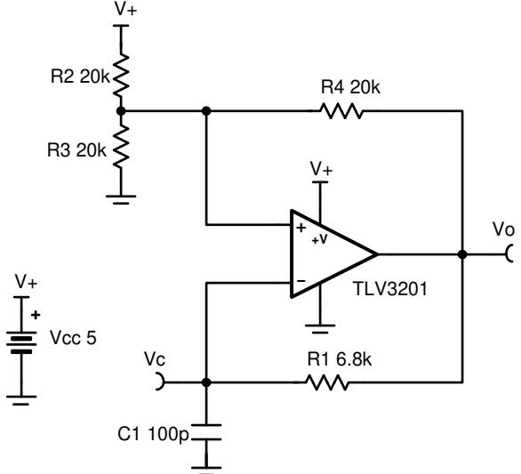
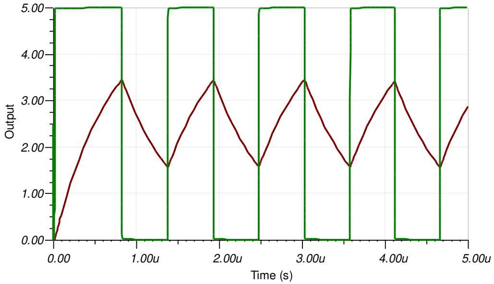

*Jaskaran Atwal*

[www.ti.com](https://www.ti.com)

## **Design Goals**

| Supply |     | Oscillator Frequency |
|--------|-----|----------------------|
| Vcc    | Vee | f                    |
| 5V     | 0V  | 1MHz                 |

#### **Design Description**

The oscillator circuit generates a square wave at a selected frequency. This is done by charging and discharging the capacitor, C1 through the resistor, R1. The oscillation frequency is determined by the RC time constant of R1 and C1, and the threshold levels set by the resistor network of R2, R3, and R4. The maximum frequency of the oscillator is limited by the toggle rate of the comparator and the capacitance load at the output. This oscillator circuit is commonly used as a time reference or a supervisor clock source.

#### **Design Notes**

- 1. Comparator toggle rate and output capacitance are critical considerations when designing a high-speed oscillator.
- 2. Select C1 to be large enough to minimize the errors caused by stray capacitance.
- 3. If using a ceramic capacitor, select a COG or NPO type for best stability over temperature.
- 4. Select lower value resistors for the R2, R3, R4 resistor network to minimize the effects of stray capacitance.
- 5. Adjust R2, R3, and R4 to create a duty cycle other than 50%.

## **Design Steps**

1. When R2 = R3 = R4, the resistor network sets the oscillator trip points of the non-inverting input at one-third and two-thirds of the supply.

2. When the output is high, the upper trip point is set at two-thirds of the supply to bring the output back low.

$$\mathbf{V\_o = V\_s(\frac{\mathcal{R\_3}}{(\mathcal{R\_2} \| \mathcal{R\_4}) + \mathcal{R\_3}}) = \frac{2}{3}\mathbf{V\_s = 3.33\mathbf{V}}$$

3. When the output is low, the lower trip point is set at one-third of the supply to bring the output back high.

$$\mathbf{V\_o} = \mathbf{V\_s} \left( \frac{\mathbf{R\_3} \| \mathbf{R\_4}}{(\mathbf{R\_3} \| \mathbf{R\_4}) + \mathbf{R\_2}} \right) = \frac{1}{3} \mathbf{V\_s} = 1.67 \mathbf{V}$$

4. The timing of the oscillation is controlled by the charging and discharging rate of the capacitor C1 through the resistor R1. This capacitor sets the voltage of the inverting input of the comparator. Calculate the time to discharge the capacitor.

Vc = Vi e ‐ t R1C1 1.67 3.33 = e ‐ t R1C1 t = 0.69R1C1

5. Calculate the time to charge the capacitor.

$$\begin{aligned} \mathbf{V\_{i}} &= \mathbf{V\_{c}} \left( \mathbf{1} \text{-e}^{\frac{\mathbf{t}}{\mathbf{RC}}} \right) \\\\ \mathbf{1.67} &= 3.33 \left( \mathbf{1} \text{-e}^{\frac{\mathbf{t}}{\mathbf{RC}}} \right) \\\\ \frac{1.67}{3.33} &= \text{e}^{\frac{\mathbf{t}}{\mathbf{RC}}} \\\\ \mathbf{t} &= 0.69 \mathbf{R\_{1}C\_{1}} \end{aligned}$$

6. The time for the capacitor to charge or discharge is given by 0.69R1C1. With a target oscillator frequency of 1 MHz, the time to charge or discharge should be 500ns.

0.69R1C1 = 500ns

R1C1 = 724ns

7. Select C1 as 100pF and R1 as 6.8kΩ (the closest real world value).

# **Design Simulations**

### **Transient Simulation Results**

#### **Design References**

See circuit spice simulation file, [SBOMAO3.](https://www.ti.com/general/docs/lit/getliterature.tsp?baseLiteratureNumber=sbomao3&fileType=zip)

#### **Design Featured Comparator**

| TLV3201     |              |  |
|-------------|--------------|--|
| Vss         | 2.7V to 5.5V |  |
| VinCM       | Rail-to-rail |  |
| tpd         | 40ns         |  |
| Vos         | 1mV          |  |
| VHYS        | 1.2mV        |  |
| Iq          | 40µA         |  |
| Output Type | Push-Pull    |  |
| #Channels   | 1            |  |
| TLV3201     |              |  |

#### **Design Alternate Comparator**

| TLV7011     |              |  |
|-------------|--------------|--|
| Vss         | 1.6V to 5.5V |  |
| VinCM       | Rail-to-rail |  |
| tpd         | 260ns        |  |
| Vos         | 0.5V         |  |
| VHYS        | 4mV          |  |
| Iq          | 5µA          |  |
| Output Type | Push-Pull    |  |
| #Channels   | 1            |  |
| TLV7011     |              |  |

# **Trademarks**

All trademarks are the property of their respective owners.

# **IMPORTANT NOTICE AND DISCLAIMER**

TI PROVIDES TECHNICAL AND RELIABILITY DATA (INCLUDING DATA SHEETS), DESIGN RESOURCES (INCLUDING REFERENCE DESIGNS), APPLICATION OR OTHER DESIGN ADVICE, WEB TOOLS, SAFETY INFORMATION, AND OTHER RESOURCES "AS IS" AND WITH ALL FAULTS, AND DISCLAIMS ALL WARRANTIES, EXPRESS AND IMPLIED, INCLUDING WITHOUT LIMITATION ANY IMPLIED WARRANTIES OF MERCHANTABILITY, FITNESS FOR A PARTICULAR PURPOSE OR NON-INFRINGEMENT OF THIRD PARTY INTELLECTUAL PROPERTY RIGHTS.

These resources are intended for skilled developers designing with TI products. You are solely responsible for (1) selecting the appropriate TI products for your application, (2) designing, validating and testing your application, and (3) ensuring your application meets applicable standards, and any other safety, security, regulatory or other requirements.

These resources are subject to change without notice. TI grants you permission to use these resources only for development of an application that uses the TI products described in the resource. Other reproduction and display of these resources is prohibited. No license is granted to any other TI intellectual property right or to any third party intellectual property right. TI disclaims responsibility for, and you will fully indemnify TI and its representatives against, any claims, damages, costs, losses, and liabilities arising out of your use of these resources.

TI's products are provided subject to [TI's Terms of Sale](https://www.ti.com/legal/terms-conditions/terms-of-sale.html) or other applicable terms available either on [ti.com](https://www.ti.com) or provided in conjunction with such TI products. TI's provision of these resources does not expand or otherwise alter TI's applicable warranties or warranty disclaimers for TI products.

TI objects to and rejects any additional or different terms you may have proposed. IMPORTANT NOTICE

Mailing Address: Texas Instruments, Post Office Box 655303, Dallas, Texas 75265 Copyright © 2024, Texas Instruments Incorporated