# **The Design of a Low-Voltage Bandgap Reference**

**THE ANALOG MIND**

*M*Most integrated circuits incorporate bandgap references (often simply called *bandgaps*) to define certain dc voltages or currents that serve various building blocks. In this article, we introduce a step-by-step procedure for the design of low-voltage bandgaps. As presented in Figure 1, a typical power-management environment employs a low-dropout (LDO) circuit that, from a global supply of 1.2 V, generates a moderately regulated voltage around 1 V. This voltage acts as a local supply for the bandgap circuit and some other building blocks. It is desirable for the bandgap to provide substantial supply rejection to minimize corruption in its output due to the electronic noise produced by the LDO and the transient perturbations caused by the switching activities within the other building blocks.

We target the following specifications:

- output voltage = 0.5 V
- output voltage variation 1 5 mV from 0 Cc to 100 Cc
- supply rejection 2 40 dB
- power consumption 1 1 mW
- supply voltage =1 5 V ! %.

We design the circuit in 28-nm CMOS technology. The reader is referred to [1]–[12] for background information.

# Basic Operation

We wish to generate a voltage that is nominally independent of the

*Digital Object Identifier 10.1109/MSSC.2021.3088963 Date of current version: 25 August 2021*

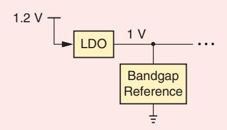

**FIGURE 1: A typical power-management environment.**

temperature. This can be accomplished by summing two voltages that have opposite temperature coefficients (TCs), as practiced in [1], [3], and [11]. Alternatively, we can first sum two currents of opposite TCs and then allow the result to flow through a resistor [9]. We pursue the latter here.

The bandgap core is typically realized as illustrated in Figure 2(a), where the emitter areas of *Q*1 and *Q*2 differ by a factor of *n*, and amplifier *A*1 adjusts the gate voltage of *M*1 and *M*2 to equalize *VX* and *VY* . We thus obtain

$$\mathcal{V}\_{\rm BE1} = \mathcal{V}\_{\rm BE2} + |I\_{D2}| \mathcal{R}\_1 \,. \tag{1}$$

Hence,

$$V\_T \ln \frac{I\_{D1}}{I\_{S1}} = V\_T \ln \frac{I\_{D2}}{I\_{S2}} + |I\_{D2}| R\_1,\qquad(2)$$

where *IS*1 and *IS*2 denote the emitter saturation currents of *Q*1 and *Q*2, respectively. Viewing *Q*1 as a unit and *Q*2 as *n* units in parallel, we have *I n S S* 2 1 = *I* and

$$|I\_{D2}|R\_1 = V\_T \ln n,\tag{3}$$

where *M*1 and *M*2 are assumed to be identical. The voltage across *R*1 is therefore proportional to the absolute temperature (PTAT) and so are the drain currents of *M*1 and *M*2 if *R*1 has a zero TC.

It is possible to make *ID*1 and *ID*2 independent of the temperature by attaching two resistors from *X* and *Y* to the ground [see Figure 2(b)] [9]. Let us formulate the circuit's behavior, assuming that *R R* 2 3 = . Since *V V X Y* . , (1) still holds, and the current through *R*1 is still equal to ( ) *V n T* ln /*R*1. Summing this current and that through *R*3, we have

$$|I\_{D1}| = |I\_{D2}| = \frac{V\_T \ln n}{R\_1} + \frac{|V\_{\text{RE1}}|}{R\_3} \tag{4}$$

$$\frac{1}{R\_3} = \frac{1}{R\_3} \left(\frac{R\_3}{R\_1} \, V\_T \ln n + |V\_{\text{BE1}}|\right). \qquad (5)$$

The two terms on the right-hand side of (5) represent currents with opposite TCs. For | | *ID*2 to have a TC of zero, we select ( ) *R R* 3 1 / *V n T* ln to be approximately 17*VT* [12]. Now, as depicted in Figure 2(c), this current is copied and applied to a resistor to yield a nominally constant output voltage [9],

$$V\_{\rm out} = \frac{R\_L}{R\_3} \left(\frac{R\_3}{R\_1} \, V\_T \ln \, \pi + |V\_{\rm BE1}|\right). \qquad (6)$$

The key to the circuit's low-voltage operation is that *V*out can be arbitrarily small even though | | *V V* BE +17 *T* .1 2. V at *T* =25c C.

### Design Issues

The topology of Figure 2(c) entails several issues. First, noting that the TC of

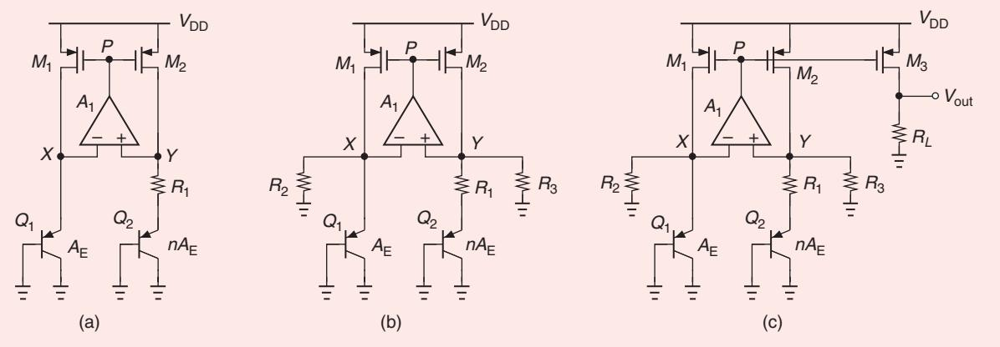

**FIGURE 2: (a) A basic bandgap core. (b) The addition of resistors to create constant currents. (c) The addition of an output branch.**

the base-emitter voltage, 2 2 *V T* BE / , is around -1 5. , m C V/c we expect | | *V*BE1 to be relatively large at low temperatures. With a worst-case *V*DD of 0.95 V, this leaves little voltage headroom for *M*1 and *M*2. We must therefore select relatively large bipolar transistors and low collector currents to ensure a moderate | | *V V* BE = *T C* ln( ) *I I* / *S* .

Second, as *T* goes from 0 Cc to +100 Cc , | | *V*BE1 in Figure 2(c) drops by roughly 150 mV, whereas *V*out remains relatively constant. The resulting difference between the drain-source voltages of *M*1 2, and *M*3 leads to a substantial error in *ID*3 and, hence, a large variation in *V*out. We will resolve this issue through the use of a regulated cascode structure.

Third, the offset of *A*1, *V*OS1, in Figure 2(c) introduces an error in *V*out . We have [13]

$$V\_{\rm out} = \frac{R\_L}{R\_3} \left[ |V\_{\rm BE1}| + \frac{R\_3}{R\_1} V\_T \ln n \right]$$

$$- \left( 1 + \frac{R\_3}{R\_1} \right) V\_{\rm GS1} \right]. \tag{7}$$

The contribution of *V*OS1 can be minimized by maximizing ln*n*—a remedy that costs chip area.

Fourth, the 40-dB supply-rejection requirement imposes a lower bound on the operation amplifier (op amp) gain in Figure 2(c). As explained next, *A*1 must reach several hundred.

Fifth, the bandgap core of Figure 2(b) and (c) can indefinitely remain off after powerup if *VX* and *VY* begin from zero and *A*1 loses the ability to control *VP*. The core must therefore incorporate a startup circuit.

# Core Design

The design of the core presented in Figure 2(a) begins with the choice of the bipolar transistors' dimensions and emitter area ratio, *n*. From the issues outlined in the previous section, we note that the limited voltage headroom makes it desirable to minimize | | *V*BE and, hence, maximize the emitter

**FIGURE 3: (a) The preliminary core design and (b) its internal voltages versus** *T***.**

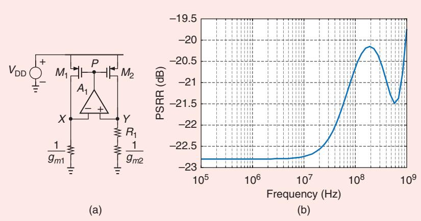

**FIGURE 4: (a) A test setup for studying PSRR and (b) the PSRR of the basic core.**

Authorized licensed use limited to: UCLA Library. Downloaded on November 30,2021 at 21:02:47 UTC from IEEE Xplore. Restrictions apply.

areas. But the op amp-offset issue demands that *n* also be large, leading to an area-hungry solution. As a reasonable compromise, we select four unit transistors for *Q*1 , each having

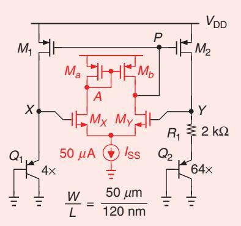

**FIGURE 5: The bandgap core with a simple OTA.**

an emitter area of 5 m*n n* #5 m, and 64 units for *Q*2. Thus, | | *V*BE .750 mV and *V n T* ln .72mV at room temperature. The weak dependence of *V n T* ln upon *n* suggests that the effect of offset in (7) cannot be reduced easily through this variable.

Another approach to lowering the effect of the op amp offset in Figure 2(a) involves scaling *ID*1 up with respect to *ID*2. Denoting this ratio by *m*, we recognize from (2) that

$$|I\_{D2}|R\_1 = V\_T \ln(n \cdot m). \tag{8}$$

This result carries over to (7). Nevertheless, an *m* value substantially greater than unity also raises | | *V*BE1 , exacerbating the metal-oxide-semiconductor (MOS) transistor voltage headroom iss-ue at low temperatures. For exam-

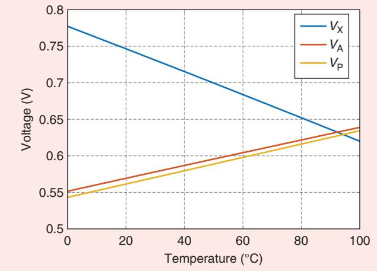

**FIGURE 6: The internal voltages of the bandgap core versus** *T***.**

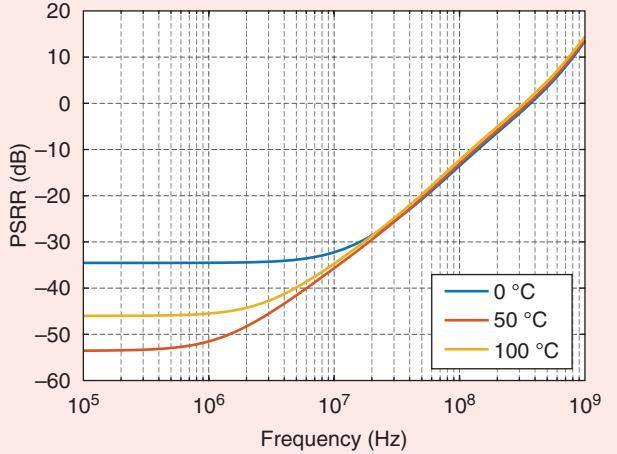

**FIGURE 7: The PSRR responses of the core for different temperatures.**

The next task is to select the bias current in each branch, the value of *R*1, and the dimensions of *M*1 and *M*2. Anticipating about half a dozen bias currents in the main branches and the op amp(s) in the final design and bearing in mind the 1-mW power budget, we choose | | *I I D D* 1 2 =| |.35 *n* A and hence *R*1 =2kX. For the PMOS transistors, the channel area must be large enough to minimize mismatch and flicker noise, and the length must be long enough to ensure that channel-length modulation does not limit the supply rejection. Based on these considerations, we select ( / *W L*)1 2, =50 *n*m n /120 m.

Figure 3(a) depicts the preliminary core design. We simulate the circuit while assuming an ideal op amp having a gain of 100. Our objective is twofold: to measure the extreme values of *VX*, *VY*, and *VP* and to quantify the power-supply-rejection ratio (PSRR). In Figure 3(b), *VX* and *VP* are plotted as a function of the temperature. (The high op amp gain guarantees that *V V Y X* . .) These results reveal several points. First, | | *V V P X* - =| | *V V* GS1 1 - DS has a maximum value of about 230 mV, placing *M*1 and *M*2 in saturation. That is, ( ) *W L*/ 1 2, is adequately large. Second, the op amp input stage must operate properly across the common-mode (CM) range of *VX* and *VY* —from around 780 mV to 620 mV. Third, the op amp output must accommodate the variation of *VP* from 550 mV to 640 mV.

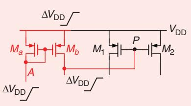

**FIGURE 8: The bootstrapping of node** *P* **by the OTA active load.**

#### 8 SUMMER 2021 *IEEE SOLID-STATE CIRCUITS MAGAZINE*

Next, we investigate the core's supply rejection by constructing the setup displayed in Figure 4. The supply voltage varies by a small amount, T*V*DD, and *Q*1 and *Q*2 are replaced with their small-signal resistances. Note that 1 1 / / *g g m m* 1 2 = because *Q*1 and *Q*2 carry equal currents. If *ID*1 and *ID*2 change by T*ID*, we have

$$
\Delta V\_Y - \Delta V\_X = \Delta I\_D \left( R\_1 + \frac{1}{\mathcal{G}\_{m2}} \right) - \Delta I\_D \frac{1}{\mathcal{G}\_{m1}} \tag{9}
$$

$$
= \Delta I\_D R\_1,\tag{10}
$$

and, hence, T T *V A P D* = 1 1 *I R* . In a well-designed circuit, we expect T*ID* to be small and *V*GS1,2 to be relatively constant, which predicts that T T *V V P* . DD . It follows that

$$
\Delta I\_D \approx \frac{\Delta V\_{\rm DD}}{\overline{A\_1}\,\overline{R\_1}}.\tag{11}
$$

We now ask, which quantity is the "output" of interest here? Since the drain current of *M*1 and *M*2 is eventually copied and applied to a resistor [e.g., *RL* in Figure 2(c)] to generate the reference voltage, we define the PSRR as

$$\text{PSRR} = \frac{\Delta V\_{\text{DD}}}{\Delta I\_{\text{D}} R\_L} \tag{12}$$

$$\approx \frac{A\_1 R\_1}{R\_L}. \tag{13}$$

Moreover, if *R*1 sustains a voltage of *V n T* ln .72mV mV and *RL* an output voltage of 500 mV, we have *R R* 1/ *L* = 0 1. . 4 It follows that

$$\text{PSRR} = 0.14 \, A\_1 \,. \tag{14}$$

For 40 dB of rejection, *A*1 must exceed 700. In practice, the PSRR is plotted as the inverse of the previous quantities, i.e., as the magnitude of the transfer function from *V*DD to the output of interest.

For initial PSRR simulations, we simply multiply the voltage variation across *R*1 by 1 0/ . , 14 arriving at the plot presented in Figure 4(b). For supply-perturbation frequencies up to tens of megahertz, the PSRR is around –23 dB, which agrees with (14). At higher frequencies, *C C* GS1 2 + GS in Figure 4(a) couples the *V*DD changes to *C*GD1 and *C*GD2, causing *VX* and *VY* to bounce. The PSRR

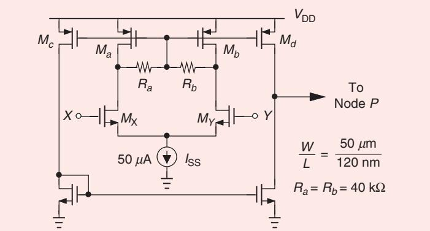

**FIGURE 9: A two-stage op amp for use in the bandgap reference.**

is far short of the desired value, necessitating further design efforts.

#### Op Amp Design

Since the op amp in Figure 3(a) must operate with input CM levels as high as 780 mV, we select an NMOS input stage for it. The simplest implementation is a five-transistor operational transconductance amplifier (OTA), as presented in Figure 5. We assume *W L*/ / =50 *n*m n 120 m for all of the transistors. With a tail current of 50 *μ*A, the op amp provides a gain of about 20, and *MX* and *MY* exhibit a minimum source voltage of 350 mV at *T* =100 Cc , which is sufficient for *I*SS . However, at *T* = 0 Cc , both | | *V*BE and | | *V*TH1,2 take on large values, possibly pushing *MX* into the triode region and lowering the op amp gain. Figure 6 plots *VX*, *VA*, and *VP* versus *T*, demonstrating that *V V X A* keeps *MX* in saturation. Figure 7

**FIGURE 10: Paths from** *V***DD to the internal nodes of the two-stage op amp.**

presents how the PSRR responses at *T* = 0 Cc , 50c C, and 100c C illustrate a degradation at low temperatures.

An interesting observation in Figure 7 is that the low-frequency PSRR is around –35 dB at *T* = 0 Cc , whereas (14) would yield 1 0 /( .14*A*1) / -9dB for *A*1 =20. Why is the performance better than expected? In the analysis leading to (14), we assumed that the op amp must multiply *V V Y X* - by *A*1 to adjust *VP* and allow it to track *V*DD. However, in the circuit of Figure 5, the OTA provides an additional

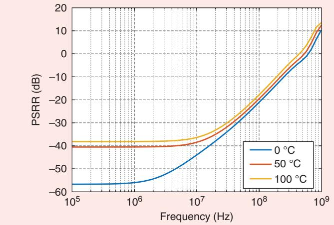

**FIGURE 11: The PSRR of the core with a two-stage op amp.**

Authorized licensed use limited to: UCLA Library. Downloaded on November 30,2021 at 21:02:47 UTC from IEEE Xplore. Restrictions apply.

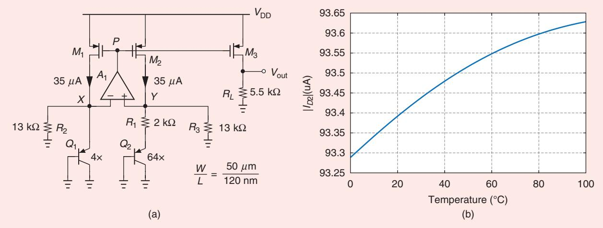

**FIGURE 12: (a) The bandgap reference with** *R***2 and** *R***3 added and (b) the drain current of** *M***2 versus** *T***.**

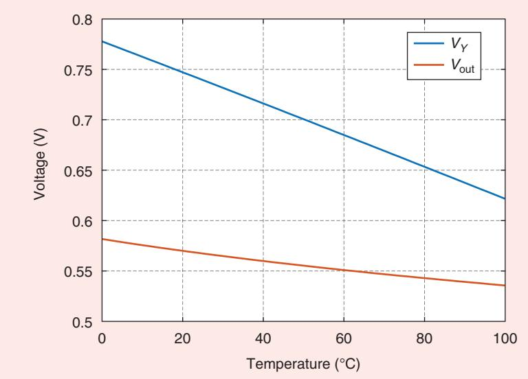

**FIGURE 13: The voltages at node** *Y* **and at the output of the bandgap circuit versus** *T***.**

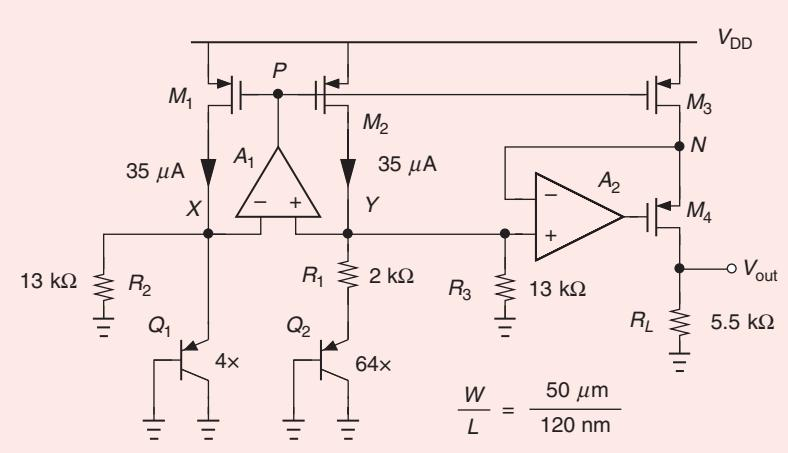

**FIGURE 14: The bandgap circuit with a regulated cascode.**

tracking mechanism: If *V*DD varies by T*V*DD, so do *VA and VP* (Figure 8). In essence, the OTA's PMOS active load bootstraps *P* to *V*DD.

That T T *V V P A* . can be seen by noting that, in the absence of asymmetries within the op amp, *V V P A* = if *V V X Y* = . This property is generally considered a drawback of the fivetransistor OTA, but it proves useful here. Since the *V*DD perturbation is directly applied to node *P* by *Ma* and *Mb*, the op amp provides only additional correction.

The PSRR degradation at low temperatures calls for a higher op amp gain and, hence, a two-stage topology. Figure 9 illustrates a simple design wherein the output CM level of the first stage is set by *Ra* and *Rb* to be equal to one PMOS source-gate voltage below *V*DD. This method also defines the bias currents of the second stage by forming current mirrors. Thus, the total supply current is about 100 *μ*A. This op amp offers a gain of 380 at *T* = 0 Cc and 320 at *T* =100 Cc , improving the PSRR according to (14).

Does the effect illustrated in Figure 8 exist in the two-stage op amp as well? If *V V X Y* . and *V*DD changes by T*V*DD, then so do the drain voltages of *Ma* and *Mb* (Figure 10). We observe that the gate-source voltages of *Mc* and *Md* remain relatively constant, introducing little change at their drains and, hence, in *VP* . In other words, this op amp does not provide the direct cancelation mechanism of the five-transistor OTA. Figure 11 plots the bandgap core PSRR in the presence of the two-stage op amp.

# Complete Bandgap Reference

As prescribed by Figure 2(b), we must attach equal resistors from nodes *X* and *Y* to the ground to change the nature of *ID*1 and *ID*2 from PTAT to temperature-independent quantities. This requires that ( ) *R R* 3 1 / *V n T* ln be around 17*VT* and *R R* 2 3 = . 6*R*1 if *n* =16. Figure 12 displays the modified circuit as well as | | *ID*2 versus *T*. Resistors *R*2 and *R*3 are rounded up to 13kX, and the op amp is implemented as the two-stage topology of Figure 9. We note that | | *ID*2 changes by less than 0.4% across our temperature range of interest.

In the next step, we copy *ID*2 and apply the result to *RL*, forming the reference voltage, *V*out . According to (6), an output voltage of 0.5 V requires *R R L* / 2 . 0 4. 2 because the quantity within the parenthesis is around 1.2 V. It follows that *RL* =5 5. . kX Plotted in Figure 13 is *V*out versus *T*, exhibiting a variation of 40 mV.

Why does *V*out drift so much even though *ID*2 is fairly constant? This error arises from the temperaturedependent difference between *V*DS2 and *V*DS3 and the channel-length modulation of *M*2 and *M*3. From Figure 13, we note that *V V Y* - out is equal to 200 mV at *T* = 0 Cc and 85 mV at *T* =100 Cc . The relatively long transistor channels still prove inadequate in obtaining an acceptably small current mismatch between *M*2 and *M*3.

The error due to channel-length modulation is suppressed if we guarantee that the drain voltage of *M*3 tracks that of *M*2. This can be accomplished by a regulated cascode structure. Figure 14 illustrates the idea of comparing these voltages by means of op amp *A*2 and adjusting the gate voltage of *M*4 accordingly. As *VY* falls with *T*, so does *VN*, leaving less voltage headroom for *M*4 and requiring that its overdrive voltage increase. Even if *M*4 operates in the triode region (e.g., at high temperatures), the loop gain provided by *A*2 still ensures that *V V N Y* . . Op amp *A*2 is realized as in Figure 9 but with *W L*/ / =25 *n* m 12 n0 m for all of the transistors. Figure 15 plots *V*out versus *T*, revealing a variation of about 2.5 mV. The total supply current is around 0.5 mA. We have therefore met all of the specifications except for the supply rejection.

Figure 16 depicts the PSRR. Owing to the high op amp gain, the lowfrequency value satisfies our target. Beyond 10 MHz, however, the PSRR degrades because the gain of *A*1 in Figure 14 begins to fall. This is expected as the op amp's low-bias currents yield a high output resistance, about 45 kΩ, which, along with *CCC* GS1 2 ++= GS GS3 0 3. 5pF, creates an open-loop pole in the vicinity of 10 MHz. To improve the PSRR, we add a simple low-pass filter to the output node. Figure 17 depicts the filter and the resulting PSRR.

## Output Noise and Offset

In most applications, the noise of bandgap references proves critical. A circuit using *ID*2 or *V*out in Figure 14 as a reference can experience performance degradation due to their noise. Figure 18 plots the noise voltage in *V*out . At frequencies up to several hundred megahertz, it is dominated by the flicker noise of *M*2 and *M*3. At 1 GHz, these devices and the first stage of the op amp contribute significant thermal noise.

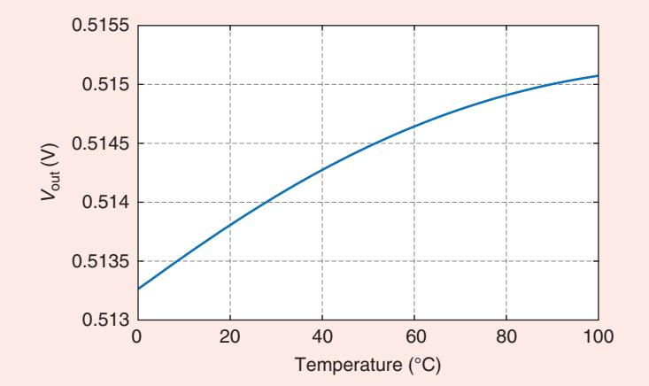

**FIGURE 15: The output voltage of the final design versus** *T***.**

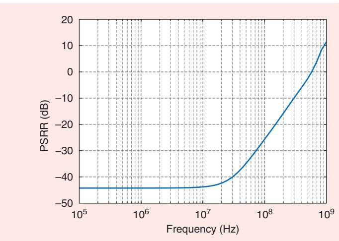

**FIGURE 16: The PSRR of the final design.**

If the output noise is unacceptably high for a given application, we can pursue three methods to reduce it. First, to lower the flicker noise, the channel areas of *M*1–*M*3 can be increased while maintaining their *W L*/ ratio. Second, the widths and bias currents of *M*1–*M*3 and the areas of *Q*1 and *Q*2 can be scaled up, and the values of all of the resistors can be scaled down by the same factor to reduce the output thermal noise. This remedy trades noise for area and power. Third, the output lowpass filter can incorporate larger capacitors, but at the cost of area.

The op amp offset, *V*OS, arises primarily from the first stage in Figure 9. Writing the threshold mismatch as T*V A* TH = VTH / *WL* and assuming

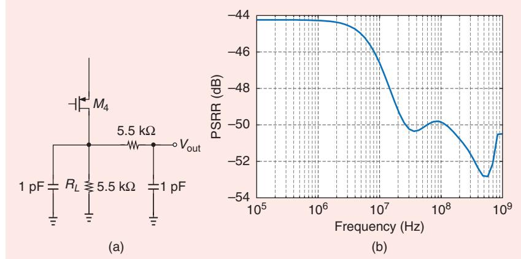

**FIGURE 17: (a) The addition of a low-pass filter and (b) the resulting PSRR.**

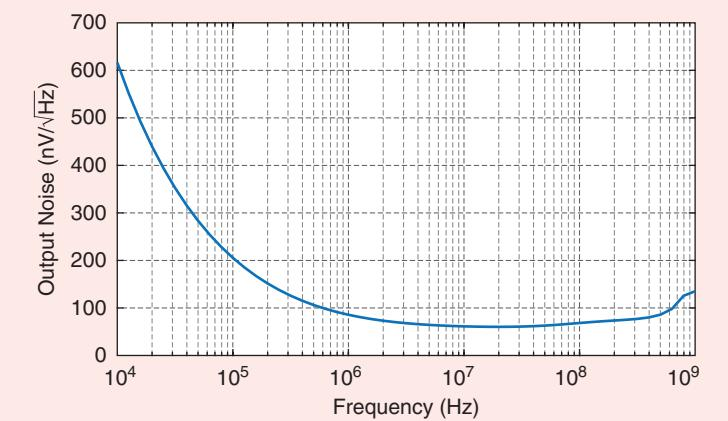

**FIGURE 18: The output noise voltage of the bandgap reference.**

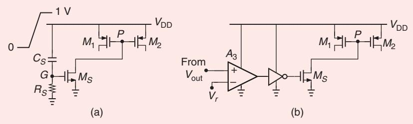

**FIGURE 19: The start-up circuits using (a) a timing mechanism and (b) a high-gain comparison method.** *(continued on p. 16)*

*A*VTH .3mV, we obtain *V*OS .1 7. mV. From (7), this translates to an error of about 5 mV in *V*out, which is a reasonable amount.

#### Start-Up and Transient Response

To ensure that the reference generator of Figure 14 reaches the desired state when the circuit is turned on, we must examine the initial behavior of the core and the two-stage op amp. Suppose *VX* and *VY* are zero at powerup. Then, *MX*, *MY*, *Ma*, and *Mb* in Figure 9 remain off, and so do *Mc* and *Md*. We recognize that node *P* floats, possibly keeping *M*1 and *M*2 off as well. This degenerate state can be avoided if we add a means to prohibit *VP* from staying high when the circuit turns on.

Whether a bandgap remains off or not depends on a number of factors. Capacitive coupling paths from *V*DD to the internal nodes, e.g., to *X* and *Y* in Figure 14, can turn on the circuit. Also, the slope of the *V*DD ramp and the temperature may encourage or impede the start-up process.

To ensure start-up, we can employ a timing circuit to initially keep node *P* in Figure 14 low. Figure 19(a) illustrates the idea of drawing a current from *P* by *MS* as node *G* tracks the *V*DD ramp and exceeds the transistor threshold. After *V*DD stabilizes, *VG* returns to zero. The drawback of this approach is that if *V*DD takes, for example, 1 ms to ramp up, then *R*1 and *C*1 must be extremely large to permit *G* to go high.

We instead explore a different line of thought: if the circuit remains inactive after *V*DD rises, then *V*out in Figure 14 is zero and can be compared to a reference roughly representing its desired value. The result can then enable a mechanism to draw current from *P*. As depicted in Figure 19(b), amplifier *A*3 compares *V*out to *Vr* and turns on *MS* if the former is well below the latter. The amplifier is implemented as the OTA displayed in Figure 5, except *W L*/ is chosen to be equal to 5 3 *n*m n / 0 m for all of the transistors. To accommodate the offset of *A*3, we select

#### 12 SUMMER 2021 *IEEE SOLID-STATE CIRCUITS MAGAZINE*

of ac coupling attenuates the low-frequency component of the signal, causing baseline wander, which may result in the loss of data in wireline communication. To restore this low-frequency component for a random binary sequence or, equivalently, to remove the base line wander, we employ a comparator with quantized feedback in conjunction with superposition.

# Acknowledgment

I would like to thank Hossein Shakiba (the author of [2]) for his insights and discussions that inspired this article.

#### References

- [1] B. E . Boser, "Offset control," in *EECS 247: Lecture Notes 27*, Berkeley, CA: Univ. of California, 2002, pp. 1–15. [Online]. Available: https://inst.eecs .berkeley.edu//~n247/fa07/lectures/L27 .pdf
- [2] M. H. Shakiba, "A 2.5Gb/s adaptive cable equalizer," in *Proc*. *Dig. Tech. IEEE Int. Solid-State Circuits Conf. (ISSCC)*, Feb. 1999, pp. 396–397. doi: 10.1109/ISSCC .1999.759317.
- [3] F. Waldhauer "Quantized feedback in an experimental 280-Mb/s digital repeater for coaxial transmission," *IEEE Trans. Commun.*, vol. 22, no. 1, pp. 1–5, Jan. 1974. doi: 10.1109/TCOM.1974.1092055.
- [4] A. Sheikholeslami, "Circuit intuitions: Equalizer circuit," *IEEE Solid State Circuits Mag.*, vol. 12, no. 1, pp. 6–7, Winter 2020. doi: 10.1109/MSSC.2019.2952233.

# **THE ANALOG MIND**

*(continued from p. 12)*

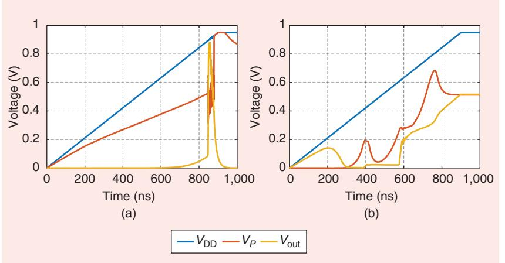

**FIGURE 20: The bandgap internal waveforms (a) without and (b) with the start-up circuit.**

*Vr* . 0 4. V and generate it from *V*DD by a resistive divider. Figure 20(a) and (b) plots *V*DD, *VP*, and *V*out for a 900-ns *V*DD ramp before and after the start-up circuit is added, respectively. We note that the former fails (in fact, it oscillates with a period of several microseconds) whereas the latter settles properly. For a 1-ms *V*DD ramp, the bandgap turns on with or without the start-up mechanism.

#### References

- [1] R. J. Widlar, "Some circuit design techniques for linear integrated circuits," *IEEE Trans. Circuit Theory*, vol. 12, no. 4, pp. 586–590, Dec. 1965. doi: 10.1109/TCT .1965.1082512.
- [2] R. J. Widlar, "New developments in IC voltage regulators," *IEEE J. Solid-State Circuits*, vol. 6, no. 1, pp. 2–7, Feb. 1971. doi: 10.1109/JSSC.1971.1050151.
- [3] A. P. Brokaw, "A simple three-terminal IC bandgap reference," *IEEE J. Solid-State Circuits*, vol. 9, no. 6, pp. 388–393, Dec. 1974. doi: 10.1109/JSSC.1974.1050532.
- [4] R. A. Blauschild, P. A. Tucci, R. S. Muller, and R. G. Meyer, "A new NMOS temperature-

stable voltage reference," *IEEE J. Solid-State Circuits*, vol. 13, no. 6, pp. 767–774, Dec. 1978. doi: 10.1109/JSSC.1978.1052048.

- [5] Y. P. Tsividis and R. W. Ulmer, "A CMOS voltage reference," *IEEE J. Solid-State Circuits*, vol. 13, no. 6, pp. 774–778, Dec. 1978. doi: 10.1109/JSSC.1978.1052049.
- [6] E. A. Vittoz and O. Neyroud, "A low-voltage CMOS bandgap reference," *IEEE J. Solid-State Circuits*, vol. 14, no. 3, pp. 573–577, June 1979. doi: 10.1109/JSSC.1979.1051218.
- [7] R. Gregorian, G. Wegner, and W. E. Nicholson, "An integrated single-chip PCM voice codec with filters," *IEEE J. Solid-State Circuits*, vol. 16, no. 4, pp. 322–333, Aug. 1981. doi: 10.1109/JSSC.1981. 1051596.
- [8] K. E. Kujik, "A precision reference voltage source," *IEEE J. Solid-State Circuits*, vol. 8, pp. 222–226, June 1973. doi: 10.1109/JSSC .1973.1050378.
- [9] H. Banba et al., "A CMOS bandgap reference circuit with Sub-1-V operation," *IEEE J. Solid-State Circuits*, vol. 34, no. 5, pp. 670–674, May 1999. doi: 10.1109/4.760378.
- [10] C. J. B. Fayomi et al., "Sub-1-V CMOS bandgap reference design techniques: A survey," *Analog Integr. Circuits Signal Process.*, vol. 62, no. 2, pp. 141–157, Feb. 2010. doi: 10.1007/s10470-009-9352-4.
- [11] H. Neuteboom, B. M. J. Kup, and M. Janssens, "A DSP-based hearing instrument IC," *IEEE J. Solid-State Circuits*, vol. 32, no. 11, pp. 1790–1806, Nov. 1997. doi: 10.1109/ 4.641702.
- [12] B. Razavi, "The bandgap reference," *IEEE Solid State Circuits Mag.*, vol. 8, no. 3, pp. 9–12, Summer 2016. doi: 10.1109/MSSC.2016 .2577978.
- [13] B. Razavi, *Design of Analog CMOS Integrated Circuits*, 2nd ed., New York, NY, USA: McGraw-Hill, 2017.