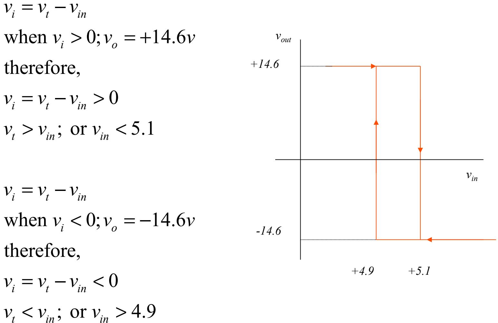

### Schmitt Triggers Circuits

Lecture 12 

# Effects of Positive Feedback

- From this circuit: *vo* = *Avi* and *vi* = *vf* – *vin* = *βvo* – *vin*
- Because of the positive feedback *vi* is no longer equal to zero (not a virtual ground)
- So as *vi* increases in the positive (negative) direction, increases in the positive (negative) direction.
- Because of the positive feedback, this will increase *vi* in the positive direction (negative) which will further increase *vo* which further increase *vi* and so on.
- When will this stop?

- If we had infinite power, then never.
- However, we have limited power which is given by the amplifier's DC voltage supplies: +A, -A.
- If *vi* goes positive, then *vo* "instantaneously" grows to +A volts
- And if *vi* goes negative, then *vo* "instantaneously" grows to -A volts

## Hysteresis

*v*

*v*

- Assume that *β=R2 /*(*R1+R2*) *= 0.1* and *vo* levels are *+10* (for *vi* > 0) and *–10 V* (for *vi* < 0)*.*
- First, note that *vi = vf vin.* Now, let's assume *vo* = *+10 V* and therefore *vf* = *1 V* then as long as *vin* is less than *1 V*, then *vo* = *+10 V* (it's high state) since *vi* , the input to the comparator, will be > *0*. Once *vin*  surpasses 1, *vi < 0,* and the output will switch to *–10 V.*
- At this point, *vf* = -*1 V* and as long as the *vin >* -*1 V* , the output will stay in its low state, *-10 V*.
- Note that has the characteristic of being a flip-flop. If one pulses it with high (>1), then the output switches to a low and visa versa.

when the circuit switches states.

### Other Forms of Schmitt Triggers

• Non-inverting types

• Specified Thresholds

0; 0; *i t in i o i o v v v v v A v v A* = − > = + < = −

From node at noninvering input:

$$\begin{aligned} \frac{\mathbf{v}\_{\prime}}{R\_{2}} + \frac{\mathbf{v}\_{\prime} - \mathbf{v}\_{o}}{R\_{3}} + \frac{\mathbf{v}\_{\prime} - \mathbf{V}\_{SS}}{R\_{1}} &= \mathbf{0} \\ \mathbf{v}\_{\prime} &= \frac{\frac{\mathbf{V}\_{o}}{R\_{3}} + \frac{\mathbf{V}\_{SS}}{R\_{1}}}{\frac{1}{R\_{2}} + \frac{1}{R\_{3}} + \frac{1}{R\_{1}}} = \frac{\frac{\mathbf{V}\_{o}}{R\_{3}} + \frac{\mathbf{V}\_{SS}}{R\_{1}}}{G\_{T}R\_{3}} = \frac{\mathbf{v}\_{o}}{G\_{T}R\_{3}} + \frac{\mathbf{V}\_{SS}}{G\_{T}R\_{1}} \\ \mathbf{v}\_{\prime} &= \frac{\mathbf{v}\_{o}}{G\_{T}R\_{3}} + \frac{\mathbf{V}\_{SS}}{G\_{T}R\_{1}} - \mathbf{v}\_{in} \\ \mathbf{v}\_{\prime} &= \frac{A}{G\_{T}R\_{3}} + \frac{\mathbf{V}\_{SS}}{G\_{T}R\_{1}} - \mathbf{v}\_{in} > 0; \mathbf{v}\_{in} < V\_{\prime 1} = \frac{A}{G\_{T}R\_{3}} + \frac{V\_{SS}}{G\_{T}R\_{1}} \\ \mathbf{v}\_{\prime} &= \frac{-A}{G\_{T}R\_{3}} + \frac{V\_{SS}}{G\_{T}R\_{1}} - \mathbf{v}\_{in} < 0; \mathbf{v}\_{in} > V\_{\prime 2} = \frac{-A}{G\_{T}R\_{3}} + \frac{V\_{SS}}{G\_{T}R\_{1}} \end{aligned}$$

30

## An Example

• Choose the 3 resistors to provide thresholds of *5*±*0.1 V* for output levels of ±*14.6 V*. 

• We need to chose one of the 3 resistors. If we choose *R3= 1 M*, then *R1=20.55 k* and *R2 = 10.38 k*. If we chose resistors too small then may draw excessive amounts of current from our *15 V* supply and create a large power drain on the circuit. *\_* 

#### Example contintued

#### Another Example

- What are the transfer characteristics for this circuit if R,=1k and R,= 2k and the thresholds levels are +10 V.
	- Vm = i(R1 + R2) + vg V = iR1 = in = " in = " = R1" = R1
	R1 = R1 = R1 = R1 = R1 = R1 = R1 = R1 = R1 = R1 = R1 = R1 = R1 = R1 = R1 = R1 = R1 = R1 = R1 = R1 = R1 = R1 = R1 = R1 = R1 = R1 = R1 = R1 vi = Vin -V = Vin -V = Vin - Lin - Yo R1 - R1 - R1 - R1 - R2 - R1 - R2 - R1 - R2 v; = Vin - - in - - in - - - Vin + - -For vg = + 10 V, v; > 0 v; = = V;n + = > 0; = V; > = = = ; V; > = 5 For v == 10 V, v; < 0 v; = = Vm + = = 0; = Vm < = = = = = Vm < 5

### Astable Multivibrators

- A switching oscillator or Astable Multivibrator can be formed from a Schmitt trigger as follows:
- Assume that output levels are ±A and the thresholds are ±A/2 since the feedback voltage = ½ *vo*.

### Astable Multivibrators

- Assume that the output starts off at +A.
- The capacitor starts to charge to +A
- However, when it reaches +A/2, *vi =* 0 and the output switches to –A.
- The capacitor then charges to –A.
- However, when it reaches –A/2, *vi =0* and the output switches to +A
- And the capacitor charges to +A
- This process continues.

## Timing Calculation

Start the timing calculation here

InitialCondition : ( ) 1 2 *v t K K e t RC c* = + −

$$\begin{aligned} \nu\_c(0) &= -\frac{A}{2} = K\_1 + K\_2 e^{-0/RC} = K\_1 + K\_2 \text{ (eqn.1)}\\ \text{Final condition :} \end{aligned}$$

$$\nu\_c(\infty) = +A = K\_1 + K\_2 e^{-\circ/RC} = K\_1 \text{ (eqn. 2)}$$

$$\begin{aligned} &\text{From eqns (1) and (2)}\\ &K\_1 = A\\ &K\_2 = -\frac{A}{2} - K\_1 = -\frac{3}{2}A \end{aligned}$$

$$\begin{aligned} \nu\_c(t) &= A(1 - \frac{3}{2}e^{-t/RC}) \\ \text{But} \\ \nu\_c(\frac{T}{2}) &= \frac{A}{2} = A(1 - \frac{3}{2}e^{-T/2RC}) \\ \therefore \, e^{-T/2RC} &= \frac{1}{3} \\ T &= 2RC \ln(3) \end{aligned}$$

## Homework

- Comparators and Schmitt Trigger Circuits – Problems: 12.8-9
- Astable Multivibrators
	- Problems: 12.14