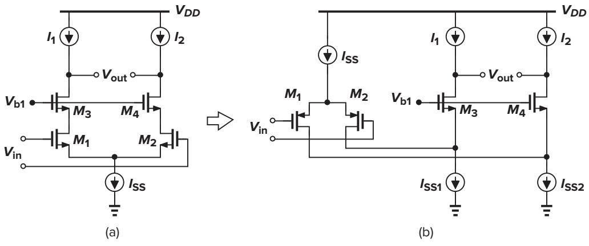
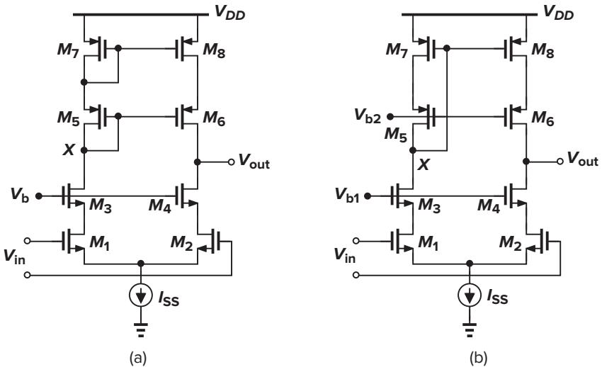
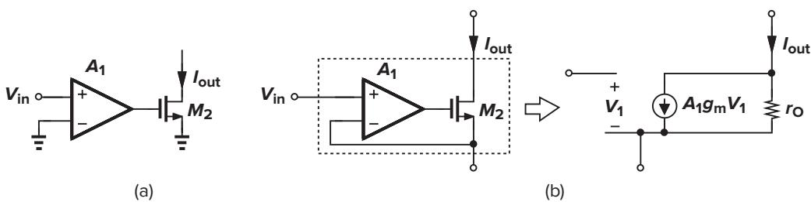
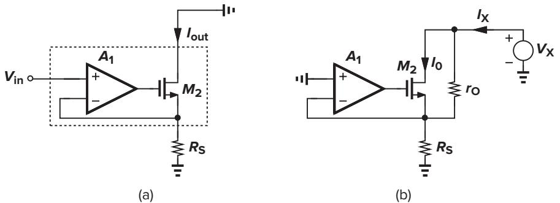
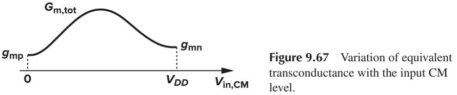

# CHAPTER

Razavi-3930640 book December 17, 201516:59 344

**9**

# *Operational Amplifiers*

Operational amplifiers (op amps) are an integral part of many analog and mixed-signal systems. Op amps with vastly different levels of complexity are used to realize functions ranging from dc bias generation to high-speed amplification or filtering. The design of op amps continues to pose a challenge as the supply voltage and transistor channel lengths scale down with each generation of CMOS technologies.

This chapter deals with the analysis and design of CMOS op amps. Following a review of performance parameters, we describe simple op amps such as telescopic and folded-cascode topologies. Next, we study two-stage and gain-boosting configurations and the problem of common-mode feedback. Finally, we introduce the concept of slew rate and analyze the effect of supply rejection and noise in op amps. The reader is encouraged to read this chapter before dealing with more advanced designs in Chapter 11.

# **9.1 General Considerations**

We loosely define an op amp as a "high-gain differential amplifier." By "high," we mean a value that is adequate for the application, typically in the range of 101 to 105. Since op amps are usually employed to implement a feedback system, their open-loop gain is chosen according to the precision required of the closed-loop circuit.

Up to three decades ago, most op amps were designed to serve as "general-purpose" building blocks, satisfying the requirements of many different applications. Such efforts sought to create an "ideal" op amp, e.g., with a very high voltage gain (several hundred thousand), high input impedance, and low output impedance, but at the cost of many other aspects of the performance, e.g., speed, output voltage swings, and power dissipation.

By contrast, today's op amp design proceeds with the recognition that the trade-offs between the parameters eventually require a multi dimensional compromise in the overall implementation, making it necessary to know the *adequate* value that must be achieved for each parameter. For example, if the speed is critical while the gain error is not, a topology is chosen that favors the former, possibly sacrificing the latter.

### **9.1.1 Performance Parameters**

In this section, we describe a number of op amp design parameters, providing an understanding of why and where each may become important. For this discussion, we consider the differential cascode circuit

shown in Fig. 9.1 as a representative op amp design.1 The voltages *Vb*1−*Vb*3 are generated by the current mirror techniques described in Chapter 5.

**Gain** The open-loop gain of an op amp determines the precision of the feedback system employing the op amp. As mentioned before, the required gain may vary by four orders of magnitude according to the application. Trading with such parameters as speed and output voltage swings, the minimum required gain must therefore be known. As explained in Chapter 14, a high open-loop gain may also be necessary to suppress nonlinearity.

#### ▲**Example 9.1**

The circuit of Fig. 9.2 is designed for a nominal gain of 10, i.e., 1 + *R*1*/R*2 = 10. Determine the minimum value of *A*1 for a gain error of 1%.

**Solution**

The closed-loop gain is obtained from Chapter 8 as

$$\frac{V\_{out}}{V\_{in}} = \frac{A\_1}{1 + \frac{R\_2}{R\_1 + R\_2}A\_1} \tag{9.1}$$

$$\eta = \frac{R\_1 + R\_2}{R\_2} \frac{A\_1}{\frac{R\_1 + R\_2}{R\_2} + A\_1} \tag{9.2}$$

1Since op amps of this type have a high output impedance, they are sometimes called "operational transconductance amplifiers" (OTAs). In the limit, the circuit can be represented by a single voltage-dependent current source and called a "*Gm* stage."

Predicting that *A*1 " 10, we approximate (9.2) as

Razavi-3930640 book December 17, 201516:59 346

$$\frac{V\_{out}}{V\_{in}} \approx \left(1 + \frac{R\_1}{R\_2}\right) \left(1 - \frac{R\_1 + R\_2}{R\_2} \frac{1}{A\_1}\right) \tag{9.3}$$

The term *(R*1 + *R*2*)/(R*2 *A*1*)* = *(*1 + *R*1*/R*2*)/A*1 represents the relative gain error. To achieve a gain error less than 1%, we must have *A*1 *>* 1000. ▲

It is instructive to compare the circuit of Fig. 9.2 with an open-loop implementation such as that in Fig. 9.3. While it is possible to obtain a nominal gain of *gm RD* = 10 by a common-source stage, it is extremely difficult to guarantee an error less than 1%. The variations in the mobility and gate-oxide thickness of the transistor and the value of the resistor typically yield an error greater than 20%.

**Small-Signal Bandwidth** The high-frequency behavior of op amps plays a critical role in many applications. For example, as the frequency of operation increases, the open-loop gain begins to drop (Fig. 9.4), creating larger errors in the feedback system. The small-signal bandwidth is usually defined as the "unitygain" frequency, *fu*, which can reach several gigahertz in today's CMOS op amps. The 3-dB frequency, *f*3-dB, may also be specified to allow easier prediction of the closed-loop frequency response.

▲**Example 9.2**

In the circuit of Fig. 9.5, assume that the op amp is a single-pole voltage amplifier. If *Vin* is a small step, calculate the time required for the output voltage to reach within 1% of its final value. What unity-gain bandwidth must the

**Figure 9.5**

### Sec. 9.1 General Considerations **347**

Razavi-3930640 book December 17, 201516:59 347

op amp provide if 1 + *R*1*/R*2 ≈ 10 and the settling time is to be less than 5 ns? For simplicity, assume that the low-frequency gain is much greater than unity.

### **Solution**

Since

$$\left(V\_{in} - V\_{out}\frac{R\_2}{R\_1 + R\_2}\right)A(\mathbf{s}) = V\_{out} \tag{9.4}$$

we have

$$\frac{V\_{out}}{V\_{in}}(s) = \frac{A(s)}{1 + \frac{R\_2}{R\_1 + R\_2}A(s)}\tag{9.5}$$

For a one-pole system, *A(s)* = *A*0*/(*1+*s/*ω0*)*, where ω0 is the 3-dB bandwidth and *A*0ω0 the unity-gain bandwidth. Thus,

$$\frac{V\_{out}}{V\_{in}}(s) = \frac{A\_0}{1 + \frac{R\_2}{R\_1 + R\_2}A\_0 + \frac{s}{\alpha\_0}}\tag{9.6}$$

$$t = \frac{\frac{A\_0}{1 + \frac{R\_2}{R\_1 + R\_2} A\_0}}{1 + \frac{s}{\left(1 + \frac{R\_2}{R\_1 + R\_2} A\_0\right) a\_0}}\tag{9.7}$$

indicating that the closed-loop amplifier is also a one-pole system with a time constant equal to

$$\pi = \frac{1}{\left(1 + \frac{R\_2}{R\_1 + R\_2} A\_0\right) \rho\_0} \tag{9.8}$$

Recognizing that the quantity *R*2 *A*0*/(R*1 + *R*2*)* is the low-frequency loop gain and usually much greater than unity, we have

$$
\sigma \approx \left( \mathrm{l} + \frac{R\_1}{R\_2} \right) \frac{\mathrm{l}}{A\_0 \omega\_0} \tag{9.9}
$$

The output step response for *Vin* = *au(t)* can now be expressed as

$$V\_{out}(t) \approx a \left( 1 + \frac{R\_1}{R\_2} \right) \left( 1 - \exp\frac{-t}{\tau} \right) u(t) \tag{9.10}$$

with the final value *VF* ≈ *a(*1 + *R*1*/R*2*)*. For 1% settling, *Vout* = 0*.*99*VF* , and hence

$$1\text{ l}-\text{exp}\,\frac{-t\_{1\%}}{\text{tr}}=0.99,\tag{9.11}$$

yielding *t*1% = τ ln 100 ≈ 4*.*6τ . For a 1% settling of 5 ns, τ ≈ 1*.*09 ns, and from (9.9), *A*0ω0 ≈ *(*1+*R*1*/R*2*)/*τ = 9*.*21 Grad/s (1.47 GHz). ▲

The key point in the above example is that the bandwidth is dictated by both the required settling accuracy (e.g., *Vout* = 0*.*99*VF* ) and the closed-loop gain (1 + *R*1*/R*2).

▲

#### ▲**Example 9.3**

Razavi-3930640 book December 17, 201516:59 348

A student mistakenly swaps the inverting and non-inverting inputs of the op amp in Fig. 9.5. Explain how the circuit behaves.

### **Solution**

Positive feedback may destabilize the circuit. For a one-pole op amp, we have

$$\left(V\_{out}\frac{R\_2}{R\_1+R\_2} - V\_{in}\right)\frac{A\_0}{1+\frac{s}{\alpha\alpha}} = V\_{out}\tag{9.12}$$

and hence

$$\frac{A\_0}{V\_{in}}(s) = \frac{\frac{A\_0}{1 - \frac{R\_2}{R\_1 + R\_2}A\_0}}{1 - \frac{S}{(1 + \frac{R\_2}{R\_1 + R\_2}A\_0)\omega\omega\_0}}\tag{9.13}$$

Interestingly, the closed-loop amplifier contains a pole in the *right half* plane, exhibiting a step response that grows exponentially with time:

$$V\_{out}(t) \approx a \left( \mathbf{l} + \frac{R\_1}{R\_2} \right) \left( \exp\frac{t}{\tau} - \mathbf{l} \right) u(t) \tag{9.14}$$

This growth continues until the op amp output saturates.

**Large-Signal Behavior** In many of today's applications, op amps must operate with large transient signals. Under these conditions, nonlinear phenomena make it difficult to characterize the speed merely by small-signal properties such as the open-loop response shown in Fig. 9.4. As an example, suppose the feedback circuit of Fig. 9.5 incorporates a realistic op amp (i.e., with finite output impedance) while driving a large load capacitance. How does the circuit behave if we apply a 1-V step at the input? Since the output voltage cannot change instantaneously, the voltage difference sensed by the op amp itself at *t* ≥ 0 is equal to 1 V. Such a large difference momentarily drives the op amp into a nonlinear region of operation. (Otherwise, with an open-loop gain of, say, 1000, the op amp would produce 1000 V at the output.)

As explained in Sec. 9.9, the large-signal behavior is usually quite complex, calling for careful simulations.

**Output Swing** Most systems employing op amps require large voltage swings to accommodate a wide range of signal amplitudes. For example, a high-quality microphone that senses the music produced by an orchestra may generate instantaneous voltages that vary by more than four orders of magnitude, demanding that subsequent amplifiers and filters handle large swings (and/or achieve a low noise).

The need for large output swings has made fully differential op amps popular. Similar to the circuits described in Chapter 4, such op amps generate "complementary" outputs, roughly doubling the available swing. Nonetheless, as mentioned in Chapters 3 and 4 and explained later in this chapter, the maximum voltage swing trades with device size and bias currents and hence speed. Achieving large swings is the principal challenge in today's op amp design.

**Linearity** Open-loop op amps suffer from substantial nonlinearity. In the circuit of Fig. 9.1, for example, the input pair *M*1–*M*2 exhibits a nonlinear relationship between its differential drain current and its input voltage. As explained in Chapter 14, the issue of nonlinearity is tackled by two approaches: using fully

differential implementations to suppress even-order harmonics and allowing sufficient open-loop gain for the closed-loop feedback system to achieve adequate linearity. It is interesting to note that in many feedback circuits, the linearity requirement, rather than the gain error requirement, governs the choice of the open-loop gain.

**Noise and Offset** The input noise and offset of op amps determine the minimum signal level that can be processed with reasonable quality. In a typical op amp topology, several devices contribute noise and offset, necessitating large dimensions or bias currents. For example, in the circuit of Fig. 9.1, *M*1–*M*2 and *M*7-*M*8 contribute the most.

We should also recognize a trade-off between noise and *output swing*. For a given bias current, as the overdrive voltage of *M*7 and *M*8 in Fig. 9.1 is lowered to allow larger swings at the output, their transconductance increases and so does their drain noise current.

**Supply Rejection** Op amps are often employed in mixed-signal systems and sometimes connected to noisy digital supply lines. Thus, the performance of op amps in the presence of supply noise, especially as the noise frequency increases, is important. For this reason, fully differential topologies are preferred.

# **9.2 One-Stage Op Amps**

# **9.2.1 Basic Topologies**

All of the differential amplifiers studied in Chapters 4 and 5 can be considered op amps. Figure 9.6 shows two such topologies with single-ended and differential outputs. The small-signal, low-frequency gain of both circuits is equal to *gmN (rO N* %*rO P )*, where the subscripts *N* and *P* denote NMOS and PMOS, respectively. This value hardly exceeds 10 in nanometer technologies. The bandwidth is usually determined by the load capacitance, *CL* . Note that the circuit of Fig. 9.6(a) exhibits a mirror pole (Chapter 6) whereas that of Fig. 9.6(b) does not, a critical difference in terms of the stability of feedback systems using these topologies (Chapter 10).

**Figure 9.6** Simple op amp topologies.

The circuits of Fig. 9.6 suffer from noise contributions of *M*1–*M*4, as calculated in Chapter 7. Interestingly, in all op amp topologies, at least four devices contribute to the input noise: two input transistors and two "load" transistors.

#### ▲**Example 9.4**

Calculate the input common-mode voltage range and the closed-loop output impedance of the unity-gain buffer depicted in Fig. 9.7.

### **Solution**

Razavi-3930640 book December 17, 201516:59 350

The minimum allowable input voltage is equal to *VISS* + *VG S*1, where *VISS* is the voltage required across the current source. The maximum voltage is given by the level that places *M*1 at the edge of the triode region: *Vin,max* = *VDD* − |*VG S*3| + *VT H*1. For example, if each device (including the current source) has a threshold voltage of 0.3 V and an overdrive of 0.1 V, then *Vin,min* = 0*.*1 + 0*.*1 + 0*.*3 = 0*.*5 V and *Vin,max* = 1 − *(*0*.*1 + 0*.*3*)* + 0*.*3 = 0*.*9 V. Thus, the input CM range equals 0.4 V with a 1-V supply.

Since the circuit employs voltage feedback at the output, the output impedance is equal to the open-loop value, *rO P* %*rO N* , divided by one plus the loop gain, 1 + *gmN (rO P* %*rO N )*. In other words, for large open-loop gain, the closed-loop output impedance is approximately equal to *(rO P* %*rO N )/*[*gmN (rO P* %*rO N )*] = 1*/gmN* .

It is interesting to note that the closed-loop output impedance is relatively *independent* of the open-loop output impedance. This is an important observation, allowing us to design high-gain op amps by *increasing* the open-loop output impedance while still achieving a relatively low closed-loop output impedance. We also observe that, if driving a load capacitance of *CL* , the op amp incurs a closed-loop output pole approximately given by *gmN /CL* . ▲

In order to achieve a high gain, the differential cascode topologies of Chapters 4 and 5 can be used. Shown in Figs. 9.8(a) and (b) for single-ended and differential output generation, respectively, such circuits display a gain on the order of *gmN* [*(gmNr* 2 *O N )*%*(gm Pr* 2 *O P )*], but at the cost of output swing and

**Figure 9.8** Cascode op amps.

additional poles. These configurations are also called "telescopic" cascode op amps to distinguish them from another cascode op amp described below. The circuit providing a single-ended output suffers from a mirror pole at node *X* (and a pole at *Y* ), creating stability issues (Chapter 10).

As calculated in Chapter 4 , the output swings of telescopic op amps are relatively limited. In the fully differential version of Fig. 9.8(b), for example, the output swing is given by 2[*VDD* − *(VO D*1 + *VO D*3 + *VISS* + |*VO D*5|+|*VO D*7|*)*], where *VODj* denotes the overdrive voltage of *Mj* and *VISS* the minimum allowable voltage across *ISS*. We must recognize the three conditions necessary for allowing this much swing: (1) the input CM level, *Vin,C M* , is chosen *low* enough and equal to *VG S*1 + *VISS*, (2) *Vb*1 is also chosen low enough and equal to *VG S*3 + *(Vin,C M* − *VT H*1*)*, placing *M*1 at the edge of saturation, and (3) *Vb*2 is chosen high enough and equal to *VDD* − |*VO D*7| − |*VG S*5|, placing *M*7 at the edge of saturation. Thus, *Vin,C M* (and *Vb*1 and *Vb*2) must be controlled tightly, a serious issue.

Another drawback of telescopic cascodes is the difficulty in shorting their inputs and outputs, e.g., to implement a unity-gain buffer similar to the circuit of Fig. 9.7. To understand the issue, let us consider the unity-gain feedback topology shown in Fig. 9.9. Under what conditions are both *M*2 and *M*4 in saturation? We must have *Vout* ≤ *VX* +*VT H*2 and *Vout* ≥ *Vb* −*VT H*4. Since *VX* = *Vb* −*VG S*4, *Vb* −*VT H*4 ≤ *Vout* ≤ *Vb* − *VG S*4 + *VT H*2. Depicted in Fig. 9.9, this voltage range is simply equal to *Vmax* − *Vmin* = *VT H*4 − *(VG S*4 − *VT H*2*)* (one threshold minus one overdrive), maximized by minimizing the overdrive of *M*4 but always less than *VT H*2.

**Figure 9.9** Telescopic cascode op amp with input and output shorted.

#### ▲**Example 9.5**

For the circuit of Fig. 9.9, explain in which region each transistor operates as *Vin* varies from below *Vb* − *VT H*4 to above *Vb* − *VG S*4 + *VT H*2.

### **Solution**

Since the op amp attempts to force *Vout* to be equal to *Vin*, for *Vin < Vb* − *VT H*4, we have *Vout* ≈ *Vin*, and *M*4 is in the triode region while other transistors are saturated. Under this condition, the open-loop gain of the op amp is reduced.

As *Vin* and hence *Vout* exceed *Vb* − *VT H*4, *M*4 enters saturation and the open-loop gain reaches a maximum. For *Vb* − *VT H*4 *< Vin < Vb* − *(VG S*4 − *VT H*2*)*, both *M*2 and *M*4 are saturated, and for *Vin > Vb* − *(VG S*4 − *VT H*2*)*, *M*2 and *M*1 enter the triode region, degrading the gain.

▲

While a cascode op amp is rarely used as a unity-gain buffer, some other topologies (such as the switched-capacitor circuits of Chapter 13) reduce to the configuration shown in Fig. 9.9 for part of their operation period, as illustrated by the following example.

#### ▲**Example 9.6**

Razavi-3930640 book December 17, 201516:59 352

Figure 9.10(a) shows a closed-loop amplifier utilizing a telescopic op amp.2 Assuming that the op amp has a high open-loop gain, determine the maximum allowable output voltage swing.

### **Solution**

Let us draw the circuit as shown in Fig. 9.10(b), noting that its input and output common-mode levels are equal (why?). Recall from the foregoing discussion that the voltage at the drains of *M*3 and *M*4 is bounded by *Vb* − *VT H*3*,*4 to keep *M*3 and *M*4 in saturation and *Vb* − *(VG S*3*,*4 − *VT H*1*,*2*)* to keep *M*1 and *M*2 in saturation. How should we set the output CM level, *VC M* , in this range to maximize the output swing? If *VC M* = *Vb* − *VT H*3*,*4, then *M*3 and *M*4 reside at the edge of the triode region and cannot tolerate any *downward* swing [Fig. 9.10(c)]. On the other hand, if we select *VC M* = *Vb* − *(VG S*3*,*4 − *VT H*1*,*2*)* (placing *M*1 and *M*2 at the edge), then *VX* or *VY* can fall to *Vb* − *VT H*3*,*4 while maintaining *M*3 and *M*4 in saturation [Fig. 9.10(d)].

With the latter choice, how *high* can *VX* or *VY* go? If the gain of the op amp is large, the gate voltages of *M*1 and *M*2 swing negligibly. Thus, *VX* and *VY* can arbitrarily rise from *VC M* = *Vb* − *(VG S*3*,*4 − *VT H*1*,*2*)* without driving *M*1 and *M*2 into the triode region. (Of course, the PMOS loads constrain the upswing.) For symmetric up- and downswings, therefore, the circuit allows a voltage excursion of ±(one threshold − one overdrive) around *VC M* . ▲

2The input capacitors ensure that the bias conditions are not disturbed by the preceding stage.

# **9.2.2 Design Procedure**

Razavi-3930640 book December 17, 201516:59 353

At this point, the reader may wonder how exactly we design an op amp. With so many devices and performance parameters, it may not be clear where the starting point is and how the numbers are chosen. Indeed, the actual design methodology of an op amp somewhat depends on the specifications that the circuit must meet. For example, a high-gain op amp may be designed quite differently from a low-noise op amp. Nevertheless, in most cases, some aspects of the performance, e.g., output voltage swings and open-loop gain, are of primary concern, pointing to a specific design procedure. We will deal extensively with five parameters for each transistor: *ID*, *VG S* − *VT H* , *W/L*, *gm*, and *rO* .

In the design of op amps (and many other circuits), it is helpful to begin with a power budget, even if none is specified. As seen later in this section, the resulting design can readily be "scaled" for lower or higher power dissipations. We describe a simple design here and deal with nanometer op amps in Chapter 11.

#### ▲**Example 9.7**

Design a fully differential telescopic op amp with the following specifications: *VDD* = 3 V, peak-to-peak differential output swing = 3 V, power dissipation = 10 mW, voltage gain = 2000. Assume that *µnCox* = 60 *µ*A/V2, *µpCox* = 30 *µ*A/V2, λ*n* = 0*.*1 V−1, λ*p* = 0*.*2 V−1 (for an effective channel length of 0*.*5 *µ*m), γ = 0, and *VTHN* = |*VTHP* | = 0*.*7 V.

### **Solution**

Figure 9.11 shows the op amp topology along with two current mirrors defining the drain currents of *M*7–*M*9.We begin with the power budget, allocating 3 mA to *M*9 and the remaining 330 *µ*A to *Mb*1 and *Mb*2. Thus, each cascode branch of the op amp carries a current of 1.5 mA. Next, we consider the required output swings. Each of nodes *X* and *Y* must be able to swing by 1.5 V*pp* without driving *M*3–*M*6 into the triode region. With a 3-V supply, therefore, the total voltage available for *M*9 and each cascode branch is equal to 1.5 V, i.e., |*VO D*7|+|*VO D*5| + *VO D*3 + *VO D*1 + *VO D*9 = 1*.*5 V.

Since *M*9 carries the largest current, we choose *VO D*9 ≈ 0*.*5 V, leaving 1 V for the four transistors in the cascode. Moreover, since *M*5–*M*8 suffer from low mobility, we allocate an overdrive of approximately 300 mV to each, obtaining 400 mV for *VO D*1 + *VO D*3. As an initial guess, *VO D*1 = *VO D*3 = 200 mV.

With the bias current and overdrive voltage of each transistor known, we can easily determine the aspect ratios from *ID* = *(*1*/*2*)µCox (W/L)(VG S* − *VT H )*2 or simulated I/V characteristics. To minimize the device capacitances, we choose the minimum length for each transistor, obtaining a corresponding width. We then have *(W/L)*1−4 = 1250, and *(W/L)*5−8 = 1111*,* and *(W/L)*9 = 400.

▲

The reader may think that the above choice of overdrives is arbitrary and leads to a wide design space. However, we must emphasize that each of the overdrives has but a small range. For example, we can change the allocated values by only a few tens of millivolts before the device dimensions become disproportionately large.

The design has thus far satisfied the swing, power dissipation, and supply voltage specifications. But, how about the gain? Using *Av* ≈ *gm*1[*(gm*3*rO*3*rO*1*)*%*(gm*5*rO*5*rO*7*)*] and assuming minimum channel length for all of the transistors, we have *Av* = 1416, quite a lot lower than the required value.

In order to increase the gain, we recognize that *gmrO* = √2*µCox (W/L)ID/(*λ*ID)*. Now, recall that λ ∝ 1*/L*, and hence *gmrO* ∝ √*W L/ID*. We can therefore increase the width or length or *decrease* the bias current of the transistors. In practice, speed or noise requirements may dictate the bias current, leaving only the dimensions as the variables. Of course, the width of each transistor must at least scale with its length so as to maintain a constant overdrive voltage.

Which transistors in the circuit of Fig. 9.11 should be made longer? Since *M*1–*M*4 appear in the signal path, it is desirable to keep their capacitances to a minimum. The PMOS devices, *M*5–*M*8, on the other hand, affect the signal to a much lesser extent and can therefore have larger dimensions.3 Doubling the (effective) length and width of each of these transistors in fact *doubles* their *gmrO* because *gm* remains constant while *rO* increases by a factor of 2. Choosing *(W/L)*5−8 = 2222 *µ*m*/*1*.*0 *µ*m and hence λ*p* = 0*.*1 V−1, we obtain *Av* ≈ 4000. Thus, the PMOS dimensions can be somewhat smaller. Note that with such large dimensions for PMOS transistors, we may revisit our earlier distribution of the overdrive voltages, possibly reducing that of *M*9 by 100 to 200 mV and allocating more to the PMOS devices.

In the op amp of Fig. 9.11, the input CM level and the bias voltages *Vb*1 and *Vb*2 must be chosen so as to allow maximum output swings. The minimum allowable input CM level equals *VG S*1 +*VO D*9 = *VT H*1 +*VO D*1 +*VO D*9 = 1*.*4 V. The minimum value of *Vb*1 is given by *VG S*3 + *VO D*1 + *VO D*9 = 1*.*6 V, placing *M*1–*M*2 at the edge of the triode region. Similarly, *Vb*2*,max* = *VDD* − *(*|*VG S*5|+|*VO D*7|*)* = 1*.*7 V. In practice, some margin must be included in the value of *Vb*1 and *Vb*2 to allow for process variations. Also, the increase in the threshold voltages due to body effect must be taken into account. Finally, we should remark that this op amp requires common-mode feedback (CMFB) (Section 9.7). ▲

### **9.2.3 Linear Scaling**

How do we modify the above design if the power budget is different but all other specifications remain the same? Suppose we are allowed to double the power dissipation and hence the bias current of each transistor. The key concept behind "linear scaling" is to double the widths of all of the transistors in the circuit while keeping the lengths constant. Returning to our five device design parameters, we observe that, in this example, (1) *ID* is doubled, (2) *W/L* is doubled, (3) *VG S* − *VT H* is *constant*, and so are the allowable voltage swings, (4) *gm* is *doubled* because both the bias current and the width are doubled (as if two identical transistors were placed in parallel), and (5) *rO* is halved (for the same reason that *gm* is doubled). We therefore conclude that linear scaling by adjusting the transistor widths simply scales the power dissipation while retaining the gain and swing values. This concept is used in Chapter 11 to optimize the performance of op amps.

#### ▲**Example 9.8**

An engineer seeking a low-power op amp design scales down the transistor widths in Example 9.7 by a factor of 10. Explain what aspects of the performance degrade.

### **Solution**

Since the *gm* of each transistor falls by a factor of 10, two aspects are sacrificed: (1) the speed of the op amp in driving a capacitive load (e.g., the output pole in Example 9.4) degrades proportionally, and (2) the input-referred noise voltage of the op amp rises by a factor of √10 (Sec. 9.12).

3This point is studied in Chapter 10.

In nanometer technologies, op amp design can still follow the above procedure, but with greater reliance on simulated device characteristics. Unfortunately, the lower supply voltage severely limits the output swing, making the telescopic cascode less attractive. We return to these points in Chapter 11.

The gate bias voltages *Vb*1 and *Vb*2 in the telescopic cascode of Fig. 9.11 must be generated with some precision. We note that if, for example, *Vb*1 is less than its nominal value, then *M*1 and *M*2 enter the triode region. The same occurs even if *Vb*1 is fixed, but the input CM level is slightly higher than expected. To ensure that *Vb*1 "tracks" the input CM level, we can generate *Vb*1 as shown in Fig. 9.12(a). Here, a small current *I*1 flows through the diode-connected device, *Mb*1, producing *Vb*1 = *VP* + *VG S,b*1. Since *VP* tracks the input CM level (*VP* = *Vin,C M* − *VG S*1*,*2), we have

$$V\_{b1} = V\_{in,CM} - V\_{GS1,2} + V\_{GS,b1} \tag{9.15}$$

which should be chosen equal to *Vin,C M* − *VT H*1*,*2 + *VG S*3*,*4 to allow *M*1 and *M*2 to operate in saturation. It follows that

$$V\_{GS,b1} = (V\_{GS1,2} - V\_{TH1,2}) + V\_{GS3,4} \tag{9.16}$$

indicating that *Mb*1 must be "weak" enough to sustain a *VG S* equal to one overdrive plus the gate-source voltage of *M*3 and *M*4. This is accomplished by choosing *Mb*1 to be a narrrow, long device.

### **9.2.4 Folded-Cascode Op Amps**

In order to alleviate the drawbacks of telescopic cascode op amps, namely, limited output swings and difficulty in choosing equal input and output CM levels, a "folded-cascode" op amp can be used. As described in Chapter 3 and illustrated in Fig. 9.13, in an NMOS or PMOS cascode amplifier, the input device is replaced by the opposite type while still converting the input voltage to a current. In the four circuits shown in Fig. 9.13, the small-signal current generated by *M*1 flows through *M*2 and subsequently the load, producing an output voltage approximately equal to *gm*1*RoutVin*. The primary advantage of the folded structure lies in the choice of the voltage levels because it does not "stack" the cascode transistor on top of the input device. We will return to this point later.

The folding idea depicted in Fig. 9.13 can easily be applied to differential pairs, and hence to operational amplifiers as well. Shown in Fig. 9.14, the resulting circuit replaces the input NMOS pair with a PMOS counterpart. Note two important differences between the two circuits. (1) In Fig. 9.14(a), one bias current, *ISS*, provides the drain current of both the input transistors and the cascode devices, whereas in Fig. 9.14(b), the input pair requires an additional bias current. In other words, *ISS*1 = *ISS/*2+ *ID*3 = *ISS/*2+ *I*1. Thus, the folded-cascode configuration generally consumes more power. (2) In Fig. 9.14(a), the input CM level

**Figure 9.13** Folded-cascode amplifiers.

**Figure 9.14** (a) Telescopic and (b) folded-cascode op amp topologies.

cannot exceed *Vb*1 − *VG S*3 + *VT H*1, whereas in Fig. 9.14(b), it cannot be *less* than *Vb*1 − *VG S*3 − |*VTHP* |. It is therefore possible to design the latter to allow shorting its input and output terminals with negligible swing limitation. This is in contrast to the behavior depicted in Fig. 9.9. In Fig. 9.14(b), it is possible to tie the *n*-wells of *M*1 and *M*2 to their common source point. We return to this idea in Chapters 14 and 19.

Let us now calculate the maximum output voltage swing of the folded-cascode op amp shown in Fig. 9.15, where *M*5–*M*10 replace the ideal current sources of Fig. 9.14(b). With proper choice of *Vb*1 and *Vb*2, the lower end of the swing is given by *VO D*3 + *VO D*5 and the upper end by *VDD* −*(*|*VO D*7|+|*VO D*9|*)*. Thus, the peak-to-peak swing on each side is equal to *VDD* − *(VO D*3 + *VO D*5 + |*VO D*7|+|*VO D*9|*)*. In the telescopic cascode of Fig. 9.14(a), on the other hand, the swing is less by the overdrive of the tail current source. We should nonetheless note that, carrying a large current, *M*5 and *M*6 in Fig. 9.15 may require a high overdrive voltage if their capacitance contribution to nodes *X* and *Y* is to be minimized.

We now determine the small-signal voltage gain of the folded-cascode op amp of Fig. 9.15. Using the half circuit depicted in Fig. 9.16(a) and writing |*Av*| = *Gm Rout*, we must calculate *Gm* and *Rout*. As shown in Fig. 9.16(b), the output short-circuit current is approximately equal to the drain current of *M*1 because the impedance seen looking into the source of *M*3, that is, *(gm*3 + *gmb*3*)*−1%*rO*3, is typically much lower than *rO*1%*rO*5. Thus, *Gm* ≈ *gm*1. To calculate *Rout*, we use Fig. 9.16(c), with *RO P* ≈ *(gm*7 + *gmb*7*)rO*7*rO*9, to write *Rout* ≈ *RO P* %[*(gm*3 + *gmb*3*)rO*3*(rO*1%*rO*5*)*]. It follows that

$$|A\_v| \approx g\_{m1} \{ [(g\_{m3} + g\_{mb3})r\_{O3}(r\_{O1} \| r\_{O5})] \} \| [(g\_{m7} + g\_{mb7})r\_{O7}r\_{O9}] \} \tag{9.17}$$

**Figure 9.15** Folded-cascode op amp with cascode PMOS loads.

**Figure 9.16** (a) Half circuit of folded cascode op amp, (b) equivalent circuit for *Gm* calculation, and (c) equivalent circuit for *Rout* calculation.

The reader is encouraged to repeat this calculation without neglecting the current drawn by *rO*5||*rO*1 in Fig. 9.16(b).

How does this value compare with the gain of a telescopic op amp? For comparable device dimensions and bias currents, the PMOS input differential pair exhibits a lower transconductance than does an NMOS pair. Furthermore, *rO*1 and *rO*5 appear in parallel, reducing the output impedance, especially because *M*5 carries the currents of both the input device and the cascode branch. As a consequence, the gain in (9.17) is usually two to three times lower than that of a comparable telescopic cascode.

It is also worth noting that the pole at the "folding point," i.e., the sources of *M*3 and *M*4, is quite closer to the origin than that associated with the source of cascode devices in a telescopic topology. In Fig. 9.17(a), *Ctot* arises from *CG S*3*,CSB*3*,CDB*1, and *CG D*1. By contrast, in Fig. 9.17(b), *Ctot* contains additional contributions due to *CG D*5 and *CDB*5, typically significant components because *M*5 must be wide enough to carry a large current with a small overdrive.

**Figure 9.17** Effect of device capacitance on the nondominant pole in telescopic and folded-cascode op amps.

A folded-cascode op amp may incorporate NMOS input devices and PMOS cascode transistors. Illustrated in Fig. 9.18, such a circuit potentially provides a higher gain than the op amp of Fig. 9.15 because of the greater mobility of NMOS devices, but at the cost of lowering the pole at the folding points. To understand why, note that the pole at node *X* is given by the product of 1*/(gm*3 + *gmb*3*)* and the total capacitance at this node (if the output pole is dominant). The magnitude of both of these components is relatively high: *M*3 suffers from a low transconductance, and *M*5 contributes substantial capacitance because it must be wide enough to carry the drain currents of both *M*1 and *M*3. In fact, for comparable bias currents, *M*5–*M*6 in Fig. 9.18 may be several times wider than *M*5–*M*6 in Fig. 9.15. For applications sensitive to flicker noise, the PMOS-input op amp is preferable (Sec. 9.12).

**Figure 9.18** Realization of a folded-cascode op amp.

### **9.2.5 Folded-Cascode Properties**

Our study thus far suggests that the overall voltage swing of a folded-cascode op amp is only slightly higher than that of a telescopic configuration. This advantage comes at the cost of higher power dissipation, lower voltage gain, lower pole frequencies, and, as explained in Sec. 9.12, higher noise. Nonetheless, folded-cascode op amps are used more widely for two reasons: (1) their input and output CM levels can be chosen equal without limiting the output swings, and (2) compared to telescopic cascodes, they can accommodate a wider input CM range. Let us elaborate on these properties.

Consider the closed-loop amplifier of Fig. 9.19(a), assuming a folded-cascode op amp. We can draw the circuit as shown in Fig. 9.19(b) or Fig. 9.19(c), noting that the input and output CM levels are equal. With a high open-loop gain, the gate voltages of *M*1 and *M*2 swing negligibly while *VX* and *VY* can reach within two overdrives of ground or *VDD*. This should be compared with the swings in Fig. 9.10.

**Figure 9.19** (a) Feedback amplifier, (b) implementation using a folded-cascode op amp, and (c) alternative drawing to find allowable swings.

In feedback topologies where the input and output CM levels need not be equal, the folded cascode allows a wider input CM range than does the telescopic cascode. In Fig. 9.18, for example, *Vin,C M* must exceed *VG S*1*,*2 +*(VG S*11 − *VT H*11*)*, but it can be as high as *Vb*2 + |*VG S*3| + *VT H*1*,*2 before *M*1 and *M*2 enter the triode region. Note that this upper bound can be *greater* than *VDD* (why?). Similarly, a PMOS-input configuration can handle input CM levels as low as zero.

### **9.2.6 Design Procedure**

We now deal with the design of folded-cascode op amps to reinforce the foregoing concepts.

#### ▲**Example 9.9**

Design a folded-cascode op amp with an NMOS input pair (Fig. 9.18) to satisfy the following specifications: *VDD* = 3 V, differential output swing = 3 V, power dissipation = 10 mW, and voltage gain = 2000. Use the same device parameters as in Example 9.5.

### **Solution**

As with the telescopic cascode of the previous example, we begin with the power and swing specifications. Allocating 1.5 mA to the input pair, 1.5 mA to the two cascode branches, and the remaining 330 *µ*A to the three current mirrors, we first consider the devices in each cascode branch. Since *M*5 and *M*6 must each carry 1.5 mA, we allow an overdrive of 500 mV for these transistors so as to keep their width to a reasonable value. To *M*3–*M*4, we allocate 400 mV and to *M*7–*M*10, 300 mV. Thus, *(W/L)*5*,*6 = 400*, (W/L)*3*,*4 = 313, and *(W/L)*7−10 = 278*.* Since the minimum and maximum output levels are equal to 0.6 V and 2.1 V, respectively, the optimum output common-mode level is 1.35 V.

The minimum dimensions of *M*1–*M*2 are dictated by the minimum input common-mode level, *VG S*1 + *VO D*11. For example, if the input and the output CM levels are equal (Fig. 9.20), then *VG S*2 + *VO D*11 = 1*.*35 V. With

**Figure 9.20** Folded-cascode op amp with input and output shorted.

*VO D*11 = 0*.*4 V as an initial guess, we have *VG S*1 = 0*.*95 V, obtaining *VO D*1*,*2 = 0*.*95 − 0*.*7 = 0*.*25 V, and hence *(W/L)*1*,*2 = 400*.* The maximum dimensions of *M*1 and *M*2 are determined by the tolerable input capacitance and the capacitance at nodes *X* and *Y* in Fig. 9.18.

We now calculate the small-signal gain. Using *gm* = 2*ID/(VG S* − *VT H )*, we have *gm*1*,*2 = 0*.*006 A/V*, gm*3*,*4 = 0*.*0038 A/V, and *gm*7*,*8 = 0*.*05 A/V. For *L* = 0*.*5 *µ*m, *rO*1*,*2 = *rO*7−10 = 13*.*3 k%, and *rO*3*,*4 = 2*rO*5*,*6 = 6*.*67 k%. It follows that the impedance seen looking into the drain of *M*7 (or *M*8) is equal to 8.8 M% whereas, owing to the limited intrinsic gain of *M*3 (or *M*4), that seen looking into the drain of *M*3 is equal to 66.5 k%. The overall gain is therefore limited to about 400.

In order to increase the gain, we first observe that *rO*5*,*6 is quite lower than *rO*1*,*2. Thus, the length of *M*5– *M*6 must be increased. Also, the transconductance of *M*1–*M*2 is relatively low and can be increased by widening these transistors. Finally, we may decide to double the intrinsic gain of *M*3 and *M*4 by doubling both their length and their width, but at the cost of increasing the capacitance at nodes *X* and *Y* . We leave the exact choice of the device dimensions as an exercise for the reader. Note that the op amp must incorporate common-mode feedback (Sec. 9.7). ▲

Telescopic and folded-cascode op amps can also be designed to provide a single-ended output. Shown in Fig. 9.21(a) is an example, where a PMOS cascode current mirror converts the differential currents of *M*3

**Figure 9.21** Cascode op amps with single-ended output.

and *M*4 to a single-ended output voltage. In this implementation, however, *VX* = *VDD* −|*VG S*5|−|*VG S*7|, limiting the maximum value of *Vout* to *VDD* − |*VG S*5| − |*VG S*7|+|*VT H*6| and "wasting" one PMOS threshold voltage in the swing (Chapter 5). To resolve this issue, the PMOS load can be modified to a low-voltage cascode (Chapter 5), as shown in Fig. 9.21(b), so that *M*7 and *M*8 are biased at the edge of the triode region. Similar ideas apply to folded-cascode op amps as well.

The circuit of Fig. 9.21(a) suffers from two disadvantages with respect to its differential counterpart in Fig. 9.8(b). First, it provides only half the output voltage swing. Second, it contains a mirror pole at node *X* (Chapter 5), thus limiting the speed of feedback systems employing such an amplifier. It is therefore preferable to use the differential topology, although it requires a feedback loop to define the output common-mode level (Sec. 9.7).

# **9.3 Two-Stage Op Amps**

The op amps studied thus far exhibit a "one-stage" nature in that they allow the small-signal current produced by the input pair to flow directly through the output impedance, i.e., they perform voltage-tocurrent conversion only once. The gain of these topologies is therefore limited to the product of the input pair transconductance and the output impedance. We have also observed that cascoding in such circuits increases the gain while limiting the output swings.

In some applications, the gain and/or the output swings provided by cascode op amps are not adequate. For example, a modern op amp must operate with supply voltages as low as 0.9 V while delivering singleended output swings as large as 0.8 V. In such cases, we resort to "two-stage" op amps, with the first stage providing a high gain and the second, large swings (Fig. 9.22). In contrast to cascode op amps, a two-stage configuration isolates the gain and swing requirements.

Each stage in Fig. 9.22 can incorporate various amplifier topologies studied in previous sections, but the second stage is typically configured as a simple common-source stage so as to allow maximum output swings. Figure 9.23 shows an example, where the first and second stages exhibit gains equal to *gm*1*,*2*(rO*1*,*2%*rO*3*,*4*)* and *gm*5*,*6*(rO*5*,*6%*rO*7*,*8*)*, respectively. The overall gain is therefore comparable to that

**Figure 9.23** Simple implementation of a two-stage op amp.

of a cascode op amp, but the swing at *Vout*1 and *Vout*2 is equal to *VDD* − |*VO D*5*,*6| − *VO D*7*,*8, the highest possible value.4

To obtain a higher gain, the first stage can incorporate cascode devices, as depicted in Fig. 9.24. With a gain of, say, 10 in the output stage, the voltage swings at *X* and *Y* are quite small, allowing optimization of *M*1–*M*8 for higher gain. The overall voltage gain can be expressed as

$$A\_v \approx \{ g\_{m1,2} \| (g\_{m3,4} + g\_{mb3,4}) r\_{O3,4} r\_{O1,2} \} \| \| (g\_{m5,6} + g\_{mb5,6}) r\_{O5,6} r\_{O7,8} \| \} \tag{9.18}$$
 
$$\times \left[ g\_{m9,10} (r\_{O9,10} \| r\_{O11,12}) \right] \tag{9.18}$$

**Figure 9.24** Two-stage op amp employing cascoding.

A two-stage op amp can provide a single-ended output. One method is to convert the differential currents of the two output stages to a single-ended voltage. Illustrated in Fig. 9.25, this approach maintains the differential nature of the first stage, using only the current mirror *M*7–*M*8 to generate a single-ended output.

single-ended output.

4One can replace *M*7 and *M*8 with resistors to allow greater swings, but the gain would be limited.

Can we cascade more than two stages to achieve a higher gain? As explained in Chapter 10, each gain stage introduces at least one pole in the open-loop transfer function, making it difficult to guarantee stability in a feedback system using such an op amp. For this reason, op amps having more than two stages are rarely used. Exceptions are described in [1, 2, 3].

### **9.3.1 Design Procedure**

The design of two-stage op amps is somewhat more complex. We present a simple example here and more detailed designs in Chapter 11.

#### ▲**Example 9.10**

Design the two-stage op amp of Fig. 9.23 for *VDD* = 1 V, *P* = 1 mW, a differential output swing of 1 V*pp*, and a gain of 100. Use the same device parameters as in Example 9.7, but assume that *VTHN* = 0*.*3 V and *VTHP* = −0*.*35 V.

### **Solution**

We allocate a bias current of 960 *µ*A to *M*1–*M*8, leaving 40 *µ*A for the bias branches that generate *Vb*1 and *Vb*2. Let us split the current budget equally between the first and second stages, i.e., assume that *ID*1 =···= *I*8 = 120 *µ*A.

Since the second stage is likely to provide a voltage gain of 5 to 10, the output swing of the *first* stage need not be large. Specifically, if the second stage is designed for a gain of 5 and a single-ended output swing of 0.5 V*pp*, the first stage need only sustain 0.1 V*pp* at *X* (or *Y* ). The choice of overdrive voltages for *M*1–*M*4 and *ISS* is therefore quite relaxed, i.e., |*VO D*3|+|*VO D*1| + *VISS* = 1 V − 0*.*1 V = 0*.*9 V. But we must consider two points: (1) recall from Chapter 7 that the noise contributed by current sources *M*3 and *M*4 is minimized by maximizing their overdrive voltage, and (2) the gain (and noise) requirements dictate a high *gm* for *M*1 and *M*2 and, inevitably, a low overdrive voltage. In fact, the latter point typically translates to subthreshold operation for the input devices, yielding a maximum *gm* of *ID/(*ξ*VT )* ≈ *(*325 %*)*−1 with ξ = 1*.*5. But, we ignore subthreshold operation in this example.

How large can the overdrive of *M*3 and *M*4 be? Since *VDS*3*,*4 = *VG S*5*,*6 in this case, the upper bound may be imposed by *M*5 and *M*6 rather than by the first stage. For example, if the design of the second stage eventually yields |*VG S*5*,*6| = 400 mV, and if *VX* (or *VY* ) can rise by 50 mV (for a 100-mV*pp* swing), then *M*3 and *M*4 experience a minimum |*VDS*| of 350 mV. We must therefore revisit this allocation after the second stage is designed.

For a single-ended output swing of 0.5 V*pp*, we can choose 200 mV and 300 mV for the overdrives of the output NMOS and PMOS devices, respectively. With *ID* = 120 *µ*A, we then compute the *W/L* values of these transistors. However, this allocation faces two issues: (1) the large overdrive of *M*5 and *M*6 may translate to an inadequately low *gm* = 2*ID/(VG S* − *VT H )*, and (2) the small overdrive of *M*7 and *M*8 gives them a high noise current. For these reasons, we swap the overdrive allocation, giving 300 mV to *M*7 and *M*8 and 200 mV to *M*5 and *M*6. The penalty is the larger *W/L* of the latter pair and hence a greater capacitance at *X* and *Y* .

We begin the calculations from the output stage. With |*ID*| = 120 *µ*A and the above overdrives, we have *gm*5*,*6 = 2|*ID/(VG S* − *VT H )*| = *(*833 %*)*−1*,rO*5*,*6 = 1*/(*λ|*ID*|*)* = 42 k%, and *rO*7*,*8 = 83 k% (for the minimum channel length of 0.5 *µ*m). The second stage thus provides a gain of about 33, allowing even smaller voltage swings for the first stage. The corresponding device dimensions are *(W/L)*5*,*6 = 200 and *(W/L)*7*,*8 = 44.

Returning to the first stage in Fig. 9.23, we note that *VDS*3*,*4 = |*VG S*5*,*6| = 550 mV. Transistors *M*3 and *M*4 can therefore operate with an overdrive as high as 500 mV (if we still assume *VX* or *VY* can rise by 50 mV from the bias value) but require a |*VG S*| of 500 mV + |*VTHP* | = 850 mV, and hence *Vb*1 = 150 mV. Such a low *Vb*1 may cause difficulty in the design of the current mirror driving *M*3 and *M*4. Instead, we choose |*VG S*3*,*4 − *VTHP* | = 400 mV, obtaining *(W/L)*3*,*4 = 50*, gm*3*,*4 = 1*/(*1*.*7 k%*),* and *rO*3*,*4 = 83 k% (for *L* = 0*.*5 *µ*m).

The input transistors, *M*1 and *M*2, exhibit an output resistance of 83 k% (with *L* = 0*.*5 *µ*m) and can have an overdrive as large as 0.5 V. However, with such an overdrive, *gm*1*,*2*/gm*3*,*4 = |*VG S*3*,*4 − *VTHP* |*/(VG S*1*,*2 − *VTHN )* = 4*/*5, implying that the PMOS devices contribute substantial noise. For this reason, we choose an overdrive of 100 mV for *M*1 and *M*2, arriving at *gm*1*,*2 = 1*/(*420 %*), (W/L)*1*,*2 = 400*,* and a voltage gain of *gm*1*,*2*(rO*1||*rO*3*)* = 66 for the first stage.

This design provides an overall gain of more than 2,000, primarily because of the low bias current and the use of an older technology. As explained in Chapter 11, nanometer two-stage op amps suffer from much lower gains.

▲

# **9.4 Gain Boosting**

### **9.4.1 Basic Idea**

Razavi-3930640 book December 17, 201516:59 364

The limited gain of the one-stage op amps studied in Sec. 9.2 and the difficulties in using two-stage op amps at high speeds have motivated extensive work on new topologies. Recall that in one-stage op amps, such as telescopic and folded-cascode topologies, the objective is to maximize the output impedance so as to attain a high voltage gain. The idea behind gain boosting is to further increase the output impedance without adding more cascode devices [4, 5]. We neglect body effect for simplicity, but it can be readily included at the end.

**First Perspective** Suppose a transistor is preceded by an ideal voltage amplifier as shown in Fig. 9.26(a).

**Figure 9.26** (a) Transistor preceded by a voltage amplifier, and (b) equivalent circuit.

We note that the overall circuit exhibits a transconductance of *A*1*gm* and a voltage gain of−*A*1*gmrO* (why?). We thus surmise that this arrangement can be viewed as a three-terminal device (a "supertransistor") having a transconductance of *A*1*gm* and an output resistance of *rO* [Fig. 9.26(b)]. We neglect body effect in this section.

Let us now incorporate this new device in a familiar topology and examine the circuit's behavior. We begin with the degenerated stage depicted in Fig. 9.27(a) and wish to compute its transconductance (with the output shorted to ac ground). Since *RS* carries *Iout*, the small-signal gate voltage is given by *(Vin* − *RS Iout)A*1, yielding a gate-source voltage of *(Vin* − *RS Iout)A*1 − *RS Iout* and hence *Iout* = *gm*[*(Vin* − *RS Iout)A*1 − *RS Iout*]. It follows that

$$\frac{I\_{\rm out}}{V\_{in}} = \frac{A\_1 \mathbf{g}\_m}{1 + (A\_1 + 1)\mathbf{g}\_m R\_S} \tag{9.19}$$

**Figure 9.27** Arrangements for calculation of (a) transconductance, and (b) output resistance.

Without *A*1, the transconductance would be equal to *gm/(*1+*gm RS)*. Interestingly, the equivalent transconductance has risen by a factor of *A*1 in the numerator and *A*1 + 1 in the denominator, revealing that the model shown in Fig. 9.26(b) is not quite correct. However, since in practice *A*1 " 1, the error introduced by this model is acceptably low.

How about the output resistance of the degenerated stage? From the setup in Fig. 9.27(b), we can express the voltage drop across *RS* as *IX RS* and the gate voltage of *M*2 as −*A*1 *IX RS*. That is, *I*0 = *(*−*A*1*RS IX* − *RS IX )gm*. Also, *rO* carries a current equal to *(VX* − *RS IX )/rO* . We now have

$$I\_X = (-A\_1 R\_S - R\_S) g\_m I\_X + \frac{V\_X - R\_S I\_X}{r\_O} \tag{9.20}$$

and

$$R\_{out} = r\_O + (A\_1 + 1)\mathbf{g}\_m r\_O R\_S + R\_S \tag{9.21}$$

Without *A*1, the output resistance would be equal to *rO* + *gmrO RS* + *RS*.

Equation (9.21) is a remarkable result, suggesting that the output resistance of the circuit is "boosted," as if the transconductance of *M*2 were raised by a factor of *A*1 +1. This increase in *Rout* is afforded while the degenerated stage retains its voltage headroom. We can see that the allowable voltage swing at the drain of *M*2 is approximately the same for this structure and a simple degenerated transistor.

#### ▲**Example 9.11**

Determine the resistance seen at the source of *M*2 in Fig. 9.28(a) if γ = 0.

### **Solution**

In the setup shown in Fig. 9.28(b), the small-signal gate voltage is equal to−*A*1*VX* , and hence *I*0 = *(*−*A*1*VX*−*VX )gm*. Also, *RD* carries a current of *IX* , generating a voltage equal to *IX RD* at the drain with respect to ground. Since the current flowing downward through *rO* is given by *(IX RD* − *VX )/rO* , we have at the source node

$$\frac{I\_X R\_D - V\_X}{r\_O} + (-A\_1 V\_X - V\_X) g\_m + I\_X = 0\tag{9.22}$$

and

$$R\_X = \frac{R\_D + r\_O}{1 + (A\_1 + 1)g\_m r\_O} \tag{9.23}$$

Without *A*1, this resistance would be equal to *(RD* + *rO )/(*1 + *gmrO )*. This example too suggests that the transconductance of *M*2 is raised by a factor of *A*1 + 1. ▲

In summary, the addition of the auxiliary amplifier in Fig. 9.26(b) raises the equivalent *gm* of *M*2 by a factor of *A*1 + 1, thereby boosting the output impedance of the stage. We surmise from *Av* = −*Gm Rout* that the voltage gain can also be boosted, but where should the input be applied? As in a simple cascode stage, let us replace the degeneration resistor with a voltage-to-current converter (Fig. 9.29), obtaining an output impedance equal to *rO*2 + *(A*1 + 1*)gm*2*rO*2*rO*1 + *rO*1. The short-circuit transconductance is nearly equal to *gm*1 because the resistance seen looking into the source of *M*2 is obtained from (9.23) with *RD* = 0 and is given by *rO*2*/*[1 + *(A*1 + 1*)gm*2*rO*2] ≈ [*(A*1 + 1*)gm*2] −1, a value much less than *rO*1. It follows that

$$|A\_v| \approx g\_{m1} [r\_{O2} + (A\_1 + 1)g\_{m2}r\_{O2}r\_{O1} + r\_{O1}] \tag{9.24}$$

$$\approx g\_{m1} g\_{m2} r\_{O1} r\_{O2} (A\_1 + 1) \tag{9.25}$$

As explained later in this section, this "gain-boosting" technique can be applied to cascode differential pairs and op amps as well.

**Figure 9.29** Basic gain-boosted stage.

**Second Perspective** Consider the degenerated stage shown in Fig. 9.30(a). We wish to increase the output resistance without stacking more cascode devices. Recall from Chapter 3 that if the drain voltage changes by '*V*, then the source voltage changes by '*VS* = *RS/*[*rO* + *(*1 + *gmrO )RS*] (with γ = 0), producing a change in the voltage across *RS* and hence in the drain current. We can loosely view the effect as voltage division between *RS* and *gmrO RS*.

**Figure 9.30** Response of (a) degenerated CS stage and (b) gain-boosted stage to a change in output voltage.

We now make an important observation. The change in the drain current in response to '*V* can be suppressed if two conditions hold: (a) the voltage across *RS* remains constant, and (b) the current flowing through *RS* remains equal to the drain current.5 How should we keep *VP* constant? We can compare *VP* to

5A constant voltage source tied from *P* to ground allows the former condition but not the latter.

### Sec. 9.4 Gain Boosting **367**

Razavi-3930640 book December 17, 201516:59 367

a "reference" voltage by means of an op amp and return the resulting error to a point in the circuit so as to ensure that *VP* "tracks" the reference. Illustrated in Fig. 9.30(b), the idea is to apply the error, *A*1*(Vb*−*VP )*, to the gate of *M*2, forcing *VP* to be equal to *Vb* if the loop gain is large. The above two conditions are thus satisfied. For example, if the drain voltage rises, *VP* also tends to rise, but, as a result, the gate voltage falls, reducing the current drawn by *M*2. As derived below, this effect can be approximately viewed as voltage division between *RS* and *A*1*gmrO RS*. For *A*1 → +, *VP* is "pinned" to *Vb* and the drain current is exactly equal to *Vb/RS* regardless of the drain voltage. This topology is also called a "regulated cascode" as amplifier *A*1 monitors and regulates the output current.

#### ▲**Example 9.12**

Figure 9.31 shows the regulated cascode subjected to an output impedance test. Determine the small-signal values of *VP* , *VG*, *I*0, and *Ir o*. Assume that *(A*1 + 1*)gmrO RS* is large.

### **Solution**

We know from our analysis of Fig. 9.27(b) that

$$V\_X = \left[r\_O + (A\_1 + \text{l})g\_m r\_O R\_S + R\_S\right] I\_X \tag{9.26}$$

and hence

$$V\_P = I\_X R\_S \tag{9.27}$$

$$\eta = \frac{R\_S}{r\_O + (A\_1 + 1)g\_m r\_O R\_S + R\_S} V\_X \tag{9.28}$$

If *(A*1 + 1*)gmrO RS* is large, then *VP* ≈ *VX /*[*(A*1 + 1*)gmrO* ], implying that the amplifier suppresses the change in the voltage across *RS* by another factor of *A*1 + 1 compared to the case of a simple degenerated transistor. We also have

$$V\_G = -A\_1 V\_P \tag{9.29}$$

$$\eta = \frac{-A\_1 R\_S}{r o + (A\_1 + 1) g\_m r o R\_S + R\_S} V\_X \tag{9.30}$$

The small-signal gate-source voltage is equal to *VG* − *VP* ≈ −*VX /(gmrO )*, yielding *I*0 ≈ −*VX /rO* . Moreover,

$$I\_{ro} = \frac{V\_X - V\_P}{r\_O} \tag{9.31}$$

$$\eta = \frac{r\_O + (A\_1 + \text{l}) g\_m r\_O R\_S}{r\_O + (A\_1 + \text{l}) g\_m r\_O R\_S + R\_S} \frac{V\_X}{r\_O} \tag{9.32}$$

$$
\gamma \approx \frac{V\_X}{r o} \tag{9.33}
$$

Interestingly, *I*0 and *Ir o* are nearly equal and opposite. That is, the amplifier adjusts the gate voltage such that the change in the intrinsic drain current, *I*0, almost cancels the current drawn by *rO* . We say that the small-signal current of *M*2 circulates through *rO* .

In summary, the above two perspectives portray two principles behind the gain-boosting technique: the amplifier boosts the *gm* of the cascode device, or the amplifier regulates the output current by monitoring and pinning the source voltage.

### **9.4.2 Circuit Implementation**

Razavi-3930640 book December 17, 201516:59 368

In this section, we deal with the implementation of the auxiliary amplifier in the regulated cascode and extend the gain-boosting technique to op amps. The simplest realization of *A*1 is a common-source stage, as shown in Fig. 9.32(a). If *I*1 is ideal, then |*A*1| = *gm*3*rO*3, yielding |*Vout/Vin*| ≈ *gm*1*rO*1*gm*2*rO*2*(gm*3*rO*3+1*)*, as in a *triple* cascode. However, this topology limits the output voltage swing because the minimum voltage at node *P* is dictated by *VG S*3 rather than the overdrive of *M*1. We note that *Vout* must remain above *VG S*3 + *(VG S*2 − *VT H*2*)* here.

**Figure 9.32** Gain-boosted amplifier using (a) an NMOS CS stage, (b) a PMOS CS stage, and (c) a folded-cascode stage.

To avoid this headroom limitation, we consider a PMOS common-source stage for *A*1 [Fig. 9.32(b)]. The operation and gain-boosting properties remain the same, but *VP* can now be as low as the overdrive of *M*1. Unfortunately, *M*3 may enter the triode region here because the gate voltage of *M*2 tends to be too high for the drain of *M*3. Specifically, if we target *VP* = *VG S*1 − *VT H*1, then *VG* = *VG S*2 + *VG S*1 − *VT H*1,

▲

revealing that the drain of *M*3 is higher than its gate by *VG S*2. If *VG S*2 *>* |*VT H*3|, *M*3 resides in the triode region.

The above analysis implies that we must insert one more stage in the feedback loop so as to reach compatible bias levels between consecutive stages. Let us interpose an NMOS common-gate stage between *M*3 and the gate of *M*2 [Fig. 9.32(c)]. The reader recognizes the resulting *A*1 topology as a folded cascode, but we also observe that *M*4 provides an upward level shift from its source to its drain, allowing *VG* to be higher than the drain voltage of *M*3.

#### ▲**Example 9.13**

Determine the allowable range for *Vb* in Fig. 9.32(c).

### **Solution**

The minimum value of *Vb* places *I*1 at the edge of the triode region, i.e., *Vb,min* = *VG S*4 + *VI* 1. The maximum value biases *M*4 at the edge of the triode region, i.e., *Vb,max* = *VG S*2 + *VP* + *VT H*4. Thus, *Vb* has a comfortably wide range and need not be precise. ▲

We now apply gain boosting to a differential cascode stage, as shown in Fig. 9.33(a). Since the signals at nodes *X* and *Y* are differential, we surmise that the two single-ended gain-boosting amplifiers *A*1 and *A*2 can be replaced by one differential amplifier [Fig. 9.33(b)]. Following the topology of Fig. 9.32(a), we implement the differential auxiliary amplifier as shown in Fig. 9.33(c), but noting that the minimum level at the drain of *M*3 is equal to *VO D*3 + *VG S*5 + *VISS*2, where *VISS*2 denotes the voltage required across *ISS*2. In a simple differential cascode, on the other hand, the minimum would be approximately one threshold voltage lower.

**Figure 9.33** Boosting the output impedance of a differential cascode stage.

The voltage swing limitation in Fig. 9.33(c) results from the fact that the gain-boosting amplifier incorporates an NMOS differential pair. If nodes *X* and *Y* are sensed by a PMOS pair, the minimum value of *VX* and *VY* is not dictated by the gain-boosting amplifier. Now recall from Sec. 9.2 that the minimum input CM level of a folded-cascode stage using a PMOS input pair can be zero. Thus, we employ such a topology for the gain-boosting amplifier, arriving at the circuit shown in Fig. 9.34. Here, the minimum allowable level of *VX* and *VY* is given by *VO D*1*,*2 + *VISS*1.

▲

**Figure 9.34** Folded-cascode circuit used as auxiliary amplifier.

#### ▲**Example 9.14**

Razavi-3930640 book December 17, 201516:59 370

Calculate the output impedance of the circuit shown in Fig. 9.34.

### **Solution**

Using the half-circuit concept and replacing the ideal current sources with transistors, we obtain the equivalent depicted in Fig. 9.35. The voltage gain from *X* to *P* is approximately equal to *gm*5*Rout*1, where *Rout*1 ≈ [*gm*7*rO*7 *(rO*9%*rO*5*)*]%*(gm*11*rO*11*rO*13*)*. Thus, *Rout* ≈ *gm*3*rO*3*rO*1*gm*5*Rout*1. In essence, since the output impedance of a cascode is boosted by a folded-cascode stage, the overall output impedance is similar to that of a "quadruple" cascode.

Regulated cascodes can also be utilized in the load current sources of a cascode op amp. Shown in Fig. 9.36(a), such a topology boosts the output impedance of the PMOS current sources as well, thereby achieving a very high voltage gain. To allow maximum swings at the output, amplifier *A*2 must employ an NMOS-input folded-cascode differential pair. Similar ideas apply to folded-cascode op amps [Fig. 9.36(b)].

### **9.4.3 Frequency Response**

Recall that the premise behind gain boosting is to increase the gain without adding a second stage or more cascode devices. Does this mean that the op amps of Fig. 9.36 have a one-stage nature? After all, the gain-boosting amplifier introduces its own pole(s). In contrast to two-stage op amps, where the entire signal experiences the poles associated with each stage, in a gain-boosted op amp, most of the signal flows directly through the cascode devices to the output. Only a small "error" component is processed by the auxiliary amplifier and "slowed down."

In order to analyze the frequency response of the regulated cascode, we simplify the circuit to that shown in Fig. 9.37, where the auxiliary amplifier contains one pole at ω0, *A*1*(s)* = *A*0*/(*1 + *s/*ω0*)*, and only the load capacitance, *CL* , is included. We wish to determine *Vout/Vin* = −*Gm Zout*. To compute *Gm(s)* (with the output node grounded), we note from Example 9.11 that the impedance seen looking into the source of *M*2 is equal to *rO*2*/*[1 + *(A*1 + 1*)gm*2*rO*2], and divide the drain current of *M*1 between this impedance and *rO*1:

$$G\_m(s) = g\_{m1} \frac{r\_{O1}}{r\_{O1} + \frac{r\_{O2}}{1 + (A\_1 + 1)g\_{m2}r\_{O2}}} \tag{9.34}$$

$$=\frac{g\_{m1}r\_{O1}[1+(A\_1+1)g\_{m2}r\_{O2}]}{r\_{O1}+(A\_1+1)g\_{m2}r\_{O2}r\_{O1}+r\_{O2}}\tag{9.35}$$

**Figure 9.37** Circuit for analysis of frequency response.

Now, we calculate *Zout(s)* as the parallel combination of *CL* and the impedance seen looking into the drain of *M*2. From Eq. (9.21), we have

$$Z\_{out} = \left[r\_{O1} + (A\_1 + 1)g\_{m2}r\_{O2}r\_{O1} + r\_{O2}\right] || \frac{1}{C\_L s} \tag{9.36}$$

It follows that

Razavi-3930640 book December 17, 201516:59 372

$$\frac{V\_{out}}{V\_{in}}(\mathbf{s}) = -G\_m(\mathbf{s})Z\_{out}(\mathbf{s})\tag{9.37}$$

$$=\frac{-g\_{m1}r\_{O1}[1+(A\_1+1)g\_{m2}r\_{O2}]}{(r\_{O1}+r\_{O2})C\_Ls+(A\_1+1)g\_{m2}r\_{O2}r\_{O1}C\_Ls+1}\tag{9.38}$$

While it is tempting to assume that *A*1 " 1 and hence neglect some terms, we must bear in mind that *A*1 falls at high frequencies. Replacing *A*1 with *A*0*/(*1 + *s/*ω0*)* yields

$$\frac{V\_{\rm out}}{V\_{\rm in}}(\mathbf{s}) = \frac{-g\_{m1}r\_{O1}[(1+g\_{m2}r\_{O2})\frac{\mathbf{s}}{a\rho\_0} + (A\_0+1)g\_{m2}r\_{O2} + 1]}{a\rho\_0} \tag{9.39}$$

$$\frac{V\_{O1} + (r\_{O2})C\_L}{a\rho\_0}[1 + g\_{m2}(r\_{O2}||r\_{O1})]\mathbf{s}^2 + [(r\_{O1}+r\_{O2})C\_L + (A\_0+1)g\_{m2}r\_{O2}r\_{O1}C\_L + \frac{1}{a\rho\_0}]\mathbf{s} + 1} \tag{9.30}$$

It is interesting to note that, if we had assumed *A*1 to be large for *Gm* and *Zout* calculations, we would have obtained a *first-order* transfer function. The circuit exhibits a zero in the left half plane given by

$$|\omega\_z| \approx (A\_0 + 1)\omega\_0 \tag{9.40}$$

if *gm*2*rO*2 " 1. Produced by the path through *A*1, this zero is on the order of the unity-gain bandwidth of the auxiliary amplifier.

To estimate pole frequencies, we assume that one is much greater than the other and apply the dominantpole approximation (Chapter 6). The dominant pole is given by the inverse of the coefficient of *s* in the denominator of (9.39):

$$|\omega\_{p1}| = \frac{1}{[r\_{O1} + (A\_0 + 1)g\_{m2}r\_{O2}r\_{O1} + r\_{O2}]C\_L + \frac{1}{a\nu\_0}}\tag{9.41}$$

$$\approx \frac{1}{A\_0g\_mr\_{O2}r\_{O1}C\_L}\tag{9.42}$$

The first time constant in the denominator of (9.41) corresponds to the output pole if *A*1 were ideal, i.e., if ω0 = +. The nondominant pole is equal to the ratio of the coefficients of *s* and *s*2:

$$|\omega\_{p2}| = \frac{[r\_{O1} + (A\_0 + 1)g\_{m2}r\_{O2}r\_{O1} + r\_{O2}]C\_L + \frac{1}{\alpha\_0}}{\frac{(r\_{O1} + r\_{O2})C\_L}{\alpha\_0}[1 + g\_{m2}(r\_{O1}||r\_{O2})]} \tag{9.43}$$

$$\approx (A\_0 + 1)\omega\_0 + \frac{1}{g\_{m2}r\_{O2}r\_{O1}C\_L} \tag{9.44}$$

if *gm*2*(rO*1||*rO*2*)* " 1 (not necessarily a good approximation, but just to see trends). We observe that the second pole is somewhat *above* the unity-gain bandwidth of the original cascode, *(gm*2*rO*2*rO*1*CL )*−1. Note that the term 1*/(gm*2*rO*2*rO*1*CL )* also represents the output pole in the absence of *A*1.

#### ▲**Example 9.15**

Razavi-3930640 book December 17, 201516:59 373

Is the dominant-pole approximation valid here?

### **Solution**

Assuming *(A*0 + 1*)gm*2*rO*2*rO*1 " *rO*1, *rO*2, we find the ratio of (9.44) and (9.41):

$$\frac{^{\alpha\phi\_{P2}}}{^{\alpha\phi\_{P1}}} \approx \left[ (A\_0 + \mathrm{l})\alpha\_0 + \frac{\mathrm{l}}{\mathrm{g}\_{m2}r\_{O2}r\_{O1}C\_L} \right] \left[ (A\_0 + \mathrm{l})\mathrm{g}\_{m2}r\_{O2}r\_{O1}C\_L + \frac{\mathrm{l}}{\mathrm{a}\_0} \right] \tag{9.45}$$

$$\approx \left(A0+\text{l}\right)^2 g\_{m2} r o\_2 r o\_1 \text{C}\_L a\_0 + \text{2}(A0+\text{l}) + \frac{\text{l}}{g\_{m2} r\_{O2} r\_{O1} \text{C}\_L a\_0} \tag{9.46}$$

The second term is typically much greater than unity, making the approximation valid.

Figure 9.38 plots the approximate frequency response of the cascode structure before and after gain boosting. The key point here is that the auxiliary amplifier contributes a second pole located above the original −3-dB bandwidth by an amount equal to *A*0ω0.

**Figure 9.38** Frequency response of gain-boosted stage.

# **9.5 Comparison**

Our study of op amps in this chapter has introduced four principal topologies: telescopic cascode, folded cascode, two-stage op amp, and gain boosting. It is instructive to compare various performance aspects of these circuits to gain a better view of their applicability. Table 9.1 comparatively presents important attributes of each op amp topology. We study the speed differences in Chapter 10.

# **9.6 Output Swing Calculations**

In today's low-voltage op amp designs, the output voltage swing proves the most important factor. We have seen in previous sections how to assume a certain required output swing and accordingly allocate overdrive voltages to the transistors. But how do we verify that the final design indeed accommodates the

▲

|                | Gain   | Output Swing | Speed   | Power Dissipation | Noise  |
|----------------|--------|-----------------|---------|----------------------|--------|
| Telescopic     | Medium | Medium          | Highest | Low                  | Low    |
| Folded−Cascode | Medium | Medium          | High    | Medium               | Medium |
| Two−Stage      | High   | Highest         | Low     | Medium               | Low    |
| Gain−Boosted   | High   | Medium          | Medium  | High                 | Medium |

**Table 9.1** Comparison of performance of various op amp topologies.

specified swing? To answer this question, we must first ask, what exactly happens if the circuit cannot sustain the swing? Since the border between the saturation and triode regions begins to diminish in nanometer devices, we cannot readily decide on the operation region of the transistors at the extremes of the output swing. A more rigorous approach is therefore necessary.

If the output voltage excursion pushes a transistor into the triode region, then the voltage gain drops. We can thus use simulations to examine the gain as the output swing grows. Illustrated in Fig. 9.39(a), the idea is to apply to the input a growing sinusoid (or different sinusoidal amplitudes in different simulations), monitor the resulting output, and calculate |*Vout/Vin*| as *Vin* and *Vout* grow. The gain begins to drop as the output swing reaches its maximum "allowable" voltage, *V*1. We may even choose *V*1 to allow a small drop in the gain, say, 10% (about 1 dB). Beyond *V*1, the gain falls further, causing significant nonlinearity.

**Figure 9.39** (a) Simulation of gain versus input amplitude, and (b) feedback amplifier.

The reader may wonder how much gain reduction is acceptable. In some applications, the reduction of the open-loop gain, and hence the gain error of the closed-loop system, are critical (Chapter 13). In other applications, we are concerned with the output distortion of the *closed-loop* circuit. In such a case, we place the op amp in the closed-loop environment of interest, e.g., the inverting configuration of Fig. 9.39(b), apply a sinusoid to the input, and measure the distortion (harmonics) at the output in simulations. The maximum output amplitude that yields an acceptable distortion is considered the maximum output swing.

# **9.7 Common-Mode Feedback**

### **9.7.1 Basic Concepts**

In this and previous chapters, we have described many advantages of fully differential circuits over their single-ended counterparts. In addition to greater output swings, differential op amps avoid mirror poles, thus achieving a higher closed-loop speed. However, high-gain differential circuits require "commonmode feedback" (CMFB).

To understand the need for CMFB, let us begin with a simple realization of a differential amplifier [Fig. 9.40(a)]. In some applications, we short the inputs and outputs for part of the operation [Fig. 9.40(b)],

**Figure 9.40** (a) Simple differential pair; (b) circuit with inputs shorted to outputs.

providing *differential* negative feedback. The input and output common-mode levels in this case are fairly well defined, equal to *VDD* − *ISS RD/*2.

Now suppose the load resistors are replaced by PMOS current sources so as to increase the differential voltage gain [Fig. 9.41(a)]. What is the common-mode level at nodes *X* and *Y* ? Since each of the input transistors carries a current of *ISS/*2, the CM level depends on how close *ID*3 and *ID*4 are to this value. In practice, as exemplified by Fig. 9.41(b), mismatches in the PMOS and NMOS current mirrors defining *ISS* and *ID*3*,*4 create a finite error between *ID*3*,*4 and *ISS/*2. Suppose, for example, that the drain currents of *M*3 and *M*4 in the saturation region are slightly greater than *ISS/*2. As a result, to satisfy Kirchhoff's current law at nodes *X* and *Y* , both *M*3 and *M*4 must enter the triode region so that their drain currents fall to *ISS/*2. Conversely, if *ID*3*,*4 *< ISS/*2, then both *VX* and *VY* must drop so that *M*5 enters the triode region, thereby producing only 2*ID*3*,*4.

**Figure 9.41** (a) High-gain differential pair with inputs shorted to outputs, and (b) effect of current mismatches.

The above difficulties fundamentally arise because in high-gain amplifiers, we wish a *p*-type current source [e.g., *M*3 and *M*4 in Fig. 9.41(b)] to balance an *n*-type current source (e.g., *M*5). As illustrated in Fig. 9.42, the difference between *IP* and *IN* must flow through the intrinsic output impedance of the

amplifier, creating an output voltage change of *(IP* − *IN )(RP* %*RN )*. Since the current error depends on mismatches and *RP* %*RN* is quite high, the voltage error may be large, thus driving the *p*-type or *n*-type current source into the triode region. As a general rule, if the output CM level cannot be determined by "visual inspection" and requires calculations based on device properties, then it is poorly defined. This is the case in Fig. 9.41 but not in Fig. 9.40. We emphasize that differential feedback cannot define the CM level.

Students often make two mistakes here. First, they assume that differential feedback corrects the output common-mode level. As explained for the simple circuit of Fig. 9.41(a), differential feedback from *X* and *Y* to the inputs cannot prohibit the output CM level from taking off toward *VDD* or ground. Second, they finely adjust *Vb* in simulations so as to bring *VX* and *VY* to around *VDD/*2 concluding that the circuit does not need CM feedback. We have recognized, however, that random mismatches between the top and bottom current sources cause the CM level to fall or rise considerably. Such mismatches are always present in actual circuits and cause the op amp to fail if no CMFB is used.

#### ▲**Example 9.16**

Razavi-3930640 book December 17, 201516:59 376

Consider the telescopic op amp designed in Example 9.5 and repeated in Fig. 9.43 with bias current mirrors. Suppose *M*9 suffers from a 1% current mismatch with respect to *M*10, producing *ISS* = 2*.*97 mA rather than 3 mA. Assuming perfect matching for other transistors, explain what happens in the circuit.

### **Solution**

From Example 9.5, the single-ended output impedance of the circuit equals 266 k%. Since the difference between the drain currents of *M*3 and *M*5 (and *M*4 and *M*6) is 30 *µ*A*/*2 = 15 *µ*A, the output voltage error would be 266 k%×15 *µ*A= 3*.*99 V. Since this large error cannot be produced, *VX* and *VY* must rise so much that *M*5–*M*6 and *M*7–*M*8 enter the triode region, yielding *ID*7*,*8 = 1*.*485 mA. We should also mention that another important source

of CM error in the simple biasing scheme of Fig. 9.43 is the *deterministic* error between *ID*7*,*8 and *ID*11 (and also between *ID*9 and *ID*10) due to their different drain-source voltages. This error can nonetheless be reduced by means of the current mirror techniques of Chapter 5.

The foregoing study implies that in high-gain amplifiers, the output CM level is sensitive to device properties and mismatches and it cannot be stabilized by means of *differential* feedback. Thus, a commonmode feedback network must be added to sense the CM level of the two outputs and adjust one of the bias currents in the amplifier. Following our view of feedback systems in Chapter 8, we divide the task of CMFB into three operations: sensing the output CM level, comparison with a reference, and returning the error to the amplifier's bias network. Figure 9.44 conceptually illustrates the idea.

**Figure 9.44** Conceptual topology for common-mode feedback.

# **9.7.2 CM Sensing Techniques**

In order to sense the output CM level, we recall that *Vout,C M* = *(Vout*1+*Vout*2*)/*2, where *Vout*1 and *Vout*2 are the single-ended outputs. It therefore seems plausible to employ a resistive divider as shown in Fig. 9.45, generating *Vout,C M* = *(R*1*Vout*2 + *R*2*Vout*1*)/(R*1 + *R*2*)*, which reduces to *(Vout*1 + *Vout*2*)/*2 if *R*1 = *R*2. The difficulty, however, is that *R*1 and *R*2 must be much greater than the output impedance of the op amp so as to avoid lowering the open-loop gain. For example, in the design of Fig. 9.43, the output impedance equals 266 k%, necessitating a value of several megaohms for *R*1 and *R*2. As explained in Chapter 18, such large resistors occupy a very large area and, more important, suffer from substantial parasitic capacitance to the substrate.

To eliminate the resistive loading, we can interpose source followers between each output and its corresponding resistor. Illustrated in Fig. 9.46, this technique produces a CM level that is in fact lower than the output CM level by *VG S*7*,*8, but this shift can be taken into account in the comparison operation. Note that *R*1 and *R*2 or *I*1 and *I*2 must be large enough to ensure that *M*7 or *M*8 is not "starved" when

▲

**Figure 9.46** Common-mode feedback using source followers.

a large differential swing appears at the output. As conceptually depicted in Fig. 9.47, if, say, *Vout*2 is quite higher than *Vout*1, then *I*1 must sink both *IX* ≈ *(Vout*2 − *Vout*1*)/(R*1 + *R*2*)* and *ID*7. Consequently, if *R*1 + *R*2 or *I*1 is not sufficiently large, *ID*7 drops to zero and *Vout,C M* no longer represents the true output CM level.

**Figure 9.47** Current starvation of source followers for large swings.

The sensing method of Fig. 9.46 nevertheless suffers from an important drawback: it limits the differential output swings (even if *R*1*,*2 and *I*1*,*2 are large enough). To understand why, let us determine the minimum allowable level of *Vout*1 (and *Vout*2), noting that without CMFB, it would be equal to *VO D*3 + *VO D*5. With the source followers in place, *Vout*1*,min* = *VG S*7 + *VI* 1, where *VI* 1 denotes the minimum voltage required across *I*1. This is roughly equal to two overdrive voltages plus one threshold voltage. Thus, the swing at each output is reduced by approximately *VT H* , a significant value in low-voltage design.

Looking at Fig. 9.45, the reader may wonder if the output CM level can be sensed by means of *capacitors*, rather than resistors, so as to avoid degrading the low-frequency open-loop gain of the op amp. This is indeed possible in some cases and will be studied in Chapter 13.

Another type of CM sensing is depicted in Fig. 9.48(a). Here, identical transistors *M*7 and *M*8 operate in the deep triode region, introducing a total resistance between *P* and ground equal to

$$R\_{tot} = R\_{on7} \| R\_{on8} \tag{9.47}$$

$$=\frac{1}{\mu\_n C\_{ox} \frac{W}{L} (V\_{out1} - V\_{TH})} \left| \frac{1}{\mu\_n C\_{ox} \frac{W}{L} (V\_{out2} - V\_{TH})} \right. \tag{9.48}$$

$$\eta = \frac{1}{\mu\_n C\_{ox} \frac{W}{L} (V\_{out2} + V\_{out1} - 2V\_{TH})} \tag{9.49}$$

**Figure 9.48** (a) Common-mode sensing using MOSFETs operating in the deep triode region, and (b) output levels placing *M*7 at the edge of saturation.

where *W/L* denotes the aspect ratio of *M*7 and *M*8. Equation (9.49) indicates that *Rtot* is a function of *Vout*2 + *Vout*1 but independent of *Vout*2 − *Vout*1. From Fig. 9.48(a), we observe that if the outputs rise together, then *Rtot* drops, whereas if they change differentially, one *Ron* increases and the other decreases. This resistance can thus be utilized as a measure of the output CM level.

In the circuit of Fig. 9.48(a), the use of *M*7 and *M*8 limits the output voltage swings. Here, it may seem that *Vout,min* = *VT H*7*,*8, which is relatively close to two overdrive voltages, but the difficulty arises from the assumption above that both *M*7 and *M*8 operate in the deep triode region. In fact, if, say, *Vout*1 drops from the equilibrium CM level to about one threshold voltage above ground [Fig. 9.48(b)] and *Vout*2 rises by the same amount, then *M*7 enters the saturation region, thus exhibiting a variation in its on-resistance that is not counterbalanced by that of *M*8.

It is important to bear in mind that CM sensing must produce a quantity *independent* of the differential signals. The following example illustrates this point.

#### ▲**Example 9.17**

A student simulates the step response of a closed-loop op amp circuit [e.g., that in Fig. 9.48(a)] and observes the output waveforms shown in Fig. 9.49. Explain why *Vout*1 and *Vout*2 do not change symmetrically.

### **Solution**

As evident from the waveforms, the output CM level *changes*from *t*1 to *t*2, indicating that the CM sensing mechanism is nonlinear and interprets the CM levels at *t*1 and *t*2 differently. For example, if *M*7 or *M*8 in Fig. 9.48 does not remain in the deep triode region at *t*2, then Eq. (9.49) no longer holds and *VC M* becomes a function of the *differential* signals. ▲

Another CM sensing method is illustrated in Fig. 9.50. Here, the differential pairs compare the inputs with *VREF*, generating a current, *IC M* , in proportion to the input CM level. To prove this point, we write the small-signal drain currents of *M*2 and *M*4 as *(gm/*2*)Vout*1 and *(gm/*2*)Vout*2, respectively, concluding that *IC M* ∝ *Vout*1 + *Vout*2. This current can be copied to current sources within the op amp with negative feedback so as to keep *Vout,C M* approximately equal to *VREF*.

**Figure 9.50** CM sensing circuit with high nonlinearity.

The foregoing topology faces serious issues. As *Vout*1 and *Vout*2 experience large swings, *Iout* no longer remains proportional to *Vout*1 +*Vout*2 due to the nonlinearity of the differential pairs. In fact, if *ID*1 and *ID*2 are expressed as *f (Vout*1 − *VREF)* and *f (Vout*2 − *VREF)*, respectively, we observe that *ID*1 + *ID*2 depends on the individual values of *Vout*1 and *Vout*2 unless *f ()* is a linear function. As a result, the reconstructed CM level does not remain constant in the presence of large differential output swings.

### **9.7.3 CM Feedback Techniques**

We now study techniques of comparing the measured CM level with a reference and returning the error to the op amp's bias network. In the circuit of Fig. 9.51, we employ a simple amplifier to detect the difference between *Vout,C M* and a reference voltage, *VREF*, applying the result to the NMOS current sources with negative feedback. If both *Vout*1 and *Vout*2 rise, so does *VE* , thereby increasing the drain currents of *M*3–*M*4 and lowering the output CM level. In other words, if the loop gain is large, the feedback network forces the CM level of *Vout*1 and *Vout*2 to approach *VREF*. Note that the feedback can be applied to the PMOS current sources as well. Also, the feedback may control only a fraction of the current to allow optimization of

**Figure 9.51** Sensing and controlling output CM level.

the settling behavior. For example, each of *M*3 and *M*4 can be decomposed into two parallel devices, one biased at a constant current and the other driven by the error amplifier.

In a folded-cascode op amp, the CM feedback may control the tail current of the input differential pair. Illustrated in Fig. 9.52, this method increases the tail current if *Vout*1 and *Vout*2 rise, lowering the drain currents of *M*5–*M*6 and restoring the output CM level.

**Figure 9.52** Alternative method of controlling output CM level.

How do we perform comparison and feedback with the sensing scheme of Fig. 9.48? Here, the output CM voltage is directly converted to a resistance or a current, prohibiting comparison with a reference voltage. A simple feedback topology utilizing this technique is depicted in Fig. 9.53, where *Ron*7%*Ron*8 adjusts the bias current of *M*5 and *M*6. The output CM level sets *Ron*7%*Ron*8 such that *ID*5 and *ID*6 exactly balance *ID*9 and *ID*10, respectively. For example, if *Vout*1 and *Vout*2 rise, *Ron*7||*Ron*8 falls and the drain currents of *M*5 and *M*6 increase, pulling *Vout*1 and *Vout*2 down. Assuming that *ID*9 = *ID*10 = *ID*, we must have *Vb* − *VG S*5 = 2*ID(Ron*7%*Ron*8*)*, and hence *Ron*7%*Ron*8 = *(Vb* − *VG S*5*)/(*2*ID)*. From (9.49),

$$\frac{1}{\mu\_n C\_{ox} \left(\frac{W}{L}\right)\_{7,8} (V\_{out2} + V\_{out1} - 2V\_{TH})} = \frac{V\_b - V\_{GS}}{2I\_D} \tag{9.50}$$

**Figure 9.53** CMFB using triode devices.

that is,

Razavi-3930640 book December 17, 201516:59 382

$$V\_{out1} + V\_{out2} = \frac{2I\_D}{\mu\_n C\_{ox} \left(\frac{W}{L}\right)\_{7.8}} \frac{1}{V\_b - V\_{GSS}} + 2V\_{TH} \tag{9.51}$$

The CM level can thus be obtained by noting that *VG S*5 = √2*ID/*[*µnCox (W/L)*5] + *VT H*5*.*

The CMFB network of Fig. 9.53 suffers from several drawbacks. First, the value of the output CM level is a function of device parameters. Second, the voltage drop across *Ron*7%*Ron*8 limits the output voltage swings. Third, to minimize this drop, *M*7 and *M*8 are usually quite wide devices, introducing substantial capacitance at the output. The second issue can be alleviated by applying the feedback to the tail current of the input differential pair (Fig. 9.54), but the other two remain.

**Figure 9.54** Alternative method of controlling output CM level.

How is *Vb* generated in Fig. 9.54? We note that *Vout,C M* is somewhat sensitive to the value of *Vb*: if *Vb* is higher than expected, the tail current of *M*1 and *M*2 increases and the output CM level falls. Since the feedback through *M*7 and *M*8 attempts to correct this error, the overall change in *Vout,C M* depends on the loop gain in the CMFB network. This is studied in the following example.

#### ▲**Example 9.18**

For the circuit of Fig. 9.54, determine the sensitivity of *Vout,C M* to *Vb*, i.e., *dVout,C M /dVb*.

### **Solution**

Setting *Vin* to zero and opening the loop at the gates of *M*7 and *M*8, we simplify the circuit as shown in Fig. 9.55. Note that *gm*7 and *gm*8 must be calculated in the triode region: *gm*7 = *gm*8 = *µnCox (W/L)*7*,*8*VDS*7*,*8, where *VDS*7*,*8 denotes the bias value of the drain-source voltage of *M*7 and *M*8. Since *M*7 and *M*8 operate in the deep triode region, *VDS*7*,*8 is typically less than 100 mV.

In a well-designed circuit, the loop gain must be relatively high. We therefore surmise that the closed-loop gain is approximately equal to 1*/*(, where ( represents the feedback factor. We write from Chapter 8:

$$
\beta = \frac{V\_2}{V\_1}|\_{I2=0} \tag{9.52}
$$

$$\mathbf{g} = -(\mathbf{g}\_{m7} + \mathbf{g}\_{m8})(R\_{on7} \| R\_{on8}) \tag{9.53}$$

**Figure 9.55**

$$=-2\mu\_n C\_{ox} \left(\frac{W}{L}\right)\_{7,8} V\_{DS7,8} \cdot \frac{1}{2\mu\_n C\_{ox} (W/L)\_{7,8} (V\_{GS7,8} - V\_{TH7,8})}\tag{9.54}$$

$$\dot{\omega} = -\frac{V\_{DS7,8}}{V\_{GS7,8} - V\_{TH7,8}}\tag{9.55}$$

where *VG S*7*,*8 − *VT H*7*,*8 denotes the overdrive voltage of *M*7 and *M*8. Thus,

$$
\left| \frac{dV\_{out,CM}}{dV\_b} \right|\_{closed} \approx \frac{V\_{GS7,8} - V\_{TH7,8}}{V\_{DS7,8}} \tag{9.56}
$$

This is an important result. Since *VG S*7*,*8 (i.e., the output CM level) is typically in the vicinity of *VDD/*2, the above equation suggests that *VDS*7*,*8 must be maximized to minimize this sensitivity, but at the cost of the loop gain.

We now introduce a modification to the circuit of Fig. 9.54 that both makes the output level relatively independent of device parameters and lowers the sensitivity to the value of *Vb*. Illustrated in Fig. 9.56(a), the idea is to define *Vb* by a current mirror arrangement such that *ID*9 "tracks" *I*1 and *VREF*. For simplicity, suppose *(W/L)*15 = *(W/L)*9 and *(W/L)*16 = *(W/L)*7+*(W/L)*8. Thus, *ID*9 = *I*1 only if *Vout,C M* = *VREF*. In other words, as with Fig. 9.52, the circuit produces an output CM level equal to a reference but it requires no resistors in sensing *Vout,C M* . The overall design can be simplified as shown in Fig. 9.56(b).

In practice, since *VDS*15 =, *VDS*9, channel-length modulation results in a finite error. Figure 9.57 depicts a modification that suppresses this error. Here, transistors *M*17 and *M*18 reproduce at the drain of *M*15 a voltage equal to the source voltage of *M*1 and *M*2, ensuring that *VDS*15 = *VDS*9.

To arrive at another CM feedback topology, let us consider the simple differential pair shown in Fig. 9.58(a). Here, the output CM level, *VDD* − |*VG S*3*,*4|, is relatively well defined, but the voltage gain is quite low. To increase the differential gain, the PMOS devices must operate as current sources for *differential* signals. We therefore modify the circuit as depicted in Fig. 9.58(b), where for differential changes at *Vout*1 and *Vout*2, node *P* is a virtual ground and the gain can be expressed as *gm*1*,*2*(rO*1*,*2%*rO*3*,*4%*RF )*. We preferably choose *RF* " *rO*1*,*2||*rO*3*,*4. For common-mode levels, on the other hand, *M*3 and *M*4 operate as diode-connected devices. The circuit proves useful in low-gain applications.

▲

$$\left(\mathbb{B}\right)$$

**Figure 9.56** Modification of CMFB for more accurate definition of output CM level.

**Figure 9.57** Modification to suppress error due to channel-length modulation.

**Figure 9.58** (a) Differential pair using diode-connected loads, (b) resistive CMFB, and (c) modification to allow low-voltage operation.

#### ▲**Example 9.19**

Determine the maximum allowable output swings in Fig. 9.58(b).

### **Solution**

Each output can fall to two overdrive voltages above ground if *Vin,C M* is chosen to place *ISS* at the edge of the triode region. The highest level allowed at the output is equal to the output CM level plus |*VT H*3*,*4|, i.e., *VDD* − |*VG S*3*,*4|+|*VT H*3*,*4| = *VDD* − |*VG S*3*,*4 − *VT H*3*,*4|. ▲

In some applications, we wish to operate the circuit of Fig. 9.58(b) with a low supply voltage, but for small signals. This stage dictates a minimum *VDD* of |*VG S*3*,*4| plus two overdrive voltages. We modify the circuit by drawing a small current from the two resistors and PMOS devices as illustrated in Fig. 9.58(c). Here, *VP* is still equal to *VDD* − |*VG S*3*,*4|, but the drain voltages are *higher* than *VP* by an amount equal to *I*1*RF /*2. For example, if *I*1*RF /*2 = |*VT H*3*,*4|, then the PMOS devices operate at the edge of saturation, allowing a minimum *VDD* of three overdrive voltages.

#### ▲**Example 9.20**

Facing voltage headroom limitations, a student constructs the circuit shown in Fig. 9.59(a), where the tail current source is replaced by two triode devices that sense the output CM level, *Vout,C M* . Determine the small-signal gain from the input CM level to the output CM level.

**Figure 9.59**

### **Solution**

Razavi-3930640 book December 17, 201516:59 386

If the circuit is symmetric, the output nodes can be shorted, leading to the topology in Fig. 9.59(b).6 To model the composite transistor *M*5 + *M*6, we define a transconductance *gm,tail* = *gm*5 + *gm*6 = 2*µnCox (W/L)*5*,*6*VP* , where *VP* is the dc voltage at node *P*.We also approximate their total channel resistance by *Rtail* = [2*µnCox (W/L)*5*,*6*(Vout,C M* − *VT H*5*,*6*)*] −1. The circuit therefore reduces to that shown in Fig. 9.59(c).

Assuming for simplicity that λ = γ = 0 for *M*1 and *M*2, we express the small-signal current drawn by *M*1 + *M*2 as −*Vout,C M /(rO*3*,*4*/*2*)*. This current translates to a gate-source voltage of −*Vout/(*2*gm*1*,*2*rO*3*,*4*/*2*)* = −*Vout/(gm*1*,*2*rO*3*,*4*)*, yielding a voltage of *Vin,C M* + *Vout/(gm*1*,*2*rO*3*,*4*)* at node *P* and hence a current of [*Vin,C M* + *Vout/(gm*1*,*2*rO*3*,*4*)*]*/Rtail* through *Rtail* . Since this current and *gm,tailVout,C M* must add up to −*Vout,C M /(rO*3*,*4*/*2*)*, we obtain

$$\frac{V\_{out,CM}}{V\_{in,CM}} = -\frac{1}{\frac{2R\_{tail}}{r\_{O3,4}} + g\_{m,tail}R\_{tail} + (g\_{m1,2}r\_{O3,4})^{-1}}\tag{9.57}$$

It is important to note that all of the three terms in the denominator are less than one (why?), revealing that *Vout,C M /Vin,C M* is roughly around unity. That is, an error in the input CM level reaches the output without significant attenuation. This observation suggests a poor CMRR; the reader is encouraged to assume a *gm* mismatch between *M*1 and *M*2 and compute the CMRR as outlined in Chapter 4. ▲

### **9.7.4 CMFB in Two-Stage Op Amps**

Offering nearly rail-to-rail output swings, two-stage op amps find wider application than other topologies in today's designs. However, such op amps require more complex common-mode feedback. To understand the issues, we consider three different CMFB methods in the context of the simple circuit shown in Fig. 9.60(a).

First, suppose the CM level of *Vout*1 and *Vout*2 is sensed and the result is used to control only *Vb*2; i.e., the second stage incorporates CMFB, but not the first stage [Fig. 9.60(b)]. In this case, no mechanism exists that controls the CM level at *X* and *Y* . For example, if *ISS* happens to be less than the sum of the currents that *M*3 and *M*4 wish to draw, then *VX* and *VY* rise, driving these transistors into the triode region so that *ID*3 + *ID*4 eventually becomes equal to *ISS*. This effect also reduces |*VG S*5*,*6|, establishing in *M*5–*M*8 a current that may be well below the nominal value. This CMFB method is therefore not desired.

Second, we still sense the CM level *Vout*1 and *Vout*2 but return the result to the first stage, e.g., to *ISS* [Fig. 9.60(c)]. Suppose, for example, that *Vout*1 and *Vout*2 begin too high. Then, the error amplifier, *Ae*, reduces *ISS*, allowing *VX* and *VY* to rise, |*ID*5| and |*ID*6| to fall, and *Vout*1 and *Vout*2 to go down. It is interesting to note that here *M*5 and *M*6 in fact sense the CM level at *X* and *Y* , helping the global loop control both stages' CM level. (If *M*3 and *M*4 had a tail current, as in a regular differential pair, this property would vanish and the CMFB loop would fail.)

While used in some designs, the second technique suffers from a critical drawback. Let us draw the equivalent circuit for common-mode levels (Fig. 9.61). How many poles does the CM feedback loop contain? We count one pole at *X* or *Y* , one at the main output, and at least one associated with the error amplifier. Moreover, since *RC M* is so large as not to load the second stage, it forms with the input capacitance of *Ae* a pole that may not be negligible. Thus, even if the pole at the source of *M*1 and *M*2 is discounted, the CMFB loop still contains three or four poles. As explained in Chapter 10, this many poles make it difficult for the loop be stable.

In order to avoid stability issues, we can employ two separate CMFB loops for the first and second stages of the op amp. Figure 9.62 illustrates a simple example [7], where, in a manner similar to Fig. 9.58(b),

6We use the notation *Mj* + *Mj*+1 to denote the parallel combination of *Mj* and *Mj*+1.

**Figure 9.60** (a) Two-stage op amp, (b) CMFB around second stage, and (c) CMFB from second stage to first stage.

**Figure 9.61** Equivalent CMFB loop to determine the number of poles.

*R*1 and *R*2 provide CMFB for the first stage and *R*3 and *R*4 for the second. Interestingly, all of the drain currents in this topology are copied from *ISS*. Assuming a symmetric circuit, we recognize that (1) resistors *R*1 and *R*2 adjust *VG S*3*,*4 until |*ID*3|=|*ID*4| = *ISS/*2; (2) since *VG S*3*,*4 = *VG S*5*,*6, *M*5 and *M*6 copy their currents from *M*3 and *M*4 as in a current mirror; and (3) resistors *R*3 and *R*4 adjust *VG S*7*,*8 until *ID*7 = *ID*8 = |*ID*5|=|*ID*6|. The differential voltage gain is equal to *gm*1*(rO*1||*rO*3||*R*1*)gm*5*(rO*5||*rO*7||*R*3*)*.

Another CMFB technique for two-stage op amps is described in Chapter 11.

▲

**Q Figure 9.62** Simple CMFB loops around each stage.

#### ▲**Example 9.21**

Razavi-3930640 book December 17, 201516:59 388

A student delighted by the simplicity of the op amp in Fig. 9.62 designs the circuit for a given power budget, but realizes that the output CM level is inevitably well below *VDD/*2, and hence the output swings are limited. Explain why and devise a solution.

### **Solution**

The output CM level is equal to *VG*7*,*8 (recall that *R*3 and *R*4 carry no current in the absence of signals). Since *M*7 and *M*8 are chosen wide enough for a small overdrive voltage, *VG S*7*,*8 is only slightly greater than one threshold voltage and far from *VDD/*2.

This issue can be resolved by drawing a small current from node *Q* (Fig. 9.63). Now, *R*3 and *R*4 sustain a drop of *R*3 *IQ/*2 (= *R*4 *IQ/*2), producing an upward shift of the same amount in the output CM level [7]. Thus, *IQ* can be chosen to create an output CM level around *VDD/*2.

If the first stage incorporates a telescopic cascode to achieve a high gain, then the CMFB loops can be realized as shown in Fig. 9.64. While not precise, the CM sensing of *X* and *Y* avoids loading the high impedances at these nodes, thereby maintaining a high voltage gain.

# **9.8 Input Range Limitations**

The op amp circuits studied thus far have evolved to achieve large differential output swings. While the differential input swings are usually much smaller (by a factor equal to the open-loop gain), the input *common-mode* level may need to vary over a wide range in some applications. For example, consider the simple unity-gain buffer shown in Fig. 9.65, where the input swing is nearly equal to the output swing. Interestingly, in this case the voltage swings are limited by the input differential pair rather than the output

**Figure 9.64** CMFB loops around cascode and output stages.

**Figure 9.65** Unity-gain buffer.

cascode branch. Specifically, *Vin,min* ≈ *Vout,min* = *VG S*1*,*2 + *VISS*, approximately one threshold voltage higher than the allowable minimum provided by *M*5–*M*8.

What happens if *Vin* falls below the minimum given above? The MOS transistor operating as *ISS* enters the triode region, decreasing the bias current of the differential pair and hence lowering the transconductance. We then postulate that the limitation is overcome if the transconductance can somehow be restored.

A simple approach to extending the input CM range is to incorporate both NMOS and PMOS differential pairs such that when one is "dead," the other is "alive." Illustrated in Fig. 9.66, the idea is to combine two folded-cascode op amps with NMOS and PMOS input differential pairs. Here, as the input CM level approaches the ground potential, the NMOS pair's transconductance drops, eventually falling to zero. Nonetheless, the PMOS pair remains active, allowing normal operation. Conversely, if the input CM level approaches *VDD*, *M*1*P* and *M*2*P* begin to turn off, but *M*1 and *M*2 function properly.

An important concern in the circuit of Fig. 9.66 is the *variation* of the overall transconductance of the two pairs as the input CM level changes. Considering the operation of each pair, we anticipate the behavior depicted in Fig. 9.67. Thus, many properties of the circuit, including gain, speed, and noise, vary. More sophisticated techniques of minimizing this variation are described in [8].

**Figure 9.66** Extension of input CM range.

# **9.9 Slew Rate**

Op amps used in feedback circuits exhibit a large-signal behavior called "slewing." We first describe an interesting property of *linear* systems that vanishes during slewing. Consider the simple RC network shown in Fig. 9.68, where the input is an ideal voltage step of height *V*0. Since *Vout* = *V*0[1−exp*(*−*t/*τ *)*], where τ = *RC*, we have

$$\frac{dV\_{out}}{dt} = \frac{V\_0}{\tau} \exp\frac{-t}{\tau} \tag{9.58}$$

That is, the slope of the step response is proportional to the final value of the output; if we apply a larger input step, the output rises more rapidly. This is a fundamental property of linear systems: if the input amplitude is, say, doubled while other parameters remain constant, the output signal level must double at *every* point, leading to a twofold increase in the slope.

**Figure 9.68** Response of a linear circuit to an input step.

**Figure 9.69** Response of linear op amp to step response.

The foregoing observation applies to linear feedback systems as well. Shown in Fig. 9.69 is an example, where the op amp is assumed linear. Here, we can write

$$\left[\left(V\_{in} - V\_{out}\frac{R\_2}{R\_1 + R\_2}\right)A - V\_{out}\right]\frac{1}{R\_{out}} = \frac{V\_{out}}{R\_1 + R\_2} + V\_{out}C\_L\,\text{s}\tag{9.59}$$

Assuming *R*1 + *R*2 " *Rout*, we have

$$\frac{V\_{out}}{V\_{in}}(s) \approx \frac{A}{\left(1 + A\frac{R\_2}{R\_1 + R\_2}\right)\left[1 + \frac{R\_{ow}C\_L}{1 + AR\_2/(R\_1 + R\_2)}s\right]}\tag{9.60}$$

As expected, both the low-frequency gain and the time constant are divided by 1 + *AR*2*/(R*1 + *R*2*)*. The step response is therefore given by

$$V\_{out} \approx V\_0 \frac{A}{1 + A \frac{R\_2}{R\_1 + R\_2}} \left[ 1 - \exp\frac{-t}{\frac{C\_L R\_{out}}{1 + A R\_2 / (R\_1 + R\_2)}} \right] u(t) \tag{9.61}$$

indicating that the slope is proportional to the final value. This type of response is called "linear settling."

With a realistic op amp, on the other hand, the step response of the circuit begins to deviate from (9.61) as the input amplitude increases. Illustrated in Fig. 9.70, the response to sufficiently small inputs follows the exponential of Eq. (9.61), but with large input steps, the output displays a linear *ramp* having a *constant slope.* Under this condition, we say that the op amp experiences slewing and call the slope of the ramp the "slew rate."

**Figure 9.70** Slewing in an op amp circuit.

To understand the origin of slewing, let us replace the op amp of Fig. 9.70 by a simple CMOS implementation (Fig. 9.71), assuming for simplicity that *R*1 + *R*2 is very large. We first examine the circuit with a small input step. If *Vin* experiences a change of '*V*, *ID*1 increases by *gm*'*V/*2 and *ID*2 decreases by *gm*'*V/*2. Since the mirror action of *M*3 and *M*4 raises |*ID*4| by *gm*'*V/*2, the total smallsignal current provided by the op amp equals *gm*'*V*. This current begins to charge *CL* , but as *Vout* rises, so does *VX* , reducing the difference between *VG*1 and *VG*2 and hence the output current of the op amp. As a result, *Vout* varies according to (9.61).

**Figure 9.71** Small-signal operation of a simple op amp.

Now suppose '*V* is so large that *M*1 absorbs all of *ISS*, turning off *M*2. The circuit then reduces to that shown in Fig. 9.72(a), generating a ramp output with a slope equal to *ISS/CL* (if the channel-length modulation of *M*4 and the current drawn by *R*1 + *R*2 are neglected). Note that so long as *M*2 remains off, the feedback loop is broken and the current charging *CL* is constant and independent of the input level. As *Vout* rises, *VX* eventually approaches *Vin*, *M*2 turns on, and the circuit returns to linear operation.

**Figure 9.72** Slewing during (a) low-to-high and (b) high-to-low transitions.

In Fig. 9.71, slewing occurs for falling edges at the input as well. If the input drops so much that *M*1 turns off, then the circuit is simplified as in Fig. 9.72(b), discharging *CL* by a current approximately equal to *ISS*. After *Vout* decreases sufficiently, the difference between *VX* and *Vin* is small enough to allow *M*1 to turn on, leading to linear behavior thereafter.

The foregoing observations explain why slewing is a nonlinear phenomenon. If the input amplitude, say, doubles, the output level does not double at *all* points because the ramp exhibits a slope independent of the input.

Slewing is an undesirable effect in high-speed circuits that process large signals. While the small-signal bandwidth of a circuit may suggest a fast time-domain response, the large-signal speed may be limited by the slew rate simply because the current available to charge and discharge the dominant capacitor in the circuit is small. Moreover, since the input-output relationship during slewing is nonlinear, the output of a slewing amplifier exhibits substantial distortion. For example, if a circuit is to amplify a sinusoid *V*0 sin ω0*t* (in the steady state), then its slew rate must exceed *V*0ω0.

#### ▲**Example 9.22**

Consider the feedback amplifier depicted in Fig. 9.73(a), where *C*1 and *C*2 set the closed-loop gain. (The bias network for the gate of *M*2 is not shown.) (a) Determine the small-signal step response of the circuit. (b) Calculate the positive and negative slew rates.

### **Solution**

(a) Modeling the op amp as in Fig. 9.73(b), where *Av* = *gm*1*,*2*(rO*2%*rO*4*)* and *Rout* = *rO*2%*rO*4, we have *VX* = *C*1*Vout/(C*1 + *C*2*)*, and hence

$$V\_P = \left(V\_{in} - \frac{C\_1}{C\_1 + C\_2}V\_{out}\right)A\_v\tag{9.62}$$

obtaining

$$\left[ \left( V\_{in} - \frac{C\_1}{C\_1 + C\_2} V\_{out} \right) A\_v - V\_{out} \right] \frac{1}{R\_{out}} = V\_{out} \frac{C\_1 C\_2}{C\_1 + C\_2} s \tag{9.63}$$

It follows that

Razavi-3930640 book December 17, 201516:59 394

$$\frac{V\_{out}}{V\_{in}}(s) = \frac{A\_v}{1 + A\_v \frac{C\_1}{C\_1 + C\_2} + \frac{C\_1 C\_2}{C\_1 + C\_2} R\_{out}s} \tag{9.64}$$

$$=\frac{A\_v/\left(1+A\_v\frac{C\_1}{C\_1+C\_2}\right)}{1+\frac{C\_1C\_2}{C\_1+C\_2}R\_{out}s/\left(1+A\_v\frac{C\_1}{C\_1+C\_2}\right)}\tag{9.65}$$

revealing that both the low-frequency gain and the time constant of the circuit have decreased by a factor of 1 + *AvC*1*/(C*1 + *C*2*)*. The response to a step of height *V*0 is thus given by

$$V\_{out}(t) = \frac{A\_v}{1 + A\_v \frac{C\_1}{C\_1 + C\_2}} V\_0 \left(1 - \exp\frac{-t}{\tau}\right) u(t) \tag{9.66}$$

where

$$\tau = \frac{C\_1 C\_2}{C\_1 + C\_2} R\_{out} / \left( \mathrm{l} + A\_v \frac{C\_1}{C\_1 + C\_2} \right) \tag{9.67}$$

(b) Suppose a large positive step is applied to the gate of *M*1 in Fig. 9.73(a) while the initial voltage across *C*1 is zero. Then, *M*2 turns off and, as shown in Fig. 9.73(c), *Vout* rises according to *Vout(t)* = *ISS/*[*C*1*C*2*/(C*1 + *C*2*)*]*t*. Similarly, for a large negative step at the input, Fig. 9.73(d) yields *Vout* = −*ISS/*[*C*1*C*2*/(C*1 + *C*2*)*]*t*. ▲

As another example, let us find the slew rate of the telescopic op amp shown in Fig. 9.74(a). When a large differential input is applied, *M*1 or *M*2 turns off, reducing the circuit to that shown in Fig. 9.74(b). Thus, *Vout*1 and *Vout*2 appear as ramps with slopes equal to ±*ISS/(*2*CL )*, and consequently *Vout*1 − *Vout*2 exhibits a slew rate equal to *ISS/CL* . (Of course, the circuit is usually used in closed-loop form.)

**Figure 9.74** Slewing in telescopic op amp.

It is also instructive to study the slewing behavior of a folded-cascode op amp with single-ended output [Fig. 9.75(a)]. Figures 9.75(a) and (b) depict the equivalent circuit for positive and negative input steps,

**Figure 9.75** Slewing in folded-cascode op amp.

respectively. Here, the PMOS current sources provide a current of *IP* , and the current that charges or discharges *CL* is equal to *ISS*, yielding a slew rate of *ISS/CL* . Note that the slew rate is independent of *IP* if *IP* ≥ *ISS*. In practice, we choose *IP* ≈ *ISS*.

In Fig. 9.75(a), if *ISS > IP* , then during slewing, *M*3 turns off and *VX* falls to a low level such that *M*1 and the tail current source enter the triode region. Thus, for the circuit to return to equilibrium after *M*2 turns on, *VX* must experience a large swing, slowing down the settling. This phenomenon is illustrated in Fig. 9.76.

**Figure 9.76** Long settling due to overdrive recovery after slewing.

To alleviate this issue, two "clamp" transistors can be added as shown in Fig. 9.77(a) [9]. The idea is that the difference between *ISS* and *IP* now flows through *M*11 or *M*12, requiring only enough drop in *VX* or *VY* to turn on one of these transistors. Figure 9.77(b) illustrates a more aggressive approach, where *M*11 and *M*12 clamp the two nodes directly to *VDD*. Since the equilibrium value of *VX* and *VY* is usually higher than *VDD* − *VTHN* , *M*11 and *M*12 are off during small-signal operation.

What trade-offs are encountered in increasing the slew rate? In the examples of Figs. 9.74 and 9.75, for a given load capacitance, *ISS* must be increased, and to maintain the same maximum output swing, all of the transistors must be made proportionally wider. As a result, the power dissipation and the input capacitance are increased. Note that if the device currents and widths scale together, *gmrO* of each transistor, and hence the open-loop gain of the op amp, remain constant.

How does an op amp leave the slewing regime and enter the linear-settling regime? Since the point at which one of the input transistors "turns on" is ambiguous, the distinction between slewing and linear settling is somewhat arbitrary. The following example illustrates the point.

**Figure 9.77** Clamp circuit to limit swings at *X* and *Y* .

#### ▲**Example 9.23**

Razavi-3930640 book December 17, 201516:59 396

Consider the circuit of Fig. 9.73(a) in the slewing regime [Fig. 9.73(c)]. As *Vout* rises, so does *VX* , eventually turning *M*2 on. As *ID*2 increases from zero, the differential pair becomes more linear. Considering *M*1 and *M*2 to operate linearly if the difference between their drain currents is less than )*ISS* (e.g., ) = 0*.*1), determine how long the circuit takes to enter linear settling. Assume the input step has an amplitude of *V*0.

### **Solution**

The circuit displays a slew rate of *ISS/*[*C*1*C*2*/(C*1 + *C*2*)*] until |*Vin*1 − *Vin*2| is sufficiently small. From Chapter 4, we can write

$$
\alpha I\_{SS} = \frac{1}{2} \mu\_n C\_{ox} \frac{W}{L} (V\_{in1} - V\_{in2}) \sqrt{\frac{4I\_{SS}}{\mu\_n C\_{ox} \frac{W}{L}} - (V\_{in1} - V\_{in2})^2} \tag{9.68}
$$

obtaining

$$
\Delta V\_G^4 - \Delta V\_G^2 \frac{4I\_{SS}}{\mu\_n C\_{ox} \frac{W}{L}} + \left(\frac{2\alpha I\_{SS}}{\mu\_n C\_{ox} \frac{W}{L}}\right)^2 = 0\tag{9.69}
$$

where '*VG* = *Vin*1 − *Vin*2. Thus,

$$
\Delta V\_G \approx \alpha \sqrt{\frac{I\_{SS}}{\mu\_n C\_{ox} \frac{W}{L}}} \tag{9.70}
$$

(Recall that √*ISS/*[*µnCox (W/L)*] is the equilibrium overdrive voltage of each transistor in the differential pair.) Alternatively, we recognize that for a small difference, )*ISS*, between *ID*1 and *ID*2, a small-signal approximation is valid: )*ISS* = *gm*'*VG*. Thus, '*VG* = )*ISS/gm* ≈ )*ISS/* √*µnCox (W/L)ISS*. Note that this is a rough calculation because as *M*2 turns on, the current charging the load capacitance is no longer constant.

Since *VX* must rise to *V*0 −'*VG* for *M*2 to carry the required current, *Vout* increases by *(V*0 −'*VG)(*1+*C*2*/C*1*)*, requiring a time given by

$$t = \frac{C\_2}{I\_{SS}} \left( V\_0 - \alpha \sqrt{\frac{I\_{SS}}{\mu\_n C\_{ox} \frac{W}{L}}} \right) \tag{9.71}$$

▲

In the earlier example, the value of ) that determines the onset of linear settling depends, among other things, on the actual required linearity. In other words, for a nonlinearity of 1%, ) can be quite a lot larger than for a nonlinearity of 0.1%.

The slewing behavior of two-stage op amps is somewhat different from that of the circuits studied earlier. This case is studied in Chapter 10.

# **9.10 High-Slew-Rate Op Amps**

Our formulation of the slew rate in various op amp topologies implies that, for a given capacitance, slewlimited settling can be improved only by raising the bias current and hence the power consumption. This trade-off can be mitigated if the current available to charge the capacitor of interest automatically rises during slewing and falls back to its original value thereafter. In this section, we study op amp topologies that exploit this idea.

### **9.10.1 One-Stage Op Amps**

We begin with a simple common-source stage incorporating a current-source load biased at a value of *I*0 [Fig. 9.78(a)]. In the absence of an input signal, *ID*1 = *I*0, but if *Vin* jumps down to turn *M*1 off, then *I*0 flows through *CL* , yielding a slew rate of *I*0*/CL* . 7 Can we automatically increase the drain current of *M*2 during this transient? To this end, we must allow *Vb* to change and, in fact, follow the jump in *Vin*. For example, as shown in Fig. 9.78(b), we can simply apply *Vin* to both transistors so that a downward jump in *Vin* also raises |*ID*2|. This complementary topology was studied in Chapter 3 and found to suffer from poor power supply rejection. We pursue other topologies here.

**Figure 9.78** Slewing in (a) a simple CS stage and (b) a complementary CS stage.

Let us control *M*2 in Fig. 9.78(a) by current mirror action, as depicted in Fig. 9.79(a), and ask how *Ib* must be controlled by *Vin*. Can *Ib* be derived from another common-source device [Fig. 9.79(b)]? No; as *Vin* jumps down in this circuit, *Ib decreases*. We must therefore include an additional signal inversion in the path controlling *Ib*. Alternatively, we can consider a differential topology, where both the input signal, *V* + *in* , and its inverted version, *V* − *in* , are available. Illustrated in Fig. 9.79(c), the idea is to control the bias current of *M*2 by *V* − *in* and that of *M*4 by *V* + *in* . For example, if *V* + *in* jumps down and *V* − *in* jumps up, then (1) *M*5 draws less current from *M*8, lowering |*ID*4|, (2) *M*3 draws more current, discharging its load capacitance, (3) *M*6 draws more current from *M*7, raising |*ID*2|, and (4) *M*1 draws less current, allowing its drain capacitance to be charged by *M*2.

The circuits of Figs. 9.78(b) and 9.79(c) are called "push-pull" stages as they turn the load current source into an "active" pull-up device. Loosely speaking, we also refer to them as "class-AB" amplifiers.8

7If *Vin* jumps *up*, *M*1 must absorb both *I*0 and the current flowing out of *CL* .

8By contrast, topologies with a constant bias current are called "class-A" amplifiers.

**Figure 9.79** (a) CS stage with current mirror biasing, (b) injection of signal into the mirror with incorrect polarity, (c) injection of signal into the mirror with ccrrect polarity, and (d) addition of tail current sources.

By virtue of the temporary boost in the slew rate, such circuits alleviate the trade-off between the speed and the average power consumption.

In order to improve the input common-mode rejection, we add tail current sources to *M*1 and *M*3 and to *M*5 and *M*6 [Fig. 9.79(d)]. We now wish to calculate the circuit's slew rate with a large input step. If, for example, *V* + *in* jumps up and *M*1 and *M*5 absorb all of their respective tail currents, then *M*2 is off and *Vout*1 falls at a rate of *ISS*1*/CL* while *M*3 is off and *Vout*2 rises at a rate of *ISS*2*(W*4*/W*8*)/CL* (if *L*4 = *L*8). The differential slew rate is thus equal to [*ISS*1 + *ISS*2*(W*4*/W*8*)*]*/CL* . Without the push-pull action, on the other hand, this slew rate would be limited to *ISS*1*/CL* . If we choose *W*4*/W*8 equal to, say, 5 and *ISS*2 equal to *ISS*1, then the SR increases by a factor of 6 with a twofold power penalty.9

#### ▲**Example 9.24**

Calculate the small-signal voltage gain of the class-AB op amp shown in Fig. 9.79(d).

### **Solution**

In addition to the main path, the mirror path contributes gain as well. Since the mirror action amplifies the drain currents of *M*5 and *M*6 by a factor of *W*4*/W*8, we approximate the gain in this path as *(W*4*/W*8*)gm*5*(rO*3||*rO*4*)* and add it to that of the main path:

$$|A\_v| \approx g\_{m1}(r\_{O3}||r\_{O4}) + (W\_4/W\_8)g\_{m5}(r\_{O3}||r\_{O4})\tag{9.72}$$

$$\approx \left[ \text{g}\_{m1} + (W4/W8)\text{g}\_{m5} \right] (r\_{O3} || r\_{O4}) \tag{9.73}$$

▲

The mirror path thus raises the apparent transconductance from *gm*1 to *gm*1 + *(W*4*/W*8*)gm*5.

9One can argue that the fixed tail currents no longer allow class-AB operation, but we disregard this subtlety for now.

Let us now determine the transfer function of the above circuit and examine the effect of the mirror pole. We write the transfer function from the input through the mirror path to the output as

$$H\_{mirr}(\mathbf{s}) = \frac{W\_4}{W\_8} \mathbf{g}\_{m\mathbf{\hat{s}}}(r\_{O3}||r\_{O4}) \frac{1}{1 + \frac{s}{\alpha\_{p,X}}} \frac{1}{1 + \frac{s}{\alpha\_{out}}} \tag{9.74}$$

where ω*p,X* ≈ *gm*8*/CY* and ω*out* = [*(rO*3||*rO*4*)CL* ] −1. For the main path, we simply have

$$H\_{\rm main}(\mathbf{s}) = \mathbf{g}\_{m1}(r\_{O3}||r\_{O4})\frac{1}{1 + \frac{s}{\alpha\_{out}}}\tag{9.75}$$

It follows that

$$H\_{tot}(\mathbf{s}) = H\_{main}(\mathbf{s}) + H\_{mirr}(\mathbf{s})\tag{9.76}$$

$$\eta\_1 = \frac{r\_{O3}||r\_{O4}}{1 + \frac{s}{\omega\_{out}}} \left[ \frac{W\_4}{W\_8} \frac{g\_{mS}}{1 + \frac{s}{\omega\_{p,X}}} + g\_{m1} \right] \tag{9.77}$$

$$\eta\_1 = \frac{r\_{O3}||r\_{O4}}{1 + \frac{\mathcal{S}}{\alpha\_{\rm out}}} \cdot \frac{(W\_4/W\_8)\mathcal{g}\_{m\mathcal{S}} + \mathcal{g}\_{m1} + \mathcal{g}\_{m1}s/\omega\_{p,X}}{1 + \frac{\mathcal{S}}{\omega\_{p,X}}} \tag{9.78}$$

As seen in other examples in Chapter 6, the presence of the additional signal path leads to a zero in the transfer function. This zero frequency is given by

$$|\boldsymbol{\omega}\_{\boldsymbol{z}}| = \left(\frac{W\_4}{W\_8}\frac{\mathbf{g}\_{m\boldsymbol{\Re}}}{\mathbf{g}\_{m1}} + 1\right)\boldsymbol{\omega}\_{p,\boldsymbol{X}}\tag{9.79}$$

Unfortunately, it is not possible to equate ω*z* to ω*p,X* because *(W*4*/W*8*)(gm*5*/gm*1*)* is typically around unity or higher. Also, in practice, ω*out <* ω*p,X* .

It is tempting to raise the SR in Fig. 9.79(d) by increasing *W*4*/W*8, but we must note that, as a result, the pole frequency associated with the mirror nodes falls. Approximating this pole by *gm*8*/CY* and writing *gm*8 = √*ISS*2*µnCox (W/L)*8 and *CY* ≈ 2*(W*4 + *W*8*)LCox* + *CDB*8 + *CDB*5, we recognize that the mirror pole frequency is inversely proportional to *W*4.

### **9.10.2 Two-Stage Op Amps**

In order to achieve a high slew rate, we can apply push-pull operation to the second stage of a twostage op amp. To this end, we view the arrangement shown in Fig. 9.79(c) as the second stage and precede it with a differential pair, arriving at the topology depicted in Fig. 9.80. This circuit provides a voltage gain of

$$|A\_v| = g\_{m\theta}(r\_{O\theta}||r\_{O11})[g\_{m1} + (W\_4/W\_8)g\_{m5}](r\_{O1}||r\_{O2})\tag{9.80}$$

But how about the slew rate? Suppose, for example, *Vin*1 and *Vin*2 experience a large differential step such that the entire *ISS* flows through node *P*. If this node is "agile" enough, i.e., if its capacitance is relatively small, *VP* rises rapidly, applying a large overdrive to *M*1 and *M*5 and creating a high slew rate at the output. In other words, since *VP* (or *VQ*) can reach near *VDD* when only *M*9 (or *M*10) is on, the available current is much larger than the bias current of the output stage. This behavior stands in contrast to that

**Figure 9.80** Two-stage op amp with slew enhancement.

of the circuit in Fig. 9.79(d), where the available current is a multiple of the tail currents and cannot be raised further "upon demand."

We return to this two-stage op amp in Chapter 10 and analyze its slew rate in the presence of frequency compensation.

# **9.11 Power Supply Rejection**

As with other analog circuits, op amps are often supplied from noisy lines and must therefore "reject" the noise adequately. For this reason, it is important to understand how noise on the supply manifests itself at the output of an op amp.

Let us consider the simple op amp shown in Fig. 9.81, assuming that the supply voltage varies slowly. If the circuit is perfectly symmetric, *Vout* = *VX* . Since the diode-connected device "clamps" node *X* to *VDD*, *VX* and hence *Vout* experience approximately the same change as does *VDD*. In other words, the gain from *VDD* to *Vout* is close to unity. The power supply rejection ratio (PSRR) is defined as the gain from the input to the output divided by the gain from the supply to the output. At low frequencies:

$$\text{PSRR} \approx \text{g}\_{mN}(r\_{OP} \| r\_{ON}) \tag{9.81}$$

**Figure 9.81** Supply rejection of differential pair with active current mirror.

#### ▲**Example 9.25**

Calculate the low-frequency PSRR of the feedback circuit shown in Fig. 9.82(a).

### **Solution**

From the foregoing analysis, we may surmise that a change '*V* in *VDD* appears unattenuated at the output. But, we should note that if *Vout* changes, so do *VP* and *ID*2, thereby opposing the change. Using Fig. 9.82(b) and neglecting channel-length modulation in *M*1–*M*3 for simplicity, we can write

$$V\_{\rm out} \frac{C\_1}{C\_1 + C\_2} - V\_2 = -V\_1 \tag{9.82}$$

and *gm*1*V*1 + *gm*2*V*2 = 0. Thus, if the circuit is symmetric,

$$V\_2 = \frac{V\_{out}}{2} \frac{C\_1}{C\_1 + C\_2} \tag{9.83}$$

We also have

$$-\frac{g\_{m1}V\_1}{g\_{m3}}g\_{m4} - \frac{V\_{DD} - V\_{out}}{r\_{O4}} + g\_{m2}V\_2 = 0\tag{9.84}$$

It follows that

$$\frac{V\_{out}}{V\_{DD}} = \frac{1}{g\_{m2}r\_{O4}\frac{C\_1}{C\_1 + C\_2} + 1} \tag{9.85}$$

Thus,

$$\text{PSRR} \approx (\text{l} + \frac{C\_2}{C\_1})(g\_{m2}r\_{O4}\frac{C\_1}{C\_1 + C\_2} + \text{l})\tag{9.86}$$

$$
\approx \text{ } \S{m2}{}^{r}O4\text{ }\tag{9.87}
$$

▲

The denominator of Eq. (9.85) looks like one plus a loop gain. Is that true? Let us set the main input in Fig. 9.82(a) to zero and view the path from *VDD* to *Vout* as an amplifier [Fig. 9.83(a)], omitting *C*1 and *C*2. In this case, the gain, ∂*Vout/*∂*VDD*, is equal to unity. Now, as depicted in Fig. 9.83(b), we sense *Vout* by means of a capacitive divider and return the result to some node within the amplifier. We expect the gain to drop by one plus the loop gain associated with the feedback loop. Indeed, this loop gain is equal to [*C*1*/(C*1 + *C*2*)*]*gm*2*rO*4 if channel-length modulation is neglected for *M*1–*M*3. We therefore recognize that feedback reduces ∂*Vout/*∂*VDD* and ∂*Vout/*∂*Vin* by the same factor, leaving the PSRR relatively constant.

**Figure 9.83** Equivalent circuits for path from *VDD* to output.

# **9.12 Noise in Op Amps**

Razavi-3930640 book December 17, 201516:59 402

In low-noise applications, the input-referred noise of op amps becomes critical. We now extend the noise analysis of differential amplifiers in Chapter 7 to more sophisticated topologies. With many transistors in an op amp, it may seem difficult to intuitively identify the dominant sources of noise. A simple rule for inspection is to (mentally) change the gate voltage of each transistor by a small amount and predict the effect at the output.

Let us first consider the telescopic op amp shown in Fig. 9.84. At relatively low frequencies, the cascode devices contribute negligible noise, leaving *M*1–*M*2 and *M*7–*M*8 as the primary noise sources. The input-referred noise voltage per unit bandwidth is therefore similar to that in Fig. 7.59(a) and given by

$$\overline{V\_n^2} = 4kT \left( 2 \frac{\mathcal{Y}}{\mathcal{g}\_{m1,2}} + 2 \frac{\mathcal{Y} \mathcal{g}\_{m7,8}}{\mathcal{g}\_{m1,2}^2} \right) + 2 \frac{K\_N}{(WL)\_{1,2} C\_{ox} f} + 2 \frac{K\_P}{(WL)\_{7,8} C\_{ox} f} \frac{\mathcal{g}\_{m7,8}^2}{\mathcal{g}\_{m1,2}^2} \tag{9.88}$$

where *KN* and *KP* denote the 1*/ f* noise coefficients of NMOS and PMOS devices, respectively.

Next, we study the noise behavior of the folded-cascode op amp of Fig. 9.85(a), considering only thermal noise at this point. Again, the noise of the cascode devices is negligible at low frequencies, leaving *M*1–*M*2, *M*7–*M*8, and *M*9–*M*10 as potentially significant sources. Do both pairs *M*7–*M*8 and *M*9–*M*10 contribute noise? Using our simple rule, we change the gate voltage of *M*7 by a small amount [Fig. 9.85(b)], noting that the output indeed changes considerably. The same observation applies to *M*8– *M*10 as well. To determine the input-referred thermal noise, we first refer the noise of *M*7–*M*8 to the

(b) **Figure 9.85** Noise in a folded-cascode op amp.

output:

$$\overline{\left|V\_{n,out}^2\right|}\Big|\_{M7,8} = 2\left(4kT\frac{\mathcal{V}}{\mathcal{g}\_{m7,8}}\mathcal{g}\_{m7,8}^2 R\_{out}^2\right) \tag{9.89}$$

where the factor 2 accounts for the (uncorrelated) noise of *M*7 and *M*8 and *Rout* denotes the open-loop output resistance of the op amp. Similarly,

$$\left. \overline{V\_{n,out}^2} \right|\_{M9,10} = 2 \left( 4kT \frac{\nu}{g\_{m9,10}} \mathbf{g}\_{m9,10}^2 \mathbf{R}\_{out}^2 \right) \tag{9.90}$$

Dividing these quantities by *g*2 *m*1*,*2*R*2 *out* and adding the contribution of *M*1–*M*2, we obtain the overall noise:

$$\overline{V\_{n,int}^2} = 8kT \left( \frac{\chi}{g\_{m1,2}} + \nu \frac{g\_{m7,8}}{g\_{m1,2}^2} + \nu \frac{g\_{m9,10}}{g\_{m1,2}^2} \right) \tag{9.91}$$

The effect of flicker noise can be included in a similar manner (Problem 9.15). Note that the foldedcascode topology potentially suffers from greater noise than its telescopic counterpart. In applications where flicker noise is critical, we opt for a PMOS-input op amp as PMOS transistors typically exhibit less flicker noise than do NMOS devices.

As observed for the differential amplifiers in Chapter 7, the noise contribution of the PMOS and NMOS current sources *increases* in proportion to their transconductance. This trend results in a tradeoff between output voltage swings and input-referred noise: for a given current, as implied by *gm* = 2*ID/(VG S* − *VT H )*, if the overdrive voltage of the current sources is minimized to allow large swings, then their transconductance is maximized.

**Figure 9.86** Noise in a two-stage op amp.

As another case, we calculate the input-referred thermal noise of the two-stage op amp shown in Fig. 9.86. Beginning with the second stage, we note that the noise current of *M*5 and *M*7 flows through *rO*5%*rO*7. Dividing the resulting output noise voltage by the total gain, *gm*1*(rO*1%*rO*3*)* × *gm*5*(rO*5%*rO*7*)*, and doubling the power, we obtain the input-referred contribution of *M*5–*M*8:

$$\left. \overline{V\_n^2} \right|\_{M\\$-8} = 2 \times 4kT \gamma \left( \mathbf{g}\_{m5} + \mathbf{g}\_{m7} \right) \left( r\_{O5} \| r\_{O7} \right)^2 \frac{1}{\mathbf{g}\_{m1}^2 (r\_{O1} \| r\_{O3})^2 \mathbf{g}\_{m5}^2 (r\_{O5} \| r\_{O7})^2} \tag{9.92}$$

$$\dot{\lambda} = 8kT\gamma \frac{\text{g}\_{m\text{S}} + \text{g}\_{m\text{7}}}{\text{g}\_{m1}^2 \text{g}\_{m\text{S}}^2 (r\_{O1} \| r\_{O3})^2} \tag{9.93}$$

The noise due to *M*1–*M*4 is simply equal to

$$\left. \overline{V\_n^2} \right|\_{M1-4} = 2 \times 4kT \gamma \frac{\text{g}\_{m1} + \text{g}\_{m3}}{\text{g}\_{m1}^2} \tag{9.94}$$

It follows that

$$\overline{V\_{n,tot}^2} = 8kT\gamma \frac{1}{g\_{m1}^2} \left[ \mathbf{g}\_{m1} + \mathbf{g}\_{m3} + \frac{\mathbf{g}\_{m5} + \mathbf{g}\_{m7}}{g\_{m5}^2 (r\_{O1} \| r\_{O3})^2} \right] \tag{9.95}$$

Note that the noise resulting from the second stage is usually negligible because it is divided by the gain of the first stage when referred to the main input.

#### ▲**Example 9.26**

A simple amplifier is constructed as shown in Fig. 9.87. Note that the first stage incorporates diode-connected—rather than current-source—loads. Assuming that all of the transistors are in saturation and *(W/L)*1*,*2 = 50*/*0*.*6*, (W/L)*3*,*4 = 10*/*0*.*6, *(W/L)*5*,*6 = 20*/*0*.*6, and *(W/L)*7*,*8 = 56*/*0*.*6, calculate the input-referred noise voltage if *µnCox* = 75 *µ*A/V2, *µpCox* = 30 *µ*A/V2, and γ = 2*/*3.

### **Solution**

We first calculate the small-signal gain of the first stage:

$$A\_{v1} \approx \frac{\mathcal{g}\_{m1}}{\mathcal{g}\_{m3}}\tag{9.96}$$

$$
\lambda = \sqrt{\frac{50 \times 75}{10 \times 30}}\tag{9.97}
$$

$$
\approx \mathbf{3.54} \tag{9.98}
$$

The noise of *M*5 and *M*7 referred to the gate of *M*5 is equal to 4*kT (*2*/*3*)(gm*5 + *gm*7*)/g*2 *m*5 = 2*.*87 × 10−17 V2/Hz, which is divided by *A*2 *v*1 when referred to the main input: *V*2 *n* |*M*5*,*7 = 2*.*29 × 10−18 V2/Hz. Transistors *M*1 and *M*3 produce an input-referred noise of *V*2 *n* |*M*1*,*3 = *(*8*kT/*3*)(gm*3 + *gm*1*)/g*2 *m*1 = 1*.*10 × 10−17 V2/Hz. Thus, the total input-referred noise equals

$$\overline{V\_{n,in}^2} = 2(2.29 \times 10^{-18} + 1.10 \times 10^{-17})\tag{9.99}$$

$$=2.66 \times 10^{-17} \text{ V}^2/\text{Hz} \tag{9.100}$$

where the factor of 2 accounts for the noise produced by both odd-numbered and even-numbered transistors in the circuit. This value corresponds to an input noise voltage of 5.16 nV/√Hz.

The noise-power trade-off described in Chapter 7 is present in op amps as well. Specifically, the devices and bias currents in an op amp can be linearly scaled so as to trade power consumption for noise. For example, if all of the transistor widths and *ISS* in Fig. 9.87 are halved, then so is the power, while *V*2 *n,in* is doubled and the voltage gain and swings remain unchanged. This simple scaling can be applied to all of the op amps studied in this chapter. We exploit this principle in the nanometer op amps designed in Chapter 11.

# **References**

- [1] R. G. Eschauzier, L. P. T. Kerklaan, and J. H. Huising, "A 100-MHz 100-dB Operational Amplifier with Multipath Nested Miller Compensation Structure," *IEEE J. of Solid-State Circuits*, vol. 27, pp. 1709–1717, December 1992.
- [2] R. M. Ziazadeh, H. T. Ng, and D. J. Allstot, "A Multistage Amplifier Topology with Embedded Tracking Compensation," *CICC Proc.*, pp. 361–364, May 1998.

▲